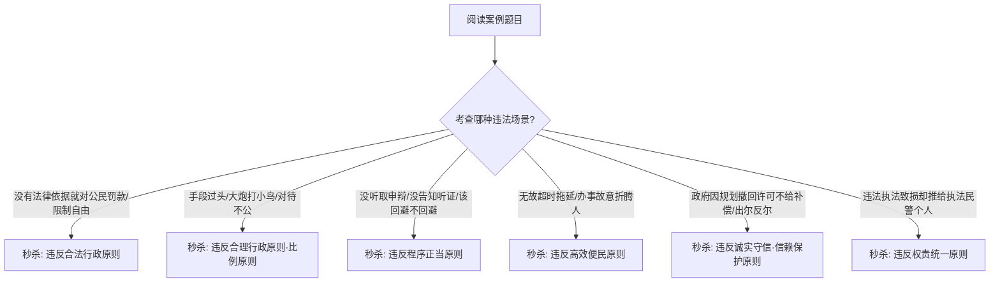

# 2026 法考冲刺备考指南：考点 1-1【行政法基本原则】考场秒杀手册

> 🎯 **唯一目标**：完全为了 2026 年 9 月 15 日客观题考试快速把题做对，摒弃无用死记硬背，凭因果逻辑与解题画面实现考场秒杀！
> 📌 **参考资料**：[行政法-客观题考点全景-深度报告.md](file:///Users/allen/Desktop/law/wiki/synthesis/%E8%A1%8C%E6%94%BF%E6%B3%95-%E5%AE%A2%E8%A7%82%E9%A2%98%E8%80%83%E7%82%B9%E5%85%A8%E6%99%AF-%E6%B7%B1%E5%BA%A6%E6%8A%A5%E5%91%8A.md#L98)

---

## 一、 第一步：【纯逻辑大白话】情景故事化背诵段落

想象你开了一家合法经营的农家乐。某天**行政机关**突然上门执法：

首先，因为“法无授权即禁止”，若没有**法律、法规、规章**的明确授权，执法人员**绝对禁止**凭空自创权力对你罚款或封门（**合法行政原则**）。

其次，执法时明明只需补办一张卫生许可证就能解决，执法人员若偏要“大炮打小鸟”，直接扣押你全套生产设备，这就严重违反了“损害最小”的**比例原则**（**合理行政原则**）。

再次，在作出任何不利决定前，他们**必须听取**你的陈述与申辩；当拟作出吊销许可证等重大处罚时，你要求**听证**，他们**绝对禁止**拒绝；如果执法队长是你对门仇人，他**必须回避**（**程序正当原则**）。

另外，如果你的申请材料齐全符合法定条件，**行政机关**必须在法定的**20日**（经批准最多延长**10日**）内办结许可，**绝对禁止**以领导出差或内部审核为由无故拖延（**高效便民原则**）。

后来，即使政府为了公共利益划定水源保护区，依法**撤回**你原本合法的许可，也**必须依法给予财产补偿**，绝不能打着公义旗号“白嫖”你；但如果你当初是用欺诈手段骗取许可而被**撤销**，则**绝对不予补偿**（**诚实守信·信赖保护原则**）。

最后，如果执法人员在执法中毁坏了你的财物，必须由**行政机关**承担赔偿责任并追责，**绝对禁止**将责任推给执法人员个人（**权责统一原则**）。

---

## 二、 第二步：2026 现行官方法条依据与官方检索地址

### 1. 2026 现行官方法条依据要义

| 法律名称与条号 | 核心原文要义与考点对应 | 考场秒杀关键点 |
| :--- | :--- | :--- |
| **《行政许可法》第 8 条** | 公民、法人或者其他组织依法取得的行政许可受法律保护，行政机关不得擅自改变。因公共利益需要依法变更或**撤回**行政许可的，给相对人造成财产损失的，应当依法给予**补偿**。 | 对应**诚实守信（信赖保护）原则**。“合法撤回 + 造成损失 = **必须补偿**”。 |
| **《行政许可法》第 69 条** | 被许可人以欺诈、贿赂等不正当手段取得行政许可的，应当予以**撤销**。被撤销的行政许可，**不予补偿**。 | **撤销（违法在先）vs 撤回（合法在后）**。欺诈骗取的撤销**绝对不给补偿**。 |
| **《行政许可法》第 42 条** | 除当场作出外，行政机关应当自受理许可申请之日起**二十日**内作出决定。二十日内不能作出的，经本机关负责人批准，可以延长**十日**。 | 对应**高效便民原则**。数字考点：**20日 + 10日**。 |
| **《行政处罚法》第 5 条** | 设定和实施行政处罚必须以事实为依据，与违法行为的事实、性质、情节以及社会危害程度相当。 | 对应**合理行政（比例原则）**。“处罚轻重必须与违法程度相当”。 |
| **《行政处罚法》第 6 条、第 63 条** | 当事人享有陈述权、申辩权；拟作出较大数额罚款、吊销许可证、责令停产停业等重大处罚前，应当告知并依申请组织**听证**。 | 对应**程序正当原则**。“拒绝听取陈述申辩或剥夺听证权的决定**一律违法**”。 |
| **《行政强制法》第 5 条** | 行政强制的设定和实施，应当适当。采用非强制手段可以达到行政管理目的的，**不得**设定和实施行政强制。 | 对应**合理行政（最小侵害原则）**。“能用非强制解决的，严禁强拆强扣”。 |

### 2. 官方权威检索地址

- **全国人大法律法规数据库**（国家级官方数据库）：`https://flk.npc.gov.cn/`
  - *检索路径*：进入首页搜索“行政许可法”/“行政处罚法”/“行政强制法” $\rightarrow$ 查看 2026 年现行有效文本 $\rightarrow$ 对应上述条号。
- **最高人民法院司法解释与案例库**：`https://www.court.gov.cn/` / `https://zgflfx.court.gov.cn/`

---

## 三、 第三步：考场秒杀·六大原则命题陷阱拆解

在 2026 年 9 月 15 日考场上，若遇到选项询问“某行政机关的行为违反了哪一原则”，直接用以下**一秒识别模型**秒杀答案：

### 考场解题三不要（绝对陷阱避坑）：
1. **不要混淆补偿与赔偿**：
   - 政府为了公共利益**合法撤回**许可给钱叫**补偿**；政府行使职权**违法致损**给钱叫**赔偿**。
2. **不要混淆撤销与撤回**：
   - 许可一开始就违法（如贿赂拿到许可） $\rightarrow$ **撤销** $\rightarrow$ **不予补偿**；
   - 许可一开始合法，后来因情势变更/公共利益需要 $\rightarrow$ **撤回** $\rightarrow$ **必须补偿**。
3. **不要把行政指导当成行政强制**：
   - 行政机关发布倡导性、劝导性信息（行政指导），不具有强制力，不适用行政强制程序的法定限制。