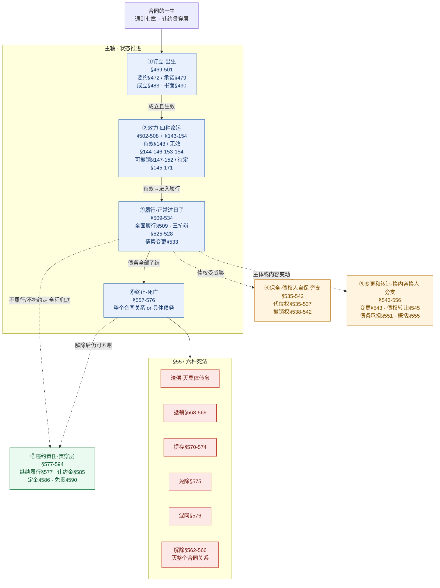

# 🗺️ 合同生命周期 · 总览（合同编通则七章 + 违约责任贯穿层的导航中枢）

> 一句话抓总：**合同的一生 = 通则七章一条主轴，违约责任在底下贯穿全程**。本页是 [[合同编]] 通则的导航地图——记不清某个制度归在哪一阶段、哪条法条、链向哪页时，回这里。各阶段细节进对应实体页 / [[民法-合同-解除模型]] 等答题模型页。
>
> 🔎 **法条范围已联网核实（2026-06-11）**：通则七章逐章命中[最高检官网民法典全文](https://www.spp.gov.cn/spp/ssmfdyflvdtpgz/202008/t20200831_478413.shtml)；效力章可撤销/无效条文（§143-157、§171）命中[上海发改委民法典 PDF](https://fgw.sh.gov.cn/cmsres/1e/1eb92d483e0f4bd4bd0d10cb43929d83/1640cc721a126f2064289ec21a8b12bc.pdf)；§155 自始无效 / §157 返还后果 与本仓 [[民法-合同-合同可撤销模型]] 已核实页一致。存疑条文一律回避不臆造。

## 一、三条核心洞见（先吃透这三句，全章不乱）

**铁则一·状态 vs 动作分层**：七章不是平铺的七堆知识点，而是「**状态轴 + 动作挂件**」。状态轴 = 合同从「出生→活着→死亡」的推进（订立→效力→履行→终止）；保全、变更转让是主轴旁逸出去的**动作旁支**；违约责任是垫在最底下的**贯穿层**。读题先定位「这道题问的是哪个状态 / 哪个动作」，制度归属就清楚了。

**铁则二·解除只是六死法之一，灭的范围不同**。§557 列了合同债权债务**终止的六种死法**：清偿、[[抵销]]、[[提存]]、[[免除]]、[[混同]]、[[解除]]。
- 其中**解除**灭的是**整个合同关系**（§562-566）；
- 其余五种（清偿 / 抵销 / 提存 / 免除 / 混同）灭的是**具体债务**——债灭了，但合同这个「壳」可能因别的债务仍在。
- 所以「合同解除」≠「合同终止」：解除是终止的一种特殊情形，别把范围搞反。详见 [[合同权利义务终止]] 与 [[民法-合同-解除模型]]。

**铁则三·「撤销」是两处不同含义的易混陷阱**。同一个「撤销」词，在生命周期里出现在两个完全不同的阶段、指两套制度：

| 出现位置 | 名称 | 法条 | 谁来撤 / 撤什么 | 效果 |
|---|---|---|---|---|
| **②效力阶段** | 可撤销合同 | §147-152 | **受损当事人**撤被坑的合同（重大误解 / 欺诈 / 胁迫 / 显失公平） | 撤销前有效、撤销后**自始无效**（§155），按 §157 返还 |
| **④保全阶段** | 债权人撤销权 | §538-542 | **债权人**撤债务人无偿 / 恶意低价处分财产、害及债权的行为 | 撤销该处分行为，恢复责任财产 |

> ⚠️ **看到「撤销」先问一句：谁在撤？** 当事人撤自己被坑的合同 → 走 [[合同可撤销]]（效力章 §147-152）；债权人撤债务人的逃债处分 → 走 [[撤销权]]（保全章 §538）。两套制度法条、主体、效果全不同，命题人最爱混着考。

## 二、一页脊柱图（主轴 + 旁支 + 贯穿层）

> 用法：先白纸默画「订立→效力→履行→终止」四个主状态，再把保全 / 变更转让两个旁支、违约责任贯穿层补上，最后打开本图对照查漏。

> 配色：主轴蓝、旁支橙、贯穿层绿、六死法红。

## 三、七阶段逐节展开（每节：动作 + 验真法条 + 链接）

### ①订立 · 出生（§469-501）

合同从无到有，四环推进：**缔约磋商 → 要约 → 承诺 → 成立**。

- **缔约磋商（成立前·还没合同）**：当事人为订立合同接触、谈判的阶段，合同**尚未成立**，只有**先合同义务**（诚信 / 告知 / 保密）。违反致对方受损 → **缔约过失责任**：假借磋商恶意谈判、故意隐瞒重要事实或提供虚假情况（§500）、泄露或不正当使用商业秘密（§501）。⚠️ **此阶段无违约责任、只有缔约过失**。→ [[缔约过失责任]]
- **要约**：§472 起（希望与他人订立合同的意思表示，须内容具体确定、表明经承诺即受约束）→ [[要约]] · [[要约的撤回]] · [[要约的撤销]]
- **承诺**：§479 起（受要约人同意要约的意思表示）→ [[承诺]] · [[迟到承诺]]
- **成立时间**：一般规则 §483（承诺生效时成立）；书面合同 §490（均签名 / 盖章 / 按指印时成立）→ [[合同成立]] · [[合同订立流程]]
- **格式条款**：§496-498（§496 提示说明义务、§497 无效情形、§498 解释规则）→ [[格式条款]]

> ⚠️ **要约邀请不在成立链上**（§473）：拍卖 / 招标公告、招股说明书、寄送的价目表、一般商业广告属**要约邀请**——只是「请你来报价」，**不受拘束、不能被承诺**；只有内容具体确定 + 表明经承诺即受约束的，才**视为要约**（§473 末段：商业广告内容符合要约条件的构成要约）。「**要约 vs 要约邀请**」是高频辨析点。→ [[要约邀请]]
> ⚠️ **预约 ≠ 磋商**：认购书 / 订购书 / 预订书等**预约合同已经成立**（§495），一方拒签本约违反的是**预约的违约责任**，**不是缔约过失**——别把预约误当磋商阶段。
> ⚠️ **成立 ≠ 生效**：订立解决「有没有这个合同」（成立），效力章才解决「这个合同算不算数」（生效）。详见 [[合同订立]]。

### ②效力 · 能不能活·四种命运（§502-508 + §143-154）

合同**已成立**后的法律评价。满足民事法律行为有效要件 §143（行为能力 + 真实意思 + 不违法不违背公序良俗）才有效；否则落入四种命运之一。统领页 → [[合同效力分级]]。

| 命运 | 典型情形 | 验真法条 | 链接 |
|---|---|---|---|
| **有效** | 满足三要件 | §143 | [[合同生效]] |
| **无效** | 无行为能力人 §144 / 虚假表示 §146 / 违法违背公序良俗 §153 / 恶意串通 §154 | §144·146·153·154 | [[合同无效]] |
| **可撤销** | 重大误解 §147 / 欺诈 §148-149 / 胁迫 §150 / 显失公平含乘人之危 §151（除斥期间 §152） | §147-152 | [[合同可撤销]] · [[民法-合同-合同可撤销模型]] |
| **效力待定** | 限制行为能力人非纯获利益 §145 / 无权代理待追认 §171 | §145·171 | [[合同效力待定]] · [[追认]] |

> 另有「**未生效**」一类（已成立但欠生效要件 / 附条件附期限未成就）→ [[合同未生效]]。
> ⚠️ 「可撤销」的撤销权属于**受损当事人**，撤销后**自始无效**（§155，返还按 §157）——与保全章债权人撤销权（§538）是两套制度，见上「铁则三」。

### ③履行 · 正常过日子（§509-534）

合同有效后的常态阶段：双方按约把债务清偿掉。核心是**全面履行原则**、**三大抗辩权**、**情势变更**。统领页 → [[合同的履行]]。

- **全面履行原则**：§509（按约定全面履行自己的义务）
- **向第三人 / 第三人代为**：向第三人履行 §522 → [[向第三人履行]]；第三人代为清偿 §523-524 → [[第三人代为履行]]
- **三大抗辩权**（互负债务时的「先别给」防御）：
  - 同时履行抗辩权 §525（无先后顺序）→ [[同时履行抗辩权]]
  - 先履行抗辩权 §526（有先后顺序，后履行方在先履行方未履行时拒绝）→ [[先履行抗辩权]]
  - 不安抗辩权 §527-528（先履行方有证据证明后履行方丧失履约能力时中止 + 通知 + 担保 + 解除）→ [[不安抗辩权]]
- **情势变更**：§533（合同基础条件发生订立时无法预见、非商业风险的重大变化）→ [[情势变更]]

> ⚠️ **情势变更 ≠ 不可抗力 ≠ 商业风险**：情势变更（§533，履行阶段，可再协商 / 请求变更或解除）与违约责任章的不可抗力免责（§590）是不同制度，别混。

### ④保全 · 债权人自保 旁支（§535-542）

主轴的旁支：债务人怠于行使权利 / 逃废债，债权人为保住自己的债权而向外伸手。两件武器：

- **债权人代位权** §535-537：债务人怠于行使**对次债务人的债权**，债权人**以自己名义代位行使**（§536 到期前保存性代位、§537 代位成立效果）→ [[代位权]]
- **债权人撤销权** §538-542：债务人**无偿处分**（§538）或**不合理低价 / 高价**（§539）处分财产害及债权，债权人请求法院**撤销该处分行为**（§540 范围、§541 除斥期间、§542 效果）→ [[撤销权]]

> ⚠️ 这里的[[撤销权]]是**保全章·债权人撤销权**（§538），撤的是债务人的逃债处分；与效力章[[合同可撤销]]（§147）当事人撤被坑合同是两回事——参见「铁则三」对照表。

### ⑤变更和转让 · 换内容 / 换人 旁支（§543-556）

主轴的另一旁支：合同**不死**，但**内容变了**或**当事人换了**。

- **变更**（换内容）：§543（协商一致可变更）、§544（约定不明推定未变更）
- **债权转让**（换债权人）：§545-550（§545 转让规则及例外、§550 增加的履行费用由让与人负担）→ [[债权转让]]
- **债务承担 / 转移**（换债务人）：§551-553（§551 转移须债权人同意、§553 新债务人可主张原债务人抗辩）→ [[债务承担]]
- **概括转移**（债权债务一起换）：§555-556（§555 一并转让须对方同意、§556 适用债权转让与债务转移规定）

> 与「债的法定移转」（继承、保险代位等法定情形）区别 → [[债的法定移转]]。

### ⑥终止 · 死亡·§557 六种死法（§557-576）

合同债权债务消灭的阶段。§557 列举**六种死法**，注意「灭具体债务」与「灭整个合同关系」的范围差（见「铁则二」）。统领页 → [[合同权利义务终止]]。

| 死法 | 灭的范围 | 验真法条 | 链接 |
|---|---|---|---|
| **清偿（履行）** | 具体债务 | §557 | （履行完毕，债消灭） |
| **抵销** | 具体债务 | §568-569（法定 / 约定抵销） | [[抵销]] |
| **提存** | 具体债务 | §570-574（条件 / 成立 / 通知 / 风险 / 5 年领取期） | [[提存]] |
| **免除** | 具体债务 | §575（债权人免除，债部分或全部终止） | [[免除]] |
| **混同** | 具体债务 | §576（债权债务同归一人，损害第三人除外） | [[混同]] |
| **解除** | **整个合同关系** | §562-566（协商 / 约定 / 法定解除 + 后果赔偿） | [[解除]] · [[民法-合同-解除模型]] |

> ⚠️ **撤销不属于终止**：终止是「合同**曾经有效**、现在消灭」；撤销是「合同**自始无效**、从头当没发生」——别把可撤销混进 §557 六死法。
> 📌 §567：合同终止**不影响结算和清理条款（含争议解决条款）的效力**。

## 四、⑦违约责任 · 贯穿层（§577-594）

不是某一个阶段，而是**垫在订立后全程底下的兜底层**：只要一方不履行 / 履行不符约定，对方即可主张违约责任。统领页 → [[违约责任]]。

- **继续履行 / 预期违约**：§577-581（金钱债务、非金钱债务强制履行限制、替代履行费用）→ [[继续履行]]
- **质量不符责任**：§582（修理 / 重作 / 更换 / 退货 / 减价）
- **损害赔偿**：§583-584（可得利益 + 可预见性规则）
- **约定违约金（及调整）**：§585 → [[民法-合同-违约金模型]]
- **定金**（数额上限、定金罚则、与违约金择一）：§586-588 → [[民法-合同-定金模型]]
- **不可抗力免责**：§590（≠ 履行章的情势变更 §533）
- **减损规则**：§591（防止损失扩大义务）
- **第三人原因违约**：§593（仍向对方担责，再向第三人追偿）

> ⚠️ **违约责任与解除并存**：合同解除后，解除权人仍可请求违约方承担违约责任（§566 + §577），不是二选一——详见 [[民法-合同-解除模型]] 第四步。

## 五、整章易混速查（命题人最爱搅一起的几对）

| 易混对 | 阶段 / 法条 | 一句话切开 |
|---|---|---|
| **撤销（可撤销合同） vs 撤销（债权人撤销权）** | ②§147 / ④§538 | 当事人撤被坑合同 vs 债权人撤逃债处分 |
| **解除 vs 终止** | ⑥§562 / §557 | 解除灭整个合同关系；终止含六死法，多数只灭具体债务 |
| **解除 vs 撤销 / 无效** | ⑥§566 / ②§155 | 解除＝有效合同喊停；撤销 / 无效＝自始无效 |
| **情势变更 vs 不可抗力** | ③§533 / ⑦§590 | 履行障碍可再协商变更 vs 违约免责事由 |
| **代位权 vs 撤销权** | ④§535 / §538 | 替债务人行使权利 vs 撤销债务人的处分行为 |
| **成立 vs 生效** | ①§483 / ②§143 | 有没有合同 vs 合同算不算数 |

## 六、🔄 动作 → 状态变化 → 后果（法考真正考的是「动」不是「静」）

> 用法：法考几乎不直接问「这个合同现在是什么状态」，而是问「**当事人做了某动作 → 合同状态怎么变 → 产生什么后果**」。读题先圈出**当事人的动作**，再顺着下表查到**状态跃迁**与**法条落点**。10 个高频转化背下来，多数合同动态题能秒判。

| 当事人的动作 | 合同状态变化 | 验真法条 + 一句考点 |
|---|---|---|
| ① **承诺生效**（诺成合同） | 未成立 → **成立** | §483 承诺生效时合同成立。⚠️ **实践（要物）合同例外**：须**交付标的物**才成立——自然人间借款自提供借款时成立（§679）、保管自交付保管物时成立（§890）、定金自实际交付定金时成立（§586）。承诺一致≠成立，没交付就不成立。 |
| ② **满足生效要件 / 条件成就 / 期限届至** | 已成立 → **生效** | §502 依法成立的合同自成立时生效（法律 / 约定另有规定除外）。**附生效条件**自条件成就时生效（§158）、**附生效期限**自期限届至时生效（§160）。→ [[合同生效]] · [[合同未生效]] |
| ③ **受损方在除斥期间内行使撤销权** | 可撤销（撤销前有效）→ **自始无效** | §147-152 受损当事人行使撤销权（重大误解 / 欺诈 / 胁迫 / 显失公平），经撤销的民事法律行为**自始没有法律约束力**（§155）。→ [[合同可撤销]] · [[民法-合同-合同可撤销模型]] |
| ④ **被代理人 / 法定代理人追认** | 效力待定 → **有效** | 限制行为能力人订立的合同经法代追认有效（§145）；无权代理经被代理人追认对被代理人发生效力（§171）。⚠️ **拒绝追认时**：限制行为能力人之合同不发生效力；无权代理则**「对被代理人不发生效力」**（§171），**不是「自始无效」**。→ [[合同效力待定]] · [[追认]] |
| ⑤ **先履行方行使不安抗辩权** | 正常履行 → **中止履行** | §527 列举四种中止事由（经营严重恶化 / 转移财产抽逃资金逃债 / 丧失商业信誉 / 其他丧失或可能丧失履债能力情形），先履行方有确切证据可中止履行（无确切证据中止应担违约责任）。→ [[不安抗辩权]] |
| ⑥ **公用事业用户补交欠费（及违约金）** | 中止（供应暂停）→ **恢复履行** | §654 供电人催告后用户合理期限仍不付电费和违约金可中止供电、中止前应事先通知；§656 供水 / 气 / 热**参照**适用。补费后合同关系存续须恢复供应。→ [[典型合同-多选-24]] |
| ⑦ **双方协商一致解除** | 履行中 → **解除** | §562 Ⅰ 当事人协商一致可以解除合同（约定解除）。→ [[解除]] · [[民法-合同-解除模型]] |
| ⑧ **一方根本违约、对方行使法定解除权** | 履行中 → **解除** | §563 ④ 当事人一方迟延履行债务或有其他违约行为致**不能实现合同目的**，对方可解除合同（法定解除）。→ [[民法-合同-解除模型]] |
| ⑨ **债务履行完毕（清偿）** | 有效履行中 → **终止** | §557 一 债务已经履行的，合同的权利义务终止。灭的是具体债务。→ [[合同权利义务终止]] |
| ⑩ **债权人受领迟延等情形依法提存** | 有效履行中 → **终止** | §557 三 债务人依法将标的物提存的，合同权利义务终止；提存规则 §570。→ [[提存]] |

> ⚠️ **两处易错，按民法典口径走，别照老资料**：
> - **无权代理**拒绝追认是「**对被代理人不发生效力**」（§171），不能写成「自始无效」——合同在本人与相对人间不发生效力，但行为人对善意相对人另负无权代理责任。
> - **无权处分**：在《民法典》下，无权处分**合同有效**（§597，处分人无处分权不影响合同效力，只是可能无法转移所有权、买受人可追违约责任），**不再按「效力待定」处理**。涉及无权处分务必按此口径，别混进上表第④行的效力待定。

## 七、💡 中止可逆洞见（绝大多数转化单向，「中止」是少数能回头的）

合同状态的跃迁**绝大多数是单向的、不可回头**：

- **解除了不能复活**——合同关系一旦解除即归于消灭（§562-566），不会自动恢复；
- **无效不能转有效**——自始无效（§155）就是从头当没发生，补正不了；
- **终止了不能续命**——§557 六死法消灭的债务（清偿 / 抵销 / 提存等）不会自行回流。

而「**中止履行**」是少数能**回头**的状态：

- **不安抗辩权**中止后，对方**提供适当担保的，应当恢复履行**（§528）——这是「中止 → 对方提供适当担保 / 恢复履约能力 → 恢复履行」可逆机制的条文落点（注意：§527 只规定中止事由，恢复机制全在 §528）。
- **公用事业合同**用户欠费被中止供应后，**补交欠费及违约金即恢复供应**（§654，§656 参照供水 / 气 / 热）。

这正解释了公用事业合同（供水电气热）「**只能中止、不能解除**」的原理：中止是「暂停、关系存续、可恢复」的可逆状态，恰好匹配强制缔约 + 公益性对供应方「不准把用户彻底踢出去」的要求——见本仓 [[典型合同-多选-24]]（供热拒费能中止不能解除）。

> ⚠️ **措辞别绝对化**：不要说中止是「唯一」可逆状态，只能说它是**少数 / 典型的可逆状态**。
> ⚠️ **别把「中间状态」当「可逆」**：**可撤销**、**效力待定**不是「可逆」，而是**会终局化的中间（待定）状态**——它们终将朝某一终点收口（撤销→自始无效 / 不撤销→确定有效；追认→有效 / 拒绝追认→不发生效力），不是来回切换。可逆（中止↔恢复）与待定（中间→终局）是两个不同概念，别混。

## 八、🎯 三步法 · 动态合同题应试技巧（找动作 → 判转化 → 定后果）

> 把第六节的转化表用成一套**做题动作**：见到合同动态题，按三步走。

1. **找动作**：圈出题干里**当事人做了什么**（承诺 / 交付 / 撤销 / 追认 / 催告 / 中止 / 解除 / 履行完毕 / 提存……）。
2. **判转化**：对照第六节表，确定这个动作把合同**从哪个状态推到哪个状态**，落到**哪条法条**。
3. **定后果**：根据转化后的状态，判定**法律后果**（成立 / 生效 / 自始无效 / 有效 / 须恢复 / 解除 / 终止 + 责任承担）。

**走查例：供热公司经催告后中止供热**

- **① 找动作**：圈出两个动作——「**催告**」（给合理期限补费）+「**中止供热**」（暂停供应）。
- **② 判转化**：正常履行 → **中止履行**（§654 供电人催告后合理期限仍不付费可中止；§656 供热参照供用电）。注意中止 ≠ 解除 ≠ 终止，**合同关系仍存续**。
- **③ 定后果**：用户**补交欠费及违约金后供应方须恢复供应**（中止是可逆状态，见第七节）；供应方**不能解除 / 终止**供热合同（强制缔约 + 公益性）；用户欠费仍负违约责任。

> 配套秒杀：选项见「**解除合同 / 终止合同**」供热场景 → 直接排除；见「**中止**」→ 再查「**催告 + 事先通知**」两道前置程序齐不齐。完整变形套路见 [[典型合同-多选-24]]。

## 相关页面

- 上层导航：[[合同编]] · [[合同总则-深度报告]] · [[合同编通则司法解释]]
- 各阶段统领：[[合同订立]] · [[合同效力分级]] · [[合同的履行]] · [[合同权利义务终止]] · [[违约责任]]
- 答题模型：[[民法-合同-解除模型]] · [[民法-合同-合同可撤销模型]] · [[民法-合同-违约金模型]] · [[民法-合同-定金模型]]
- 易混双撤销：[[合同可撤销]]（效力章 §147）↔ [[撤销权]]（保全章 §538）
