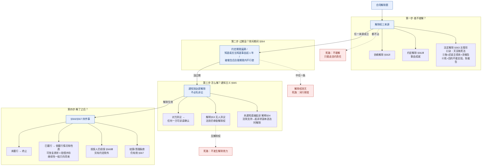

# 📐 合同解除 · 答题模型（能不能解 → 过期没 → 怎么解 → 解了之后）

> 凡"合同解除"题，按这四步走。**核心四件事**：①解除权从哪来 ②除斥期间 ③通知主义＋司法审查 ④解除后果。概念＋五情形故事详版 → [[解除]] 实体页。
> **适用真题**：[[合同通则-多选-13|C1-多选-13·五情形]] · [[合同通则-多选-16|C1-多选-16·解除程序]] · [[合同通则-多选-27|C1-多选-27·限购致目的不达]] · [[典型合同-多选-16|C2-多选-16·拒收解除]] · [[典型合同-多选-24|C2-多选-24·能中止不能解]]
>
> 🔎 **法条已联网核实（2026-06-10，3 路独立考证 + 对抗复核全 CONFIRMED·HIGH）**：§562-567 逐字命中[最高检官网](https://www.spp.gov.cn/spp/ssmfdyflvdtpgz/202008/t20200831_478413.shtml)；[《合同编通则解释》(法释〔2023〕13号)](https://www.court.gov.cn/fabu/xiangqing/419382.html) **§52 协商解除 / §53 通知解除＋异议合理期限＋司法审查 / §54 诉讼解除**。

## 🗺️ 一页流程图（用法：先白纸默画四步主干，再打开本图对照查漏）

## 一、核心考情

- **频率**：★★★★★ 顶级必考（最高法典型案例 + 司法解释§53 新规 + 法大法考必考 + 上海一中院 20 要点）；客观题常考，主观题"第二步"几乎必涉。
- **命题核心**：围绕"**有没有解除权 + 解除程序对不对**"出题，把"违约严重程度""催告有没有""通知 vs 诉讼""解除后能不能并赔"搅在一起设陷阱。
- **三大必考点**：①§563 五情形（尤其 **③催告 vs ④根本违约**）②**通知主义**§565（不必先诉讼）③**司法审查**§53（2024 新规：未异议也要查解除权）。

## 二、万能四步模型

### 第一步：能不能解除？（解除权三来源）

**铁则**：解除权来自三处——①**协商解除**（§562 Ⅰ 协商一致）②**约定解除**（§562 Ⅱ 约定的解除**事由**成就；法条原文是"事由"，旧法称"条件"）③**法定解除**（§563 五情形）。
**§563 五情形（口诀"天言拖死法"）**：① 不可抗力**致目的不能实现** ② 预期违约（履行期前明示/行为表明不履行主要债务）③ 迟延主要债务**经催告**后合理期限仍不履行 ④ 根本违约（迟延/其他违约**致目的不能实现**）⑤ 法律规定的其他情形（§610/§711/§722/§728 等）。
**★ 最爱考的辨析 ③ vs ④**：③＝**程序**路径（须**催告**、门槛是"迟延主要债务"，不要求目的落空）；④＝**实体**路径（**无须催告**、门槛是"**目的不能实现**"）。

**老王小李例子**（一辆车，把"三来源 + 五情形"逐个演一遍）
- **协商解除**（§562Ⅰ）：车买了俩人都后悔，一商量"不要了、互相退钱" → 协商一致 → 合同解除。
- **约定解除**（§562Ⅱ）：合同写明"小李首付逾 30 天不到账，老王有权解除"；第 31 天钱仍没到 → **约定事由成就** → 老王可解。
- **法定·①不可抗力**：婚礼用车，交车前夜台风把车砸毁、婚礼当天用不上 → 目的死 → 可解（**无须催告**）。
- **法定·②预期违约**：约定 9/1 交车，8/15 老王朋友圈明说"涨价了不卖了" → 履行期前明示不履行主要债务 → 小李可**立即**解。
- **法定·③催告无果**：老王到期不交车，小李**发催告函**给 15 天宽限，到期仍不交 → 可解（**必须先催告**）。
- **法定·④根本违约**：老王交的车**车架报废、永久不能开** → 目的死 → **无须催告**直接解。
- **法定·⑤法律其他**：小李把租老王的商铺改成赌场、砸墙打洞致损 → §711"致租赁物受损失" → 出租人老王可解。

### 第二步：解除权过期没？（除斥期间 §564）

**铁则**：①约定/法律有行使期限的，**期限届满不行使即消灭**；②没有期限的，自解除权人**知道或应当知道解除事由之日起 1 年**内不行使，**或经对方催告后合理期限内不行使** → 解除权**消灭**。
> ⚠️ 解除权是**形成权**，受**除斥期间**约束、**不适用诉讼时效中断**；过期就再也解不了，只能另寻违约救济。

**老王小李例子**（解除权会"过期"，三种过法）
- **有约定期限**：合同约定"解除权须在违约后 3 个月内行使"。老王第 4 个月才主张解除 → 已过约定期限 → **解除权消灭**。
- **无约定·满 1 年**：老王根本违约，小李**知道**后一直拖，13 个月后才发解除通知 → 超 1 年除斥期 → 消灭，只能就违约**另行索赔**。
- **被催告·合理期限**：老王违约后反过来催小李"你到底解不解，15 天内表态"。小李 15 天没动静 → 解除权也**消灭**（对方一催，你就得在合理期限内行使，否则视为放弃）。

### 第三步：怎么解除？（通知主义 §565 + 司法审查 §53）

**铁则（通知主义）**：依法解除应**通知**对方，合同自**通知到达**对方时解除——**不必先打官司**；通知若载明"逾期不履行则自动解除"，则期限届满未履行时解除。对方**有异议**的，**任何一方**（不只对方）可请求法院/仲裁**确认解除行为的效力**。未通知而**直接起诉/仲裁**解除并获支持的，合同自**起诉状/仲裁申请书副本送达**对方时解除（§54）。
> ⚠️ **2024 新规 §53（主观题第二步命题热点）**：一方以"对方未在异议期/合理期限内异议"为由主张已解除的，法院**仍应审查其是否真有解除权**——**有**解除权→自通知到达时解除；**无**→**不发生解除效力**（"有因解除"，告别旧法"不异议即解除"）。

**老王小李例子**（"怎么解"四种打开方式 + 一个翻车）
- **通知到达即解**：小李把解除通知**送到老王手上**那一刻，合同就解除了——**不用先打官司**。
- **通知载明自动解除**：小李通知"老王你 10 天内不交车，合同自动解除"。第 10 天老王仍没交 → 合同**第 10 天自动解除**。
- **异议→诉请确认**：老王不服，可起诉**请求法院确认"小李的解除无效"**；注意——**任何一方**都能提这个确认之诉，不只被通知的老王。
	- **收通知的老王**:不服 → 起诉请求确认"**小李的解除无效、合同还在**"。
	- **发通知的小李**:也能提 → 比如老王收了通知却装没事、还赖着不退车,小李可主动起诉请求确认"**我的解除有效**",拿个准信,省得僵着。
- **未通知·直接起诉**（§54）：小李没发通知，直接起诉解除。法院支持的，合同自**起诉状副本送到老王那天**解除（不是判决生效那天）。
- **⚠️ 翻车（§53 审查）**：小李其实**没有**§563 事由，硬发解除通知。哪怕老王没回话，法院仍要审查 → 认定**无解除权 → 解除不生效**（告别旧法"不异议就算解除"）。

### 第四步：解了之后？（§566 后果 + §567 结算条款）

**铁则**：①**尚未履行**的终止履行；**已经履行**的，依履行情况和合同性质可请求**恢复原状或补救措施，并有权请求赔偿损失**（**解除与损害赔偿并存**，不是二选一）；②**因违约解除**的，解除权人可请求违约方**承担违约责任**；③**主合同解除后，担保人仍承担担保责任**（除非担保合同另有约定）；④合同权利义务关系终止，**不影响结算和清理条款的效力**（§567）。
> ⚠️ **解除 ≠ 撤销**：解除是"**有效**合同提前喊停"（继续性合同一般向将来、非继续性买卖可溯及恢复原状）；撤销是"合同**自始无效**"。

**老王小李例子**（解除之后怎么算账，四件事）
- **恢复原状 + 赔偿并存**：老王根本违约、小李解除 → 已付 5 万**退回**（恢复原状），**同时**还能索赔因违约多花的钱（§566Ⅰ 二者**并存**，不是二选一）。
- **担保人仍担保**：老张曾给老王"按时交车/退款"做了保证。合同解除后老王要退款赔偿，**老张的保证责任不因解除消失**（§566Ⅲ，除非担保合同另有约定）。
	- **因为解除没让债务人的责任消失,只是把它"换了个形态"——担保继续兜的就是这个新形态的责任。**
	- 老王违约被解除后,他并不是一身轻,而是欠下**退款 + 赔偿损失**这些"解除后的清算责任"(§566Ⅰ)。钱还是欠着的。
	- 担保的**本来目的**就是防债务人违约赖账。而解除**往往正是债务人严重违约引起的**。要是"一解除、担保就跟着没了",等于债务人越违约、担保越失效,正好把担保**架空**——小李正因老王违约才解除,却同时丢了担保,太亏。
	- 所以 §566Ⅲ 让担保人**接着为债务人"解除后该承担的退款/赔偿责任"兜底**(除非担保合同另有约定)。
	- 放回例子:老王违约被解除 → 老王要退款赔偿 → **老张的保证就罩在这笔退款赔偿上**,不因解除消失。
	- ⚠️ 一个易混点别踩:这跟"主合同**无效**,担保一般也无效"不一样——**解除≠无效**。解除不消灭债务人的责任,只是转成清算赔偿,担保顺势跟到这笔责任上;而无效是自始没有效力,那是另一条线。
- **结算条款独立**：合同里"争议交某仲裁委"的条款，解除后**照样有效**（§567）——所以解除后还能按它去仲裁。
- **解除 ≠ 撤销**：买卖解除可**溯及**（退车退钱回到原点）；但"租车"这种**继续性**合同，解除一般**只向将来**（已经用掉的租期不退）。

	- "**不再向未来**" ✅:解除后,没履行的部分全停,合同朝前的效力终止——这点所有解除都一样。
	- "**把过去还原回去**" ⚠️ 看合同性质(§566Ⅰ"根据**履行情况和合同性质**"决定要不要恢复原状):

## 解除 总结

| 合同类型                   | 解除溯及力      | 过去还原吗                       |
| ---------------------- | ---------- | --------------------------- |
| **非继续性**(买卖、一次性给付)     | **有**溯及力   | ✅ 还原:退车退钱回到原点               |
| **继续性**(租赁、雇佣、服务、供热供电) | 一般**只向将来** | ❌ 不还原:已用掉的租期/已享受的服务不退,只是往后停 |

所以更准的说法是:**解除 = 合同往后停;至于过去要不要倒回去,买卖类能倒(恢复原状),租赁服务类一般不倒(只朝前断)。**

顺带把它和撤销分清:
- **解除**:合同**本来有效**,中途喊停;能不能倒回过去看性质。
- **撤销**:合同**自始无效**,**一律**全部倒回原点(从头当没发生过)。

一句话:**你说的"不向未来"完全对;"还原过去"只在买卖这类非继续性合同成立,租赁这类继续性合同解除只断未来、不退过去。**

### ⚠️ 易混提示：法定解除 vs 约定解除 vs 任意解除

| 类型 | 触发 | 要不要对方违约 | 法条 |
|---|---|---|---|
| **法定解除** | §563 五情形 | 多数要（不可抗力除外） | §563 |
| **约定解除** | 约定的解除事由成就 | 看约定 | §562 Ⅱ |
| **任意解除** | 法律特许的"随时解除" | **不要**（但常需赔信赖损失/损失） | 委托§933 · 承揽（定作人）§787 · 不定期租赁§728 等 |

→ **任意解除**是典型合同的特别规则，别套 §563：[[典型合同-单选-13|委托任意解除]] · [[典型合同-多选-11|承揽定作人任意解除]] · [[典型合同-多选-13|律所随时解除]]。

## 三、命题人最爱的 5 个陷阱（自测卡 · 先心里作答，再点开对答案）

> [!question]- 卡①｜对方有点小违约，我能直接解除合同吗？
> **不能！** ③路径须**催告**后合理期限仍不履行，④路径须**致合同目的不能实现**——轻微违约两条路都走不通。能解的只有 §563 五情形（口诀「天言拖死法」：天=不可抗力毁目的 · 言=预期违约 · 拖=催告无果 · 死=根本违约 · 法=法律其他规定）。

> [!question]- 卡②｜解除合同必须先去法院打官司吗？
> **不必！** **通知主义**（§565）：解除通知**到达**对方时合同即解除；未通知直接起诉/仲裁**并获支持的**，自**起诉状/仲裁申请书副本送达**对方时解除（§54）——不是判决生效那天。

> [!question]- 卡③｜对方不同意解除，是不是就解不了？
> **错！** 解除权是**形成权**，通知到达即生效，不以对方同意为条件；对方不服只能**诉请确认解除效力**（§565，任何一方都可提），异议本身**不阻止**解除生效。

> [!question]- 卡④｜我发了解除通知，对方没提异议，合同肯定解除了吧？
> **不一定！** §53（2024 新规）：即使对方未异议，法院**仍要审查**你有没有解除权——**有** → 自通知到达时解除；**没有** → **不发生解除效力**（告别旧法「不异议即解除」）。

> [!question]- 卡⑤｜合同解除了，就不能再索赔了？
> **错！** **解除＋赔偿损失并存**（§566Ⅰ），不是二选一；且主合同解除后**担保人仍承担担保责任**（§566Ⅲ，除非担保合同另有约定）。

> [!question]- 兜底卡｜解除权拿在手里，永远有效？
> **会过期！** 解除权是形成权、受**除斥期间**约束（§564）：约定/法律有行使期限的，届满不行使即消灭；没有的，自**知道或应当知道解除事由起 1 年**，或**经对方催告后合理期限**内不行使 → **消灭**，只能另寻违约救济。不适用诉讼时效中断。

## 四、真题演练（套四步模型）

### 范例①：[[合同通则-多选-13|C1-多选-13]]（哪些情形甲方可解除）→ **ABC**
- 第一步·定性：A 大风雨毁场地致婚礼办不成＝§563**①**不可抗力毁目的 ✅；B 乙明确表示不履行＝§563**②**明示预期违约 ✅；C 建设工程乙迟延+催告后仍不履行＝§563**③**催告无果 ✅；D 商铺"长期闲置"不构成 §711"**致租赁物受损失**"→ **不能解**。
- → **ABC** ✅（D 的坑：§711 缺"致损失"要件）。

### 范例②：[[合同通则-多选-16|C1-多选-16]]（根本违约的解除程序）→ **ACD**
- A 根本违约**可解**（§563④）✅；B"**须诉讼**才能解除"❌——**通知主义**，通知到达即解（§565）；C 对方可**诉请确认**解除效力 ✅（§565 异议权·任何一方）；D 解除**＋赔偿损失并存** ✅（§566）。
- → **ACD** ✅（B 错在把通知主义说成必须诉讼）。

### 范例③：[[典型合同-多选-24|C2-多选-24]]（供热拒交费：能中止不能解除）→ 对照
- 用户欠费，供热方经催告可**中止供热**，但供用热力等**公用事业合同关系民生**，一般**不能解除**——考"**中止 ≠ 解除**"的区分，提醒解除门槛与公共属性限制。

## 相关页面

- 概念主页：[[解除]]（§562-566 + 五情形老王小李故事 + §53 审查新规）
- 上层：[[合同权利义务终止]] · [[合同总则]] · [[合同编]]
- 横向：[[违约责任]]（解除＋赔偿并存）· [[抵销]] · [[提存]]（同属"终止"板块）
- 综合报告：[[合同总则考点-深度报告]]（六·终止 第 2 行）
