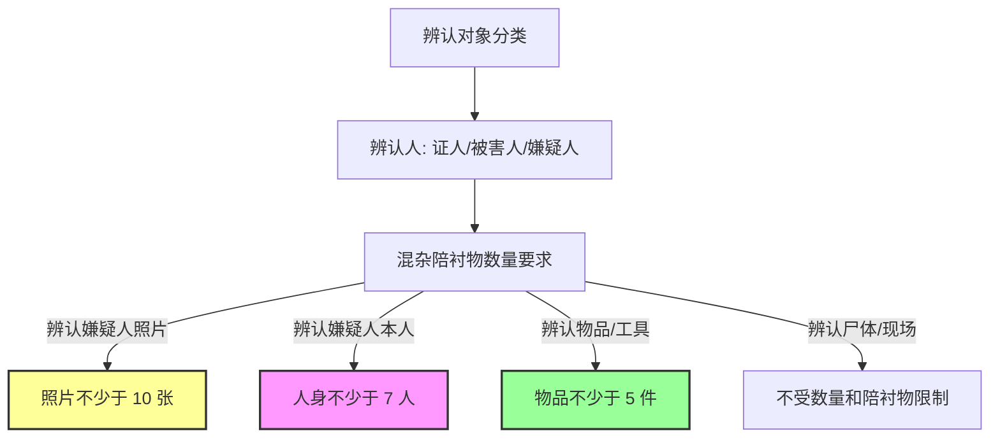
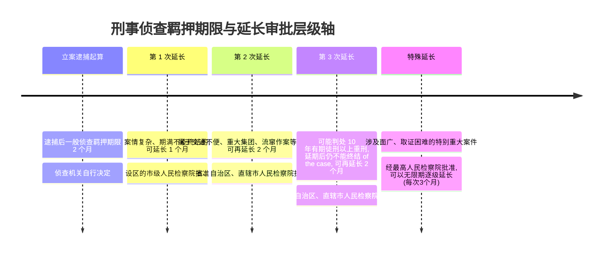

# 刑诉-侦查与监察制度-深度报告

本报告系统梳理了我国《刑事诉讼法》、《监察法》以及相关公安、检察司法解释中关于刑事侦查与监察机关调查的程序规则与限制边界。内容涵盖讯问与询问、勘验检查与搜查扣押、技术侦查与特殊侦查手段、辨认与通缉、侦查羁押期限以及监察与刑诉的衔接机制。

---

## 一、 讯问与询问程序及限制对照表

在刑事侦查中，对被追诉人（嫌疑人/被告人）的讯问与对证人、被害人的询问在程序法上具有本质的区别。

| 程序要件 | 讯问犯罪嫌疑人（Interrogation） | 询问证人 / 被害人（Questioning） |
|---|---|---|
| **适用对象** | 仅限于已被正式刑事立案的**犯罪嫌疑人**或**被告人** | 被害人、证人、对案情知情的普通人 |
| **场所要求** | 1. 传唤/拘传：应当到指定的办案场所或在其住处进行。 2. 拘留/逮捕送所后：**必须在看守所内进行**，严禁私自提到看守所外讯问。 | 1. 证人单位、住处或其提出的地点； 2. 公安机关/检察院（**必须出示证件**，且**非传唤性质**）； 3. 聚众斗殴等突发案发现场可当场询问； 4. 严禁使用传唤证人等强制性手段强迫其到案。 |
| **时限限制** | 传唤、拘传持续时间不得超过 **12 小时**；案情特别重大、复杂需要采取拘留、逮捕措施的，最长不得超过 **24 小时**。期间应保证其必要的食宿和休息时间（严禁变相疲劳审讯）。 | 法律未限制询问时长，但应当保障证人的正常生活，不得采取变相拘束手段（例如称“不交代就不让走”）。 |
| **音像记录** | 1. 故意杀人、强奸、抢劫等可能判处死刑、无期徒刑的重罪案件或重大毒品、涉黑等案，**应当进行全程录音录像**； 2. 其他案件可以录音录像； 3. 嫌疑人无权拒绝或要求关闭录音录像。 | 询问证人/被害人一般不要求录音录像；对于人数众多的被害人或性侵案等，为保护隐私或固定证据，可以录音录像。 |
| **特殊保护** | 1. 聋哑人：应当有通晓手语的人参加，并写入笔录； 2. 未成年人：应当通知其法定代理人到场，无法到场的，应当通知其他合适成年人到场。 | 1. 询问未成年被害人，应当尽量减少频次，防止二次伤害； 2. 询问证人应当**个别进行**，但可以进行必要对质。 |
| **权利告知** | 首次讯问时，应当告知其有权委托律师、申请回避以及认罪认罚从宽的法律规定。 | 告知其应当如实提供证据、证言，以及作伪证的法律责任。 |

---

## 二、 勘验、检查、搜查、查封扣押与电子数据取证规范对照表

物证、书证以及电子数据的提取和固定，必须严格依照法定证明文件与程序办理。

| 调查行为 | 决定与审批程序 | 见证人与记录规范 | 特殊程序与限制规则 |
|---|---|---|---|
| **现场勘验** | 侦查人员对犯罪现场、物品、尸体进行物理查验。无须特定证件，但须迅速开展。 | 应当有见证人（如村干、邻居等）在场。勘验笔录须由侦查人员、见证人、相关当事人签名。 | 见证人非诉讼参与人，但由于涉黑/凶杀等危险，可依法申请人身安全保护。 |
| **身体检查** | 侦查人员为确定被害人或嫌疑人的某些特征、伤情，对其身体进行检验。 | 检查被害人身体，应当经被害人同意。**检查妇女身体，应当由女工作人员或者医师进行**。 | 对嫌疑人可强制检查；对被害人（如未成年幼女）必须经其及法定代理人同意，严禁强行检查。 |
| **人身搜查** | 搜查必须持有**《搜查证》**。 （**例外**：执行拘留、逮捕时，遇有紧急情况如可能隐匿武器、毁灭证据，无搜查证亦可搜查）。 | 应当有被搜查人或者他的家属、邻居或者其他见证人在场。搜查笔录由侦查人员、被搜查人/家属签名。 | 搜查对象为嫌疑人住宅、身体或相关处所；被搜查人同意**不能**作为无证搜查的替代理由（法无“同意即无证搜查”的例外）。 |
| **查封、扣押** | 查封扣押与案件有关的财物、文件（包括股票、基金账户等）；扣押邮电须经公安局长批准。 | 必须开列《查封、扣押物品清单》，记明财物名称、数量。物品名称数量不清的，不得作为证据。 | **无关财物限期退还**：经查明确实与案件无关的财物、文件，应当在 **3 日内**解除查封、扣押、冻结并予以退还。 |
| **电子数据提取** | 1. 提取原始介质（U盘、硬盘）须伴随笔录清单并在 **24小时内封存**； 2. 无法提取原始介质的可采用在线提取或复制。 | 1. 原始介质拆封过程**必须录像记录**； 2. 未封存且不能补正或作出合理解释的电子数据，**一律排除**，不得作为定案根据。 | 对电子数据专门性问题，侦查机关可委托公安部指定的专业机构或司法鉴定所出具**检验报告**（可作为定案依据）。 |

---

## 三、 技术侦查与特殊侦查手段审批权限表

技术侦查（监听、定位等）、隐匿身份侦查（卧底）以及控制下交付属于强限制性手段。📐 完整答题模型见 [[刑诉-侦查-技术侦查措施模型]]（三关：审批层级与适用条件→期限与变更规则→证据资格与庭外核实）。

> ⚠️ **2026-07-08 订正**：下表"隐匿身份侦查""控制下交付"两行的批准机关，原表述为"设区的市级以上公安机关负责人"和"省、自治区、直辖市公安厅（局）"，与本次入库的 9 张真题卡（单选-11、多选-21/23/25/27 五卡独立印证一致）"考点精解"不符——**真题材料一致显示二者均由"县级以上公安机关负责人"批准，审批层级低于技术侦查**。已按真题材料订正，原表述保留删除线以留痕；若后续联网核验发现真题材料有误，请再改回。

| 侦查手段类别 | 决定/审批机关 | 有效期限与延长限制 | 证据采信与转化限制 |
|---|---|---|---|
| **技术侦查措施** （如电话监听、手机定位、行踪监控） | 必须由**设区的市级以上公安机关**（或同级分检以上检察院）批准，并报请特定执行部门执行。 | 批准决定自签发之日起 **3 个月**内有效；对于复杂、疑难案件，期满前可申请延长，**每次延长不得超过 3 个月**（🆕2026-07-08：真题材料显示法律未设累计总期限上限，"每次延长不得超过3个月"仅指单次延长期限，非总期限封顶）。 | 收集的材料可直接作为定案依据，但须经法庭调查程序查证属实，或由审判人员在庭外核实。涉及国家秘密、商业秘密、个人隐私的，应当在庭审中予以保密（非"不能作证据"）；材料只能用于本案刑事诉讼的侦查、起诉、审判，不得移交行政机关；与案件无关的材料应当及时销毁。 |
| **隐匿身份侦查** （即卧底侦查） | ~~必须由设区的市级以上公安机关负责人批准~~ → **由县级以上公安机关负责人批准**（🆕2026-07-08订正，审批层级低于技术侦查）。 | 根据侦查需要确定，但必须严格限制在**立案后**对严重犯罪案件实施；派遣人员须具有执法身份（协助的被取保人/线人不算）。 | 隐匿身份侦查取得的证据，其转化与采信适用普通证据链审查规则。 |
| **控制下交付** | ~~根据我国缔结的国际条约或办案需要，经省、自治区、直辖市公安厅（局）批准~~ → **由县级以上公安机关负责人批准**（🆕2026-07-08订正，不需省级公安厅）。 | 属于专项侦查行动，依据案件运输线路协调监控；实施对象含重大毒品犯罪等严重危害社会的犯罪案件。 | 实施时不能诱发他人产生原本没有的犯罪意图（禁止诱惑侦查/犯意诱导，否则排除）。 |

---

## 四、 辨认与通缉法定规则要点表

辨认与通缉是锁定嫌疑人的关键侦查步骤，具有严格的数值与程序红线。

### 1. 辨认的核心程序规则
- **个别进行**：多人辨认同一对象的，应当由辨认人**个别进行**，防止互相暗示或串通。
- **照片直接辨认无效**：不能先给辨认人看嫌疑人单张照片，然后再进行混杂辨认并制作笔录，该程序属于严重违法，辨认意见不能采信。
- **保护性辨认**：为了保护证人/被害人安全，辨认可以在不暴露辨认人身份的屏蔽室或单向玻璃后进行。
- **见证人要件**：辨认应当有见证人在场并签名。无同步录音录像或无见证人签名的，在能够合理解释或补正的前提下，不属于绝对排除证据，但影响证明力。

### 2. 通缉的决定与发布权限制
- **前提条件**：通缉对象必须是**应当逮捕的犯罪嫌疑人，且在逃**。未采取逮捕决定或仅传唤逃匿的，不符合通缉条件。
- **发布权专属公安**：通缉令的决定和发布权**专属公安机关**。
- **检察自侦案的处理**：人民检察院直接受理侦查的案件，如果需要通缉犯罪嫌疑人，**应当作出通缉决定，送请公安机关发布通缉令**（检察院本身无权对外发布通缉令）。
- **层报发布管辖**：市公安局在其管辖区域内可以直接发布通缉令；如果超出管辖区域，应当报请有决定权的上级公安机关（省公安厅或公安部）发布。

---

## 五、 侦查羁押期限计算与重新计算体系表

侦查羁押期限是指对已被逮捕的犯罪嫌疑人进行侦查的法定最长羁押时间。

### 侦查羁押期限的“重新计算”与“重新起算”
1. **发现另有重要罪行（重新起算）**：在侦查期间，发现犯罪嫌疑人另有重要罪行的，自发现之日起，**重新计算侦查羁押期限**（须经公安机关负责人批准，并报检察院备案）。
2. **不讲真实姓名、住址（重新计算）**：犯罪嫌疑人不讲真实姓名、住址，身份不明的，**侦查羁押期限自查清其身份之日起计算**（但不得停止对其犯罪行为的侦查取证）。

---

## 六、 监察机关留置与刑事诉讼管辖移送起诉衔接表

监察调查是针对职务犯罪的法定程序，与刑事诉讼存在严格的分工与衔接。

| 业务环节 | 监察法调查程序规范 | 刑事诉讼法衔接规则 |
|---|---|---|
| **留置措施审批** | 监察机关对涉嫌贪污贿赂、失职渎职等严重职务犯罪的被调查人，可采取**留置**措施。设区的市级留置须经**本级监察委领导集体研究决定并报省级监委批准**。 | 留置期限最长为 3 个月；特殊情况下经批准可延长 3 个月。留置一日折抵管制一日，折抵拘役、有期徒刑一日。 |
| **管辖权与并案侦查** | 监察机关管辖所有公职人员的职务犯罪案件（留置）。 | 检察院管辖司法工作人员利用职权实施的侵犯人身权利、民主权利的14种犯罪（如刑讯逼供、暴力取证、徇私枉法等）。 **移送并案原则**：若一人犯数罪，既涉及监察管辖的受贿罪，又涉及检察管辖的徇私枉法罪，**应当由监察机关为主调查，检察院应将线索和案件移送监委**。 |
| **案件移送起诉衔接** | 监察机关调查终结后，制作起诉意见书，连同案卷材料，移送人民检察院审查起诉。 | 1. 检察院在收到移送后，应当由**办案（捕诉）部门**进行审查，对符合逮捕条件的，应当依法予以逮捕。 2. 检察院对监察移送案具有自行补充调查权；但在调查期间，若需调阅监察讯问录像，应与监察委协商，不能单方下指令。 |
| **认罪认罚从宽告知** | 监察机关在调查阶段，对被调查人主动认罪认罚的，可以在移送意见书中提出从宽处罚的建议。 | 检察院在审查起诉阶段，应当告知被调查人诉讼权利及认罪认罚从宽的规定，并签署认罪认罚具结书。 |

---

## 七、 考点与真题挂接表

| # | 考点分类 | 法定法条依据 | 考频评估 | 已挂接真题卡 (V1) |
|---|---|---|---|---|
| 1 | **讯问犯罪嫌疑人地点与程序** | 刑诉法§118-124 | ★★★★★ | [[刑诉-侦查-单选-01]] V1 · [[刑诉-侦查-多选-02]] V1 · [[刑诉-侦查-多选-03]] V1 · [[刑诉-侦查-多选-05]] V1 · [[刑诉-侦查-多选-07]] V1 |
| 2 | **询问证人/被害人地点与限制** | 刑诉法§124-129 | ★★★★ | [[刑诉-侦查-单选-02]] V1 · [[刑诉-侦查-单选-03]] V1 · [[刑诉-侦查-多选-01]] V1 · [[刑诉-侦查-多选-06]] V1 · [[刑诉-侦查-多选-07]] V1 |
| 3 | **勘验、检查与搜查见证人** | 刑诉法§131-139 | ★★★★ | [[刑诉-侦查-单选-04]] V1 · [[刑诉-侦查-单选-05]] V1 · [[刑诉-侦查-单选-06]] V1 · [[刑诉-侦查-多选-09]] V1 · [[刑诉-侦查-多选-10]] V1 |
| 4 | **查封、扣押、冻结财物限制** | 刑诉法§141-145 | ★★★★★ | [[刑诉-侦查-多选-10]] V1 · [[刑诉-侦查-多选-11]] V1 · [[刑诉-侦查-多选-12]] V1 · [[刑诉-侦查-多选-13]] V1 |
| 5 | **电子数据取证与检验报告规范** | 电子数据司法解释 | ★★★★★ | [[刑诉-侦查-单选-07]] V1 · [[刑诉-侦查-多选-14]] V1 · [[刑诉-侦查-多选-15]] V1 · [[刑诉-侦查-多选-16]] V1 · [[刑诉-证据-多选-43]] V1 |
| 6 | **司法鉴定人负责与质证规则** | 刑诉法§146-149 | ★★★ | [[刑诉-侦查-多选-06]] V1 · [[刑诉-侦查-多选-17]] V1 |
| 7 | **技术侦查、监听与控制下交付** · 📐 [[刑诉-侦查-技术侦查措施模型]] | 刑诉法§150-154 | ★★★★★ | [[刑诉-侦查-单选-11]] V1 · [[刑诉-侦查-多选-21]] V1 · [[刑诉-侦查-多选-22]] V1 · [[刑诉-侦查-多选-23]] V1 · [[刑诉-侦查-多选-24]] V1 · [[刑诉-侦查-多选-25]] V1 · [[刑诉-侦查-多选-26]] V1 · [[刑诉-侦查-多选-27]] V1 · [[刑诉-侦查-多选-28]] V1 |
| 8 | **辨认陪衬物数量与见证人签名效力** | 公安部规定§251 | ★★★★ | [[刑诉-侦查-单选-08]] V1 · [[刑诉-侦查-单选-09]] V1 · [[刑诉-侦查-多选-18]] V1 · [[刑诉-侦查-多选-19]] V1 |
| 9 | **通缉令决定权与发布权界分** | 刑诉法§155 | ★★★ | [[刑诉-侦查-单选-10]] V1 · [[刑诉-侦查-多选-20]] V1 |
| 10 | **侦查羁押期限延长与重新起算** | 刑诉法§156-160 | ★★★★★ | [[刑诉-侦查-多选-30]] V1 · [[刑诉-侦查-多选-31]] V1 |
| 11 | **监察留置审批与刑诉管辖衔接** | 监察法§22-45 | ★★★★★ | [[刑诉-侦查-多选-08]] V1 · [[刑诉-侦查-多选-29]] V1 · [[刑诉-侦查-多选-32]] V1 · [[刑诉-立案-单选-05]] V1 |
