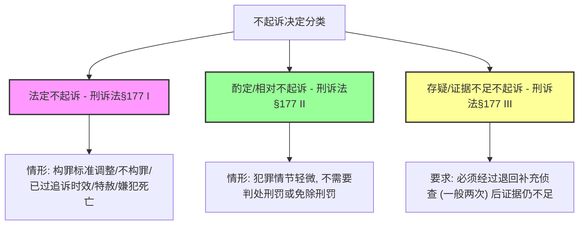

# 刑诉-审查起诉与不起诉制度-深度报告

本报告系统梳理了我国《刑事诉讼法》、《人民检察院刑事诉讼规则》以及《监察法实施条例》等法规中关于审查起诉与不起诉制度的核心规则、救济途径与衔接机制。

---

## 一、 审查起诉阶段核心处理规则对照表

审查起诉是检察机关对侦查终结的案件进行全面审查，决定是否提起公诉的诉讼阶段。

| 业务板块 | 法定规则要点 | 命题陷阱与易混淆点 | 对应真题 |
|---|---|---|---|
| **涉案赃物返还** | 1. 审查起诉期间，对于**权属明确、不需作证据使用的被害人合法财产**，检察院应当直接决定发还被害人； 2. 权属不清的，随案移送，由法院在判决中处理。 | ❌ 错在“必须随案移送，检察机关无权直接发还”。法律赋予检察院直接发还被害人合法财产的职权。 | [[刑诉-起诉-单选-03]] |
| **退回补充侦查与新罪发现** | 1. **退侦次数上限**：退回补充侦查以**两次为限**（每次最长一个月）； 2. **退侦期满发现新罪**：若两次退侦届满后，发现嫌犯还涉嫌其他新罪，**不得再次退回补充侦查**；应当对已查清的罪行提起公诉，将新罪线索**移送公安机关重新立案侦查**。 | ❌ 错在“将新罪并入原案，第三次退回补充侦查”或“对全案退回公安机关”。原案已达退侦上限，必须对已查清部分提起公诉。 | [[刑诉-起诉-单选-01]] · [[刑诉-起诉-单选-03]] |
| **跨诉讼管辖罪名处理** | 侦查机关移送起诉的罪名（如非国家工作人员受贿罪），如果检察院审查后认为事实清楚但管辖不属于监察（应属公安立案侦查），**应当直接向法院提起公诉**，而不得以管辖错误为由将案件退回监察机关或公安机关。 | ❌ 错在“认为管辖不符，必须退回移送机关重新侦查”。审查起诉阶段只审查实体与程序是否构罪，只要事实清楚，检察院可直接起诉。 | [[刑诉-起诉-单选-03]] · [[刑诉-起诉-单选-04]] |

---

## 二、 法律援助与值班律师制度规范表

在审查起诉中，犯罪嫌疑人的辩护权与法律帮助权得到值班律师与法律援助制度的刚性保障。

| 核心制度 | 权利冲突与协作规则 | 履行方式与法律效力 |
|---|---|---|
| **委托辩护优先原则** （法律援助指派冲突） | 1. 嫌疑人自愿接受法律援助指派，但其近亲属为其另行委托辩护律师的，**优先尊重嫌疑人的自主选择**（即嫌疑人同意接受委托的，指派律师应当退出）； 2. 嫌疑人明确拒绝委托而选择援助律师的，以嫌疑人本人意思为准。 | 法律援助属于保障性措施，犯罪嫌疑人自行委托辩护人的权利具有更高的顺位和优先性。 |
| **认罪认罚具结在场** （值班律师见证效力） | 1. 签署认罪认罚具结书时，辩护律师（若有）**必须在场**；值班律师仅在嫌疑人**没有辩护人**时提供法律帮助并见证； 2. 辩护律师因客观原因不能到场的，**值班律师不得代为见证**； 3. 签署具结书原则上要求在场，但在押情况下可通过**远程视频方式**进行见证。 | ❌ 错在“辩护律师无法到场时，检察院可安排值班律师见证具结”。值班律师与辩护律师职责不同，不能相互混淆或替代。 |
| **未成年人法律援助** | 对于不满 18 周岁的未成年人，若没有委托辩护人，法律援助机构**应当为其指派辩护律师**提供辩护，而非仅仅指派值班律师提供法律帮助。 | 未成年人属于“强制辩护”的法定对象，必须指派具有辩护人身份的律师，而非仅起见证作用的值班律师。 |

---

## 三、 不起诉三大分类（法定、酌定、存疑）深度对比表

不起诉决定是人民检察院终止刑事诉讼、对嫌疑人不提起公诉的终局决定。

| 维度对比 | 法定（绝对）不起诉（§177 I） | 酌定（相对）不起诉（§177 II） | 存疑（证据不足）不起诉（§177 III） |
|---|---|---|---|
| **适用前提** | 具有《刑事诉讼法》第 16 条规定的六种情形之一（如**行为不构成犯罪**、特赦免刑、时效届满、**嫌疑人死亡**等）。 | 犯罪嫌疑人实施了犯罪行为，但**犯罪情节轻微**，依照刑法规定**不需要判处刑罚或者免除刑罚**的。 | 案件事实不清，证据不足，且**经退回补充侦查后**，检察院仍然认为证据不足，不符合起诉条件的。 |
| **解释变更影响** | 审查起诉期间，最高司法机关发布新解释调整入罪标准，导致嫌疑人行为不构罪的，**属于法定不起诉**。 | 属于不构罪的实体变更，不属于情节轻微的酌定范围。 | 核心证据被污染或排除（如排除刑讯逼供口供），导致其他证据显然不足的，属于存疑不起诉。 |
| **退侦前置要件** | **无须**经过退回补充侦查，只要查明符合法定情形，即可直接作出。 | **无须**退回补充侦查，只要情节轻微不需要判刑即可作出（谅解或自首是考量情节，非前置条件）。 | **必须经过退回补充侦查**（一般为两次，特定简易案为一次）；未经退侦直接作存疑不起诉属于**程序违法**。 |
| **再次起诉限制** | 不起诉决定作出后，除发现认定事实确有错误且嫌疑人构成犯罪外，原则上不得撤销或再次起诉。 | 作出决定后，一般不得撤销。但如果被不起诉人申诉成功，检察院可改写决定内容。 | **可以再次起诉**：不起诉决定作出后，如果**发现新的证据**，符合起诉条件的，检察院可以再次提起公诉。 |
| **被不起诉人申诉** | 被不起诉人**无权申诉**（因为法定不起诉宣告其无罪，对其完全有利，无申诉必要）。 | 被不起诉人如果认为自己根本无罪，对酌定不起诉的“构罪免刑”定性不服，**可以自收到决定书7日内申诉**。 | 被不起诉人如果对“证据不足”的存疑定性不服，认为自己根本未实施任何行为，**可以自收到决定书7日内申诉**。 |

---

## 四、 不起诉决定后的救济途径对照表

不起诉决定作出后，被不起诉人与被害人均享有法定的申诉或自诉救济通道，但路径和程序存在严格差异。

| 救济主体 | 救济路径一：申诉（向检察机关） | 救济路径二：自诉（向人民法院） | 双轨程序的冲突与协调规则 |
|---|---|---|---|
| **被害人** | 1. 自收到决定书 **7 日内**向作出决定的检察院的**上一级人民检察院**申诉，请求提起公诉； 2. 上级检察院复查后维持的，被害人可以向法院自诉。 | 被害人如果不服，可以**不经检察机关申诉复查，直接向法院提起自诉**。 | 1. 被害人如果同时选择申诉和自诉：**自诉优先**； 2. 检察院在收到法院已经受理该起诉自诉案件的通知后，**应当终止复查程序**。 |
| **被不起诉人** | 1. 仅限**酌定不起诉**和**存疑不起诉**的获得者； 2. 自收到决定书 **7 日内**向**作出决定的检察院**提出申诉； 3. 检察院申诉复查应由本院另一办案部门（非原承办部门）办理。 | 被不起诉人对检察院的不起诉决定**无权向法院提起自诉**。 | 被不起诉人申诉的目的是洗刷“情节轻微构罪”或“存疑”的标签，追求“彻底无罪”（法定不起诉）的复查结论。 |

---

## 五、 监察移送案与检察自侦案的不起诉特殊程序衔接

职务犯罪案件与检察机关自行侦查案件在审查起诉和不起诉决定上，适用特殊的审批与备案层级。

### 1. 监察机关移送案的不起诉特殊衔接
- **无须上一级备案**：检察院对监察机关移送起诉的案件决定不起诉的，**无须报上一级检察院备案**，亦无须上级批准。
- **没收违法所得权限制**：检察院作出不起诉决定后，**无权直接决定没收**王某的违法所得；如果涉及监察留置并查封扣押的违法所得，检察院应当向法院提出没收违法所得的申请，由法院依法裁定，或者退回监察机关由其收缴。
- **自行补充侦查权**：检察院若认为监委移送的部分证据未鉴定或需补充，必要时**可自行补充侦查**（具有独立取证权，不限于退回监委补充调查）。

### 2. 检察机关自行侦查案件的不起诉报批红线
- **上一级批准前置**：对于检察院自行侦查的 14 种司法工作人员侵犯权利犯罪案件（如刑讯逼供罪、暴力取证罪等），如果县区检察院在审查起诉后拟作出不起诉决定，**必须报请上一级人民检察院批准**。
- **决定逮捕同理**：检察自侦案件如果拟决定逮捕，同样**应当报请上一级人民检察院审查决定**。

---

## 六、 考点与真题挂接表

| # | 考点分类 | 法定法条依据 | 考频评估 | 已挂接真题卡 (V1) |
|---|---|---|---|---|
| 1 | **退回补充侦查上限与新罪处理** | 刑诉法§175 | ★★★★★ | [[刑诉-起诉-单选-01]] V1 · [[刑诉-起诉-单选-03]] V1 |
| 2 | **自侦案与非公职案管辖退回** | 刑诉法§172-174 | ★★★★ | [[刑诉-起诉-单选-03]] V1 · [[刑诉-起诉-单选-04]] V1 |
| 3 | **法律援助指派与值班律师视频见证** | 刑诉法§35-36 | ★★★★★ | [[刑诉-起诉-单选-02]] V1 |
| 4 | **法定、相对与存疑不起诉界分** | 刑诉法§177 | ★★★★★ | [[刑诉-起诉-单选-05]] V1 · [[刑诉-起诉-单选-06]] V1 · [[刑诉-起诉-单选-07]] V1 · [[刑诉-起诉-单选-08]] V1 · [[刑诉-起诉-单选-09]] V1 · [[刑诉-起诉-多选-02]] V1 |
| 5 | **不起诉后被不起诉人申诉路径** | 刑诉法§180 | ★★★★ | [[刑诉-起诉-单选-09]] V1 · [[刑诉-起诉-多选-01]] V1 · [[刑诉-起诉-多选-03]] V1 |
| 6 | **不起诉后被害人申诉与自诉冲突** | 刑诉法§179-180 | ★★★★★ | [[刑诉-起诉-单选-08]] V1 · [[刑诉-起诉-多选-01]] V1 · [[刑诉-起诉-多选-03]] V1 |
| 7 | **监察移送案补侦与没收衔接** | 监察法§47 | ★★★★★ | [[刑诉-起诉-单选-04]] V1 |
| 8 | **检察自侦案逮捕与不起诉上报核准** | 刑诉法§170-176 | ★★★★★ | [[刑诉-起诉-多选-04]] V1 |
| 9 | **不起诉检察意见行政处罚配套** | 刑诉法§178 | ★★★ | [[刑诉-起诉-单选-10]] V1 |
