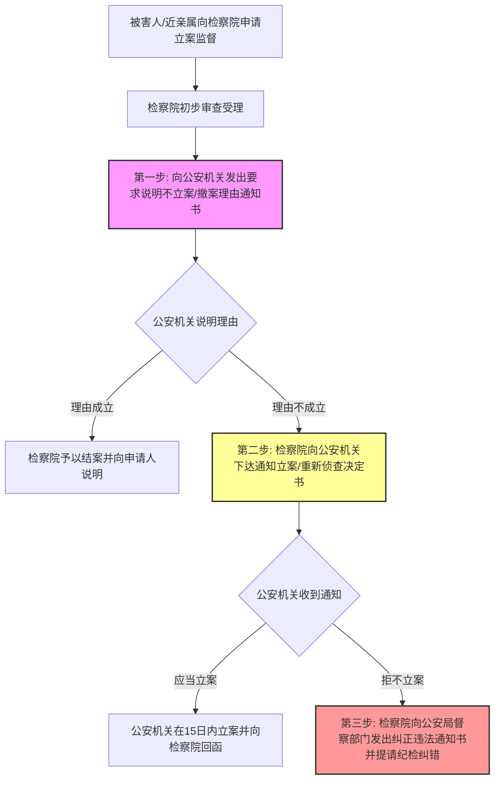

# 刑诉-立案制度-深度报告

立案是刑事诉讼程序的起点。刑事立案制度主要考查立案条件（有犯罪事实 + 需要追究刑事责任）、立案前初查手段的合法性边界（非强制性原则），以及对公安机关“不予立案决定”或“撤销案件决定”的多元救济与检察法律监督程序（复议复核、立案监督、公诉转自诉等）。

---

## 一、 立案条件与初查阶段限制表

在立案审查（初查）阶段，公安司法机关只能采取非强制性调查手段，严禁限制人身自由或封锁财产处分权。

| 诉讼阶段 | 法定主体身份 | 允许采取的调查手段 | 绝对禁止采取的手段 |
|---|---|---|---|
| **立案前（初查阶段）** | 被调查人、证人、知情人 | 1. **询问**（非强制，制作询问笔录） 2. **查询**银行存款流水（不得冻结） 3. **现场勘验、检查**（地形勘查、痕迹提取） 4. **鉴定**（确定死因等） 5. **非强制性证据调取**（拷贝照片、复制视频） | 1. **讯问**（制作讯问笔录） 2. **刑事强制措施**（拘传、取保、监居、拘留、逮捕） 3. **强制性侦查手段**（搜查、扣押手机/财物、冻结存款） 4. **技术侦查措施**（监听、行踪轨迹控制等） 5. **通缉**（仅限立案后追逃） |
| **立案后（侦查阶段）** | 犯罪嫌疑人 | 允许依法采取上述所有初查手段，并解封所有刑事强制措施、侦查手段与技术侦查权。 | 必须遵循法定审批程序，防止程序违法。 |

---

## 二、 不服“不予立案”与“撤销案件”救济途径对照表

不予立案与撤销案件在救济程序上具有本质区别，其复议复核、立案监督、自诉的适用范围与主体存在严格界限。

| 争议事实 | 申请救济的主体类型 | 救济渠道 ①：公安机关内部 | 救济渠道 ②：检察机关监督 | 救济渠道 ③：法院自诉 |
|---|---|---|---|---|
| **不予立案决定** | **被害人** | 1. **申请复议**（收到通知书后7日内向原公安局提出） 2. **申请复核**（对复议不服，收到复议决定书后7日内向上一级公安局提出；复议是复核的法定前置要件） | 向同级人民检察院**申请立案监督**（无公安复议前置程序，两轨自由选择并行） | 直接向人民法院提起**刑事自诉**（公诉转自诉，须有证据及公检不予追究证明） |
| **不予立案决定** | **行政移送机关**（市监局、质监局等） | 1. **申请复议**（收到通知书后3日内提出） 2. **申请复核**（对复议不服，收到决定书后3日内向上一级公安机关提出） | 向同级人民检察院提出**立案监督申请** | 无自诉主体资格 |
| **不予立案决定** | **普通举报人/控告人**（非被害人） | ❌ **无复议、复核申请权** | ❌ **无直接立案监督申请权**（但有权向公检法进行控告/举报） | ❌ **无直接自诉权** |
| **撤销案件决定** （因不构罪撤案） | **被害人及其近亲属** | ❌ **法律未规定撤销案件的复议、复核程序** | 可向同级人民检察院提出**申诉/控告**（提起立案监督程序，督促重新立案） | 可直接向人民法院提起**刑事自诉**（公诉转自诉） |

---

## 三、 检察立案监督法定“三部曲”流程

检察机关纠正公安机关“有案不立”或“撤案不当”必须遵循严格的法定步骤，不可越权直接干预。

> [!WARNING]
> 1. **通知而非建议**：检察院在立案监督中下达的是《通知立案书》，对公安机关具有**刚性法定约束力**，不能用“建议立案”等柔性表述。
> 2. **自侦权不能越位**：检察院对于公安机关管辖的普通刑事案件（如诈骗、盗窃、毒品犯罪等），**终身没有自行立案侦查权**。如公安机关拒不执行通知，检察院只能启动程序性违法监督纠错。

---

## 四、 考点与真题挂接表

| # | 考点分类 | 法定法条依据 | 考频评估 | 已挂接真题卡 (V1) |
|---|---|---|---|---|
| 1 | **立案审查条件（有犯罪事实 + 追究追诉责任）** | 刑诉法§112 | ★★★★ | [[刑诉-立案-多选-01 · 盗窃案件刑事立案标准中犯罪事实与入户行为判定|刑诉-立案-多选-01]] V1 · [[刑诉-立案-单选-01 · 立案阶段与侦查阶段查明事项之界分|刑诉-立案-单选-01]] V1 · [[刑诉-立案-单选-02 · 遗弃婴儿案之立案条件与不立案监督救济渠道|刑诉-立案-单选-02]] V1 |
| 2 | **初查阶段合法性手段边界（非强制性限制）** | 公安部办案程序规定§175 | ★★★★★ | [[刑诉-立案-多选-04 · 刑事立案前初查阶段调查措施范围与强制性限制|刑诉-立案-多选-04]] V1 · [[刑诉-立案-单选-03 · 初查阶段技术侦查与勘验及行政证据扣押提取限制|刑诉-立案-单选-03]] V1 · [[刑诉-立案-多选-05 · 讯问与询问对象及适用诉讼阶段之界分|刑诉-立案-多选-05]] V1 |
| 3 | **不服不立案决定的被害人复议复核权** | 公安部办案程序规定§179 | ★★★★ | [[刑诉-立案-多选-03 · 举报人不服不立案决定之救济权利与行政移送复议复核期限|刑诉-立案-多选-03]] V1 · [[刑诉-立案-单选-04 · 控告人不服不立案决定之复议前置否定与立案监督程序|刑诉-立案-单选-04]] V1 |
| 4 | **行政执法移送案件不立案之复议复核** | 行政执法机关移送涉嫌犯罪规定§8 | ★★★ | [[刑诉-立案-多选-02 · 行政执法移送不予立案之复议复核与立案监督主体限制|刑诉-立案-多选-02]] V1 · [[刑诉-立案-多选-03 · 举报人不服不立案决定之救济权利与行政移送复议复核期限|刑诉-立案-多选-03]] V1 |
| 5 | **检察立案监督程序三部曲（要求说明理由/通知立案）** | 刑诉法§113 | ★★★★★ | [[刑诉-立案-多选-02 · 行政执法移送不予立案之复议复核与立案监督主体限制|刑诉-立案-多选-02]] V1 · [[刑诉-立案-单选-02 · 遗弃婴儿案之立案条件与不立案监督救济渠道|刑诉-立案-单选-02]] V1 · [[刑诉-立案-单选-04 · 控告人不服不立案决定之复议前置否定与立案监督程序|刑诉-立案-单选-04]] V1 · [[刑诉-立案-单选-06 · 排除他杀不予立案之近亲属申诉与检察立案监督程序|刑诉-立案-单选-06]] V1 |
| 6 | **不服撤销案件决定的公诉转自诉救济** | 刑诉法§210③ | ★★★★ | [[刑诉-立案-单选-04 · 控告人不服不立案决定之复议前置否定与立案监督程序|刑诉-立案-单选-04]] V1 · [[刑诉-立案-单选-05 · 公安机关撤销案件之近亲属自诉与立案监督权|刑诉-立案-单选-05]] V1 |
