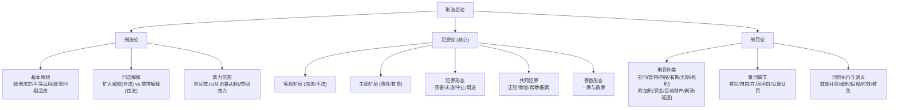
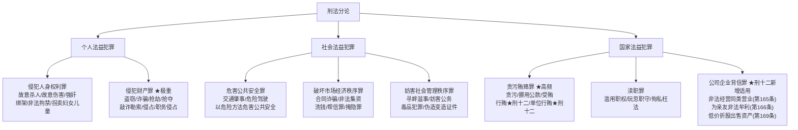

# 刑法体系结构

> [[刑法]] 的内部知识图谱、犯罪论体系与 2026 年备考重点。
>
> **⚠ 核实说明**：本页内容经 106 个子智能体并行深度研究（2.19M tokens），以最高检/最高法官网为一手来源进行对抗验证。凡被 3-0 否决的声明均已删除或标注。

---

## 核心观点

1. **地位**：[[刑法]] 是法考 Tier 1 核心科目（客观题 ≈38 分，主观题必考）。
2. **2026 年最大变量**：《刑法修正案（十二）》（2024-03-01 施行）＋《两高贪污贿赂解释（二）》（2026-05-01 施行）是本年度新增高频考点区。
3. **犯罪论体系**：主流教学采"两阶层（客观违法 → 主观有责）"框架；**警告**：培训机构关于"2026年法考改用改良版四要件"的说法**已被 3-0 否决**，不应依赖，以司法部官方教材为准。
4. **分合有序**：总论（犯罪论、刑罚论）是逻辑地基，分论（人身、财产、贪渎等）是落脚点。

---

## 🧭 板块分值比重与学习顺序

### 1. 按考试分值比重排序（从重到轻）

| 排序 | 板块分类 | 客观分值 | 主观分值 | 综合占比 | 考查要点 |
| :--- | :--- | :--- | :--- | :--- | :--- |
| **1** | **分论·人身与财产犯罪** | ≈12-14分 | ≈16-18分 | **约 40%** | 故意伤害/杀人、强奸、绑架、盗窃、诈骗（三角诈骗）、抢劫（转化抢劫）。**主观案例分析的绝对大头。** |
| **2** | **总论·犯罪论** | ≈12-14分 | ≈8-10分 | **约 30%** | 不作为犯、因果关系与客观归责、正当防卫、故意/过失、事实认识错误、共犯形态、未完成形态、罪数。**全科逻辑基石。** |
| **3** | **分论·贪污贿赂与渎职犯罪** | ≈4-6分 | ≈4-6分 | **约 15%** | 国家工作人员认定、贪污罪、受贿罪、挪用公款罪、刑十二修正案（行贿与民营背信）。**职务犯罪必考区。** |
| **4** | **总论·刑法论与刑罚论** | ≈6-8分 | ≈0-2分 | **约 10%** | 罪刑法定、空间/时间管辖、主刑与附加刑、自首与立功、累犯、数罪并罚、缓刑假释、追诉时效。 |
| **5** | **分论·安全、经济与社会秩序等罪** | ≈6-8分 | 0分 | **约 5%** | 交通肇事罪、危险驾驶罪、信用卡诈骗罪、合同诈骗罪、自洗钱、寻衅滋事罪、毒品犯罪。 |

### 2. 按最优学习顺序排序（依赖关系）

由于刑法具有极强的逻辑递进性，分则罪名的分析完全依赖于总则的理论基础，因此学习必须**按依赖路径展开**：

```
【第一阶段：基础】 ──> 【第二阶段：逻辑核心】 ──> 【第三阶段：罪名实战】 ──> 【第四阶段：量刑与扫尾】
  ① 刑法论总论          ② 犯罪论 (客观+主观)        ③ 人身财产犯罪 (核中核)       ⑤ 刑罚论 (量刑与并罚)
                                                 ④ 贪腐渎职犯罪 (公职背信)      ⑥ 安全、经济与社会犯罪
```

| 顺序 | 步骤 | 板块名称 | 学习重心 | 为什么排在此处？ |
| :--- | :--- | :--- | :--- | :--- |
| **1** | **第一阶段** | **总论·刑法论** | 罪刑法定原则的实质适用、扩大解释与类推解释的界限、时间/空间效力。 | **入局打底**：解决刑法最基本的前提性概念和适用效力问题。 |
| **2** | **第二阶段** | **总论·犯罪论** | 危害行为与作为义务、相当因果关系判定、正当防卫认定、具体/抽象错误、共犯与停止形态、罪数。 | **逻辑地基**：不掌握犯罪论的“两阶层分析”，后面分则罪名就无法定罪（如抢劫转化为盗窃/伤害、共犯受贿等）。 |
| **3** | **第三阶段** | **分论·人身与财产犯罪** | 盗窃与诈骗的处分意识、抢劫罪八大情节、转化抢劫要件、故意杀人与伤害因果判定。 | **攻克高地**：乘着犯罪论的热度，立即攻克分则中分值最大、最核心的人身财产案件，这是主观题的生命线。 |
| **4** | **第三阶段** | **分论·贪污贿赂与渎职犯罪** | 国家工作人员职务便利、挪用转贪污要件、斡旋/影响力受贿、刑十二新规（从重行贿、民营背信）。 | **公职实战**：职务犯罪是法考的独立大题，考点高度依赖总论的“共犯与身份”以及分论的“财产犯罪”。 |
| **5** | **第四阶段** | **总论·刑罚论** | 自首与准自首、立功材料排除、累犯要件、数罪并罚计算公式、假释负面清单、追诉时效计算。 | **量刑结论**：在把所有罪名都定性清楚之后，最后一步才是对他们进行刑期的并罚计算与刑罚执行。 |
| **6** | **第四阶段** | **分论·安全、经济与社会犯罪** | 交通逃逸致死转化、自洗钱并罚、信用卡诈骗冒用透支、寻衅滋事界限、毒品犯罪完成形态。 | **考前扫尾**：主要是客观题的选择题琐碎考点，重在法理记忆与行政法前置条件的衔接。 |

---

## 一、刑法总论知识图谱

总论由 **刑法论**、**犯罪论**、**刑罚论** 三大支柱构成，犯罪论为重中之重。



### 1. 犯罪论核心：两阶层分析框架

```
犯罪判定 ＝ ①客观违法阶层（符合且无阻却）＋ ②主观有责阶层（符合且无阻却）
```

#### ① 客观阶层（违法/不法）

审查行为是否对法益造成侵害或危险。

| 要素类型 | 核心内容 |
|:---|:---|
| **行为主体** | 自然人（含身份犯）、单位 |
| **危害行为** | 有体性、有意性、法益侵害性；不作为犯须有"特定作为义务来源" |
| **危害结果** | 实害结果、具体危险结果、抽象危险结果 |
| **因果关系** | 条件说为基础；介入因素异常性 + 行为关联度（客观归责理论） |
| **违法阻却** | 正当防卫（注意特殊防卫/防卫过当）、紧急避险（损害较小法益）、被害人承诺（限处分权范围内） |

**正当防卫高频考点：**
- 起因：**现实不法侵害**（偶然防卫=无防卫意图→不成立正当防卫，通说）
- 时间：正在进行（提前预设装置有争议）
- 限度：未明显超过必要限度；对暴力侵犯人身安全适用**特殊防卫**（无限防卫权）

#### ② 主观阶层（责任/有责）

审查是否能对行为人进行主观非难。

| 要素类型 | 核心内容 |
|:---|:---|
| **犯罪故意** | 直接故意（明知+希望）、间接故意（明知+放任） |
| **犯罪过失** | 过于自信的过失（能预见而侥幸）、疏忽大意的过失（应预见而未预见） |
| **事实认识错误** | 具体符合说 vs 法定符合说（对象错误、打击错误）；抽象错误→重合范围内故意 |
| **责任阻却** | 责任年龄与能力；违法性认识可能性；期待可能性 |

**事实认识错误命题套路：**
- **打击错误**：甲意图杀 A，子弹误击 B → 具体符合说：对 B 成立过失；法定符合说：对 B 成立故意杀人（既遂）
- **对象错误**：认错人身份 → 两说结论相同，均成立故意犯罪既遂

---

## 二、共同犯罪（必考骨架）

| 角色 | 构成要件 | 常考陷阱 |
|:---|:---|:---|
| **共同故意** | 二人以上，相互认识并追求共同犯罪结果 | 片面共犯、共同过失均不成立共犯 |
| **正犯（实行犯）** | 直接实施构成要件行为 | 间接正犯：利用无责任能力人/无故意人作工具 |
| **教唆犯** | 故意引起他人犯罪意图 | 教唆未满14周岁者→教唆者直接正犯 |
| **帮助犯** | 物理或精神支持，从属于实行行为 | 中立帮助行为：需风险升高+实现 |
| **共犯脱离** | 着手前：切断物理+消除心理因果性 | 着手后：须积极阻止实行犯既遂 |
| **共犯中止** | 不仅自身停止，还须有效阻止其他共犯既遂 | 单纯退出不等于中止 |

**犯罪形态时空推进：**
```
犯意 → 【犯罪预备】（准备工具/制造条件）→ 【着手】→ 【既遂】
                ↓                                 ↓
        (意志内自动放弃=中止)          未遂=意志外原因未完成
                                        中止=自动且有效防止结果
```

---

## 三、罪数形态（一罪与数罪）

| 形态 | 判定标准 | 典型考例 |
|:---|:---|:---|
| **想象竞合犯** | 一行为触犯数罪名 → 从一重处断 | 开枪打人同时毁损财物 |
| **法条竞合** | 数法条规定同一行为 → 特别法优于一般法 | 诈骗罪 vs 合同诈骗罪 |
| **牵连犯** | 目的行为与手段/结果行为间有牵连关系 | 伪造证件后使用（注意例外数罪并罚规定） |
| **连续犯** | 同一故意连续实施多次同种行为 → 以一罪处断（酌情从重） | 多次小额盗窃累计数额 |
| **结合犯** | 法律明文将数罪结合为一罪 | 绑架杀人（法律明确规定） |

---

## 四、量刑制度

> **核实**：两高量刑指导意见法发[2021]21号，2021-07-01施行，首次两高联合制定，纳入认罪认罚从宽目的（经核实：**3-0通过**）。

| 情节 | 核心规则 | 法考易错点 |
|:---|:---|:---|
| **累犯** | 故意犯、刑满释放5年内再故意犯（须5年以上有期徒刑者方适用一般累犯） → 应当从重 | 过失犯不构成累犯；危害国家安全犯无5年限制 |
| **自首** | 自动投案 + 如实供述主要罪行 | 被采取强制措施后如实供述同种漏罪=准自首 |
| **认罪认罚** | 如实供述 + 同意量刑建议 → 从宽 | 与自首不同：**不须自动投案** |
| **立功** | 揭发他人犯罪（查证属实）/ 协助抓获同案犯 | 重大立功（破获重大案件）→ 应当从轻减轻 |
| **数罪并罚** | 先并后减；有期 ≤ 20年；有期+无期/死刑→执行无期/死刑 | 判决宣告前漏罪 vs 宣告后新罪，处理规则不同 |
| **缓刑** | 拘役/3年以下有期 + 悔罪表现 + 非惯犯/累犯 | 强奸罪、毒品犯罪等有缓刑适用限制 |
| **假释** | 有期徒刑执行1/2以上 / 无期执行13年以上 + 确有悔改 | 累犯及数罪中有特定罪名者不得假释 |

---

## 五、刑法分论核心罪名图谱



### 重点罪名辨析（法考核心陷阱区）

#### 财产犯罪三角辨析

| | 盗窃罪 | 诈骗罪 | 抢劫罪 |
|:---|:---|:---|:---|
| **取得方式** | 平和手段，违背被害人意志 | 欺骗→错误认识→基于处分意识处分 | 暴力/胁迫压制反抗，强行劫取 |
| **被害人意志** | 无处分意识 | 有（但基于错误） | 无（被迫/被压制） |
| **当场性** | 不要求 | 不要求 | 两个当场（暴力当场+取财当场） |
| **核心识别** | 非法占有+平和手段 | 处分意识+处分行为 | 压制反抗达到程度 |

> **三角诈骗**：处分人（第三人）≠ 被害人，但处分人须具有处分地位与权限 → 区别于盗窃罪间接正犯。

#### 绑架 vs 抢劫 vs 敲诈勒索

| 罪名 | 区分关键 | 常见命题陷阱 |
|:---|:---|:---|
| **抢劫罪** | 对**被害人当场**施暴，**当场取得**财物 | 转化型抢劫（盗窃后被抓当场暴力） |
| **绑架罪** | 控制人质作盾牌，向**第三人**发出勒索威胁 | 直接向被害人本人勒索→仍可能是抢劫 |
| **敲诈勒索** | 以将来/当场损害相威胁，被害人因恐惧交付，但**未达压制反抗程度** | 网络发帖威胁索财→敲诈 |

---

## 六、2026年必考焦点（经权威核实）

### 6.1 刑法修正案（十二）核心变动

> **核实来源**：最高检官网，2023-12-29通过，2024-03-01施行（**3-0票通过**）
> 共修改七个条文（165、166、169、387、390、391、393条）

#### A. 公司企业背信类犯罪扩张（第165、166、169条）

| 条文 | 修正前 | 修正后 | 民营企业特殊条件 |
|:---|:---|:---|:---|
| **第165条**（非法经营同类营业罪） | 仅国有公司企业的董监高 | 扩至"其他公司、企业"的董监高 | 须有**"重大损失"**实害后果 |
| **第166条**（为亲友非法牟利罪） | 仅国有公司企业工作人员 | 扩至"其他公司、企业工作人员" | 须有**"重大损失"**实害后果 |
| **第169条**（低价折股出售资产罪） | 限国有公司企业；罪名含"国有" | 扩至全部公司企业；**罪名去掉"国有"限制** | 须额外满足**违反法律、行政法规规定**前提 |

> **两高罪名补充规定（八）**（法释[2024]3号，2024-03-01施行）随之更新相关罪名（**2-1通过**）。

#### B. 贿赂犯罪强化（第387、390、391、393条）

| 条文 | 核心修正内容 | 法考重点 |
|:---|:---|:---|
| **第390条（行贿罪）** | 新增**七项从重处罚情形** + 三档刑罚结构（见下） | 认定从重情节；从旧兼从轻原则（2024-03-01前行为） |
| **第393条（单位行贿罪）** | 刑罚上限由**5年提升至10年**有期徒刑 | 量刑档次变化 + 时间效力 |

**第390条行贿罪七项从重情形（经核实：3-0通过）：**

| 序号 | 从重情形 |
|:---:|:---|
| 1 | 多次行贿或向多人行贿 |
| 2 | **国家工作人员**实施行贿 |
| 3 | 在国家重点工程、重大项目中行贿 |
| 4 | 为谋取职务、职级晋升调整行贿 |
| 5 | 对**监察、行政执法、司法工作人员**行贿 |
| 6 | 在生态环境/医疗卫生/食品药品/安全生产等**特定领域**行贿 |
| 7 | 将违法所得用于行贿 |

**三档刑罚结构：**
```
基本犯       → 3年以下有期徒刑或拘役 + 罚金
情节严重     → 3年以上10年以下有期徒刑 + 罚金
情节特别严重 → 10年以上有期徒刑或无期徒刑 + 罚金/没收财产
```

### 6.2 两高贪污贿赂解释（二）（2026-05-01施行）

> **核实来源**：最高检新闻发布会 spp.gov.cn（2026-04-10）（**3-0通过**）

| 罪名 | 定量标准 | 备注 |
|:---|:---|:---|
| **单位受贿罪** | 200万以上=情节特别严重；100-200万+五种加重情形之一=情节特别严重 | 首次以解释明确定量入罪 |
| **介绍贿赂罪（情节严重）** | 个人10万以上/单位50万以上 | 低档：5万/25万+加重情形 |

### 6.3 2025年网络犯罪三罪界限新解释

> 帮信罪（法发[2025]12号）+ 掩隐罪（法释[2025]13号）（**2-1通过，中等可信度**）

```
洗钱罪（第191条）   ：上游7类特定犯罪 + 主观明知 + 法定掩饰行为
掩隐罪（第312条）   ：上游不限 + 主观明知 + 掩饰行为（一般类洗钱）
帮信罪（第287条之二）：提供技术/资金/广告帮助 + 明知他人利用网络犯罪
```

帮信罪第7条专门规定与掩隐罪的区分规则；两者与洗钱罪形成协调衔接体系。

---

## 七、备考优先级矩阵

| 优先级 | 板块 | 核心知识点 | 预测题型 |
|:---:|:---|:---|:---|
| ★★★★★ | 贪污贿赂罪（刑十二） | 行贿罪七项从重情形、单位行贿刑罚上限 | 主客双考 |
| ★★★★★ | 两高贪污贿赂解释（二） | 单位受贿/介绍贿赂定量标准（新！2026-05-01） | 主观题 |
| ★★★★☆ | 公司企业背信罪（刑十二） | 第165/166/169条主体扩张与民营企业特殊条件 | 客观题 |
| ★★★★☆ | 财产犯罪辨析 | 盗窃/诈骗/抢劫区分、三角诈骗 | 客观题 |
| ★★★★☆ | 共同犯罪 | 间接正犯、共犯脱离、共犯中止 | 主客双考 |
| ★★★☆☆ | 事实认识错误 | 具体符合说 vs 法定符合说 | 主观题 |
| ★★★☆☆ | 量刑制度 | 自首/认罪认罚/数罪并罚规则 | 客观题 |
| ★★★☆☆ | 网络犯罪三罪界限 | 帮信罪/掩隐罪/洗钱罪区分（2025年新解释） | 客观题 |
| ★★☆☆☆ | 正当防卫 | 特殊防卫、偶然防卫 | 客观题 |

---

## 八、已被否定的说法（勿信）

以下声明经深度研究 **3-0 票否决**，备考时不应依赖：

- ❌ "2026年法考将改良版四要件体系纳入官方教材替代两阶层"
- ❌ "日额制罚金改革方案已出台"
- ❌ "巨额财产来源不明罪数额标准：300万/1000万"（未获核实）

---

## 九、深度考点分册报告

**总论（2 册）**
- **刑法论与刑罚论**：[[刑法总论-刑法论与刑罚论考点-深度报告]]
- **犯罪论（总论核心）**：[[刑法总论-犯罪论考点-深度报告]]

**分论（4 册，按法益分类）**
- **个人法益 · 人身与财产**：[[刑法分论-人身与财产犯罪考点-深度报告]]
- **国家法益 · 贪腐与渎职**：[[刑法分论-贪污贿赂与渎职犯罪考点-深度报告]]
- **社会法益 · 经济与网络犯罪**：[[刑法分论-经济与网络犯罪考点-深度报告]]（含 2025 年帮信/掩隐/洗钱三罪界限）
- **社会法益 · 公共安全与社会管理**：[[刑法分论-公共安全与社会管理犯罪考点-深度报告]]

---

## 相关页面

- [[刑法]]
- [[刑事诉讼法]]
- [[法考科目分层]]
- [[2026法考变动]]
- [[法考备考策略]]
