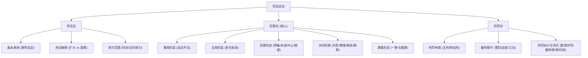
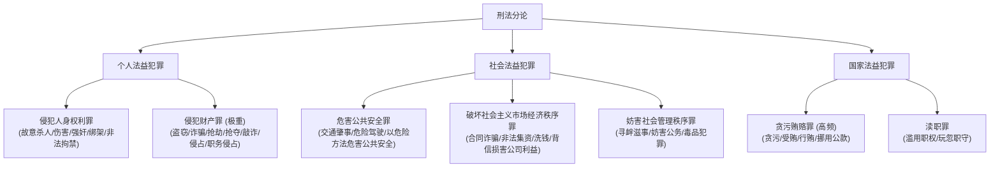

# 刑法体系结构

> [[刑法]] 的内部知识图谱、两阶层犯罪论体系与 2026 年备考重点。

## 核心观点

1. **核心地位**：[[刑法]] 是法考 Tier 1 核心地基科目（客观题 ≈38 分，主观题必考），极重理论逻辑与观点展示。
2. **底层逻辑**：以“阶层论（客观不法 → 主观有责）”为核心，切忌四要件混杂。
3. **分合有序**：总论（犯罪论、刑罚论）是逻辑地基，分论（人身、财产、贪渎等罪名）是落脚点，二者相辅相成。
4. **2026 焦点**：重点攻克《刑法修正案（十二）》对民营企业内部腐败与行贿罪的最新修正。

---

## 刑法总论知识图谱

总论由 **刑法论**、**犯罪论**、**刑罚论** 三大支柱构成，其中犯罪论为重中之重。



### 1. 犯罪论的核心：两阶层分析框架

法考当前主流命题（如柏浪涛等通说体系）采用两阶层（客观违法+主观有责）框架进行犯罪审查：

```
犯罪判定 ＝ ①客观违法阶层符合(且无阻却事由) ＋ ②主观有责阶层符合(且无阻却事由)
```

#### ① 客观阶层（违法/不法）
审查行为是否对法益造成侵害或危险。
* **积极要素**：
  * **行为主体**：自然人（身份犯）、单位。
  * **危害行为**：有体性、有意性、法益侵害性（重点：不作为犯的“特定作为义务来源”；排除降低风险、自陷风险）。
  * **危害结果**：实害结果、危险结果（具体危险 vs 抽象危险）。
  * **因果关系与客观归责**：条件说、相当因果关系（介入因素的异常度、行为关联度）、客观归责理论（制造不容许的风险、实现不容许的风险、效力范围）。
* **消极要素（违法阻却事由/出罪）**：
  * **正当防卫**：起因（现实不法侵害）、时间（正在进行）、主观（防卫意图，排除偶然防卫）、对象、限度（排除防卫过当；注意特殊防卫）。
  * **紧急避险**：限度（不得已、损害较小法益）。
  * **被害人承诺**：承诺能力、自由意志、处分权限（生命健康受限）。

#### ② 主观阶层（责任/有责）
审查是否能在行为人违法的基础上，对其进行主观非难。
* **积极要素（主观责任要素）**：
  * **犯罪故意**：直接故意、间接故意（认知要素＋意志要素）。
  * **犯罪过失**：过于自信的过失（能预见而侥幸避免）、疏忽大意的过失（应当预见而未预见）。
  * **事实认识错误（高频考点）**：
    * **具体事实错误**（对象错误、打击错误、因果关系错误）：具体符合说与法定符合说的对决。
    * **抽象事实错误**：不同罪名间的重合判定（在重合范围内成立故意犯罪，超出部分成立过失或无罪）。
* **消极要素（责任阻却事由/出罪）**：
  * **责任年龄与责任能力**：刑事责任年龄阶段划分；精神状态、生理残疾等。
  * **违法性认识可能性**：行为人是否有机会认识到自己的行为违法。
  * **期待可能性**：在当时的情境下，能否期待行为人选择不违法。

---

## 共同犯罪与未完成形态

### 1. 共同犯罪（法考的必考骨架）
* **成立条件**：二人以上共同故意、共同行为（注意：片面共犯、共同过失不成立共犯）。
* **共犯分工**：
  * **教唆犯**：故意引起他人实行犯罪的意图。
  * **帮助犯**：物理或心理上的物质、精神支持。
  * **实行犯（正犯）**：直接实施符合构成要件行为的人，包括间接正犯（利用无责任能力人、无故意人等作为工具）。
* **特殊节点**：
  * **共犯脱离**：在着手实行前切断与实行行为的物理、心理因果关系，并有效消除自身先前行为的影响。
  * **共犯中止**：不仅自身放弃，还需积极阻止其他共犯人既遂。

### 2. 犯罪形态（时空推进）
```
【思想准备】 ── (准备工具) ──> 【着手】 ── (实施行为) ──> 【既遂】
                     │                 │
                  犯罪预备              犯罪未遂 (意志外原因未既遂) / 犯罪中止 (自动且有效)
```

---

## 刑法分论核心罪名图谱

分论考查以“人身、财产、贪渎”三大法益为绝对核心。



### 重点罪名辨析逻辑（法考核心陷阱区）

1. **盗窃罪 vs 诈骗罪**：
   * 区分关键：**被害人是否有基于处分意识做出的处分行为**。
   * 盗窃是违背意志窃取（平和手段占有转移）；诈骗是行为人欺骗 -> 被害人产生错误认识 -> 基于处分意识处分财产 -> 财产转移。
   * 注意三角诈骗中，处分人与受害人虽不一致，但处分人必须具有处分地位与权限（区别于盗窃罪间接正犯）。
2. **抢劫罪 vs 绑架罪 / 敲诈勒索罪**：
   * **抢劫罪**：当场使用暴力/胁迫，达到“压制反抗、强行劫取”的程度（两个“当场”：当场使用暴力，当场取得财物）。
   * **绑架罪**：控制人质作为盾牌，向第三人发出勒索威胁。
   * **敲诈勒索罪**：以未来或当场的损害相威胁，被害人因恐惧而交付财物，但未达到“压制反抗无法反抗”的极端程度。

---

## 2026 年司法考试刑法必考焦点

### 《刑法修正案（十二）》核心变动

为了应对 2026 年法考，必须紧抓刑十二的修法红利：

| 修改方向 | 核心修正罪名 | 关键法条内容变动 | 法考命题人切入点 |
| :--- | :--- | :--- | :--- |
| **民营企业内部腐败平等保护** | **非法经营同类营业罪**<br>（第165条） | 将主体扩大至“其他公司、企业”（民营）的董事、监事、高级管理人员。 | **出罪门槛差异**：民营企业主体构成此罪，需增加“致使公司、企业利益遭受重大损失”这一实害后果。 |
| | **为亲友非法牟利罪**<br>（第166条） | 主体扩大至“其他公司、企业的工作人员”。 | 同上，民营企业人员构成此罪也必须以“重大损失”为前提。 |
| | **徇私舞弊低价折股、出售公司、企业资产罪**<br>（第169条） | 罪名去掉了“国有”限制，主体扩大至“其他公司、企业直接负责的主管人员”。 | 考查主体身份的融合，国有与非国有混合主体的认定。 |
| **行贿犯罪惩治力度加大** | **行贿罪**<br>（第390条） | 新增七类从重处罚情形（如多次行贿、国家工作人员行贿、安全生产/食品药品/医疗领域行贿等）。 | **主客观多项量刑**：案例中给出多次或向监察人员行贿的情节，要求判定是否属于法定从重处罚情节。 |
| | **单位行贿罪**<br>（第393条） | 刑罚档次上限由五年提高至十年有期徒刑。 | 考查罪刑相适应与刑十二实施后的时间效力（从旧兼从轻原则）。 |

---

## 备考建议

1. **坚持两阶层定罪步骤**：主观题写理据时，务必先论述客观行为及危害结果，再论述故意过失或认识错误，不要混为一谈。
2. **注重学说观点展示**：
   * 对争议考点（如偶然防卫、因果关系介入因素、事实认识错误、片面共犯等）至少掌握通说（折中说/法定符合说）与对立学说（行为无价值/具体符合说），能够分段进行逻辑论证。
3. **结合真题进行罪名颗粒度切片**：
   * 分则罪名的构成要件具有极高的精细度，应通过近年真题做微观拆解，辨析相似罪名的此罪与彼罪、一罪与数罪。

---

## 相关页面

* [[刑法]]
* [[刑事诉讼法]]
* [[法考科目分层]]
* [[2026法考变动]]
* [[法考备考策略]]
