# 📐 刑法总论 · 罪数形态分类决策模型 (New)

> **教练开场白**
> 同学们好！我是你们的刑法法考教练。在法考中，一提到“一个人干了数件事，或者一件事符合了数个法条，问如何定罪量刑”，命题人就必然在考**“一行为触多条文 / 多行为罪数判定”**。很多同学在考场上分不清“法条竞合”与“罪数形态”的区别，一看到“重婚”与“破坏军婚”就随手写“想象竞合”，一遇到连环行为就条件反射性并罚。今天我们用**“双层前置做题法”**，把法条层面的竞合与行为层面的罪数彻底切开，用**“四大分类决策树”**让你不管面对多复杂的案情都能秒杀！

---

## 一、 适用场景与快速识别

凡案情中出现多个前因后果、前后相继、相互包含的不法事实（如伪造证件并诈骗、收买被拐妇女又强奸、故意杀人后抛尸、挪用公款走私），或者法条出现重叠（如普通诈骗与合同诈骗、过失致人死亡与交通肇事）时，立即调用本模型。

### 🎯 法考秒杀动作：双层做题判断顺序

在面对案情时，应当按照以下三步顺序进行层层过滤，此顺序经实战验证极为高效合理：

```
                              【案情事实与罪名触犯】
                                        │
           第一层：看法条本身是否天然重叠？
           ├── 是 ──► 【法条竞合】（独立前置类别，不属于行为罪数形态。择一重/特别法优先）
           └── 否 ──► 进入第二层：数实行行为个数
                       │
                       ├─ 只有 1 个行为 ──► 【1.实质一罪】（继续犯 / 想象竞合犯 / 结果加重犯）
                       └─ 2 个及以上行为 ──► 进一步三步走：
                                   │
                                   ├─ ① 法条写明只定一罪 ──► 【2.法定一罪】（结合犯 / 转化犯）
                                   ├─ ② 无明文但行为高度绑定 ──► 【3.处断一罪】（牵连犯 / 吸收犯 / 连续犯）
                                   └─ ③ 行为独立无绑定 / 明文要求拆分 ──► 【4.数罪并罚】
```

---

## 二、 核心决策流：罪数形态与法条竞合决策树（含流程图）

```mermaid
graph TD
    %% Root node
    Root[总体系: 一行为触多条文 / 多行为罪数判定] --> Branch1[分支一: 法条竞合 <br>独立前置类别, 不属于行为罪数形态]
    Root --> Branch2[分支二: 行为层面·罪数形态 <br>四大同级主干]
    
    %% Branch1 (法条竞合)
    Branch1 --> Branch1_Detail[底层逻辑: 法条天然重叠, 单一行为单一法益 <br>规则: 特别法优于普通法; 明文规定时重法优先 <br>典型: 诈骗vs合同/信用卡诈骗; 过失致人死亡vs交通肇事]
    
    %% Branch2 (罪数形态四大主干)
    Branch2 --> Cat1[1. 实质一罪 <br>仅1个实行行为, 天然一罪]
    Branch2 --> Cat2[2. 法定一罪 <br>多个行为, 法条明文强制只定一罪]
    Branch2 --> Cat3[3. 处断一罪 <br>多行为, 裁判时择一重]
    Branch2 --> Cat4[4. 数罪并罚 <br>多独立行为, 分别定罪合并处罚]
    
    %% Cat1 (实质一罪)
    Cat1 --> Cat1_1[继续犯 <br>不法状态持续如非法拘禁]
    Cat1 --> Cat1_2[想象竞合犯 <br>一行为数法益, 择一重]
    Cat1 --> Cat1_3[结果加重犯 <br>基础行为+法定加重结果, 不并罚]
    
    %% Cat2 (法定一罪)
    Cat2 --> Cat2_1[结合犯 <br>结合为一罪, 罪名不变加重处罚]
    Cat2_1 --> Cat2_1_a["绑架杀害/重伤人质 (§239)"]
    Cat2_1 --> Cat2_1_b["拐卖妇女儿童又奸淫/强迫卖淫 (§240)"]
    Cat2 --> Cat2_2[转化犯 <br>客观多行为, 直接换重罪定罪]
    Cat2_2 --> Cat2_2_a["拘禁暴力致死伤 ➔ 故意伤害/杀人罪"]
    Cat2_2 --> Cat2_2_b["聚众斗殴致人死伤 ➔ 故意伤害/杀人罪"]
    Cat2_2 --> Cat2_2_c["刑讯逼供致死伤 ➔ 故意伤害/杀人罪"]
    Cat2_2 --> Cat2_2_d["虐待监管人致死伤 ➔ 故意伤害/杀人罪"]
    Cat2_2 --> Cat2_2_e["携带凶器抢夺 ➔ 抢劫罪 (§267Ⅱ)"]
    Cat2_2 --> Cat2_2_f["盗抢骗当场施暴 ➔ 抢劫罪 (§269)"]
    
    %% Cat3 (处断一罪)
    Cat3 --> Cat3_1[牵连犯 <br>手段-目的/原因-结果, 原则从一重]
    Cat3_1 --> Cat3_1_a[例: 伪造证件并招摇撞骗]
    Cat3_1 --> Cat3_1_b[例外: 法条明文要求并罚如挪用公款+走私]
    Cat3 --> Cat3_2[吸收犯 <br>重吸轻/实行吸预备/主吸从]
    Cat3_2 --> Cat3_2_a[例: 盗窃枪支后私藏枪支]
    Cat3_2 --> Cat3_2_b[例: 入户盗窃吸收非法侵入住宅]
    Cat3 --> Cat3_3[连续犯 <br>同一故意, 多次实施同种犯罪]
    Cat3_3 --> Cat3_3_a[例: 连续多日盗窃同一住户财物]
    Cat3_3 --> Cat3_3_b[例: 多次实施电信诈骗]
    
    %% Cat4 (数罪并罚)
    Cat4 --> Cat4_1[情形1: 前后两个完全独立犯罪 <br>例: 强奸/抢劫后灭口杀人]
    Cat4 --> Cat4_2[情形2: 收买类罪后实施其他重罪 <br>例: 收买被拐妇女后强奸/拘禁/伤害]
    Cat4 --> Cat4_3[情形3: 牵连犯法定并罚例外 <br>例: 挪用公款走私/非法经营; 受贿后徇私舞弊]
    Cat4 --> Cat4_4[情形4: 组织/运送偷渡另实施杀人/伤害/强奸]
```



### 📊 罪数与竞合总知识图谱

#### ├─ 分支一：法条竞合（独立前置类别，不属于行为罪数形态）
*   **底层逻辑**：法条规定之间存在天然重叠或包容关系，属于单一行为、单一法益的内部逻辑重合。
*   **处理规则**：原则上**特别法优于普通法**；例外在刑法有明文规定时适用**重法优于轻法**。
*   *典型例证*：诈骗罪 ↔ 合同诈骗罪 / 信用卡诈骗罪；过失致人死亡罪 ↔ 交通肇事致死。

#### └─ 分支二：行为层面·罪数形态（四大同级主干）
1.  **实质一罪（仅有 1 个实行行为，天然一罪）**
    *   **继续犯**：一个行为及其引起的不法状态同时持续。如非法拘禁、遗弃。
    *   **想象竞合犯**：一个行为侵害数个不同法益，触犯数个罪名。**从一重罪处断，不并罚**。
    *   **结果加重犯**：基本犯罪行为造成了法定的严重加重结果。**适用本罪加重法定刑，不并罚**。
2.  **法定一罪（有数个独立的实行行为，法条明文强制规定只定一罪）**
    *   **结合犯（罪名不变，加重处罚）**：数个本可独立成罪的行为被法条明文包容为一罪。
        *   绑架杀害/重伤人质 ➜ 定**绑架罪（§239）**，不与故意杀人/伤害罪并罚。
        *   拐卖妇女、儿童过程中奸淫、强迫卖淫的 ➜ 定**拐卖妇女、儿童罪（§240）**，不并罚。
    *   **转化犯（直接更换重罪定罪）**：因特定暴力或法定情节，轻罪直接转化为重罪处罚。
        *   非法拘禁使用暴力致人伤残、死亡 ➜ 转化为**故意伤害罪、故意杀人罪（§238Ⅱ）**。
        *   聚众斗殴致人重伤、死亡 ➜ 转化为**故意伤害罪、故意杀人罪（§292Ⅱ）**。
        *   刑讯逼供、暴力取证致人伤残、死亡 ➜ 从重转化为**故意伤害罪、故意杀人罪（§247）**。
        *   虐待被监管人致人伤残、死亡 ➜ 从重转化为**故意伤害罪、故意杀人罪（§248）**。
        *   携带凶器抢夺 ➜ 转化为**抢劫罪（§267Ⅱ）**。
        *   盗窃、诈骗、抢夺当场为窝赃、拒捕、毁证而施暴或以暴力相威胁 ➜ 转化为**抢劫罪（§269事后抢劫）**。
3.  **处断一罪（有数个独立行为，无法律强制一罪，裁判时择一重罪处罚）**
    *   **牵连犯**：数行为间有手段-目的或原因-结果牵连关系。**原则上从一重罪处断**，法条明文并罚的例外除外。
    *   **吸收犯**：数个行为之间重行为吸收轻行为、实行行为吸收预备行为、主行为吸收从行为。
    *   **连续犯**：基于同一或概括故意，多次实施性质相同的犯罪行为。**按一罪累计数额或情节，从重处罚**。
4.  **数罪并罚（多独立行为，无任何一罪或竞合规定，分别定罪合并处罚）**
    *   收买被拐卖的妇女、儿童后，又实施强奸、非法拘禁、伤害犯罪的 ➜ **依法必须数罪并罚（§241第4款明文规定）**。
    *   强奸、抢劫既遂后，另行起意故意杀人灭口 ➜ **数罪并罚**。
    *   牵连犯法定例外 ➜ 挪用公款进行走私、非法经营（§384）；受贿后实施徇私枉法等渎职犯罪（司法解释规定并罚）。
    *   组织、运送他人偷越国（边）境过程中，另行实施故意杀人、伤害、强奸等犯罪的 ➜ **数罪并罚（§318、§321）**。

---

## 三、 考点与考题双向链接对照表

*以下表格穷尽映射本知识库题库中全部罪数论与法条竞合相关题目，决无遗漏。*

| 核心考点 | 典型考试情境 | 秒杀判断逻辑（解题动作） | 双向链接考题（点击直达） |
| :--- | :--- | :--- | :--- |
| **法条竞合特别优先** | 已婚者明知杨某是现役军人配偶仍与之结婚。 | 重婚与破坏军婚法条天然包含 ➜ 特别法优先，定破坏军婚罪一罪，不比轻重。 | [[刑法-总论-犯罪论-单选-62 · 法条竞合之特别法优于一般法]] |
| **一行为与数行为界分** | 醉驾不慎撞死路人；一行为造成多个危害结果。 | 区分物理行为个数。一行为属于实质一罪或法条竞合 ➜ 排除并罚。 | [[刑法-总论-犯罪论-单选-61 · 想象竞合与实质数罪的区分]] |
| **想象竞合从一重** | 变造假币又用以购物；一个帮助动作同时犯两罪。 | 一行为触犯多个不同罪名，侵害多个法益 $\rightarrow$ 择一重罪处断，不数罪并罚。 | [[刑法-总论-犯罪论-单选-60 · 罪数之想象竞合数罪并罚与牵连犯]] |
| **结果加重犯不并罚** | 抢劫时为排除反抗当场杀死被害人。 | 基本犯造成法定严重结果 $\rightarrow$ 直接适用加重法定刑（一罪），排除并罚。 | [[刑法-总论-犯罪论-单选-59 · 结果加重犯与危害结果]] |
| **继续犯一罪** | 非法拘禁他人整整一个月；非法持有枪支。 | 行为和不法状态同时持续 $\rightarrow$ 认定为一罪，不实行数罪并罚。 | [[刑法-总论-犯罪论-单选-64 · 继续犯之非法拘禁按一罪]] |
| **牵连犯处断一罪** | 伪造证件并用以招摇撞骗；挪用公款后去走私。 | 行为间有手段-目的或原因-结果牵连 $\rightarrow$ 原则从一重处断，有明文并罚例外除外。 | [[刑法-总论-犯罪论-单选-65 · 牵连犯的从一重处断]] |
| **拟制与注意规定** | 盗窃信用卡并使用；窃取信用卡信息网络使用。 | 盗窃卡并使用拟制定盗窃罪；窃卡信息网络使用直接定信用卡诈骗罪（无拟制）。 | [[刑法-总论-犯罪论-单选-63 · 注意规定与法律拟制之盗窃信用卡并使用]] |
| **数罪并罚限额限制** | 犯数罪被分别判刑，计算总和刑期封顶。 | 限制加重封顶：有期徒刑总和不满35年不超过20年，35年以上不超过25年。 | [[刑法-总论-犯罪论-单选-58 · 罪数综合判断之想象竞合与数罪并罚]] |
| **漏罪先并后减（§70）** | 服刑期间发现判决前还有漏罪未判。 | （原判刑期 + 漏罪刑期）先按 §69 并罚，再减去已执行的刑期。 | [[刑法-总论-犯罪论-单选-66 · 数罪并罚之先并后减与先减后并]] |
| **新罪先减后并（§71）** | 服刑期间在监狱中又犯新罪。 | 先算出余刑（前罪 ─ 已执行刑期），再将余刑与新罪刑期按 §69 并罚。 | [[刑法-总论-犯罪论-单选-66 · 数罪并罚之先并后减与先减后并]] |

---

## 四、 五大高频命题陷阱拆解（避坑指南）

### 1. “法条竞合”与“想象竞合”比较轻重陷阱：特别法优先不能倒挂
*   **命题套路**：已婚的丁明知杨某是现役军人的配偶，仍然与之结婚，丁构成重婚罪与破坏军婚罪的想象竞合犯，因重婚罪更重而定重婚罪。
*   **避坑指南**：重婚与破坏军婚法条天然包含，属于**法条竞合**而非想象竞合。根据规则，法条竞合直接适用特别法优于一般法，定**破坏军婚罪一罪**，不与重婚罪比较刑罚轻重。

### 2. 结合犯/转化犯强行拆开并罚陷阱：忽视法律明文的拟制/包容
*   **命题套路**：甲在非法拘禁他人过程中，使用木棍猛打被害人致其重伤，选项判定为“非法拘禁罪与故意伤害罪数罪并罚”。
*   **避坑指南**：刑法明文规定非法拘禁暴力致人重伤的直接**转化为故意伤害罪一罪（§238第2款）**；绑架杀害人质直接定**绑架罪一罪加重档（§239第2款）**。这些都是法定的结合犯或转化犯，严禁拆开并罚。

### 3. “盗窃信用卡并使用”的拟制限制陷阱：分清“卡”与“卡信息”
*   **命题套路**：甲在网上窃取了他人的信用卡卡号和密码，在购物平台上划走乙的钱款，选项定盗窃罪。
*   **避坑指南**：§196第3款拟制盗窃罪仅适用于**盗窃信用卡“物理卡介质”并使用**。仅仅是在网络上窃取信用卡信息并冒用的，没有物理取卡行为，不适用拟制，直接定**信用卡诈骗罪**。

### 4. 牵连犯与并罚例外混淆陷阱：忽视分则明文并罚规定
*   **命题套路**：国家工作人员挪用公款后，用该公款去走私货物，选项判定为挪用公款罪与走私罪构成牵连犯，从一重处罚。
*   **避坑指南**：虽然挪用公款（手段行为）与走私（目的行为）在客观上存在牵连关系，但刑法 §384 及相关司法解释明确规定，挪用公款进行其他犯罪活动的，**必须数罪并罚**。这是牵连犯的法定并罚例外，不能从一重。

### 5. 数罪并罚“新罪与漏罪”计算顺序陷阱：看“犯罪行为时点”而非“发现时点”
*   **命题套路**：甲在服刑 2 年后，被监狱发现其在判决宣告前还犯有漏罪，选项按照“先减后并”计算余刑。
*   **避坑指南**：漏罪发生在**判决宣告前** ➜ 适用 §70 **先并后减**（并前罪全刑，再减已执行）；新罪发生在**判决宣告后** ➜ 适用 §71 **先减后并**（前罪先减去已执行得余刑，再并新罪）。

---

## 五、 主观题万能说理模板（得分话术）

### 模板 A：适用于【法条竞合（如重婚与破坏军婚竞合）】
> “在本案中，行为人明知对方为现役军人配偶而与之结婚。该行为虽然同时符合了重婚罪与破坏军婚罪的构成要件，但两罪法条之间存在逻辑上的交叉重合关系，构成**法条竞合**。根据法条竞合的处理规则，应当直接适用**特别法优于普通法**的原则，以破坏军婚罪一罪定罪处罚，不进行两罪的轻重对比，亦不实行数罪并罚。”

### 模板 B：适用于【想象竞合犯（一行为触犯数罪名）】
> “在本案中，行为人实施了……的行为（写具体不法动作），这在物理和法律评价上仅属于**一个危害行为**。然而，该行为同时触犯了……罪与……罪，侵害了数个不同的法益。根据刑法理论，一行为触犯数个罪名的，构成**想象竞合犯**。对于想象竞合犯，应当遵循禁止重复评价原则，**从一重罪处断**，而不实行数罪并罚。因此，对行为人应以……罪（选出重罪）定罪并从重处罚。”

### 模板 C：适用于【法定并罚特例（如组织偷渡另行伤害/杀人）】
> “在本案中，行为人在实施组织他人偷越国（边）境犯罪的过程中，又对检查人员行凶致其重伤/死亡。虽然该伤害/杀人行为与偷渡犯罪有关联性，但根据《刑法》第318条的明确规定，组织他人偷越国（边）境，又实施杀人、伤害、强奸等犯罪的，应当数罪并罚。该法定规则排除了一般牵连犯或结合犯一罪的适用。因此，对行为人应当以组织他人偷越国（边）境罪与故意杀人罪/故意伤害罪实行数罪并罚。”

---

## 六、 典型考题与习题演练

### 1. 法条竞合判定案（[[刑法-总论-犯罪论-单选-62 · 法条竞合之特别法优于一般法|单选-62]]）
*   **题干**：已婚的丁明知杨某是现役军人配偶，仍然与之结婚。
*   **双层做题法应用**：
    *   *第一步*：看法条本身是否天然重叠。重婚罪（普通法）与破坏军婚罪（特别法）有天然逻辑交叉关系 ➜ 直接确定为**法条竞合**。
    *   *判定*：法条竞合直接适用特别法优先，定破坏军婚罪一罪（答案 D 项的想象竞合错误）。

### 2. 结合犯法定一罪案（[[刑法-总论-犯罪论-单选-59 · 结果加重犯与危害结果|单选-59]]）
*   **题干**：甲以杀死被害人方法当场劫取财物。
*   **双层做题法应用**：
    *   *第一步*：法条无天然逻辑重叠（抢劫与杀人没有天然条文包含） ➜ 非法条竞合。
    *   *第二步*：数实行行为。甲实施了杀人劫财的行为，属于客观上的数行为。但刑法 §263 抢劫罪明文将“劫财”与当场使用暴力“致人死亡”包容为抢劫罪的一罪加重档（结合犯）。
    *   *判定*：属于法定一罪中的结合犯，直接定抢劫罪结果加重犯一罪，不与故意杀人罪并罚（答案 C）。

### 3. 牵连犯与并罚分水岭案（[[刑法-总论-犯罪论-单选-58 · 罪数综合判断之想象竞合与数罪并罚|单选-58]]）
*   **题干**：甲盗窃国家机关证件后，又持该证件招摇撞骗。
*   **双层做题法应用**：
    *   *第一步*：法条无天然包含 ➜ 非法条竞合。
    *   *第二步*：盗窃证件是一行为，持证骗人是另一行为，物理上是**数行为**。
    *   *第三步*：审查两者关系。盗窃证件后持该证件招摇撞骗，虽有手段目的关系，但盗窃国家机关证件罪与招摇撞骗罪之间在分则上并无阻碍并罚的吸收或拟制关系，应予并罚。
    *   *判定*：两行为相互独立且未被吸收，构成第四大类：数罪并罚，应当数罪并罚（答案 A）。

---

## 相关页面

*   📐 上位总纲：[[刑法-总论-犯罪论总纲-导航模型]]（拿到案件先进总纲定位，再回本模型细判罪数）
*   📊 深度报告：[[刑法总论-犯罪论考点-深度报告]]
*   📐 刑罚裁量：[[刑法-总论-刑罚裁量模型]]（数罪并罚具体落到量刑执行时，与本模型第四步联动）
