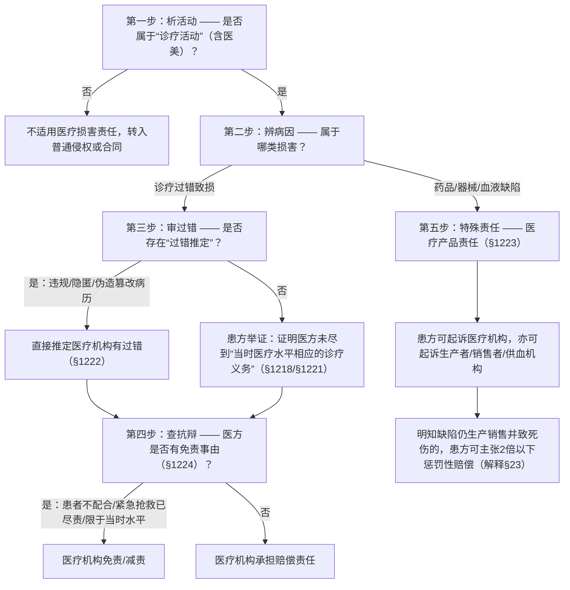

# 📐 医疗损害责任归责与特殊要件判定 · 完整答题模型

同学们好！我是你们的民法法考教练。在法考中，**“医疗损害责任”**是特殊侵权责任中高频且极具迷惑性的一个考点。

很多同学做这一章的题目，容易陷入“医院是大机构、治死人肯定要赔”的朴素正义观，或者把医疗责任错记成“无过错责任”。今天，我们用最接地气、最严谨的方式，彻底拆透这个核心考点。

---

## 适用场景与解决问题

本模型适用于患者在**诊疗活动**（包括普通诊疗、手术、特殊检查以及**医疗美容**等）中遭受人身或财产损害，向医疗机构或相关产品责任方索赔的场景。

重点破解以下法考命题陷阱：
1. **归责原则的“定性错觉”**：明晰医疗损害原则上是**过错责任**，患方承担举证责任，而非无过错责任；
2. **过错推定情形的“精准记忆”**：背诵并精确套用 §1222 推定医院有过错的三种法定情形（违规、隐匿/拒供病历、伪造/篡改/销毁病历）；
3. **“明确同意”的范围变迁**：理解《民法典》时代知情同意不限于“书面”，只要是“明确同意”即可，防范以“仅口头同意”判定违反义务的陷阱；
4. **紧急抢救时的“自主决定权”边界**：区分“无法取得患者及近亲属同意”与“有近亲属在场但拒绝签字”的不同处理；
5. **缺陷医疗产品的“双向请求权”**：因药品、器械、不合格血液致损的，患方可告医院也可告生产者/供血机构，医院先赔后可追偿（不真正连带责任）。

> **核心一句**：
> **医疗损害看诊疗，过错原则患方举；拒供篡改推过错，器械缺陷两头诉；告知需要明确意，紧急救助找院长。**

---

## 一、核心考情

- **频次研判**：医疗损害责任是《民法典》第七编侵权责任编的 ★★★ 级高频考点。在客观题中，它极易与产品责任、不真正连带责任、诉讼追加被告、精神损害赔偿等进行综合考查。
- **命题核心**：
  1. **举证责任分配**：患者须自证“诊疗行为 + 损害后果 + 诊疗过错 + 因果关系”。
  2. **过错推定的法定化**：命题人常设计医院“拒绝提供病历”或“偷偷修改病历”的情节，考核是否适用过错推定。
  3. **不真正连带责任与追偿**：考查患者的索赔选择权，以及医院无过错时向生产者追偿的权利。

---

## 二、医疗损害判定图谱（五步判定模型）

---

## 三、四大核心机制与考点精析

### 1. 归责原则与举证责任：一般过错 vs 法定推定
* **一般过错责任（§1218）**：
  * 医疗损害适用**过错责任原则**。
  * **谁主张谁举证**：由患方（患者）承担举证责任，证明医疗机构存在诊疗过错、因果关系。如果无法提交，患方申请鉴定的，法院应予准许。
  * **注意**：赔偿主体只能是**医疗机构**，不能起诉具体的医务人员个人（因为属于职务行为，由机构对外担责）。
* **法定过错推定情形（§1222）【背诵铁则】**：
  在以下三种情形下，**无须患方证明过错**，直接推定医院有过错：
  1. 违反法律、行政法规、规章以及其他有关诊疗规范的规定；
  2. 隐匿或者拒绝提供与纠纷有关的病历资料；
  3. 遗失、伪造、篡改或者违法销毁病历资料。
  * *陷阱警示*：仅仅是病历有些许瑕疵，不直接导致推定过错。必须是该瑕疵导致了“医疗损害鉴定不能”或属于上述恶意行为。

### 2. 说明同意义务与紧急抢救（§1219、§1220）
* **“明确同意”的灵活形式（§1219）**：
  * 医务人员进行手术、特殊检查、特殊治疗，应当说明风险、替代方案等，并取得患者的**“明确同意”**。
  * **形式不限**：取消了原《侵权责任法》“书面同意”的硬性限制，口头、录音录像、微信确认均可，只要意图“明确”即可。未尽告知义务致损的，医院担责。
* **紧急抢救的自主实施程序（§1220）【必考点】**：
  因抢救生命垂危的患者等紧急情况，实施紧急救治的规则：
  * **前提**：不能取得患者或者其近亲属意见（如患者昏迷且无亲属在场，或亲属联系不上，或亲属虽在场但无理拒绝签字）。
  * **程序**：经**医疗机构负责人**（院长或授权的科室主任等）批准，可以立即实施相应的医疗措施。
  * **责任**：在此情形下，医院只要尽到合理诊疗义务，免除未履行告知同意的责任。
  * *陷阱警示*：如果患者神志清醒有同意能力，或者近亲属在场且能够正常沟通，医院**绝不能**跳过告知同意程序“自主决定”。

### 3. 免责/减责事由（§1224）
医疗机构能够证明下列情形之一的，不承担赔偿责任：
1. **患者或者其近亲属不配合**医疗机构进行符合诊疗规范 of 诊疗（若医疗机构也有过错的，承担相应的赔偿责任）；
2. 医务人员在抢救生命垂危的患者等**紧急情况下已尽到合理诊疗义务**；
3. **限于当时的医疗水平**难以诊疗。

### 4. 医疗产品责任（§1223、司法解释§23）
* **不真正连带责任**：
  因药品、消毒产品、医疗器械的缺陷，或者输入不合格的血液造成患者损害的：
  * 患者可以向**医疗机构**请求赔偿，也可以向**生产者/供血机构**请求赔偿。
  * **内部追偿**：若缺陷纯属产品本身原因，医疗机构赔偿后，有权向生产者/销售者追偿；若损害是由医疗机构的过错（如超期存放、保管不当）引起的，生产者/销售者赔偿后，有权向医疗机构追偿。
* **惩罚性赔偿的适用**：
  * 若产品的生产者、销售者**明知**产品存在缺陷仍然生产、销售，造成患者死亡或者健康严重损害的，受害人有权请求**二倍以下**的惩罚性赔偿。

---

## 四、万能五步答题模型

在法考卷中，如果遇到医疗损害案件，请严格按照以下五步进行结构化答题：

### 第一步：定活动
- 审查涉案行为是否发生在“诊疗活动”（含医疗美容）中。
  - 是 ➔ 适用医疗损害责任。
  - 否 ➔ 转入一般侵权或产品侵权。

### 第二步：分病因
- 损害是由于**医疗产品的缺陷（药/器械/血）**造成的，还是**医务人员的诊疗行为过错**造成的？
  - 产品缺陷 ➔ 适用 **§1223 不真正连带责任**（可任选医院或生产商为被告；若原告起诉单方，法院可根据申请追加另一方为共同被告）。
  - 诊疗过错 ➔ 进入第三步。

### 第三步：审过错（最关键踩分点）
- 审查是否存在 **§1222 推定过错的三种法定情形**：
  - 医院是否**违规**诊疗？是否**隐匿/拒提/伪造/篡改/销毁**病历？
    - 是 ➔ 直接推定医疗机构有过错，举证责任倒置，由医院证明自己无过错。
    - 否 ➔ 患方承担举证责任，证明医院未尽到与当时医疗水平相应的诊疗义务。

### 第四步：核同意
- 涉及手术、特殊检查等，医方是否取得了患者的**“明确同意”**？
  - 若为紧急抢救，是否符合 **§1220** 的紧急程序（无法取得同意 + 院长批准）？
    - 若违规自主实施 ➔ 医院应对因此造成的损害承担赔偿责任。

### 第五步：查免责
- 审查医院是否享有 **§1224** 的抗辩权（患者不配合且医院无过错、限于当时医疗水平、紧急情况已尽到合理义务）。
  - 最终得出医院是否担责、承担多大比例责任的结论。

---

## 五、真题/金题演练与模型涵摄

### 1. 2016年司法考试三卷第23题（[[侵权责任-单选-19 · 医疗损害-患方承担举证责任\|侵权-单选-19]]）
* **事实**：田某突发重病神志不清，田父送至医院，医院使用进口医疗器械手术，手术失败田某死亡。田父起诉医院诊疗违规，要求赔偿。
* **选项辨析与模型涵摄**：
  * **A选项**：“医疗损害适用过错责任原则，由患方承担举证责任”。
    * *模型涵摄（第三步）*：依据 §1218，医疗损害属于过错责任，患方负有对过错的初步举证责任（除非存在 §1222 的推定情形）。A正确。
  * **B选项**：“医院实施该手术，无法取得田某的同意，可自主决定”。
    * *模型涵摄（第四步）*：依据 §1219/§1220，田某虽然昏迷无法同意，但**田父（近亲属）在场**，医院应向田父告知并取得其同意，绝不能“自主决定”。B错误。
  * **C选项**：“如因医疗器械缺陷致损，患方只能向生产者主张赔偿”。
    * *模型涵摄（第二步/第五步）*：器械缺陷属于医疗产品责任（§1223），适用不真正连带责任，患方既可向医院要，也可向生产者要，非“只能向生产者”。C错误。
  * **D选项**：“医院有权拒绝提供相关病历，且不会因此承担不利后果”。
    * *模型涵摄（第三步）*：依据 §1222，医院隐匿或拒绝提供病历的，直接**推定医院有过错**，会承担严重的不利后果（输官司）。D错误。
* **结论**：选 **A**。

---

## 相关页面

- 上层 / 概念：[[侵权责任编]] · [[民事责任体系]]
- 既有模型关联：📐 [[民法-侵权-侵权责任模型]]（全局宏观侵权调度模型）· 📐 [[民法-合同-请求权竞合模型]]
- 适用真题：[[侵权责任-单选-19 · 医疗损害-患方承担举证责任\|侵权-单选-19]]
