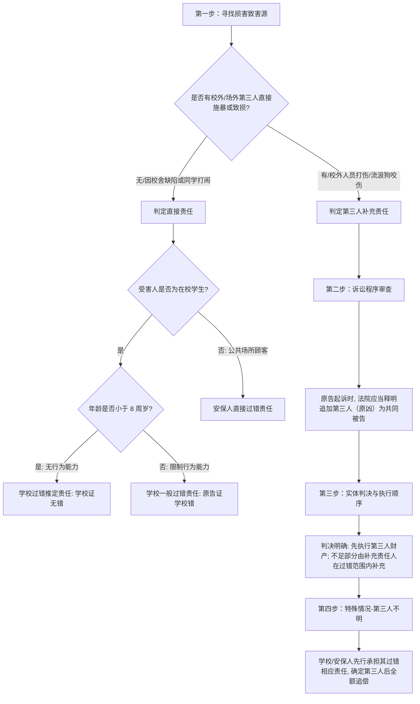

# 📐 安全保障与教育机构第三人侵权 · 完整答题模型

## 适用场景与解决问题

本模型主要解决“在宾馆、商场、餐馆、娱乐场所等公共场所，或者在学校、幼儿园等教育机构内，**因校外第三人或外来人的直接侵权行为**导致他人（如顾客、学生）人身或财产受到损害”的场景。重点判定：
1. **直接侵权与补充侵权的顺位划分**：确立直接加害的“第三人”与防守失职的“安全保障人/教育机构”之间的赔偿顺位及责任比例；
2. **诉讼被告的追加与释明**：解决起诉时仅列补充责任人为被告时，法院是否应当释明追加直接加害人为被告的程序要求（解释一§14）；
3. **强制执行的“两步走”规则**：在执行程序中，如何严格执行先“原凶”后“学校/安保人”的财产顺序；
4. **追偿权的行使条件**：判定补充责任人赔偿后，是否享有向直接侵权人全额追偿的权利。

---

## 一、 核心考情

- **频次研判**：安全保障义务与学校责任（特别是第三人致损的情形）是法考特殊主体侵权中的 ★★★★★ 级重难点，属于主客观题常青树。
- **最新法规红利**：2024 年 9 月 27 日施行的《侵权责任编解释（一）》第十四条对“在校内遭受校外第三方人身损害”的执行顺序和释明追加进行了重构，**彻底理顺了补充责任从“程序审理”到“强制执行”的闭环，终结了实务中“直接执行学校”的乱象**。
- **命题陷阱**：
  1. 学生在校被外来人员打伤，原告仅起诉学校，法院直接判令学校承担“连带责任”或“按份责任”。**【错】**（属于补充责任，且程序上法院必须释明追加第三人为共同被告）。
  2. 顾客在商场被抢劫，商场未配备保安。顾客起诉商场，商场抗辩称“打人的是劫匪，自己主观上又没有恶意，不应赔偿”。**【错】**（商场未尽安保义务，承担与其过错相应的补充赔偿责任）。
  3. 安保人/学校承担补充责任后，主张与直接侵权人（第三人）内部按份分摊，不能全额追偿。**【错】**（补充责任人垫付后，享有向第一责任人第三人全额追偿的权利）。
  4. 只要学生在校受伤，学校一律承担“过错推定责任”。**【错】**（区分年龄与致害源：无行为能力人自伤/同学伤适用过错推定；限制行为能力人自伤/同学伤适用过错责任；外来第三人致伤一律适用第三人主责+学校过错补充责任）。

---

## 二、 核心规则体系（直接责任 vs 补充责任）

通过对比“学校直接责任”与“第三人侵权下的补充责任”，厘清逻辑：

### 1. 安全保障人 / 教育机构直接责任（无第三人介入）
*   **安全保障人直接责任（§1198Ⅰ）**：宾馆、商场、娱乐场所等公共场所的经营者、管理者或者群众性活动的组织者，未尽到安全保障义务，造成他人损害的，应当承担**过错赔偿责任**（直接责任，无追偿）。
*   **教育机构直接责任（§1199、§1200）**：学生在校期间因学校设施缺陷、管理失职或同学打闹受伤（无外来第三人介入）：
    *   **无民事行为能力人（<8周岁）**：适用**过错推定责任**（学校需自证已尽管理职责，否则直接担责）。
    *   **限制民事行为能力人（8-18周岁）**：适用**过错责任原则**（受害人举证证明学校未尽到教育、管理职责，否则学校不担责）。

### 2. 第三人致损下的“相应的补充责任”（有第三人介入）
*   **法律依据（§1198Ⅱ、§1201 + 解释一§14）**：
    *   **第一责任人**：实施侵权行为的**第三人（主责、直接责任）**。
    *   **第二责任人**：未尽到安全保障义务/管理职责的**安保人/教育机构（补充责任）**。
    *   **责任性质**：补充责任人仅在“与其过错相应的范围内”承担补充赔偿责任。
*   **追偿权明文化**：安全保障人或教育机构承担补充责任后，**有权向第三人追偿**。

---

## 三、 万能答题决策树

在法考中分析公共场所/校园伤害案件，请依下列步骤涵摄：

---

## 四、 命题人最爱的 5 个陷阱

1. **“第三人不明则免责”陷阱**：
   * *设计*：学生在校被校外翻墙进来的蒙面人打伤，因警方无法查明该蒙面人是谁，学校抗辩称“第一责任人不明确，自己不承担补充责任”。
   * *破防*：**错误**（解释一§14第3款）。第三人不确定的，未尽到管理职责的教育机构应当**先行承担与其过错相应的责任**；待以后确定了第三人，学校可以再向其追偿。
2. **“直接申请强制执行学校”陷阱**：
   * *设计*：法院判决第三人赔偿 10 万元，学校在未尽管理职责的过错范围内承担 3 万元的补充责任。原告拿到判决书后，因第三人逃匿，直接向法院申请查封学校名下的校车。
   * *破防*：**错误**（解释一§14第1款）。补充责任具有**顺位抗辩权**。执行程序必须严格“两步走”，必须在人民法院**就第三人的财产依法强制执行后仍不能履行的范围内**，才能开始执行学校的财产。
3. **“安保义务无限扩张”陷阱**：
   * *设计*：老王在小区外的公共绿地散步时被流浪狗咬伤，起诉绿地旁边的物业公司承担安全保障补充责任。
   * *破防*：**错误**（[[侵权责任-不定项-01 · 爬树摔伤-私人树木无安保义务|侵权-不定项-01]]）。安全保障义务的适用主体具有**法定空间限制**，仅限于经营场所、公共场所的管理者或群众性活动组织者。普通私人树木、非物业管辖的公共绿地，管理人不负有社会安保义务。
4. **“学校安全责任与监护人责任混淆”陷阱**：
   * *设计*：8 岁的小明在学校将同学小强打伤，小强父母起诉学校承担无过错替代责任。
   * *破防*：**错误**。学校不是学生的监护人。学生在校致人损害，第一责任人仍是该学生的监护人（无过错责任§1188）；学校只有在“未尽教育、管理职责”时承担**过错责任**，与监护人共同构成分别侵权，而非替代监护。
5. **“补充责任等同于按份责任”陷阱**：
   * *设计*：宾馆保安脱岗，导致歹徒深夜潜入房间将旅客打伤。歹徒无财产，法院判决歹徒与宾馆各承担 50% 的责任。
   * *破防*：**错误**。安保人承担的是“相应的补充责任”，这意味着：如果歹徒有 10 万元财产，必须先执行歹徒这 10 万元；只有在歹徒无力偿还的范围内，宾馆才在“未尽安全保障义务的过错限度内”（例如限额 3 万元）承担补充责任，而不是直接与歹徒划分比例按份对外。

---

## 五、 真题演练

### 1. 安保义务优先于监护补充（[[侵权责任-单选-07 · 监护人责任-游乐场安保义务优先于监护补充|侵权-单选-07]]）
*   *案情简述*：7 岁的小明在儿童游乐场玩耍，因游乐场设备断裂受伤。小明父母起诉游乐场。
*   *考点拆解*：
    1. 游乐场属于公共经营场所，对场内儿童负有直接的安全保障义务。
    2. 设备断裂表明游乐场未尽到安全保障义务，属于直接侵权行为，应直接承担**过错责任**（游乐场承担全部赔偿责任）。
    3. 不能以监护人未时时刻刻贴身看护为由主张“监护人应当自行承担部分责任”进行免责。

### 2. 精神损害赔偿与安全保障（[[侵权责任-单选-10 · 安保义务-洗浴中心地滑精神损害赔偿|侵权-单选-10]]）
*   *案情简述*：顾客在洗浴中心因地滑（未贴警示牌，无防滑垫）摔伤，导致骨折。顾客起诉洗浴中心赔偿医疗费及精神损害抚慰金。
*   *考点拆解*：
    1. 洗浴中心未拖地、未设防滑垫，属于典型未尽到安全保障义务，直接承担过错责任。
    2. 身体受损达到严重程度的，被侵权人有权同时主张精神损害赔偿（《民法典》§1183）。

### 3. 物业安保与第三人致损（[[侵权责任-单选-16 · 物业安保义务-流浪狗伤人|侵权-单选-16]]）
*   *案情简述*：业主在小区内被外来流浪狗咬伤，起诉物业公司。
*   *考点拆解*：
    1. 流浪狗（无主人）致损，物业公司作为小区的安全保障义务人，若未采取合理的驱赶、门卫值守措施，主观上存在过错。
    2. 物业公司在未尽到安保义务的过错范围内承担**相应的补充责任**。

---

## 相关页面

- 上层概念：[[侵权责任编]] · [[安全保障义务]]
- 既有模型关联：📐 [[民法-侵权-侵权责任模型]] · 📐 [[民法-侵权-用工劳务与承揽人侵权模型]]（用工关系对照）
- 适用真题：[[侵权责任-单选-07 · 监护人责任-游乐场安保义务优先于监护补充]] · [[侵权责任-单选-10 · 安保义务-洗浴中心地滑精神损害赔偿]] · [[侵权责任-多选-03 · 安保义务-饭店车库停车被盗多重请求权]] · [[侵权责任-单选-16 · 物业安保义务-流浪狗伤人]] · [[侵权责任-单选-17 · 安保义务-楼梯玩手机摔伤自身过失自担]] · [[侵权责任-多选-12 · 帮工关系安保义务-海区潜水训练溺亡]] · [[侵权责任-不定项-01 · 爬树摔伤-私人树木无安保义务]] · [[侵权责任-多选-04 · 教育机构责任-已尽合理注意可免责]]
