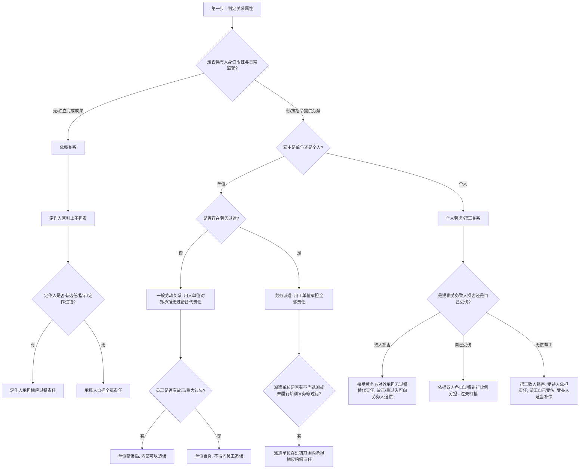

# 📐 用工、劳务与承揽人侵权 · 完整答题模型

## 适用场景与解决问题

本模型主要解决“工作人员、雇员、帮工或独立承包人在提供劳动/完成工作期间致人损害或自身受损时，民事责任主体的确认与责任分担”场景。重点判定：
1. **用工关系的属性识别**：区分“劳动/雇佣（劳动关系）”、“劳务派遣”、“个人劳务”、“无偿帮工”与“承揽关系”，不同关系对应完全相反的归责原则；
2. **对外赔偿主体的确定**：判定被侵权人可以起诉谁（如用人单位、用工单位、接受劳务方、受益人或承揽人）；
3. **内部追偿权的边界划定**：理清赔偿后能否向雇员、派遣单位或帮工人进行追偿，以及追偿是否受“故意或重大过失”的限制；
4. **工作人员违法犯罪的连带责任判定**：理清在执行任务中实施犯罪时，刑事程序与民事赔偿责任的扣减关系。

---

## 一、 核心考情

- **频次研判**：用工劳务与承揽侵权是法考特殊主体侵权中的 ★★★★★ 级超级重难点，与监护人责任并列为客观题与主观题案例的核心客体。
- **最新法规红利**：2024 年 9 月 27 日施行的《侵权责任编解释（一）》第十五、十六、十七、十八条对此类纠纷进行了全面细化，重构了劳务派遣过错比例、定作人选任过错追偿、以及工作人员犯罪民事扣减等核心司法规则。
- **命题陷阱**：
  1. 劳务派遣中被派遣人因工作致损，被侵权人合并起诉派遣单位与用工单位时，主张两单位承担“无条件连带责任”的抗辩。**【错】**（用工单位主责，派遣单位仅在过错范围内承担责任）。
  2. 员工送快递时顺便砸坏路人车辆，邮局主张“员工存在一般过失，应由员工和邮局按份赔偿”。**【错】**（对外由单位承担全部无过错替代责任，只有内部追偿才看员工是否有故意或重大过失）。
  3. 装修工人在刷外墙时掉落砸伤路人，被侵权人主张业主作为定作人承担无过错赔偿。**【错】**（承揽关系中承揽人独立担责，定作人仅在选任等过错内承担相应过错责任）。
  4. 员工送餐时盗窃顾客财物被判刑，受害人起诉外卖平台，平台以“涉嫌犯罪已被刑事追缴，不承担民事责任”为由抗辩。**【错】**（用人单位仍需依法承担民事责任，但刑事追缴退赔的部分应予扣减）。

---

## 二、 核心规则体系（四大关系辨析）

用工劳务与承揽责任可归纳为以下四大体系分支，各分支规则对比如下：

| 关系类型 | 法条依据 | 对外责任承担者 | 归责原则性质 | 内部追偿规则 | 关键细节 / 新规突破 |
| :--- | :--- | :--- | :--- | :--- | :--- |
| **劳动 / 雇佣** | §1191Ⅰ + 解释一§15、17 | **用人单位**（个体工商户从业人员致损，由个体户主责） | **无过错替代责任** | 仅限工作人员有**故意或重大过失**时可追偿 | 执行工作任务中犯罪，单位仍需负民事责任，但可扣除刑事追缴/退赔金额（§17） |
| **劳务派遣** | §1191Ⅱ + 解释一§16 | **用工单位**（实际使用人）承担全部责任 | 用工无过错 / 派遣**过错补充责任** | 派遣单位在**不当选派/培训未尽责**等过错内分担责任 | 赔偿费用总额不得超出原告总损失；派遣单位赔后可依据协议或法律追偿 |
| **个人劳务（帮工）**| §1192 + 人损解释§4 | **接受劳务方** / **帮工受益人** | **无过错替代责任** | 故意或重大过失可追偿；帮工受伤由受益人合理补偿 | 提供劳务一方**自己受伤**：双方按**各自过错分担**（过失相抵） |
| **承揽关系** | §1193 + 解释一§18 | **承揽人**（独立完成工作者）自担责任 | **过错责任**（定作人选任/指示有过错才担责） | 定作人赔偿后，有权向承揽人追偿（§18） | 区分承揽（看结果，重独立性）与雇佣（看过程，重人身依附性） |

---

## 三、 万能答题模型（四步连贯判定法）

> **核心记忆口诀**：**“一判法律关系，二定对外责任，三理内部追偿，四看自身受伤”**。

### 第一步：判关系（看依附性、独立性与无偿性）
做题时，切忌直接套用责任，必须先做**“法律关系的事实判定”**。通过以下标准进行分流：
1. **看是否有“人身依附性与日常监督管理”**：
   - **有依附性**：属于用工关系（劳动/劳务派遣/个人劳务）。
   - **无依附性**（独立完成工作成果、自备工具、自行安排时间）：属于**“承揽关系”**。
2. **看是“单位用工”还是“个人用工”**：
   - **单位用人**：如果通过第三方派遣，属于**“劳务派遣”**；若是直接招用，属于**“用人单位责任”**。
   - **个人用工**：如果是个人雇人干活，属于**“个人劳务”**；如果是邻里亲友义务帮忙干活且无对价，属于**“无偿帮工”**。

### 第二步：定对外（谁赔路人？）
一旦确定法律关系，立即对照确定被侵权人的诉讼起诉对象与责任分担：
1. **用人单位责任（§1191Ⅰ）**：
   - **赔偿主体**：**用人单位**承担全部替代责任，工作人员对外不直接承担赔偿责任。
   - **刑民交叉（解释一§17）**：工作人员执行任务构成犯罪（如诈骗、非法集资），**单位的民事责任不消灭**，但可在民事赔偿中扣减通过刑事追缴退赔的金额。
2. **劳务派遣（§1191Ⅱ）**：
   - **主责主体**：实际享受劳务的**用工单位**。
   - **过错分担（解释一§16）**：派遣单位只有在“选派/培训”中有过错才在**过错范围内**承担责任（非连带，按份相应责任）。
3. **个人劳务/帮工（§1192）**：
   - **个人劳务**：提供劳务者致人损害，由**接受劳务一方**承担无过错替代责任。
   - **无偿帮工**：帮工人致人损害，由**被帮工人（受益人）**承担替代责任；若帮工人有**故意或重大过失**，被帮工人与帮工人承担**连带责任**。
4. **定作人责任（§1193）**：
   - **主体定位**：原则上由**承揽人**自己对外担责，定作人不担责。
   - **例外（解释一§18）**：定作人在“选任、指示、定作”中有过错的，在**过错范围内**承担**相应赔偿责任**。

### 第三步：理追偿（雇主赔完能找干活的人要钱吗？）
雇主对外承担责任后，能否向具体致害人追偿？
1. **单位用人（§1191Ⅰ）**：必须证明工作人员存在**“故意或者重大过失”**才可以追偿。一般过失不得追偿（单位自行承担经营风险）。
2. **劳务派遣（解释一§16Ⅱ）**：用工单位或派遣单位对外赔偿后，有权依据《民法典》及派遣协议向对方追偿；派遣公司有过错赔偿后也可依协议追偿。
3. **个人劳务（§1192Ⅰ）**：接受劳务一方只有在提供劳务者有**“故意或者重大过失”**时，才可以向其追偿。
4. **定作人（解释一§18）**：定作人因选任等过错对外承担赔偿责任后，**有权向承揽人追偿**（因为承揽人是直接侵权人）。

### 第四步：看自损（干活的人自己受伤了怎么赔？）
如果干活的人（工作人员/雇员/帮工）在工作中自己受了伤：
1. **用人单位（劳动关系）**：走**工伤保险程序**。若因第三方侵权导致，可构成工伤保险与第三人侵权双重请求权竞合。
2. **个人劳务（§1192Ⅱ）**：提供劳务一方自己受伤的，双方根据**各自过错**承担相应的责任（适用过失相抵规则，非无过错责任）。
3. **无偿帮工（人损解释§4）**：
   - **帮工人自己受伤**：被帮工人（受益人）承担与受益范围相适应的**合理补偿责任**（无过错，只需补偿）。
   - **因第三人致损**：由第三人承担赔偿责任。若第三人无力赔偿或下落不明，被帮工人（受益人）予以**合理补偿**，补偿后受益人有权向第三人追偿。

---

## 四、 万能答题决策树

在法考中判断用工劳务与承揽案件，请依下列步骤决策：

---

## 五、 命题人最爱的 5 个陷阱

1. **劳务派遣“绝对连带”陷阱**：
   * *设计*：被派遣人员在工作中撞伤人，被侵权人请求派遣单位与用工单位承担连带责任。
   * *破防*：**错误**。劳务派遣实行的是**“单向替代+过错相应分担”**。用工单位（用人单位）直接承担侵权人应承担的**全部责任**；派遣单位只有在“选派不当、未依法培训”等**有过错**时，才在**过错范围内**承担相应的责任，不能一律判令连带责任。
2. **用人单位“员工共担”陷阱**：
   * *设计*：某物流公司快递员因普通超速（一般过失）撞伤路人，判决快递员与物流公司按份或连带赔偿被侵权人。
   * *破防*：**错误**。对外责任中，被侵权人只能请求**用人单位**承担替代责任，员工在诉讼中并非赔偿责任主体；内部追偿中，只有员工存在**故意或重大过失**时才能追偿，一般过失时用人单位应自行消化运营风险。
3. **承揽关系“雇佣等同”陷阱**：
   * *设计*：业主老张请小李（个体工匠）修自来水管，小李因操作不当导致水管爆裂淹了楼下邻居，邻居起诉老张承担侵权替代责任。
   * *破防*：**错误**。修水管属于以特定工作成果为目的的“承揽关系”，小李具有独立工作的属性，并非老张的雇员。老张作为定作人，若无“选任、定作、指示”上的过错，不承担任何赔偿责任。
4. **工作人员“犯罪全免”陷阱**：
   * *设计*：理财公司经理执行工作任务时实施非法吸收公众存款罪，导致投资人巨额损失。受害人起诉理财公司承担民事赔偿，公司抗辩称“属于刑事犯罪，应走刑事追缴程序，民事责任消灭”。
   * *破防*：**错误**（解释一§17）。工作人员执行任务构成犯罪时的责任分配：用人单位仍承担民事替代责任，刑事退赔追缴可扣减。
5. **个人劳务“一律全赔”陷阱**：
   * *设计*：老王雇佣小李修剪自家树木，小李未系安全带（自身有过错）从树上掉下摔伤，起诉老王要求赔偿全部医疗费。
   * *破防*：**错误**。提供劳务一方因劳务自己受伤的，不适用无过错责任，而是根据**“双方各自的过错”**分担责任，适用过失相抵规则。

---

## 六、 真题演练

### 1. 用工责任与免责协议（[[侵权责任-单选-08 · 用工责任-拳击馆免责协议因重大过失无效|侵权-单选-08]]）
*   *案情简述*：拳击手王某与某拳击馆签约执行商业拳击赛任务，合同约定“训练与比赛中产生的人身伤害拳击馆概不负责”。后王某因裁判失职受伤，起诉拳击馆。
*   *考点拆解*：
    1. 拳击馆与王某之间属于用工关系，因执行工作任务受损。
    2. 合同中约定免除用人单位人身伤害责任的条款，属于《民法典》第 506 条“免除人身伤害责任”的无效免责条款，**自始无效**。
    3. 拳击馆依法应当承担相应的雇主赔偿责任。

### 2. 劳务派遣中的责任分担（[[侵权责任-单选-09 · 劳务派遣-用工主责派遣有过错承担相应责任|侵权-单选-09]]、[[侵权责任-多选-08 · 劳务派遣-骨质疏松体质加重损害|侵权-多选-08]]、[[侵权责任-多选-09 · 劳务派遣故意行为-问错误说法|侵权-多选-09]]）
*   *案情简述*：派遣员工小张在送货（用工任务）中撞伤人，受害人合并起诉劳务派遣单位与用工单位。
*   *考点拆解*：
    1. 由实际享受劳务的**用工单位**承担侵权人的**全部赔偿责任**。
    2. 派遣公司若不存在“选派不当、未提供交强险培训”等主观过错，不承担任何赔偿责任（不能判令其承担连带责任）。

### 3. 个人劳务与无偿帮工（[[侵权责任-多选-10 · 帮工责任-帮工人受伤与致第三人受伤|侵权-多选-10]]）
*   *案情简述*：小李义务帮邻居老张家搬家，搬运中家具掉落砸坏了楼下停放的轿车；另外小李自己也在搬运过程中脚踝骨折。
*   *考点拆解*：
    1. 小李无偿搬家属于**“无偿帮工”**。
    2. **帮工致损对外由受益人老张承担赔偿责任**，除非小李有故意或重大过失（此处小李仅是一般疏忽，故老张全责）。
    3. **帮工受伤由受益人老张给予适当的合理补偿**（人身损害赔偿解释§4）。

---

## 相关页面

- 上层概念：[[侵权责任编]] · [[民事责任主体]]
- 既有模型关联：📐 [[民法-侵权-侵权责任模型]]（总论归责） · 📐 [[民法-侵权-安全保障与教育机构第三人侵权模型]]（补充责任对照）
- 适用真题：[[侵权责任-单选-08 · 用工责任-拳击馆免责协议因重大过失无效]] · [[侵权责任-单选-09 · 劳务派遣-用工主责派遣有过错承担相应责任]] · [[侵权责任-多选-08 · 劳务派遣-骨质疏松体质加重损害]] · [[侵权责任-多选-09 · 劳务派遣故意行为-问错误说法]] · [[侵权责任-多选-10 · 帮工责任-帮工人受伤与致第三人受伤]] · [[侵权责任-多选-11 · 定作人责任-承揽关系与施工损害]]
