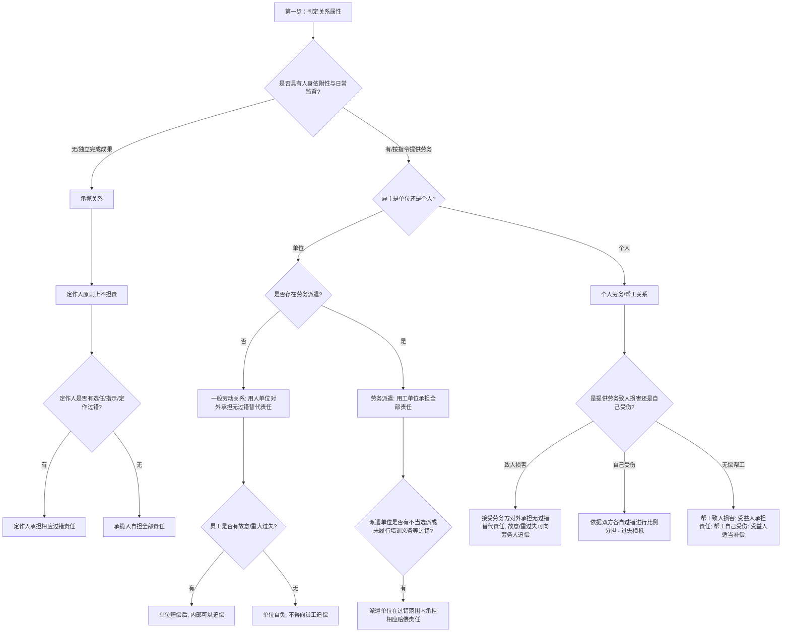

# 📐 用工、劳务与承揽人侵权 · 完整答题模型

## 适用场景与解决问题

本模型主要解决“工作人员、雇员、帮工或独立承包人在提供劳动/完成工作期间致人损害或自身受损时，民事责任主体的确认与责任分担”场景。重点判定：
1. **用工关系的属性识别**：区分“劳动/雇佣（劳动关系）”、“劳务派遣”、“个人劳务”、“无偿帮工”与“承揽关系”，不同关系对应完全相反的归责原则；
2. **对外赔偿主体的确定**：判定被侵权人可以起诉谁（如用人单位、用工单位、接受劳务方、受益人或承揽人）；
3. **内部追偿权的边界划定**：理清赔偿后能否向雇员、派遣单位或帮工人进行追偿，以及追偿是否受“故意或重大过失”的限制；
4. **工作人员违法犯罪的连带责任判定**：理清在执行任务中实施犯罪时，刑事程序与民事赔偿责任的扣减关系。

---

## 一、 核心考情

- **频次研判**：用工劳务与承揽侵权是法考特殊主体侵权中的 ★★★★★ 级超级重难点，与监护人责任并列为客观题与主观题案例的核心客体。
- **最新法规红利**：2024 年 9 月 27 日施行的《侵权责任编解释（一）》第十五、十六、十七、十八条对此类纠纷进行了全面细化，重构了劳务派遣过错比例、定作人选任过错追偿、以及工作人员犯罪民事扣减等核心司法规则。
- **命题陷阱**：
  1. 劳务派遣中被派遣人因工作致损，被侵权人合并起诉派遣单位与用工单位时，主张两单位承担“无条件连带责任”的抗辩。**【错】**（用工单位主责，派遣单位仅在过错范围内承担责任）。
  2. 员工送快递时顺便砸坏路人车辆，邮局主张“员工存在一般过失，应由员工和邮局按份赔偿”。**【错】**（对外由单位承担全部无过错替代责任，只有内部追偿才看员工是否有故意或重大过失）。
  3. 装修工人在刷外墙时掉落砸伤路人，被侵权人主张业主作为定作人承担无过错赔偿。**【错】**（承揽关系中承揽人独立担责，定作人仅在选任等过错内承担相应过错责任）。
  4. 员工送餐时盗窃顾客财物被判刑，受害人起诉外卖平台，平台以“涉嫌犯罪已被刑事追缴，不承担民事责任”为由抗辩。**【错】**（用人单位仍需依法承担民事责任，但刑事追缴退赔的部分应予扣减）。

---

## 二、 核心规则体系（四大关系辨析）

用工劳务与承揽责任可归纳为以下四大体系分支，各分支规则对比如下：

| 关系类型 | 法条依据 | 对外责任承担者 | 归责原则性质 | 内部追偿规则 | 关键细节 / 新规突破 |
| :--- | :--- | :--- | :--- | :--- | :--- |
| **劳动 / 雇佣** | §1191Ⅰ + 解释一§15、17 | **用人单位**（个体工商户从业人员致损，由个体户主责） | **无过错替代责任** | 仅限工作人员有**故意或重大过失**时可追偿 | 执行工作任务中犯罪，单位仍需负民事责任，但可扣除刑事追缴/退赔金额（§17） |
| **劳务派遣** | §1191Ⅱ + 解释一§16 | **用工单位**（实际使用人）承担全部责任 | 用工无过错 / 派遣**过错补充责任** | 派遣单位在**不当选派/培训未尽责**等过错内分担责任 | 赔偿费用总额不得超出原告总损失；派遣单位赔后可依据协议或法律追偿 |
| **个人劳务（帮工）**| §1192 + 人损解释§4 | **接受劳务方** / **帮工受益人** | **无过错替代责任** | 故意或重大过失可追偿；帮工受伤由受益人合理补偿 | 提供劳务一方**自己受伤**：双方按**各自过错分担**（过失相抵） |
| **承揽关系** | §1193 + 解释一§18 | **承揽人**（独立完成工作者）自担责任 | **过错责任**（定作人选任/指示有过错才担责） | 定作人赔偿后，有权向承揽人追偿（§18） | 区分承揽（看结果，重独立性）与雇佣（看过程，重人身依附性） |

---

## 三、 万能答题模型（四步连贯判定法）

> **核心记忆口诀**：**“一判法律关系，二定对外责任，三理内部追偿，四看自身受伤”**。

> 用工、劳务还是承揽人侵权”（《民法典》第1191-1193条），是一道分值极高但陷阱重重的硬骨头。做这类题，千万不要看选项和题干里怎么称呼（比如题目说“雇佣”，实际上可能是承揽）。我们必须无条件死守第一道防御关卡：**“第一步：判关系（看依附性、独立性与无偿性）”**。这决定了后续的归责原则：是“雇主承担无过错替代责任”，还是“干活的人自己承担独立责任”。

### 第一步：判关系（看依附性、独立性与无偿性）

> **“听话依附是雇佣，要成果是承揽，无偿帮忙叫帮工”**

- **“听话依附是雇佣”**：如果干活的人必须遵守雇主的规章制度、接受日常监督和指令指挥，提供的是**劳动力的消耗过程**，工具由雇主提供，这属于**雇佣/用工关系**（包括劳动关系、劳务派遣、个人劳务）。

- **“要成果是承揽”**：如果干活的人自备工具、自行安排时间，不受雇主日常指点，雇主只关心最终的**工作成果**（独立性极强），这属于**承揽关系**。

- **“无偿帮忙叫帮工”**：如果干活的人是为了他人利益，自愿义务帮忙，并且**不拿任何报酬**（无对价），这属于**无偿帮工关系**。

#### 2. 大白话讲解

我们用老王找小李干活的三种不同情况，彻底拆透这三种法律关系的本质差别：

- **场景一：专职司机小李（✅ 雇佣/劳务关系 —— 听话依附）** 老王个人的奔驰车需要司机，雇了小李。小李每天必须早上9点准时到老王家，开着老王的奔驰车，按照老王指定的路线开往公司。老王按月给小李发工资。小李在送老王上班途中撞了路人。
    
    - **名师拆解**：小李的工作内容是提供“驾驶劳务”的过程，开什么车、走哪条路全部听老王指挥（人身依附性强），属于**个人劳务关系**。小李是雇员，老王是雇主。小李撞了人，对外由雇主老王承担**无过错替代责任**。

- **场景二：粉刷外墙的小李（✅ 承揽关系 —— 要成果）** 老王别墅的外墙脏了，老王找了做涂料生意的小李，说：“把这面墙刷白，完工后我给你500块钱。”小李带着自己买的涂料、刷子和脚手架来到老王家，今天刷、明天刷、怎么刷全由小李自己决定。小李在刷墙时不小心掉落一块砖头，砸伤了路人。
    - **名师拆解**：老王只关心外墙刷白没有（要工作成果），不插手小李的工作过程。小李自备工具，独立完成工作。这属于**承揽关系（第1193条）**。小李是承揽人，老王是定作人。砸伤人的责任由承揽人小李**自己承担**，老王原则上不担责（除非老王明知小李没有高空作业资质还雇他，有过错才承担过错相应责任）。
- 
- **场景三：热心抬冰箱的小李（✅ 无偿帮工 —— 无偿帮忙）** 老王买了一台大冰箱，一个人搬不上楼。邻居小李在楼道遇到，二话不说：“老王，我来帮你抬！”抬楼梯时小李手一滑，冰箱砸下去把路过的小囡砸伤了。
    
    - **名师拆解**：小李帮老王干活，没有任何报酬，是纯粹的好心帮忙，这属于**无偿帮工关系**。小李是帮工人，老王是受益人（被帮工人）。小李砸伤人的责任，对外由受益人老王承担赔偿责任。
#### 3. 一句话闭环记忆

> **“听话指挥是雇佣，老板全赔；独立干活要成果，自己担责；无偿帮忙是帮工，受益人赔。”**

> 做题时，先看干活的人是不是“带家伙来只卖成果”。如果自备工具只卖成果，定承揽，定作人原则上不赔；如果是听指令卖劳动力过程，定雇佣，老板全赔；如果分文不收，定帮工，受益人赔！

### 第二步：定对外（谁赔路人？）

> 在判定完用工关系的属性后，接下来就是受害人（路人）在法庭上指控的焦点——**“第二步：定对外（谁赔路人？）”**（《民法典》第1191-1193条及最新司法解释）。这一步决定了原告写起诉书时，被告一栏到底写“干活的员工”，还是写“背后的老板/公司”，以及两被告之间是“连带”还是“各自承担”。

- **“雇佣单位包”**：普通的劳动/个人劳务关系中，员工执行工作任务致损，全部由**用人单位/雇主**承担替代责任，员工对外不赔。-> 不是连带责任 , 刑事和民事交叉-  [[# 侵权-单选-42]]

- **“派遣用工担”**：劳务派遣工致损，由实际享受劳务的**用工单位（使用人）**承担全部责任；派遣公司仅在有选派/培训等过错时承担过错相应责任（非连带）。

- **“帮工看主观”**：无偿帮工致损，原则上由**受益人（被帮工人）**赔；但如果帮工人有**故意或重大过失**，则帮工人和受益人承担**连带责任**。

- **“承揽自己赔”**：承揽关系中，独立干活的**承揽人自己对外赔偿**；定作人原则上不赔，仅在选任、指示等有过错时承担过错相应责任。

#### 大白话讲解

我们依然请出老王、老张、小李，看看不同的干活人撞伤了路人老张，法官会判谁赔钱：

- **场景一：快递小哥撞人（✅ 用人单位责任 —— 雇主包赔）** 某邮局的快递员小李，在开三轮车送快递途中，因为超速将正常过马路的老张撞伤，花去医药费5000元。
    
    - **名师拆解**：小李是执行工作任务的员工。受害者老张在诉讼中，应当起诉**邮局（用人单位）**，由邮局承担无过错替代责任，全额赔偿5000元。小李对外不需要承担民事赔偿责任。老张不能要求小李和邮局按份赔或连带赔。

- **场景二：派遣保安撞人（✅ 劳务派遣 —— 用工单位主担）** 保全公司（派遣单位）把保安小李派遣到大华商场（用工单位）工作。小李在商场值班巡逻时，因为操作不当开巡逻车撞伤了顾客老张。
    
    - **名师拆解（谁赔老张？）**：
        1. **主责任人**：由实际享受劳务的**用工单位（大华商场）**承担全部赔偿责任。
        2. **派遣公司责任**：派遣公司只有在选派小李（如明知小李没有驾照还派他去开巡逻车）时有过错，才在**过错范围内**承担相应的过错责任。如果派遣公司没有过错，老张不能要求派遣公司赔，更不能要求两家连带。

- **场景三：无偿帮工砸伤人（✅ 帮工看主观 —— 故意重过才连带）** 隔壁小李义务帮老王家抬冰箱，在抬下楼时：
    
    - **情况A（一般疏忽）**：小李脚滑了一下，冰箱滑落砸伤了路人老张。
        - **名师拆解**：小李主观上只是一般过失。由受益人**老王承担全部赔偿责任**，小李对外不赔。

    - **情况B（故意或重大过失）**：小李因为跟老王有私仇，在抬到老张头顶上时，故意把手一松，将冰箱扔下去砸伤老张。
        - **名师拆解**：小李主观上是故意。此时小李的免责保护伞失效，由**受益人老王与帮工人小李承担连带赔偿责任**。

- **场景四：高空粉刷工坠砖（✅ 承揽关系 —— 承揽人自担）** 老王请高空刷墙工小李（独立工匠）刷外墙。小李在刷墙时不小心掉落一块砖头，砸伤了路人老张。
    
    - **名师拆解**：这是承揽关系。原则上由直接致害人**承揽人小李自己承担全部赔偿责任**，老王不赔。只有在老王明知小李没有高空安全生产资质却执意选任他（选任有过错）时，老王才在**过错范围内**承担相应的赔偿责任。

#### 3. 一句话闭环记忆

> **“送快递公司全赔，派遣工用工单位扛，承揽人砸人自己赔，帮工使坏才连带。”**

> 做题时，看到员工致损，直接把单位列为赔偿主体；看到派遣工，重点起诉用工单位；看到承揽人，责任归承揽人自己；看到无偿帮工，原则归受益人，除非帮工故意使坏才判连带！

### 第三步：理追偿（雇主赔完能找干活的人要钱吗？）

> 在用工与承揽侵权的题目中，很多同学在判定完“老板对外赔了路人”之后，就拍拍屁股结案了。其实，命题人特别喜欢在案件的结尾加一句话：“公司赔偿后，有权向小李追偿，法院应予支持。该选项是否正确？” 这就进入了**“第三步：理追偿（雇主赔完能找干活的人要钱吗？）”**。这决定了最终这笔钱是公司自己吞下，还是能管干活的人要回来。

> **“雇工意重才追偿，承揽定作必可追”**

- **“雇工意重才追偿”**：无论是公司员工（劳动关系）还是个人雇工（劳务关系），雇主对外赔完钱后，只有证明雇员存在**“故意或重大过失”**时，才可以向雇员追偿。如果只是一般过失，属于公司经营风险，**绝对不准追偿**。

- **“承揽定作必可追”**：在承揽关系中，如果定作人（业主）因为选任过错等赔了钱，由于承揽人才是直接加害人，定作人赔付后，**有权向承揽人全额追偿**（不受故意重过失的限制）。

- **接受劳务方的向后追偿权** 接受劳务方王某所负的补偿义务具有“先行垫付”和“分担风险”的性质，最终责任应当由第一直接致害人赵某承担。因此，王某补偿孙某 2 万元后，有权向直接致害人赵某追偿这 2 万元 [[侵权责任-多选-29 · 帮工关系-因第三人致提供劳务者损害之补充补偿与向第三人追偿案]]

#### 大白话讲解

我们用小李在不同工作岗位上砸坏路人豪车，老板对外赔了10万元之后的内部清算故事，彻底对比追偿规则：

- **场景一：快递小哥送货超速（❌ 雇工一般过失 —— 不能追偿）** 某邮局的快递员小李急着送快递，路上因为避让行人操作不当，刮伤了路边的劳斯莱斯。邮局对外赔偿了10万元。小李的行为属于普通超速违章（一般过失）。
    
    - **名师拆解**：小李是通过劳动给公司创造剩余价值的员工。他在工作中因为一般疏忽（一般过失）导致的侵权，属于正常的经营和出险风险，应当由公司自行消化。邮局赔了10万后，**不能管小李追偿一分钱**。

- **场景二：快递小哥醉驾送货（✅ 雇工故意/重大过失 —— 可以追偿）** 快递员小李中午喝了半斤白酒，下午醉酒驾驶快递车，冲上人行道把路人撞伤。邮局对外赔偿了10万元。
    
    - **名师拆解**：醉酒驾车送货，这属于典型的**重大过失/故意**。小李严重违背了劳动职责和注意义务，他的免责保护伞破裂。邮局对外赔了10万后，**有权向小李全额（或部分）追偿这10万元**。
- **场景三：业主老王雇无证电焊工（✅ 承揽关系 —— 赔后必可追）** 老王要把二楼窗户装个防盗网，为了图便宜，找了根本没有特种作业操作证（无电焊工证）的独立工匠小李。小李在电焊时，火花掉落引燃了楼下的杂物堆，造成火灾，损失10万元。法官判定：老王选任无证电焊工，有过错，应当在过错范围内承担30%（3万元）的赔偿责任，剩下7万由小李赔。老王赔了3万元给受害者。
    
    - **名师拆解**：小李是独立的承揽人，他是火灾的直接制造者。老王虽然因为“选人眼瞎”（选任过错）赔了3万，但根据最新司法解释第十八条，**老王赔付后，有权就这3万元向承揽人小李进行全额追偿**。

#### 一句话闭环记忆

> **“自己员工一般错，公司吞下不能追；故意重过才追偿；承揽闯祸定作赔，回头全数找他追。”**

> 做题时，先看干活的人身份。如果是公司员工或保姆，只有在“喝醉酒”、“故意使坏”等故意或重大过失时，雇主赔完才能找他追偿；如果是独立的装修工、工匠（承揽人）闯祸，业主因为选人过错赔了钱，回头必须可以找他要回全部垫付款！

### 第四步：看自损（干活的人自己受伤了怎么赔？）

> 在用工与承揽侵权的题目中，前面三步我们分析的都是“干活的人撞伤了路人，路人怎么要钱”。现在，命题人要把刀口对准干活的人自己：**“如果干活的员工、雇员、帮工在干活中自己受了伤，医疗费该由谁来掏？”** 这就是**“第四步：看自损（干活的人自己受伤了怎么赔？）”（依据《民法典》第1192条第2款及人损司法解释第四条）。 这是法考客观题里极其高频、也最容易混淆的责任分担考点。

- **“工伤走保险”**：如果是公司的正式员工（存在劳动关系）在执行任务中自己受伤，直接走**工伤保险程序**。

- **“雇工看双错”**：如果是个人雇佣的保姆、小时工等（个人劳务）在干活中自己受伤，双方根据**各自的过错大小**来分担责任，适用过失相抵（雇主不是无条件全包）。

- **“帮工予补偿”**：如果是无偿帮工的邻里亲友在帮工中自己受伤，被帮工人（受益人）即使完全没有过错，也应当在受益范围内给予**合理的补偿**。

#### 大白话讲解

我们用小李在不同岗位上自己受了伤（医药费花了1万元）的故事，对比三种不同的索赔结局：

- **场景一：快递小哥送快递摔伤（✅ 劳动关系 —— 走工伤）** 邮局快递员小李，在雨天骑车送快递途中，因为路面湿滑自己摔倒骨折，花去医药费1万元。
    
    - **名师拆解**：小李是邮局正式招用的员工，属于劳动关系。他是在工作时间和工作场所内因工作原因受伤，直接向社保局申请**工伤保险待遇**。如果公司没给他买工伤保险，则由邮局参照工伤保险的标准自己掏钱赔小李。

- **场景二：保姆擦玻璃摔伤（✅ 个人劳务 —— 看双方过错）** 老王花钱雇保姆小李打扫卫生，让小李去擦二楼阳台的外侧玻璃。
    
    - **情况A（小李自己大意，老板提醒过）**：老王给小李准备了安全绳，叮嘱她一定要系上。但小李嫌麻烦没系，在擦玻璃时不小心踩空摔伤，骨折花去1万元。
        - **名师拆解**：老王尽到了提供工具和提醒的义务，无过错；小李自己不系安全绳，有重大过失。根据双方**各自的过错**分担责任，法官可能会判小李自己承担80%（8000元），老王只承担20%（2000元）。

    - **情况B（老王给小李拿了坏梯子）**：老王给小李拿了一个坏掉的木梯子，小李爬上去时梯子断裂摔伤，花去1万元。
        - **名师拆解**：老王提供不合格的工具，有过错；小李正常使用，无过错。老王必须承担主要的赔偿责任（比如赔偿9000元）。

- **场景三：邻居帮忙抬冰箱砸伤脚（✅ 无偿帮工 —— 适当补偿）** 隔壁小李义务、无偿帮老王抬冰箱上楼。抬的过程中，小李脚滑了一下摔倒，冰箱砸在小李脚上导致骨折，花去1万元医药费。老王当时在前面拉着，没有任何过错。
    
    - **名师拆解**：小李是出于好心无偿帮工。小李是为了老王的利益而受伤，老王是唯一的受益人。虽然老王完全没有过错，但根据人损司法解释第四条，**受益人老王应当给予小李合理的补偿**（例如判决老王补偿小李6000元）。这体现了民法不让“英雄/好人既流血又贴钱”的公平精神。
#### 一句话闭环记忆

> **“公司职工走工伤，雇工自损看双错，好心帮工受了伤，受益老板给补偿。”**

> 做题时，先看受伤的人拿不拿工资。如果拿公司工资，直接走工伤；如果拿私人雇主的工资（保姆/小时工），看双方各自的过错比例分摊；如果是免费帮忙的，不需要看有没有过错，受益的主人家直接给“合理补偿”！

如果干活的人（工作人员/雇员/帮工）在工作中自己受了伤：
1. **用人单位（劳动关系）**：走**工伤保险程序**。若因第三方侵权导致，可构成工伤保险与第三人侵权双重请求权竞合。
2. **个人劳务（§1192Ⅱ）**：提供劳务一方自己受伤的，双方根据**各自过错**承担相应的责任（适用过失相抵规则，非无过错责任）。
3. **无偿帮工（人损解释§4）**：
   - **帮工人自己受伤**：被帮工人（受益人）承担与受益范围相适应的**合理补偿责任**（无过错，只需补偿）。
   - **因第三人致损**：由第三人承担赔偿责任。若第三人无力赔偿或下落不明，被帮工人（受益人）予以**合理补偿**，补偿后受益人有权向第三人追偿。

---

## 四、 万能答题决策树

在法考中判断用工劳务与承揽案件，请依下列步骤决策：

---

## 五、 命题人最爱的 5 个陷阱

1. **劳务派遣“绝对连带”陷阱**：
   * *设计*：被派遣人员在工作中撞伤人，被侵权人请求派遣单位与用工单位承担连带责任。
   * *破防*：**错误**。劳务派遣实行的是**“单向替代+过错相应分担”**。用工单位（用人单位）直接承担侵权人应承担的**全部责任**；派遣单位只有在“选派不当、未依法培训”等**有过错**时，才在**过错范围内**承担相应的责任，不能一律判令连带责任。
2. **用人单位“员工共担”陷阱**：
   * *设计*：某物流公司快递员因普通超速（一般过失）撞伤路人，判决快递员与物流公司按份或连带赔偿被侵权人。
   * *破防*：**错误**。对外责任中，被侵权人只能请求**用人单位**承担替代责任，员工在诉讼中并非赔偿责任主体；内部追偿中，只有员工存在**故意或重大过失**时才能追偿，一般过失时用人单位应自行消化运营风险。
3. **承揽关系“雇佣等同”陷阱**：
   * *设计*：业主老张请小李（个体工匠）修自来水管，小李因操作不当导致水管爆裂淹了楼下邻居，邻居起诉老张承担侵权替代责任。
   * *破防*：**错误**。修水管属于以特定工作成果为目的的“承揽关系”，小李具有独立工作的属性，并非老张的雇员。老张作为定作人，若无“选任、定作、指示”上的过错，不承担任何赔偿责任。
4. **工作人员“犯罪全免”陷阱**：
   * *设计*：理财公司经理执行工作任务时实施非法吸收公众存款罪，导致投资人巨额损失。受害人起诉理财公司承担民事赔偿，公司抗辩称“属于刑事犯罪，应走刑事追缴程序，民事责任消灭”。
   * *破防*：**错误**（解释一§17）。工作人员执行任务构成犯罪时的责任分配：用人单位仍承担民事替代责任，刑事退赔追缴可扣减。
5. **个人劳务“一律全赔”陷阱**：
   * *设计*：老王雇佣小李修剪自家树木，小李未系安全带（自身有过错）从树上掉下摔伤，起诉老王要求赔偿全部医疗费。
   * *破防*：**错误**。提供劳务一方因劳务自己受伤的，不适用无过错责任，而是根据**“双方各自的过错”**分担责任，适用过失相抵规则。

---

## 六、 真题演练

### 1. 用工责任与免责协议（[[侵权责任-单选-08 · 用工责任-拳击馆免责协议因重大过失无效\|侵权-单选-08]]）
*   *案情简述*：拳击手王某与某拳击馆签约执行商业拳击赛任务，合同约定“训练与比赛中产生的人身伤害拳击馆概不负责”。后王某因裁判失职受伤，起诉拳击馆。
*   *考点拆解*：
    1. 拳击馆与王某之间属于用工关系，因执行工作任务受损。
    2. 合同中约定免除用人单位人身伤害责任的条款，属于《民法典》第 506 条“免除人身伤害责任”的无效免责条款，**自始无效**。
    3. 拳击馆依法应当承担相应的雇主赔偿责任。

### 2. 劳务派遣中的责任分担（[[侵权责任-单选-09 · 劳务派遣-用工主责派遣有过错承担相应责任\|侵权-单选-09]]、[[侵权责任-多选-08 · 劳务派遣-骨质疏松体质加重损害\|侵权-多选-08]]、[[侵权责任-多选-09 · 劳务派遣故意行为-问错误说法\|侵权-多选-09]]）
*   *案情简述*：派遣员工小张在送货（用工任务）中撞伤人，受害人合并起诉劳务派遣单位与用工单位。
*   *考点拆解*：
    1. 由实际享受劳务的**用工单位**承担侵权人的**全部赔偿责任**。
    2. 派遣公司若不存在“选派不当、未提供交强险培训”等主观过错，不承担任何赔偿责任（不能判令其承担连带责任）。

### 3. 个人劳务与无偿帮工（[[侵权责任-多选-10 · 帮工责任-帮工人受伤与致第三人受伤\|侵权-多选-10]]）
*   *案情简述*：小李义务帮邻居老张家搬家，搬运中家具掉落砸坏了楼下停放的轿车；另外小李自己也在搬运过程中脚踝骨折。
*   *考点拆解*：
    1. 小李无偿搬家属于**“无偿帮工”**。
    2. **帮工致损对外由受益人老张承担赔偿责任**，除非小李有故意或重大过失（此处小李仅是一般疏忽，故老张全责）。
    3. **帮工受伤由受益人老张给予适当的合理补偿**（人身损害赔偿解释§4）。

---

## 相关页面

- 上层概念：[[侵权责任编]] · [[民事责任主体]]
- 既有模型关联：📐 [[民法-侵权-侵权责任模型]]（总论归责） · 📐 [[民法-侵权-安全保障与教育机构第三人侵权模型]]（补充责任对照） · 📐 [[民法-追偿权统一判断模型]]（追偿总枢纽·用工劳务＝A替代型·限故意或重大过失）
- 适用真题：[[侵权责任-单选-08 · 用工责任-拳击馆免责协议因重大过失无效]] · [[侵权责任-单选-09 · 劳务派遣-用工主责派遣有过错承担相应责任]] · [[侵权责任-多选-08 · 劳务派遣-骨质疏松体质加重损害]] · [[侵权责任-多选-09 · 劳务派遣故意行为-问错误说法]] · [[侵权责任-多选-10 · 帮工责任-帮工人受伤与致第三人受伤]] · [[侵权责任-多选-11 · 定作人责任-承揽关系与施工损害]]
