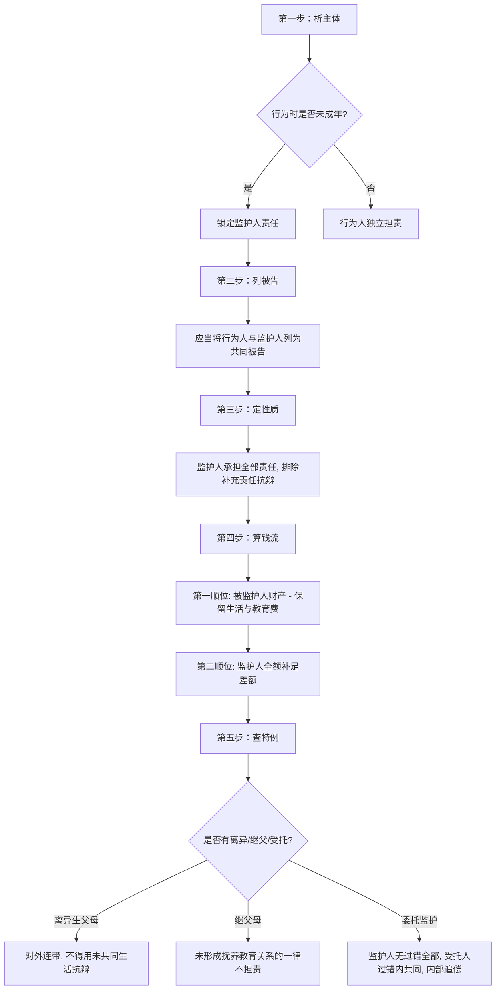

# 📐 监护人责任与财产支付顺序 · 完整答题模型

## 适用场景与解决问题

本模型主要解决“无民事行为能力人、限制民事行为能力人（未成年人或精神病人）造成他人损害时，民事责任与诉讼程序的判定”场景。重点判定：
1. **诉讼主体的确认（列谁为被告）**：确定是否必须将无/限制行为能力人与监护人列为共同被告，以及起诉时已成年后的被告追加释明规则；
2. **实体责任的分配与追偿**：区分监护人“全部责任”与“补充责任”的抗辩边界，理清离异生父母的连带共同责任与内部追偿权，判定未形成扶养关系的继父母以及委托监护中受托人的责任边界；
3. **财产支付的先后顺序**：判定赔偿金如何“先孩子、后家长”依次清偿，并划定被监护人必需生活费与义务教育费的扣除红线。

---

## 一、 核心考情

- **频次研判**：监护人责任是《民法典》特殊主体侵权中的 ★★★★★ 级必考考点。
- **最新巨变**：最高人民法院 2024 年 9 月 27 日施行的《侵权责任编解释（一）》第四至十条对该制度进行了系统重构，彻底终结了学术界与实务界长期的争论。**凡是 2025/2026 年法考涉及监护人侵权的题目，必须无条件适用新司法解释规则**。
- **命题陷阱**：
  1. 监护人主张“补充责任”或主张“免责/减责”的抗辩（新规一律不予支持）。
  2. 诉讼程序中仅起诉监护人或仅起诉已成年子女的被告遗漏（新规强制要求列为共同被告或释明追加）。
  3. 被监护人财产优先支付时的“保留红线”（必须保留必需生活费和义务教育费）。
  4. 离异父母以“不共同生活”为由申请免责（新规一律不予支持，外部连带，内部追偿）。

---

## 二、 核心规则体系（五大硬核法理）

根据《民法典》第 1188、1189 条及《侵权责任编解释（一）》第 4-10 条，监护人责任体系可归纳为以下五大核心支柱：

### 1. 诉讼地位：必须列为“共同被告”
*   **基本规则（解释一§4）**：被侵权人请求监护人承担责任，或者合并请求监护人和受托监护人承担责任的，**应当将无/限制民事行为能力人列为共同被告**。
*   **程序意义**：确保债务人（被监护人，即行为人）和责任承担人（监护人）同时在场，以便于合并审理及查明被监护人财产。

### 2. 实体责任：监护人全部责任 + 财产先子后父
*   **责任性质（解释一§5）**：监护人承担的是**侵权人应承担的全部责任，而不是补充责任**。
    *   *排他性*：监护人抗辩主张承担补充责任的，或者请求判令有财产的被监护人自己独立承担赔偿责任的，法院**一律不予支持**。
*   **财产支付顺序**：
    1.  **第一顺位**：赔偿费用可以**先从被监护人财产中支付**。
        *   > **[!⚠️ 财产保留红线]**：从被监护人财产中支付的，**应当保留被监护人所必需的生活费和完成义务教育所必需的费用**。如果扣除这两项后无剩余，则不能从小明财产中支付。
    2.  **第二顺位**：不足部分，由**监护人支付**。

### 3. 时间跨度：“行为时未成年，起诉时已成年”
*   **责任分配（解释一§6）**：
    *   行为发生时：未成年（不满 18 周岁）；
    *   被诉时：已成年（已满 18 周岁）。
    *   **结论**：被侵权人请求**原监护人承担侵权人应承担的全部责任的，法院应予支持**。赔偿费用同样遵循“先从行为人（已成年子女）财产中支付，不足部分由原监护人支付”的规则。
*   **释明追加规则**：被侵权人如果仅起诉行为人（子女）的，**人民法院应当向原告释明申请追加原监护人为共同被告**。

### 4. 复杂家庭结构下的责任划分
*   **离异父母的共同责任（解释一§8）**：
    *   *对外责任*：未成年子女造成他人损害，被侵权人请求离异夫妻共同承担责任的，法院应予支持。**一方以未与该子女共同生活为由主张不承担或少承担责任的，人民法院不予支持**（对外承担连带责任）。
    *   *内部份额与追偿*：离异夫妻之间可协议确定份额；协议不成的，法院根据履行监护职责的约定和实际履行情况确定。**实际承担责任超过自己份额的一方，有权向另一方追偿**。
*   **继父母的免责边界（解释一§9）**：
    *   继父或继母**未与该子女形成继父母子女关系（指无抚养教育关系）的，不承担侵权责任**。仅有共同居住生活的事实不能等同于形成了抚养教育关系。

### 5. 委托监护下的责任分担
*   **规则依据（民法典§1189 + 解释一§10）**：
    *   **监护人**：承担全部责任（不论监护人是否有过错，属无过错责任性质）。
    *   **受托人**：仅在**过错范围内与监护人共同承担责任**（过错责任性质，如保姆、委托代管人未尽到合理注意义务）。
    *   **责任上限**：责任主体实际支付 of 赔偿费用总和，不得超出被侵权人的总损失。

---

## 三、 万能五步做题步骤

> 在法考中，关于“监护人责任”（《民法典》第1188条）的题目，2024年最高院出台的最新司法解释《侵权责任编解释（一）》对其进行了大刀阔斧的重构。做监护人责任的题目，第一步也是最核心的一步，就是**“第一步：定时间与能力（析主体）”。 这决定了案件到底属于“**个人侵权”还是“监护人侵权**”，以及原告到底能管谁要钱、法院怎么列被告。

在法考中遇到未成年人或精神病人致人损害的题目，请按以下步骤涵摄：

###  **第一步：定时间与能力（析主体）**

> **“作恶时定乾坤，长大了也追家长”**

- **“作恶时定乾坤”**：判断是否适用监护人责任，只看**“侵害行为发生时”**加害人的行为能力状态。只要当时是无/限制民事行为能力人（如未成年人或精神病人），就铁定锁死监护人责任。

- **“长大了也追家长”**：即便起诉时孩子已经满18岁成年了，受害人依然可以起诉原监护人（父母）要求其承担全部赔偿责任。如果原告漏诉了家长，法院必须释明（提示）追加家长为共同被告。

#### 大白话讲解

我们用老王和他的儿子小王砸坏邻居老张豪车的故事，对比“行为时”和“起诉时”不同的时间截点在做题时的用法：

- **场景一：17岁砸车，19岁被起诉（✅ 行为时未成年 ➜ 长大了也追家长）** 

- 老王的儿子小王在17周岁时（限制行为能力人），因为跟同学打赌，一石头把老张家豪车的挡风玻璃砸个粉碎，造成10万元损失。老张当时没有起诉。两年后，小王满了19岁（已是成年人，有完全民事行为能力），老张这才搜集好证据向法院起诉，把小王和老王父子俩一起告了。 老王在法庭上抗辩：“我儿子现在都19岁了，有完全民事行为能力，应当由他自己承担责任。我已经不是他的监护人了，不该让我赔！”

    - **名师拆解**：
        1. **看行为时（作恶时定乾坤）**：砸车行为发生在小王17岁时（未成年）。因此，本案的定性铁定属于**监护人责任**。老王当年的监护缺位责任是抹不掉的。
        2. **看起诉时**：虽然小王19岁已经成年，但根据新司法解释第六条，老张请求原监护人老王承担全部赔偿责任的，法院**应当支持**！
        3. **算钱顺序**：先从小王名下个人财产（比如他打工存的钱）中支付；如果小王名下没钱，由原监护人老王全额补足。
        4. **诉讼程序（释明追加）**：如果老张起诉时图省事，只起诉了19岁的小王，法官必须对老张进行“释明”：“原告，小王作恶时未成年，建议你申请把他的父亲老王追加为共同被告。”老张申请后，法院将老王追加为共同被告。

- **场景二：18岁零1天砸车，19岁被起诉（❌ 行为时已成年 ➜ 家长彻底免责）** 

* 老王的儿子小王在18岁零1天的那天，把老张的豪车玻璃砸了。一年后，小王19岁时，老张起诉要求老王（爸爸）承担连带赔偿责任。
    
    - **名师拆解**：
        1. **看行为时**：砸车发生时，小王已经满18周岁，具有完全民事行为能力。
        2. **做题结论**：小王是成年人，砸车属于他个人的独立侵权行为。老王作为父亲，在法律上没有任何监护责任，**一分钱也不用赔**。老张只能起诉小王，如果小王没钱，老张无权要老王的财产。

#### 一句话闭环记忆

> **“作恶未满十八岁，纵使成名诉公堂，父母原监逃不掉，法院释明必追加。”**

> 做题时，判定责任只看“作恶那一瞬间”是否未成年。如果是未成年，即使起诉时他已经读大学、满18岁了，父母依然逃不掉全部赔偿责任。如果只起诉了孩子，法院必须释明追加原监护人！

###  **第二步：排程序与被告（列被告）**

> 确定了“时间与能力”锁死监护人责任后，我们必须立刻处理诉讼程序上的最核心规则——**“第二步：排程序与被告（列被告）”**。

> **“大小同诉，缺一不可”**

- **“大小同诉”**：起诉未成年人（或精神病人）侵权时，必须将**无/限制民事行为能力人本人（“小”）**和他的**监护人（“大”）**一并列为**共同被告**。

- **“缺一不可”**：不能因为孩子没钱就只告家长，也不能只告孩子。必须采取“捆绑列被告”的方式，否则属于重大的程序遗漏

#### 大白话讲解

我们用10岁的小明在学校打伤同学小花，小花爸爸去法院起诉讨要3000元医药费的例子，看看为什么必须“大小同诉”：

- **错误路子A：只起诉小明（❌ 漏掉了“大”）** 小花的爸爸在起诉书的被告一栏只写了：被告，小明（10岁）。
    
    - **名师拆解**：小明才10岁，是限制民事行为能力人，根本不具备独立进行诉讼活动的能力。而且，小明没有工作，小花爸爸告了他，判决下来可能只是一纸空文，因为真正掏钱的家长（监护人）不在被告席上，法院没法直接执行家长的财产。

- **错误路子B：只起诉小明爸妈（❌ 漏掉了“小”）** 小花爸爸觉得小明反正没钱，索性直接告家长。起诉书被告写：小明爸爸、小明妈妈。
    
    - **名师拆解**：动手打人的是小明，小明才是直接的债务人（加害主体）。更重要的是，法律规定“先从小明自己的财产中支付，不足的部分再由监护人赔”。如果小明不在被告席上，法院就没法在庭审中查明小明自己名下有没有压岁钱、长辈赠与的存款或名下房产。

- **正确姿势：大小同诉，一网打尽（✅ 共同被告）** 小花爸爸提交起诉书，被告一栏写：
    
    - **被告一**：小明（直接致害人）；
    - **被告二**：小明爸爸（监护人）；
    - **被告三**：小明妈妈（监护人）。 （同时，小明爸妈又是小明的法定代理人）。
    - **名师拆解**：这才是最完美的诉讼结构！小明和爸妈并列为**共同被告**。法官开庭时，可以一揽子查清：第一，小明是不是打人了？第二，小明自己有没有钱赔？第三，小明钱不够，爸妈如何补上？程序完全合法

#### 一句话闭环记忆

> **“孩子惹祸要告状，大鬼小鬼一起上；必须并列共同诉，只告一方程序黄。”**

> 做题时，只要是未成年人致人损害，起诉时必须把“孩子”和“家长（监护人）”一并列为共同被告。选项中如果写“仅以监护人为被告”或者“仅以未成年人为被告”，直接判定程序违法！

这是2024年最高院最新《侵权责任编解释（一）》第四条的硬性规定，也是命题人最爱在民诉交叉题中考查的程序红线。

###  **第三步：判实体与性质（定责任）**

> 在监护人责任的案件中，完成了第一步的“定性质”和第二步的“列被告”后，接下来就是实体审判中最核心的一环——**“第三步：判实体与性质（定责任）”**。在2024年最高院最新《侵权责任编解释（一）》出台之前，学术界和实务界一直在扯皮：如果小孩子自己名下有巨额压岁钱或继承的房产，家长是不是就可以退居二线，只承担“补充责任”？

> **“无过错全责，拒绝退后当补充”**

- **“无过错全责”**：监护人责任是法定的**无过错责任**。即便家长在法庭上痛哭流涕证明自己天天管教、已经尽到了监护职责，也只能**“减轻”**而**“绝不能免除”**责任。

- **“拒绝退后当补充”**：监护人必须为未成年人造成的全部损失承担**全部债务责任**。任何家长在法庭上抗辩“我只承担补充责任”或“让有钱的孩子自己去顶包”的，法院一律不予支持。

* 行为人在侵权行为发生时不满十八周岁，被诉时已满十八周岁的，被侵权人请求原监护人承担侵权人应承担的“全部责任”的，人民法院应予支持

#### 大白话讲解

我们用10岁的小明刮花豪车（修车费10万元），爸妈在法庭上推卸责任的经典案例，看透这一步的实体定性：

- **起因**：10岁的小明在小区里玩耍，用石子把邻居老张的劳斯莱斯刮花了，修车费需要10万元。小明外公去世时给他留了一笔5万元的定期存款。老张把小明和爸妈一并告上法庭。
    
- **爸妈在法庭上的抗辩（小算盘）**：
    
    - 抗辩一：“我们天天教育他爱护公物，我们尽到了监护职责，我们无过错，要求免责！”
    - 抗辩二：“小明名下有5万存款，应该让小明自己先赔，不够的5万我们再赔，我们只承担‘补充责任’！”
- **名师拆解（法官当庭驳回）**：
    
    1. **驳回抗辩一（关于过错）**：监护人责任是**无过错责任**，不看家长有没有错。你管教得再好，只要小明闯了祸，你就必须赔。法官顶多因为你尽了管教职责，酌情“减轻”你一点赔偿额（比如让你赔9万），但绝不能让你一分不赔（免责）。

    2. **驳回抗辩二（关于补充责任）**：最新司法解释第五条说得清清楚楚，监护人承担的是**侵权人应承担的全部责任，而不是补充责任**。你们夫妻俩必须在判决书上作为全部责任的承担者。你们不能要求判令小明自己去顶包，也不能主张自己只承担二线的“补充责任”。

    3. **那5万元存款怎么用？**：“先扣孩子财产”只是**执行时的付款顺序**，不是你们逃避全部责任的借口。10万的修车费，可以先从小明的5万存款里付（必须扣除保留小明吃饱饭和义务教育的书本费，如果有剩余才可支付），不够的5万，由你们爸妈全额补足！

#### 一句话闭环记忆

> **“家长担责无过错，尽了职责只减轻；全部责任扛上肩，休想推诿当补充。”**

>  做题时，如果选项中出现“监护人承担补充责任”、“因尽到监护职责而免责”或者“判令有财产的未成年人独立承担赔偿责任”，全部直接判定为错误选项！监护人必须是一线的主力全责承担者！。

###  **第四步：理清财产顺序（算钱流）**

>在监护人责任的案件中，理清了实体责任后，就到了法官执行判决算账的阶段——**“第四步：理清财产顺序（算钱流）”**（依据《民法典》第1188条第2款及最新《侵权责任编解释（一）》第五条）。这决定了赔偿款到底是从“孩子的压岁钱”里划扣，还是直接从“家长的工资卡”里划扣。 这也是法考极其喜欢在计算题、案例分析题中埋伏的细节雷区。

> **“先扣孩子后扣爹，生活教育动不得”**

* ***“先扣孩子后扣爹”**：赔偿费用在执行时有严格的**顺位性**。必须**“先”**从被监护人（孩子）名下的财产中支付，不足的部分，**“再”**由监护人（父母）全额补足。

- **“生活教育动不得”**：在扣划孩子名下的财产时，有一条法定的**保留红线**——必须无条件保留孩子**“必需的生活费”**和**“完成义务教育（九年制）所必需的费用”**。这两笔钱，哪怕天塌下来也不能动。

#### 大白话讲解

我们用10岁的小明砸坏了邻居老张的古董（需要赔偿10万元），爸妈和小明列共同被告的案例，看看法院执行局是如何精准“算钱流”的：

- **情况一：小明是个“小富翁”（名下财产扣除保留金后有剩余）** 小明名下有外公留给他的15万元存款。经评估，小明到18岁成年所必需的生活费加上读完初中的学杂费，一共需要**8万元**。
    
    - **名师拆解（执行局算账过程）**：
        1. **第一步（锁死红线）**：从小明15万存款中，先扣出8万元作为“生活教育保留金”。这8万元封印起来，任何人不得执行。
        2. **第二步（算孩子能出多少）**：15万 - 8万 = 7万元。这7万元是小明可以用来赔偿的自由财产。
        3. **第三步（执行划扣）**：法院先从小明账户划扣7万元赔给老张（第一顺位）。
        4. **第四步（家长补齐差额）**：10万修车费还差3万缺口，由小明爸妈掏自己的腰包补齐3万元（第二顺位）。

- **情况二：小明的钱刚好只够吃饭上学（赔偿能力为零）** 小明名下只有外公留给他的6万元存款。经评估，小明到成年所必需的生活费和完成九年义务教育的学费，刚好一共需要**6万元**。
    
    - **名师拆解（执行局算账过程）**：
        1. **第一步（锁死红线）**：从小明6万存款中，扣出6万元作为“生活教育保留金”。
        2. **第二步（算孩子能出多少）**：6万 - 6万 = 0元。小明虽然名下有6万元，但他的自由赔偿能力为零！
        3. **第三步（执行划扣）**：小明名下的6万元存款**一分钱都不能动**。
        4. **第四步（家长全额补足）**：老张的10万元赔偿款，全部由第二顺位人——小明的爸妈全额支付！

---

#### 3. 一句话闭环记忆

> **“赔偿执行子在前，生活教育必保留；余额不足家长补，红线费用绝不丢。”**

>  做题时，计算赔偿款清偿顺序，必须先用“孩子总资产”减去“必需生活费和义务教育费”。如果有剩余，先扣剩余部分；如果没剩余，孩子资产分文不取，全额由父母包揽！
>  

###  **第五步：看家变与委托（析细节）**

> 在监护人责任模型中，分析完前四步的常规清偿顺序后，最后一步就是应对命题人专门设计的各种“奇葩家庭结构”和“代管场景”的终极防御——**“第五步：看家变与委托（析细节）”**（依据2024最新《侵权责任编解释（一）》第八至十条）。法考极其喜欢在“父母离婚”、“继父继母”、“保姆/亲戚帮忙带娃”这三个细节上挖坑。今天，我们用三个故事把这些陷阱彻底铲平：

- **“离异连带难推脱”**：亲生父母离婚，对外对孩子造成的损害承担**连带赔偿责任**。任何一方不能以“孩子不跟我生活”为由申请减免。实际超额赔付者对内可向另一方追偿。

- **“继父看抚养”**：继父母只有与继子女实际形成了**抚养教育关系**（出钱出力养育管教），才承担监护责任。如果只是搭伙过日子、仅共同居住，继父母**一律不担责**。
	- **核心结论：形成抚养教育关系的继父，**对外与亲生父母承担连带责任**；
		- 内部可按责任份额相互追偿。
		1. 法律定位 形成抚养教育关系的继父，适用民法典父母子女关系规则，属于未成年继子女的法定监护人，监护地位与亲生父母完全平等。 
		2. 责任规则（2024年侵权责任编司法解释新规，法考必考） 
			* ***对外（对受害人）：连带责任** 继父 + 孩子的亲生父母（无论父母是否离婚、是否共同生活），对受害人承担连带赔偿责任。受害人有权要求其中任何一方全额赔付，各方不得以“没共同生活”“内部有责任划分”为由拒绝。 
			* *对内（监护人间）：按份可追偿
				* 多方监护人内部可按监护职责实际履行情况划分责任份额；实际赔偿超出自身份额的一方，有权向其他监护人追偿。 
				* 易错点（对应你之前的「继父看抚养」规则） 未形成抚养教育关系的继父，不属于监护人，**完全不承担监护责任**，全部责任由亲生父母承担。 
			* 法条依据 《民法典》第1072条第2款、《民法典侵权责任编解释（一）》第7条、第8条、第9条 *注：旧规中「未共同生活的父母承担补充责任」已被废止，现行规则为离异父母一律对外承担连带责任。*

- **“委托有过共同帮”**：委托他人（如保姆、亲戚）带娃期间孩子闯祸。**父母（委托人）作为监护人依然承担全部责任**；受托人只有在**自己有过错**的范围内，与父母共同承担责任。如果受托人无过错，则分文不赔。

    *   若父母离异，对外连带、主张不共同生活免责一律无效，内部多付可追偿。
    *   若有继父母，看是否有扶养关系；若有受托人，看受托人是否有过错（有错则在过错内与监护人共同担责）。

#### 大白话讲解

我们用10岁的小明踢球砸坏邻居2万元奢侈品包的案例，看看不同的家庭和代管场景下，责任该如何精准划分：

- **细节一：离异生父母推诿（✅ 离异连带难推脱）** 小明父母三年前离婚。小明归母亲抚养并共同生活，父亲按月付抚养费。小明砸坏包后，邻居要求父母共同赔偿2万。小明父亲在法庭上辩称：“我和小明已经三年不共同生活了，我也没法管教他，你们应该找他妈赔，我不赔！”
    
    - **名师拆解**：
        1. **对外责任**：生父母离婚不消除其法定监护职责。小明父亲的抗辩**一律无效**！小明父母对外承担**连带责任**。邻居可以直接管小明父亲要2万，父亲必须给。
        2. **对内追偿**：小明父亲给完钱后，可以根据离婚协议或者管教实际情况，回头管小明母亲**追偿**多付的部分。
- **细节二：二婚继父被诉（✅ 继父看抚养关系）** 小明母亲与富商老张（继父）再婚。老张和小明关系冷淡，小明的一切学费、生活费仍由其亲生父母负担，老张仅提供住房，从未履行过抚养和管教职责。小明砸坏包后，邻居起诉要求富商继父老张赔偿。
    
    - **名师拆解**：继父继母承担责任的前提是“形成了抚养教育关系”。老张虽然和小明共同居住，但并未实际出资或出力抚养教育小明。因此，继父老张**不承担任何侵权责任**。邻居只能起诉小明的亲生父母。

- **细节三：委托保姆看娃（✅ 委托有过错共同承担）** 小明父母工作忙，雇了保姆阿美看管10岁的小明。
    
    - **情况A（保姆偷懒玩游戏——有过错）**：阿美带小明在小区玩耍，阿美只顾低头躺在长椅上玩王者荣耀，对小明爬高踢球完全没注意，小明一脚将球砸在邻居的包上。
        - **名师拆解**：
            1. **监护人（父母）**：承担全部无过错责任（不论父母多忙，都得赔）。
            2. **受托人（保姆阿美）**：疏于看管，主观上**有过错**。阿美应当在**过错范围内与监护人共同承担责任**。

    - **情况B（保姆尽心尽责——无过错）**：阿美带小明去图书馆。阿美上厕所前，把小明安顿在座位上叮嘱：“小明，阿美去趟厕所，三分钟就回来，你坐着看书别乱跑。”不料小明趁阿美走后，偷偷跑到走廊把邻居的名牌包踢飞。
        - **名师拆解**：保姆阿美已经尽到了合理的注意和叮嘱义务，短暂离开属于正常生理需求，主观上**无过错**。保姆阿美**完全免责**，不赔一分钱。这2万元的损失，全部由小明的父母（监护人）承担。

---

#### 一句话闭环记忆

> **“生父离异外连带，继父无抚不担责；委托监护家长包，受托有过共同掏。”**

> 做题时，看到父母离婚直接判连带，不要听任何一方“没在一起生活”的借口；看到继父母，先看有没有养育事实，没养育不赔；看到保姆/亲戚带娃，先找家长全赔，再看保姆有没有犯错，有错保姆分担，无错保姆免责！

## 四· 口诀与经典真题对照

### 1. 口诀记忆
> **监护侵权列共同，全部责任不补充。**
> **先扣孩子生活教，差额父母来填平。**
> **成年虽过诉原监，法院释明要追加。**
> **离异推诿路不通，委托受托有过同。**

### 2. 适用真题（典型模拟）
*   **全部责任与财产支付顺序考点**：
    *   [[侵权责任-单选-33 · 监护人责任-全部责任与财产支付顺序案\|侵权-单选-33]]：小明骑车撞人，探讨全部责任与孩子存款清偿（生活与义务教育费保留）规则。
    *   [[侵权责任-单选-36 · 监护人责任-监护人尽责减轻责任而非免责案\|侵权-单选-36]]：小红扔手机致损，探讨监护人尽到职责时“减轻而非免责”的法定规则。
    *   [[侵权责任-多选-23 · 监护人责任-全部责任性质与执行保留限制综合案\|侵权-多选-23]]：小兵玩火引损，探讨法院不得判令孩子独立担责、强制保留费用的司法底线。
*   **共同被告与成年后责任考点**：
    *   [[侵权责任-单选-34 · 监护人责任-诉讼地位共同被告与成年后原监护人责任案\|侵权-单选-34]]：17岁砸车19岁被诉，原监护人全部责任及仅诉子女时法院的追加被告释明规则。
    *   [[侵权责任-单选-37 · 监护人责任-合并起诉与遗漏被监护人的共同被告列明案\|侵权-单选-37]]：小刚打伤同学被诉父母，探讨遗漏被监护人时法院必须追加为共同被告的规则。
    *   [[侵权责任-多选-24 · 监护人责任-诉讼地位与成年后追加被告释明规则综合案\|侵权-多选-24]]：小强在校伤人并已成年，综合探讨诉讼共同被告与释明追加的联动。
*   **离异夫妻与继父母责任划分考点**：
    *   [[侵权责任-单选-35 · 监护人责任-离异夫妻共同责任与追偿及继父母免责案\|侵权-单选-35]]：小强踢球砸豪车，探讨离异父母共同监护、不共同生活免责无效以及无扶养继父免责。
    *   [[侵权责任-单选-38 · 监护人责任-离异夫妻内部份额确定与超额追偿案\|侵权-单选-38]]：小明致损，探讨离异生父母内部责任份额协议效力及履行后的全额追偿诉求。
    *   [[侵权责任-多选-25 · 监护人责任-继父母免责边界与抚养关系认定综合案\|侵权-多选-25]]：小骏砸无人机，综合探讨继父母监护责任判定的“抚养教育关系事实”前置条件。
*   **委托监护中责任分担考点**：
    *   [[侵权责任-单选-39 · 监护人责任-委托监护中受托人有过错的责任承担案\|侵权-单选-39]]：保姆玩游戏疏忽致小宝扔花盆，探讨监护人全部责任，保姆在过错范围内与监护人共同承担责任。
    *   [[侵权责任-单选-40 · 监护人责任-委托监护中受托人无过错的免责判定案\|侵权-单选-40]]：叔叔周某尽责小华扫落书籍，探讨受托人无过错免责、监护人承担全部赔偿责任。
    *   [[侵权责任-多选-26 · 监护人责任-委托监护中责任上限与主客体诉讼定位综合案\|侵权-多选-26]]：姑姑看管小宝刮坏豪车，综合探讨共同被告列明与支付总额限制（不超2万元）。

---

## 相关页面

- 上层 / 概念：[[侵权责任编]] · [[民事责任主体]]
- 既有模型关联：📐 [[民法-侵权-侵权责任模型]] · 📐 [[民法-侵权-共同侵权与教唆帮助模型]]
- 适用真题：[[侵权责任-单选-33 · 监护人责任-全部责任与财产支付顺序案\|侵权-单选-33]] · [[侵权责任-单选-34 · 监护人责任-诉讼地位共同被告与成年后原监护人责任案\|侵权-单选-34]] · [[侵权责任-单选-35 · 监护人责任-离异夫妻共同责任与追偿及继父母免责案\|侵权-单选-35]] · [[侵权责任-单选-36 · 监护人责任-监护人尽责减轻责任而非免责案\|侵权-单选-36]] · [[侵权责任-单选-37 · 监护人责任-合并起诉与遗漏被监护人的共同被告列明案\|侵权-单选-37]] · [[侵权责任-单选-38 · 监护人责任-离异夫妻内部份额确定与超额追偿案\|侵权-单选-38]] · [[侵权责任-单选-39 · 监护人责任-委托监护中受托人有过错的责任承担案\|侵权-单选-39]] · [[侵权责任-单选-40 · 监护人责任-委托监护中受托人无过错的免责判定案\|侵权-单选-40]] · [[侵权责任-多选-23 · 监护人责任-全部责任性质与执行保留限制综合案\|侵权-多选-23]] · [[侵权责任-多选-24 · 监护人责任-诉讼地位与成年后追加被告释明规则综合案\|侵权-多选-24]] · [[侵权责任-多选-25 · 监护人责任-继父母免责边界与抚养关系认定综合案\|侵权-多选-25]] · [[侵权责任-多选-26 · 监护人责任-委托监护中责任上限与主客体诉讼定位综合案\|侵权-多选-26]]
