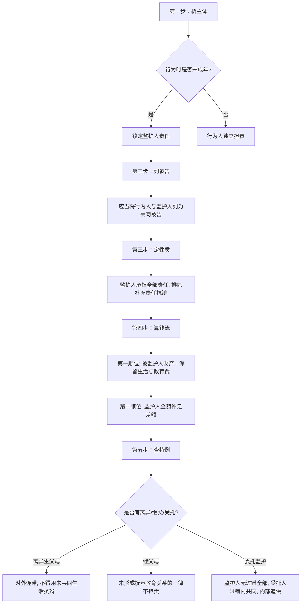

# 📐 监护人责任与财产支付顺序 · 完整答题模型

## 适用场景与解决问题

本模型主要解决“无民事行为能力人、限制民事行为能力人（未成年人或精神病人）造成他人损害时，民事责任与诉讼程序的判定”场景。重点判定：
1. **诉讼主体的确认（列谁为被告）**：确定是否必须将无/限制行为能力人与监护人列为共同被告，以及起诉时已成年后的被告追加释明规则；
2. **实体责任的分配与追偿**：区分监护人“全部责任”与“补充责任”的抗辩边界，理清离异生父母的连带共同责任与内部追偿权，判定未形成扶养关系的继父母以及委托监护中受托人的责任边界；
3. **财产支付的先后顺序**：判定赔偿金如何“先孩子、后家长”依次清偿，并划定被监护人必需生活费与义务教育费的扣除红线。

---

## 一、 核心考情

- **频次研判**：监护人责任是《民法典》特殊主体侵权中的 ★★★★★ 级必考考点。
- **最新巨变**：最高人民法院 2024 年 9 月 27 日施行的《侵权责任编解释（一）》第四至十条对该制度进行了系统重构，彻底终结了学术界与实务界长期的争论。**凡是 2025/2026 年法考涉及监护人侵权的题目，必须无条件适用新司法解释规则**。
- **命题陷阱**：
  1. 监护人主张“补充责任”或主张“免责/减责”的抗辩（新规一律不予支持）。
  2. 诉讼程序中仅起诉监护人或仅起诉已成年子女的被告遗漏（新规强制要求列为共同被告或释明追加）。
  3. 被监护人财产优先支付时的“保留红线”（必须保留必需生活费和义务教育费）。
  4. 离异父母以“不共同生活”为由申请免责（新规一律不予支持，外部连带，内部追偿）。

---

## 二、 核心规则体系（五大硬核法理）

根据《民法典》第 1188、1189 条及《侵权责任编解释（一）》第 4-10 条，监护人责任体系可归纳为以下五大核心支柱：

### 1. 诉讼地位：必须列为“共同被告”
*   **基本规则（解释一§4）**：被侵权人请求监护人承担责任，或者合并请求监护人和受托监护人承担责任的，**应当将无/限制民事行为能力人列为共同被告**。
*   **程序意义**：确保债务人（被监护人，即行为人）和责任承担人（监护人）同时在场，以便于合并审理及查明被监护人财产。

### 2. 实体责任：监护人全部责任 + 财产先子后父
*   **责任性质（解释一§5）**：监护人承担的是**侵权人应承担的全部责任，而不是补充责任**。
    *   *排他性*：监护人抗辩主张承担补充责任的，或者请求判令有财产的被监护人自己独立承担赔偿责任的，法院**一律不予支持**。
*   **财产支付顺序**：
    1.  **第一顺位**：赔偿费用可以**先从被监护人财产中支付**。
        *   > **[!⚠️ 财产保留红线]**：从被监护人财产中支付的，**应当保留被监护人所必需的生活费和完成义务教育所必需的费用**。如果扣除这两项后无剩余，则不能从小明财产中支付。
    2.  **第二顺位**：不足部分，由**监护人支付**。

### 3. 时间跨度：“行为时未成年，起诉时已成年”
*   **责任分配（解释一§6）**：
    *   行为发生时：未成年（不满 18 周岁）；
    *   被诉时：已成年（已满 18 周岁）。
    *   **结论**：被侵权人请求**原监护人承担侵权人应承担的全部责任的，法院应予支持**。赔偿费用同样遵循“先从行为人（已成年子女）财产中支付，不足部分由原监护人支付”的规则。
*   **释明追加规则**：被侵权人如果仅起诉行为人（子女）的，**人民法院应当向原告释明申请追加原监护人为共同被告**。

### 4. 复杂家庭结构下的责任划分
*   **离异父母的共同责任（解释一§8）**：
    *   *对外责任*：未成年子女造成他人损害，被侵权人请求离异夫妻共同承担责任的，法院应予支持。**一方以未与该子女共同生活为由主张不承担或少承担责任的，人民法院不予支持**（对外承担连带责任）。
    *   *内部份额与追偿*：离异夫妻之间可协议确定份额；协议不成的，法院根据履行监护职责的约定和实际履行情况确定。**实际承担责任超过自己份额的一方，有权向另一方追偿**。
*   **继父母的免责边界（解释一§9）**：
    *   继父或继母**未与该子女形成继父母子女关系（指无抚养教育关系）的，不承担侵权责任**。仅有共同居住生活的事实不能等同于形成了抚养教育关系。

### 5. 委托监护下的责任分担
*   **规则依据（民法典§1189 + 解释一§10）**：
    *   **监护人**：承担全部责任（不论监护人是否有过错，属无过错责任性质）。
    *   **受托人**：仅在**过错范围内与监护人共同承担责任**（过错责任性质，如保姆、委托代管人未尽到合理注意义务）。
    *   **责任上限**：责任主体实际支付 of 赔偿费用总和，不得超出被侵权人的总损失。

---

## 三、 万能五步做题步骤

在法考中遇到未成年人或精神病人致人损害的题目，请按以下步骤涵摄：

1.  **第一步：定时间与能力（析主体）**
    *   判断**行为发生时**和**起诉时**行为人的行为能力状态。
    *   若行为时未成年、起诉时已成年，锁定原监护人连带且法院有追加释明义务。
2.  **第二步：排程序与被告（列被告）**
    *   检查诉讼主体：必须将无/限制行为能力人与监护人一并列为**共同被告**。
3.  **第三步：判实体与性质（定责任）**
    *   监护人承担**全部责任**（排除“补充责任”或“免除责任”的抗辩）。
4.  **第四步：理清财产顺序（算钱流）**
    *   先从小明名下财产扣除（必须扣除**生活费 + 义务教育费**后有剩余才可支付），不足部分由监护人（父母）全额补足。
5.  **第五步：看家变与委托（析细节）**
    *   若父母离异，对外连带、主张不共同生活免责一律无效，内部多付可追偿。
    *   若有继父母，看是否有扶养关系；若有受托人，看受托人是否有过错（有错则在过错内与监护人共同担责）。

---

## 四· 口诀与经典真题对照

### 1. 口诀记忆
> **监护侵权列共同，全部责任不补充。**
> **先扣孩子生活教，差额父母来填平。**
> **成年虽过诉原监，法院释明要追加。**
> **离异推诿路不通，委托受托有过同。**

### 2. 适用真题（典型模拟）
*   **全部责任与财产支付顺序考点**：
    *   [[侵权责任-单选-33 · 监护人责任-全部责任与财产支付顺序案|侵权-单选-33]]：小明骑车撞人，探讨全部责任与孩子存款清偿（生活与义务教育费保留）规则。
    *   [[侵权责任-单选-36 · 监护人责任-监护人尽责减轻责任而非免责案|侵权-单选-36]]：小红扔手机致损，探讨监护人尽到职责时“减轻而非免责”的法定规则。
    *   [[侵权责任-多选-23 · 监护人责任-全部责任性质与执行保留限制综合案|侵权-多选-23]]：小兵玩火引损，探讨法院不得判令孩子独立担责、强制保留费用的司法底线。
*   **共同被告与成年后责任考点**：
    *   [[侵权责任-单选-34 · 监护人责任-诉讼地位共同被告与成年后原监护人责任案|侵权-单选-34]]：17岁砸车19岁被诉，原监护人全部责任及仅诉子女时法院的追加被告释明规则。
    *   [[侵权责任-单选-37 · 监护人责任-合并起诉与遗漏被监护人的共同被告列明案|侵权-单选-37]]：小刚打伤同学被诉父母，探讨遗漏被监护人时法院必须追加为共同被告的规则。
    *   [[侵权责任-多选-24 · 监护人责任-诉讼地位与成年后追加被告释明规则综合案|侵权-多选-24]]：小强在校伤人并已成年，综合探讨诉讼共同被告与释明追加的联动。
*   **离异夫妻与继父母责任划分考点**：
    *   [[侵权责任-单选-35 · 监护人责任-离异夫妻共同责任与追偿及继父母免责案|侵权-单选-35]]：小强踢球砸豪车，探讨离异父母共同监护、不共同生活免责无效以及无扶养继父免责。
    *   [[侵权责任-单选-38 · 监护人责任-离异夫妻内部份额确定与超额追偿案|侵权-单选-38]]：小明致损，探讨离异生父母内部责任份额协议效力及履行后的全额追偿诉求。
    *   [[侵权责任-多选-25 · 监护人责任-继父母免责边界与抚养关系认定综合案|侵权-多选-25]]：小骏砸无人机，综合探讨继父母监护责任判定的“抚养教育关系事实”前置条件。
*   **委托监护中责任分担考点**：
    *   [[侵权责任-单选-39 · 监护人责任-委托监护中受托人有过错的责任承担案|侵权-单选-39]]：保姆玩游戏疏忽致小宝扔花盆，探讨监护人全部责任，保姆在过错范围内与监护人共同承担责任。
    *   [[侵权责任-单选-40 · 监护人责任-委托监护中受托人无过错的免责判定案|侵权-单选-40]]：叔叔周某尽责小华扫落书籍，探讨受托人无过错免责、监护人承担全部赔偿责任。
    *   [[侵权责任-多选-26 · 监护人责任-委托监护中责任上限与主客体诉讼定位综合案|侵权-多选-26]]：姑姑看管小宝刮坏豪车，综合探讨共同被告列明与支付总额限制（不超2万元）。

---

## 相关页面

- 上层 / 概念：[[侵权责任编]] · [[民事责任主体]]
- 既有模型关联：📐 [[民法-侵权-侵权责任模型]] · 📐 [[民法-侵权-共同侵权与教唆帮助模型]]
- 适用真题：[[侵权责任-单选-33 · 监护人责任-全部责任与财产支付顺序案|侵权-单选-33]] · [[侵权责任-单选-34 · 监护人责任-诉讼地位共同被告与成年后原监护人责任案|侵权-单选-34]] · [[侵权责任-单选-35 · 监护人责任-离异夫妻共同责任与追偿及继父母免责案|侵权-单选-35]] · [[侵权责任-单选-36 · 监护人责任-监护人尽责减轻责任而非免责案|侵权-单选-36]] · [[侵权责任-单选-37 · 监护人责任-合并起诉与遗漏被监护人的共同被告列明案|侵权-单选-37]] · [[侵权责任-单选-38 · 监护人责任-离异夫妻内部份额确定与超额追偿案|侵权-单选-38]] · [[侵权责任-单选-39 · 监护人责任-委托监护中受托人有过错的责任承担案|侵权-单选-39]] · [[侵权责任-单选-40 · 监护人责任-委托监护中受托人无过错的免责判定案|侵权-单选-40]] · [[侵权责任-多选-23 · 监护人责任-全部责任性质与执行保留限制综合案|侵权-多选-23]] · [[侵权责任-多选-24 · 监护人责任-诉讼地位与成年后追加被告释明规则综合案|侵权-多选-24]] · [[侵权责任-多选-25 · 监护人责任-继父母免责边界与抚养关系认定综合案|侵权-多选-25]] · [[侵权责任-多选-26 · 监护人责任-委托监护中责任上限与主客体诉讼定位综合案|侵权-多选-26]]
