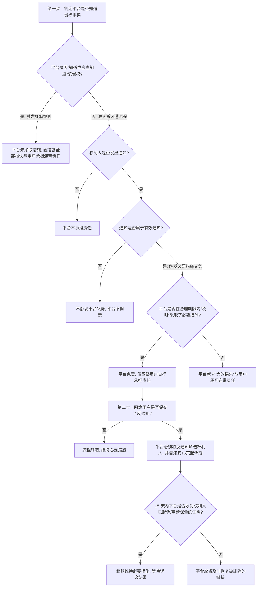

# 📐 网络服务提供者侵权 · 完整答题模型

## 适用场景与解决问题

本模型主要解决“网络用户利用网络服务实施侵权行为（如侵犯名誉权、肖像权、著作权等），被侵权人向网络服务提供者（ISP/平台）主张赔偿责任”的场景。重点判定：
1. **避风港原则的流程合规性**：厘清“有效通知 $\rightarrow$ 采取必要措施 $\rightarrow$ 转送反通知 $\rightarrow$ 恢复/不恢复”的黄金链条及法定时限；
2. **“连带责任”与“扩大的损害连带”的区别**：判定平台是就全部损失承担连带责任，还是仅就“通知后未及时采取措施所导致扩大的损失”部分承担连带责任；
3. **平台“红旗规则”的触发**：判定平台在何种情形下构成“知道或应当知道”他人侵权（红旗高高飘扬），从而直接触发连带责任；
4. **反通知与诉讼衔接**：判定平台在收到用户不侵权声明后，如何处理 15 天的诉讼/保全等待期。

---

## 一、 核心考情

- **频次研研**：网络侵权是特殊主体侵权中极具特色、流程性极强的考点，常以客观题案例形式考查避风港流程或红旗规则判定。
- **最新法规精神**：与《民法典》第一千一百九十四至一千一百九十七条配套的网络侵权司法解释对“有效通知的构成要素”、“合理期限的认定”以及“反通知的诉讼期限”进行了细化。
- **命题陷阱**：
  1. 只要网络用户在平台上发帖侵权，被侵权人一通知，平台就必须为“用户已造成的全部损害”承担连带责任。**【错】**（平台若及时采取措施则免责；若未及时采取措施，仅就**扩大的损害**部分承担连带责任）。
  2. 平台收到用户的反通知（声明不侵权）后，必须“立即”恢复被删除的链接。**【错】**（必须转送给权利人，并等待 **15 天**。若权利人未在这 15 天内提起诉讼或申请保全，平台才应当及时恢复）。
  3. 权利人发送的通知中仅写着“有人在你们平台侵害了我的名誉权，快处理”，平台未予理睬，原告起诉平台不作为连带。**【错】**（通知必须是“有效通知”，须包含权利人真实身份、权属证明及具体侵权链接；无效通知不触发平台的必要措施义务）。
  4. 只要平台没有收到权利人的通知，平台就绝对不需要承担连带责任。**【错】**（如果属于红旗规则，即平台“知道或应当知道”侵权事实仍不采取必要措施，即使无通知也直接对全部损害承担连带责任）。

---

## 二、 核心规则体系（避风港 vs 红旗规则）

网络服务提供者的责任判定分为两大平行轨道：

### 1. 避风港原则（“通知 - 必要措施”流程轨 §1195、§1196）
适用于**平台主观上不知道侵权事实**的常态。其核心是建立“转通知”与“反通知”的博弈机制：

*   **第一步：权利人发出有效通知**：
    *   必须包含：身份信息、权属证明、具体侵权网络地址（URL/定位）。
*   **第二步：平台采取必要措施并转送通知**：
    *   收到有效通知后，平台应当**及时**采取必要措施（删除、屏蔽、断开链接），并将通知转送给涉事网络用户。
    *   *责任界限*：若**未及时**采取必要措施，平台对**扩大的损害**与该网络用户承担连带责任。
*   **第三步：网络用户发出反通知**：
    *   网络用户收到转送通知后，认为自己不侵权，可以向平台提交反通知（声明不侵权，要求恢复）。
*   **第四步：平台转送反通知并等待 15 天**：
    *   平台收到反通知后，应当转送给权利人，并告知权利人可以向有关部门投诉或向法院起诉。
    *   **15 天等待期**：自反通知转送到达权利人之日起 **15 日内**，如果平台未收到权利人已经提起诉讼或申请保全的通知，平台**应当及时终止所采取的措施（即恢复原状）**。

### 2. 红旗规则（“知道 / 应当知道”直接连带轨 §1197）
适用于**侵权事实显而易见（红旗招展）**，平台无法装聋作哑的非常态：
*   **触发条件**：网络服务提供者**知道或者应当知道**网络用户利用其网络服务侵害他人民事权益，且未采取必要措施。
*   **判定标准**：通常根据侵权视频是否放在首页推荐、是否属于热播影视剧、是否经过人工编辑整理等判定“应当知道”。
*   **法律效果**：平台直接与该网络用户就**全部损害**承担**连带责任**（无视是否有通知）。

---

## 三、 万能答题模型（三步定性与六环博弈法）

> **核心记忆口诀**：**“一找侵权主体，二核平台过错（避风港流程或红旗判定），三定赔偿责任（全部连带或扩大连带）”**。

> 在民法法考中，“网络侵权责任”（《民法典》第1194-1197条）是很多考生觉得非常绕的一个板块，因为这里既有“删帖”、又有“15天等待”、还有“连带与扩大连带”。无论题目考得多么天花乱坠，我们的**“第一步：判定侵权主体的责任性质”**是雷打不动的定海神针。这决定了整场官司的根基：如果发帖的网民根本不构成侵权，那么网络平台就天然免责，后面的一切流程都失去了意义。

### 第一步：判定侵权主体的责任性质

> **“源头侵权看发帖，用户不侵平台免”**

- **“源头侵权看发帖”**：网络侵权的源头永远是那个直接发帖、留言、上传视频的**网络用户（博主、播主、网民）**。判定网络侵权，必须先根据《民法典》第1165条判定**发帖网民的行为是否构成名誉、肖像、著作权等过错侵权。**

- **“用户不侵平台免”**：**网络用户是第一被告**，承担终局的全部赔偿责任。如果网络用户的言论合法（不构成侵权），那么平台无论删不删、怎么处理，都**绝对不承担任何侵权责任**。

#### 大白话讲解

我们用老王在微博上被小李（博主）发帖，老王起诉小李和微博平台的例子，彻底看懂这个根基步骤：

- **场景一：小李公然造谣诽谤（✅ 用户构成侵权 ➜ 开启平台审查）** 博主小李为了蹭流量，在微博上发帖，指名道姓、无中生有地造谣老王“脚踩两只船、私生活极其混乱”。帖子被疯狂转发，导致老王被公司解雇，名誉扫地。老王起诉小李和微博平台。
    
    - **名师拆解**：
        1. **先审源头（发帖人小李）**：小李公然捏造事实贬损他人人格，构成名誉权侵权，具有主观过错。因此，**小李作为直接侵权人，必须对老王造成的10万元损失承担全部赔偿责任**。
        2. **再审平台（微博）**：正因为小李构成了侵权，微博平台如果收到通知未及时删除，或者把视频放在首页推荐（明知或应知），微博平台才会被卷入责任，对扩大损害或全部损害与小李承担连带责任。

- **场景二：小李发帖揭露事实（❌ 用户不侵权 ➜ 平台天然免责）** 老王因为重婚罪被法院判刑。博主小李在微博上发帖转发了法院的官方判决书，揭露了老王重婚的事实。老王觉得面子上挂不住，通知微博平台删除，微博平台放假7天没有理睬。老王起诉微博平台，要求平台为拖延7天删帖承担名誉权侵权连带责任。
    
    - **名师拆解**：
        1. **先审源头（发帖人小李）**：小李发布的内容是法院的真实公开判决，属于合法的舆论监督和客观事实陈述，**小李根本不构成侵权**。

        2. **再审平台（微博）**：既然发帖人小李不构成侵权，老王的名誉权就没有受到不法侵害。微博平台即使收到通知放假7天没删，也**绝对不需要承担任何赔偿责任**。

---

#### 一句话闭环记忆

> **“无风不起浪，用户不侵平台免；网络用户是主凶，过错全赔跑不掉。”**

> 做题时，判定平台赔不赔，必须先看发帖用户写的文章/发的内容本身到底构不构成侵权。如果网民合法发言，平台就算收到通知故意不删也绝对无罪；只有网民构成侵权，才需要根据“避风港原则”或“红旗规则”去算平台的责任！

在处理网络侵权案时，直接实施侵权行为的**网络用户（播主、博主、发帖人）**是第一被告：
- 网络用户应当直接对自己实施的侵权行为（名誉侵权、肖像侵权、著作权侵权等）承担**民事赔偿责任**（过错责任原则§1165）。

### 第二步：判定网络服务提供者（平台）的责任轨道
这一步是网络侵权模型的核心，用以判断平台是否需要“共同卷入责任”：

1. **红旗规则轨（平台知道/应当知道）**：
   - **审查要点**：侵权行为是否极其显眼（红旗招展，例如放在首页热播推荐、平台对视频进行了编辑整理、知名热播剧的完整盗版）。
   - **结果**：平台直接构成“知道或者应当知道”，若未主动采取必要措施，直接与网络用户就**全部损害承担连带责任**。

2. **避风港流程轨（平台不知道，权利人通过流程主张）**：
   权利人必须走完“黄金六环博弈流程”，判定哪一环出问题：
   - **第一环【通知】**：权利人必须发出**有效通知**（必须有权利人证明、具体URL）。如果是不明链接或无权属证明的**无效通知**，平台可不予理睬。
   - **第二环【平台转达与删除】**：平台收到有效通知后，必须**及时**（通常指1-3个工作日内）采取必要措施（删除/屏蔽/断开链接），并将该通知转送给涉事网络用户。
   - **第三环【未及时之责】**：若平台**未及时**采取必要措施，对**延迟期间扩大的损害**部分，与涉事网络用户承担**连带赔偿责任**。
   - **第四环【反通知】**：涉事网络用户收到通知后，认为自己不侵权，可以向平台提交反通知（包含不侵权声明与证明）。
   - **第五环【平台转送反通知并强行等待15天】**：平台收到反通知后，必须将反通知转送给权利人，并强行开启 **15 天的等待期**。
   - **第六环【期满恢复或维持】**：
     - 如果在转送到达权利人之日起 **15 日内**，平台**未收到**权利人提起诉讼或申请保全的证明，平台**应当及时恢复**原状。
     - 如果平台**收到**了权利人已提起诉讼/保全的证明，平台必须**继续维持**屏蔽/删除状态，等待诉讼结果。

### 第三步：确定民事赔偿范围与请求权

> 在判定完网络平台的责任轨道后，最后也是最落地的一步就是“算账赔钱”——**“第三步：确定民事赔偿范围与请求权”**（依据《民法典》第1195条第1款及第1197条）。在法考中，关于平台与网民（网络用户）的连带责任，命题人极其喜欢在“连带的数额范围”上玩弄数学游戏。这里有严格的**“全部责任连带”**与**“仅就扩大损害连带”**的本质区别。

- 如果平台构成了连带责任，需要区分是：
  - **全部责任连带**：红旗规则触发，或者网络用户和平台共同策划。
  - **扩大损害部分连带**：避风港流程中收到通知后没有及时删除（仅对收到通知后拖延期间增加的损失连带，通知前已发生的损失由发帖用户自担）。

---

## 四、 万能答题决策树

在法考中分析网络侵权案件，请依下列步骤涵摄：

---

## 五、 命题人最爱的 3 个陷阱

1. **“起诉期起算点”陷阱**：
   * *设计*：网络用户 10 月 1 日向平台提交反通知。平台于 10 月 3 日转送给权利人，权利人 10 月 5 日收到该转送。平台在 10 月 16 日恢复了链接。权利人起诉平台提前恢复。
   * *破防*：**正确，平台提前恢复构成侵权**。15 天的等待期是从**“反通知转送到达权利人之日”**（10月5日）起算，而非用户提交反通知之日（10月1日）。10月5日加15天为10月20日，平台在10月16日恢复属于违法提前恢复，需要承担责任。
2. **“全部连带 vs 扩大连带”混淆陷阱**：
   * *设计*：博主发帖诽谤他人造成 5 万元损失。原告通知平台删除，平台拖延了 10 天才删，期间该帖子被疯狂转发，导致原告损失增加了 10 万元（共损失 15 万元）。被侵权人请求平台与博主对全部 15 万元承担连带责任。
   * *破防*：**错误**。由于平台是在收到通知后未及时删除，其仅对**扩大的损害（即延迟删除期间产生的 10 万元）**与博主承担连带责任；对于通知前博主自行造成的 5 万元损害，平台不承担责任。
3. **“反通知到达立即恢复”陷阱**：
   * *设计*：平台收到涉事博主的反通知后，由于博主保证“如有侵权自己承担全部责任”，平台当日立即恢复了被删除的博文。
   * *破防*：**错误**。平台收到反通知后，必须先**转送给权利人，并强行等待 15 天**。若立即恢复，导致侵权损害继续发生的，平台对恢复后产生的损害与用户承担连带责任。

---

## 六、 真题演练

### 1. 拍照违约与网络服务提供者责任（[[侵权责任-单选-15 · 网络服务-拍照违约与通知删除规则\|侵权-单选-15]]）
*   *案情简述*：摄影师甲为模特乙拍照，甲未经乙同意将照片上传至某社交平台进行展示。乙发现后，书面通知平台要求删除。平台收到通知后，由于正在放假，7 天后上班才删除了照片。
*   *考点拆解*：
    1. 摄影师甲擅自上传照片，侵犯了乙的肖像权/名誉权。
    2. 乙的通知包含具体链接与肖像权属，属于**有效通知**。
    3. 平台因放假延迟 7 天删除，在司法实践中不属于“及时”采取必要措施。
    4. 平台应当对这 7 天内因未及时删除而给乙**扩大的损害**部分，与摄影师甲承担**连带赔偿责任**。

---

## 相关页面

- 上层概念：[[侵权责任编]] · [[网络侵权]]
- 既有模型关联：📐 [[民法-侵权-侵权责任模型]]（总论归责） · 📐 [[民法-合同-违约责任模型]]（违约与网络竞合对照）
- 适用真题：[[侵权责任-单选-15 · 网络服务-拍照违约与通知删除规则]]
