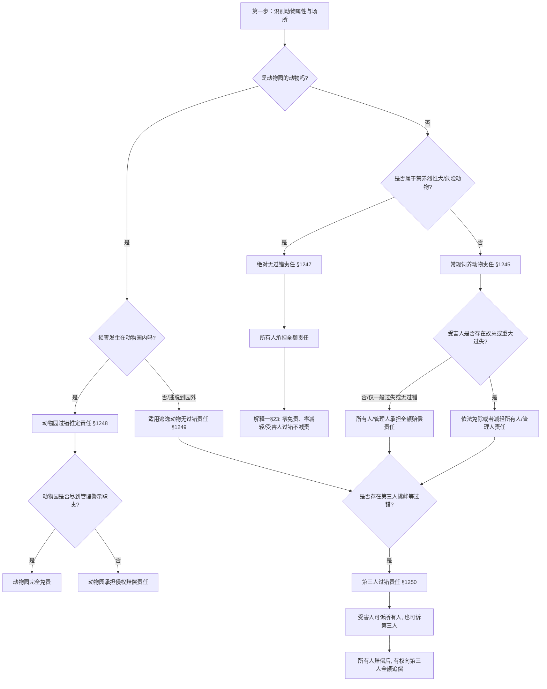

# 📐 饲养动物损害责任 · 完整答题模型

## 适用场景与解决问题

@! 本模型主要解决“饲养的动物在各种不同场景下（普通宠物、禁养烈性犬、动物园野生动物、流浪/逃逸动物等）致人损害时，民事责任主体（所有人、管理人、第三人）的确认与免责/减轻责任抗辩的判定”场景。重点判定：
1. **动物类型的归责分轨**：准确区分“普通宠物犬”（无过错责任 + 过失相抵）、“禁养烈性犬”（绝对无过错责任 + 零减轻）、“动物园动物”（过错推定责任）；
2. **特殊状态动物的责任界定**：判定逃逸或流浪动物在逃逸期间、以及被遗弃期间致害的责任人（原所有人或管理人独立承担无过错责任）； 
3. **第三人过错介入的法律效果**：处理第三人故意挑衅、逗弄导致动物伤人时，被侵权人的选择权（可诉所有人/管理人或第三人）以及内部追偿路径。

---

## 一、 核心考情

- **频次研判**：饲养动物致损是特殊主体侵权中的 ★★★★ 级高频重难点。客观题中极易将不同类型的动物致损规则混淆，或设计“第三人挑衅与烈性犬并存”等高难度复合案例。
- **最新法规红利**：2024 年 9 月 27 日施行的《侵权责任编解释（一）》第二十三条对“禁止饲养的烈性犬等危险动物致损”做出了颠覆性规定，彻底封死了所有人关于受害人故意/重大过失的减责抗辩，确立了绝对的“零免责/零减轻”。
- **命题陷阱**：
  1. 藏獒（禁养烈性犬）挣脱锁链咬人，饲养人主张“受害人故意拿石头砸狗挑衅，应减轻自己责任”。**【错】**（禁养烈性犬没有任何免责或减轻责任的事由，受害人故意挑衅也必须全赔）。
  2. 动物园的狼逃脱到园外的村庄咬伤村民，动物园主张“自己已尽到合理铁笼管理职责，应适用过错推定免责”。**【错】**（过错推定仅限于“园内”致损；动物逃离到“园外”逃逸流浪致损，应适用无过错责任，不能以已尽管理职责抗辩）。
  3. 第三人挑衅金毛犬导致其咬伤路人，饲养人主张“纯系第三人过错引起，应由第三人直接全额赔偿，自己不担责”。**【错】**（受害人对所有人与第三人拥有法定选择起诉权，所有人赔偿后享有对第三人的全额追偿权）。

---

## 二、 核心规则体系（动物类型与归责原则）
@!

| 动物类型/状态           | 法条依据           | 责任承担主体             | 归责原则        | 免责/减轻责任事由                                 | 关键细节 / 新规突破                      |
| :---------------- | :------------- | :----------------- | :---------- | :---------------------------------------- | :------------------------------- |
| **常规饲养动物**        | §1245          | **动物饲养人**或**管理人**  | **无过错责任**   | 证明损害是因被侵权人**故意或者重大过失**造成的，可以减轻或者免除责任。     | 仅一般疏忽不减轻责任；必须是重大过失或故意。           |
| **禁止饲养的烈性犬等危险动物** | §1247 + 解释一§23 | **动物饲养人**或**管理人**  | **绝对无过错责任** | **【零免责，零减轻】** 主张受害人故意或重大过失要求减免的，法院一律不予支持。 | 2024 新增规则，彻底封死因受害人过错的任何减责空间。     |
| **动物园动物**         | §1248          | **动物园**            | **过错推定责任**  | 能够证明**尽到教育、管理、警示等职责**的，完全免责。              | 唯一适用过错推定的动物侵权。仅限“园内”发生。          |
| **遗弃 / 逃逸动物**     | §1249          | **原动物所有人**或**管理人** | **无过错责任**   | 参照常规动物规则，但所有人不能以“已脱离控制”为由免责。              | 逃逸期间的流浪犬致害，由逃逸前的主人担责。            |
| **第三人过错致害**       | §1250          | 所有人/管理人 **与** 第三人  | 双重轨（受害人选择权） | 无免责事由（所有人对外必须先赔，再行追偿）。                    | 受害人可起诉所有人，也可起诉第三人。所有人赔后全额向第三人追偿。 |

---

## 三、 万能答题模型（四步连贯判定法）

> **核心记忆口诀**：**“一辨动物类型，二看致损场所（园内园外），三审受害人过错，四理第三人纠纷”**。

> 在法考中，关于“狗咬人”（《民法典》第1245-1251条）的特殊主体侵权案例，不仅分值极高，而且在2024年最高院最新司法解释出台后，其规则发生了极其重大的变革。做这类题目，我们必须在起步时死死卡住第一道分水岭——**“第一步：辨类型（看是普通动物还是禁养烈性犬）”**。这直接决定了被告人是否还拥有“受害人挑衅”这一最后的防线。

### 第一步：辨类型（看是普通动物还是禁养烈性犬）

> **“常规看挑衅可减免，烈犬无条件全赔”** -> 养了就无过错,动物园是过错推定,跑出来就是无过错;

- **“常规看挑衅可减免”**（普通动物 §1245）：常规宠物猫狗、牛马等，原主人承担无过错责任，但如果能证明受害人存在**“故意或重大过失”**（如小偷进屋偷东西、恶意抢狗食），所有人可以**减轻或免除责任**。 -> 无过错责任

- **“烈犬无条件全赔”**（禁养烈性犬 §1247 + 解释一§23）：禁止饲养的烈性犬（如藏獒、罗威纳等危险动物）致损，适用**绝对无过错责任**。所有人享有**“零免责、零减轻”**的终极严惩。即使受害人故意拿针扎狗、拿石子砸狗，所有人也必须**100%全额赔偿**。-> 无过错责任

#### 大白话讲解

我们用小偷小李和顽童小明挑衅老王家狗被咬伤的案例，彻底对比普通狗和烈性犬在法考中的不同打法：

- **场景一：常规宠物金毛咬伤小偷（✅ 常规动物 —— 所有人可免责）** 老王养了一只性格温顺的金毛犬，平时拴在自家封闭的院子里。小偷小李半夜翻墙进入老王家偷东西，金毛犬为了护院疯狂撕咬，将小李咬伤，小李花去医药费3000元。小李起诉老王赔钱。
    
    - **名师拆解**：
        1. **辨类型**：金毛犬是常规宠物，非禁养烈性犬。适用第1245条。
        2. **看抗辩**：小李是翻墙偷东西的窃贼，主观上显然存在故意。老王能够证明损害是由于受害人小李自己的“故意”造成的。
        3. **做题结论**：老王免责抗辩成立。老王**完全免责**，一分钱不用赔。

- **场景二：城市禁养烈性藏獒咬伤挑衅顽童（❌ 烈性犬 —— 零免责零减轻，全赔）** 老王在城市居民小区内，违法养了一只重达100斤的藏獒（城市禁养的烈性犬）。老王用粗铁链把藏獒拴在院子铁门内。10岁的小明放学路过，隔着铁栅栏，故意拿小石子、树枝扔向藏獒进行挑衅。藏獒被激怒，猛力挣断锁链，一跃而起将小明扑倒咬伤，小明花去医药费1万元。老王抗辩：“是小明自己先犯贱挑衅狗的，他有重大过失，必须减轻我的赔偿责任！”
    
    - **名师拆解**：
        1. **辨类型**：藏獒是城市**禁止饲养的烈性犬**。适用第1247条。
        2. **对碰新规**：根据2024年最新司法解释第二十三条，凡是禁止饲养的烈性犬致损，所有人主张受害人有过错要求减免责任的，法院**一律不予支持**。

        3. **做题结论**：老王没有任何抗辩退路。即使是小明故意挑衅在先，老王也必须**100%全额赔偿1万元**。谁让你把“移动炸弹”带进小区的？你必须承担绝对的、无条件的法律责任。

#### 3. 一句话闭环记忆

> **规狗看挑衅，小偷被咬不用赔；烈犬零减免，顽童砸狗也全赔。**

>  做题时，先看咬人的是不是藏獒、罗威纳等“禁养烈性犬”。如果是，直接关闭所有免责大门，不管受害人怎么作死挑衅，都必须全额赔偿；如果是普通宠物金毛/波斯猫，再看受害人有没有故意或重大过失，有的话可以减轻或免除责任！

1. **禁养危险动物（烈性犬/藏獒/罗威纳犬等）**：
   - ➔ 直接套用《民法典》§1247 及解释一§23 的**绝对无过错责任**。
   - **结果**：免责和减轻责任的大门被全部堵死。即使受害人故意逗狗、拿石头砸狗，所有人也必须**全额赔偿**。
2. **普通饲养动物（宠物狗/猫/家畜等）**：
   - ➔ 套用《民法典》§1245 的**无过错责任**。
   - **结果**：所有人原则上全赔，只有证明受害人存在“故意”（如抢夺狗食）或“重大过失”（如严重违规挑衅）时，才可以**免除或减轻**所有人责任。

### 第二步：看场所（判定动物园动物是否发生“脱逃”）
> 在饲养动物损害责任模型中，如果咬人的是“动物园里的野生动物（狮子、老虎、大猩猩）”，千万不要直接默认适用普通猫狗的无过错责任。这里有一个法考中极其隐蔽的陷阱——**“第二步：看场所（判定动物园动物是否发生‘脱逃’）”**（依据《民法典》第1248条与第1249条）。这决定了动物园到底是能用“我已经尽责了”来脱身，还是必须“躺平全赔”。

> **“园内看防守(过错推定)，园外必赔偿(无过错)”** -> 

- **“园内看防守”**（过错推定 ➜ 可免责）：如果损害发生在动物园**“园内”**，动物园适用**过错推定责任**。只要园方能证明自己“防守合格”（尽到了两重网、警示牌、安保职责），就可以**完全免责**。

- **“园外必赔偿”**（无过错责任 ➜ 必赔）：如果动物**“脱逃到园外”**（如流窜到街道、村庄）将人咬伤。动物园**丧失**“已尽职责”的抗辩，必须承担**无过错责任**（哪怕是地震把笼子震坏导致老虎跑出来的，也必须全赔）。
#### 大白话讲解

我们用大华野生动物园的东北虎咬伤游客老王和村民老张的两个案例，彻底看清“园内”和“园外”的天地之差：

- **场景一：游客在园内翻墙挑衅老虎（✅ 园内 —— 园方防守合格可免责）** 大华野生动物园设立了高大坚固的钢丝网铁笼，铁笼外隔了2米宽的绿化隔离带，并设立了醒目的红色警示牌：“禁止翻越，老虎咬人”。游客老王为了拍抖音视频，强行翻越隔离带，把手伸进铁笼里喂老虎，结果被老虎一口咬断了手指。老王起诉动物园要求赔偿。
    
    - **名师拆解**：
        1. **看场所**：发生在大华野生动物园的**“园内”**。适用第1248条。
        2. **看防守**：动物园举证证明了铁笼合格、设有隔离带和警示牌，证明自己**已经尽到了合理的管理和警示职责**。
        3. **做题结论**：动物园成功推翻了过错推定，**完全免责**，一分钱不用赔。老王自己承担损失。
- **场景二：老虎深夜发生脱逃，在园外咬人（❌ 园外 —— 园方必赔偿，天灾也得赔）** 大华野生动物园的一只老虎，因为深夜突发大地震，铁笼被大树砸塌，老虎趁机逃出了动物园。它跑到了距离动物园3公里外的村庄里，将正在地里干活的村民老张咬伤。老张起诉动物园要求赔偿。动物园辩称：“我们铁笼是完全合格的，老虎跑出来是因为地震（不可抗力），我们已经尽到了管理职责，无过错，应该免责！”
    
    - **名师拆解**：
        1. **看场所**：发生在动物园的**“园外”**。性质上属于**遗弃、逃逸动物致损**。适用第1249条。
        2. **定责任**：逃逸动物适用的是**无过错责任**。
        3. **看防守**：一旦老虎跑出了动物园，动物园就**不能再用“我们已尽到管理职责/地震不可抗力”来作为免责的挡箭牌了**。
        4. **做题结论**：动物园必须老老实实承担无过错的侵权替代责任，**全额赔偿老张的医药费**。

#### 一句话闭环记忆

> **“游客翻墙进园内，园方尽责可免除；老虎逃脱跑园外，天灾人祸都要赔。”**

> 做题时，先看老虎伤人是“在园里”还是“跑到了街上/村里”。如果在园里，看动物园有没有尽到警示牌和铁网职责，尽责了不赔；如果是脱逃到了园外咬人，动物园没有任何免责理由，必须全额赔偿！

1. **发生在动物园“园内”**：
   - ➔ 适用《民法典》§1248 的**过错推定责任**。
   - 判定动物园是否尽到了“双层网、警示牌、安保巡逻”等职责。若已尽责，动物园**完全免责**。
2. **发生在动物园“园外”（脱逃至村庄或街道）**：
   - ➔ 适用《民法典》§1249 的**遗弃、逃逸无过错责任**。
   - 此时，动物园**丧失**“尽到管理职责”的免责抗辩，必须承担无过错的侵权责任。

### 第三步：审受害人过错（看属于什么过错程度）

>  在判定完常规宠物（非禁养烈性犬）致人损害后，如果所有人（被告）主张“是受害人自己有过错，应当减免我的责任”，我们就要立刻启动**“第三步：审受害人过错（看属于什么过错程度）”**（依据《民法典》第1245条）。在法考中，受害人自己“踩了狗”或者“逗了狗”，其过错程度被严格区分为**“一般过失”**与**“故意/重大过失”**。 这直接决定了老板的钱包是“被全额掏空”，还是能“打个折扣”甚至“全身而退”。

####  核心逻辑（极简字诀）

> **“一般过失不能减，故意重过可减免”**

- **“一般过失不能减”**：在普通宠物致损中，如果受害人只是“不小心、一般大意”（如走路看手机踩到狗尾巴、正常路过），动物所有人**必须100%全赔**，不能要求减免责任。

- **“故意重过可减免”**：只有当受害人属于**“故意挑衅、作死”**（如拿石头砸狗、抢狗嘴里的骨头）或**“重大过失”**，才可以减轻或免除所有人的责任。

- _注意_：本步骤**只适用于普通宠物**。如果是第一步判定的“禁养烈性犬”，哪怕受害人故意作死，所有人也一律不予减免。

---

#### 大白话讲解

我们用路人老张在路上遇到老王牵着的金毛犬（常规宠物）的两个不同遭遇，对比“一般过失”与“重大过失/故意”的区别：

- **场景一：走路玩手机踩到狗（❌ 一般过失 ➜ 所有人必须全赔）** 老王牵着金毛犬在公园里散步。路人老张低头玩手机发微信，没注意脚下，一脚踩在了金毛犬的尾巴上。金毛犬吃痛受惊，回头一口咬伤了老张，花去医药费3000元。老王抗辩：“老张走路玩手机不看路才踩到狗的，他自己也有错，我的赔偿款得打个折！”
    
    - **名师拆解**：
        1. **定过错程度**：老张走路玩手机没看路，属于普通的疏忽大意，在法律上定性为**一般过失**。
        2. **定责任归属**：第1245条是无过错责任，一般过失不能成为减免的挡箭牌。
        3. **做题结论**：老王必须**100%全额赔偿**老张3000元医药费，不能打折。

- **场景二：酒后故意踢狗抢狗食（✅ 故意/重大过失 ➜ 可以减免责任）** 老王牵着金毛犬在街上散步，金毛犬嘴里正啃着一根肉骨头。路人老张喝了酒，为了在朋友面前显摆，故意走过去狠狠踹了金毛犬一脚，还强行用手去夺金毛犬嘴里的骨头。金毛犬被激怒，猛扑过去将老张咬伤。
    
    - **名师拆解**：
        1. **定过错程度**：老张无故殴打狗、抢夺狗食，属于明知有危险而执意挑衅的**故意（或重大过失）**行为。
        2. **定责任归属**：这满足了“受害人故意或重大过失”的减免条件。
        3. **做题结论**：法院应当判决**减轻老王的赔偿责任**（比如让老王只承担30%的责任）。如果老张的作死行为极其严重（比如小偷进屋偷东西被咬），老王甚至可以**完全免责**。

---

#### 一句话闭环记忆

> **“玩手机踩狗（一般过失）主人全赔，踢狗抢食（故意重过）可以减免；常规狗看作死程度，烈性犬作死也全赔。”**

> 做题时，先看是不是普通猫狗。如果是，再看受伤的人是不是“故意挑衅、恶意作死”。如果只是走路不小心踩到狗，所有人必须全赔；如果是故意踢狗、打狗，所有人可以减免责任！

在普通动物致害中，判定受害人的行为：
- **一般过失**（如路上不小心蹭到狗、正常路过）：**所有人全赔**，不减轻责任。
- **重大过失或故意**（如故意用脚踢狗、抢夺母狗身边的幼崽）：**可以减轻或免除**所有人责任。

### 第四步：理第三人过错（选择权与向后追偿）
>在饲养动物损害责任模型中，如果动物咬人既不是因为主人指使，也不是因为受害人自己作死，而是**“因为一个手欠的第三人在旁边捣鬼（如扔鞭炮惊狗、拿棍子戳狗）”**引起的，这就是法考中著名的**“第四步：理第三人过错（选择权与向后追偿）”**（依据《民法典》第1250条）。这解决的是：**被咬伤的无辜路人该管谁要钱，以及狗主人垫付钱后怎么索回的问题。**这也是客观题选择题中极其高频的考点组合。

#### 核心逻辑（极简字诀）

> **“对外二选一，对内全追偿”**

- **“对外二选一”**（受害人的选择权）：因第三人过错导致动物伤人，受害人拥有法定的选择权。他**既可以起诉动物所有人（主人），也可以起诉捣鬼的第三人**。被起诉的主人绝对不能推脱说“是第三人的错，你去找他”。

- **“对内全追偿”**（终局追偿权）：如果主人先赔了受害人，主人有权调转枪头，向那个真正引起狗咬人的第三人**进行100%全额追偿**。
#### 大白话讲解

我们用老王牵狗散步，路过的小李（第三人）扔鞭炮，导致路人老张被咬伤（花去5000元医药费）的故事，彻底厘清这笔账：

- **起因**：小李为了恶作剧，故意把一个点燃的二踢脚鞭炮扔到老王牵着的宠物狗爪子底下。狗受到惊吓，疯狂挣脱缰绳将老张咬伤。老张住院花去5000元。
    
- **对外阶段（老张起诉老王 —— ✅ 所有人必须赔）**： 老张觉得扔鞭炮的小李是个无业游民没钱赔，而狗主人老王有房有车。老张一纸诉状把**狗主人老王**告上法院，要求赔偿5000元。 老王在法庭上大喊冤枉：“法官，这狗是小李用鞭炮炸惊的！是小李的错，老张应该找小李赔，凭啥管我要钱？”
    
    - **名师拆解**：法官会直接驳回老王的抗辩。根据第1250条，受害人老张拥有选择权。老张选择告你老王，你作为所有人**必须对外全额赔偿老张5000元**。你不能推诿。

- **对内阶段（老王找小李算账 —— ✅ 全额追偿）**： 老王给老张转账了5000元医药费后，看着空空的钱包，心想：“是小李扔鞭炮惹的祸，我凭啥替他背锅垫钱？”
    
    - **名师拆解**：老王完全不需要担心。老王在向老张赔偿5000元后，**享有向第三人小李全额追偿5000元的权利**。老王把小李起诉到法院，法院会判决小李把这5000元全额还给老王。

    - **最终结局**：小李掏了5000元，老王实际掏了0元。真正干坏事的人（第三人小李）承担了终局的全部责任。

---

#### 一句话闭环记忆

> **“小鬼扔鞭炮狗咬人，受害人找谁（主人/小鬼）谁就得赔；主人赔完别喊冤，回头找小鬼全额追偿。”**

> 做题时，看到因第三人过错导致狗咬人，受害人告主人或告第三人都是完全合法的，被告不能推脱；主人赔了钱后，享有对第三人的100%全额追偿权！

---

## 四、 万能答题决策树

---

## 五.. 命题人最爱的 5 个陷阱

1. **烈性犬“挑衅免责”陷阱**：
   - *设计*：藏獒主人证明，邻居小童故意拿针扎藏獒，藏獒才咬伤小童，因此主张免责。
   - *破防*：**错误**（解释一§23）。对于禁养的烈性犬，受害人故意挑衅也**绝不能**免除或减轻所有人一分钱的责任，必须全赔。
2. **动物园“地震脱逃”免责陷阱**：
   - *设计*：野生动物园因地震导致铁笼损坏，老虎跑出园外将路人咬伤，动物园抗辩自己无过错且属于不可抗力。
   - *破防*：**错误**。动物园野生动物在脱逃期间（园外）致损，适用《民法典》§1249 的遗弃、逃逸无过错责任，即使是地震引起脱逃，动物园作为所有人也应承担侵权替代责任，不适用过错推定免责。
3. **第三人致害的“直接找第三人”抗辩陷阱**：
   - *设计*：甲带宠物狗遛弯，路人乙踢了狗一脚，狗咬伤了丙。甲抗辩称“完全是乙的错，丙应当找乙赔”。
   - *破防*：**错误**（§1250）。受害人丙有权直接要求甲赔偿，甲不得以第三人过错为由拒绝。甲赔偿后，可在内部向乙全额追偿。
4. **动物致害“无因管理”干扰陷阱**：
   - *设计*：甲走失的藏獒在街上流浪，乙出于好心将狗牵回家喂养，不料被狗咬伤，乙起诉甲要求赔偿。甲抗辩称乙属于无因管理应自担风险。
   - *破防*：**错误**（[[侵权责任-单选-22 · 饲养动物施救者-错误判断无因管理\|侵权-单选-22]]）。无因管理管理的是他人的事务/财产（即狗本身），但乙的人身健康属于自己的法益。甲作为逃逸动物的原所有人，对乙受伤仍应承担无过错的侵权责任，无因管理不是侵权免责事由。
5. **遗弃期间“流浪狗”责任消失陷阱**：
   - *设计*：老王嫌自家的宠物狗生病，将其扔到野外。半个月后该流浪狗将路人砸伤/咬伤，路人查出原主人并起诉，老王辩称“自己已经遗弃了，狗不属于自己”。
   - *破防*：**错误**（§1249）。被遗弃的动物在遗弃期间致人损害的，仍由原所有人承担无过错的侵权责任。原主人不能通过消极遗弃来逃避侵权责任。

---

## 六、 真题演练

### 1. 常规动物致害与抗辩（[[侵权责任-单选-21 · 饲养动物跟人跑-饲养人甲担责\|侵权-单选-21]]、[[侵权责任-单选-23 · 偷狗被咬-故意引发损失自担\|侵权-单选-23]]）
*   *案情简述*：小偷乙夜间撬锁进入甲家实施盗窃，被甲养在院子里的看门狗（系着铁链）咬伤。乙起诉甲要求赔偿医疗费。
*   *考点拆解*：
    1. 甲饲养动物致乙损害，适用 §1245 无过错责任。
    2. 乙进入甲家实施盗窃（属于违法犯罪行为及故意挑衅危险），损害完全是由被侵权人乙自己的“故意”造成的。
    3. 依照《民法典》第一千一百四十五条，甲依法完全免除侵权责任，乙的索赔诉求应予驳回。

### 2. 第三人过错致害多重起诉（[[侵权责任-多选-20 · 动物致害各类型-饲养人责任综合\|侵权-多选-20]]）
*   *案情简述*：甲带宠物狗散步，路过的一小孩乙用鞭炮扔向狗，狗受惊挣脱锁链将路人丙咬伤。
*   *考点拆解*：
    1. 属于因第三人（小孩乙）过错导致动物伤人，适用 §1250。
    2. 被侵权人丙可以请求饲养人甲赔偿，也可以请求第三人乙（其监护人）赔偿。
    3. 甲赔偿后，有权就其垫付的赔偿金向乙的监护人全额追偿。

---

## 相关页面

- 上层概念：[[侵权责任编]] · [[民事责任主体]]
- 既有模型关联：📐 [[民法-侵权-侵权责任模型]]（总论归责） · 📐 [[民法-侵权-自甘风险模型]]（受害人过错对照） · 📐 [[民法-追偿权统一判断模型]]（追偿总枢纽·动物第三人过错＝C选择权型·§1250）
- 适用真题：[[侵权责任-单选-21 · 饲养动物跟人跑-饲养人甲担责]] · [[侵权责任-单选-22 · 饲养动物施救者-错误判断无因管理]] · [[侵权责任-单选-23 · 偷狗被咬-故意引发损失自担]] · [[侵权责任-多选-19 · 多只动物致损-各自担责或平均分担]] · [[侵权责任-多选-20 · 动物致害各类型-饲养人责任综合]]
