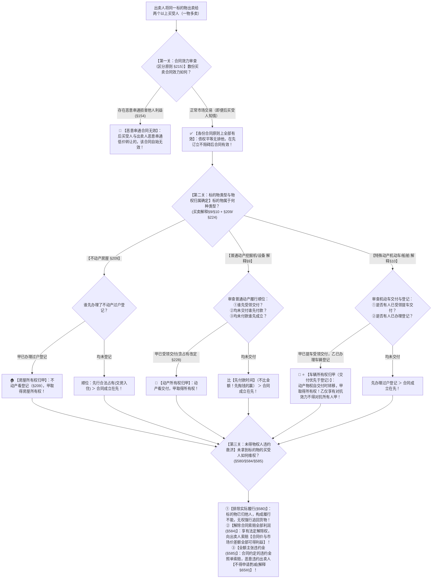

# 📐 多重买卖履行顺序与物权变动 · 全流程答题模型（区分原则 · 普通动产交付/付款/成立 · 特殊动产交付优于登记 · 不动产登记定权属 · 履行不能可得利益索赔 · 买卖解释§9-§10）

> **教练开场白**
> 同学们好！我是你们的民法法考教练。在民商法体系中，“一物多卖（多重买卖）”是**物权编与合同编交叉考查最频繁、最考验民法基本功底的经典母题**！
> 很多同学做一物多卖题目时经常陷在直觉思维里出不来：以为谁先签合同合同就优先、后签的合同无效；或者以为谁给的钱多谁就拿到物；或者以为特殊动产（汽车）车管所登记了就一定赢过提车的。
> 请大家死死记住多重买卖的**【两大破题黄金铁律】**：
> 1. **【铁律一 · 区分原则（§215）】**：**合同有效 $\neq$ 取得所有权！** 一物卖给 10 个人，10 份买卖合同**全部有效**（除非恶意串通 §154）；
> 2. **【铁律二 · 终局物权归属看公示】**：
>    - **不动产（房屋）**：看**过户登记**（登记 ＞ 占有 ＞ 成立）；
>    - **普通动产（设备/玉器）**：看**交付**（先受领交付 ＞ 先付款 ＞ 成立在先，比付款时间不比金额！）；
>    - **特殊动产（汽车/船舶/飞机）**：⭐ **交付优先于登记**（先提车 ＞ 先登记 ＞ 成立在先）！
> 没拿到物的人，合同依然有效，出卖人构成履行不能，向出卖人索赔**全额可得利益损失（甚至双倍违约金）**！

---

## 适用场景与解决问题

本模型专门解决同一标的物（不动产/普通动产/特殊动产）被出卖人多次转让出售给数个买受人时，**数份合同效力认定、实际履行顺位排列、物权终局归属、未得物权人违约救济**的全部主客观题考点（对应 [[典型合同考点-深度报告]] 一·买卖合同 Row 8 · ★★★★★ 顶级必考）：重点破解：

1. **债权平等与合同效力认定关（《民法典》§215/§597/§154）**：
   - **区分原则（§215）**：买卖合同是负担行为，出卖人就同一标的物订立的多份买卖合同，**原则上全部有效**；
   - **唯一无效例外（§154）**：后买受人与出卖人**恶意串通损害在先买受人利益**（明知已售且恶意串通低价转让）；单纯“知情”不构成恶意串通。
2. **标的物三分类履行顺位与物权归属关（买卖合同解释§9/§10 + 《民法典》§209/§224/§225）**：
   - **普通动产（买卖解释§9）**：① **先行受领交付**（含现实交付、简易交付、指示交付、**占有改定 §228**）取得物权；② 均未交付的，**先行支付价款者优先（比时间不比金额）**；③ 均未交付且均未付款的，**合同成立在先者优先**；
   - ⭐ **特殊动产（船舶/航空器/机动车 · 买卖解释§10）**：
     - ① **先行受领交付者优先（取得物权）**；② 均未交付的，**先行办理登记手续者优先**；③ 均未交付且未登记的，**合同成立在先者优先**；
     - ⭐ **交付优先于登记铁律（买卖解释§10Ⅳ）**：出卖人将机动车交付给甲、却过户登记给乙的，**车辆所有权归已提车的甲！**（登记仅产生对抗效力，不影响甲基于交付取得物权）；
   - **不动产房屋（《民法典》§209 + 司法通说）**：① **先行办理过户登记取得所有权**；② 均未登记的，**先行合法占有（交房入住）者优先**；③ 均未登记未占有的，**合同成立在先者优先**。
3. **未得物权人违约救济与履行不能关（《民法典》§580/§584）**：
   - 标的物已过户/交付给他人，出卖人对其他买受人构成**法律上或事实上的履行不能（§580Ⅰ①）**；
   - 未得物权的买受人**无权请求法院强制将标的物从第三人处追回**，但有权**解除合同并索赔全部可得利益净损失（§584）或全额主张违约金（§585）**！

> **核心一句**：**区分原则立天地，一物多卖皆有效；不动产过户登记者王；普通动产先交货＞先掏钱＞先签合同；特殊动产车船飞机【交付压倒登记】；没拿到物的别抢货，履行不能转解除，全额索赔预期赚大钱！**
>
> 🔎 **核心法源（2026最新）**：《民法典》§209、§215、§224、§225、§226、§227、§228、§580、§584、§585、§597；《最高人民法院关于审理买卖合同纠纷案件适用法律若干问题的解释》（法释〔2020〕17号修正）第9条、第10条。

---

## 💡 【前置认知】多重买卖三类标的物履行顺位与物权归属极速对照表

| 标的物类型 | 终局物权归谁？（定物权归属） | 多个买受人均要求实际履行时的法定顺位（定履行顺序） | 权威司法解释依据 | 考场一秒判定眼 |
| :--- | :--- | :--- | :--- | :--- |
| **① 普通动产**<br>（挖掘机/玉石/设备/钢材） | 谁先**受领交付**（§224）<br>（含占有改定 §228） | **① 先行受领交付 ＞ ② 先行支付价款 ＞ ③ 合同成立在先** | 《买卖合同解释》**第9条** | 先付款比的是**付款时间先后**，不是付款金额多少（单选-23）！ |
| **② 特殊动产**<br>（机动车/船舶/航空器） | 谁先**受领交付**（§224）<br>（交付取得物权） | **① 先行受领交付 ＞ ② 先行办理登记 ＞ ③ 合同成立在先**<br>⭐ **【交付优先于登记】**（解释§10Ⅳ） | 《买卖合同解释》**第10条** | 提车的人（已交付）**赢过**车管所登记者（单选-24）！ |
| **③ 不动产**<br>（商品房/土地使用权） | 谁先**办理过户登记**（§209） | **① 先行过户登记 ＞ ② 先行合法占有 ＞ ③ 合同成立在先** | 《民法典》**第209条** | 不动产物权变动**以登记为生效要件**，未登记仅有债权（多选-43）。 |

---

## 一、 考点核心骨架与法理（三关连贯决策树）



```
【多重买卖全景】一句话开场：一物卖多人，合同全有效；不动产看登记，动产先交货＞先掏钱，机动车交付赢过登记；没拿物的告违约索赔全部利润！
│
▼ 第一关 · 合同效力审查 ── 区分原则（§215/§597）
├─ 原则：数份买卖合同【全部有效】（买卖是负担行为，无处分权不影响合同效力）
└─ 例外：【恶意串通】（§154）后买受人明知已卖且恶意串通低价转让 $\rightarrow$ 🚨 该合同无效！
     │
     ▼ 第二关 · 物权归属与履行顺位 ── 标的物三分类（买卖解释§9/§10 + §209/§224）
     ├─ ① 不动产房屋（§209）：───────────────────────────────────────→ 🏠【先过户登记取得所有权】（登记 ＞ 占有 ＞ 成立在先）
     ├─ ② 普通动产（买卖解释§9）：───────────────────────────────────→ 🚜【先受领交付取得所有权】（交付 ＞ 先付款 ＞ 成立在先）
     │    └─ ⚠️ 先付款看【付款时间先后】，不看付款金额多少！
     └─ ③ 特殊动产机动车/船舶（买卖解释§10）：─────────────────────────→ 🚗【先受领交付取得所有权】（交付 ＞ 登记 ＞ 成立在先）
          └─ ⭐ 核心铁律：【交付优先于登记】！提车的人赢过车管所登记者！
               │
               ▼ 第三关 · 未得物权人救济 ── 履行不能与违约索赔（§580/§584/§585）
               ├─ ❌ 排除实际履行：构成事实/法律上不能（§580），不得要求追回标的物
               ├─ ✅ 解除合同索赔损失：索赔【可得利益差价纯利润】（§584）
               └─ ✅ 主张违约金条款：全额主张违约金；恶意违约出卖人【排除酌减】（通则解释§65Ⅲ）

  ━━━ 三关全通 ━━━
```

---

## 二、 核心考情与 2026 民法典精要

- **频次研判**：多重买卖履行顺序是民法典物权编与合同编交叉的**★★★★★ 顶级必考母题**；客观题每年在单选、多选中必出大题，主观题房屋买卖纠纷必涉。
- **命题核心**：
  1. **区分原则（§215）**：合同效力与物权变动二分；一房数卖每份合同都有效。
  2. **普通动产履行顺位（买卖解释§9）**：
     $$\text{先行受领交付（含占有改定）} > \text{先行支付价款（比时间不比金额）} > \text{合同成立在先}$$
  3. **特殊动产机动车履行顺位（买卖解释§10）**：
     $$\text{先行提车交付} > \text{先行办理登记} > \text{合同成立在先} \quad (\mathbf{交付优先于登记！})$$
  4. **四种交付形态均产生物权效力**：现实交付、简易交付（§226）、指示交付（§227）、**占有改定（§228）** 均构成受领交付。
  5. **恶意违约排除酌减（通则解释§65Ⅲ）**：一房二卖牟利的出卖人，向其主张 35% 违约金时，出卖人无权请求法院酌减！

---

## 三、 三大核心法理与命题陷阱拆解

### 1. 多重买卖三大命题暗坑与裁判标准表

| 案情设定场景 | 争议焦点 | 裁判结论 | 命题陷阱与法理深剖 |
|---|---|---|---|
| 甲将挖掘机先卖乙（未交付），后卖丙（丙付 20% 款），再卖丁（丁付全款），最后卖戊（交付给戊） | 乙成立在先，丁付了全款，戊最后签合同，所有权归谁？履行顺位如何？ | ✅ **所有权归已提车的戊！**<br>均未交付时顺位为：**丙（先付）＞ 丁（后付）＞ 乙（未付）** | 《买卖合同解释》§9：**交付排第一**；未交付的比**先付款时间**（丙先付款赢过付全款的丁），丁不能以付全款主张优先（单选-23 A）。 |
| 甲将轿车卖给乙并完成**交付（提车）**，后甲因缺钱将该车又卖给不知情的丙并**办理了过户登记** | 乙已提车，丙已登记，机动车所有权到底归谁？ | ✅ **车辆所有权归乙！** | 《买卖合同解释》§10 第 4 款：**交付优先于登记**！机动车物权自交付时转移，乙已取得所有权；丙登记无法对抗真正所有权人乙（单选-24）。 |
| 甲将房屋卖给乙（未过户），后因房价大涨将房屋高价卖给丙并办理了**过户登记** | 乙签合同在先，乙能否主张甲丙买卖合同无效并抢回房屋？ | ❌ **甲丙合同有效，房屋归丙！**<br>乙只能向甲索赔违约金！ | 《民法典》§209/§215：不动产登记定权属；两份合同均有效；甲对乙陷于**履行不能**，乙有权解除合同索赔全部可得利益损失（多选-43）。 |

### 2. 占有改定在一物多卖中的定权效力（《民法典》§228）

| 交付形态 | 事实构成 | 物权变动效力 | 考场一秒判定 |
|---|---|---|---|
| **占有改定（§228）** | 买卖双方约定：标的物所有权转移给买方，但由卖方继续租用/借用该物 | ✅ **构成有效交付，买方取得所有权！** | 占有改定也是交付，受让人直接取得物权（多选-23）！ |
| **指示交付（§227）** | 标的物在第三人处，出卖人将返还请求权转让给买受人 | ✅ **自通知到达第三人时完成交付！** | 指示交付同样发生物权转移效力。 |

---

## 四、 万能解题三步

---

### 第一步：合同效力关 —— 数份合同全有效吗？（《民法典》§215/§154）

> **教练提示**：
> 1. 原则上出卖人签的 2 份、3 份合同**全部有效**；
> 2. 只有证明后买受人与出卖人**恶意串通低价转让专坑前买家（§154）**，后合同才无效；单纯“后买家知道之前卖过”不属于恶意串通，合同依然有效！

---

### 第二步：物权归属关 —— 谁先拿到物权？（买卖解释§9/§10 + §209/§224）

> **教练提示**：根据标的物类型一秒判定物权：
> 1. **不动产房屋（§209）** $\rightarrow$ **谁先办理过户登记谁得所有权**；
> 2. **普通动产（买卖解释§9）** $\rightarrow$ **谁先受领交付（含占有改定）谁得所有权**；若都没交货，比**先付款时间**（不比金额！）；
> 3. **特殊动产机动车（买卖解释§10）** $\rightarrow$ ⭐ **交付优先于登记**！谁先提车谁得所有权！

---

### 第三步：违约救济关 —— 没拿到货的人怎么索赔？（《民法典》§580/§584/§585）

> **教练提示**：
> 1. 标的物已被他人取得所有权，出卖人对其他买受人构成**履行不能（§580）**；
> 2. 没拿到货的买受人**无权请求撤销他人所有权或强行提货**；
> 3. 救济手段：**解除合同 ＋ 索赔可得利益差价纯利润（§584） ＋ 主张违约金（§585）**！恶意出卖人无权申请违约金酌减（通则解释§65Ⅲ）。

#### 💰 完整数字案例：挖掘机四重买卖履行顺序攻防实战

> **【案情（[[典型合同-单选-23]] 经典真题全景还原）】**
> 甲公司拥有一台二手重型挖掘机（普通动产），价值 **100 万元**。甲公司先后与四人订立买卖合同：
> - 3月1日：与乙订立买卖合同，约定“货到付款”（乙尚未付款，尚未交付）；
> - 4月1日：与丙订立买卖合同，丙当日转账支付了 **20% 定金及部分款项共 20 万元**（尚未交付）；
> - 5月1日：与丁订立买卖合同，丁当日转账支付了 **100% 全额价款 100 万元**（尚未交付）；
> - 6月1日：与戊订立买卖合同，甲公司当日将挖掘机**实际交付给了戊（戊受领交付）**。
> 乙、丙、丁得知后均起诉主张要求甲公司交付挖掘机。
>
> 1. **第一步（合同效力）**：依据区分原则（§215），甲与乙、丙、丁、戊签订的四份买卖合同**全部有效**；
> 2. **第二步（履行顺位与物权归属 · 买卖解释§9）**：
>    - **第一顺位（所有权人）**：戊于 6月1日 已经**先行受领交付**，依据《民法典》§224，挖掘机所有权已归戊所有！
>    - **第二顺位与第三顺位（付款时间对比）**：乙、丙、丁均未受领交付，比“先付款时间”——丙于 4月1日 付款，丁于 5月1日 付款；虽然丁付了全款，但**丙付款时间在先，丙排第二顺位，丁排第三顺位**！
>    - **第四顺位**：乙约定货到付款，一分钱未付，排第四顺位；
>    - 最终履行顺位排序为：**戊 ＞ 丙 ＞ 丁 ＞ 乙（单选-23 选 A）**！
> 3. **第三步（乙丙丁的违约救济）**：甲公司对乙、丙、丁陷于履行不能，乙、丙、丁有权解除合同，要求甲公司退款并赔偿市场差价可得利益损失！

#### 一句话闭环记忆
> 🎯 **一眼判**：**区分原则立天地，一物多卖皆有效；不动产过户登记者王；普通动产先交货＞先掏钱＞先签合同；特殊动产车船飞机【交付压倒登记】；没拿到物的别抢货，履行不能转解除，全额索赔预期赚大钱！**

---

## 五、 案例演练

### 1. 普通动产多重买卖先付款时间优先（[[典型合同-单选-23]] 经典真题）
- **案情**：出卖人将挖掘机卖给多人，均未交付；一人先付 20% 款项，另一人后付 100% 全款。问谁享有履行优先权？
- **模型分析**：第二步——依据《买卖合同解释》第 9 条，均未交付时按照**先行支付价款的时间先后**确定顺位；先付 20% 款项的买受人付款时间在先，优先于后付全款的买受人（选 A）。

### 2. 机动车多重买卖交付优先于登记（[[典型合同-单选-24]] 经典真题）
- **案情**：出卖人将汽车卖给甲并交付提车，后又卖给乙并办理了车管所过户登记。问汽车归谁？
- **模型分析**：第二步——依据《买卖合同解释》第 10 条第 4 款，特殊动产买卖中**先行受领交付者优先于先行办理登记者**；甲已提车交付，取得车辆所有权，乙仅凭登记不得对抗甲。

### 3. 不动产一房二卖与违约金酌减排除（[[C1-多选-43]] 经典真题）
- **案情**：开发商将房屋卖给甲（未过户），后高价卖给乙并过户；甲主张 35% 违约金，开发商主张违约金过高请求酌减。
- **模型分析**：第一步至第三步——房屋归过户登记的乙；开发商对甲构成履行不能；开发商恶意毁约牟利属于恶意违约，依据《合同编通则解释》§65Ⅲ，对其酌减违约金的请求不予支持，判决全额支付违约金。

---

## 关联真题

- [[典型合同-单选-23]] · 普通动产多重买卖履行顺序与先付款时间先后
- [[典型合同-单选-24]] · 特殊动产机动车多重买卖交付优先于登记
- [[典型合同-多选-23]] · 占有改定转移所有权与一物多卖权属定性
- [[C1-多选-43]] · 一房二卖不动产登记定权属与违约金酌减排除

## 相关页面

- 概念实体页：[[买卖合同]] · [[区分原则]] · [[违约责任]]
- 姊妹模型：[[民法-合同-买卖风险负担模型]]（买卖风险与孳息） · [[民法-合同-特种买卖与检验期模型]]（特种买卖与75%红线） · [[民法-合同-违约金模型]]（违约金酌减与恶意排除）
- 综合报告：[[典型合同考点-深度报告]]（一、买卖合同 · Row 8 · ★★★★★ 顶级必考）
