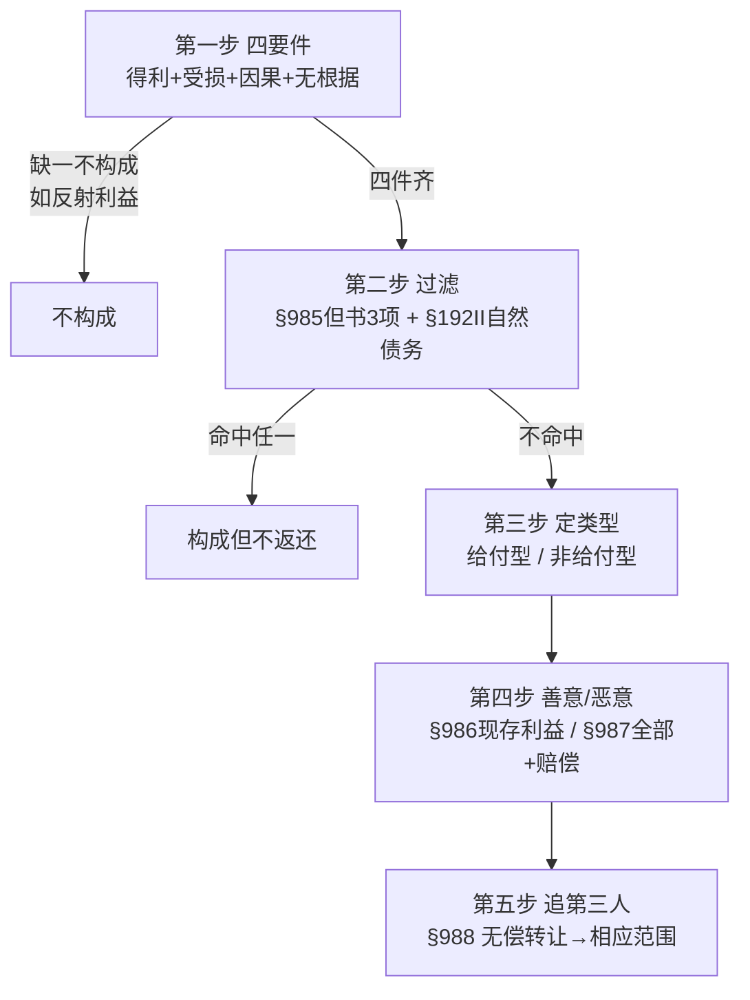

# 📐 不当得利 · 答题模型（万能五步）

> 凡"是否构成不当得利 / 要不要返还 / 返还多少 / 找谁返还"题，按这五步走。**核心一句话**：先用"**多拿了 + 无根据**"两把钥匙判**构成**（四要件，"受损"是最常被偷走的要件）；再用"**§985 但书 3 项 + §192 II 自然债务**"过滤**能不能要回**；最后看得利人**善意 / 恶意**定**返还多少**、利益**无偿转出**没有定**找谁**。
> **姊妹模型** → [[民法-合同-无因管理模型]]（准合同另一半："帮了"是无因管理、"多拿了"是不当得利）· [[民法-合同-无效撤销返还模型]]（合同无效后返还＝给付型不当得利的特别规则）· [[民法-合同-解除模型]]（解除后返还走 §566 还是 §985 的边界）。
> **适用真题**：[[准合同-单选-04|C3-单选-04·构成+排除"四选一"]] · [[准合同-多选-01|C3-多选-01·有没有法律根据]] · [[准合同-多选-02|C3-多选-02·恶意得利人全责返还]]
>
> 🔎 **法条已联网核实（2026-06-15，CONFIRMED·HIGH）**：现行依据＝《民法典》合同编准合同分编 **§985**（构成 + 但书 3 项排除）· **§986**（善意得利人＝现存利益）· **§987**（恶意得利人＝全部利益 + 赔偿）· **§988**（无偿转让第三人→第三人相应范围返还）+ 总则编 **§192 II**（诉讼时效届满后自愿清偿不得返还＝自然债务）。逐字原文经[最高检官网民法典合同编](https://www.spp.gov.cn/spp/ssmfdyflvdtpgz/202008/t20200831_478413.shtml) + [最高法公报民法典(续)](http://gongbao.court.gov.cn/Details/7f184078694d811fb3314f6af9accf.html) / 最高法官网 court.gov.cn 双静态权威源**字节级交叉核对**；考点框架以 [233网校《2022 法考客观题民法核心考点六》](https://www.233.com/sf/xueba/minfa/202204/07152535366929.html)（逐字点名四要件 / 3 项排除 / 善意恶意返还 / §988）+ 瑞达钟秀勇精讲课目录（"构成要件 / 排除情形 / 债的内容"三层）为机构口径。
> ⚠️ **三个最易记错（命题人埋的连环坑）**：
> - ① §985 但书**恰好 3 项，不是 4 项**（道德义务给付 / 债务到期前清偿 / 明知无义务清偿）。
> - ② "时效届满后自愿清偿不得返还"出处是 **§192 II，不是 §985 但书**——时效届满之债仍存在（只丧失胜诉权），并非"无给付义务"，套不上 §985③。
> - ③ §988 的"**相应范围**"＝受损人损失与第三人所获的**重合部分**，**不是** §986 的"现存利益"，更不是连带、不含赔偿。

## 一、核心考情

- **频率**：★★★（准合同"小而稳"的性价比之王）。四要件 + 3 项排除 + 善意 / 恶意返还几乎是固定考点，233网校逐字点名、各机构口径稳定，分值小但**必拿**。
- **命题核心**：永远围绕"**看似构成、实则被排除 / 被否定**"——故意让你只看见"一方获利"就下结论，把答案藏在"有没有受损方 / 有没有法律根据 / 落不落但书"里。
- **三大必争点**：① **构成**（四要件，"受损"是命门）② **排除**（§985 三项 + §192 II，条号坑密集）③ **返还范围**（§986 善意 vs §987 恶意，计算型多选）。

## 二、万能五步模型

> 老王小李铺位（与 [[不当得利]] 实体"手滑转账"叙事一致）：**小李＝受损人 / 给付人**，**老王＝得利人 / 受领人**，**老张＝无偿受让的第三人**。

### 第一步：四要件认定（构成吗？）

**铁则**：① 一方**获利**（含**消极得利**：应支出而未支出，如无权占用省下的租金、白用他人劳务）② 他方**受损** ③ 获利与受损基于**同一原因**（因果）④ **无法律根据**——四者缺一不构成。

- ⚠️ **"受损"是独立要件**：邻居建校区致你房价涨＝**反射利益**，无受损方 → 不构成（陷阱常只描述"一方获利"，引你忽略"他方受损"）。
- ⚠️ **"无法律根据"是核心**：有合同 / 有效债务 / 有效清偿＝有根据 → 不构成。

**老王小李例子**：小李手滑把本该转 100 的款多按个 0 转成 1000 → 老王多收 900（获利）、小李少了 900（受损）、同一笔转账（因果）、小李本只想转 100 无合同义务（无根据）→ **构成**。

### 第二步：过滤但书 + 自然债务（构成了，但要不要返还？）

**铁则**：四要件齐了，再过这张"**不返还**"滤网，命中任一即**不得请求返还**——

| 排除事由 | 条号 | 要点 |
|---|---|---|
| 履行**道德义务**的给付 | §985① | 养子赡养生父母、谢救命恩人、媒人谢礼、礼尚往来 |
| 债务到期**之前**的清偿 | §985② | 提前还款，债务**真实存在**（不是"到期后"）|
| **明知**无给付义务而进行的**债务清偿** | §985③ | "**明知**"才排除；"**误信**有义务"而清偿→仍可返还 |
| 时效届满后的**自愿清偿** | **§192 II** | 自然债务，受领有保持力；**出处 §192 II，非 §985** |

- ⚠️ **但书只针对"给付方 / 给付型"**——通过给付（有意识增加他人财产）取得才谈得上但书；**侵害他人权益获利的"非给付型"无但书适用余地**，**受领方也不能援引**（见真题演练③餐馆题）。
- ⚠️ **不法原因给付**（赌债、行贿款）：§985 但书**未列此项**（立法空白），原则上**不予返还**（给付人不得主张），与"赃款走收缴"是两个层次——民法典无明文，标注为弱考点、谨慎。

### 第三步：定类型（给付型 / 非给付型）——定举证、定边界

**铁则**：

- **给付型**（受损人有意识、有目的地给付）：再看**给付目的三分**——① 自始欠缺目的（非债清偿 / 合同不成立、无效、被撤销）② 目的**嗣后不存在**（合同被解除）③ 目的**不达**（为结婚赠彩礼而婚未成）。此型"无法律根据"由**受损人**举证。
  - 🔗 与 [[民法-合同-无效撤销返还模型]] / [[民法-合同-解除模型]] 的**边界**：合同无效→返还走 §157，解除→返还走 §566，这些是给付型不当得利的**特别规则**，有特别法时优先适用特别法。
- **非给付型**（权益侵害型 / 费用支出型 / 求偿型）：依"该利益依**权益归属**本应归谁"判断，由**得利人**证明其有保有的法律原因。
- ⚠️ 货币"**占有即所有**"落在此步：误付 / 拾得 / 盗得**现金货币**→排除**物权返还请求权（返还原物）**，原权利人改走**不当得利之债**（这是"改走债权"，**不是"不构成"**）；存款货币 / 错误汇款是否同样适用学界有争议（委托占有、特定化等例外），止于现金通说即可。

### 第四步：分善意 / 恶意，定返还范围（计算型多选必争）

**铁则**：先判**取得时**主观（是否"知道或者应当知道"无法律根据），再定返还范围——

| 维度 | 善意得利人（§986）| 恶意得利人（§987）|
|---|---|---|
| 主观 | **不知道且不应当知道** | **知道或者应当知道** |
| 返还范围 | **现存利益**为限，利益已灭失→**免责**（得利丧失抗辩）| **取得的全部利益**（不论是否现存）|
| 赔偿损失 | ❌ 不负 | ✅ 返还利益**并**依法赔偿损失（"返还"＋"赔偿"叠加）|

- ⚠️ 善意人的"**利益已不存在**"要严判：把钱**挥霍**了 → 利益不存在、免责；把钱**用于清偿自己本应付的债** → 属**节省支出**，利益**视为仍存在**，**不免责**。
- ⚠️ **嗣后恶意**：取得时善意、之后才知情 → 以**知情时**为节点切割，前按善意、后按恶意。
- ⚠️ 原物**不能返还**（被吃掉 / 被用掉）→ 转为**价额偿还**（佛跳墙价款、占用费）——与第一步"消极得利"是同一原理。

### 第五步：追第三人（§988，利益已无偿转出）

**铁则**：得利人已将取得的利益**无偿转让**给第三人 → 受损人可向**第三人**在**相应范围内**主张返还（双触发器＝**无偿 + 转让**）。

- **有偿**转让 → **不适用**，受损人只能找得利人（§987）。
- "**相应范围**"＝受损人损失与第三人所获的**重合部分**（≠ §986 现存利益），且**只返还、不含赔偿**、非连带。
- 进阶（学理）：得利人"非正当转让"后主张"我已转给别人、利益不存在了" → 不行，**视为利益仍存在**，得利人不能借转赠脱责。

**老王小李例子**：老王明知小李错转了 900，转手**无偿赠**给老张 → 小李可向**老张**在 900 范围内主张返还（§988）；若老王把这 900 **卖**给老张（有偿）→ 小李只能找老王（§987）。

## 三、命题人最爱的陷阱

| # | 陷阱 | 正解 | 对应真题 |
|---|---|---|---|
| ① | **反射利益**当不当得利（建校区 / 广场致房升值）| 无受损方 → 不构成（受损是独立要件）| **单选-04 A** |
| ② | 时效届满清偿当"错付可返还"| **§192 II** 自然债务不得返还（**非 §985 但书**）| **单选-04 B** |
| ③ | 道德义务给付当"无义务可要回"| §985① 排除 | **单选-04 C** |
| ④ | "**明知**无义务" ↔ "**误信**有义务"一字之差 | 明知才排除（§985③）；误信仍可返还 | 贯穿 |
| ⑤ | 提前清偿当"无义务清偿可返还"| 债务真实存在 → §985② 不构成 | 机构高频 |
| ⑥ | 第三人代为清偿 → 债权人构成不当得利 | 债权人受偿**有法律根据** → 不构成 | **多选-01 A** |
| ⑦ | 拾得 / 误付货币 → 善意债权人构成不当得利 | 债权人**不构成的真因＝有效债务清偿（有法律根据）**；货币"占有即所有"只解决"用拾得款清偿是否有效 / 与失主关系"，对"债权人是否构成"是**干扰信息** | **多选-01 C** |
| ⑧ | 善意 / 恶意返还范围**张冠李戴** | 善意＝现存（§986）/ 恶意＝全部 + 赔偿（§987），方向相反 | **多选-02 D** |
| ⑨ | 把不当得利限缩为"**仅返还得利**"| 恶意人 §987 须**额外赔偿损失** | **多选-02 C/D** |
| ⑩ | §985 但书往**受领方 / 非给付型**乱套 | 但书只针对**给付方**；受领方明知 ≠ 免责 → 构成 | **多选-02 A** |
| ⑪ | §988"无偿"偷换成"**有偿 / 低价**"| 仅**无偿**转让才能追第三人 | 机构高频 |
| ⑫ | **善意取得**阻断不当得利（让你找善意受让人）| 第三人善意取得后有根据 → 原权利人只能找无权处分人 | 机构高频 |
| ⑬ | **不法原因给付**（赌债）套不当得利返还 | §985 但书未列（立法空白），原则上不予返还 / 另走收缴〔证据 WEAK，民法典无明文〕| 机构高频 |

## 四、真题演练（套五步模型）

### 范例①：[[准合同-单选-04|C3-单选-04]]（哪项**产生**不当得利之债）→ **D**
- **第一步逐项查四要件**：A 甲建校区致乙房升值——乙获益但**无人受损**（反射利益）❌ 不构成。
- **第二步过滤**：B 不知时效已过仍清偿——命中 **§192 II**（自然债务，受领有据）❌ 不返还；C 养子付赡养费——命中 **§985①**（道德义务给付）❌ 不返还。
- **唯 D**：撬门居住一个月＝无根据获**居住（使用）利益**＝**消极得利 / 权益侵害型**，且邻居受损 → 四要件齐全、无任何排除 → **构成**。
- → 答 **D** ✅（三个干扰项分别考反射利益①、自然债务条号②、道德义务③）。

### 范例②：[[准合同-多选-01|C3-多选-01]]（哪些情形**乙构成**不当得利）→ **BD**
- **题眼**：问的是"**乙（受领方 / 受益方）**是否构成"，逐个查"乙拿到的有没有法律根据"。
- A 丙在甲不知情下代偿甲欠乙的 500——乙的债权**得到有效清偿**（第三人代偿对债权人有法律根据）→ 乙**不构成**（丙对甲的关系与乙无关，陷阱⑥）。
- C 甲以拾得的 100 元还欠乙的债——乙**受偿有法律根据（有效债务清偿）** → 乙**不构成**。"货币占有即所有"在此只说明"甲能以该 100 元有效清偿"，**不是**乙不构成的直接理由（陷阱⑦的归因坑）。
- **B** 工资卡被会计误转 2 万——乙获利 + 公司受损 + 无根据（误转）→ **构成**。
- **D** 雇工误耕乙的待耕田——乙获**耕种（劳务）利益** + 甲方受损 + 无根据 → **构成**（消极得利 / 误劳）。
- → 答 **BD** ✅。

### 范例③：[[准合同-多选-02|C3-多选-02]]（餐馆误上"佛跳墙"，朱某**明知**仍吃完）→ **ABC**
- **第二步定位但书**：餐馆＝**给付方**（误送、**不明知**），§985 但书是"给付方明知 / 自愿"的免责事由，餐馆不符；**朱某＝受领方**，但书**不针对受领方** → 朱某**不能援引但书**（陷阱⑩）。
- **第一步**：朱某明知是误上的菜仍吃 → 获佛跳墙利益 + 餐馆受损 + 无根据 → **A 构成**✅。
- **第四步定善恶**：朱某**明知**＝**恶意得利人（§987）** → 返还利益**并**赔偿损失。原物（菜）已吃 → 转**价额偿还**：**B 支付佛跳墙价款**✅（返还得利）、**C 赔偿免单损失**✅（§987 恶意人额外赔偿）。
- **D 错**："不能请求赔偿免单损失"——恶意得利人**须**赔偿，把不当得利限缩为"仅返还得利"是陷阱⑧⑨。
- → 答 **ABC** ✅。

## 五、真实案例·五步演练（让规则落地）

> 图例：🏛️ 真实判决 / 官方案例 · ✅ 法考真题 · 🔧 教学构造例（非个案）。来源为转述、未见原裁判文书的标「**待核**」，引用前宜核原文书；真假不混淆、不杜撰。

### ① 构成四要件 — 🏛️ 误汇 5.2 万给陌生人
- **案情**：陈某网银付货款，账号输错没核对就点"确认"，**5.2 万误转给素不相识的胡某**；胡某称"没拿过你的钱"拒还（[广东高要法院·肇庆中院](https://gdzqfy.gov.cn/alpx/480.html)）。
- **套用**：胡某得利 + 陈某受损 + 同一笔误转（因果）+ 双方零关系（无根据）→ 四件齐 → **判全额返还 5.2 万**。
- 💡 这是判"无法律根据"最干净的案——双方毫无关系，得利当然无据。
- 🔧 **定性前置**：钱一进账户即"占有即所有"，错误汇款是 **§985 不当得利之债**（返同额钱）、不是刑事侵占（[最高检理论文章](https://www.spp.gov.cn/spp/llyj/201906/t20190601_420501.shtml)·文章非判决）。

### ② 排除（有法律根据 / 不法原因给付）
- **🏛️ 反例·有根据即排除**：某甲**司法拍卖**合法竞得不动产，被诉"多获物权利益 2300 万不当得利"→ 二审认定**竞得有法律根据**、"无根据"要件不成立，**改判驳回**（[越律网经办案](https://www.sxls.com/bddltx.html)）。
- **🔧 不法原因给付**：清偿赌债 / 行贿款后反悔请求返还 → 原则**不得返还**（"赌债非债"）。⚠️ 这**不在 §985 但书三项里**（民法典未设不法原因给付一般条款），走 §153 违法背俗 / 学理路径——**别记成"§985 但书"**。
- ⚠️ **§157 无效返还 ≠ §985 不当得利**：检例 225 号（已婚者把夫妻共同财产 37.94 万赠婚外第三者）走的是 **§153Ⅱ/§157 无效返还**、不进不当得利四要件流程（[最高检第 56 批指导案例](https://www.spp.gov.cn/spp/jczdal/202503/t20250313_690391.shtml)）。

### ③ 给付型 vs 非给付型
- **🏛️ 给付型·重复发工资**：工资已结清，财务网银失误**重复发 7383 元**、当天发现、对方拒还 → 给付欠缺目的＝**给付型**不当得利，判返还（湖南·云溪区法院 2022）。
- **🏛️ 非给付型·捡漏提货单**：马某某买得他人**丢失的水泥提货单**、据此提走 41 吨水泥（价 11 万）→ 非受损人自愿给付、凭他人之物获益＝**非给付型（权益侵害型）**，判返还价款（青海湟中 (2004) 湟多民初字第 106 号）。

### ④ 善意（§986）/ 恶意（§987）返还范围 ★难点
- **🏛️ 恶意 → 本金 + 利息**：张某误转 **100 万**给蔡某（与真收款人姓名相邻），蔡某经告知**仍拒还、火速转给儿子** → **明知＝恶意（§987）**，判返 100 万 + 自次日起按 LPR 付利息；交通 / 律师费不支持（济南中院二审维持）。→ 转给儿子正是第⑤步 §988 的触发点。
- **🏛️ 善意 + 利益已不存在 → 免还**〔待核〕：某公司收到 600 万、**次日即全额转出**，被诉返还 → **善意得利人返还以现存利益为限**，利益已不存在则免还（§986），驳回（(2017) 最高法民再 287 号·转述来源，宜核原文书）。
- **对照·有无过错决定加不加息**：①恶意（蔡某）→ 本金 + 利息；②受损方**自身操作失误**、得利人无过错（陈某 5.2 万案）→ 只返本金、**不加息**。是否加息＝看得利人善恶 + 受损方有无过错。
- **✅/🏛️ 善意→恶意分界引子**：许霆 ATM 案——首取 999 元**不知故障（善意）**属不当得利，明知故障后续取 = **恶意**转盗窃（刑民交叉**引子**，勿当纯返还范围判例用）。

### ⑤ §988 追第三人（无偿转赠第三人）
- ⚠️ 现实中以 §988"**直接判第三人返还**"的生效判决**极少**——重点记**适用前提**，而非硬找判例。
- **🏛️ 关键案**〔待核〕：误转 **86 万**给马某某，马**无偿转给女儿**；受损人同时告马（得利人）和女儿（第三人）→ 马恶意判返本息；对女儿因其**已把钱转回马账户、未保有利益** → **不符 §988**，驳回（济南槐荫 / 中院·[澎湃](https://m.thepaper.cn/newsDetail_forward_29292059)）。揭示 §988 两前提：**"相应范围"＝第三人现仍保有的利益 + 补充性（得利人能还就不必追第三人）**。
- **🔧 限缩（崔建远释义）**：① 只有得利人"无偿且正当"转出，才可追第三人；② 第三人构成**善意取得**的，不得请求返还。
- **✅ 真题·货币 vs 赃物的"追及"差别**（2015 卷三）：甲用**赃物（手表）**+ 现金还欠乙的债、乙不知情把表转赠丁 → **赃物不适用善意取得**，原主可向丁追**原物**；但乙善意收的**现金"占有即所有"**，原主**不能**向乙主张货币不当得利。→ 正好印证 §988 / 善意取得对"追第三人"的限制。

## 📐 口诀

> **"多拿了、对方亏、同因果、没根据——四件齐了才算数（光涨价没人亏，那叫反射利益，不算）。**
> **道德给付、提前还、明知不欠还要还——这三项 §985 不用退；时效过了自愿清，§192（不是 985）不许翻。**
> **善意只还现存的（§986），恶意全还加赔偿（§987）；东西吃了用了？折成钱来赔。**
> **钱被无偿送了人，§988 找第三人——相应范围只返还，有偿转让就免谈。"**

## 相关页面

- 核心概念：[[不当得利]]（§985-§988 实体页 · 四要件 / 善意恶意 / §988）· [[无因管理]]（"帮了"vs"多拿了"）· [[自然债务]] · [[诉讼时效]]（§192 II）· [[债的发生原因]]
- 姊妹 / 边界模型：[[民法-合同-无因管理模型]]（准合同另一半）· [[民法-合同-无效撤销返还模型]]（§157 返还）· [[民法-合同-解除模型]]（§566 返还）
- 适用真题：[[准合同-单选-04]] · [[准合同-多选-01]] · [[准合同-多选-02]]
- 综合报告：[[准合同考点-深度报告]]（三 · 不当得利 §985-§988）· [[准合同-深度报告]] · [[请求权基础]]
