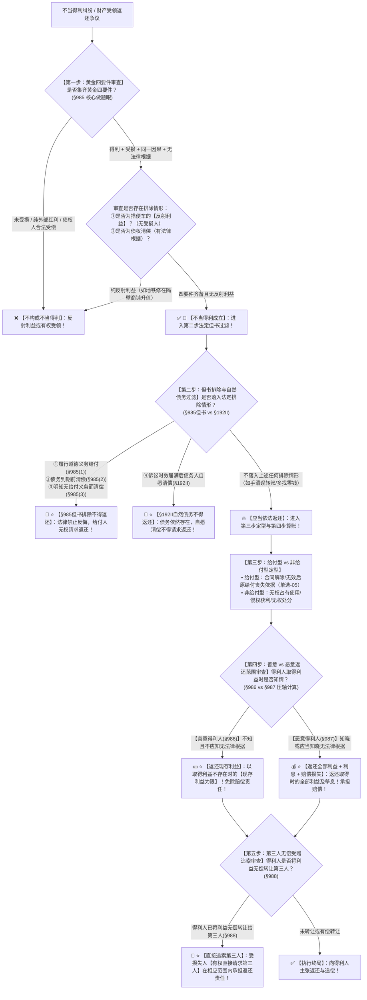

# 📐 不当得利 · 全流程答题模型（黄金四要件 · 但书三项排除 · 自然债务不得返还 · 善恶返还范围双轨 · 第三人无偿追索 · §985-§988）

> **教练开场白**
> 同学们好！我是你们的民法法考教练。在准合同分编中，“不当得利”是**民法典单列独立章、客观题常年必出 1–2 题、主观题中解决财产移转返还的核心法定请求权基础（与合同解除返还、物权返还并列）的四星级重点核心母题**！
> 很多同学做不当得利题目时经常凭感觉瞎猜“谁占便宜了谁就是不当得利”：看到市政修路导致旁边小区商铺升值 200 万，以为商铺业主是不当得利（忽略了“无受损方”的反射利益）；看到第三人主动替债务人清偿债务，以为债权人拿了钱是不当得利（忽略了“有债权根据”）；把诉讼时效过了还钱不能要回的法条依据记成 §985 但书（其实是诉讼时效章 §192Ⅱ 自然债务）；算不清善意得利人（只还现存利益）和恶意得利人（全额还本息＋赔偿损失）的数学计算题。
> 《民法典》不当得利章（§985–§988）与总则编《民法典》§192Ⅱ，构建了**以“黄金四要件定性、排除反射利益、但书三项绝对不得要回、诉讼时效届满自然债务不得翻供、善意还现存、恶意全吐加赔偿、无偿送第三人可直接追”为核心的裁判闭环**。
> 今天我们用**“五步连贯流水线”**，把不当得利的全部构成要件、法定排除情形、善恶返还计算与第三人追索规则一次性彻底锁死：**第一步查黄金四要件（得利 ＋ 受损 ＋ 因果 ＋ 无法律根据，剔除反射利益 §985） → 第二步查法定排除过滤关（§985 但书 3 项道德义务/提前清偿/明知不欠 ＋ §192Ⅱ 自然债务） → 第三步查给付型 vs 非给付型分类关（受领原因嗣后消灭/合同解除/无权处分） → 第四步查善意 vs 恶意返还范围关（善意仅还现存利益 §986 vs 恶意全额返还加利息损失赔偿 §987） → 第五步查第三人无偿受赠追索关（可直接找无偿受赠人追回 §988）**！

---

## 适用场景与解决问题

本模型专门解决不当得利法律关系成立认定、反射利益与消极得利辨析、法定排除返还事由适用、诉讼时效届满还款性质认定、善意与恶意得利人返还范围确定、第三人无偿受赠转让追索的全部主客观题考点（对应 [[准合同考点-深度报告]] 三·不当得利 Row 1/2/3/4/5/6/7/8/9/10/11 · ★★★★ 重点高频）：重点破解：

1. **第一步 · 黄金四要件认定与反射利益排除关（《民法典》§985 核心做题眼）**：
   - ⭐ **黄金四要件（“一得、二失、同因果、无根据”）**：
     - ① **一方取得财产利益**（积极得利：财产增加；消极得利：本该支出的开支未支出，如无权占有他人商铺省下租金）；
     - ② **他方受有损失**（财产实际减少或应增加而未增加）；
     - ③ **取得利益与受损之间具有因果关系**；
     - ④ **没有法律根据（无合法依据）**（在法律上、合同上找不到保留该财产利益的根据）；
   - 🚨 **反射利益绝对排除（多选-01 做题眼）**：市政投资建地铁/名校导致周边房产大幅升值，政府虽有投资但获得了地铁资产，**并不存在“受损方”**，周边业主享受的是**正外部性反射利益，绝不构成不当得利**！
2. **第二步 · 法定排除过滤关：但书 3 项 ＋ 自然债务（《民法典》§985但书 ＋ §192Ⅱ）**：
   - ⭐ **《民法典》§985 但书法定 3 项排除（给了就绝对不得要回）**：
     - ① **为履行道德义务进行的给付**（如资助生活困难的远房亲戚、给见义勇为者发放慰问金）；
     - ② **债务到期之前的清偿**（债务人自愿放弃期限利益提前还款）；
     - ③ **明知无给付义务进行的债务清偿**（明知不欠对方钱依然转账）；
   - ⭐ **诉讼时效届满清偿的法定性质（§192Ⅱ 权威条号陷阱）**：
     - 诉讼时效届满后债务人自愿清偿债务的，**不得请求返还**（因为债务依然合法存在，属于自然债务，债权人受领具有法律根据；🚨 **其依据是总则编 §192Ⅱ，绝非 §985 但书**！）。
3. **第三步 · 给付型 vs 非给付型不当得利定型关（《民法典》§985）**：
   - **给付型不当得利**：基于给付行为产生，但给付目的自始不存在、未能达成、或**给付目的嗣后消灭**（如合同被确认无效、被撤销，或合同解除后原受领财产丧失依据 单选-05）；
   - **非给付型不当得利**：基于给付之外的行为（如无权处分他人之物取得价款、因侵权白占他人房屋土地获利）。
4. **第四步 · 善意 vs 恶意得利人返还范围算账关（《民法典》§986/§987 压轴计算题）**：
   - ⭐ **善意得利人（§986）**：
     - 得利人**不知道且不应当知道**没有法律根据；
     - ⭐ **返还范围：以“取得利益不存在时现存的利益为限”**；若利益已灭失（如遭遇意外或合理消费挥霍不存在现存利益），**免除返还和赔偿责任**！
   - ⭐ **恶意得利人（§987）**：
     - 得利人**知道或者应当知道**没有法律根据；
     - ⭐ **返还范围：应当返还“取得利益时的全部利益 ＋ 加算利息”**；造成受损失人损害的，**还应当承担损害赔偿责任**！
   - 🔄 **善意转恶意**：善意得利人自**“知道或者应当知道没有法律根据之日起”**，转为恶意得利人，此后的毁损灭失承担恶意返还责任。
5. **第五步 · 第三人无偿受赠之追索关（《民法典》§988）**：
   - ⭐ **无偿转让第三人返还责任（§988）**：得利人将取得的利益**无偿转让给第三人**的，受损失的人**有权直接请求第三人在相应范围内承担返还责任**（善意得利人无现存利益免责后，受损人可找无偿受赠人追回）。

> **核心一句**：**不当得利看四条：有得有失因果连，没有根据是关键；反射利益不构成，消极省钱算得利；明知不欠、提前还钱、道德给付（§985但书）要不回；时效过了自愿还（§192II）不能反悔；善意只还现存利益，恶意全部吐出加利息赔损失；无偿送人找下家！**
>
> 🔎 **核心法源（2026最新）**：《民法典》§118、§192Ⅱ、§985、§986、§987、§988。

---

## 💡 【前置认知】不当得利核心排除情形与善恶返还极速对照表

| 制度模块 | 核心法律条文 | 刚性法定规则与标准 | 考场一秒判定秘诀 |
| :--- | :--- | :--- | :--- |
| **① 黄金四要件** | 《民法典》**§985** | 一方得利 ＋ 他方受损 ＋ 因果关系 ＋ 无法律依据 | 隔壁修地铁自家商铺升值（**反射利益**）❌ 不构成！ |
| **② §985 但书 3 项** | 《民法典》**§985但书** | ① 履行**道德义务**给付；<br>② 债务**到期前**清偿；<br>③ **明知无义务**清偿。 | 给贫困亲友汇款、明知不欠仍还，**一律不得要回**！ |
| **③ 自然债务清偿** | 《民法典》**§192Ⅱ** | 诉讼时效届满后自愿清偿，不得请求返还。 | 记住依据是 **§192Ⅱ 诉讼时效章**，不是 §985 但书！ |
| **④ 善意得利人** | 《民法典》**§986** | 返还以**现存利益为限**，免除赔偿责任。 | 不知情拿错钱，买彩票花光了，**现存为零不赔**！ |
| **⑤ 恶意得利人** | 《民法典》**§987** | 返还**全部利益 ＋ 利息 ＋ 损害赔偿**。 | 明知转错账还偷偷取走花掉，**本息全吐还得赔**！ |
| **⑥ 第三人无偿受赠** | 《民法典》**§988** | 得利人无偿转赠第三人，受损人可直接找第三人。 | 拿错的画无偿送给朋友，**失主可直接找朋友要回**！ |

---

## 一、 考点核心骨架与法理（五步连贯决策树）



```
【不当得利全景】一句话开场：不当得利看四条：有得有失因果连，没有根据是关键；反射利益不构成，消极省钱算得利；明知不欠、提前还钱、道德给付（§985但书）要不回；时效过了自愿还（§192II）不能反悔；善意只还现存利益，恶意全部吐出加利息赔损失；无偿送人找下家！
│
▼ 第一步 · 查黄金四要件 ── 一得、二失、同因果、无根据（§985）
├─ 审查四要件：①获利（含消极省钱） ＋ ②受损 ＋ ③因果关系 ＋ ④无法律根据
└─ 排除反射利益：隔壁建地铁/商圈导致自家房屋升值 ─────────────→ ❌【反射利益，无受损人，不构成】
     │
     ▼ 第二步 · 查但书过滤 ── 构成了但能不能要回（§985但书/§192Ⅱ）
     ├─ 《民法典》§985 但书 3 项排除：
     │    ├─ ① 为履行道德义务进行的给付（扶贫、救济亲属） ────────→ 🚫【不得请求返还】
     │    ├─ ② 债务到期之前的清偿（放弃期限利益） ────────────────→ 🚫【不得请求返还】
     │    └─ ③ 明知无给付义务而进行的清偿（明知不欠仍给） ────────→ 🚫【不得请求返还】
     └─ 诉讼时效届满清偿（§192Ⅱ 自然债务）：──────────────────────→ 🚫【不得请求返还】（依据是 §192Ⅱ 非 §985）
          │
          ▼ 第三步 · 查定型 ── 给付型 vs 非给付型（§985）
          ├─ 给付型：合同解除/无效后受领财产丧失依据（单选-05）
          └─ 非给付型：无权使用他人车位商铺（消极得利折价返还）
               │
               ▼ 第四步 · 查善恶返还范围 ── 现存利益 vs 全部加赔（§986/§987）
               ├─ 善意得利人（§986）：─────────────────────────────→ 💵 仅以【现存利益为限】返还（利益灭失免责）
               └─ 恶意得利人（§987）：─────────────────────────────→ 💰 返还【取得时的全部利益 ＋ 利息 ＋ 损害赔偿】
                    │
                    ▼ 第五步 · 查第三人无偿受赠 ── 穿透追索（§988）
                    └─ 得利人将利益无偿转让第三人：────────────────────────→ 🎯【受损人有权直接请求第三人返还】

  ━━━ 五步全通 ━━━
```

---

## 二、 核心考情与 2026 民法典精要

- **频次研判**：不当得利是民法典准合同分编**★★★★ 重点高频考点**；客观题单选、多选常年必考 1 题，主观题中常作为合同无效、合同解除、无权处分后的财产返还兜底请求权。
- **命题核心**：
  1. **黄金四要件与反射利益区分（§985）**：反射利益因缺乏“受损方”绝对不构成不当得利（多选-01）。
  2. **§985 但书 3 项排除情形（§985）**：道德义务给付、提前还款、明知无义务还款一律不得要回（单选-04）。
  3. **自然债务清偿法条依据（§192Ⅱ）**：诉讼时效届满还钱不得要回的依据是 §192Ⅱ，绝非 §985 但书。
  4. **善意 vs 恶意得利人返还范围（§986/§987）**：善意还现存，恶意还全部利益加利息并赔偿损失（多选-02 / 多选-03）。
  5. **第三人无偿受赠返还责任（§988）**：得利人无偿转赠，受损人可直接向第三人主张返还。

---

## 三、 三大核心法理与命题陷阱拆解

### 1. 不当得利四大命题暗坑与裁判标准表

| 案件事实设定 | 争议焦点 | 裁判结论 | 命题陷阱与法理深剖 |
|---|---|---|---|
| 政府在甲村旁投资 10 亿元修建高铁站，导致甲村村民房屋租金暴涨 3 倍。 | 村民租金暴涨是否属于没有法律根据的不当得利？ | ❌ **不构成不当得利！** | 《民法典》§985：政府投资获得了高铁站资产，**政府并没有遭受财产损失**；村民获利属于**“反射利益（正外部性）”**，因缺乏“受损人”不构成不当得利（多选-01）。 |
| 甲借给乙 10 万元，诉讼时效于 2023年1月1日 届满。2024年5月1日 乙自愿转账向甲归还 10 万元。次日乙反悔要求甲退钱。 | 诉讼时效届满后的自愿还款，能否依不当得利请求返还？法定依据是哪条？ | 🚫 **不得请求返还！法定依据是《民法典》§192Ⅱ！** | 《民法典》§192Ⅱ：诉讼时效届满仅丧失胜诉权，实体债务依然存在（**自然债务**）；债务人自愿履行的，**不得请求返还**（🚨 **依据是 §192Ⅱ 诉讼时效章，非 §985 但书** 单选-04）。 |
| 甲误将 5 万元转账至乙账户。乙不知情（善意），以为是年终奖，取出 2 万元买高档白酒消费喝光，账户尚存 3 万元。 | 善意得利人乙应当向甲返还多少钱？喝光的 2 万元是否赔偿？ | 💵 **乙仅需返还现存的 3 万元！喝光的 2 万元无需赔偿！** | 《民法典》§986：善意得利人返还范围**以现存利益为限（现存 3 万元）**；已消耗灭失的 2 万元免除返还及赔偿责任（多选-02）。 |
| 甲误将名画当作赠品送给乙。乙明知转错，次日将该名画无偿赠送给不知情的朋友丙。 | 甲发现后，是否有权直接找无偿受赠人丙要回名画？ | 🎯 **甲有权直接请求丙返还名画！** | 《民法典》§988：得利人乙将取得的利益**无偿转让给第三人丙的，受损失的人甲有权直接请求第三人丙在相应范围内承担返还责任**。 |

---

## 四、 万能解题五步

---

### 第一步：查黄金四要件 —— 得利了吗？受损了吗？是反射利益吗？（《民法典》§985）

> **教练提示**：
> 1. 牢记口诀：**“一得、二失、同因果、无根据”**；
> 2. 警惕反射利益：隔壁修路修商圈导致自家房产升值，**因没有受损人，绝对不构成不当得利**！

---

### 第二步：查但书排除过滤 —— 道德给付吗？提前还款吗？明知不欠吗？时效过了吗？（《民法典》§985但书/§192Ⅱ）

> **教练提示**：以下情形给了就绝对要不回：
> 1. **履行道德义务给付**（扶贫救济亲友）；
> 2. **债务到期前清偿**（提前还贷）；
> 3. **明知无义务给付**（明知不欠依然付款）；
> 4. ⭐ **诉讼时效届满清偿（§192Ⅱ 自然债务）**：记住依据是 §192Ⅱ！

---

### 第三步：查给付与非给付定型 —— 是转错账还是合同解除嗣后丧失依据？（《民法典》§985）

> **教练提示**：
> 1. 合同解除、被撤销、确认无效后，**原受领财产丧失合法依据，构成给付型不当得利（单选-05）**；
> 2. 无权占有他人房屋商铺，**免交租金构成消极得利，应作价额返还**。

---

### 第四步：查善恶返还范围 —— 知不知情？还现存还是全吐加利息？（《民法典》§986/§987）

> **教练提示**：
> 1. **善意得利人（不知情 §986）** $\rightarrow$ **仅以现存利益为限返还**（花掉挥霍的免赔）；
> 2. **恶意得利人（知情 §987）** $\rightarrow$ **返还取得时的全部利益 ＋ 加算利息 ＋ 赔偿损失**！

---

### 第五步：查第三人无偿受赠 —— 送给外人了吗？（《民法典》§988）

> **教练提示**：
> 得利人把东西**无偿送给第三人** $\rightarrow$ **受损失的人可以直接找第三人要回来（§988）**！

#### 💰 完整数字案例：不当得利善恶返还与第三人追索攻防实战

> **【案情（[[准合同-多选-02]] 权威真题综合演练）】**
> 2024年3月1日，甲公司财务人员手滑误操作，将原本应支付给 A 公司的货款 **10 万元**误转入了乙公司的银行账户中。
> - **实战分支 A（善意得利人现存利益返还 · §986）**：
>   乙公司财务人员丙以为是某客户支付的预付款，遂于 3月2日 支取其中 **4 万元**用于宴请客户及购买高档礼品消耗完毕；3月3日 乙公司账户上尚存 **6 万元**。3月4日 甲公司发现误转账并联系乙公司要求全额退还 10 万元及利息。
>   - 裁判涵摄：
>     1. 乙公司在支出 4 万元时不知情且不应知情，属于**善意得利人**；
>     2. 依据《民法典》§986，善意得利人返还范围**以取得利益不存在时现存的利益为限**；
>     3. 乙公司仅需向甲公司**返还账户尚存的 6 万元**，已合理消费消耗的 4 万元免除返还和赔偿责任！
> - **实战分支 B（恶意得利人全额吐出加利息赔偿 · §987）**：
>   若乙公司法定代表人丁在 3月1日 当日即收到银行短信通知，明知该 10 万元系甲公司误转款项，但丁立即指示财务将该 10 万元全部转出投入股市购买股票，至 3月4日 股票亏损仅剩 **5 万元**；同时导致甲公司因资金短缺被供货方扣罚逾期违约金 **5000 元**。
>   - 裁判涵摄：
>     1. 丁明知该款项没有法律根据仍故意挪用炒股，乙公司属于**恶意得利人**；
>     2. 依据《民法典》§987，恶意得利人应当返还**取得利益时的全部利益（10 万元全额） ＋ 银行同期利息**；
>     3. 因乙公司的恶意拖延转出行为导致甲公司遭受 5000 元违约金损失，乙公司**还应当向甲公司赔偿 5000 元损失**！乙公司主张“股票亏损只剩 5 万只还 5 万”的抗辩，法院坚决不予支持（多选-02 考点）！

#### 一句话闭环记忆
> 🎯 **一眼判**：**不当得利看四条：有得有失因果连，没有根据是关键；反射利益不构成，消极省钱算得利；明知不欠、提前还钱、道德给付（§985但书）要不回；时效过了自愿还（§192II）不能反悔；善意只还现存利益，恶意全部吐出加利息赔损失；无偿送人找下家！**

---

## 五、 案例演练

### 1. 不当得利构成要件与排除四选一（[[准合同-单选-04]] 经典真题）
- **案情**：题目综合考查四要件、道德义务给付、明知无义务给付及诉讼时效届满清偿（§192Ⅱ）。
- **模型分析**：第一步与第二步——道德给付、明知无义务、诉讼时效届满还款均不得请求返还；仅非上述排除的误转账成立不当得利返还（选 B）。

### 2. 恶意得利人全额返还与损害赔偿（[[准合同-多选-02]] 经典真题）
- **案情**：得利人明知转错账仍占为己有并转移资金，导致受损人遭受实际损失。
- **模型分析**：第四步——依据《民法典》§987，恶意得利人应当返还取得时的全部利益及利息，并承担损害赔偿责任（选 ABD）。

### 3. 协议解除收养关系后受领财产丧失依据之返还（[[准合同-单选-05]] 经典真题）
- **案情**：合法收养期间依约受领财产，后双方协议解除收养关系，养父母要求返还财产。
- **模型分析**：第三步——给付目的嗣后消灭，原受领财产丧失合法依据，构成给付型不当得利，应当依法返还（选 A）。

---

## 关联真题

- [[准合同-单选-04]] · 不当得利构成四要件与但书排除四选一
- [[准合同-多选-01]] · 不当得利因果关系与反射利益排除
- [[准合同-多选-02]] · 恶意得利人全额返还加利息损失赔偿责任
- [[准合同-单选-05 · 协议解除收养关系后受领财产丧失依据之不当得利返还案]] · 合同解除目的消灭之给付型不当得利返还

## 相关页面

- 概念实体页：[[不当得利]] · [[无因管理]] · [[买卖合同]]
- 姊妹模型：[[民法-合同-无因管理模型]] · [[民法-合同-无效撤销返还模型]] · [[民法-合同-解除模型]]
- 综合报告：[[准合同考点-深度报告]]（三、不当得利 · Row 1/2/3/4/5/6/7/8/9/10/11 · ★★★★ 重点高频）
