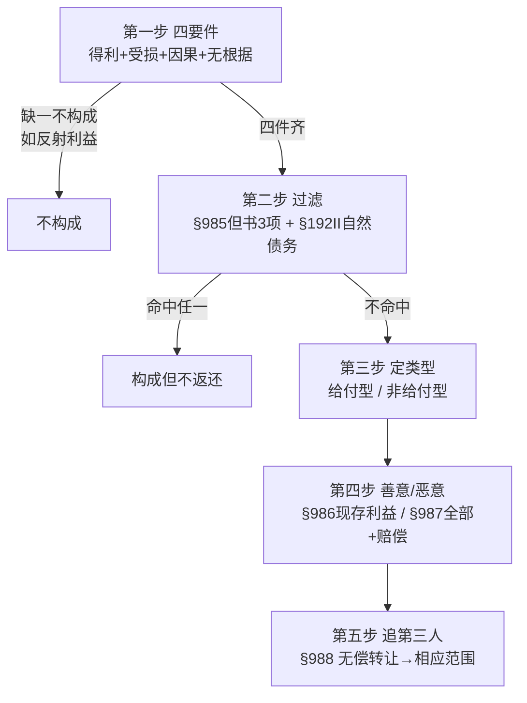

# 📐 不当得利 · 答题模型（万能五步）

> 凡"是否构成不当得利 / 要不要返还 / 返还多少 / 找谁返还"题，按这五步走。**核心一句话**：先用"**多拿了 + 无根据**"两把钥匙判**构成**（四要件，"受损"是最常被偷走的要件）；再用"**§985 但书 3 项 + §192 II 自然债务**"过滤**能不能要回**；最后看得利人**善意 / 恶意**定**返还多少**、利益**无偿转出**没有定**找谁**。
> **姊妹模型** → [[民法-合同-无因管理模型]]（准合同另一半："帮了"是无因管理、"多拿了"是不当得利）· [[民法-合同-无效撤销返还模型]]（合同无效后返还＝给付型不当得利的特别规则）· [[民法-合同-解除模型]]（解除后返还走 §566 还是 §985 的边界）。
> 📐 **竞合/择一枢纽** → [[民法-合同-请求权竞合模型]]（不当得利 vs 侵权/物权返还＝竞合家族第❺类；现金"占有即所有"→物权返还排除、改走不当得利债）。
> **适用真题**：[[准合同-单选-04|C3-单选-04·构成+排除"四选一"]] · [[准合同-多选-01|C3-多选-01·有没有法律根据]] · [[准合同-多选-02|C3-多选-02·恶意得利人全责返还]]
>
> 🔎 **法条已联网核实（2026-06-15，CONFIRMED·HIGH）**：现行依据＝《民法典》合同编准合同分编 **§985**（构成 + 但书 3 项排除）· **§986**（善意得利人＝现存利益）· **§987**（恶意得利人＝全部利益 + 赔偿）· **§988**（无偿转让第三人→第三人相应范围返还）+ 总则编 **§192 II**（诉讼时效届满后自愿清偿不得返还＝自然债务）。逐字原文经[最高检官网民法典合同编](https://www.spp.gov.cn/spp/ssmfdyflvdtpgz/202008/t20200831_478413.shtml) + [最高法公报民法典(续)](http://gongbao.court.gov.cn/Details/7f184078694d811fb3314f6af9accf.html) / 最高法官网 court.gov.cn 双静态权威源**字节级交叉核对**；考点框架以 [233网校《2022 法考客观题民法核心考点六》](https://www.233.com/sf/xueba/minfa/202204/07152535366929.html)（逐字点名四要件 / 3 项排除 / 善意恶意返还 / §988）+ 瑞达钟秀勇精讲课目录（"构成要件 / 排除情形 / 债的内容"三层）为机构口径。
> ⚠️ **三个最易记错（命题人埋的连环坑）**：
> - ① §985 但书**恰好 3 项，不是 4 项**（道德义务给付 / 债务到期前清偿 / 明知无义务清偿）。
> - ② "时效届满后自愿清偿不得返还"出处是 **§192 II，不是 §985 但书**——时效届满之债仍存在（只丧失胜诉权），并非"无给付义务"，套不上 §985③。
> - ③ §988 的"**相应范围**"＝受损人损失与第三人所获的**重合部分**，**不是** §986 的"现存利益"，更不是连带、不含赔偿。

## 一、核心考情

- **频率**：★★★（准合同"小而稳"的性价比之王）。四要件 + 3 项排除 + 善意 / 恶意返还几乎是固定考点，233网校逐字点名、各机构口径稳定，分值小但**必拿**。
- **命题核心**：永远围绕"**看似构成、实则被排除 / 被否定**"——故意让你只看见"一方获利"就下结论，把答案藏在"有没有受损方 / 有没有法律根据 / 落不落但书"里。
- **三大必争点**：① **构成**（四要件，"受损"是命门）② **排除**（§985 三项 + §192 II，条号坑密集）③ **返还范围**（§986 善意 vs §987 恶意，计算型多选）。

## 二、万能五步模型

> 同学们好！我是你们的民法法考教练。在法考的准合同分编中，**“不当得利”**（《民法典》第985条）是一个“小而美”的高频考点。很多同学在做题时，经常凭感觉判断“谁占了便宜，谁吃亏了，这就是不当得利”。**大错特错！** 命题人最喜欢在**第一步“四要件认定”**上挖坑，故意隐藏或偷走某一个要件，引诱你掉入陷阱。 今天，我们用最接地气的方式，彻底拆透不当得利构成的**“黄金四要件”**，帮你装上这双法考“避坑法眼”。

> 老王小李铺位（与 [[不当得利]] 实体"手滑转账"叙事一致）：**小李＝受损人 / 给付人**，**老王＝得利人 / 受领人**，**老张＝无偿受让的第三人**。

### 第一步：四要件认定（构成吗？）

想要构成不当得利，必须集齐以下**四个要件**，缺一不可：

> **“一得、二失、同因果、无根据”**

- **“一得”（一方获利）**：得利人的财产增加了，或者**本该减少的财产没减少（消极得利）**。
- **“二失”（他方受损）**：受损人的财产减少了，或者**本该增加的利益没增加**。
- **“同因果”（因果关系）**：获利和受损必须是**“同一原因”**导致的。
- **“无根据”（无法律根据）**：得利人取得这个利益，**在法律上、合同上找不到任何依据**。
#### 大白话讲解与生活实例

为了帮大家搞懂这四个要件在法考中的真实样貌，我们拆解三个最经典的命题陷阱：

##### 陷阱一：只有“得利”，没有“受损” ➜ **反射利益**（不构成！）

- **生活实例**：政府在甲的隔壁建了一个超大的重点学校，导致甲的房子一夜之间暴涨了 200 万元。政府确实花了大钱（有支出），甲也确实凭空赚了 200 万（有得利），因果关系也存在。

- **名师拆解**：政府虽然花了钱，但它的钱变成了它拥有的学校大楼，政府在法律上的财产并没有“流失”给甲。甲的房子涨价，属于**“反射利益”**（正外部性）。**因为没有“受损方”，所以绝对不构成不当得利**。甲不需要给政府分钱。

##### 陷阱二：没拿钱，只是白占便宜 ➜ **消极得利**（构成！）

- **生活实例**：小王没有跟任何人打招呼，偷偷潜入老张家空置的商铺里住了一个月。小王并没有拿老张的任何东西，老张也没损失一分钱现金。

- **名师拆解**：小王虽然没拿钱，但他免去了本该支付的一个月房租，这在法律上叫**“消极得利”**（本该支出的费用没支出）；而老张的商铺被白占，失去了出租的利益，属于“他方受损”。**这完全符合四要件，构成不当得利**。小王必须向老张返还这一个月租金的等额价款。

##### 陷阱三：有“受领”，但“有法律根据” ➜ **债务消偿**（不构成！）

- **生活实例**：甲欠债权人乙 1 万元。丙在甲完全不知情的情况下，主动转账 1 万元给乙，帮甲把债还了。事后，丙反悔，起诉债权人乙要求退钱，理由是：“你（乙）构成不当得利，因为我和你之间没有合同，你凭什么拿我的钱？”

- **名师拆解**：乙虽然收了 1 万元，但乙和甲之间存在**合法的、真实的债权债务关系**。债权人乙受偿这 1 万元，是有“法律根据”的（债务得到清偿，乙在法律上本就该收这笔钱）。**由于乙“有法律根据”，所以乙绝对不构成不当得利**（参见 [[准合同-多选-01|C3-多选-01 A]]）。丙只能去找甲要钱（无因管理或求偿），不能找乙退钱。

---

#### 3. 区分两个世界：反射利益 vs 消极得利

法考做题时，请在脑中建立这两个世界的清晰对比：

| 判定维度       | 世界一：搭便车（反射利益 ❌ 不构成）   | 世界二：白占便宜（消极得利 ✅ 构成）     |
| ---------- | --------------------- | ----------------------- |
| **典型案例**   | 隔壁修了地铁/商圈，导致我的商铺租金翻倍  | 误入他人农田耕作、无权占用他人车位/房屋    |
| **受损方的状态** | 投资方依然拥有地铁/商圈，没有财产“损失” | 权利人的土地/车位使用权被排他性占用，产生损失 |
| **得利方的状态** | 纯粹的外部红利（搭便车）          | 应当支付对价而未支付（省下了租金/劳务费）   |
| **法律后果**   | **不构成**不当得利，不需要返还     | **构成**不当得利，需折价返还（价额偿还）  |

### 第二步：过滤但书 + 自然债务（构成了，但要不要返还？）

> **“明知提前与道德，过了时效不能翻”**

- **“明知提前与道德”**（《民法典》第985条但书三项）：明知自己不欠钱仍给付（明知无义务）、债务未到期提前还钱（提前清偿）、出于恩情或良心给钱（履行道德义务）。这三项一旦给了，**法律禁止你反悔，不得请求返还**。

- **“过了时效不能翻”**（《民法典》第192条第2款）：债务过了诉讼时效，只丧失胜诉权，债务本身依然合法存在（自然债务）。债务人自愿还了钱的，**不得请求返还**。

#### 大白话讲解

我们用老王和小李之间的爱恨纠葛，看看这四种“构成了不当得利、但法律不支持要回”的经典法考场景：

- **场景一：履行道德义务（✅ §985① —— 不得请求返还）** 小李小时候落水，被老王救了命。小李长大发财后，为了报答救命之恩，在过年时封了1万元的大红包给老王。后来两人因为琐事吵架闹掰，小李起诉老王：“我法律上根本没有给老王1万块钱的赡养或抚养义务，老王拿到这笔钱没有法律根据，构成不当得利，把钱退我！”
    
    - **名师拆解**：小李给老王1万元，在法律上确实没有法定义务。但这是小李为了**履行道德义务**而进行的给付。法律支持这种知恩图报的道德行为，**一旦给了就别想反悔要求退钱**。

- **场景二：债务提前清偿（✅ §985② —— 不得请求返还）** 小李欠老王10万元，约定明年10月1日到期。今年小李赚了钱手头宽裕，在今年10月1日就把10万块钱转给老王还了。还完第二天，小李发现有个理财项目年化收益10%，后悔了，去找老王：“合同约定的期限还没到，你提前拿了我的钱占了利息便宜，构成不当得利！先把钱退我，明年到期我再给你。”
    
    - **名师拆解**：虽然提前还了，但这笔债是**真实存在**的。这属于**债务到期之前的清偿**。老王收这笔钱是有终局法律根据的，小李**无权要求退钱**。

- **场景三：明知不欠 vs 误信欠钱（✅ §985③ —— 明知排除，误信可退）**
    
    - **情况A（明知不欠）**：小李追求老王的女儿。为了讨好老王，小李明知自己不欠老王一分钱，还是转了5000元给老王，备注“孝敬叔叔”。后来追求失败，小李起诉要求退还这5000元不当得利。
        - **名师拆解**：小李在转账时**明知自己没有给付义务**，这相当于自愿赠与或消费，属于“明知无给付义务而清偿”，**不得请求返还**。

    - **情况B（误信欠钱）**：小李记错账了，以为自己还欠老王5000元，于是转了5000元过去。事后查账发现两人的账目早就结清了。
        - **名师拆解**：小李是**“误信”自己有债务**，不是“明知无债”。这不属于但书排除情形，老王构成不当得利，**小李完全可以要求退钱**。

- **场景四：过了时效自愿还（✅ §192 Ⅱ —— 自然债务不得返还）** 小李欠老王10万元，老王拖了4年都没去催债，诉讼时效（3年）已经过了。后来小李良心发现，主动把10万块钱还给了老王。还完钱后，小李听律师说：“这笔债早就过诉讼时效了，老王去法院告你也赢不了！”小李一拍大腿，起诉老王要求退钱。
    
    - **名师拆解**：债务过了诉讼时效，只是老王丧失了“强制执行的胜诉权”，但**债务本身依然合法存在**（在法理上叫自然债务）。小李自愿还钱，属于有效清偿。根据《民法典》第192条第2款，**时效届满后自愿清偿的，不得请求返还**。
    - _注意_：此项的出处是**总则编诉讼时效的第192条**，不是准合同的第985条但书！

---

#### 一句话闭环记忆

> **“明知不欠、提前还款、道德给付，这三项但书不退钱；时效已过自愿清偿，还了就别想再翻案。”**

做题时，判定完构成不当得利后，立刻看是不是“自愿送恩情”、“提前还真实债务”或“知道不欠还要给”。如果是，一律不得返还。如果是“算错账错付的”，则依然可以要求返还！

**铁则**：四要件齐了，再过这张"**不返还**"滤网，命中任一即**不得请求返还**——

| 排除事由                    | 条号          | 要点                                |
| ----------------------- | ----------- | --------------------------------- |
| 履行**道德义务**的给付           | §985①       | 养子赡养生父母、谢救命恩人、媒人谢礼、礼尚往来           |
| 债务到期**之前**的清偿           | §985②       | 提前还款，债务**真实存在**（不是"到期后"）          |
| **明知**无给付义务而进行的**债务清偿** | §985③       | "**明知**"才排除；"**误信**有义务"而清偿→仍可返还   |
| 时效届满后的**自愿清偿**          | **§192 II** | 自然债务，受领有保持力；**出处 §192 II，非 §985** |

**🚗 生活案例（小李＝给付人想要回 · 老王＝受领人）——"构成了，但要不回"**：
- **§985① 道德义务给付**：小李出于报恩 / 孝心，长期给**没有法定赡养义务**的恩人老王生活费；后来闹掰，小李以"我法律上本来不用给"要回 → **不行**。法律没强制你给，你凭良心给了就别想反悔（逢年过节给岳父母的红包、资助贫困亲戚读书同理）。
- **§985② 提前还债**：小李欠老王的钱本约定明年到期，今年手头宽裕**提前还**了；之后小李说"还没到期、你占便宜了"要回 → **不行**。债是**真欠的**，只是还早了，老王收得有法律根据。
- **§985③ 明知不欠还给**：小李**明知自己根本不欠**老王，仍给了老王一笔钱（图面子 / 变相相送），事后想要回 → **不行**。明知没义务还给＝自愿，赖不掉。
  - 🔑 **一字之差**：若小李**记错账、误以为**欠老王而还（误信有义务）→ 属错付，**能**要回。**"明知"排除、"误信"可退**。
- **§192 II 时效届满自愿还**：小李欠老王 10 万**拖过 3 年时效**（老王去法院告也赢不了胜诉权），小李后来良心发现**自愿还**了，还完又反悔"反正过时效你告不赢，退我" → **不行**。过时效的债务**仍真实存在**（只丢了胜诉权＝自然债务），自愿还了不能翻。
  - 🔑 **条号坑**：出处是 **§192 II（诉讼时效）**，**不是 §985 但书**——债务真实存在、不是"无给付义务"。

- ⚠️ **但书只针对"给付方 / 给付型"**——通过给付（有意识增加他人财产）取得才谈得上但书；**侵害他人权益获利的"非给付型"无但书适用余地**，**受领方也不能援引**（见真题演练③餐馆题）。

- ⚠️ **不法原因给付**（赌债、行贿款）：§985 但书**未列此项**（立法空白），原则上**不予返还**（给付人不得主张），与"赃款走收缴"是两个层次——民法典无明文，标注为弱考点、谨慎。

### 第三步：定类型（给付型 / 非给付型）——定举证、定边界

> 在判定完不当得利的构成和但书排除后，我们必须立刻明确案件在法庭上的打法和规则界限——**“第三步：定类型（给付型 / 非给付型）——定举证、定边界”**。这决定了原被告在法庭上“谁来证明无法律根据”，以及特殊的财富载体（如现金）在法律上如何定性。

> **“自愿给付原告举证，被动受侵被告自清，现金所有看占有”**

- **“自愿给付原告举证”**（给付型）：如果你是主动、有目的地转账、给付钱物（如错汇款、彩礼），你作为**原告（受损人）**必须举证证明对方拿到这笔钱“自始至终在法律上没有任何依据”。

- **“被动受侵被告自清”**（非给付型）：如果你的财产是被对方强行使用、占便宜（如无权占车位、误耕他人田），你作为原告只需证明对方占用了。被告作为**得利人**必须自己举证证明“我是有合法理由占有的”。

- **“现金所有看占有”**：现金纸钞在民法上实行**“占有即所有”**。如果你的现金被抢或被捡，你不能要回原钞票（物权返还），只能起诉要求老王退还“同等金额的不当得利之债”（债权请求权）。
#### 大白话讲解

我们用三个不同的法庭打官司场景，彻底厘清“给付型”与“非给付型”的举证责任和货币特殊的边界：

- **场景一：小李汇错款（✅ 给付型不当得利 —— 原告小李举证）** 小李在网银上转账，不小心把1万元错转给了老王。事后，小李起诉老王，要求老王返还不当得利1万元。
    
    - **名师拆解**：小李是自愿、主动点击确认转账的，这属于**给付型不当得利**。在法庭上，**小李（原告）必须承担举证责任**，证明他转这笔钱是“没有法律根据的”（小李得提交聊天记录、银行流水，证明两人之间没有合同、没有欠条、纯属手滑）。如果小李证明不了，法官就会驳回起诉。

- **场景二：老王强占小李的私人车位（✅ 非给付型不当得利 —— 被告老王自清）** 老王每天把车停在小李的私人专属车位上，连续停了一个月。小李起诉老王，要求老王退还占用车位的消极得利（折合租金500元）。
    
    - **名师拆解**：小李没有主动借给老王，是老王自己强行占便宜的（属于权益侵害型的非给付型不当得利）。在法庭上，小李只需证明“车位是我的，老王确实占了”。接下来，**老王（被告）必须自己证明**“我停车是有依据的”（比如老王拿出居委会的允许证明或小李此前发过的同意短信）。如果老王证明不了，他就必须退钱。

- **场景三：小李的钱包掉了，老王捡走了现金（✅ 货币“占有即所有”的物债边界）** 小李在街上掉了1000元现金，被老王捡走了。小李拉着老王去派出所，要求老王把那几张沾有小李指纹的纸币当场还给小李。
    
    - **名师拆解**：
        1. **货币特权**：现金在民法上实行“占有即所有”。这1000元纸币一旦掉在地上被老王占有，它的**“所有权物权”在法律上就已经直接归属于老王了**。

        2. **做题结论**：小李**不能**起诉老王要求“返还原物”（因为所有权已经是老王的了）。小李只能起诉老王构成**不当得利之债**，要求老王退还“同等金额（1000元）的债务”（债权请求权）。
#### 一句话闭环记忆

> **“主动给钱原告证无据，被占便宜被告证有理；现金丢了所有权看占有，退原钞不行退同额债。”**

> 做题时，先看钱物是怎么过去对方手里的。如果是主动给的，原告去举证证明没有合同/债务；如果是对方强占的，原告证明对方占了即可，被告要自己证明有理；如果涉及现金抢夺/丢失，不能诉“物权返还”，改走“不当得利之债”！

**铁则**：

- **给付型**（受损人有意识、有目的地给付）：再看**给付目的三分**——① 自始欠缺目的（非债清偿 / 合同不成立、无效、被撤销）② 目的**嗣后不存在**（合同被解除）③ 目的**不达**（为结婚赠彩礼而婚未成）。此型"无法律根据"由**受损人**举证。
  - 🔗 与 [[民法-合同-无效撤销返还模型]] / [[民法-合同-解除模型]] 的**边界**：合同无效→返还走 §157，解除→返还走 §566，这些是给付型不当得利的**特别规则**，有特别法时优先适用特别法。
- **非给付型**（权益侵害型 / 费用支出型 / 求偿型）：依"该利益依**权益归属**本应归谁"判断，由**得利人**证明其有保有的法律原因。
- ⚠️ 货币"**占有即所有**"落在此步：误付 / 拾得 / 盗得**现金货币**→排除**物权返还请求权（返还原物）**，原权利人改走**不当得利之债**（这是"改走债权"，**不是"不构成"**）；存款货币 / 错误汇款是否同样适用学界有争议（委托占有、特定化等例外），止于现金通说即可。

### 第四步：分善意 / 恶意，定返还范围（计算型多选必争）

> 我是你们的民法法考教练。在判定完不当得利的性质后，接下来就是做题时最常考查的“加减法计算题”——**“第四步：分善意 / 恶意，定返还范围”**（依据《民法典》第986、987条）。在法考中，老王到底该退给小李多少钱，完全取决于老王**“拿到钱那一瞬间”的主观态度**是善意（不知道是错转的）还是恶意（一眼就看出是别人汇错的）。 这两者退钱的范围有天壤之别，也是多选题里最爱考的考点。

#### 1. 核心逻辑（极简字诀）

> **“善意现存为限，恶意全部加息”**

- **“善意现存为限”**：取得钱物时不知情的人（善意人），退钱只以**“现存的利益”**为限。如果钱被挥霍了，免予退还（但如果拿去还债了，属于“节省了本该有的支出”，利益视为仍在，必须退）。

- **“恶意全部加息”**：取得钱物时就知道是无权占有的人（恶意人），必须退还**“当初取得的全部利益”**。哪怕炒股亏光了，也得自掏腰包补齐，并且要**额外赔偿利息损失**。

#### 2. 大白话讲解

我们用小李错转10万元给老王，老王分头花掉这笔钱的三个不同场景，彻底拆透善恶意的赔偿计算：

- **场景一：老王是善意人（✅ 取得时不知情 —— 以现存利益为限）** 小李因为手滑，把10万元错转给老王。老王的卡里每天有大量货款进出，他根本没看短信，以为是哪个客户打来的尾款。老王把这10万元分两笔花掉了：
    
    - 第一笔：拿了4万元去澳门赌博输了个精光。在法律上这叫**“现存利益消灭（挥霍）”**。
    - 第二笔：拿了6万元去还了自己欠银行的房贷。在法律上这叫**“节省了自己本该付的债务，利益视为仍在”**。
    - 三天后，小李发现错转，管老王退钱。
    - **名师拆解（老王怎么退？）**：
        1. 老王收到钱时以为是货款，属于**善意得利人**。
        2. 善意人只退**现存利益**（第986条）。
        3. 那4万元因为挥霍输光，免予返还。那6万元虽然花出去了，但老王免除了6万的房贷债务，属于“节省了支出”，视为利益依然存在，必须返还。
        4. **做题结论**：老王**只需退还小李6万元**，另外4万元小李自己吞下。

- **场景二：老王是恶意人（✅ 取得时就知情 —— 赔偿全部+加息）** 老王明知自己名下没有任何应收账款，看到账户里突然多了10万元，一眼就知道是别人转错的。老王心存侥幸，立刻把10万元拿去买股票，结果股市暴跌，10万块亏得只剩6万了。小李发现后管老王退钱。
    
    - **名师拆解（老王怎么退？）**：
        1. 老王收钱时就知道是错转，属于**恶意得利人**。
        2. 恶意人必须退还**“取得的全部利益”**（第987条）。
        3. 虽然炒股亏了4万只剩6万，但老王也必须自己垫钱，**全额退还小李10万元**！
        4. 同时，老王还必须**额外赔偿这期间的利息损失**（按照贷款利率计息）。

- **场景三：老王中途知道是错转的（✅ 嗣后恶意 —— 以知情时间点划线）** 小李错转10万给老王。老王前三天以为是货款（善意），花了3万元出去高档消费（卡里还剩7万）。第4天，小李打电话警告老王：“我转错10万给你，赶紧退钱！”老王心存侥幸不理睬，第5天拿了5万元去炒股，结果亏了2万元（卡里还剩5万）。
    
    - **名师拆解（老王怎么退？）**：
        1. **知情点划线**：老王在第4天接到小李电话时，其主观状态从小李告知之日起**由善意转化为恶意**。
        2. **善意阶段（前三天）**：花掉的3万元属于善意期间的挥霍，免予返还。此时现存利益为7万元。
        3. **恶意阶段（第4天后）**：老王在知情后炒股亏掉的2万元，是在恶意阶段亏掉的，不能免责，必须由老王自己填补。
        4. **做题结论**：老王必须退还小李：10万 - 3万（善意免责）= 7万元。
#### 一句话闭环记忆

> **“善意不知退现存，吃喝挥霍不退还，还债省支出仍要退；恶意知情赔全部，亏光自补加利息。”**

> 做题时，先看老王收到钱时知不知情。如果不知情（善意），炒股亏了或送人输了的钱扣除，只还剩下的，但若是用来还贷、买菜等节省自身支出的钱必须还；如果一开始就知情（恶意），不管怎么亏的都必须100%全额吐出来，还要加算利息！

**铁则**：先判**取得时**主观（是否"知道或者应当知道"无法律根据），再定返还范围——

| 维度   | 善意得利人（§986）                     | 恶意得利人（§987）                    |
| ---- | ------------------------------- | ------------------------------ |
| 主观   | **不知道且不应当知道**                   | **知道或者应当知道**                   |
| 返还范围 | **现存利益**为限，利益已灭失→**免责**（得利丧失抗辩） | **取得的全部利益**（不论是否现存）            |
| 赔偿损失 | ❌ 不负                            | ✅ 返还利益**并**依法赔偿损失（"返还"＋"赔偿"叠加） |

- ⚠️ 善意人的"**利益已不存在**"要严判：把钱**挥霍**了 → 利益不存在、免责；把钱**用于清偿自己本应付的债** → 属**节省支出**，利益**视为仍存在**，**不免责**。
- ⚠️ **嗣后恶意**：取得时善意、之后才知情 → 以**知情时**为节点切割，前按善意、后按恶意。
- ⚠️ 原物**不能返还**（被吃掉 / 被用掉）→ 转为**价额偿还**（佛跳墙价款、占用费）——与第一步"消极得利"是同一原理。

**🚗 实算例子·同一笔钱，善意 vs 恶意（差距全在"取得时知不知情"）**

> 小李**误转老王 10 万**；老王拿去炒股，**亏到只剩 6 万**。小李发现后要求返还。

| 老王取得时 | 依据 | 返还范围 | **实际还多少** |
|---|---|---|---|
| **善意**（以为是自己应得、不知是误转）| §986 | **现存利益为限**，亏掉的 4 万**免责** | **还 6 万** |
| **恶意**（一开始就知道是误转、仍拿去炒股）| §987 | **取得的全部 10 万**（不论亏损）**＋ 赔偿损失**（利息等）| **还 10 万 + 利息** |

→ 同样误转 10 万、同样亏到 6 万：**善意只还 6 万、恶意还 10 万＋赔偿**，分水岭就是那句"**取得时知不知情**"。

- 🔑 **善意 ≠"我花光了就不还"**：老王若把这 10 万**拿去还自己本就欠别人的债**（不是挥霍）→ 属**节省支出**、利益**视为仍在** → 仍还 10 万（呼应上方"严判"）。
- 🔑 **嗣后恶意切割**：老王收款时不知情（善意），3 个月后小李**通知**"这是误转"——以**通知日**为界，之前的亏损按善意免责、通知后拒还 / 再亏按恶意全责＋赔偿。
- 🏛️ **真案印证**（详见五·④）：张某误转 100 万给蔡某，蔡某经告知**仍拒还、转给儿子**＝恶意 → 判返 **100 万 + LPR 利息**；某公司**善意**收 600 万、次日全额转出、利益不存在 → **免还**（§986）。

### 第五步：追第三人（§988，利益已无偿转出）

> 在判定完善恶意返还范围后，最后一步，就是应对财产在法律关系中发生了流转和转移的特殊情形——**“第五步：追第三人”**（《民法典》第988条）。这解决的是：**如果得利人（老王）收到错转的钱后，转手又把这笔钱转送或支付给了其他人（第三人老张），受损人（小李）能不能直接向老张把钱追回来？**

> **“无偿白拿追第三，有偿付出找原主”**

- **“无偿白拿追第三”**：如果得利人把不当得利的钱物**无偿转让（比如赠送、白给）**给第三人，受损人可以直接管第三人要在“相应范围内”退钱。

- **“有偿付出找原主”**：如果得利人是把钱物通过**有偿交易（比如买卖、还债）**转让给了第三人，因为第三人付出了对价，受损人绝对不能找第三人要，只能回头找得利人。
#### 2. 大白话讲解

我们用小李错转900块钱给老王，老王转手把钱给第三人老张的两个场景，看懂“追第三人”的限制条件：

- **场景一：老王把钱当生日红包送老张（✅ 无偿转让 —— 可以管第三人要）** 小李因为手滑，把900元错转给老王。当天正巧是老王的好哥们老张过生日，老王为了面子，顺手把这900元充作生日红包，**无偿赠送**给了老张。老张高高兴兴收下了。
    
    - **名师拆解（小李能管老张要钱吗？）**：
        1. **看转让性质**：老王是将这笔不当得利款**无偿赠送（转让）**给了老张，老张是“白拿”。
        2. **法律的天平**：在受损人小李和白拿钱的老张之间，法律优先保护受损人小李。
        3. **做题结论**：依据《民法典》第988条，小李可以直接起诉**第三人老张**，要求老张退还这900元。老张必须退。

- **场景二：老王用这笔钱去老张店里买手机（❌ 有偿转让 —— 不能找第三人）** 小李错转了900元给老王。老王拿着这900元，跑去老张的二手手机店里，买下了一部价值900元的旧手机，老王拿手机，老张收钱。
    
    - **名师拆解（小李能管老张要钱吗？）**：
        1. **看转让性质**：老张收下这900元，是交付了手机作为对价的，属于**有偿受让**。
        2. **法律的天平**：为了保护正常的市场交易秩序，老张付出了对价，法律保护老张的交易安全。
        3. **做题结论**：小李**绝对无权起诉老张退钱**。小李只能回头起诉老王，要求老王返还不当得利。
- **细节敲黑板：什么是“相应范围”？** 老王错收了小李900元。老王自己偷偷花了300元，然后把剩下的600元作为红包送给了老张。
    
    - **名师拆解**：此时老张实际只拿到了600元。小李管老张要钱的“相应范围”，就是老张实际拿到手的这**600元限额**。小李只能管老张要600元，剩下的300元小李必须找老王要。

#### 3. 一句话闭环记忆

> **“不当得利送人（无偿），直接管收礼的人（第三人）要回；不当得利花掉买物（有偿），只能找原得利人要。”**

>. 做题时，先看钱到了第三人手里是不是“白拿”的。如果是送的、白给的，原告直接管第三人要；如果是买卖、交易有付出代价的，原告绝对不能打扰第三人，必须老老实实找原来的得利人去要！

## 三、命题人最爱的陷阱

| # | 陷阱 | 正解 | 对应真题 |
|---|---|---|---|
| ① | **反射利益**当不当得利（建校区 / 广场致房升值）| 无受损方 → 不构成（受损是独立要件）| **单选-04 A** |
| ② | 时效届满清偿当"错付可返还"| **§192 II** 自然债务不得返还（**非 §985 但书**）| **单选-04 B** |
| ③ | 道德义务给付当"无义务可要回"| §985① 排除 | **单选-04 C** |
| ④ | "**明知**无义务" ↔ "**误信**有义务"一字之差 | 明知才排除（§985③）；误信仍可返还 | 贯穿 |
| ⑤ | 提前清偿当"无义务清偿可返还"| 债务真实存在 → §985② 不构成 | 机构高频 |
| ⑥ | 第三人代为清偿 → 债权人构成不当得利 | 债权人受偿**有法律根据** → 不构成 | **多选-01 A** |
| ⑦ | 拾得 / 误付货币 → 善意债权人构成不当得利 | 债权人**不构成的真因＝有效债务清偿（有法律根据）**；货币"占有即所有"只解决"用拾得款清偿是否有效 / 与失主关系"，对"债权人是否构成"是**干扰信息** | **多选-01 C** |
| ⑧ | 善意 / 恶意返还范围**张冠李戴** | 善意＝现存（§986）/ 恶意＝全部 + 赔偿（§987），方向相反 | **多选-02 D** |
| ⑨ | 把不当得利限缩为"**仅返还得利**"| 恶意人 §987 须**额外赔偿损失** | **多选-02 C/D** |
| ⑩ | §985 但书往**受领方 / 非给付型**乱套 | 但书只针对**给付方**；受领方明知 ≠ 免责 → 构成 | **多选-02 A** |
| ⑪ | §988"无偿"偷换成"**有偿 / 低价**"| 仅**无偿**转让才能追第三人 | 机构高频 |
| ⑫ | **善意取得**阻断不当得利（让你找善意受让人）| 第三人善意取得后有根据 → 原权利人只能找无权处分人 | 机构高频 |
| ⑬ | **不法原因给付**（赌债）套不当得利返还 | §985 但书未列（立法空白），原则上不予返还 / 另走收缴〔证据 WEAK，民法典无明文〕| 机构高频 |

## 四、真题演练（套五步模型）

### 范例①：[[准合同-单选-04|C3-单选-04]]（哪项**产生**不当得利之债）→ **D**
- **第一步逐项查四要件**：A 甲建校区致乙房升值——乙获益但**无人受损**（反射利益）❌ 不构成。
- **第二步过滤**：B 不知时效已过仍清偿——命中 **§192 II**（自然债务，受领有据）❌ 不返还；C 养子付赡养费——命中 **§985①**（道德义务给付）❌ 不返还。
- **唯 D**：撬门居住一个月＝无根据获**居住（使用）利益**＝**消极得利 / 权益侵害型**，且邻居受损 → 四要件齐全、无任何排除 → **构成**。
- → 答 **D** ✅（三个干扰项分别考反射利益①、自然债务条号②、道德义务③）。

### 范例②：[[准合同-多选-01|C3-多选-01]]（哪些情形**乙构成**不当得利）→ **BD**
- **题眼**：问的是"**乙（受领方 / 受益方）**是否构成"，逐个查"乙拿到的有没有法律根据"。
- A 丙在甲不知情下代偿甲欠乙的 500——乙的债权**得到有效清偿**（第三人代偿对债权人有法律根据）→ 乙**不构成**（丙对甲的关系与乙无关，陷阱⑥）。
- C 甲以拾得的 100 元还欠乙的债——乙**受偿有法律根据（有效债务清偿）** → 乙**不构成**。"货币占有即所有"在此只说明"甲能以该 100 元有效清偿"，**不是**乙不构成的直接理由（陷阱⑦的归因坑）。
- **B** 工资卡被会计误转 2 万——乙获利 + 公司受损 + 无根据（误转）→ **构成**。
- **D** 雇工误耕乙的待耕田——乙获**耕种（劳务）利益** + 甲方受损 + 无根据 → **构成**（消极得利 / 误劳）。
- → 答 **BD** ✅。

### 范例③：[[准合同-多选-02|C3-多选-02]]（餐馆误上"佛跳墙"，朱某**明知**仍吃完）→ **ABC**
- **第二步定位但书**：餐馆＝**给付方**（误送、**不明知**），§985 但书是"给付方明知 / 自愿"的免责事由，餐馆不符；**朱某＝受领方**，但书**不针对受领方** → 朱某**不能援引但书**（陷阱⑩）。
- **第一步**：朱某明知是误上的菜仍吃 → 获佛跳墙利益 + 餐馆受损 + 无根据 → **A 构成**✅。
- **第四步定善恶**：朱某**明知**＝**恶意得利人（§987）** → 返还利益**并**赔偿损失。原物（菜）已吃 → 转**价额偿还**：**B 支付佛跳墙价款**✅（返还得利）、**C 赔偿免单损失**✅（§987 恶意人额外赔偿）。
- **D 错**："不能请求赔偿免单损失"——恶意得利人**须**赔偿，把不当得利限缩为"仅返还得利"是陷阱⑧⑨。
- → 答 **ABC** ✅。

## 五、真实案例·五步演练（让规则落地）

> 图例：🏛️ 真实判决 / 官方案例 · ✅ 法考真题 · 🔧 教学构造例（非个案）。来源为转述、未见原裁判文书的标「**待核**」，引用前宜核原文书；真假不混淆、不杜撰。

### ① 构成四要件 — 🏛️ 误汇 5.2 万给陌生人
- **案情**：陈某网银付货款，账号输错没核对就点"确认"，**5.2 万误转给素不相识的胡某**；胡某称"没拿过你的钱"拒还（[广东高要法院·肇庆中院](https://gdzqfy.gov.cn/alpx/480.html)）。
- **套用**：胡某得利 + 陈某受损 + 同一笔误转（因果）+ 双方零关系（无根据）→ 四件齐 → **判全额返还 5.2 万**。
- 💡 这是判"无法律根据"最干净的案——双方毫无关系，得利当然无据。
- 🔧 **定性前置**：钱一进账户即"占有即所有"，错误汇款是 **§985 不当得利之债**（返同额钱）、不是刑事侵占（[最高检理论文章](https://www.spp.gov.cn/spp/llyj/201906/t20190601_420501.shtml)·文章非判决）。

### ② 排除（有法律根据 / 不法原因给付）
- **🏛️ 反例·有根据即排除**：某甲**司法拍卖**合法竞得不动产，被诉"多获物权利益 2300 万不当得利"→ 二审认定**竞得有法律根据**、"无根据"要件不成立，**改判驳回**（[越律网经办案](https://www.sxls.com/bddltx.html)）。
- **🔧 不法原因给付**：清偿赌债 / 行贿款后反悔请求返还 → 原则**不得返还**（"赌债非债"）。⚠️ 这**不在 §985 但书三项里**（民法典未设不法原因给付一般条款），走 §153 违法背俗 / 学理路径——**别记成"§985 但书"**。
- ⚠️ **§157 无效返还 ≠ §985 不当得利**：检例 225 号（已婚者把夫妻共同财产 37.94 万赠婚外第三者）走的是 **§153Ⅱ/§157 无效返还**、不进不当得利四要件流程（[最高检第 56 批指导案例](https://www.spp.gov.cn/spp/jczdal/202503/t20250313_690391.shtml)）。

### ③ 给付型 vs 非给付型
- **🏛️ 给付型·重复发工资**：工资已结清，财务网银失误**重复发 7383 元**、当天发现、对方拒还 → 给付欠缺目的＝**给付型**不当得利，判返还（湖南·云溪区法院 2022）。
- **🏛️ 非给付型·捡漏提货单**：马某某买得他人**丢失的水泥提货单**、据此提走 41 吨水泥（价 11 万）→ 非受损人自愿给付、凭他人之物获益＝**非给付型（权益侵害型）**，判返还价款（青海湟中 (2004) 湟多民初字第 106 号）。

### ④ 善意（§986）/ 恶意（§987）返还范围 ★难点
- **🏛️ 恶意 → 本金 + 利息**：张某误转 **100 万**给蔡某（与真收款人姓名相邻），蔡某经告知**仍拒还、火速转给儿子** → **明知＝恶意（§987）**，判返 100 万 + 自次日起按 LPR 付利息；交通 / 律师费不支持（济南中院二审维持）。→ 转给儿子正是第⑤步 §988 的触发点。
- **🏛️ 善意 + 利益已不存在 → 免还**〔待核〕：某公司收到 600 万、**次日即全额转出**，被诉返还 → **善意得利人返还以现存利益为限**，利益已不存在则免还（§986），驳回（(2017) 最高法民再 287 号·转述来源，宜核原文书）。
- **对照·有无过错决定加不加息**：①恶意（蔡某）→ 本金 + 利息；②受损方**自身操作失误**、得利人无过错（陈某 5.2 万案）→ 只返本金、**不加息**。是否加息＝看得利人善恶 + 受损方有无过错。
- **✅/🏛️ 善意→恶意分界引子**：许霆 ATM 案——首取 999 元**不知故障（善意）**属不当得利，明知故障后续取 = **恶意**转盗窃（刑民交叉**引子**，勿当纯返还范围判例用）。

### ⑤ §988 追第三人（无偿转赠第三人）
- ⚠️ 现实中以 §988"**直接判第三人返还**"的生效判决**极少**——重点记**适用前提**，而非硬找判例。
- **🏛️ 关键案**〔待核〕：误转 **86 万**给马某某，马**无偿转给女儿**；受损人同时告马（得利人）和女儿（第三人）→ 马恶意判返本息；对女儿因其**已把钱转回马账户、未保有利益** → **不符 §988**，驳回（济南槐荫 / 中院·[澎湃](https://m.thepaper.cn/newsDetail_forward_29292059)）。揭示 §988 两前提：**"相应范围"＝第三人现仍保有的利益 + 补充性（得利人能还就不必追第三人）**。
- **🔧 限缩（崔建远释义）**：① 只有得利人"无偿且正当"转出，才可追第三人；② 第三人构成**善意取得**的，不得请求返还。
- **✅ 真题·货币 vs 赃物的"追及"差别**（2015 卷三）：甲用**赃物（手表）**+ 现金还欠乙的债、乙不知情把表转赠丁 → **赃物不适用善意取得**，原主可向丁追**原物**；但乙善意收的**现金"占有即所有"**，原主**不能**向乙主张货币不当得利。→ 正好印证 §988 / 善意取得对"追第三人"的限制。

## 📐 口诀

> **"多拿了、对方亏、同因果、没根据——四件齐了才算数（光涨价没人亏，那叫反射利益，不算）。**
> **道德给付、提前还、明知不欠还要还——这三项 §985 不用退；时效过了自愿清，§192（不是 985）不许翻。**
> **善意只还现存的（§986），恶意全还加赔偿（§987）；东西吃了用了？折成钱来赔。**
> **钱被无偿送了人，§988 找第三人——相应范围只返还，有偿转让就免谈。"**

## 相关页面

- 核心概念：[[不当得利]]（§985-§988 实体页 · 四要件 / 善意恶意 / §988）· [[无因管理]]（"帮了"vs"多拿了"）· [[自然债务]] · [[诉讼时效]]（§192 II）· [[债的发生原因]]
- 姊妹 / 边界模型：[[民法-合同-无因管理模型]]（准合同另一半）· [[民法-合同-无效撤销返还模型]]（§157 返还）· [[民法-合同-解除模型]]（§566 返还）
- 适用真题：[[准合同-单选-04]] · [[准合同-多选-01]] · [[准合同-多选-02]]
- 综合报告：[[准合同考点-深度报告]]（三 · 不当得利 §985-§988）· [[准合同-深度报告]] · [[请求权基础]]
