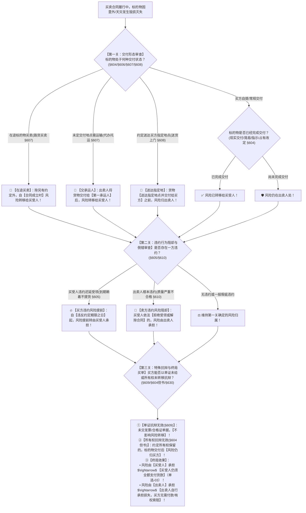

# 📐 买卖合同标的物风险负担与利益承受 · 全流程答题模型（交付主义 · 在途路货 · 违约风险倒错 · 单证/所有权分离 · 孳息归属 · §604-§610）

> **教练开场白**
> 同学们好！我是你们的民法法考教练。在买卖合同分编中，“标的物毁损、灭失的风险负担”是**每年客观题必出独立大题、主观题必涉一问的绝对王牌考点**！
> 很多同学做风险负担题目时，经常把“所有权”、“实际控制”、“运输单证”和“风险”搞混：以为所有权没转移风险就不转移，或者以为单据没给风险就不转移，或者遇到暴雨洪水雷击不知道该谁倒霉。
> 请大家死死记住民法典买卖合同的**【风险负担黄金总原则】——“风险随交付转移（交付主义），与所有权无关，与单证资料无关；守约得保护，违约背黑锅！”**
> - **① 常态交付（§604）**：谁拿到货（交付），谁承担天灾人祸风险！
> - **② 在途路货（§607）**：运在半路上的货物买卖，**合同成立那一刻，风险立刻甩给买方**！
> - **③ 买方违约迟延受领（§605/§608）**：买方赖着不提货，**自违约之日起，风险提前移转给买方**！
> - **④ 卖方根本违约（§610）**：货质量太烂导致合同目的落空，买方拒收或解除合同，**风险死死焊在卖方身上**！
> - **⑤ 孳息利益随交付（§630）**：交付前生的小羊/果子归卖方，交付后生的归买方！

---

## 适用场景与解决问题

本模型专门解决买卖合同在履行过程中因不可归责于双方当事人的事由（天灾、雷击、火灾、意外事故、第三方盗窃）导致标的物毁损灭失时，**由谁承担财产损失、买方是否仍需全额支付货款**的全部主客观题考点（对应 [[典型合同考点-深度报告]] 一·买卖合同 Row 2 · ★★★★★ 顶级必考）：重点破解：

1. **基本交付主义与特殊交付场景关（《民法典》§604/§606/§607）**：@!
   - **交付主义原则（§604）**：标的物毁损、灭失的风险，在标的物**交付之前由出卖人承担，交付之后由买受人承担**；
   - **自提未定地点交付承运人（§606/§607）**：合同未约定交付地点，标的物需要运输的，出卖人将标的物**交付给第一承运人后，风险即转移给买受人**；约定送达指定地点的，**到达指定地点交付给买受人前风险不转移（§608）**；
   - **在途标的物买卖（路货买卖 §607）**：出卖人出卖交由承运人运输在途中的标的物，除另有约定外，**自合同成立时起风险由买受人承担**。
2. **违约导致的风险倒错与转移阻却关（《民法典》§605/§610）**：
   - **买受人违约致迟延受领（§605）**：因买受人的原因致使标的物不能按照约定期限交付的，买受人应当**自违反约定期限之日起承担标的物毁损、灭失的风险**；
   - **出卖人违约致合同目的落空（§610）**：因标的物质量不符合要求，致使不能实现合同目的的，买受人可以**拒绝接受标的物或者解除合同**；买受人拒绝接受或者解除合同的，**标的物毁损、灭失的风险由出卖人承担**。
3. **单证交付与所有权保留的“风险分离”关（《民法典》§609/§604但书）**：
   - **单证资料未交不影响风险（§609）**：出卖人按照约定未交付有关标的物的单证和资料的，**不影响标的物毁损、灭失风险的转移**；
   - **所有权保留不影响风险转移（§604但书）**：约定付清款项前出卖人保留所有权的，标的物**一旦实际交付，风险依然由买受人承担**！
4. **孳息归属（《民法典》§630）**：
   - 标的物在交付之前产生的孳息，归**出卖人**所有；交付之后产生的孳息，归**买受人**所有。

> **核心一句**：**风险跟着交付走（交付前卖方，交付后买方）；在途成立即移转；买方迟延违约日起担；卖方根本违约买方拒收卖方扛；单证没给、所有权保留，通通不挡风险转；孳息随交付，交付定归属！**
>
> 🔎 **核心法源（2026最新）**：《民法典》§604、§605、§606、§607、§608、§609、§610、§630；《最高人民法院关于审理买卖合同纠纷案件适用法律若干问题的解释》（法释〔2020〕17号修正）第5条至第8条。

---

## 💡 【前置认知】买卖合同风险负担六大铁律与孳息归属极速对照表

| 场景分类 | 事实要件与法定情形 | 风险归属主体 | 法律效果（买方还要不要付钱？） | 核心法条 |
| :--- | :--- | :--- | :--- | :--- |
| **① 常规交付** | 标的物已经完成现实/观念交付 | **买受人**承担 | 标的物灭失，**买方仍须全额支付货款** | 《民法典》§604 |
| **② 在途买卖（路货）** | 货物已在运输途中，双方订立买卖合同 | **买受人**承担（**自合同成立时起**） | 货物在途遇海难灭失，**买方仍须全额付款** | 《民法典》§607 |
| **③ 未约定地点需运输** | 货交第一承运人，运往买受人所在地 | **买受人**承担（**交第一承运人时起**） | 运输途中车祸毁损，**买方承担风险仍须付款** | 《民法典》§607 / 买卖解释§5 |
| **④ 约定送达指定地点** | 出卖人负责送货至买方指定仓库 | **到达指定地点交付前出卖人承担** | 途中翻车毁损，**卖方自担损失，买方不付钱** | 《民法典》§608 |
| **⑤ 买方违约迟延受领** | 卖方已按时备好货，买方无正当理由拖延提货 | **买受人**承担（**自违约之日起**） | 仓库遇雷击失火，**买方承担风险仍须付款** | 《民法典》§605 / §608 |
| **⑥ 卖方根本违约致拒收** | 标的物严重质量瑕疵致目的落空，买方拒收/解约 | **出卖人**承担 | 货物在买方处遇暴雨泡汤，**卖方自担损失并退款** | 《民法典》§610 |
| **⑦ 单证未交 / 所有权保留** | 未给发票合格证 / 约定付清款前卖方保留所有权 | **买受人**承担（已实际交付货物） | **不影响风险转移**，买受人承担风险全额付款 | §609 / §604但书 |
| **⑧ 孳息归属（牛生小牛）** | 交付前产生的孳息归出卖人；交付后归买受人 | 交付前归**卖方**<br>交付后归**买方** | 与所有权转移与否无关，**完全随交付确定** | 《民法典》§630 |

---

## 一、 考点核心骨架与法理（三关连贯决策树）



```
【买卖风险负担全景】一句话开场：东西被雷劈了谁买单？交付定生死，在途成立移，买方赖着提前转，卖方大错买方拒收卖方扛！
│
▼ 第一关 · 交付形态与履行方式 ── 交付主义原则（§604/§607/§608）
├─ ① 在途路货买卖（§607）：────────────────────────────────────────→ 🚢 自【合同成立时起】风险转移给买方
├─ ② 未定地点代办托运（§607）：────────────────────────────────────→ 🚚 自【交付第一承运人时起】风险转移给买方
├─ ③ 约定送达指定地点（§608）：────────────────────────────────────→ 🏢 货物【送达指定地点交付买方前】由卖方承担
└─ ④ 买方自提/常规买卖（§604）：
     ├─ 已交付（现实/简易/指示/占有改定） ────────────────────────→ ✅ 交付后风险由【买受人】承担
     └─ 未交付 ────────────────────────────────────────────────────────→ 🛡️ 交付前风险由【出卖人】承担
          │
          ▼ 第二关 · 违约致风险倒错与阻却 ── 谁犯大错谁背锅（§605/§610）
          ├─ 买受人违约（迟延提货/迟延受领 §605）：───────────────────→ 🔥 自【违约之日起】风险提前由买受人承担！
          └─ 出卖人根本违约（质量不达致目的落空 §610）：
               ├─ 买受人合法【拒绝受领】或【解除合同】：──────────────→ 🚨 风险【自始由出卖人承担】！
               └─ 买受人受领且未解除合同：────────────────────────────→ 风险仍移转买方，但买方可追究瑕疵违约责任
                    │
                    ▼ 第三关 · 特殊抗辩排除与终局买单 ── 单证与所有权分离（§609/§604但书/§630）
                    ├─ 🚫 单证未交抗辩排除（§609）：卖方未给合格证/发票，【不影响风险转移】！
                    ├─ 🚫 所有权保留抗辩排除（§604但书）：虽保留所有权，交付后【风险仍归买方】！
                    ├─ ⭐ 孳息归属（§630）：交付前归出卖人，交付后归买受人（随交付转移）！
                    └─ 💰 终局买单结论：
                         ├─ 风险归【买受人】：货物灭失，买受人【仍须全额支付货款】！
                         └─ 风险归【出卖人】：货物灭失，出卖人自担损失，买受人无须付款并可索赔！

  ━━━ 三关全通 ━━━
```

---

## 二、 核心考情与 2026 民法典精要

- **频次研判**：标的物风险负担是民法典合同编分则**★★★★★ 顶级必考母题**；在客观题单选、多选中几乎年年命题，主观题买卖合同大题必设 1 问。
- **命题核心**：
  1. **交付转移主义（§604）**：风险转移的唯一核心基准是**“交付”**，与所有权转移时点（如动产登记、所有权保留）彻底分离！
  2. **在途买卖（路货买卖 §607）**：订立合同时货物已在运输途中，**合同成立那一刻风险转移给买受人**。
  3. **代办托运 vs 送货上门（§607 vs §608）**：
     - 代办托运（未定地点需运输）：**交第一承运人风险即移转**；
     - 送货上门（约定送达指定地点）：**到达指定地点交付前风险由出卖人承担**。
  4. **买受人违约迟延受领（§605）**：买方违约不提货，**自违约之日起风险提前转移**。
  5. **出卖人根本违约（§610）**：货物质量严重不符合约定导致目的落空，买受人拒绝受领或解除合同的，**风险不发生转移（由出卖人承担）**。
  6. **单证未交付不阻却风险转移（§609）**：出卖人未给合格证、发票等从单证，买受人不能以此抗辩风险未移转。

---

## 三、 三大核心法理与命题陷阱拆解

### 1. 风险负担四大场景命题暗坑对照表

| 考场典型案例案情 | 争议焦点 | 风险由谁承担？ | 核心法律依据与法理深剖 |
|---|---|---|---|
| 甲卖牛给乙，乙牵走牛，约定乙付清牛款前甲保留所有权。当夜牛被雷劈死。 | 约定了所有权保留，甲仍是所有权人，牛死了谁背锅？ | ✅ **由买方乙承担风险！**<br>乙仍须全额支付买牛款！ | 《民法典》§604但书：**所有权保留不影响风险转移**；牛已现实交付给乙，风险随交付由乙承担（单选-03）。 |
| 卖方甲将运输途中的 100 吨大豆卖给买方乙，合同于 5月1日 成立。5月2日 货轮在公海遭遇海啸沉没。 | 货物在订约前就已启运，海难在交货前发生，谁倒霉？ | ✅ **由买方乙承担风险！**<br>乙仍须全额支付货款！ | 《民法典》§607：**在途标的物买卖，自合同成立时起由买受人承担风险**（路货买卖法定例外）。 |
| 双方约定 6月1日 乙到甲仓库自提木材。甲备齐木材通知乙提货，乙拖延至 6月5日 未提。6月3日 仓库遭雷击起火木材全毁。 | 木材还在卖方仓库里尚未交付，雷击损失算谁的？ | ✅ **由买方乙承担风险！**<br>乙仍须全额支付货款！ | 《民法典》§605：**买受人违约致迟延受领的，自违约之日（6月1日）起承担风险**（买方违约风险提前）。 |
| 卖方甲交付的机器核心电机报废无法运转，买方乙当场出具拒收通知书拒绝受领。当夜突发山洪冲毁该机器。 | 机器已经运到了买方厂区门口，山洪损失谁背？ | ✅ **由卖方甲承担风险！**<br>甲自担损失，乙不付款！ | 《民法典》§610：出卖人根本违约致合同目的落空，**买受人拒绝受领的，风险由出卖人承担**（卖方违约风险不移）。 |

### 2. “单证资料未交” vs “标的物未交”的根本区别（《民法典》§609）

| 交付对象 | 是否影响风险转移？ | 法律救济手段 | 考场一秒判定 |
|---|---|---|---|
| **从给付义务（单证资料未交）**<br>（未交付发票、合格证、说明书） | ❌ **不影响风险转移！**<br>标的物本身交付的，风险已移转给买受人。 | 买受人可追究出卖人交付单证的**违约责任**，但**不能以此主张货物灭失风险由出卖人承担**！ | 选项声称“未交发票故风险不转移”**必错**！ |
| **主给付义务（标的物本身未交）**<br>（货物尚未运抵或交付承运人） | ✅ **风险尚未转移！** | 标的物灭失由出卖人自担损失。 | 货物未交付，风险在出卖人。 |

---

## 四、 万能解题三步

---

### 第一步：定交付形态关 —— 货物处于什么交付状态？（《民法典》§604/§606/§607/§608）

> **教练提示**：拿到题目先看标的物是怎么交接的：
> 1. **在途路货买卖（§607）** $\rightarrow$ 自**合同成立时起**风险由买受人承担；
> 2. **未定地点需运输（代办托运 §607）** $\rightarrow$ 卖方将货交给**第一承运人**那一刻起，风险甩给买受人；
> 3. **送货上门（约定送达指定地点 §608）** $\rightarrow$ 货物**到达指定地点交付给买方前**，风险死死留在出卖人身上；
> 4. **常规买卖（§604）** $\rightarrow$ 交付前出卖人承担，交付后买受人承担。

---

### 第二步：查违约阻却关 —— 谁犯了大错导致风险倒错？（《民法典》§605/§610）

> **教练提示**：审查双方是否存在违约行为打破常态规则：
> 1. **买方耍赖违约（§605）**：到期不去提货、无理拒收合格货物 $\rightarrow$ **自违约之日起风险提前转移给买方**；
> 2. **卖方根本违约（§610）**：交付的货物彻底报废致目的落空，买方**合法拒收或解除合同** $\rightarrow$ **风险由卖方承担**！

---

### 第三步：排除抗辩与终局买单关 —— 买方还能不能赖账？（《民法典》§609/§604但书/§630）

> **教练提示**：审查买方的抗辩理由：
> 1. 买方抗辩“**没开发票、没给说明书**” $\rightarrow$ **抗辩无效（§609）**，不影响风险转移；
> 2. 买方抗辩“**合同约定了所有权保留，货还不是我的**” $\rightarrow$ **抗辩无效（§604但书）**，交付即转风险；
> 3. **孳息归属（§630）**：交付前孳息归卖方，交付后孳息归买方；
> 4. **算账终局**：风险由买方承担的，**买方必须全额支付货款**！风险由卖方承担的，卖方自担损失，买方无需付款。

#### 💰 完整数字案例：买卖合同风险负担攻防实战

> **【案情（[[典型合同-单选-03]] 经典真题全景还原）】**
> 甲公司与乙公司订立特种钢材买卖合同，约定总价 **100 万元**。合同特别约定：“甲公司负责将钢材交由丙铁路运输公司发运至乙公司所在地车站，运费由乙公司承担；乙公司分三期支付货款，在付清全部货款之前，**甲公司保留该批钢材的所有权**”。
> 甲公司依约将该批钢材交付给丙铁路公司发运。但在铁路运输途中，因突发特大泥石流导致列车出轨，整批钢材彻底损毁灭失（不可抗力意外事故）。
> 甲公司要求乙公司支付全部 100 万元货款。乙公司抗辩称：①甲公司尚未交付有关产品质量合格证明书（单证未交）；②根据合同约定，钢材所有权仍属于甲公司；因此风险应由甲公司自行承担，乙公司拒绝付款。
>
> 1. **第一步（交付形态）**：合同约定代办铁路托运，未约定由卖方送货上门；依据《民法典》§607，甲公司将钢材交付给第一承运人（丙铁路公司）后，**标的物毁损灭失风险已转移给买受人乙公司**；
> 2. **第二步（违约审查）**：泥石流系不可抗力意外，甲公司不存在根本违约情形；
> 3. **第三步（抗辩排除与终局买单）**：
>    - 依据《民法典》§609，甲公司未交付质量合格证书**不影响风险转移**；
>    - 依据《民法典》§604但书，所有权保留条款**不影响标的物交付后风险由买受人承担**；
>    - 终局裁判：钢材灭失的风险由**乙公司承担，乙公司必须全额向甲公司支付 100 万元货款（单选-03 考点）**！

#### 一句话闭环记忆
> 🎯 **一眼判**：**风险跟着交付走（交付前卖方，交付后买方）；在途成立即移转；买方迟延违约日起担；卖方根本违约买方拒收卖方扛；单证没给、所有权保留，通通不挡风险转；孳息随交付，交付定归属！**

---

## 五、 案例演练

### 1. 所有权保留与风险负担分离（[[典型合同-单选-03]] 经典真题）
- **案情**：出卖人交付标的物并约定保留所有权，买受人在付清全款前标的物因意外雷击灭失。买受人以所有权未转移为由拒付货款。
- **模型分析**：第一步与第三步——风险随交付转移（§604）；所有权保留仅具有担保功能，不影响标的物交付后风险转移给买受人；买受人承担风险，仍须全额支付货款（选 A）。

### 2. 买受人迟延提货违约致风险提前转移（[[典型合同-单选-22]]）
- **案情**：出卖人依约备齐货物并通知买受人提货，买受人因资金周转迟延 5 天提货。期间仓库突发山火导致货物烧毁。
- **模型分析**：第二步——依据《民法典》§605，因买受人的原因致使标的物不能按照约定期限交付的，买受人自违约之日起承担风险；山火损失由买受人承担，买受人仍须付款。

### 3. 标的物孳息随交付转移（[[典型合同-单选-20]] 珍珠案）
- **案情**：买受人购买母蚌，交付之后买受人在母蚌内发现天然珍珠。出卖人主张珍珠属于天然孳息归自己所有。
- **模型分析**：第三步——依据《民法典》§630，标的物在交付之后产生的孳息归买受人所有；母蚌已完成交付，蚌内珍珠及孳息归买受人所有。

---

## 关联真题

- [[典型合同-单选-03]] · 标的物交付后所有权保留不影响风险转移
- [[典型合同-单选-22]] · 买受人违约迟延受领致风险提前自违约之日转移
- [[典型合同-多选-20]] · 在途路货买卖合同成立转移风险规则
- [[典型合同-单选-20]] · 标的物孳息随交付确定所有权归属

## 相关页面

- 概念实体页：[[买卖合同]] · [[风险负担]]
- 姊妹模型：[[民法-合同-特种买卖与检验期模型]]（特种买卖与所有权保留75%） · [[民法-合同-一物多卖模型]]（多重买卖履行顺序） · [[民法-合同-违约责任模型]]（违约救济总调度）
- 综合报告：[[典型合同考点-深度报告]]（一、买卖合同 · Row 2 · ★★★★★ 顶级必考）
