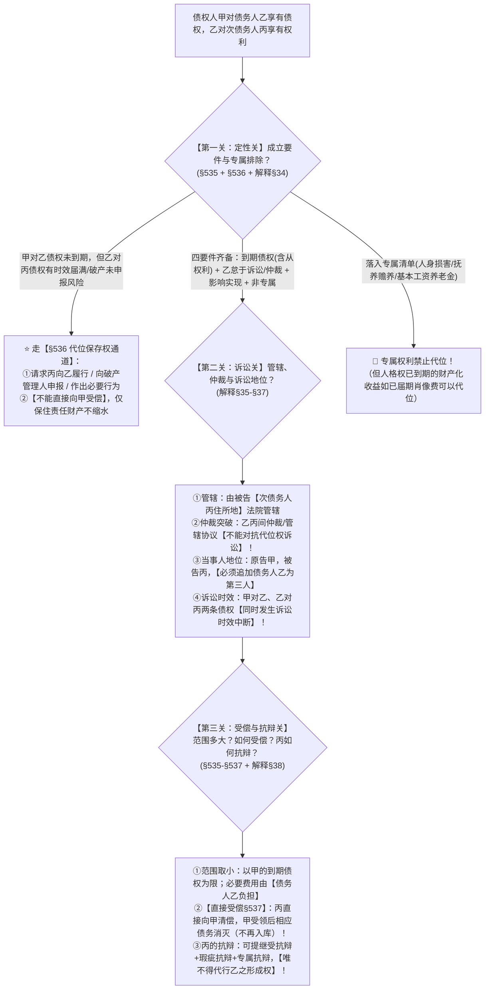

# 📐 债权人代位权 · 全流程答题模型（四要件 · 代位保存权§536 · 直接受偿§537 · 专属排除§34 · 突破仲裁§36）

> **教练开场白**
> 同学们好！我是你们的民法法考教练。在合同保全板块，很多同学一碰到“债务人没钱还，但他外面还有债权”的题目，思路就开始发懵：债权人能不能直接跳过债务人去告老赖的欠债人？合同里明明写了仲裁条款还能去法院告吗？官司赢了钱是直接给债权人还是先交公入库？
> 《民法典》第 535–537 条与 2023 年《合同编通则司法解释》第 34–41 条，已经彻底理顺了**“直接受偿、突破仲裁、代位保存、专属排除”**的全套裁判规则。今天我们用**“三关连贯流水线”**，把代位权的成立、诉讼与受偿一次性锁死：**第一关成立要件与专属排除 → 第二关程序与突破仲裁 → 第三关范围直接受偿与抗辩**。

---

## 适用场景与解决问题

本模型专门解决债权人保全制度中“代位权”的全部主客观题考点（对应 [[合同总则考点-深度报告]] 四·保全 row 1 · ★★★★★ 顶级必考）：重点破解：

1. **定性与排除关**：代位权成立四要件（到期+怠行+影响+非专属）；《通则解释》§34 专属债权排除清单（人身损害/赡养抚养/劳动报酬/基本生活保障） vs **已到期的人格权财产化收益（可代位）**；**§536 代位保存权（未到期例外，时效届满/破产申报）**。
2. **诉讼与管辖关**：管辖法院（被告次债务人住所地）；**《通则解释》§36 突破仲裁协议与管辖协议**；诉讼地位（**必须追加债务人为第三人**，不得列为共同被告）；**双重诉讼时效中断（非中止）**。
3. **范围受偿与抗辩关**：代位范围“取小原则”；必要费用由**债务人负担**；**《民法典》§537 直接受偿规则（告别入库）**；次债务人三类抗辩（继受抗辩、瑕疵抗辩、针对代位要件抗辩，唯不得代行形成权）。

> **核心一句**：**代位权告次债务人，四要件齐备直接上；专属清单保活命，已变现的人格收益照样代；未到期走§536保存权；仲裁管辖挡不住，赢了官司直接受偿不用入库；时效中断是双重，债务人追加为第三人！**
>
> 🔎 **核心法源（2026最新）**：《民法典》§535、§536、§537、§188、§195；**《最高人民法院关于适用〈中华人民共和国民法典〉合同编通则若干问题的解释》（法释〔2023〕13号）第34条（专属清单）、第35条（管辖）、第36条（仲裁协议不影响）、第37条（第三人地位）、第38条（抗辩规则）、第39条（费用）**。

---

## 一、 核心考情

- **频次研判**：代位权是民法保全板块**命中全部 5 类权威源族（最高法案例+司法解释+法院培训PDF+法大清单+机构高频）的顶级必考考点**。每年客观题必考 1–2 题，主观题常与民事诉讼第三人、执行异议深度交织。
- **命题核心**：
  1. **要件与专属排除（§535 + 解释§34）**：怠于行使特指“未通过诉讼或仲裁”，私下催讨依然构成怠于行使；人身损害等专属不可代位，但到期肖像许可费可代位。
  2. **代位保存权（§536）**：债权人自己的债权**未到期**也能行使（时效即将届满或申报破产债权）。
  3. **诉讼管辖与突破仲裁（解释§35/§36）**：次债务人以与债务人存在仲裁协议为由提管辖异议，法院一律不予支持。
  4. **直接受偿（§537）**：次债务人直接向代位债权人履行，超出部分还给债务人，不再“入库”分配。

---

## 二、 三关连贯走 · 决策树（Mermaid 全景图 + 结构树）



```
【代位权保全纠纷】一句话开场：债务人躺平不催债，债权人能不能替他要？怎么告？钱给谁？
│
▼ 第一关 · 定性关 ── 成立要件与专属排除
├─ 债权人债权【未到期】但乙对丙债权有时效届满/破产申报紧急风险 ──→ 走 §536 代位保存权（请求向乙履行/申报，不能直接受偿）
├─ 债权落入【专属排除清单】（抚养赡养/人身损害/基本工资/养老保障）──→ 🚨 绝对禁止代位！（但已届期肖像费等财产化收益可代位）
└─ 四要件齐备（甲到期 + 乙对丙到期含从权利 + 乙怠于诉讼仲裁 + 影响实现 + 非专属）──→ 代位权成立，进入第二关
     │
     ▼ 第二关 · 诉讼关 ── 管辖、仲裁与当事人地位
     ├─ 管辖法院：被告【次债务人住所地】法院管辖（专属管辖除外）
     ├─ 仲裁协议不影响：乙丙之间的仲裁协议/管辖协议【不能对抗代位权诉讼】（首次开庭前申请仲裁的可裁定中止）
     ├─ 当事人列置：原告＝债权人，被告＝次债务人，【债务人必须被追加为第三人】（不得列为共同被告）
     └─ 时效影响：代位权诉讼引起【双重诉讼时效中断】（甲对乙、乙对丙同时中断，非中止）
          │
          ▼ 第三关 · 受偿与抗辩关 ── 范围取小、直接受偿与抗辩限制
          ├─ 代位范围：以【债权人的到期债权为限（取小）】；必要费用由【债务人负担】
          ├─ 受偿方式：【直接受偿（§537）】──→ 次债务人直接向债权人清偿，告别"入库分配"，相应债务归于消灭
          └─ 次债务人抗辩：可提对乙的抗辩（已清偿/抵销）+ 质疑甲乙债权的瑕疵抗辩 + 专属抗辩；【唯不得代行债务人的形成权】

  ━━━ 三关全过 ━━━
```

---

## 三、 三大核心法理与命题陷阱拆解

### 1. 代位权成立四要件与专属排除清单（《民法典》§535 + 《通则解释》§34）

| 要件 / 维度          | 法律规则与司法认定                                                                                    | 考场一眼判                            |
| ---------------- | -------------------------------------------------------------------------------------------- | -------------------------------- |
| **到期债权（含从权利）**   | 债权人对债务人、债务人对次债务人的债权均已届清偿期；**代位对象包含与债权有关的从权利（如抵押权、保证债权）**。                                    | 告本金的同时，能顺便把**抵押权**一并代位行使！        |
| **怠于行使**         | 债务人**不以诉讼方式或者仲裁方式**向次债务人主张权利。                                                                | 私下打电话、发微信、上门要钱**通通不算行使**，仍属怠于行使！ |
| **专属排除清单（§34）**  | 1. 身份关系（赡养/抚养/扶养/继承）；<br>2. 人身损害赔偿（含精神抚慰金）；<br>3. 劳动报酬（维持生活必需部分）；<br>4. 基本生活保障（养老金/失业金/低保金）。 | 救命钱、抚慰金**绝对不可代位**！               |
| **已到期的人格权财产化收益** | 人格权商业化利用产生的、**已经到期的确定金钱债权（如已届期的肖像许可费、稿酬）**。                                                  | 已经变现到期的钱，**可以代位**！               |

### 2. 代位保存权 vs 突破仲裁协议与管辖（《民法典》§536 + 《通则解释》§35/§36）

| 规则维度 | 法律真实（依据与法理） | 做题陷阱 |
|---|---|---|
| **代位保存权（§536）** | 债权人债权**未到期**，但债务人债权存在**诉讼时效即将届满或未申报破产债权**等紧急情形，债权人可代位请求向债务人履行或申报。 | ❌ 误以为债权未到期绝对不能采取任何保全措施。注意：保存权**不能直接向自己受偿**！ |
| **突破仲裁协议（§36）** | 债务人与次债务人之间的仲裁协议、管辖协议，**不能对抗代位权诉讼**！次债务人提仲裁管辖异议的，法院不予支持。 | ❌ 误以为有仲裁协议法院就必须驳回代位权起诉（仅首次开庭前申请仲裁可裁定中止）。 |
| **管辖法院（§35）** | 由**被告（次债务人）住所地人民法院管辖**。 | ❌ 误以为由原告（债权人）或债务人住所地管辖。 |

### 3. 直接受偿规则与次债务人三类抗辩（《民法典》§537 + 《通则解释》§37/§38）

| 规则维度 | 法律真实（依据与法理） | 核心命题眼 |
|---|---|---|
| **直接受偿（§537）** | 代位权成立的，由次债务人**直接向债权人清偿**；债权人受领后，三方相应债权债务在清偿范围内终止。 | 彻底告别旧法“先入库再分配”！超额部分次债务人仍还给债务人。 |
| **范围与费用** | 行使范围以债权人到期债权为限（**取小**）；行使代位权的必要费用由**债务人负担**（§535Ⅲ）。 | 费用找债务人报销，不是次债务人承担。 |
| **三类合法抗辩** | ①对债务人的继受抗辩（已清偿、抵销、时效届满、先履行抗辩）；<br>②质疑代位权要件的瑕疵抗辩（甲乙债权不存在或未到期）；<br>③针对代位权成立本身的抗辩（专属债权、未怠于行使）。 | 次债务人可提这三类抗辩保护自己。 |
| **禁止代行形成权** | 次债务人**不得代债务人行使其积极形成权**（如代债务人主张抵销、代债务人行使合同解除权）。 | 形成权专属于债务人意志，次债务人不得越俎代庖！ |
| **诉讼时效双重中断** | 提起代位权诉讼，**债权人对债务人、债务人对次债务人的债权诉讼时效同时发生中断**！ | ❌ 误写为时效“中止”（中断是归零重算，中止是暂停暂停）。 |

---

## 四、 万能解题三步

---

### 第一步：定性关 —— 四要件齐备吗？落入专属清单了吗？（《民法典》§535 + 《通则解释》§34）

> **教练提示**：拿到题目先抓三个人物：**债权人甲（原告） $\rightarrow$ 债务人乙（第三人） $\rightarrow$ 次债务人丙（被告）**。代位权不是“只要债务人欠钱不还就能替他要”，必须像过安检一样逐一核对**四大法定要件**！四要件缺一不可。如果甲的债权未到期，立即排查是否构成 §536 代位保存权；若均到期，重点核查乙对丙的债权是否属于“专属排除清单”。

---

#### 1. 【核心要件】代位权成立四大法定要件（四把锁缺一不可！）

| 法定要件（《民法典》§535）     | 司法审查标准与深度拆解                                                             | 常见命题陷阱                                             |
| :------------------ | :---------------------------------------------------------------------- | :------------------------------------------------- |
| **要件 ①：到期债权（含从权利）** | 债权人对债务人的债权、债务人对次债务人的债权**均须到期且合法有效**；代位对象**包含与该债权有关的从权利（如抵押权、质权、保证债权）**。 | ❌ 误以为抵押权不能代位（主从权利一并代位！）。                           |
| **要件 ②：债务人怠于行使**    | 债务人**不以诉讼方式或者仲裁方式**向次债务人主张其享有的到期债权或从权利。                                 | ❌ 误以为债务人私下打电话、发微信、寄催款函算行使（**私下催讨一律仍属“怠于行使”**！）。    |
| **要件 ③：影响债权实现**     | 债务人怠于行使的行为，导致债务人**自身财产不足以清偿债权人到期债务**（具有因果关系与保全必要性）。                     | ❌ 债务人自身银行账户有几个亿却不去要外债的，债权人无代位权（直接申请执行债务人即可，无保全必要）。 |
| **要件 ④：权利非专属自身**    | 该债权或者从权利**不属于专属于债务人自身的权利**（未落入《通则解释》§34 排除清单）。                          | ❌ 误以为人身损害赔偿、抚养费等可以代位（专属绝对不可代位，但已到期变现的肖像许可费除外）。     |
- **人身权:** 
	- 只能债务人本人拿、本人行使；保护他的人身权益、基本生存，债权人不能代位去抢这份钱。不是人格权，是带人身属性的金钱请求权。
		-  赡养费、抚养费、扶养费请求权（身份关系）
		- 人身损害赔偿请求权（含精神损害赔偿）
		- **劳动报酬（工资）**：仅维持生活那部分专属；超出生活必需的超额工资，可以代位。
		- 生存保障类：养老金、失业保险金、低保

---

#### 2. 先懂几个词
- **怠于行使**＝没有打官司也没有去仲裁（私下发微信、上门催讨一万次在法律上也叫“怠于行使”）；
- **从权利一并代位**＝代位要 100 万借款的同时，这笔借款带的房屋抵押权顺理成章一并代位行使；
- **专属债权**＝用来活命和抚慰人身创伤的钱（赡养费、抚养费、人身损害赔偿、最低生活保障金）；
- **已到期财产化收益**＝脸虽然是专属的，但肖像许可费已经到期变现成了确定的钱，可以代位。

---

#### 3. 🔍 对号入座表：代位标的与专属排除一次分清

| 债权标的类型 | 是否可代位 | 法律依据与法理判定 |
|---|---|---|
| 乙对丙享有的**普通买卖货款、工程款、借款（含房屋抵押权）** | ✅ **可以代位** | 属于普通经营性财产债权，从权利一并代位（《民法典》§535） |
| 乙对丙享有的**人身伤害赔偿金、精神损害抚慰金** | ❌ **不可代位** | 属于人身损害赔偿，专属于债务人自身（《通则解释》§34） |
| 乙对子女享有的**赡养费、抚养费** | ❌ **不可代位** | 属于身份关系请求权，专属于债务人自身（《通则解释》§34） |
| 乙对单位享有的**基本工资、最低生活保障金、失业保险金** | ❌ **不可代位** | 属于维持基本生存保障权利（《通则解释》§34） |
| 乙许可丙使用肖像产生的、**已经到期的肖像许可费** | ✅ **可以代位** | 已经从人格利益转化为**确定已届期的金钱债权**，不再专属（多选-08） |

---

#### 4. 💰 完整数字案例：四要件全景实战涵摄

> **案情**：老王（甲）借给老李（乙）10 万元到期未还。老李名下无存款无房产，但老张（丙）欠老李 20 万元工程款（已到期，并以老张的商铺设立了抵押权）。老李仅每周给老张发微信催促“老张快还钱”，从未起诉或仲裁。老王起诉老张行使代位权及抵押权。
>
> 1. **要件①（到期债权含从权利）**：老王对老李、老李对老张的债权均已到期，且附带商铺抵押权 ──→ 满足；
> 2. **要件②（怠于行使）**：老李仅发微信，未提起诉讼或申请仲裁 ──→ 属于法定“怠于行使”；
> 3. **要件③（影响实现）**：老李无其他财产可供还款，老李不收回 20 万导致老王的 10 万无法受偿 ──→ 满足；
> 4. **要件④（非专属）**：工程款系普通商事财产债权，非专属 ──→ 满足！
> 5. **结论**：老王代位权成立，有权代位行使 10 万元工程款债权及商铺抵押权！

---

#### 5. 一句话闭环记忆
> 🎯 **一眼判**：**到期债权带从权利 + 没打官司没仲裁（怠行） + 导致没钱还（影响） + 扣除人身赡养基本工资（非专属）＝ 代位权成立！**


---

### 第二步：诉讼关 —— 管辖在哪里？仲裁条款挡得住吗？

> **教练提示**：命题人最喜欢在次债务人丙身上做文章——丙拿出他和乙签的《合同》，指着“发生纠纷由北京仲裁委员会仲裁”或“由原告住所地法院管辖”提出管辖异议。记住：**这是全真题最高频的送分题，仲裁管辖一律挡不住代位权诉讼！**

- **先懂几个词**：
  - **突破仲裁协议**＝乙和丙签的仲裁条款只管他们两个人，管不到法律直接赋权的原告甲；
  - **被告住所地管辖**＝代位权诉讼必须去被告（次债务人丙）的家门口法院打官司；
  - **追加第三人**＝原告是甲，被告是丙，法官必须把夹在中间的债务人乙拉进来当**无独立请求权第三人**（绝不能列为共同被告）。

#### 💰 完整数字案例：仲裁条款与管辖攻防

> **案情**：甲公司（位于北京）对乙公司（位于上海）享有 100 万元到期债权。乙公司对丙公司（位于广州）享有 150 万元到期货款。乙丙合同约定：“因本合同引起的一切争议，由广州仲裁委员会仲裁解决。”乙公司怠于催讨，甲公司遂向广州市天河区人民法院（丙住所地法院）提起代位权诉讼。丙公司以乙丙之间订有排他性仲裁协议为由，向法院提出管辖权异议，请求裁定驳回起诉。
>
> 1. **管辖法院判定**：代位权诉讼由被告丙公司住所地法院（广州天河区法院）管辖，管辖法院正确。
> 2. **仲裁异议判定**：依据《通则解释》第 36 条，乙丙之间的仲裁协议具有相对性，不能对抗行使法定代位权的甲公司，法院对丙公司的管辖异议**裁定不予支持**！
> 3. **中止审理条件**：除非乙公司或丙公司在代位权诉讼**首次开庭前**，真的就该 150 万元合同纠纷向广州仲裁委**申请了仲裁**，法院才可以裁定**中止（非驳回）**代位权诉讼。

---

### 第三步：受偿与抗辩关 —— 钱怎么给？次债务人怎么抗辩？

> **教练提示**：算出两个债权数额后，代位范围永远**“取小”**；判决胜诉后，次债务人**直接打钱给债权人（直接受偿）**，再也不用先给债务人“入库”！同时，次债务人丙不能帮债务人乙行使形成权。 @!

- **先懂几个词**：
  - **直接受偿**＝丙直接把钱付给甲，甲拿了钱，甲乙、乙丙对应数额的债务同时勾销；
  - **范围取小**＝甲借给乙 100 万，丙欠乙 200 万，甲只能代位要 100 万（不能顺手帮乙要 200 万）；
  - **双重时效中断**＝甲去法院告丙这一天，甲对乙的 100 万时效、乙对丙的 200 万时效，**两条时间线同时清零重新起算（中断）**。

#### 🔍 对号入座表：次债务人的抗辩权边界 @!

| 抗辩类型                | 具体抗辩事由                                                            | 法律效力与裁判认定                              |
| ------------------- | ----------------------------------------------------------------- | -------------------------------------- |
| **继受抗辩（对债务人的抗辩）**   | 丙主张：“我已经还了乙 30 万元” / “乙交的货有严重缺陷，我行使同时履行抗辩权” / “乙对我的债权已过 3 年诉讼时效”。 | ✅ **合法有效**，丙可以向债权人甲主张，相应减少或免除代位给付责任。   |
| **瑕疵抗辩（质疑代位权要件）**   | 丙主张：“甲对乙的 100 万元借款根本没有到期” / “甲乙之间的借款合同是虚假通谋无效的”。                  | ✅ **合法有效**，丙有权质疑代位权成立前提，查实后代位权诉讼不成立。   |
| **代行形成权（越权替债务人决策）** | 丙主张：“乙还欠我另外一笔加工费，我要替乙把这笔债权进行抵销” / “乙有权解除与我的合同，我替乙主张解除”。           | ❌ **绝对禁止**！抵销权、解除权属于债务人乙的意志自由，丙无权代为行使。 |

#### 一句话闭环记忆
> 🎯 **一眼判**：**代位范围以债权人债权为限（取小）；丙直接把钱给甲（直接受偿§537）；丙能提自己的抗辩和要件抗辩，唯独不能替乙行使形成权；时效双重中断（非中止）。** 

---

## 五、 案例演练

### 1. 专属债权与财产化收益的精准界分（[[合同通则-多选-08]] / [[合同通则-单选-17]]）
- **案情**：乙欠甲 50 万，乙对他人享有四笔款项：①儿子的赡养费 10 万；②车祸人身损害赔偿 20 万；③单位欠付工资 5 万；④许可丙使用肖像且**已届期的肖像许可费 15 万**。问甲对哪些无权代位。
- **模型分析**：第一步——赡养费（身份）、人身损害（人身）、基本工资（生活保障）属于《通则解释》§34 专属清单，甲无权代位（选 ABC）；肖像许可费已届期，已转化为确定财产债权，甲**有权代位**（D 不选）。

### 2. 仲裁条款不影响代位权诉讼与瑕疵抗辩（[[合同通则-单选-52]]）
- **案情**：乙丙合同约定仲裁条款，后丙未经乙同意擅自将债务转让给戊（债务承担未生效）。丁对戊提起代位权诉讼。
- **模型分析**：第二步与第三步——乙丙间仲裁条款不能对抗代位权人丁（D 不成立）；丙转让债务未经债权人乙同意对乙不生效，戊非适格次债务人，戊提出“次债务人不适格”的瑕疵抗辩成立（**选 B**）。

### 3. 行使范围取小与诉讼时效双重中断（[[合同通则-单选-51]] / [[合同通则-单选-60]]）
- **案情**：甲对乙享有 300 万元到期债权，乙对丙享有 500 万元到期债权。甲向法院提起代位权诉讼。
- **模型分析**：第三步——代位权行使范围以甲的到期债权为限，即 **300 万元**（取小，C 对）；甲提起代位权诉讼，甲对乙、乙对丙的诉讼时效**均发生中断（双重中断，非中止）**（排除 A、B，选 C）。

### 4. 债务人诉讼地位与直接受偿（[[合同通则-多选-28]] / [[合同通则-单选-50]]）
- **案情**：甲代位起诉丙，丙要求追加乙为共同被告，并主张判决自己向乙清偿。
- **模型分析**：第二步与第三步——债务人乙应当被追加为**无独立请求权第三人**，丙无权要求追加乙为共同被告（D 错）；代位权成立后，由丙**直接向原告甲清偿**（§537 直接受偿），三方权利义务在清偿范围内终止（选 ABC）。

---

## 关联真题

- [[合同通则-单选-17]] · 专属债权之消极排除范围
- [[合同通则-单选-18]] · 代位对象含从权利与怠于行使及直接受偿
- [[合同通则-单选-52]] · 代位权诉讼中相对人抗辩与仲裁条款相对性
- [[合同通则-多选-08]] · 专属权利 vs 已到期人格权财产化收益
- [[合同通则-多选-09]] · 相对人三类抗辩与直接受偿及费用负担
- [[合同通则-单选-50]] · 代位权成立要件综合适用与直接受偿
- [[合同通则-单选-51]] · 代位权行使范围取小与诉讼时效中断
- [[合同通则-多选-28]] · 相对人三类抗辩与债务人第三人地位
- [[合同通则-单选-60 · 债权人代位权诉讼之双重时效中断与行使限度案]] · 诉讼时效双重中断与行使限度

## 相关页面

- 概念实体页：[[代位权]] · [[保全]] · [[诉讼时效中断]]
- 姊妹模型：[[民法-合同-撤销权模型]]（保全双子星之二） · [[民法-合同-涉他合同与代为履行模型]]
- 综合报告：[[合同总则考点-深度报告]]（四、保全 · 第 1 考点 / 顶级必考第 10 项 · ★★★★★ 顶级必考）
