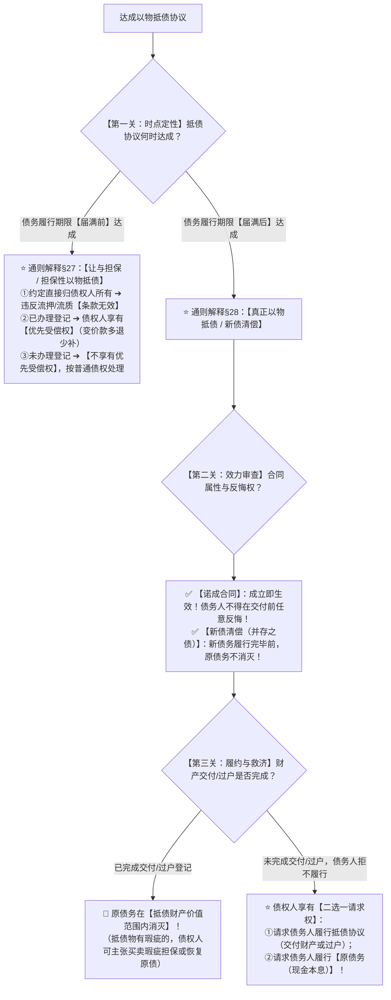

# 📐 以物抵债（代物清偿） · 答题模型

> **教练开场白**
> 同学们好！我是你们的民法法考教练。一看到“欠钱拿房子、拿字画抵债”的题干，很多同学要么凭生活常识以为“只要签了抵债协议，欠条就算作废了”，要么受以前老司考旧题干扰以为“只要东西还没交，债务人就能随时反悔不认”。这恰恰踩中了 2024–2026 最新法考最致命的**“新旧法演变陷阱”**！
> 2023 年《合同编通则司法解释》第 27 条和第 28 条出台后，彻底终结了数十年的争论，确立了**“期前担保（让与担保） vs 期后新债（诺成清偿）”**的双轨裁判铁律。今天我们用一套**“三关连贯流水线”**，把以物抵债的时点定性、合同效力、消灭时点与违约救济一次性彻底打通：**第一关时点定性 → 第二关效力审查 → 第三关履约与救济**。

---

## 适用场景与解决问题

本模型专门解决合同履行与消灭板块中“以物抵债 / 代物清偿”的所有客观题与主观题争议（对应 [[合同总则考点-深度报告]] 三·履行 row 9 · ★★★★★ 顶级必考新增）：重点破解：

1. **时点定性关**：区分**履行期届满前达成**（《通则解释》§27 让与担保） vs **履行期届满后达成**（《通则解释》§28 真正代物清偿/新债清偿）。
2. **效力审查关**：期前协议约定“到期不还钱财产直接归债权人所有”属于**流押/流质条款（条款无效但担保有效）**；期后协议确立为**诺成合同**（成立即生效，**交付前债务人不得任意反悔**，旧法实践性观点彻底废止！）。
3. **履约与救济关**：原债务何时消灭（**实际交付/过户完成时原债才消灭**，新旧债并存）；债务人违约不给物时，**债权人享有“要物 vs 要钱”二选一请求权**；抵债物有瑕疵时参照买卖主张瑕疵担保或**恢复履行原债务**。

> **核心一句**：**期前抵债是担保（直接归你算流押，办了登记优先受）；期后抵债是新债（协议签了即生效，交完东西老债消；债务人不给物，债权人二选一）。**
>
> 🔎 **法条已联网核实（2026最新）**：《民法典》§401（流押）、§428（流质）、§557（债务消灭）；**《合同编通则司法解释》（法释〔2023〕13号）第27条、第28条**。
> ⚠️ **考频免责声明**：司法部自 2018 年法考改革起不公开官方频次统计，本考点系 2023 底司法解释重点增量，2024–2026 法考大纲重点考察新增板块，列为 ★★★★★ 顶级必考。
>
> **适用真题**：[[C1-多选-42 · 古画抵债之以物抵债的性质|多选-42 · 古画抵债案（新法答案已变）]] · [[C1-单选-71 · 质物折价抵债与原债消灭|单选-71 · 质物折价消灭时点案]] · [[民诉-执行-单选-264 · 以物抵债和解标的有瑕疵无法履行应恢复执行|单选-264 · 抵债物瑕疵恢复原债执行案]]。

---

## 一、 核心考情

- **频次研判**：以物抵债是《合同编通则司法解释》最引人注目的**九大创新制度之一**。在《通则解释》施行后，它既是客观题用于考查“诺成性与新债清偿”的高频常客，更是主观题破产、执行、担保交叉大题的必经考点。
- **命题核心**：
  1. **定性关（期前 vs 期后）**：届满前约定抵债一律按让与担保处理，流押条款无效；届满后约定抵债按新债清偿处理。
  2. **效力关（诺成合同 vs 任意反悔）**：打破“交付前可任意反悔”的旧规则，确立为诺成合同，成立即生效。
  3. **消灭时点关（签订合同 $\neq$ 原债消灭）**：财产完成物权变动前，原债务不消灭，新旧两债并存；债务人拒不交物，债权人享有二选一请求权。

---

## 二、 三关连贯走 · 决策树（Mermaid 全景图 + 结构树）



```
【以物抵债纠纷】一句话开场：欠债拿东西抵，什么时候签的？签了算不算数？东西没给老债消没消？
│
▼ 第一关 · 时点定性 ── 是期前担保还是期后抵债？
├─ 债务履行期限【届满前】达成 ──→ 通则解释§27：让与担保通道
│    ├─ 约定"到期不还物直接归债权人所有" ──→ 触犯流押/流质规则，【直接归所有条款无效】
│    ├─ 已办理不动产/动产物权转移登记 ─────→ 债权人享有【优先受偿权】（变价款多退少补）
│    └─ 未办理物权登记 ──────────────────→ 【不享有优先受偿权】，按普通借款债权处理
│
└─ 债务履行期限【届满后】达成 ──→ 通则解释§28：真正代物清偿 / 新债清偿通道，进入第二关
     │
     ▼ 第二关 · 效力审查 ── 能任意反悔吗？协议生效了吗？
     ├─ 合同属性：【诺成合同】──→ 意思表示一致即生效！
     ├─ 债务人反悔权：【无权任意反悔】──→ 债务人不得在交付前单方反悔要求恢复付现金！
     └─ 债的构造：【新债清偿（并存之债）】──→ 新债务履行完毕前，原债权债务关系不消灭，进入第三关
          │
          ▼ 第三关 · 履约与救济 ── 原债务何时消灭？违约怎么收场？
          ├─ 顺利交付动产 / 办理不动产过户登记完成 ──→ 原债务在【抵债财产价值范围内消灭】！
          ├─ 债务人违约拒绝交付财产或过户 ──────────→ 债权人享有【二选一请求权】：
          │    ├─ 选择①：起诉请求债务人履行抵债协议（交付财产或过户）
          │    └─ 选择②：起诉请求债务人履行【原债务（付现金本息）】
          └─ 抵债财产存在权利/质量重大瑕疵 ──────────→ 债权人可主张【买卖瑕疵担保责任】或【解除抵债协议恢复原债】！

  ━━━ 三关全过 ━━━
```


---

## 三、 三大核心法理与命题陷阱拆解

### 1. 履行期届满前以物抵债：让与担保与防流押（《通则解释》§27）

| 审查维度 | 法律规则与司法认定 | 考场一眼判 |
|---|---|---|
| **制度本质** | 履行期届满前约定以物抵债，其实质是为原债权提供担保（**让与担保**）。 | 借钱当时就签抵债协议＝**担保**，不是买卖！ |
| **流押禁止** | 约定“债务人到期不还钱，该财产直接归债权人所有”，**该约定无效**（《民法典》§401/§428）。 | “还不上房子归你”＝**流押无效**！但担保协议本身有效。 |
| **物权登记与清算** | ①**已过户登记**：债权人享有**优先受偿权**，对财产折价或拍卖变卖款优先受偿，**多退少补**；<br>②**未登记**：不享有优先受偿权。 | 办了过户＝有抵押优先权；没过户＝普通债权；**绝不能直接吞并房屋差额**！ |

### 2. 履行期届满后以物抵债：诺成合同与新旧法重大演变（《通则解释》§28）

| 维度 | 旧法观点（已作废 ❌） | 2026 最新司法解释规则（✅） |
|---|---|---|
| **合同性质** | **实践合同（要物合同）**（交付物后合同才成立生效）。 | **诺成合同**（双方达成合意即成立生效）。 |
| **债务人反悔权** | 交付前债务人享有**任意反悔权**，可随时改回付现金。 | **不得任意反悔**！债务人受协议约束，须按约交付抵债物。 |
| **真题标志性演变** | 2016年卷三第56题（古画抵债案）当年官方答案选 **CD**。 | 2026 新法下 C 项由对变错，**唯二无争议正确项为 D**！ |

### 3. 原债务消灭时点与债权人二选一请求权（《通则解释》§28）

| 状态与场景 | 法律后果与救济路径 | 做题陷阱 |
|---|---|---|
| **抵债协议成立时** | 属于**新债清偿**，新旧债并存，**原借款债务不消灭**！ | ❌ 误以为签了抵债协议欠条就失效作废。 |
| **财产交付/过户完成时** | **原债务在抵债财产价值范围内正式归于消灭**！ | 只有动产交付或不动产过户办完，老债才消灭。 |
| **债务人拒绝给付抵债物** | 债权人享有**二选一请求权**：<br>①请求履行抵债协议（交物）；<br>②请求履行原债务（还钱）。 | ❌ 误以为债权人只能要物、或者只能要钱（法律赋予债权人自由选择权）。 |
| **抵债物存在重大瑕疵** | 债权人可参照买卖合同主张瑕疵担保，亦可**解除抵债协议恢复履行原债务**。 | 抵债物被查封或为赝品，债权人有权掀桌子恢复原债！ |

---

## 四、 万能解题三步

> 拿到一道“欠钱拿车、拿房、拿字画抵债”的题目，按以下三步逐层拆解，秒杀一切选项。

---

### 第一步：时点定性 —— 是期前担保还是期后抵债？

> **教练提示**：看到以物抵债，绝不能直接看最后东西给没给，**第一秒必须看签约日期的“时态”**——是“还钱日期还没到”就签了，还是“到期还不上了”才签的。时态一错，引用的法条直接南辕北辙！

- **先懂几个词**：
  - **期前抵债**＝借钱的时候或还款日前签的（“万一以后还不上，这车抵给你”），本质是**担保（让与担保）**；
  - **期后抵债**＝还款日已经过了，债务人真还不上了才签的（“我现在实在没钱，这幅画给你抵债吧”），本质是**代物清偿（新债清偿）**。

#### 概述
- **《通则解释》§27（期前）**：债务履行期限届满前达成以物抵债协议，按让与担保处理，禁止流押流质，需经折价或变价清算，多退少补；
- **《通则解释》§28（期后）**：债务履行期限届满后达成以物抵债协议，构成真正以物抵债，属于新债清偿。

#### 大白话讲解

##### 🔍 对号入座表：期前担保 vs 期后抵债一次分清

| 题干线索描述 | 时点归属 | 适用法条与定性 |
|---|---|---|
| “甲向乙借款100万，借期1年。**签订借款合同时**，甲将房产过户给乙抵债……” | **履行期届满前** | 走 **《通则解释》§27 让与担保通道**（防流押，需清算） |
| “甲欠乙100万，**借期届满后甲无力偿还**，双方商定以甲的一幅名画抵债……” | **履行期届满后** | 走 **《通则解释》§28 新债清偿通道**（诺成生效，交物消债） |

---

### 第二步：效力审查 —— 能任意反悔吗？流押条款有效吗？

> **教练提示**：命题人最爱考“债务人在交东西前能不能反悔”。老考生经常用十年前的法理答题，误以为“以物抵债是实践合同，交画之前我反悔说不给了、改给现金，法律得支持我”。**2026 年新法大纲下，这是绝对的送命坑！**

- **先懂几个词**：
  - **诺成合同**＝双方签字画押那一秒，合同就正式生效（不用等交东西）；
  - **不得任意反悔**＝债务人既然答应了给古画抵债，就受到合同约束，不能单方说“我不给画了”；
  - **流押条款无效**＝期前约定“还不上钱房子归你”，这句话虽然无效，但不影响用这套房子拍卖优先受偿的权利。

#### 概述
- 履行期届满后达成的以物抵债协议是**诺成合同**，成立即生效；
- 债务人无任意反悔权；
- 债的性质推定为**新债清偿（并存之债）**，新债务履行完毕前，原债权债务关系不消灭。

#### 大白话讲解

##### 💰 完整数字案例：古画抵债的反悔攻防

> **案情**：王某欠丁某 100 万元借款逾期无力偿还。8月1日王某与丁某签订《抵债协议》，约定王某于次日将自己收藏的一幅古画（市价100万）交付丁某抵偿该笔债务。8月2日交付前，古画突然被知名专家鉴定为传世国宝，市价飙升至 300 万元。王某随即通知丁某：“抵债协议我不认了，我还是还你 100 万元现金本息，画不给你了。”
>
> 1. **协议性质**：8月1日达成的抵债协议为**诺成合同**，双方签字即生效。
> 2. **反悔效力判定**：王某无权单方反悔。王某提出“改付现金拒交古画”，属于违约行为。
> 3. **丁某的权利**：丁某有权拒绝王某的现金，起诉请求法院强制王某履行抵债协议、交付古画！

#### 一句话闭环记忆
> 🎯 **一眼判**：**抵债协议签了就生效（诺成），债务人交付前无权反悔；期前抵债约定直接归你算流押无效，但担保依然有效。**

---

### 第三步：判定后果 —— 原债何时消灭？违约怎么救济？

> **教练提示**：很多题目会问“签完抵债协议后，借款债务消灭了吗？”记住：**签协议 $\neq$ 还完钱！只有东西真正过户、交付到了债权人手里，老债务才在抵债价值范围内宣告消灭！**

- **先懂几个词**：
  - **并存之债**＝签了协议后，新债（交画）和老债（付钱）同时活着；
  - **消灭时点**＝画交出去了、房子过户办结了，老债才死；
  - **债权人二选一**＝债务人要是耍赖不交画，债权人既可以逼他交画，也可以直接找他要原来的借款本息。

#### 概述
- **消灭要件**：原债务仅在**完成不动产登记或动产实际交付**时才归于消灭；
- **救济选择权**：债务人违约拒绝履行以物抵债协议的，债权人享有二选一请求权（请求履行抵债协议 vs 请求履行原债务）；
- **瑕疵担保**：抵债物存在瑕疵的，债权人可参照买卖主张违约责任，或解除抵债协议恢复原债。

#### 大白话讲解

##### 🔍 对号入座表：抵债物交付状态与法律后果

| 履行与交付状态 | 原借款债务状态 | 债权人可行使的救济手段 |
|---|---|---|
| 抵债协议刚签完，**财产尚未交付/过户** | **原债务不消灭**（并存） | 等待履行；债务人违约时可主张**二选一**（要物或要钱） |
| **已完成动产交付或不动产过户登记** | **原债务在抵债价值内消灭** | 享有抵债物所有权；若物有瑕疵可主张买卖瑕疵责任或恢复原债 |
| 抵债物交付后发现系**严重质量瑕疵/假冒伪劣** | 原债务消灭状态解除，**原债恢复** | 解除抵债协议，请求债务人全额清偿原借款本息 |

---

## 五、 案例演练

### 1. 诺成性与新旧法演变（[[C1-多选-42 · 古画抵债之以物抵债的性质|多选-42]]）
- **案情**：王某借丁某 100 万元无力清偿，双方约定次日交付古画抵债。问各选项正误。
- **模型分析**：
  - 第一步：履行期届满后约定 ──→ 属于新债清偿（《通则解释》§28）；
  - 第二步：抵债协议为**诺成合同**，成立即生效，王某**在交付前无权反悔**（C项“有权反悔”在 2026 新法下为**错误项**！）；
  - 第三步：原债务在交付前不消灭，新旧债并存（A错）；抵债物交付后王某参照买卖承担瑕疵担保责任（**D 正确**）。
  - 👉 **结论**：新法下无争议正确项为 **D**。

### 2. 质物折价与原债消灭时点（[[C1-单选-71 · 质物折价抵债与原债消灭|单选-71]]）
- **案情**：甲欠乙 80 万，质押花瓶市价下跌，甲乙商定以 48 万元卖给丙抵债。签完协议后花瓶未交付丙，甲后悔要求乙返还花瓶。
- **模型分析**：
  - 第三步：花瓶尚未交付给丙，花瓶所有权未转移（C错）；
  - 第三步：抵债协议签订并不等于履行完毕，**原债务在未完成交付清偿前并不消灭**（D错）；
  - 质权仍合法存续，甲作为出质人无权要求返还质物（**B 正确**）。

### 3. 执行中以物抵债物有瑕疵的救济（[[民诉-执行-单选-264 · 以物抵债和解标的有瑕疵无法履行应恢复执行|单选-264]]）
- **案情**：执行和解中双方达成以房抵债协议，后发现该房屋已被其他法院查封且存在严重产权瑕疵无法过户。
- **模型分析**：
  - 第三步：抵债标的物存在严重瑕疵导致无法履行，原债务未获清偿，抵债协议目的落空；
  - 债权人有权主张解除以物抵债和解协议，**申请法院恢复原生效裁判文书的执行（原债恢复）**！

---

## 关联真题

- [[C1-多选-42 · 古画抵债之以物抵债的性质]] · 诺成性与新法演变标志题（原官方CD $\rightarrow$ 新法D）
- [[C1-单选-71 · 质物折价抵债与原债消灭]] · 抵债协议达成与原债消灭时点界分
- [[民诉-执行-单选-264 · 以物抵债和解标的有瑕疵无法履行应恢复执行]] · 抵债物瑕疵与原债恢复执行

## 相关页面

- 概念实体页：[[以物抵债]] · [[代物清偿]] · [[让与担保]] · [[消灭]]
- 姊妹模型：[[民法-合同-成立与生效模型]] · [[民法-合同-履行抗辩权模型]] · [[民法-合同-涉他合同与代为履行模型]]
- 综合报告：[[合同总则考点-深度报告]]（三、履行 · 第 9 考点 / 顶级必考第 9 项 · ★★★★★ 顶级必考新增）
