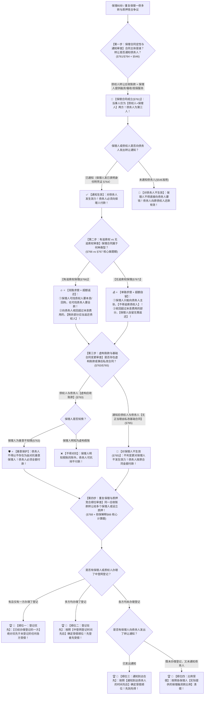

# 📐 保理合同与重复保理 · 全流程答题模型（重复保理四级顺位 · 保理与质押竞合 · 两方合同定性 · 有/无追索权核心对称 · 虚构账款善意保护 · §761-§769）

> **教练开场白**
> 同学们好！我是你们的民法法考教练。在典型合同分编中，“保理合同”是**民法典 2021 年新设独立章、现代供应链金融最核心载体、在客观题中必考 1–2 题的四星级重点高频母题**！而其中**“重复保理（多重保理）与应收账款质押竞合顺位”更是商事实体与动产统一担保登记对抗制度交汇的压轴计算考点**！
> 很多同学做保理合同题目时经常陷在以下几个“经典认知盲区与陷阱”里：把保理合同当成“债权人+债务人+保理行”的三方合同；在有追索权和无追索权保理中，算不清“找谁要钱（双路 vs 单路）”和“多收的钱归谁（返还 vs 自留）”；以为债权人与债务人合谋造假虚构应收账款，保理合同就直接全盘无效；**在“重复保理（一笔应收账款卖给三家保理行或质押给银行）”时，不知道“登记优先于通知、先登记优先于后登记、先通知优先于后通知、无登无通按比例”的法定清偿顺位，甚至误以为通知可以对抗登记**。
> 《民法典》保理合同章（§761–§769）与《最高人民法院关于适用〈中华人民共和国民法典〉有关担保制度的解释》（法释〔2020〕28号第66条），构建了**以“两方合同定性、通知表明身份、有追索权双路且超额返还、无追索权买断且超额自留、虚构假账不得坑善意、重复保理登记绝对优先于通知、保理质押同规则竞合”为核心的裁判闭环**。
> 今天我们用**“四步连贯流水线”**，把保理合同的全部交易结构、求偿路径与重复保理清偿顺位一次性彻底锁死：**第一步定性与通知关（两方合同非三方 + 保理人发通知须附凭证 §761/§764） → 第二步有追索权 vs 无追索权核心对称关（有追索权双路找人且超额返还 §766 vs 无追索权单路买断且超额自留 §767） → 第三步虚构与变更阻却关（虚构账款不得对抗善意保理人 §763 + 通知后擅自改合同不生效 §765） → 第四步【核心专精】重复保理与质押竞合四级顺位排座次关（已登记 ＞ 先登记 ＞ 先到达通知 ＞ 比例受偿 §768 + 担保解释§66）**！

---

## 适用场景与解决问题

本模型专门解决保理合同性质与当事人界定、转让通知效力、有追索权与无追索权保理法律后果、虚构应收账款对善意保理人效力、**重复保理（一债多转）与保理质押竞合清偿顺位确定**的全部主客观题考点（对应 [[典型合同考点-深度报告]] 十七·保理合同 Row 1/2/3 · ★★★★ 重点高频）：重点破解：

1. **第一步 · 保理合同定性与通知主体关（《民法典》§761/§762/§764/§769）**：
   - ⭐ **两方合同属性（§761）**：保理合同是**应收账款债权人**（出让人）与**保理人**（银行/保理公司）之间的**两方合同**；**应收账款债务人（欠款人）不是保理合同当事人**，只是被通知付款的第三人；
   - **形式与本质（§762/§769）**：应当采用书面形式（提倡性规范，非生效要件）；保理章未规定的，**准用第六章债权转让规定（§769）**；
   - ⭐ **通知主体双轨制（§764）**：**债权人或保理人均可发通知**；保理人发通知的，**应当表明保理人身份并附有必要凭证**；未通知债务人的，转让对债务人不发生效力（§546准用）。
2. **第二步 · 有追索权 vs 无追索权保理核心对称关（《民法典》§766/§767 核心必考点）**：
   - ⭐ **有追索权保理（§766 ≈ 带担保的借款）**：
     - **求偿路径（双路任选）**：保理人可以向**债权人**主张返还融资款本息/回购债权，**也可以**向**债务人**主张应收账款债权；
     - ⭐ **超额返还**：保理人向债务人主张应收账款收回款项，扣除融资款本息及费用后，**剩余部分应当返还给债权人**！
   - ⭐ **无追索权保理（§767 ≈ 债权买断）**：
     - **求偿路径（单路唯一）**：保理人**应当向债务人主张债权，不得再向债权人追索**；
     - ⭐ **超额自留**：保理人收回超过融资款本息及费用的部分，**无需返还债权人，保理人自留**！
   - **对称记忆铁律**：**“谁担风险，谁拿超额！”**
3. **第三步 · 虚构账款与基础合同变更阻却关（《民法典》§763/§765）**：
   - ⭐ **虚构应收账款的善意保护（§763 核心做题眼）**：债权人与债务人**虚构应收账款**作为转让标的与保理人订立合同的，**债务人不得以应收账款不存在为由对抗善意保理人**！（保理人明知虚构的除外）；
   - ⭐ **基础合同变更的效力冻结（§765）**：债务人收到转让通知后，债权人与债务人**无正当理由协商变更或者终止基础交易合同，对保理人产生不利影响的，对保理人不发生效力**！
4. **第四步 · 【核心专精】重复保理与保理质押竞合清偿顺位四级阶梯关（《民法典》§768 + 《担保解释》§66 权威计算做题眼）**：
   - ⭐ **重复保理（多重保理）法定四级受偿顺位（§768）**：应收账款债权人就同一应收账款订立多个保理合同（一债多转），按以下法定顺位排座次：
     $$\mathbf{① 已登记 ＞ 未登记 \longrightarrow ② 均登记看先登记 ＞ 后登记 \longrightarrow ③ 均未登记看先到达通知 ＞ 后通知 \longrightarrow ④ 既未登记又未通知看债权比例清偿}$$
   - ⭐ **保理与应收账款质押竞合规则（《担保解释》§66）**：同一应收账款同时存在保理与应收账款质押的，**参照适用《民法典》§768 的顺位规则竞技**（登记在先的保理人/质权人优先受偿；均未登记的看通知到达先后；均未登记未通知的按比例清偿）！

> **核心一句**：**保理合同两方签，准用债权转让篇；保理发函附凭证，未通债务不生效；有追索权走双路，收回超额退原主；无追索权买断走单路，风险自担超额自留；假账不得坑善意，通知之后乱改基础合同不生效；重复保理与质押竞合排座次：已登记＞先登记＞先通知＞按比例！**
>
> 🔎 **核心法源（2026最新）**：《民法典》§546、§548、§549、§761、§762、§763、§764、§765、§766、§767、§768、§769；《最高人民法院关于适用〈民法典〉有关担保制度的解释》（法释〔2020〕28号）第61条至第66条。

---

## 💡 【前置认知】重复保理与保理四大核心制度极速对照表

| 制度模块 | 核心法律条文 | 刚性法定规则与标准 | 考场一秒判定秘诀 |
| :--- | :--- | :--- | :--- |
| **① 重复保理（多重保理）顺位** | 《民法典》**§768** | ① 已登记 ＞ 未登记；<br>② 均登记看**登记时间先后**；<br>③ 均未登记看**通知到达时间先后**；<br>④ 既未登记又未通知**按保理融资款比例清偿**。 | **登记绝对碾压通知**！均登记比谁先登，都没登比谁先通知（多选-38）！ |
| **② 保理与质押竞合** | 《担保解释》**第66条** | 同一应收账款同时订立保理合同与质押合同，**完全参照 §768 四级顺位排座次**。 | 保理和质押同台竞技，**看谁先在中登网办理登记**！ |
| **③ 有追索权保理** | 《民法典》§766 | 双路求偿（找债权人或债务人）；**收回超过本息费用的应当返还债权人**。 | 类似借款担保，**超额必须退还原主**！ |
| **④ 无追索权保理** | 《民法典》§767 | 单路求偿（只能找债务人）；**收回超过本息费用的保理人自留无需返还**。 | 类似买断，**自负盈亏超额自留**（多选-37）！ |
| **⑤ 虚构假账保护** | 《民法典》§763 | 虚构应收账款，**债务人不得以不存在为由对抗善意保理人**（明知除外）。 | 造假不能坑善意银行，**债务人照样全额还钱**（单选-39）！ |

---

## 一、 考点核心骨架与法理（四步连贯决策树）



```
【重复保理与保理全景】一句话开场：保理两方签，通知附凭证；有追索权走双路超额退原主，无追索权买断走单路超额自留；假账不坑善意人，私改合同不生效；重复保理与质押排座次：已登记＞先登记＞先通知＞按比例！
│
▼ 第一步 · 查定性与通知 ── 两方合同与有效通知（§761/§764）
├─ 当事人仅两方：【债权人 ＋ 保理人】（债务人是外人）
└─ 转让通知：
     ├─ 债权人发 OR 保理人发（须表明身份＋附凭证 §764） ────────────→ ✅【通知到达对债务人生效】
     └─ 未发通知（§546 准用） ────────────────────────────────────────→ 🚨 转让对债务人不生效
          │
          ▼ 第二步 · 查有无追索权 ── 谁担风险谁拿超额（§766/§767）
          ├─ 有追索权（§766）：────────────────────────────────────────→ 🔥【双路任选】＋【超额必须返还债权人】
          └─ 无追索权（§767）：────────────────────────────────────────→ 💰【单路唯一（只找债务人）】＋【超额自留无需返还】
               │
               ▼ 第三步 · 查虚构与私改 ── 善意保护与效力冻结（§763/§765）
               ├─ 虚构应收账款（§763）：
               │    ├─ 保理人善意不知情 ───────────────────────────────────────→ 🛡️【债务人不得以不存在抗辩，照单全付】！
               │    └─ 保理人明知虚构 ─────────────────────────────────────────→ ❌ 保理人无保护
               └─ 通知后无正当理由私改基础合同（§765）：───────────────────────→ 🚨【对保理人不发生效力】（按原合同全额付）
                    │
                    ▼ 第四步 · 查【重复保理与质押竞合】顺位 ── 四级清偿阶梯（§768 + 担保解释§66）
                    ├─ 🥇 顺位一：【已经登记 ＞ 未登记】（登记绝对碾压通知）
                    ├─ 🥈 顺位二：均登记的，看【中登网登记时间先后】
                    ├─ 🥉 顺位三：均未登记的，看【通知到达债务人时间先后】
                    └─ 🏅 顺位四：既未登记又未通知的，看【保理融资款比例清偿】

  ━━━ 四步全通 ━━━
```

---

## 二、 核心考情与 2026 民法典精要

- **频次研判**：保理合同与重复保理是民法典合同编分则**★★★★ 重点高频新设章**；每年在单选题、多选题中必考 1 题，法大法考与各大主流机构将其列为现代商事法与动产融资担保的核心考点。
- **命题核心**：
  1. **重复保理四级清偿顺位（§768 压轴计算做题眼）**：一债多转的清偿顺位为：已登记 ＞ 先登记 ＞ 先到达通知 ＞ 按比例（多选-38）。
  2. **保理与应收账款质押竞合（担保解释§66）**：同一应收账款同时存在保理与质押时，完全参照 §768 四级规则按登记与通知先后清偿。
  3. **两方合同定性（§761）**：保理合同只有两方当事人，债务人不是合同当事人（单选-38）。
  4. **有追索权 vs 无追索权对称规则（§766/§767）**：
     - 有追索权：双路找人 ＋ **超额应当返还原债权人**；
     - 无追索权：单路找债务人 ＋ **超额自留无需返还**（多选-37）。
  5. **虚构应收账款善意保护（§763）**：合谋造假虚构应收账款，债务人不得以此对抗善意保理人（单选-39）。

---

## 三、 三大核心法理与命题陷阱拆解

### 1. 重复保理与保理合同命题暗坑与裁判标准表

| 案件事实设定 | 争议焦点 | 裁判结论 | 命题陷阱与法理深剖 |
|---|---|---|---|
| 债权人甲将同一笔 100 万元应收账款先后转让给乙保理行（未登记，但 4月5日 通知到达债务人）和丙保理行（4月3日 办理了中登网登记，未通知债务人）。 | 乙保理人先发通知，丙保理人先登记，债务人应向谁付款？ | 🏆 **顺位归已办理登记的丙保理行！** | 《民法典》§768：重复保理顺位**“登记在先 ＞ 先到达通知”**；登记绝对优先于通知，丙已办理登记，顺位优先于未登记先通知的乙（多选-38）。 |
| 债权人甲将 100 万元应收账款转让给乙保理行（4月1日 登记），后又将该笔账款质押给丙银行担保借款（4月5日 办理质押登记）。 | 同一应收账款上保理与质押竞合，谁享有第一顺位？ | 🏆 **乙保理人顺位在先！** | 《担保解释》§66：保理与应收账款质押竞合参照《民法典》§768 规定，**按照登记时间先后确定受偿顺位**；乙登记在先，享有第一优先受偿权。 |
| 甲与保理行订立**无追索权保理合同**（融资款 80 万，应收账款 100 万）。到期后保理行向债务人乙全额追回 100 万元。 | 超过融资款本息的 20 万元剩余款项应归谁？ | 💰 **归保理行自留，无需返还甲！** | 《民法典》§767：无追索权保理属于**买断型保理**，保理人承担坏账风险，**收回超过部分无需返还债权人**（多选-37）。 |
| 甲公司与乙公司合谋虚构 500 万元交易产生虚假应收账款，并向不知情的丙银行办理保理融资。到期乙拒不付款。 | 乙能否以“应收账款系虚构不存在”为由拒绝付款？ | 🛡️ **乙不得对抗丙银行，必须全额付款！** | 《民法典》§763：虚构应收账款转让的，**债务人乙不得以应收账款不存在为由对抗善意保理人丙银行**（单选-39）。 |

### 2. 重复保理（多重保理）四级清偿顺位与竞合裁判规则

```
                                【重复保理四级清偿顺位阶梯 (§768)】
                                                │
       ┌────────────────────────────────────────┼────────────────────────────────────────┐
       ▼                                        ▼                                        ▼
【第一顺位：登记优先原则】               【第二顺位：登记在先原则】               【第三顺位：通知到达在先原则】
 • 已经办理登记的 ＞ 未登记的              • 均办理登记的                           • 均未办理登记的
 • 登记绝对碾压通知！                     • 按照【登记时间先后】确定顺位           • 按照【通知到达债务人时间先后】确定
                                                │
                                                ▼
                                 【第四顺位：融资款比例清偿】
                                  • 既未登记、又未通知债务人的
                                  • 按照【各保理人实际保理融资款比例】清偿！
```

---

## 四、 万能解题四步

---

### 第一步：查定性与通知关 —— 两方签了吗？有效通知了吗？（《民法典》§761/§764）

> **教练提示**：
> 1. 保理合同只有**债权人与保理人两方**，债务人是“外人”；
> 2. 保理人自己发通知必须**表明身份并附凭证（§764）**；通知到达债务人才发生对抗效力。

---

### 第二步：查有无追索权关 —— 双路还是单路？多收了退不退？（《民法典》§766/§767）

> **教练提示**：
> 1. **有追索权保理（§766）** $\rightarrow$ **双路求偿**（找债权人返还，或找债务人要钱）；收回超过本息费用的**必须返还给原债权人**！
> 2. **无追索权保理（§767）** $\rightarrow$ **单路求偿**（只能找债务人，不得再找债权人）；收回超额部分**保理人自留，无需返还**！

---

### 第三步：查虚构与私改关 —— 保理人善意吗？私下改合同了吗？（《民法典》§763/§765）

> **教练提示**：
> 1. 债务人合谋造假虚构账款 $\rightarrow$ **只要保理人善意不知情，债务人必须全额买单（§763）**；
> 2. 收到转让通知后，债权人与债务人私下协议减免欠款、解除合同 $\rightarrow$ **对保理人不发生效力（§765）**！

---

### 第四步：【核心专精】查重复保理与质押顺位关 —— 一债多转排座次！（《民法典》§768 + 担保解释§66）

> **教练提示**：重复保理与质押竞合顺位四级阶梯：
> 1. **第一顺位**：有登记的赢过没登记的（**登记绝对优先于通知**）；
> 2. **第二顺位**：都登记的比**登记时间先后**；
> 3. **第三顺位**：都没登记的比**通知到达债务人时间先后**；
> 4. **第四顺位**：没登记没通知的**按保理融资款比例受偿**！

#### 💰 完整数字案例：重复保理与质押竞合攻防实战

> **【案情（[[典型合同-多选-38]] 与 [[典型合同-多选-37]] 综合演练）】**
> 供应商甲公司对采购商乙公司享有 **100 万元**到期应收账款（付款期为 2024年10月1日）。甲公司为获取资金流动性，实施了一系列融资操作：
> - **实战分支 A（重复保理四级顺位攻防 · 多选-38）**：
>   - 2024年4月1日：甲与丙商业保理公司签订保理合同（融资款 40 万），未办理登记；
>   - 2024年4月5日：甲与丁商业保理公司签订保理合同（融资款 40 万），并于当日在**中登网办理了应收账款转让登记**；
>   - 2024年4月8日：甲向乙公司发出转让通知，载明应收账款已转让给丙公司（4月10日 到达乙公司）；
>   - 2024年4月12日：丁公司向乙公司发出转让通知并附中登网登记证明（4月14日 到达乙公司）。
>   - **裁判涵摄（重复保理顺位认定）**：
>     1. 依据《民法典》§768 规定，应收账款重复转让时，**已经办理登记的优先于未登记的受偿**；
>     2. 丁公司于 4月5日 办理了转让登记，丙公司未办理登记；**丁公司的登记效力绝对优先于丙公司的先到达通知**；
>     3. 债务人乙公司应当向第一顺位的丁保理公司清偿 100 万元！丁公司受偿后，剩余款项再由丙公司主张（多选-38 考点）！
> - **实战分支 B（保理与应收账款质押竞合 · 《担保解释》§66）**：
>   若甲公司于 4月1日 将该 100 万元应收账款质押给戊银行（4月2日 在中登网办理质押登记）；后甲公司于 4月5日 将该应收账款转让给丁保理公司办理保理（4月5日 在中登网办理保理登记）。
>   - **裁判涵摄**：依据《民法典担保解释》第 66 条，保理与应收账款质押竞合参照《民法典》§768 规定，按照**登记时间先后确定清偿顺位**；戊银行质押登记在先（4月2日 ＞ 4月5日），**戊银行就该 100 万元应收账款优先受偿**！

#### 一句话闭环记忆
> 🎯 **一眼判**：**保理合同两方签，准用债权转让篇；保理发函附凭证，未通债务不生效；有追索权走双路，收回超额退原主；无追索权买断走单路，风险自担超额自留；假账不得坑善意，通知之后乱改基础合同不生效；重复保理与质押排座次：已登记＞先登记＞先通知＞按比例！**

---

## 五、 案例演练

### 1. 重复保理（多重保理）清偿顺位四级阶梯（[[典型合同-多选-38]] 经典真题）
- **案情**：同一应收账款多重转让，涉及已登记、未登记先通知、均未登记未通知等顺位排定。
- **模型分析**：第四步——依据《民法典》§768，登记在先 ＞ 先到达通知 ＞ 按比例受偿（选 ABCD）。

### 2. 有追索权与无追索权超额处理（[[典型合同-多选-37]] 经典真题）
- **案情**：题目对比有追索权保理与无追索权保理中，保理人向债务人追回超额款项后的归属。
- **模型分析**：第二步——依据《民法典》§766，有追索权保理超额部分应当返还债权人；依据 §767，无追索权保理超额部分保理人自留无需返还（选 BC）。

### 3. 虚构应收账款不得对抗善意保理人（[[典型合同-单选-39]] 经典真题）
- **案情**：债权人与债务人虚构应收账款与不知情的保理公司订立保理合同，债务人以虚假为由拒付款项。
- **模型分析**：第三步——依据《民法典》§763，债务人不得以应收账款不存在为由对抗善意保理人，债务人必须全额付款（选 A）。

### 4. 保理合同两方定性与要式属性（[[典型合同-单选-38]] 经典真题）
- **案情**：债权人转让应收账款给保理人，债务人未签字，且双方口头订立保理合同。问保理合同效力与当事人构成。
- **模型分析**：第一步——依据《民法典》§761，保理合同当事人为债权人和保理人两方；书面形式为提倡性规范，不影响合同成立效力（选 D）。

---

## 关联真题

- [[典型合同-多选-38]] · 重复保理（多重保理）清偿顺位四级阶梯
- [[典型合同-多选-37]] · 有追索权与无追索权保理双路单路及超额归属
- [[典型合同-单选-39]] · 虚构应收账款不得对抗善意保理人
- [[典型合同-单选-38]] · 保理合同两方定性与要式属性
- [[典型合同-单选-40]] · 保理人转让通知与基础合同不利变更阻却

## 相关页面

- 概念实体页：[[保理合同]] · [[债权转让]] · [[买卖合同]]
- 姊妹模型：[[民法-合同-买卖风险负担模型]] · [[民法-合同-债务承担模型]]
- 综合报告：[[典型合同考点-深度报告]]（十七、保理合同 · Row 1/2/3 · ★★★★ 重点高频）
