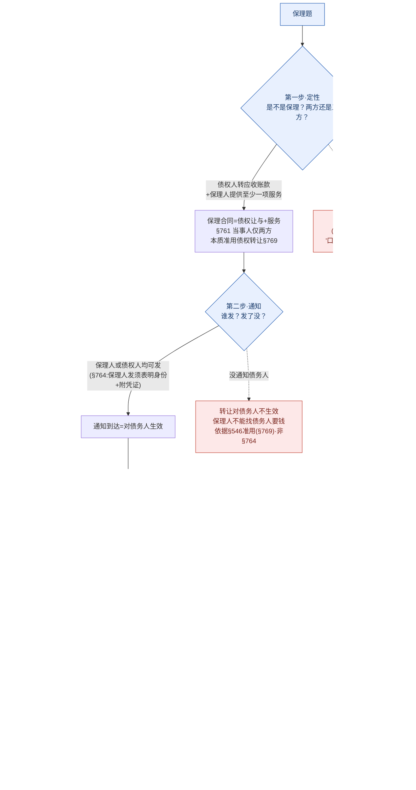

# 📐 保理合同 · 答题模型（定性两方 → 通知谁发 → 有/无追索权 → 三特别规则）

> 凡"应收账款 / 保理 / 融资款 / 追索权"的题，按这四步走。灵魂只有一句：**保理＝"债权让与＋服务"的两方合同；命题核心永远是有/无追索权——谁担风险，谁拿超额。**
> **姊妹 / 概念** → [[保理合同]]（概念 + 故事）· [[债权转让]]（§769 准用的母法 · 通知/抗辩/抵销/从权利都从这里借）· [[民法-合同-债务承担模型]]（债之移转家族 · 转让块的另一半）。
> **适用真题**：[[典型合同-单选-38|C2单选-38·两方非三方+书面提倡性]] · [[典型合同-单选-40|C2单选-40·通知主体+变更基础合同不生效]] · [[典型合同-多选-37|C2多选-37·有/无追索权双路vs单路+超额]] · [[典型合同-单选-39|C2单选-39·虚构应收账款不得对抗善意保理人]] · [[典型合同-多选-38|C2多选-38·重复保理四级顺序]]。
>
> 🔎 **法条已联网核实（2026-06-15，3 路独立考证 + 对抗复核，全 CONFIRMED·HIGH）**：民法典保理章 **§761–§769** 逐字命中 [最高检官网民法典合同编](https://www.spp.gov.cn/spp/ssmfdyflvdtpgz/202008/t20200831_478413.shtml) + 工信部/武汉市政府民法典全文双源 byte 级一致 + 直抓原文复核。准用基础 **§546**（债权转让通知）同源核实。详见 [[2026-06-15-保理合同章联网核实]]。
> ⚠️ **两个最易记错的点**：①"未通知不对债务人生效"是 **§546 经 §769 准用，不是 §764**（§764 只管"谁能发通知 + 须表明身份附凭证"）。②超额返还方向：**有追索权 §766 向债务人收的超额→应返还债权人；无追索权 §767 超额→保理人自留、无需返还**（千万别写反）。
> ⭐ **考频**：**★★★★ 高频**——2021 民法典**新设章**（立法级强信号）+ 法大法考**11 类必考清单**点名；常与 [[债权转让]] 通则**串考**。命题核心＝有/无追索权（§766/§767）。

## 🗺️ 一页流程图（先白纸默画"两方→通知→有无追索权"主干，再对照查漏）

## 一、核心考情

- **频率**：★★★★ 高频。2021 民法典**新设典型合同章**（类型级强信号）；法大法考**11 类必考清单**（买卖/赠与/借款/保证/租赁/融资租赁/**保理**/建工/委托/物业/合伙）点名；客观题常考 1 道，且爱与 [[债权转让]] 通则**串考**。
- **命题核心**：永远围绕"**保理的两种业态怎么分配风险与收益**"——**有追索权（§766，像借款）vs 无追索权（§767，像买断）**，由此牵出"找谁要钱（双路 / 单路）""超额归谁（返还 / 自留）"。其余是通知、虚构、变更、重复四个特别规则。
- **三大必考点**：①保理是**两方**合同（债权人＋保理人），债务人是"外人"；书面＝**提倡性**（§762Ⅱ）。②**通知**——保理人也能发（§764 新规），未通知则转让对债务人不生效（§546 准用）。③**有/无追索权**（§766/§767）——双路 vs 单路 + 超额返还 vs 自留。

## 二、万能四步模型

### 第一步：定性——是不是保理？两方还是三方？（§761 / §762 / §769）

**铁则**：保理合同 = 应收账款**债权人**把（现有的或将有的）应收账款**转让**给**保理人** **＋** 保理人提供"**资金融通／应收账款管理或催收／应收账款债务人付款担保**"中**至少一项**服务（§761）。
- **当事人只有两方**：应收账款**债权人**（出让人）＋**保理人**（银行 / 商业保理公司）。**应收账款债务人不是保理合同当事人**——它只是基础交易合同的相对方、被通知后负付款义务的"外人"。
- **法律本质＝债权让与**：保理章没规定的，**准用第六章债权转让**（§769）——通知、抗辩、抵销、从权利全从 [[债权转让]] 那边借。
- **形式＝应当书面（§762Ⅱ）**：这是**提倡性规定**，不采用书面**不必然无效**（区别于 [[建设工程合同]] §789 那种真·要式，见 [[要式合同]]）。

> 🌰 老王小李（**老王＝供应商=应收账款债权人，小李＝采购商=应收账款债务人/欠款人，保理行＝保理人**）：
> 老王卖给小李 100 万元货物、小李 3 个月后付款（这是**基础交易合同**，产生 100 万应收账款）。老王缺现金，把这 100 万应收账款转让给保理行、换 80 万融资款（这是**保理合同**，只有老王和保理行两方）。小李是"外人"——它欠的钱要还，但它不是保理合同的当事人。

### 第二步：通知——谁能发？没发行不行？（§764 ＋ §546 准用）

**铁则**：
- **谁能发通知**——**保理人或债权人均可**。§764 专门确认：**保理人**也可以向债务人发应收账款转让通知（纠正旧法"只有债权人能通知"的印象），但保理人发通知时**应当表明保理人身份并附有必要凭证**。
- **没发通知的后果**——转让**对债务人不发生效力**，保理人不能向债务人主张，债务人向原债权人清偿仍有效。**这条规则的依据是 §546（"债权人转让债权未通知债务人的，对债务人不发生效力"）经 §769 准用，不是 §764**。

> ⚠️ **条号易错（高频）**：很多资料把"未通知不生效"安到"§764 第1款"。错。**§764 是单独一段、不分款，全文只讲"保理人发通知须表明身份＋附凭证"**；"未通知不生效"在 **§546**。

> 🌰 保理行没通知小李就直接去找小李要 100 万 → 不行（§546 准用：对小李不生效，小李此时向老王还款仍有效）。保理行自己出面给小李发通知、并表明"我是保理行"附上保理合同凭证 → 可以（§764），通知一到，小李就得向保理行付款。

### 第三步【核心】：有追索权 vs 无追索权——谁担风险，谁拿超额（§766 / §767）

**铁则**：先看当事人约定的是**有追索权**还是**无追索权**保理，二者的"找谁要钱"和"超额归谁"完全相反——

| 维度 | **有追索权 §766**（≈带担保的借款） | **无追索权 §767**（≈债权买断） |
|---|---|---|
| 债务人到期拒付，保理人找谁 | **双路**：① 向**债权人**主张返还融资款本息**或**回购应收账款债权；② **也可以**向**债务人**主张应收账款债权 | **单路**：**应当**向**债务人**主张应收账款债权；**不得**追索债权人 |
| 保理人向债务人收钱后有剩余 | 扣除融资款本息及相关费用后，**剩余部分应当返还债权人**（§766 第2句）| 超过融资款本息及相关费用的部分，**无需返还债权人——保理人自留**（§767）|
| 谁承担"应收账款收不回"的风险 | **债权人**（风险最终回到债权人）| **保理人**（买断，自负盈亏）|

- 🎯 **一句话定调（贯穿全步）**：**谁担风险，谁拿超额。** 有追索权＝债权人没脱身、担风险，所以保理人多收的要还给债权人；无追索权＝保理人买断、担风险，所以多收的归保理人。两组规则严格对称，记住一边自动推出另一边。

> 🌰 老王把对小李的 100 万应收账款转给保理行，保理行先付老王 80 万融资款。后来小李到期拒付：
> - **有追索权**：保理行可以回头找**老王**要回 80 万本息（或让老王回购债权），**也可以**直接找**小李**催收 100 万——双路任选。若保理行从小李处收回 100 万，扣掉 80 万本息和费用后的剩余，**要还给老王**。
> - **无追索权**：保理行**只能找小李**催收，**不能**回头找老王（风险买断了）；若从小李处收回 100 万，超过 80 万本息及费用的部分，**保理行自己留着、无需还老王**。

### 第四步：三个特别规则——虚构 / 变更 / 重复（§763 / §765 / §768）

**铁则**：
- **① 虚构应收账款（§763）**：债权人与债务人**虚构**应收账款作为转让标的、与保理人订立保理合同的，债务人**不得**以"应收账款不存在"为由对抗保理人；**但保理人明知虚构的除外**。
  - 方向：保理人**善意（不知）→ 债务人不得对抗**（保理人受保护）；保理人**明知 → 债务人可以对抗**。法理类比 [[善意取得]]——保护善意交易方，虚构的内部责任由债权人/债务人自负。
- **② 通知后变更基础合同（§765）**：债务人**接到转让通知后**，债权人与债务人**无正当理由**协商变更或终止基础交易合同、**对保理人产生不利影响**的，**对保理人不发生效力**。
  - 两要件缺一不可：**无正当理由 ＋ 不利保理人**。若有正当理由（如货物真有质量问题而退款）→ 对保理人**仍有效**。
- **③ 重复保理清偿顺序（§768）**：同一应收账款被债权人转让给多个保理人时，按四级阶梯定优先：
  1. **已登记 ＞ 未登记**；
  2. 均已登记 → 按**登记时间**先后；
  3. 均未登记 → 由**最先到达债务人的转让通知中载明的保理人**取得；
  4. 既未登记也未通知 → 按**保理融资款或者服务报酬的比例**取得。
  - 一句话：**登记 ＞ 通知 ＞ 比例**（登记永远压通知）。

> 🌰 ① 老王和小李串通虚构一笔根本不存在的 100 万应收账款骗保理行融资——若保理行不知情（善意），小李**不能**用"这笔账款是假的"赖账（§763）；若保理行明知是假的还做，小李**可以**对抗。
> ② 保理行通知小李后，老王和小李没正当理由把货款从 100 万改成 60 万、坑保理行 → 这个变更**对保理行不生效**，保理行仍可向小李主张 100 万（§765）。
> ③ 老王把同一笔 100 万先后卖给保理行乙、保理行丙：乙登记了、丙没登记 → 乙优先（登记＞未登记，§768）。

## 三、命题人最爱的陷阱

1. **保理是"三方合同"** —— 错。保理**合同**只有**两方**（债权人＋保理人）；商业**业务结构**才是三方（加债务人）。债务人有付款义务、有抗辩权，但**不是当事人**（单选-38·D）。
2. **"口头保理无效 / 书面是生效要件"** —— 错。§762Ⅱ"应当书面"是**提倡性规定**，不书面**不必然无效**（≠ 建设工程 §789 真要式）。
3. **"只有债权人能发转让通知"** —— 错。§764 新规：**保理人也能发**（须表明身份＋附凭证）。
4. **把"未通知不生效"记成 §764** —— 错。§764 只管"谁能发＋怎么发"；"未通知对债务人不生效"是 **§546 经 §769 准用**。
5. 🔴 **有/无追索权的超额方向写反（最高频 · 题库原卡就栽在这）** —— **有追索权**向债务人收的超额**应返还债权人**（§766 第2句）；**无追索权**超额**保理人自留、无需返还**（§767）。口诀"谁担风险谁拿超额"——别背反。
6. **虚构应收账款"明知也不得对抗"** —— 错，方向颠倒。保理人**明知**虚构 → 债务人**可以**对抗；**善意**才不得对抗（单选-39·D 方向陷阱）。
7. **重复保理"先通知者优先"** —— 不准。**登记永远压通知**：已登记者即使通知在后，也优先于只通知未登记者（§768）。

## 四、真题演练

### 范例①：[[典型合同-单选-38|单选-38]]（保理合同法律关系，"不正确"的是）→ **D**
- 第一步·定性：保理**合同**当事人＝债权人＋保理人**两方**（§761）。D 称"有三方主体"——把业务结构（三方）当成合同当事人 → **错，故选 D**。
- 顺带验证其余项：A 本质＝债权让与（§769 准用，对）；B 通知后无正当理由变更基础合同对保理人不生效（§765，对）；C 应当书面（§762Ⅱ 提倡性，表述对）。

### 范例②：[[典型合同-单选-40|单选-40]]（通知后甲乙无理由把货款 100 万改 60 万）→ **B**
- 第二步·通知：通知主体——保理人丙**或**债权人甲均可（§764）；本题丙已发通知。
- 第四步·变更：甲、乙在通知后**无正当理由**把 100 万改 60 万、不利于丙 → §765**对丙不发生效力**，丙仍可向乙主张 **100 万** → **B**。
- 排除：A 把变更当对丙有效（错）；C 称丙无权向乙主张（已通知，§764 后丙当然能主张，错）；D 称通知只能甲发（§764：保理人也能发，错）。

### 范例③：[[典型合同-多选-37|多选-37]]（有追索权 vs 无追索权法律后果）→ **ABCD**
- 第三步·核心，逐项对照 §766/§767：
  - A 有追索权→丙可向**债权人**甲主张返还融资款本息**或**回购债权（§766 第1句）→ **对**。
  - B 有追索权→丙**也可**直接向**债务人**乙主张 100 万（§766"也可以向债务人主张"）→ **对**。
  - C 无追索权→丙**只能**向乙主张、不得追索甲（§767"应当向债务人主张"）→ **对**。
  - D 无追索权→丙向乙收回 100 万后，**有权保留**超出融资款本息及费用的 20 万差额（§767"**无需向债权人返还**"）→ **对**。
- ⚠️ **本题答案＝ABCD**。D 是"谁担风险谁拿超额"的正面应用：无追索权保理行担了风险，超额归它。（题库旧卡曾把 §767 误记为"应当返还"、判 D 错、答 ABC——已据最高检原文订正为 ABCD。）

### 范例④：[[典型合同-单选-39|单选-39]]（甲乙虚构 100 万应收账款转给善意保理行丙）→ **B**
- 第四步·虚构（§763）：丙**不知**虚构（善意）→ 债务人乙**不得**以"账款不存在"对抗丙、须付款 → **B**。
- 排除：A 称保理合同无效（虚构不必然使保理合同整体无效，§763 特别保护善意保理人，错）；C 称乙可提"基础合同不存在"抗辩（与 §763 直接矛盾，错）；D 称"丙明知则乙不得对抗"（方向反了——明知→乙**可以**对抗，错）。

### 范例⑤：[[典型合同-多选-38|多选-38]]（同一应收账款先后转给乙、丙）→ **ABCD**
- 第四步·重复（§768）四级阶梯逐项命中：
  - A 乙登记、丙未登记→乙优先（① 登记＞未登记）→ 对。
  - B 均已登记→按登记时间先后（② 登记时间）→ 对。
  - C 均未登记→按通知到达债务人先后（③ 最先到达通知载明人）→ 对。
  - D 既未登记也未通知→按融资款/服务报酬**比例**分配（④ 比例）→ 对。
- ⚠️ 记牢顺序**登记＞先登记＞先通知＞比例**，且"登记永远压通知"。

## 📐 口诀

> **"保理两方债权让，融资催收加担保（书面是提倡、口头不当然无效）。**
> **通知谁发都行（保理人发要亮身份附凭证）；没通知＝对债务人白搭（§546 准用、不是 §764）。**
> **有追索＝借款：双路找人、向债务人收的超额还东家；**
> **无追索＝买断：单路只找债务人、超额自己拿。（谁担风险谁拿超额，别写反！）**
> **虚构防善意（明知才可抗）、改约要正当（无理由不利→不生效）、重复看登记（登记＞通知＞比例）。"**

## 相关页面

- 上层 / 概念：[[保理合同]]（§761-§769 概念 + 老王小李故事）· [[合同编]] · [[典型合同]]
- 准用母法：[[债权转让]]（§545-§550 · §769 准用：通知 §546 / 抗辩继受 §548 / 抵销 §549 / 从权利 §547）
- 姊妹模型：[[民法-合同-债务承担模型]]（债之移转家族 · 转让块的另一半）
- 易混对照：[[要式合同]]（保理书面＝提倡性，非 §789 那种真要式）
- 适用真题：[[典型合同-单选-38|单选-38·两方非三方]] · [[典型合同-单选-39|单选-39·虚构防善意]] · [[典型合同-单选-40|单选-40·通知+变更]] · [[典型合同-多选-37|多选-37·有/无追索权]] · [[典型合同-多选-38|多选-38·重复保理]]
- 综合报告：[[典型合同考点-深度报告]] 十七·保理合同
- 源记录：[[2026-06-15-保理合同章联网核实]]
</content>
</invoke>
