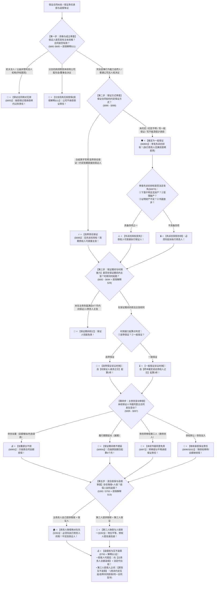

# 📐 保证合同 · 全流程答题模型（资格审查 · 方式推定 · 期间与时效衔接 · 主债变动 · 混合担保与追偿五步定位链 · §681-§702/§392/担保解释§13）

> **教练开场白**
> 同学们好！我是你们的民法法考教练。在民法典典型合同与担保制度中，“保证合同”是**法考全卷考查频次最高、分值最大、民法与民诉双跨的绝对超级母题（★★★★★ 顶级必考，覆盖 11+ 张真题卡）**！
> 《民法典》及《最高人民法院关于适用〈中华人民共和国民法典〉有关担保制度的解释》（法释〔2020〕28号）对旧《担保法》进行了**颠覆性的重大改写**，命题人年年以此设坑：
> 1. **保证方式推定大反转**：旧法未约定保证方式推定为“连带责任保证”，《民法典》§686Ⅱ 彻底颠覆为**【按照一般保证承担保证责任】**！
> 2. **保证期间约定不明从“2年”改为“6个月”**：旧法约定不明为 2 年（已废止），现行法《民法典》§692 与《担保制度解释》§32 统一规定：**未约定或约定“直至本息还清为止”的，保证期间一律为主债务履行期届满之日起【6 个月】**！
> 3. **第三人担保人之间“原则互不追偿”**：旧法允许混合担保人之间相互按份分担，《担保制度解释》§13 确立铁律：**第三人担保人之间原则上互不追偿，各扫门前雪，只能找债务人追偿（除非有 3 个法定例外）**！
> 4. **一般保证诉讼时效起算点新规**：一般保证人在保证期间内起诉主债务人后，保证时效不是从判决生效起算，而是自**【法院对债务人强制执行终本裁定送达债权人之日】**起跑！
> 5. **偷偷延期保证期间绝不顺延**：主债务展期未经保证人书面同意的，**保证期间依然按照原合同到期日起算，绝不顺延**，往往导致保证人提前脱责！
>
> 今天我们用**“五步连贯流水线”**，把保证合同的全部考点一次性彻底锁死：**第一步查资格与成立（书面/保函/签字；机关公益严禁；分支机构须公司决议 §683/担保解释§11） → 第二步查保证方式与先诉抗辩权（写明连带才连带，其余一律推定一般保证 §686；一般保证享有先诉抗辩权及四项丧失例外 §687） → 第三步查保证期间与时效接力（默认6个月除斥期间；连带保证请求即起跑；一般保证终本送达才开跑 §692/§694/解释§28） → 第四步查主债务变动（减担少加担原；延期不顺延；债转继续保；债移书面签；债务加入继续保 §695-§697） → 第五步查混合担保与追偿权（债务人物保先实现；第三人物保人保择一；代偿向债务人全额追偿；第三人担保人原则互不追偿 §392/§700/解释§13）**！

---

## 适用场景与解决问题

本模型专门解决保证合同成立与生效、保证人主体资格（机关/公益/分支机构）、保证方式推定规则（一般保证 vs 连带保证）、一般保证先诉抗辩权及其四大丧失事由、保证期间确定（6个月除斥期间）与诉讼时效接力衔接、主合同内容/期限/主体变动（加重/减轻/展期/债权转让/债务转移/债务加入）下的保证责任判定、混合担保（物保＋人保）实现顺序、保证人追偿权（§700）与第三人担保人间追偿限制（担保解释§13）的全部主客观题考点（对应 [[典型合同考点-深度报告]] 第五章 §681-§702 核心考点）：重点破解：

1. **第一步 · 资格与成立审查关（《民法典》§681-§685 ＋ 《担保制度解释》§11）**：
   - ⭐ **保证合同成立形式（§685）**：
     - 单独书面合同、主合同中的保证条款、主合同“保证人”栏签字盖章、或者向债权人出具书面保函（债权人接受且未提异议）；
   - 🚫 **主体资格绝对禁止清单（§683）**：
     - ① **机关法人**（除经国务院批准为使用外国政府或国际经济组织贷款进行转贷外）；
     - ② **以公益为目的的非营利法人、非法人组织**（公办学校、幼儿园、医院、公益社团等）；
     - 🚨 违反上述禁止性规定签订的保证合同**一律无效**，按担保过错承担缔约过失责任（担保解释§17 多选-07）；
   - 🏢 **分支机构担保（担保解释§11）**：
     - 依法领照的分支机构对外提供保证，**必须经母公司股东会或董事会决议授权**；未经有效决议且相对人非善意的，公司不承担担保责任。
2. **第二步 · 保证方式推定与先诉抗辩权关（《民法典》§686-§688 颠覆性考点）**：
   - ⭐ **保证方式推定铁律（§686Ⅱ 必考大坑）**：
     - **白纸黑字写明“连带责任保证”** $\rightarrow$ **连带保证（§688，无先诉抗辩权）**；
     - **没约定、约定不明、只写“一般保证”、或写“债务人不能清偿时由保证人承担”** $\rightarrow$ **一律推定为【一般保证】（§686Ⅱ 多选-34）**！
   - ⭐ **一般保证人的先诉抗辩权（§687Ⅰ）**：
     - 在主合同纠纷未经审判或者仲裁，并**就债务人财产依法强制执行仍不能履行债务前，保证人有权拒绝承担保证责任**；
   - 🚨 **先诉抗辩权法定丧失四大例外（§687Ⅱ 必须秒杀）**：
     - ① 债务人**下落不明，且无财产可供执行**；
     - ② 人民法院**已经受理债务人破产案件**；
     - ③ 债权人有证据证明债务人的**财产不足以履行全部债务**或者丧失履行能力；
     - ④ 保证人**书面放弃**本款规定的权利（口头放弃无效 多选-08）。
3. **第三步 · 保证期间确定与诉讼时效接力关（《民法典》§692-§694 ＋ 《担保制度解释》§28/§32）**：
   - ⭐ **保证期间六个月除斥铁律（§692）**：
     - 有约定从约定；**未约定或约定不明（如约定保证直至本息还清为止）** $\rightarrow$ **保证期间一律为主债务履行期届满之日起【6 个月】**；
     - 🚨 **除斥期间性质**：保证期间为除斥期间，**不适用诉讼时效中止、中断、延长**的规定；债权人未在期间内主张权利的，**保证人直接免除保证责任**！
   - 🏃 **保证期间 $\rightarrow$ 保证债务诉讼时效的“接力起跑规则”（§694 ＋ 担保解释§28）**：
     - ⚡ **连带责任保证（无空档接力）**：债权人在保证期间内**向连带保证人请求承担保证责任之日起**，保证期间退场，开始计算 **3 年保证诉讼时效**（多选-09）；
     - ⏳ **一般保证（漫长空档期接力）**：债权人在保证期间内**对债务人提起诉讼或申请仲裁**，保证期间完成使命；但保证人的 3 年诉讼时效并不在起诉日起跑，必须等到**【人民法院对债务人强制执行终结本次执行程序（终本）裁定书送达债权人之日】**，保证诉讼时效才正式开始起跑（《担保制度解释》§28 权威新规）！
	     - 必须等：走完审判→对债务人强制执行→穷尽财产查控、无财产可供执行、出终本裁定 =**先诉抗辩权正式消灭**，债权人才取得对保证人的完整诉权，此时 3 年诉讼时效才起跑。
	     - 
	     - **保证期间（除斥期间）干第一件事：决定保证人要不要担责任。**
	     - 证债务诉讼时效干第二件事：保证责任已经确定存在之后，你要在 3 年内去告保证人要钱。
1. **第四步 · 主债务变动下的保证责任判定关（《民法典》§695-§697）**：
   - ⭐ **内容变动（§695Ⅰ）**：未经保证人书面同意：
     - **债务减轻（金额↓）** $\rightarrow$ 保证人对**减轻后的债务继续承担保证责任**（减担少）；
     - **债务加重（金额↑/利息↑）** $\rightarrow$ 保证人**对加重部分不承担保证责任**，只按原债务限额担保（加担原 单选-31）；
   - 🚨 **履行期限变动（§695Ⅱ 致命展期陷阱）**：
     - 债权人与债务人私下协议延长还款期限，未经保证人书面同意的，**【保证期间不受影响，绝不顺延】（依然按照原合同到期日起算 6 个月）**！
   - ⭐ **主体变动（§696/§697/§552）**：
     - **债权转让（换债权人 §696）** $\rightarrow$ **不需要保证人同意**（通知即可），保证人在原担保范围内继续担保；
     - **债务转移（换债务人 §697）** $\rightarrow$ **必须经保证人书面同意**！未经书面同意转移的部分，保证人**不再承担保证责任**；
     - **债务加入（并存承担 §552）** $\rightarrow$ 原债务人未脱离，保证人**对全部债务继续承担保证责任**。
5. **第五步 · 混合担保实现顺序与追偿权关（《民法典》§392/§700 ＋ 《担保制度解释》§13/§18）**：
   - ⭐ **混合担保（物保＋人保）实现顺序（§392）**：
     - ① 有约定按约定；
     - ② **没有约定或者约定不明确的**：
       - **主债务人自己提供物的担保** $\rightarrow$ 债权人**【必须先就该物的担保受偿】**，不足部分才找保证人（单选-33）；
       - **第三人提供物的担保 ＋ 第三人保证** $\rightarrow$ 债权人**【可以择一受偿】（地位平等，爱找谁找谁，不分先后 单选-34）**；
   - ⭐ **保证人追偿权与法定代位权（§700 ＋ 担保解释§18）**：
     - 保证人承担保证责任后（含部分清偿），**有权在其承担保证责任的范围内向主债务人全额追偿**，并享有债权人对债务人的担保物权等从权利（法定代位 单选-30）；
   - 🚨 **第三人担保人之间“互不追偿”大原则（《担保制度解释》§13 压轴大考点）**：
     - 提供担保的数个第三人之间，**原则上不得相互追偿**！各扫门前雪，承担了责任的担保人只能找主债务人追偿；
     - 🛡️ **允许相互追偿的 3 个法定例外**：
       - ① 担保人在担保合同中**约定可以相互追偿及分担份额**；
       - ② 担保人之间**约定承担连带共同担保**；
       - ③ 担保人在**同一份合同书上签字、盖章或者按指印**（多选-34）！

> **核心一句**：**保证方式没写一律一般保证（§686）；一般保证先诉抗辩（终本送达才算时效），连带要钱即算时效；期间一律六个月，延期变动不顺延；债务转移书面签，主债加重不担多；混合担保主物在先、客人物保择一；代偿全额追债务，第三人担保互不追（除非约定或同签一份合同）！**
>
> 🔎 **核心法源（2026最新）**：《民法典》§392、§552、§681-§702；《最高人民法院关于适用〈中华人民共和国民法典〉有关担保制度的解释》（法释〔2020〕28号）§11、§13、§17、§18、§25、§28、§32。

---

## 💡 【前置认知】保证合同核心规则极速对照表

| 制度模块 | 核心法律条文 | 刚性法定规则与标准 | 考场一秒判定秘诀 |
| :--- | :--- | :--- | :--- |
| **① 保证方式推定** | 《民法典》**§686Ⅱ** | 未约定或约定不明 $\rightarrow$ **推定为一般保证**。 | 没写“连带”两个字，**一律按一般保证享有先诉抗辩权**！ |
| **② 保证期间** | 《民法典》**§692**<br>《担保解释》**§32** | 未约定或约定不明（含直至本息还清） $\rightarrow$ **6 个月**。 | 保证期间没有2年了，**一律死卡主债到期后 6 个月**！ |
| **③ 时效接力点** | 《担保解释》**§28**<br>《民法典》**§694** | • 连带 $\rightarrow$ **请求保证人之日**；<br>• 一般 $\rightarrow$ **终本裁定送达债权人之日**。 | 连带要钱当天起跑；一般保证要等**法院执行终本送达**！ |
| **④ 展期不顺延** | 《民法典》**§695Ⅱ** | 主债务延期未经保证人书面同意，**保证期间不顺延**。 | 借款人偷偷延期，**保证人 6 个月一过直接脱责免单**！ |
| **⑤ 混合担保顺序** | 《民法典》**§392** | • 债务人物保 $\rightarrow$ **必须先卖债务人的物**；<br>• 第三人物保 $\rightarrow$ **与保证人地位平等，债权人任选**。 | 债务人自己有房先卖房；朋友抵押和保证**爱找谁找谁**！ |
| **⑥ 互不追偿原则** | 《担保解释》**§13** | 第三人担保人之间**原则上互不追偿**（3例外除外）。 | 替人担保的几个朋友之间**谁赔谁认栽，只能找债务人**！ |

---

## 一、 考点核心骨架与法理（五步连贯决策树）



```
【保证合同全景】一句话开场：保证方式没写一律一般保证（§686）；一般保证先诉抗辩（终本送达才算时效），连带要钱即算时效；期间一律六个月，延期变动不顺延；债务转移书面签，主债加重不担多；混合担保主物在先、客人物保择一；代偿全额追债务，第三人担保互不追（除非约定或同签一份合同）！
│
▼ 第一步 · 查资格与成立 ── 成立形式与主体红线（§681-§685/担保解释§11）
├─ 成立形式：单方保函/主合同保证条款/保证人栏签字盖章 ──→ 成立
├─ 绝对禁止（§683）：①机关法人（转贷除外）；②公益非营利法人（学校/医院） ──→ 保证无效！
└─ 分支机构：领照分支机构对外担保 ──→ 必须经【母公司股东会/董事会决议】（解释§11）
     │
     ▼ 第二步 · 查方式与先诉抗辩 ── 推定一般保证与先诉丧失（§686-§688）
     ├─ 方式推定：写明连带才连带；未约定/约定不明/写一般 ──→ 【推定为一般保证】（§686Ⅱ）
     ├─ 一般保证先诉抗辩权（§687）：强制执行债务人财产不能履行前，【有权拒绝承担保证责任】
     └─ 4 项丧失例外：①下落不明且无财产；②受理破产；③证明财产不足；④【书面放弃】（口头无效）
          │
          ▼ 第三步 · 查期间与时效 ── 6个月除斥与时效接力（§692-§694/解释§28）
          ├─ 保证期间：未约定/约定不明（还清为止） ──→ 【主债届满后 6 个月】（除斥期间不变动）
          ├─ 连带保证接力（§694Ⅱ）：期间内【向保证人请求之日】 ──→ 3年诉讼时效起跑
          └─ 一般保证接力（解释§28）：期间内起诉债务人；3年时效自【终本裁定送达债权人之日】起跑！
               │
               ▼ 第四步 · 查主债变动 ── 减担少加担原与展期（§695-§697）
               ├─ 债务减轻：对【减轻后的债务】继续担保；债务加重：对【加重部分不担】（§695Ⅰ）
               ├─ 履行期限变动（展期）：未经保证人书面同意，【保证期间绝不顺延】（§695Ⅱ）
               ├─ 债权转让（§696）：无需保证人同意，继续担保；债务转移（§697）：未经书面同意【免除责任】
               └─ 债务加入（§552）：原债务人没走，保证人【全额继续担保】
                    │
                    ▼ 第五步 · 查混合担保与追偿 ── 实现顺序与互不追偿（§392/§700/解释§13）
                    ├─ 实现顺序（§392）：债务人自己物保【必须先卖】；第三人物保与人保【债权人择一】
                    ├─ 向债务人追偿（§700）：保证人代偿后，在代偿范围内【向主债务人全额追偿 ＋ 法定代位】
                    └─ 🚨 第三人担保人之间（解释§13）：【原则上互不追偿】！
                         └─ 3 个例外：①约定相互追偿；②约定连带共同担保；③【在同一份合同书上签字盖章】

  ━━━ 五步全通 ━━━
```

---

## 二、 核心考情与 2026 民法典担保新规精要

- **频次研判**：保证合同是民法典合同编与担保制度的**★★★★★ 顶级必考母题**；客观题每年必考 3–4 题，覆盖保证方式推定、保证期间与诉讼时效起算点、主债展期保证期间不顺延、混合担保实现顺序与第三人担保人互不追偿。
- **2026 命题核心与法理精要**：
  1. **保证方式推定为一般保证（§686Ⅱ）**：颠覆旧法，未约定或约定不明一律推定为一般保证，享有先诉抗辩权。
  2. **保证期间统一为 6 个月（§692）**：约定不明或约定“直至本息还清”一律为 6 个月，废止旧法 2 年。
  3. **一般保证时效终本送达起算（担保解释§28）**：一般保证诉讼时效自终本裁定送达债权人之日起算。
  4. **主债务展期保证期间不顺延（§695Ⅱ）**：主债务私下延期，保证期间死卡原到期日，超期即免责。
  5. **第三人担保人原则互不追偿（担保解释§13）**：物保人与人保人代偿后只能找债务人追偿，相互之间互不追偿（三例外除外）。

---

## 三、 三大核心法理与命题陷阱拆解

### 1. 保证合同四大命题暗坑与裁判标准表

| 案件事实设定 | 争议焦点 | 裁判结论 | 命题陷阱与法理深剖 |
|---|---|---|---|
| 甲向乙借款 100 万元，丙在借款合同“保证人”一栏签字盖章，双方未在合同中约定丙承担何种保证方式。借款到期后甲无力偿还，乙直接起诉丙要求承担连带清偿责任。 | 丙承担何种保证方式？乙能否直接起诉要求丙偿还借款？ | 🛡️ **丙承担一般保证责任！丙享有先诉抗辩权，乙不能直接执行丙！** | 《民法典》§686Ⅱ：当事人在保证合同中对保证方式没有约定或者约定不明的，**按照一般保证承担保证责任**。丙享有先诉抗辩权，乙必须先起诉甲并就甲财产强制执行无果后方能找丙（多选-34）。 |
| 甲向乙借款 50 万元，约定 2026 年 6 月 1 日还清。丙提供连带责任保证，合同约定“丙的保证责任直至甲还清本息为止”。借款到期后乙未向甲或丙催收。2027 年 2 月乙起诉丙。 | 丙的保证期间是多长？乙于 2027 年 2 月起诉丙，丙是否免除保证责任？ | 🚫 **保证期间为 6 个月（至 2026 年 12 月 1 日届满）！丙已免除保证责任！** | 《民法典》§692 ＋ 《担保制度解释》§32：约定“保证责任直至本息还清”属于约定不明，**保证期间为主债务履行期届满之日起 6 个月**（废止旧法 2 年）。乙在 6 个月除斥期间内未主张权利，丙保证责任彻底消灭（多选-09）。 |
| 甲向乙借款 200 万元，约定 2026 年 5 月 1 日到期，丙提供保证（未约定期间，法定 6 个月）。2026 年 4 月，甲与乙协商同意将借款期限延长至 2027 年 5 月 1 日，双方未告知丙。2027 年 6 月甲违约，乙起诉丙承担保证责任。 | 主债务展期后，丙的保证期间是否顺延？丙是否仍须承担保证责任？ | 🚫 **保证期间绝不顺延！丙已于 2026 年 11 月 1 日免除保证责任！** | 《民法典》§695Ⅱ：债权人和债务人变更主债权债务合同履行期限，**未经保证人书面同意的，保证期间不受影响**。保证期间依然从原履行期届满日（2026-5-1）起算 6 个月，至 2026-11-1 届满，乙未在期间内主张，丙早已免责（单选-31）。 |
| 甲向乙借款 1000 万元。丙提供连带保证，丁以自有房屋设定抵押担保（未约定担保顺序与追偿）。借款到期后甲无力偿还，乙起诉丙并强制执行了丙 1000 万元存款。丙代偿后向丁追偿 500 万元。 | 丙代偿 1000 万元后，是否有权要求抵押人丁分担 500 万元？ | 🚫 **丙无权向丁追偿！丙只能向主债务人甲全额追偿 1000 万元！** | 《民法典》§700 ＋ 《担保制度解释》§13：提供担保的数个第三人之间**原则上互不追偿**；除非当事人约定互追、约定连带共同担保或在同一合同书上签字盖章。本案不具备三例外，丙只能找甲追偿（多选-34）。 |

---

## 四、 万能解题五步

---

### 第一步：查资格与成立 —— 成立形式合法吗？是机关、学校或无照分支吗？（《民法典》§681-§685）

> **教练提示**：
> 1. 保函/主合同保证人栏签字盖章 $\rightarrow$ **保证合同成立**；
> 2. 机关法人、公益非营利法人（公办学校/医院） $\rightarrow$ **保证合同绝对无效（§683）**；
> 3. 分支机构对外担保 $\rightarrow$ **必须经母公司股东会/董事会决议（担保解释§11）**！

---

### 第二步：查保证方式 —— 写明连带了吗？有先诉抗辩权吗？（《民法典》§686-§688）

> **教练提示**：
> 1. 白纸黑字写明“连带保证” $\rightarrow$ **连带责任保证（无先诉抗辩权）**；
> 2. 未约定/约定不明/写一般保证 $\rightarrow$ **一律推定为【一般保证】（§686Ⅱ）**；
> 3. 先诉抗辩权丧失四例外：**失踪且无财产、破产受理、证明财产不足、书面放弃**！

---

### 第三步：查保证期间与时效 —— 6个月内敲门了吗？时效何时开跑？（《民法典》§692-§694）

> **教练提示**：
> 1. 未约定或约定“还清为止” $\rightarrow$ **保证期间一律为主债届满后 6 个月（除斥期间）**；
> 2. 连带保证接力：**请求保证人之日起算 3 年诉讼时效**；
> 3. 🚨 **一般保证接力：期间内起诉债务人，时效自【终本裁定送达债权人之日】起算 3 年（担保解释§28）**！

---

### 第四步：查主债务变动 —— 变金额、展期还是换人？（《民法典》§695-§697）

> **教练提示**：
> 1. 变金额：**减轻继续保；加重部分不担（§695Ⅰ）**；
> 2. 展期延期：**未经书面同意，保证期间绝不顺延（§695Ⅱ）**；
> 3. 换人：**债权转让继续保（§696）；债务转移未经书面同意转移部分免责（§697）；债务加入继续保（§552）**！

---

### 第五步：查混合担保与追偿 —— 谁的物先卖？代偿向谁追？（《民法典》§392/§700/担保解释§13）

> **教练提示**：
> 1. 实现顺序：**债务人自己的物先卖；第三人物保与人保债权人任选（§392）**；
> 2. 追偿权：**担保人代偿后向【主债务人全额追偿 ＋ 法定代位】（§700）**；
> 3. 🚨 **第三人担保人之间【原则上互不追偿】（除非约定互追/连带共同担保/同一合同签字 担保解释§13）**！

#### 💰 完整数字案例：保证合同全景攻防实战

> **【案情（[[典型合同-多选-34]]、[[典型合同-单选-31]] 与 [[典型合同-单选-30]] 综合演练）】**
> 甲公司向乙银行借款 **2000 万元**，约定借款期限为 1 年（2025年6月1日至2026年6月1日）。
> 1. **第一幕（担保设立与方式推定）**：为担保该借款，丙公司在借款合同“保证人”栏盖章（未注明保证方式）；丁公司以自有价值 **800 万元**的厂房设定抵押担保（未约定担保顺序与追偿）。
> 2. **第二幕（主债务变动与展期）**：2026 年 5 月，甲公司与乙银行协商：① 将借款本金增加 **200 万元**（变为 2200 万元）；② 将还款期限延长 1 年至 2027 年 6 月 1 日。上述变更均未通知保证人丙公司与抵押人丁公司。
> 3. **第三幕（违约处置与追偿清算）**：2027 年 7 月，甲公司分文未还。乙银行直接起诉丙公司，并申请法院从丙公司账户扣划了 **1500 万元**。丙公司代偿后拟进行追偿。
>
> - **裁判涵摄**：
>   1. **第一幕裁判**：依据《民法典》§686Ⅱ，丙公司盖章未约定保证方式，**依法推定为一般保证**，享有先诉抗辩权；依据《民法典》§392，丁公司作为第三人提供物保，与丙公司保证地位平等，**乙银行可择一主张（多选-34）**；
>   2. **第二幕裁判**：
>      - 依据《民法典》§695Ⅰ，本金增加 200 万元未经丙书面同意，**丙对加重的 200 万元不承担保证责任**；
>      - 依据《民法典》§695Ⅱ，借款展期未经丙书面同意，**丙的保证期间绝不顺延**！丙的保证期间依然从原合同届满日 2026 年 6 月 1 日起算 6 个月（至 2026 年 12 月 1 日届满）。乙银行未在 2026 年 12 月 1 日前起诉甲公司，**丙公司本应全额免除保证责任**（单选-31）；
>   3. **第三幕裁判**：
>      - 假设丙公司未主张保证期间经过抗辩并实际被扣划了 1500 万元，依据《民法典》§700 及《担保制度解释》§18，丙公司在代偿 1500 万元范围内**有权向主债务人甲公司全额追偿（单选-30）**；
>      - 依据《担保制度解释》§13，丙公司与丁公司分别设立担保且未在同一合同书签字，**丙公司无权向抵押人丁公司追偿分担任何款项**（多选-34）！

#### 一句话闭环记忆
> 🎯 **一眼判**：**保证方式没写一律一般保证（§686）；一般保证先诉抗辩（终本送达才算时效），连带要钱即算时效；期间一律六个月，延期变动不顺延；债务转移书面签，主债加重不担多；混合担保主物在先、客人物保择一；代偿全额追债务，第三人担保互不追（除非约定或同签一份合同）！**

---

## 五、 案例演练

### 1. 保证方式推定与第三人担保互不追偿（[[典型合同-多选-34]] 经典真题）
- **案情**：主债务人借款，第三人保证未约定方式，另一第三人提供房产抵押。
- **模型分析**：第二步与第五步——依据《民法典》§686Ⅱ推定为一般保证；依据《担保制度解释》§13，两第三人担保人之间原则上互不追偿，均可向主债务人全额追偿（选 ACD）。

### 2. 主债加重与债务转移下的保证责任（[[典型合同-单选-31]] 经典真题）
- **案情**：主债务免除部分金额，并将部分债务转移给第三人未经保证人同意。
- **模型分析**：第四步——依据《民法典》§695与§697，减轻部分继续保，未经书面同意转移部分免责，加重部分不担（选 D）。

### 3. 部分代偿下的追偿权行使（[[典型合同-单选-30]] 经典真题）
- **案情**：保证人账户被扣划部分款项，保证人向主债务人行使追偿权。
- **模型分析**：第五步——依据《民法典》§700与《担保制度解释》§18，保证人承担部分责任即可就代偿部分向债务人全额追偿，不以债权人全额受偿为前提（选 D）。

---

## 关联真题

- [[典型合同-多选-07 · 保证人主体资格判定]]
- [[典型合同-多选-08 · 先诉抗辩权法定丧失事由]]
- [[典型合同-多选-34 · 保证方式推定与担保人互不追偿]]
- [[典型合同-单选-31 · 主债务变动下的保证责任计算]]
- [[典型合同-单选-30 · 保证人追偿权与分支机构当事人地位]]
- [[典型合同-多选-09 · 保证期间与诉讼时效起算衔接]]
- [[典型合同-单选-33 · 混合担保中债务人物保先实现]]

## 相关页面

- 概念实体页：[[保证合同]] · [[担保]] · [[保证方式]] · [[先诉抗辩权]] · [[保证期间]] · [[混合担保]] · [[追偿权]]
- 姊妹模型：[[民法-合同-买卖合同模型]] · [[民法-合同-租赁合同模型]] · [[民法-物权-担保物权模型]]
- 综合报告：[[典型合同考点-深度报告]]（第五章 §681-§702 · ★★★★★ 顶级必考母题）
