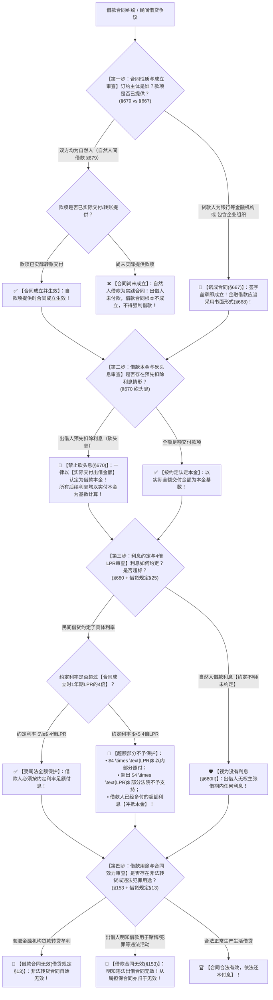

# 📐 借款合同与民间借贷 · 全流程答题模型（自然人实践合同 · 砍头息按实交算本金 · 约定不明视为无息 · 4倍LPR红线 · 非法转贷与违法用途无效 · §667-§680）

> **教练开场白**
> 同学们好！我是你们的民法法考教练。在典型合同分编中，“借款合同与民间借贷”是**每年必考、主客观题常年高频联动、且与老百姓生活最贴近的五星级顶级大户**！
> 很多同学做借贷题目时经常在以下几个“核心陷阱”里翻车：自然人说好借钱但没给钱，以为能告违约要求强制给钱；借 100 万扣了 10 万砍头息，算利息时还在拿 100 万做基数；自然人之间借条没写利息，债权人起诉要按银行同期利息付息；以为民间借贷还是“两线三区 24% 和 36%”的旧规。
> 《民法典》借款合同章（§667–§680）与最高人民法院《关于审理民间借贷案件适用法律若干问题的规定》（法释〔2020〕17号修正），构建了**以“自然人交付成立、砍头息按实算、没约利息视为白借、民间借贷咬死 4 倍 LPR、非法转贷明知犯罪一律无效”为核心的裁判规则体系**。
> 今天我们用**“四步连贯流水线”**，把借贷考点的全部数字与定性陷阱一次性彻底锁死：**第一步定合同性质与成立关（自然人实践交付成立 vs 金融机构诺成要式） → 第二步定本金与砍头息关（预扣利息一律按实付算本金算利息） → 第三步定利息与 4 倍 LPR 红线关（自然人约定不明视为无息 + 民间借贷利率封顶 $4 \times \text{LPR}$） → 第四步查违法效力与从属性关（套取贷款转贷与明知犯罪借款自始无效）**！

---

## 适用场景与解决问题

本模型专门解决借款合同成立与生效认定、借款本金核定、砍头息剔除、借期与逾期利息计算、民间借贷利率上限裁决、借款合同效力与担保责任的全部主客观题考点（对应 [[典型合同考点-深度报告]] 四·借款合同 Row 1/2/3/4/5 · ★★★★★ 顶级必考）：重点破解：

1. **第一步 · 合同性质与成立生效时点关（《民法典》§679/§667/§668）**：
   - ⭐ **自然人之间的借款合同 = 实践合同（§679）**：自贷款人**提供借款时成立**（如转账到账、现金交付时成立生效）；未提供借款前，合同**不成立**，借款人无权要求强制交付借款或主张违约责任！
   - **金融机构借款合同 / 非自然人借贷 = 诺成合同（§667/§668）**：双方意思表示一致即成立，金融借款应当采用**书面形式**（要式合同）。
2. **第二步 · 本金认定与砍头息剔除关（《民法典》§670）**：
   - ⭐ **禁止预先扣除利息（砍头息 §670）**：借款的利息不得预先在本金中扣除；
   - ⭐ **算账铁律**：出借人预先扣除利息的，**应当按照实际出借金额（实收金额）返还借款并计算利息**！所有后续利息与 4 倍 LPR 计算必须以实收金额为基数。
3. **第三步 · 利息约定与 4 倍 LPR 司法保护红线关（《民法典》§680 + 借贷规定§25）**：
   - ⭐ **自然人借款利息约定不明 = 视为无息（§680Ⅱ）**：自然人之间借款对支付利息没有约定或者约定不明确的，**视为没有利息**（出借人主张借期利息的法院不予支持）；
   - **非自然人借款利息约定不明**：结合合同内容、交易习惯、市场报价利率确定；
   - ⭐ **民间借贷 4 倍 LPR 刚性红线（借贷规定§25）**：
     - 民间借贷利率司法保护上限为**合同成立时一年期贷款市场报价利率（LPR）的四倍**；
     - $\text{约定利率} \le 4 \times \text{LPR}$ $\rightarrow$ **合法有效，照单全收**；
     - $\text{约定利率} > 4 \times \text{LPR}$ $\rightarrow$ **超额部分不予保护，超过部分已付的冲抵本金**！
4. **第四步 · 非法借贷效力与从属性关（《民法典》§153 + 借贷规定§13）**：
   - **转贷牟利无效**：套取金融机构贷款转贷的，借款合同**自始无效**；
   - **明知违法犯罪出借无效**：出借人明知借款人借款用于赌博、毒品、诈骗等违法犯罪活动的，借款合同**自始无效**；主合同无效，**从属的保证/抵押担保合同亦归于无效**（单选-45）。

> **核心一句**：**自然人借款看交付（给钱才成立，没约利息算白借）；金融机构诺成要书面；砍头息预扣一律按实收算本金；民间借贷利率死咬 4 倍 LPR（超额不算超付冲本金）；套取贷款来转贷、明知犯罪去出借，借款担保全无效！**
>
> 🔎 **核心法源（2026最新）**：《民法典》§153、§667、§668、§670、§674、§675、§676、§679、§680；《最高人民法院关于审理民间借贷案件适用法律若干问题的规定》（法释〔2020〕17号修正）第13条、第25条、第28条至第31条。

---

## 💡 【前置认知】自然人借款 vs 非自然人借贷 vs 金融借款极速对照表

| 借款合同类型 | 订约双方主体 | 合同性质（成立时点） | 形式要件 | 借期利息约定不明时的法律效果 | 利率司法保护上限 |
| :--- | :--- | :--- | :--- | :--- | :--- |
| **① 自然人间借款** | 双方均为**自然人** | **实践合同**（§679）<br>（**提供借款时成立**） | 不要式（口头/书面皆可） | ⭐ **视为没有利息**（§680Ⅱ）<br>（借期内一分利息不能要） | **合同成立时 1 年期 LPR 的 4 倍**（§25） |
| **② 非自然人借贷**<br>（企业间/自然人与企业） | 一方或双方为**法人/非法人组织** | **诺成合同**（§667）<br>（签字盖章即成立） | 不要式（建议书面） | 结合合同、交易习惯、市场利率确定 | **合同成立时 1 年期 LPR 的 4 倍**（§25） |
| **③ 金融机构借款** | 贷款人为**银行等持牌金融机构** | **诺成合同**（§667）<br>（签字盖章即成立） | **要式合同**（§668）<br>（**应当采用书面形式**） | 按照中国人民银行规定与合同约定确定 | 不受民间借贷 4 倍 LPR 限制，执行金融监管规定 |

---

## 一、 考点核心骨架与法理（四步连贯决策树）



```
【借款合同全景】一句话开场：自然人借钱给钱才成立，没约利息算白借；砍头息按实收算本金；民间借贷咬死 4 倍 LPR；非法转贷明知犯罪合同全废掉！
│
▼ 第一步 · 查性质与成立时点 ── 实践 vs 诺成（§679/§667）
├─ 自然人之间借款（§679）：─────────────────────────────────────────→ ⭐【实践合同】（提供借款时成立；没给钱不成立）
└─ 金融机构借款 / 企业间借贷（§667/§668）：─────────────────────────→ 🏢【诺成合同】（签字成立；金融借款要式书面）
     │
     ▼ 第二步 · 查本金与砍头息剔除 ── 严禁预扣（§670）
     ├─ 出借人预先扣除利息（砍头息）：─────────────────────────────→ 🚨【按实收金额认定本金并算利息】！
     └─ 全额足额交付：─────────────────────────────────────────────────→ ✅ 按全额认定本金
          │
          ▼ 第三步 · 查利息与 4 倍 LPR 红线 ── 利率司法规制（§680 + 借贷规定§25）
          ├─ 自然人借款利息约定不明：────────────────────────────────→ 🛡️【直接视为没有利息】（§680Ⅱ）
          └─ 民间借贷约定利息：
               ├─ 约定利率 $\le 4 \times \text{LPR}$ ─────────────────────────────→ ✅ 合法有效，全额支持
               └─ 约定利率 $> 4 \times \text{LPR}$ ─────────────────────────────→ 🚨 超过 4 倍 LPR 部分不予支持，已付的冲抵本金！
                    │
                    ▼ 第四步 · 查违法用途与合同效力 ── 转贷与犯罪（§153 + 借贷规定§13）
                    ├─ 套取金融机构贷款转贷牟利：───────────────────────────→ 🚨【借款合同无效】！
                    └─ 出借人明知借款用于赌博、诈骗等违法犯罪：─────────────→ 🚨【借款合同无效】＋【从属担保合同亦无效】！

  ━━━ 四步全通 ━━━
```

---

## 二、 核心考情与 2026 民法典精要

- **频次研判**：借款合同与民间借贷是民法典合同编分则**★★★★★ 顶级必考母题**；客观题每年必考 1–2 题，主观题常作为民商交叉大题的借贷事实载体。
- **命题核心**：
  1. **自然人借款的实践属性（§679）**：口头协议答应借 10 万但反悔没给，**借款合同不成立**，出借人不担违约责任。
  2. **砍头息的计算惩罚（§670）**：预扣利息的，本金按实收金额认定，利息基数按实收金额计算。
  3. **自然人利息约定不明（§680Ⅱ）**：没有约定利息或约定不明的，**视为没有利息**（借期无息，但逾期可依 LPR 要逾期利息）。
  4. **4 倍 LPR 刚性红线（借贷规定§25）**：民间借贷利率上限以**合同成立时 1 年期 LPR 的 4 倍**为准，彻底废止旧法 24% 和 36%。
  5. **违法借贷与担保从属性（§153 + 担保解释）**：明知借款用于赌博出借，借款合同无效，抵押和保证合同因从属性亦全部无效。

---

## 三、 三大核心法理与命题陷阱拆解

### 1. 借款合同四大命题暗坑与裁判标准表

| 案件事实设定 | 争议焦点 | 裁判结论 | 命题陷阱与法理深剖 |
|---|---|---|---|
| 自然人甲答应借给自然人乙 20 万元并签了借款协议，次日甲因故拒绝转账。乙起诉要求甲履行借款义务。 | 自然人借款合同签字未转账，合同成立了吗？ | ❌ **合同未成立，驳回起诉！** | 《民法典》§679：自然人间借款为**实践合同**，提供借款时成立；款未提供合同未成立，乙无权强求（单选-07）。 |
| 甲向乙借款 100 万元，双方在借条中约定年利率 10%。乙在转账时预先扣除首年利息 10 万元，实转 90 万元。 | 借期届满乙应如何主张本金与利息？ | ✅ **本金按 90 万认定，利息按 $90\text{万} \times 10\% = 9\text{万}$ 计算！** | 《民法典》§670：**禁止砍头息**；预扣的应当按照**实际出借金额（90万元）**返还借款并计算利息（单选-08）。 |
| 自然人甲向自然人乙借款 50 万元，借条写明“借期一年”，未提及利息。一年后乙要求甲按同期银行利率付息。 | 借条未写利息，自然人出借人能否主张借期利息？ | ❌ **视为没有利息，不得要借期利息！** | 《民法典》§680Ⅱ：自然人之间借款对支付利息没有约定或者约定不明确的，**视为没有利息**（多选-06）。 |
| 甲向民间出借人乙借款 10 万元，约定年利率 20%（此时 1 年期 LPR 为 3.45%，4倍为 13.8%）。借款到期。 | 约定年利率 20% 超过了 4 倍 LPR，法院如何判决？ | 🚨 **支持按 13.8% 付息，超额部分（6.2%）不予支持！** | 《民间借贷规定》§25：民间借贷利率上限为**合同成立时 1 年期 LPR 的 4 倍**（13.8%），超出的 6.2% 司法不予保护（多选-43）。 |

### 2. 借期利息 vs 逾期利息（违约利息）的精准区分

| 利息类型 | 产生时间段 | 约定不明时的法律效果 | 司法规制上限 |
|---|---|---|---|
| **借期内利息（§680）** | 借款成立日至约定还款日 | • **自然人间**：视为**没有利息**；<br>• **非自然人间**：按交易习惯与市场利率。 | 借款合同成立时 1 年期 LPR 的 4 倍 |
| **逾期利息（借贷规定§28）** | 约定还款日次日起至实际清偿日 | • 未约定借期利息也未约定逾期利息：**可按同期 LPR 计收逾期资金占用费**；<br>• 约定了借期利息未约定逾期利息：**可按借期利率计收逾期利息**。 | 逾期利息、违约金总计不得超过 **4 倍 LPR** |

---

## 四、 万能解题四步

---

### 第一步：查性质与成立关 —— 给钱没有？合同成立了吗？（《民法典》§679/§667）

> **教练提示**：
> 1. 看订约主体：**双方都是自然人** $\rightarrow$ **实践合同（§679）**；
>    - 必须**实际给钱（现金交付/转账到账）合同才成立**！没给钱前合同不成立，不能告违约；
> 2. 只要有一方是**企业法人/银行** $\rightarrow$ **诺成合同（§667）**，签字盖章即成立生效。

---

### 第二步：查本金与砍头息关 —— 预扣利息没有？（《民法典》§670）

> **教练提示**：
> 1. 如果出借人给钱时把利息预先扣掉了（砍头息）：
>    - ⭐ **借款本金 = 实际交付金额（实到账金额）**；
>    - ⭐ **计算利息的基数 = 实际交付金额**；
> 2. 题干中所有以“合同约定借款数额（虚高名义数额）”计算本息的选项**全部一秒排除**！

---

### 第三步：查利息与 4 倍 LPR 关 —— 利率合法吗？（《民法典》§680 + 借贷规定§25）

> **教练提示**：
> 1. **自然人借款没写利息 / 约定不明** $\rightarrow$ **直接视为没有利息（白借 §680Ⅱ）**；
> 2. **约定了利息的民间借贷**：
>    - 算红线：$\text{红线} = \mathbf{4 \times \text{合同成立时 1 年期 LPR}}$；
>    - 利率在红线内 $\rightarrow$ 合法有效全额支付；
>    - 利率超红线 $\rightarrow$ 超额部分无效不付，已多付的**自动冲抵本金**！

---

### 第四步：查违法用途与从属性关 —— 转贷了没有？犯罪了没有？（《民法典》§153 + 借贷规定§13）

> **教练提示**：
> 1. **套取金融机构贷款转贷牟利** $\rightarrow$ 借款合同**自始无效**；
> 2. **出借人明知借款人借款用于赌博、毒品、洗钱等违法犯罪活动** $\rightarrow$ 借款合同**自始无效**；
> 3. 主借款合同无效的，从属的保证合同、抵押担保合同**一律归于无效**（单选-45）！

#### 💰 完整数字案例：民间借贷砍头息与 4 倍 LPR 攻防实战

> **【案情（[[典型合同-单选-08]] 与 [[典型合同-多选-43]] 综合演练）】**
> 自然人甲因资金周转向自然人乙借款。2024年5月1日，双方签订书面《借款合同》，约定：“甲向乙借款 **100 万元**，借期 1 年；年利率约定为 **20%**，借款到期时一次性还本付息”。
> 2024年5月2日，乙向甲转账时预先扣除首年利息 20 万元，**实际向甲转账交付 80 万元（扣除砍头息）**。
> （假定合同成立时中国人民银行公布的 1 年期 LPR 为 **3.45%**，其 4 倍为 $3.45\% \times 4 = \mathbf{13.8\%}$）。
> 2025年5月1日借款期满，乙起诉要求甲偿还本金 100 万元及利息 20 万元，合计 120 万元。
>
> 1. **第一步（性质与成立）**：双方为自然人借款，2024年5月2日乙实际提供款项时，**借款合同正式成立并生效（§679）**；
> 2. **第二步（本金认定与砍头息剔除）**：乙预先扣除利息 20 万元构成砍头息，依据《民法典》§670，**本案借款本金应当认定为实际出借金额 80 万元**（非 100 万元）；
> 3. **第三步（利息与 4 倍 LPR 裁决）**：
>    - 本案合同成立时民间借贷利率司法保护上限为 $4 \times 3.45\% = 13.8\%$；
>    - 双方约定的年利率 20% 超过了 4 倍 LPR 刚性红线（13.8%），超出的 $20\% - 13.8\% = 6.2\%$ 部分**人民法院不予支持**；
>    - 合法利息计算：以实到本金 80 万元为基数，合法利息为 $80\text{万元} \times 13.8\% = \mathbf{11.04\text{万元}}$；
> 4. **终局裁判结论**：
>    - 法院判决甲向乙偿还**本金 80 万元**及**借期利息 11.04 万元**，合计 **91.04 万元**；乙主张的其余款项全部依法驳回！

#### 一句话闭环记忆
> 🎯 **一眼判**：**自然人借款看交付（给钱才成立，没约利息算白借）；金融机构诺成要书面；砍头息预扣一律按实收算本金；民间借贷利率死咬 4 倍 LPR（超额不算超付冲本金）；套取贷款来转贷、明知犯罪去出借，借款担保全无效！**

---

## 五、 案例演练

### 1. 自然人借款实践合同成立要件（[[典型合同-单选-07]] 经典真题）
- **案情**：自然人间订立借款合同后，出借人反悔未提供款项，借款人起诉要求出借人承担违约责任并交付借款。
- **模型分析**：第一步——依据《民法典》§679，自然人借款自贷款人提供借款时成立；贷款人未提供借款，合同不成立，借款人无权主张违约责任（选 A）。

### 2. 禁止砍头息与实际本金计算（[[典型合同-单选-08]] 经典真题）
- **案情**：借款 10 万元预扣利息 1 万元实付 9 万元。到期出借人起诉要求按 10 万元本金还本付息。
- **模型分析**：第二步——依据《民法典》§670，禁止扣除砍头息，本金按实际出借金额 9 万元认定，利息亦以 9 万元为基数计算。

### 3. 明知借款用于犯罪借款合同无效与担保从属性（[[典型合同-单选-45]] 经典真题）
- **案情**：出借人明知借款人借款用于开设赌场，仍出借资金并由第三人提供房屋抵押担保。
- **模型分析**：第四步——依据《民间借贷规定》第 13 条及《民法典》§153，出借人明知借款用于犯罪活动的借款合同自始无效；依据担保从属性，从属的抵押担保合同亦全部无效。

---

## 关联真题

- [[典型合同-单选-07]] · 自然人间借款合同实践性与成立时点
- [[典型合同-单选-08]] · 禁止砍头息与实际出借金额本金认定
- [[典型合同-多选-06]] · 自然人借款利息约定不明视为无息规则
- [[典型合同-多选-43]] · 禁止高利放贷与民间借贷 4 倍 LPR 司法保护上限
- [[典型合同-单选-41]] · 金融机构借款合同诺成与书面要式
- [[典型合同-单选-45 · 借款用于违法犯罪活动合同无效与担保从属性案]] · 借款用途违法借款合同无效与担保从属性

## 相关页面

- 概念实体页：[[借款合同]] · [[民间借贷]]
- 姊妹模型：[[民法-合同-保证模型]]（保证方式与先诉抗辩） · [[民法-合同-违约责任模型]]（违约救济总调度）
- 综合报告：[[典型合同考点-深度报告]]（四、借款合同 · Row 1/2/3/4/5 · ★★★★★ 顶级必考）
