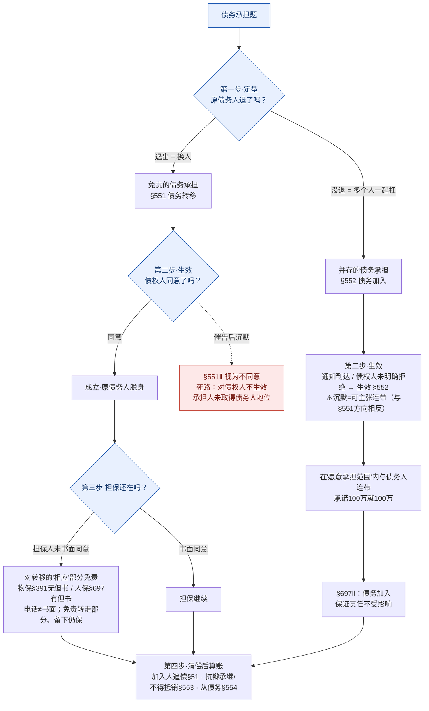

# 📐 债务承担 · 答题模型（退没退 → 谁点头 → 担保还在吗 → 清偿后怎么算）

> 凡"第三人把债接过去 / 一起扛"的题，按这四步走。灵魂只有一句：**先问原债务人"退没退"，再问"谁点头"。**
> **姊妹 / 概念** → [[债务承担]]（概念 + 故事）· [[债权转让]]（转让块的另一半 · 对照）· [[民法-合同-保证与债务加入辨析模型]]（债加入 vs 保证）· [[民法-合同-保证模型]] 第四步（债务转移→保证人脱责 §697）。
> **适用真题**：[[合同通则-单选-52|C1单选-52·免责须债权人同意]] · [[合同通则-单选-57|C1单选-57·欠款人签字=债务加入]] · [[合同通则-单选-59|C1单选-59·代为清偿求偿§524]] · [[合同通则-多选-33|C1多选-33·担保人书面同意]] · [[合同通则-多选-34|C1多选-34·债务加入通知即生效+限额]]。
>
> 🔎 **法条已联网核实（2026-06-14，3 路独立考证 + 对抗复核，全 CONFIRMED·HIGH）**：民法典 **§551/§552/§553/§554/§391/§697/§524/§519** 逐字命中[最高检官网](https://www.spp.gov.cn/spp/ssmfdyflvdtpgz/202008/t20200831_478413.shtml)（§391 物权编[原文](https://www.spp.gov.cn/spp/ssmfdyflvdtpgz/202008/t20200831_478410.shtml)，§697 第二款以[最高法公报版](http://gongbao.court.gov.cn)为准）。**司法解释**：增信文件性质不明推定为保证＝**《担保制度解释》(法释〔2020〕28号)§36**；债务加入人追偿权＝**《合同编通则解释》(法释〔2023〕13号)§51**；代位权仲裁协议不对抗＝通则解释§36。
> ⭐ **考频**：**★★★★ 高频**——法大法考**必考清单**点名"债务承担（含并存）"；**债务加入（§552）是《民法典》新设制度** + 通则解释"债务加入人追偿权"系**9 大创新之一**（命题关注度显著高于债务转移）。

## 🗺️ 一页流程图（先白纸默画"退没退→谁点头"主干，再对照查漏）

## 一、核心考情

- **频率**：★★★★ 高频（法大法考必考清单"债务承担（含并存）"在列 + 通则解释"9 大创新"之债务加入人追偿权）；客观题常考 1 道，主观题合同纠纷常涉。
- **命题核心**：永远围绕"**债务主体怎么变**"——是**换人**（免责承担）还是**加人**（并存承担/债务加入），由此牵出"**同意 vs 通知**""**担保人免不免责**""**加入人能不能追偿**"。全是"看着对、其实错"的对照陷阱。
- **三大必考点**：①免责（§551 须**同意**）vs 并存（§552 **通知**即生效）的分水岭 ②债务转移触发的**担保人书面同意**连锁（§391/§697）③债务加入人**追偿权**（§51）+ 新债务人**抗辩承继但不得抵销**（§553）。

## 二、万能四步模型

### 第一步：先定型——原债务人"退没退"？（第一步错，全题错）

**铁则**：债务承担＝债务主体变动，分水岭是**原债务人有没有脱离债务关系**——
- **退出（换人）** → **免责的债务承担**（债务转移，§551）：新债务人**取代**原债务人。
- **没退、一起扛（加人）** → **并存的债务承担 / 债务加入**（§552）：第三人**加入**，与原债务人**连带**。

> ⚠️ 与"第三人介入债务"的另两张面孔分清（详见 [[第三人介入债务的四种结构-对比]]）：
> - **§524 第三人代为清偿**：债务人**不变**，只是第三人替还，受领后债权**法定转让**给第三人 → 是"还"不是"换/加"。
> - **保证（§681）**：保证人**从属 + 补充**（一般保证有先诉抗辩权）；债务加入是**独立、同顺位连带**，责任更重。

**老王小李例子**（老王＝债权人，小李＝债务人，老张＝第三人，老赵＝担保人）
- ✅ 免责承担：小李让老张**接替**自己当债务人、自己退出 = 换人（§551）。
- ✅ 并存承担：小李没退，老张说"这债我**也一起扛**" = 加人（§552）。
- ❌ 不是承担：老张只是**替小李还了这一笔**（债务人没变、还完债就消灭）= §524 代为清偿，不是债务承担。

### 第二步：看生效要件——"谁点头"？（同意 vs 通知）★核心

**铁则**：
- **免责承担（§551）须债权人"同意"**：换债务人＝换偿付能力，对债主有风险，**必须债主点头**。债务人/第三人可催告债权人在合理期限内同意，**债权人沉默＝视为不同意**（§551Ⅱ）。未同意 → 对债权人**不生效**，承担人**根本没成为债务人**。
- **并存承担（§552）只需"通知"**：加人＝多个责任人，对债主**有利**，故**通知到达即生效**；或第三人径向债权人表示愿加入、**债权人未在合理期限内明确拒绝**即可。债务加入**有限额**——只在第三人**愿意承担的范围**内与债务人连带。

> ⚠️ **两个"沉默"方向相反（最高频陷阱）**：§551 催告后债权人沉默＝**不同意**（债务转移**不**成立）；§552 第三人表示加入后债权人沉默（未明确拒绝）＝债权人**可主张**连带（债务加入**成立**）。同样是"未答复"，一个砸、一个成。

**老王小李例子**
- 免责须同意：小李让老张接债退出，但只**电话告诉**老王、老王被催告后**不吭声** → §551Ⅱ 视为不同意 → 老张没成为债务人，老王仍只能找小李（[[合同通则-单选-52|单选-52]]）。
- 并存通知即生效：老张对老王说"小李这 200 万我加入、但我只认 **100 万**"并通知老王 → 通知一到就生效，**不用**老王同意；老张只在 **100 万**内与小李连带（[[合同通则-多选-34|多选-34]]）。

### 第三步：查连锁反应——担保还在吗？（§391 物保 / §697 人保）

**铁则（仅债务"转移/免责"时触发，债务"加入"不触发）**：
- **债务转移**：担保人**未经书面同意**，债权人允许债务人转移债务的 → 担保人对**转移的"相应"部分**不再担保（§391/§697）。
  - **免责的是"转走的那部分"，留下的仍保**（500 万转走 200，担保人保 **300** 不是 200）。
  - **书面**才算数：电话 / 口头 / 短信通知 ≠ 书面同意。
  - **物保（§391）无"另有约定除外"**但书；**人保（§697）有**"债权人和保证人另有约定的除外"——这是物保 vs 人保的核心差异（见[[担保]]）。
  - 债务转移**本身有效、不以担保人同意为前提**；担保人未书面同意的后果是**担保人脱责**，**不是**"转移须经担保人同意"或"转移无效"。
- **债务加入**：§697 第二款——"第三人**加入**债务的，保证人的保证责任**不受影响**"。加人不动担保（多了责任人，对债主更有保障）。

**老王小李例子**
- 老赵拿房子给小李这笔 500 万债作**抵押**（物保）。小李把其中 200 万转给老张，只给老赵**打了个电话**（没书面签字）→ §391：老赵只保**没转走的 300 万**，转走的 200 万不保了（[[合同通则-多选-33|多选-33]]，答 AD）。
- 若老赵是**保证人**（人保§697）且当初**书面约定**"转移后仍担保" → 该约定**有效**，老赵仍保 500（物保则该约定无空间，§391 无但书）。
- 若是老张**加入**（不是转移）→ 老赵的担保**原样不变**（§697Ⅱ）。

### 第四步：算追偿与从抗辩——清偿后怎么算账？（§51 / §553 / §554 / §524）

**铁则**：
- **债务加入人追偿权（通则解释§51）**：加入人对外清偿后——**约定**了追偿权 → 按约定追偿；**没约定** → 依**不当得利**在其**已履行范围内**向债务人请求（但加入人**明知/应知**加入会损害债务人利益的除外）。法理类推 §519 连带债务内部追偿。
- **新债务人的从抗辩（§553）**：免责承担的新债务人**可主张**原债务人对债权人的**抗辩**；但原债务人对债权人享有债权的，新债务人**不得**主张**抵销**（抵销权属原债务人处分范围）→ **抗辩可承继、抵销不可承继**。
- **从债务随转移（§554）**：与主债务有关的从债务（利息、违约金等）由新债务人承担，**专属于原债务人自身的除外**。
- **§524 代为清偿求偿**：债务人若对外清偿、而真正约定承债的是第三人，债务人构成 §524 代为清偿 → **法定取得对该第三人的求偿权**（[[合同通则-单选-59|单选-59]]，答 D）。

**老王小李例子**
- 老张作为**加入人**替小李对外还了 100 万 → 回头找小李追偿：有约定按约定，没约定按不当得利（§51）。
- 老张接债后，小李原本能拿"货有瑕疵"对抗老王的**抗辩**，老张**照样能用**（§553）；但小李对老王另有一笔债权，老张**不能拿它去抵销**（§553）。

### ➕ 衔接：债务加入 vs 保证（易混，单独成模型）

两者都"替债务人扛"，但债加入是**独立连带债务**（无保证期间 / 无先诉抗辩）、保证是**从债务**（有期间 + 补充性）；**意思不明 → 推定为保证**（担保解释§36）。详见 [[民法-合同-保证与债务加入辨析模型]]。

## 三、命题人最爱的 5 个陷阱

1. **转债权 vs 转债务的"同意"混淆** —— [[债权转让]]只需**通知**债务人（§546，对抗要件）；免责的债务转移须债权人**同意**（§551，生效要件）。命题最爱把"债权转让须经债务人同意"安给你（单选-52 的 A 镜像陷阱）。
2. **两个"沉默"当成同一方向** —— §551 催告后债权人沉默＝**不同意**（转移砸）；§552 表示加入后债权人未明确拒绝＝**可主张连带**（加入成）。
3. **债务加入须债权人同意才生效** —— 债务加入**通知即生效**（§552），"须同意"是免责承担（§551）的规则（多选-34 的 D）。
4. **担保人未书面同意 → 担保人对"留下部分"免责** —— 免责的是**转走的"相应"部分**，留下的仍保（500 转 200，保 **300**）；且**物保§391 无但书、人保§697 有但书**；**电话≠书面**（多选-33 的 B、C）。
5. **未同意/未通知 → "无效"** —— 债务转移未同意、债权转让未通知，多是"**对债权人/债务人不生效·不对抗**"，**不是"无效"**；当事人**内部约定仍有约束力**，可据以求偿（单选-59 的 A/B/C 错、D 对）。

> 🎯 **加分易混（性质不明怎么定？）**：第三人提供差额补足/流动性支持等增信文件，**性质不明时推定为"保证"**（《担保制度解释》法释〔2020〕28号 **§36Ⅲ**）——因为保证责任较轻、给第三人留余地。但若文件明确以"**欠款人 / 共同承担**"表述 → 直接定**债务加入§552**（单选-57）。**债务加入 vs 保证**：加入＝独立、同顺位连带、抗辩窄；保证＝从属、补充、有先诉抗辩（一般保证）、有追偿（§700）。

## 四、真题演练

### 范例①：[[合同通则-单选-52|单选-52]]（债务转移未经债权人同意 → 代位权诉讼次债务人抗辩）→ **B**
- 第一步·定型：丙→戊是**免责的债务承担**（换债务人）。
- 第二步·生效：**未经债权人乙同意** → §551 对乙**不生效**，戊**根本不是债务人**。
- 推论：丁对"非债务人"戊提代位权诉讼，次债务人不适格 → 戊抗辩"我不是债务人"成立 → **B**。

### 范例②：[[合同通则-单选-57|单选-57]]（乙公司与丙以"欠款人"身份共同出欠条）→ **C**
- 第一步·定型：丙以"**欠款人**"身份签字 = 加入意思明确，**乙公司未退出** → 并存的债务承担（§552）。
- 排除：A 代为清偿（只是签字承诺、未当场还）；B 免责承担（乙没退）；D 无因管理（丙有利益关联）→ **C**。

### 范例③：[[合同通则-多选-34|多选-34]]（丙加入只认 100 万、通知乙、已还 50）→ **AB**
- 第二步·生效：债务加入**通知即对乙生效**（A 对）；"自乙同意时才有效"是把 §552 错套成 §551（D 错）。
- 限额：丙只在**承诺的 100 万**内连带，已还 50 → 乙可再请求 **50 万**（B 对），不是 150 万（C 错）→ **AB**。

### 范例④：[[合同通则-多选-33|多选-33]]（500 万转走 200 万、仅电话通知抵押人钱某）→ **AD**
- 第三步·连锁：钱某系**物保（房产抵押）**→ §391；仅**电话通知**≠书面同意 → 对**转走的 200 万免责**，仅就剩 **300 万**担保（A 对）；担保范围 500→300 即**发生变化**（D 对）。
- 排除：B 把免责范围搞反；C 把"担保人同意"误当"转移生效前提"→ **AD**。

### 范例⑤：[[合同通则-单选-59|单选-59]]（债权连环转让 + 债务转移，乙清偿后能否向戊求偿）→ **D**
- 第二步：甲→丙→丁的债权转让**有效**，仅因未通知乙而对乙不生效（A、B"无效"错）；乙→戊的债务承担对内有约束力（C"无效"过于绝对）。
- 第四步：乙若对外清偿，构成 **§524 代为清偿** → 法定取得对真正承债人戊的**求偿权** → **D**。

### 范例⑥：§697 担保连锁计算练习（无对应题卡 · 规则演练）
**题设**：甲乙签 3 年供货合同，丙在 2000 万内作一般保证。两年后未付货款 2022 万，乙免除 22 万尾款，并同意甲转 500 万给丁，均未通知丙。丙应承担多少保证责任？→ **1500 万**

- 第三步·担保连锁：
  - §575 免除 22 万 → 债务降至 **2000 万**；
  - §697Ⅰ 转 500 万**未经丙书面同意** → 丙对转走 500 万**脱责**；
  - **2022 − 22 − 500 = 1500 万**，在 2000 万限额内 → **1500 万**。
  - 陷阱：§686 方式不明推定**一般保证**（非连带）；仅算免除漏算 §697 = 选错 2000 万。

## 📐 口诀

> **"先看原债务人退没退：退＝转移（须债权人同意）、没退＝加入（通知即生效、有限额）。**
> **转债权只通知、转债务要同意（别搞反）。**
> **债务转移没问担保人（书面）→ 担保人只保没转走的那部分（§391/§697；物保无但书、人保有但书）。**
> **债务加入人替还了能向原债务人追偿（§51）；分不清加入还是保证 → 推定为保证（担保解释§36）。"**

## 相关页面

- 上层 / 概念：[[债务承担]]（§551-§554 概念 + 老王小李四场景）· [[债]] · [[合同总则]]
- 对照：[[债权转让]]（§545 · 通知）· [[第三人代为履行]]（§523/§524 · 辨析）· [[债的法定移转]]
- 辨析：[[第三人介入债务的四种结构-对比]]（§522/§523/§524/§551/§552 五型一图）
- 衔接：[[民法-合同-保证与债务加入辨析模型]]（债加入 vs 保证）· [[民法-合同-保证模型]] 第四步（§697）· [[担保]]（§391）
- 综合报告：[[合同总则考点-深度报告]] 五·转让 · [[债务承担-深度报告]]
