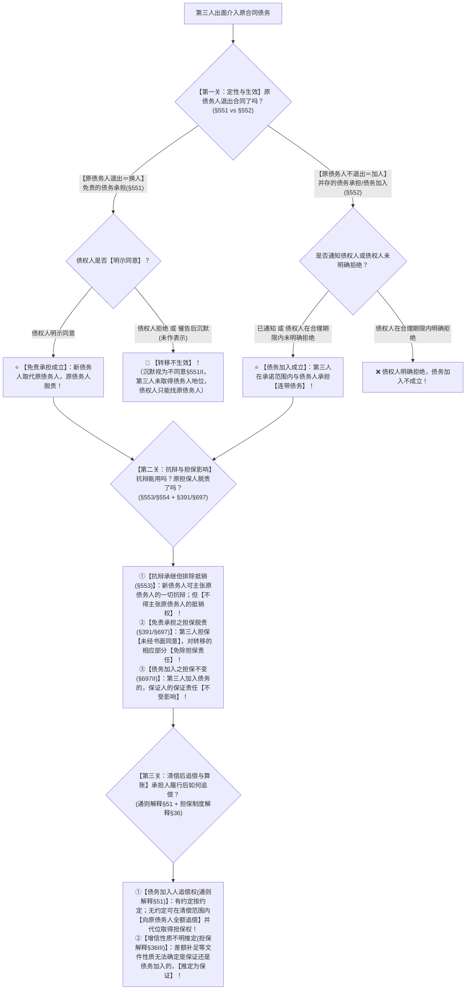

# 📐 债务承担 · 全流程答题模型（免责承担须同意 · 债务加入通知即生效 · 第三人担保脱责 · 追偿权解释§51）

> **教练开场白**
> 同学们好！我是你们的民法法考教练。在合同主体变动板块中，如果说“债权转让”是**换要钱的人（卖债权只需通知）**，那么“债务承担”就是**换还钱的人 / 添还钱的人（转债务须债主点头）**！ @!
> 很多同学做债务承担的题目经常掉入四大命题陷阱：原债务人到底退出了没有？债权人没吭声到底算答应了还是拒绝了？新来的人能不能拿老债务人的抵销权去抵债？债务转移后原本提供房产抵押的担保人还能不能被追责？第三人替老赖还完钱到底能不能找老赖全额追偿？
> 《民法典》第 551–554 条、第 391/697 条以及 2023 年《合同编通则司法解释》第 51 条，确立了**“免责换人须同意、并存加人连带担、物保脱责书面定、清偿之后全追偿”**的严密裁判体系。今天我们用**“三关连贯流水线”**，把债务承担的定性、生效、抗辩、担保脱责与追偿权一次性彻底锁死：**第一关定性与生效（免责换人 vs 并存加人） → 第二关抗辩与担保（抵销排除 vs 第三人担保脱责） → 第三关清偿与追偿（法定追偿权与代位受偿）**。

---

## 适用场景与解决问题

本模型专门解决合同债务转让与增信板块中“债务承担与债务加入”的全部主客观题考点（对应 [[合同总则考点-深度报告]] 五·转让 row 2 · ★★★★ 重点考点）：重点破解： @!

1. **定性与生效要件关**：严格区分**免责的债务承担（换人，原债务人退出）** vs **并存的债务承担/债务加入（加人，原债务人不退出，承担连带债务）**；
   - **《民法典》§551（免责承担）**：必须经债权人**同意**（生效要件！），债权人催告后未作表示的**视为不同意（沉默＝拒绝）**；
   - **《民法典》§552（债务加入）**：只需**通知**到达债权人，或者债权人在合理期限内未明确拒绝的**直接成立连带责任（沉默＝接受）**；承诺有限额的按限额承担；
2. **抗辩承继与担保脱责关**：
   - **《民法典》§553（抗辩承继但排除抵销）**：新债务人可以主张原债务人对债权人的抗辩；但原债务人对债权人享有债权的，**新债务人不得向债权人主张抵销**（抵销权具有专属性！）；
   - **《民法典》§391 / §697（第三人担保脱责铁律）**：债务转移未经**第三人担保人书面同意**的，担保人对**转移的相应债务部分不再承担担保责任**（物保§391无但书，人保§697有但书；仅免除转走部分，留下部分仍保；债务加入则担保责任不受影响 §697Ⅱ）；
3. **清偿后追偿与意思推定关**：
   - **《合同编通则解释》§51（债务加入人追偿权突破）**：债务加入人履行后，有约定按约定；无约定的，**在其清偿范围内向原债务人全额追偿（享有法定追偿权）**，并享有债权人原有的担保权利（代位受偿）；
   - **《担保制度解释》§36Ⅲ（增信文件性质不明推定规则）**：增信文件表述不明、无法区分是保证还是债务加入的，**推定为保证**！

> **核心一句**：**免责换人须债主点头（沉默算拒绝），并存加人通知即生效（沉默算连带）；新债务人可举抗辩不可抵销；债务转移没经书面同意第三人物保人保转走部分全免责（加人不影响担保）；替还之后享全额追偿，意思不明推定为保证！**
>
> 🔎 **核心法源（2026最新）**：《民法典》§551、§552、§553、§554、§391、§697、§519、§524；**《最高人民法院关于适用〈中华人民共和国民法典〉合同编通则若干问题的解释》（法释〔2023〕13号）第51条（债务加入人追偿权）；《最高人民法院关于适用〈中华人民共和国民法典〉有关担保制度的解释》（法释〔2020〕28号）第36条（增信文件性质推定）**。

---

## 💡 【前置认知】第三人介入债务四大形态极速辨析表（考场防混淆总纲） @!

法考命题人最喜欢用“第三人替还 / 第三人出面 / 第三人签字”来混淆考点，看清**“债务人退没退、第三人担什么责”**，一秒定型：

| 制度形态               | **债务人退没退** | **第三人法律地位与责任**                         | **生效要件（谁点头）**            | 核心法条           | 对应模型                         |
| :----------------- | :--------- | :------------------------------------- | :----------------------- | :------------- | :--------------------------- |
| **① 免责的债务承担（换人）**  | **完全退出**   | **成为唯一主债务人**（原债务人脱责）                   | 必须经债权人**同意**（催告沉默＝视为不同意） | 《民法典》§551      | **[[民法-合同-债务承担模型]]**（本模型通道一） |
| **② 债务加入（加人）**     | **不退出**    | 与原债务人承担**连带债务**（同顺位）                   | **通知**即生效（债权人沉默＝可主张连带）   | 《民法典》§552      | **[[民法-合同-债务承担模型]]**（本模型通道二） |
| **③ 第三人代为履行（帮忙还）** | **不退出**    | 只是**履行辅助人 / 代清偿人**，不是合同当事人，不对债权人承担违约责任 | 无需同意（第三人自愿履行或合法利益代偿）     | 《民法典》§523/§524 | [[民法-合同-涉他合同与代为履行模型]]        |
| **④ 保证担保（从属性兜底）**  | **不退出**    | 承担**从属性、补充性/连带保证责任**（有保证期间与先诉抗辩）       | 保证人与债权人订立**保证合同**（书面）    | 《民法典》§681      | [[民法-合同-保证模型]]               |

---

## 一、 考点核心骨架与法理（三关连贯决策树）@!



```
【债务承担纠纷】一句话开场：换人还钱还是加人一起还？债主不吭声算不算？原来的抵押房产还保不保？
│
▼ 第一关 · 定性与生效 ── 退没退与谁点头（§551 vs §552）
├─ 【免责的债务承担】（换人，原债务人退出）：
│    ├─ 生效要件：必须经债权人【明示同意】（§551Ⅰ，生效要件）
│    └─ 沉默效力：催告后债权人未作表示的 ──→ 🚨【视为不同意】（§551Ⅱ，转移不生效！）
└─ 【并存的债务承担/债务加入】（加人，原债务人不退出）：
     ├─ 生效要件：通知债权人即生效，或债权人在合理期限内未明确拒绝即成立（§552）
     └─ 责任形态：第三人在【承诺承担的限额内】与原债务人承担【连带债务】！
          │
          ▼ 第二关 · 抗辩承继与担保脱责 ── 抵销排除与第三人担保脱责（§553/§554 + §391/§697）
          ├─ 抗辩权承继（§553）：新债务人可以主张原债务人对债权人的抗辩（无效/延期/时效届满）
          ├─ 抵销权排除（§553）：⭐【不得主张原债务人的抵销权】（抵销权属原债务人专属处分权！）
          ├─ 第三人担保脱责（§391 物保 / §697 人保 · 仅免责转移时触发）：
          │    ├─ 未经第三人担保人【书面同意】的 ──→ 担保人对【转走的相应部分免责】，留下部分仍保！
          │    └─ 形式严格：电话/口头通知无效，必须是【书面同意】！
          └─ 债务加入之担保责任（§697Ⅱ）：第三人加入债务的，保证人与抵押人的担保责任【不受影响】！
               │
               ▼ 第三关 · 清偿后追偿与性质推定 ── 追偿权与意思推定（通则解释§51 + 担保解释§36）
               ├─ 债务加入人追偿权（通则解释§51）：
               │    ├─ 有约定按约定；无约定可在清偿范围内【向原债务人全额追偿】！
               │    └─ 享有代位受偿权：可直接向原债务人主张原债权享有的担保物权
               └─ 性质不明推定（担保制度解释§36Ⅲ）：增信文件性质不明时，【推定为保证】！

  ━━━ 三关全过 ━━━
```

---

## 二、 核心考情

- **频次研判**：债务承担与债务加入是《民法典》合同编通则转让板块的**核心高频考点（★★★★ 重点必考）**；《民法典》§552 首次正式确立“债务加入”制度，《合同编通则司法解释》§51 首次全面统一“债务加入人追偿权”，是近年来法考客观题与主观题的兵家必争之地。
- **命题核心**：
  1. **转债权通知 vs 转债务同意（单选-52）**：债权转让通知即生效（对抗要件）；免责债务承担未经债权人同意对债权人不发生效力。
  2. **两个“沉默”效力绝对相反**：免责承担中债权人沉默＝**视为不同意（拒绝）**；债务加入中债权人沉默＝**成立连带责任（接受）**。
  3. **新债务人不得抵销（§553）**：新债务人承继抗辩权，但绝不能拿原债务人对债权人的反向债权去抵销。
  4. **第三人担保脱责计算（§391/§697 + 多选-33）**：未经担保人书面同意，仅对转走部分免责，留下部分仍保；电话通知不构成书面同意。
  5. **债务加入有限额与全额追偿权（通则解释§51 + 多选-34）**：承诺多少担多少，清偿后依法享有全额追偿与代位受偿权。

---

## 三、 三大核心法理与命题陷阱拆解

### 1. 免责承担 vs 债务加入生效要件与“沉默”规则对比（《民法典》§551/§552）

| 比较维度 | 免责的债务承担（《民法典》§551） | 并存的债务承担 / 债务加入（《民法典》§552） |
|---|---|---|
| **原债务人地位** | **脱离原债务关系（退出）** | **继续保留债务人身份（不退出）** |
| **责任性质** | 新债务人作为**唯一主债务人**承担责任 | 第三人与原债务人承担**连带债务** |
| **债权人意志要求** | **必须经债权人明示“同意”**（生效要件！） | 仅需**“通知”**债权人，无需债权人专门同意 |
| **⭐ 催告/沉默法律效果** | 债务人/第三人催告后，债权人未作表示的：<br>🚨 **【视为不同意（拒绝）】** | 第三人表示加入后，债权人在合理期限内未明确拒绝的：<br>⭐ **【成立债务加入（接受），债权人可主张连带】** |
| **考场记忆口诀** | **“换人还钱怕老赖，债主不吭声算拒绝！”** | **“加人还钱多层保，债主不吭声算接受！”** |

### 2. 新债务人抗辩承继但排除抵销权（《民法典》§553）

| 规则类型 | 具体涵摄与法律规则 | 深度法理剖析与命题陷阱 |
|---|---|---|
| **抗辩权承继（可主张）** | 新债务人可以主张**原债务人对债权人的抗辩**（如原合同无效、履行期未届至、诉讼时效已过、原债务已履行等）。 | 债务转移不应剥夺债务人既有的实体防御权，新债务人接手的是“带瑕疵的原装债务”。 |
| **⭐ 抵销权排除（不得主张）** | 原债务人对债权人享有债权的，**新债务人不得向债权人主张抵销！** | **抵销权属于债权的处分权**，专属于原债务人自身。新债务人不能越俎代庖用原债务人的个人财产去充抵自己的债务！ |

### 3. 第三人担保脱责铁律（《民法典》§391 / §697）

| 担保类型 | 债务转移未经担保人书面同意的法律效果 | 考场易错陷阱 |
|---|---|---|
| **物保（§391）**<br>（第三人提供房屋抵押/质押） | 债权人未经担保人**书面同意**允许债务转移的，**担保人对转移的债务部分不再承担担保责任**（无“另有约定除外”但书）。 | ❌ 误以为打个电话通知就算同意（必须是**书面同意**）；<br>❌ 误以为担保人全部免责（仅对**转走部分免责**，留在原债务人处的债务**仍受担保**！多选-33）。 |
| **人保（§697）**<br>（第三人提供保证担保） | 债权人未经保证人**书面同意**允许债务转移的，**保证人对转移的债务部分不再承担保证责任**（有“另有约定除外”但书）。 | ❌ 误以为债务转移合同因担保人未同意而无效（债务转移依然有效，只是保证人脱责）。 |
| **债务加入（§697Ⅱ）** | 第三人加入债务的，**保证人的保证责任与担保物权不受任何影响**。 | ❌ 误以为债务加入也要担保人书面同意（加人对债权人有利，担保人责任未加重，担保不脱责！）。 |

---

## 四、 万能解题三步

---

### 第一步：定性与生效关 —— 退没退？谁点头？（《民法典》§551 vs §552）

> **教练提示**：拿到题目先看题干中原债务人**有没有退出**：
> 1. 如果写明“甲退出、由乙接替全部债务”，属于**免责债务承担（§551）**，立刻审查**债权人有没有同意**。如果债权人没表态（沉默），判定**转移不生效**，新来的人不是合法债务人（单选-52）；
> 2. 如果写明“乙共同签字成为欠款人、乙加入债务”，原债务人没退，属于**债务加入（§552）**，只要发了通知或债权人没明确拒绝，**直接成立连带责任**（单选-57、多选-34）！

---

#### 1. 【核心法定体系】债务承担与债务加入两层定性决策架构

```
                        【第三人出面介入原合同债务】
                                    │
    ┌───────────────────────────────┴───────────────────────────────┐
    ▼                                                               ▼
【通道一：原债务人退出 ── 换人】                                  【通道二：原债务人不退出 ── 加人】
【免责的债务承担（《民法典》§551）】                              【并存的债务承担 / 债务加入（《民法典》§552）】
        │                                                               │
├─ ① 必须经债权人【明示同意】（生效要件）                        ├─ ① 仅需【通知到达债权人】即发生效力
├─ ② 债务人/第三人催告后债权人未作表示：                         ├─ ② 第三人向债权人表示加入，债权人未明确拒绝：
│    ➔ 🚨【视为不同意】！转移对债权人不生效！                     │    ➔ ⭐【成立债务加入】，第三人与债务人承担【连带债务】！
└─ ③ 新债务人成为【唯一债务人】，原债务人彻底脱责                └─ ③ 第三人只在【承诺的限额范围内】承担连带责任
```

---

#### 2. 先懂几个词
- **免责债务承担（换人）**＝“我退出，换他当债务人”。因为新人的还钱能力可能不如老债务人，法律强制规定**必须债权人点头同意**；
- **催告后沉默视为不同意（§551Ⅱ）**＝问债主“换这个人行不行”，债主不吭声，法律直接推定为“不行（不同意）”；
- **债务加入（加人）**＝“老债务人照旧还，我加进来一起连带还”。多了一个人还钱，对债主有百利而无一害，所以**发个通知就生效**，债主没明确拒绝就直接成立；
- **限额债务加入**＝第三人承诺“这 200 万债务我加入，但我最多只承担 100 万”，第三人就只在 100 万元限额内与债务人连带。

---

#### 3. 概述与法理深剖
1. **合同相对性与偿付能力考量（§551）**：债权的实现高度依赖债务人的资信状况。未经债权人同意允许债务人擅自脱离债务，将实质架空债权人的合法债权。因此，债权人同意是免责债务承担对债权人生效的法定必备要件；
2. **单方增益行为与默示认可（§552）**：债务加入属于为债权人单方设定权利、增加责任财产的增益行为。依据民事法律行为法理，对于单方纯获利益之意思表示，相对人在合理期限内未明确拒绝的，法律直接赋予其默示接受的效力。

---

#### 4. 🔍 对号入座表：免责承担 vs 债务加入定性与效力全景表

| 题干具体表述与行为特征 | 定性归属 | 审查要件与法律效力（《民法典》） | 考场秒杀结论 |
| :--- | :--- | :--- | :--- |
| 甲欠债 100 万，与丙商定由丙接替甲还款，甲脱离合同；甲催告债权人乙，乙未作答复 | **免责的债务承担** | 《民法典》§551Ⅱ<br>（**催告沉默视为不同意**） | 🚨 转移对乙不生效，丙非债务人，乙仍只能找甲（单选-52） |
| 甲欠款 100 万，丙在《还款协议》上以**“共同欠款人”**身份签字确认 | **并存的债务承担<br>（债务加入）** | 《民法典》§552<br>（**甲未退出，丙表明加入**） | ⭐ 丙与甲承担连带还款责任（单选-57） |
| 甲欠乙 200 万，丙向乙发函承诺“愿为甲加入承担 100 万”，乙收函后未予答复 | **限额债务加入** | 《民法典》§552<br>（**合理期限未明确拒绝即成立**） | ⭐ 债务加入成立，丙在 100 万元限额内与甲连带（多选-34） |
| 丙向乙出具《差额补足函》，载明“如甲不能清偿，丙负责补足差额”，性质无法确定 | **保证担保<br>（非债务加入）** | 《担保制度解释》§36Ⅲ<br>（**性质不明推定为保证**） | ⚠️ 认定为一般保证，丙享有先诉抗辩权 |

---

### 第二步：抗辩与担保关 —— 能抵销吗？担保人脱责了吗？（《民法典》§553/§554 + §391/§697）

> **教练提示**：
> 1. **抗辩与抵销**：新债务人接手后，原债务人所有的抗辩（无效、时效过）新债务人都能用；但是，**原债务人对债权人的反向债权，新债务人绝不能主张抵销（§553）**！
> 2. **担保脱责计算**：如果是免责债务承担，赶紧找题干里的“第三人抵押/保证”：
>    - 只要**没有拿到第三人担保人的“书面同意”（打电话发短信都不算）**，担保人对**转走的部分立即免责**！
>    - **算数铁律**：原债务 500 万，转走 200 万未经担保人书面同意 ──→ 担保人继续担保剩下的 300 万，对转走的 200 万脱责（多选-33）！

---

#### 1. 【核心法定体系】抗辩继受与担保脱责决策架构

```
                        【债务转移发生后的连锁法律反应】
                                        │
    ┌───────────────────────────────────┴───────────────────────────────────┐
    ▼                                                                       ▼
【债务人防御武器：抗辩承继 vs 抵销排除 §553】                        【第三人担保人责任变动：书面同意与脱责 §391/§697】
        │                                                                       │
├─ ① 新债务人【可以承继原债务人的抗辩】                                 ├─ ① 【债务免责转移】：
│    （原合同无效/未届履行期/诉讼时效届满）                              │    未经第三人担保人【书面同意】的：
└─ ② ⭐【新债务人不得主张原债务人的抵销权】！                            │    ➔ 担保人对【转走的相应部分免责】，留下部分仍保！
     （抵销权具有专属性，新债务人无权处分原债务人财产）                 │    （电话/口头通知无效；物保无但书，人保有但书）
                                                                        └─ ② 【债务加入（§697II）】：
                                                                             ➔ 保证人与抵押人的担保责任【不受任何影响】！
```

---

#### 2. 先懂几个词
- **抗辩权承继（§553）**＝老债主合同欺诈、借款过了 3 年诉讼时效，新债务人接手后可以拿同样的理由拒绝给钱；
- **抵销权排除（§553）**＝老债务人私下还借给过老债主 50 万，新债务人不能自作主张说“那我少给 50 万”（因为那 50 万是老债务人的钱，不是新债务人的钱）；
- **担保脱责（§391/§697）**＝老赵拿自己的房子替小李担保 500 万借款，小李背着老赵把 200 万债务转给别人，老赵对转走的 200 万彻底解脱，只负责剩下的 300 万；
- **书面同意要式性**＝打个电话、口头问一句“我知道了”通通不算，必须白纸黑字签字画押。

---

#### 3. 💰 完整数字案例：担保脱责计算与抵销排除实战（多选-33 经典真题精解）

> **【案情（多选-33 经典真题）】**
> 甲向乙借款 500 万元，由朋友丙提供自有的一套商品房为该笔借款设立抵押权，并依法办理了抵押登记。
> 借款到期后，甲无力清偿，甲与丁达成协议：由丁承担甲对乙的 200 万元借款债务，甲继续承担剩余 300 万元。乙书面同意了该债务转移。在债务转移时，甲仅给丙**打了一个电话予以告知**，丙在电话中说“知道了”，但未出具任何书面文件。
>
> 1. **免责转移定性**：甲将 200 万元债务转移给丁，乙书面同意，该 200 万元免责债务承担成立（甲就该 200 万脱责）；
> 2. **担保人书面同意审查**：丙系第三人抵押人（物保）。依据《民法典》§391，第三人提供担保未经其**书面同意**的，对转移的债务不再承担担保责任。电话通知不构成书面同意！
> 3. **担保范围量化计算**：丙对**转走的 200 万元免除抵押担保责任**，丙仅就甲**留下的 300 万元债务继续承担抵押责任**！
> 4. **做题结论**：A 项（丙仅在 300 万元范围内承担抵押责任）正确；D 项（抵押财产担保的债权数额发生变化）正确！故本题**选 AD**！

---

### 第三步：清偿与追偿关 —— 还钱后如何向原债务人追偿？（《通则解释》§51）

> **教练提示**：债务加入人（第三人）对外把钱还清之后，绝不是自认倒霉做慈善，依据 2023 年《合同编通则司法解释》第 51 条，第三人享有**超级追偿权**：
> 1. **全额追偿**：加入人与原债务人之间有内部约定的按约定；**没有内部约定的，直接在其清偿范围内向原债务人全额追偿（享有法定求偿权）**！
> 2. **代位取得担保权**：第三人清偿后，**直接法定受让债权人原有的从权利**，可以直接去执行原债务人的抵押房产！
> 3. **增信文件性质不明推定**：如果第三人出具的文件写得模棱两可、分不清是保证还是债务加入的，依据《担保制度解释》§36Ⅲ **一律推定为“保证”**！

---

#### 1. 【核心法定体系】债务加入人清偿后追偿与代位决策架构

```
                        【债务加入人对外向债权人全额清偿】
                                        │
    ┌───────────────────────────────────┴───────────────────────────────────┐
    ▼                                                                       ▼
【第一重追偿：向原债务人求偿（解释§51）】                                  【第二重受偿：代位行使担保权（解释§51）】
        │                                                                       │
├─ ① 【有内部约定的】：按照内部约定向原债务人追偿                      └─ ⭐ 债务加入人清偿后，【在清偿范围内承受债权人】
└─ ② ⭐【无内部约定的】：                                                   对原债务人享有的【抵押权、质权等担保权利】！
     ➔ 依法直接在其【已清偿范围内向原债务人全额追偿】！                       （无需重新办理设立登记，直接代位受偿）
        （连带债务人法定内部追偿权与不当得利返还请求权）
```

---

#### 2. 先懂几个词
- **债务加入人追偿权（解释§51）**＝我好心加入帮你还了 100 万，我回头找你把这 100 万一分不少全要回来；
- **代位取得从权利**＝老债主手里本来押了你的一辆奔驰车，我还完 100 万后，这辆奔驰车的抵押权直接归我，你不还钱我就拍卖你的奔驰车；
- **性质不明推定为保证（担保解释§36Ⅲ）**＝“差额补足函”写得含糊不清，法律为了保护第三人，推定责任较轻的“保证”（给第三人留先诉抗辩权和保证期间）。

---

#### 3. 🔍 对号入座表：追偿权与性质推定裁判全景表

| 履行与追偿情形 | 法律依据 | 裁判结论与效力 | 核心命题眼 |
| :--- | :--- | :--- | :--- |
| **债务加入人清偿后，向原债务人全额追偿** | 《合同编通则解释》§51 | ✅ **全额支持追偿**（有约定按约定，无约定法定全额追偿） | ❌ 误以为债务加入人无追偿权或只能分摊一半 |
| **债务加入人追偿时，主张行使债权人原有的房产抵押权** | 《合同编通则解释》§51 | ✅ **依法代位取得抵押权** | ⭐ 享有法定代位求偿与优先受偿地位 |
| **第三人出具的增信文件性质无法确定是保证还是债务加入** | 《担保制度解释》§36Ⅲ | ⚠️ **推定为保证担保** | ⭐ 保证责任较轻，倾斜保护增信承诺人 |

---

#### 4. 一句话闭环记忆
> 🎯 **一眼判**：**免责换人须债主同意（沉默算拒绝），并存加人通知即生效（沉默算连带）；抗辩可继承但绝不可抵销；免责转移没书面同意转走部分第三人担保全免除（加人担保不脱责）；加入人替还享全额追偿，增信不明推定为保证！**

---

## 五、 案例演练

### 1. 免责债务承担未经债权人同意对债权人不发生效力（[[合同通则-单选-52]]）
- **案情**：甲转债权给丁已通知乙；丙转债务给戊未经债权人乙同意。丁代位起诉戊。
- **模型分析**：第一步——丙转债务给戊属于免责债务承担，未经债权人乙同意对乙**不发生效力**（§551）；戊在法律上并未取得债务人地位，丁代位起诉次债务人主体不适格，戊抗辩“我不是债务人”成立（选 B）。

### 2. 欠款人签字定性为债务加入（[[合同通则-单选-57]]）
- **案情**：乙公司欠甲借款，乙公司与丙公司共同出具《还款协议》，丙公司在借款人/欠款人处盖章签字，甲接受。
- **模型分析**：第一步——乙公司并未脱离债务关系（未退出），丙公司以欠款人身份共同承诺，定性为**并存的债务承担（债务加入，§552）**，丙公司与乙公司承担连带清偿责任（选 C）。

### 3. 债务免责转移第三人物保未书面同意仅免除转走部分（[[合同通则-多选-33]]）
- **案情**：甲欠乙 500 万由丙房产抵押；甲转 200 万给丁经乙同意，仅电话通知丙，丙电话口头称“知道了”。
- **模型分析**：第二步——丙系第三人物保，电话通知不构成“书面同意”；依据《民法典》§391，丙对**转走的 200 万免除担保责任**，对甲**留下的 300 万继续承担抵押责任**（A 对、D 对，选 AD）。

### 4. 债务加入通知即生效与限额承担（[[合同通则-多选-34]]）
- **案情**：甲欠乙 200 万，丙发函通知乙愿加入承担 100 万，乙收函后未明确答复。后丙向乙还了 50 万。
- **模型分析**：第一步——债务加入通知即对乙生效，无需乙专门同意（A对、D错）；丙在**承诺的 100 万限额内**与甲连带，已还 50 万，乙有权再请求丙偿还 **50 万元**（B对、C错，选 AB）。

### 5. 债权转让通知生效 vs 债务转移求偿（[[合同通则-单选-59]]）
- **案情**：连环转让与债务转移纠纷，乙代为清偿后向真正承债人戊主张权利。
- **模型分析**：第三步——乙对外清偿后，依据《民法典》§524 代为清偿及《通则解释》§51 规则，依法**取得对真正责任人戊的追偿权**（选 D）。

### 6. 担保连锁综合计算精练（人保免责转移脱责演练）
- **案情**：甲欠乙 2022 万元货款，丙提供 2000 万元一般保证。乙免除 22 万元尾款，并同意甲将 500 万元债务转移给丁，均未书面告知丙。问丙保证责任限额？
- **模型分析**：第二步——免除 22 万致主债务降为 2000 万；转走 500 万未经丙书面同意，依 §697 丙对转走的 500 万脱责；$2000 - 500 = 1500$ 万元。丙在 **1500 万元**限额内承担保证责任！

---

## 关联真题

- [[合同通则-单选-52]] · 债权转让通知生效 vs 债务转移须同意之镜像对比
- [[合同通则-单选-57]] · 共同欠款人盖章签字定性为债务加入（§552）
- [[合同通则-多选-33]] · 债务免责转移第三人物保未书面同意对转走部分免责（§391）
- [[合同通则-多选-34]] · 债务加入通知即生效 + 限额承担规则（§552）
- [[合同通则-单选-59]] · 代为清偿与债务转移后追偿权行使（§524/通则解释§51）

## 相关页面

- 概念实体页：[[债务承担]] · [[债权转让]] · [[保证]] · [[抵销]]
- 对称模型：[[民法-合同-债权转让模型]]（转债权只需通知） · [[民法-合同-涉他合同与代为履行模型]]（第三人代为履行） · [[民法-合同-保证与债务加入辨析模型]]
- 综合报告：[[合同总则考点-深度报告]]（五、转让 · 第 2 考点 / 顶级必考第 13 项 · ★★★★ 重点考点）
