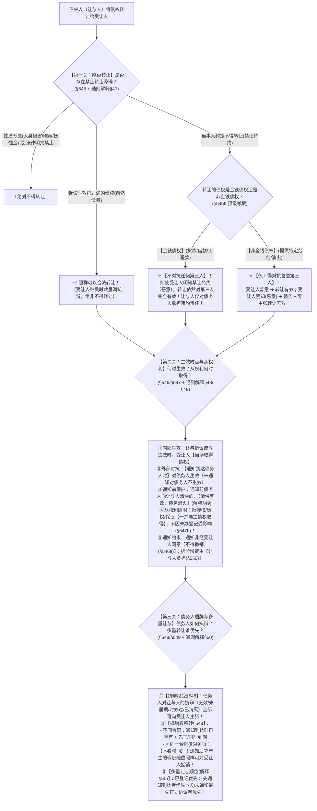

# 📐 债权转让 · 全流程答题模型（禁让特约§545Ⅱ · 通知前履行 · 抗辩抵销承继 · 从权利随附 · 多重让与§50）

> **教练开场白**
> 同学们好！我是你们的民法法考教练。在合同转让板块，如果说“债务承担”是**换还钱的人（债务转移须债权人同意）**，那么“债权转让”就是**换要钱的人（债权让与只需通知债务人）**！@!
> 很多同学做债权转让的题目最容易在**“时点、对抗、盾牌”**上翻车：约定了不准转让到底能不能转？转让债权带的抵押权没去办过户登记算不算数？转让前债务人本来就能抵销的钱转让后还能不能扣？同一笔债卖给了三个人到底谁能拿到钱？
> 《民法典》第 545–550 条与 2023 年《合同编通则司法解释》第 47–53 条，构建了极其严密的裁判规则。今天我们用**“三关连贯流水线”**，把债权转让的可让与性、生效对抗、抗辩抵销与多重受偿一次性彻底锁死：**第一关能否转让与禁让特约 → 第二关生效时点与从权利随附 → 第三关债务人盾牌与多重让与顺位**。

---

## 适用场景与解决问题

本模型专门解决合同权利转让板块中“债权让与”的全部主客观题考点（对应 [[合同总则考点-深度报告]] 五·转让 row 1 · ★★★★★ 顶级必考）：重点破解：

1. **可让与性与禁让特约关**：法定三类禁止（性质专属/法律规定/约定禁让）；**《民法典》§545Ⅱ 顶级做题眼**：金钱债权约定禁转**不得对抗任何第三人（善意、恶意均挡不住！）** vs 非金钱债权约定禁转**仅不得对抗善意第三人（恶意第三人能挡住）**；自然债务（已过时效债权）**照样可转让**。
2. **生效时点与从权利随附关**：**三个时间点精细界分**（让与协议生效日＝取得债权日 $\neq$ 通知到达日＝对债务人生效日 $\neq$ 登记日＝仅补公示）；**《民法典》§547Ⅱ 从权利随附法定规则**（抵押权随主债权一并取得，**无需登记即取得**，登记生效主义的法定例外！）；**《通则解释》§49 通知前履行保护（表见清偿有效）**；通知**非经受让人同意不得撤销（§546Ⅱ）**；拆分转让增加费用**由让与人负担（§550）**。
3. **债务人盾牌与多重让与关**：**《民法典》§548 抗辩权全部继受**（合同无效/履行期未至/时效届满/债务已消灭）；**《民法典》§549 抵销权双规制**（§549① 不同合同看时间：通知时已享有+先于或同时到期 vs **§549② 同一合同不看时间：通知后才产生的瑕疵赔偿照样可抵销！**）；**《通则解释》§50 多重让与清偿顺位规则**（通知先后 > 订立先后 > 登记优先）。

> **核心一句**：**钱债约定禁转挡不住任何人，非钱债约定禁转挡恶意第三人；协议生效债权抵押全到手（不等登记），通知到达才对债务人生效（通知前还老债主有效）；债务人抗辩全继承，同一合同抵销不看时间；多重让与看通知先后，登记在先绝对优先！**
>
> 🔎 **核心法源（2026最新）**：《民法典》§545、§546、§547、§548、§549、§550、§768；**《最高人民法院关于适用〈中华人民共和国民法典〉合同编通则若干问题的解释》（法释〔2023〕13号）第47条（禁让特约）、第48条（通知形式）、第49条（通知前清偿）、第50条（多重让与顺位）、第51条（表见让与）、第52条（抗辩排除特约）**。

---

## 💡 【前置认知】债权转让三大时点极速辨析（法考最高频陷阱）

### 1. 债权转让三大时点极速辨析（法考最高频陷阱）

```
【债权转让三大时点对照表】（法考考场严禁混淆！）
┌─────────────────────────────────────────────────────────────────────────────────────────────┐
│ ① 让与协议生效日（3月1日） ──→ 受让人【当场取得主债权】+【当场取得抵押权等从权利(§547II)】│
│ ② 转让通知到达日（3月3日） ──→ 债权转让对【债务人正式发生法律约束力(§546)】                │
│ ③ 抵押权变更登记日（3月6日）──→ 仅仅是【补充物权公示】，绝非抵押权取得时点！               │
└─────────────────────────────────────────────────────────────────────────────────────────────┘
```

### 2. ⭐⭐⭐⭐ 债的移转方式全景二分：意定移转（本模型） vs 法定移转（[[合同通则-多选-35]]）

| 移转分类                 | 移转原因与成立要件                                            | 典型法定情形                                                                                                                 | 考场秒杀口诀                           |
| :------------------- | :--------------------------------------------------- | :--------------------------------------------------------------------------------------------------------------------- | :------------------------------- |
| **意定移转**<br>（当事人自己搬） | 基于当事人之间的**合意/合同**发生移转。<br>如债权转让需**通知**，债务承担需**同意**。  | ① **债权转让**（《民法典》§545）<br>② **债务承担**（《民法典》§551）<br>③ **合同权利义务概括承受**（§555）                                               | **“签合同自己搬”**                     |
| **法定移转**<br>（法律直接搬）  | **直接依法律明文规定发生**移转，**无需当事人专门合意**。<br>原债权债务依法直接过户给新主体。 | ① **【保】保险代位求偿**（《保险法》§60）<br>② **【并】企业合并与分立**（《民法典》§67）<br>③ **【继】遗产继承清偿债务**（《民法典》§1161）<br>④ **【租】买卖不破租赁**（《民法典》§725） | **“保并继租，法律直接搬！（多选-35 全选 ABCD）”** |
- 债的移转**包含三大块**：

	- **债权让与**：只是债权搬家（换债权人）
	- **债务承担**：只是债务搬家（换债务人）
	- **债权债务概括移转**：债权 + 债务整套一起搬家

- 分两类发生原因：
	- **意定移转**：当事人签合同约定（普通债权转让、免责债务承担、合同概括承受）
	- **法定移转**：**法律直接规定，不需要当事人协商签字**


---

## 一、 考点核心骨架与法理（三关连贯决策树）



```
【债权转让纠纷】一句话开场：换老板要钱，能不能转？什么时候算数？欠债人拿什么盾牌挡？
│
▼ 第一关 · 能否转让 ── 三类禁转与禁让特约（§545）
├─ 性质专属（人身损害/赡养/抚恤金）/ 法律禁止 ────────────────────────→ 🚨 绝对不得转让！
├─ 诉讼时效已过的债权（自然债务）────────────────────────────────────→ ✅ 照样可以合法转让（继受时效抗辩）！
└─ 约定不得转让（禁让特约 · §545Ⅱ 顶级做题眼）：
     ├─ 【金钱债权】（货款/借款）──→ ⭐ 不对抗任何第三人（受让人恶意也有效，钱债不挑人！）
     └─ 【非金钱债权】（劳务/服务）──→ ⭐ 仅不对抗善意第三人（受让人善意才有效，非钱债挑善意！）
          │
          ▼ 第二关 · 生效时点与从权利 ── 通知生效与抵押随附（§546/§547 + 解释§48/§49）
          ├─ 生效与对抗：协议生效债权即移转；【通知到达债务人时】对债务人生效（通知日≠取得日）
          ├─ 通知前清偿保护（解释§49）：通知到达前债务人向让与人清偿的，【清偿有效，债务消灭】
          ├─ 从权利随附（§547Ⅱ）：抵押权/质权/保证【一并随主债权取得】，不因未办登记受影响！
          └─ 附加规则：通知非经受让人同意不得撤销（§546Ⅱ）；拆分转让增加费用由【让与人负担（§550）】
               │
               ▼ 第三关 · 债务人盾牌与多重让与 ── 抗辩继受与抵销双轨（§548/§549 + 解释§50）
               ├─ 抗辩继受（§548）：无效抗辩 / 履行期未至 / 时效已过 / 债务已清偿，【全部四类继受】！
               ├─ 抵销权移转（§549）：
               │    ├─ 不同合同（§549①）：通知到达时已享有 + 先于或同时到期
               │    └─ 同一合同（§549②）：⭐【不看时间】！通知后才产生的瑕疵赔偿照样可对受让人抵销！
               └─ 多重让与顺位（解释§50）：办理保理登记优先 > 通知先到达者优先 > 均未通知最先合同优先！

  ━━━ 三关全过 ━━━
```

---

## 二、 核心考情

- **频次研判**：债权转让是《民法典》合同编通则中**命题考频最高（★★★★★ 顶级必考）**的知识点之一，与保理合同（§761-§769）深度融合，每年必考 1–2 道客观题，主观题常考连环转让与抵销抗辩。
- **命题核心**：
  1. **禁让特约（§545Ⅱ）**：金钱债权禁让不对抗任何人（连恶意也挡不住）；非金钱债权禁让仅不对抗善意第三人。
  2. **从权利不以登记为取得要件（§547Ⅱ）**：抵押权自债权转让协议生效时随附取得，登记仅具对抗/补公示效力。
  3. **通知生效与表见清偿（§546 + 解释§49）**：通知到达前债务人向原债权人付款有效，原债务消灭。
  4. **同一合同抵销不看时间（§549②）**：通知后才产生的同一买卖合同违约金/瑕疵赔偿，照样可对新债权人主张抵销。
  5. **多重让与清偿顺位（解释§50）**：按通知到达先后，登记优先。

---

## 三、 三大核心法理与命题陷阱拆解

### 1. 禁止转让特约（§545Ⅱ）金钱 vs 非金钱双轨制

| 债权类型 | 约定“禁止转让”的法律效力（《民法典》§545Ⅱ） | 考场秒杀口诀 |
|---|---|---|
| **金钱债权**（货款、借款、租金、工程款） | **不得对抗任何第三人**！即使受让人明知有禁让特约（恶意受让人），转让依然对第三人完全有效！债务人必须向受让人付款。让与人仅向债务人承担违约责任。 | **“钱债不挑人，连恶意也挡不住！”** |
| **非金钱债权**（提供劳务、特定演出、技术开发） | **不得对抗善意第三人**。若受让人明知有禁让特约（恶意受让人），债务人可以主张转让无效、拒绝履行。 | **“非钱债挑善意，善意有效恶意挡！”** |

### 2. 债权转让生效对抗与从权利随附（《民法典》§546/§547 + 《通则解释》§49）

| 规则维度 | 法律规则与司法认定（2026最新） | 命题陷阱 |
|---|---|---|
| **生效 vs 对抗** | 让与协议生效即发生债权移转；**通知到达债务人时对债务人生效**。债权转让**无需债务人同意**（与债务转移§551形成绝对镜像！）。 | ❌ 误以为债权转让是效力待定、需要债务人同意。 |
| **从权利随附（§547Ⅱ）** | 抵押权、质权、保证债权**随主债权一并移转**，“不因未办理转移登记或未转移占有而受影响”。 | ❌ 误以为没办抵押变更登记受让人就没取得抵押权（登记日不是取得日！）。 |
| **通知前清偿（解释§49）** | 通知到达前，债务人向让与人履行的，**发生清偿效力，原债务消灭**；受让人只能向让与人主张返还。 | ❌ 误以为债务人向让与人付款无效仍须向受让人付第二遍。 |
| **通知不得擅撤（§546Ⅱ）** | 债权转让通知到达后，**非经受让人同意，不得撤销**。 | ❌ 误以为让与人发了通知后可以单方发函撤销。 |
| **拆分增加费用（§550）** | 因债权转让（如拆分给多个人）增加的履行费用，由**让与人负担**。 | ❌ 误以为由债务人或受让人分摊。 |

### 3. 债务人盾牌：四类抗辩全部继受与抵销权双规制（《民法典》§548/§549）

| 盾牌类型 | 法律规则与具体涵摄 | 核心命题眼 |
|---|---|---|
| **抗辩权全部继受（§548）** | 债务人接到通知时对让与人享有的一切抗辩均可向受让人主张：<br>①**权利不发生**（合同无效/被撤销）<br>②**延期抗辩**（履行期未届至/先履行抗辩）<br>③**永久抗辩**（诉讼时效已过）<br>④**权利已消灭**（已清偿/已解除） | 债务人对老债主的盾牌，拿来挡新债主**照单全收（ABCD全选）**！时效已过的债权不会因转让而“复活”。 |
| **抵销权·不同合同（§549①）** | 债务人对让与人享有的债权，须**在接到通知时已享有**，且**先于或同时于转让债权到期**，方可向受让人主张抵销。 | 须卡时间：通知时已存在 + 到期日早于或等于转让债权。 |
| **⭐ 抵销权·同一合同（§549②）** | 债务人对让与人的债权与转让的债权**基于同一合同产生**（如同一买卖合同产生的质量违约金/瑕疵赔偿），**【绝对不看时间】！即使在通知到达之后才产生，债务人照样可向受让人主张抵销！** | 命题人故意把设备爆炸/违约日期放在通知之后，考查 §549② 不受时间限制！ |

---

## 四、 万能解题三步

---

### 第一步：定性关 —— 能不能转？禁让特约能对抗谁？（《民法典》§545 + 《通则解释》§47） @!

> **教练提示**：拿到题目绝不能把所有情形眉毛胡子一把抓，必须严格走**“两层递进漏斗”**：
> 1. **第一层漏斗（查三类法定禁转红线 §545Ⅰ）**：先看该债权是否属于“性质专属”或“法律明文禁止”？如果是，一票否决绝对不能转！
> 2. **第二层漏斗（查禁让特约穿透效力 §545Ⅱ）**：如果双方合同约定了“禁止转让”，立即分流——是**金钱债权（货款/借款）**还是**非金钱债权（特定劳务/定制）**？金钱债权不管受让人知不知情（恶意也有效）转让一律有效；非金钱债权只有受让人善意才有效。
> 3. **特别排除（自然债务）**：诉讼时效已过的债权属于自然债务，依然是财产权，依法**照样可以转让**！

---

#### 1. 【核心法定体系】债权可让与性“两层递进漏斗”决策架构 @!

```
                        【债权人转让其享有的债权】
                                    │
    ▼ 第一层漏斗：是否存在《民法典》§545Ⅰ 三类法定不得转让情形？
    ├─ ① 根据债权性质不得转让（人身损害赔偿/抚养费/赡养费/抚恤金）──→ 🚨 绝对不得转让！
    ├─ ② 依照法律规定不得转让（法律明文禁止转让的特许债权、赌债等）────→ 🚨 绝对不得转让！
    ├─ ③ 诉讼时效已届满的普通债权（自然债务）──────────────────────────→ ✅ 依法可以转让（受让人继受时效抗辩）
    └─ ④ 按照当事人约定不得转让（禁让特约）────────────────────────────→ 进入第二层漏斗
                                                                              │
    ▼ 第二层漏斗：进入《民法典》§545Ⅱ 禁让特约对外效力穿透分流
    ├─ 【金钱债权】（买卖货款/借款/工程款/租金）
    │    └─ ⭐ 法律后果：【不得对抗任何第三人】！
    │       哪怕受让人明知有禁让特约（恶意受让人），债权转让依然对第三人完全有效！让与人仅对债务人承担违约责任。
    │
    └─ 【非金钱债权】（定制画像/提供特定演艺劳务/专有技术服务）
         └─ ⭐ 法律后果：【仅不得对抗善意第三人】！
            ① 受让人不知情（善意第三人）➔ 转让对第三人有效，债务人必须向受让人履行；
            ② 受让人明知有特约（恶意第三人）➔ 债务人可主张转让无效，拒绝向受让人履行！
```

---

#### 2. 先懂几个词
- **性质专属债权**＝跟债权人的人身自由、生命健康、人格尊严绑死的债权（被撞伤的赔偿金、前夫给孩子的抚养费），别人不能替他收；
- **自然债务可转让**＝借款过了 3 年诉讼时效，只是丧失了强制胜诉权，实体财产债权依然合法存在，当然可以转让（受让人接盘后承担时效抗辩）；
- **禁让特约**＝买卖双方在合同里约定“本合同项下的债权未经对方同意不得转让给第三方”；
- **钱债不挑人（§545Ⅱ）**＝欠钱还钱，债务人还给谁都一样（都是真金白银），为了保护保理和供应链金融的资金流转，法律规定金钱债权约定禁转**对任何第三人都没有对抗力**；
- **非钱债挑善意（§545Ⅱ）**＝找知名大师画画，大师若把“要求对方配合画像的债权”转给别人，债务人很在乎对方是谁，因此非金钱债权只有在买家善意不知情时才有效。

---

#### 3. 概述与法理深剖
1. **债权自由转让原则**：市场经济下，债权属于流通性财产，原则上债权人享有自由转让的处分权，无需债务人同意；
2. **法定三类禁止的立法目的**：保护人身专属性（§545①）、维护公序良俗与法律强制性规定（§545③）；
3. **《民法典》第545条第2款的重大制度革新（2020新增·保理基石）**：
   - 旧《合同法》下，约定不得转让的，转让行为原则上无效；
   - **《民法典》确立新规**：彻底区分“金钱债权”与“非金钱债权”。在商事交易中，金钱债权的自由流通价值远高于当事人的私下限制约定。因此，**金钱债权约定禁转的，对外部第三人（不论善意还是恶意）一律不发生对抗效力**！债务人不得以内部禁让特约为由拒绝向受让人付款。

---

#### 4. 🔍 对号入座表：两层漏斗审查标准与对抗效力全景表

| 层次            | 债权类型与约定特征                             | 能否转让 / 对外效力          | 规范依据与考场判定（《民法典》§545）                   |
| :------------ | :------------------------------------ | :------------------- | :------------------------------------- |
| **第一层：法定排除**  | 张某被车撞伤享有的 **50万元人身损害赔偿金**             | ❌ **绝对不得转让**         | 属于性质上专属于债权人自身的债权（§545①）                |
| **第一层：法定排除**  | 李某对子女享有的 **赡养费请求权** / 职工的 **最低生活保障金** | ❌ **绝对不得转让**         | 属于基本生存与身份专属权利（§545①）                   |
| **第一层：自然债务**  | 甲对乙享有的 **已过 3 年诉讼时效的 100 万元借款**       | ✅ **依法可以转让**         | 属于自然债务，转让合法有效，受让人继受时效届满抗辩（多选-10）       |
| **第二层：金钱禁让**  | 甲乙约定“货款不得转让”，甲将 **100万元货款转让给知情的丙公司**  | ⚠️ **让与人违约，但转让完全有效** | **金钱债权：不得对抗任何第三人（丙即使恶意也取得债权！）**（单选-55） |
| **第二层：非金钱禁让** | 乙请甲定制雕塑约定禁转，甲将该 **非金钱请求权转让给知情的丁**     | ❌ **债务人可主张转让对其不生效**  | **非金钱债权：仅不对抗善意第三人（丁系恶意，乙可拒绝履行）**       |
| **第二层：非金钱禁让** | 乙请甲定制雕塑约定禁转，甲将该 **非金钱请求权转让给不知情的戊**    | ✅ **转让对债务人有效**       | **非金钱债权：不得对抗善意第三人（戊系善意，乙必须履行）**        |

---

#### 5. 💰 完整数字案例：金钱禁让 vs 非金钱禁让攻防实战

> **【案情 A：金钱债权约定禁转 · 不对抗任何人（单选-55）】**
> 甲机械厂向乙汽配公司出售价值 100 万元的机械设备，双方在《买卖合同》中明确约定：“甲厂对乙公司享有的 100 万元货款债权，非经乙公司书面同意，严禁转让给任何第三方。”
> 后甲厂因资金链紧张，将该 100 万元货款债权以 90 万元的价格转让给知情人丙保理公司（丙公司在受让时已查阅了甲乙合同，明知存在禁让特约）。甲厂向乙公司发出了债权转让通知。乙公司向丙公司主张：“双方白纸黑字写明禁止转让，丙公司明知该约定依然受让，该转让合同无效，乙公司拒绝向丙公司付款。”
>
> 1. **第一层漏斗**：100万元货款不属于人身专属债权，非法律禁止转让之债 ──→ 通过；
> 2. **第二层漏斗（金钱债权）**：该债权为给付金钱的货款之债。依据《民法典》§545Ⅱ，**金钱债权约定不得转让的，不得对抗第三人（不以受让人善意为前提！）**；
> 3. **裁判结论**：即便丙公司明知禁让特约（恶意），该债权转让依然完全有效，乙公司无权拒绝付款！乙公司只能依合同另行向甲厂追究违反禁让特约的违约责任。

> **【案情 B：非金钱债权约定禁转 · 仅不对抗善意】**
> 乙剧院与甲知名剧团签订演出合同，乙剧院享有要求甲剧团于国庆节演出 3 场的非金钱债权，双方约定该演出请求权不得转让。后乙剧院私自将该 3 场演出请求权转让给知情的丙商业演出公司。
>
> 1. **第一层漏斗**：演出请求权虽非人身损害，但双方约定了禁让特约 ──→ 进入第二层漏斗；
> 2. **第二层漏斗（非金钱债权）**：该债权为提供演出的非金钱债权。依据《民法典》§545Ⅱ，**非金钱债权约定不得转让的，仅不得对抗善意第三人**；
> 3. **裁判结论**：丙公司在受让时明知存在禁让特约（系恶意受让人），甲剧团有权依据禁让特约主张该转让对甲剧团不发生效力，拒绝向丙公司演出！

---

#### 6. 一句话闭环记忆
> 🎯 **一眼判**：**先查专属与法律（人身抚养一票否决，过时效借款照样转）；再查禁让特约（金钱债权不对抗任何人·连恶意也有效，非金钱债权仅不对抗善意·恶意能挡住）！**


---

### 第二步：生效与从权利关 —— 什么时候对谁生效？抵押权要不要重新登记？（《民法典》§546/§547/§550 + 《通则解释》§48/§49） @!

> **教练提示**：做这部分的题目，脑海中必须清晰切开**“内部移转”、“外部对抗”、“物权公示”**三个法律时点：
> 1. **内部移转（让与协议生效日）**：受让人在此日**当场取得主债权**，且依《民法典》§547Ⅱ**当场取得抵押权/质权/保证等从权利**（抵押权取得绝不以办理过户登记为前提！）；@!
> 2. **外部对抗（通知到达债务人日）**：转让在此时才对债务人发生法律效力。通知到达前，债务人不知情把钱付给老债主的，**属于合法有效的表见清偿，债务彻底消灭（《通则解释》§49）**；
> 3. **物权公示（办理登记日）**：仅用于补充物权对抗公示，绝非取得时点；
> 4. **通知与费用约束**：转让通知发出到达后，**非经受让人同意不得撤销（§546Ⅱ）**；拆分转让增加的费用由**让与人承担（§550）**。

---

#### 1. 【核心法定体系】三大时点与从权利随附全景决策架构

```
                        【让与人与受让人签订债权转让协议】
                                        │
    ┌───────────────────────────────────┼───────────────────────────────────┐
    ▼                                   ▼                                   ▼
【内部时点：协议生效日】            【外部时点：通知到达日】            【物权公示：登记变更日】
（让与人 ↔ 受让人）                 （对债务人发生法律约束力）          （不动产登记机构补登记）
        │                                   │                                   │
├─ ① 受让人【当场取得主债权】       ├─ ① 对债务人【正式生效(§546)】     └─ 仅是【补充物权公示】！
├─ ② 抵押权/质权/保证【一并取得】   ├─ ② 通知到达前债务人还钱给让与人：      绝非抵押权取得时点！
│    （§547II 从权利随附原则，           ➔ 【表见清偿有效，债务消灭】        （§209 登记生效的法定例外）
│     不以登记或交付为取得要件！）       （《通则解释》§49）
└─ ③ 债权转让【无需债务人同意】     ├─ ③ 通知非经受让人同意【不得撤销】(§546II)
     （与债务转移须同意绝对镜像）    └─ ④ 拆分增加费用由【让与人承担】(§550)
```

---

#### 2. 先懂几个词
- **内部生效 vs 外部对抗**＝让与人跟买家签了合同，债权当场就是买家的（内部生效）；但欠钱的人还不知道，不能强迫他向新买家付款，必须等通知送到才对他生效（外部对抗）；
	- ①**转让合同本身（出让人‑受让人之间）**：双方合意达成即生效，受让人取得债权，跟有没有通知债务人无关。 
	- ②**对债务人的对外效力**：必须通知到达债务人才生效；没通知，债务人可以拒绝向新债权人还钱，但不会毁掉转让合同本身。

- **从权利法定随附（§547Ⅱ）**＝“本金跑了，抵押权跟着跑”。主债权转让时，抵押权自动移转给新债权人，即便房管局没办抵押权人变更登记，新债权人也是完全合法的抵押权人；
- **表见清偿（解释§49）**＝买家买了债权却懒得通知债务人，债务人不知情把钱转给了老债主。债务人“付得安心，债务消灭”，买家不能找债务人要第二遍，只能找老债主追讨；
- **通知不得擅撤（§546Ⅱ）**＝让与人通知债务人“以后还给受让人”后，不能自己悄悄发函“我后悔了，还是还给我”，除非受让人同意；
- **增费让与人担（§550）**＝把 100 万元债权拆分成 10 份转给 10 个人，导致债务人汇款跑腿成本大增，多出来的费用由老债主（让与人）掏。

- 
---

#### 3. 概述与法理深剖
1. **债权让与的无因性与从属性平衡**：主债权转让，担保物权等从权利作为主债权的价值保障，依《民法典》§547Ⅰ 自动随附移转。
2. **《民法典》§547Ⅱ 对物权变动规则的突破（顶级必考）**：
   - 依《民法典》§209 不动产物权登记生效主义，一般抵押权设立须登记；
   - 但在**债权转让场景**中，抵押权人变更是**基于法律的明文特别规定而发生的继受取得**，故《民法典》§547Ⅱ 明确规定：“受让人取得从权利**不因该从权利未办理转移登记手续或者未转移占有而受到影响**”！这是法考考查“区分原则与登记效力”的最核心试金石！
3. **通知生效主义与债务人信赖保护（解释§48/§49）**：
   - 债权转让通知是准意思表示，自到达债务人时生效（对抗要件）；
   - 在通知到达前，债务人有理由信赖原债权人仍为权利人。债务人向原债权人作出的清偿、免除、抵销等行为，对受让人均发生法律效力，以绝对维护交易安全。

---

#### 4. 🔍 对号入座表：转让时点、从权利随附与通知效力全景表

| 法律事实与行为时点 | 法律效果 | 规范依据与考场判定 | 典型陷阱 |
| :--- | :--- | :--- | :--- |
| **让与人与受让人签订转让协议生效** | 受让人**当场取得主债权** | 《民法典》§545 | ❌ 误以为通知到达或登记时才取得债权 |
| **主债权附带房屋抵押权，未办变更登记** | 受让人**当场随附取得房屋抵押权** | 《民法典》§547Ⅱ | ❌ 误以为未办登记抵押权未移转（单选-21） |
| **转让协议签订后、通知到达债务人前** | 债务人向原债权人清偿本息 | 《通则解释》§49<br>（**清偿有效，原债务消灭**） | ❌ 误以为清偿无效、受让人可要求债务人重付 |
| **转让通知送达债务人后** | 让与人单方发函声明撤销转让通知 | 《民法典》§546Ⅱ<br>（**单方撤销无效**） | ❌ 误以为通知人有权单方自由撤回撤销（多选-32） |
| **债权人将 100 万债权拆分转让给 10 人** | 增加的通知费、汇款手续费由让与人承担 | 《民法典》§550 | ❌ 误以为增加的履行费用由债务人承担 |

---

#### 5. 💰 完整数字案例：三个时点、抵押权取得与通知前清偿攻防实战

> **【案情（单选-21 变形精解）】**
> 甲向乙借款 100 万元，借期 1 年，乙以自有商铺为甲设立抵押权并依法办理了抵押登记。
> - **3月1日**：甲与丙签订《债权转让合同》，将对乙的 100 万元借款债权转让给丙；
> - **3月3日**：甲向乙邮寄债权转让通知，乙于 **3月5日** 签收该通知；
> - **3月8日**：甲、乙、丙三方到不动产登记中心办理了抵押权人变更登记。
>
> 1. **主债权取得时点**：3月1日甲丙合同生效，丙于 **3月1日** 取得 100 万元债权；
> 2. **抵押权取得时点**：依《民法典》§547Ⅱ，抵押权随主债权于 **3月1日** 一并移转给丙，不以 3月8日办理变更登记为取得前提！故丙取得债权与抵押权的时间均为 **3月1日**（选 C）；
> 3. **通知前清偿攻防**：假设乙在 **3月3日**（未收到通知前）已将 100 万元本息归还给甲。依据《通则解释》§49，乙的清偿合法有效，乙的债务全部消灭，商铺抵押权随之消灭！丙无权要求乙再次付款，丙只能依让与合同向甲追索 100 万元。

---

#### 6. 一句话闭环记忆
> 🎯 **一眼判**：**协议生效债权抵押全到手（§547II 不等登记）；通知到达才对债务人生效；通知前还钱有效债务消灭；通知不可单方撤，拆分增费让与人包！**

---

### 第三步：抗辩与抵销关 —— 债务人能掏出哪些盾牌？多重让与谁优先？（《民法典》§548/§549 + 《通则解释》§50/§52） @!

> **教练提示**：债务人面对新买家要钱时，可以依法掏出两套超级盾牌（抗辩权 + 抵销权），考场解题必须做到秒级反应：
> 1. **抗辩权承继（§548）**：债务人对老债主的抗辩**全部可以向新买家主张（四类全选）**！合同无效、没到期、时效已过、早就还过了，新买家一律得受着；
> 2. **抵销权双规制（§549）**：
>    - **不同合同（§549①）**：严格卡时间——必须在**接到通知时已享有** + **到期日早于或等于转让债权**；
>    - **⭐ 同一合同（§549②）**：**【绝对不看时间】**！只要两笔账同出一份买卖合同（如设备爆炸赔偿），哪怕在通知到达之后才发生，债务人照样可向新买家主张抵销！
> 3. **多重让与清偿顺位（《通则解释》§50）**：一债多卖时，**已办理保理登记优先 > 先通知到达者优先 > 均未通知最先合同优先**！

---

#### 1. 【核心法定体系】债务人防御盾牌与多重让与顺位决策架构 @!

```
                        【受让人向债务人请求履行债务】
                                        │
    ┌───────────────────────────────────┼───────────────────────────────────┐
    ▼                                   ▼                                   ▼
【第一套盾牌：抗辩权承继 §548】      【第二套盾牌：抵销权承继 §549】      【多重让与受偿顺位 解释§50】
（债务人原有的一切防御武器）        （债务人拿对让与人的反向债权冲抵）  （让与人一债多卖时的裁判规则）
        │                                   │                                   │
├─ ① 权利不发生（合同无效/被撤销）   ├─ ① 【不同合同之债 §549①】：       ├─ ① 【办理保理/融资登记的】
├─ ② 延期抗辩（履行期未至/先履行权）   │    必须卡时间：通知时已享有 +         ➔ 按照【登记在先原则】确定优先受偿！
├─ ③ 永久抗辩（诉讼时效已届满）        │    先于或同时于转让债权到期！     ├─ ② 【均未登记的】
└─ ④ 权利已消灭（已清偿/已解除）     └─ ② ⭐【同一合同之债 §549②】：         ➔ 按照【通知到达债务人先后】确定！
   ➔ 【全部四类抗辩均可对抗受让人】!         【完全不看时间】！即使通知后   └─ ③ 【均未登记且均未通知的】
      （时效届满债权不因转让而复活）         才产生赔偿，照样全额抵销！         ➔ 按照【转让合同订立生效先后】确定！
```

---

#### 2. 先懂几个词 @!
- **抗辩权全部继受（§548）**＝受让人买到的绝对不是无菌纯净的债权，而是“带病的原装债权”。原债务人能拿来怼老债主的理由，换了新债主一字不差照样能怼；
- **不同合同抵销（§549①）**＝老债主另外还欠我一笔钱，这笔钱必须在收到转让通知前就已经到手，且不能比我欠他的钱更晚到期，我才能扣抵；
- **同一合同抵销（§549②）**＝你卖给我的机器爆炸了，我找你索赔的钱，和我要付给你的货款同出一份合同，这两笔账天然绑定，不管机器在通知前还是通知后爆炸，新买家来要货款我直接扣除赔偿金；
- **多重让与（解释§50）**＝老赖把同一笔 100 万应收账款先后卖给了 A 保理公司、B 公司、C 银行。谁先在央行征信系统办了保理登记谁拿钱；都没登记的，谁的催款通知先送到老赖客户手里谁拿钱。
	- 债权不像房子，没有实物过户。甲把同一笔 100 万债权，先后卖给 A、B 两个人 , 例如: **甲‑A 合同、甲‑B 合同两份合同全部有效**，合同本身不违法、不无效。债权转让协议签完，在甲乙内部生效，只是**不能全部都实现向债务人拿钱**),  最后只有一个受让人可以找债务人拿到钱；**没拿到钱的受让人，不能找债务人，只能告原债权人甲，追究甲的违约责任，要甲赔钱退钱**。

---

#### 3. 概述与法理深剖
1. **债务人地位不得因转让而恶化原则（§548）**：
   - 债权转让是债权人与受让人之间的处分行为，无须债务人同意；
   - 为防止债权人与受让人串通损害债务人利益，法律确立铁律：**转让不得剥夺或减损债务人原有的任何实质性抗辩权**。因此，诉讼时效届满、合同无效、履行期未届至等抗辩，在转让后对受让人继续保持完整效力。
2. **《民法典》§549② “同一合同抵销”的深层牵连法理（命题顶级考眼）**：
   - 传统民法抵销要求双方互负到期债权；
   - 但若两笔债权系**基于同一双务合同产生**（如货款给付请求权 vs 标的物瑕疵损害赔偿请求权），两者互为主合同义务与违约救济，具有天然的实质对价与牵连关系；
   - 让与人转让债权时，受让人接手的是整个合同关系下的权利净值，不能享受利益却把瑕疵责任甩给原合同当事人。因此，**《民法典》§549② 明确同一合同抵销不受时间先后与通知时点的限制**！

---

#### 4. 🔍 对号入座表：抗辩承继、抵销双轨制与多重让与顺位全景表

| 争议情形与抗辩主张 | 能否对抗受让人 / 裁判结论 | 规范依据 | 考场核心做题眼 |
| :--- | :--- | :--- | :--- |
| **借款已过 3 年诉讼时效，转让后受让人催款** | ✅ **债务人时效抗辩成立，有权拒付** | 《民法典》§548 | 债务人对老债主的时效抗辩随债权移转，**时效不复活**（多选-11） |
| **买卖合同已被依法撤销/确认无效** | ✅ **债务人权利不发生抗辩成立** | 《民法典》§548 | 债权自始不存在，受让人无可主张之权利 |
| **不同合同之借款：通知时已享有，且先于货款到期** | ✅ **债务人可向受让人主张抵销** | 《民法典》§549① | 满足“通知时已享有 + 先于或同时到期”双要件 |
| **不同合同之借款：通知到达后债务人才取得该借款** | ❌ **债务人不得向受让人主张抵销** | 《民法典》§549① | 缺时间要件，通知后才产生的不同合同债权不得抵销 |
| **同一买卖合同：设备在通知到达后爆炸致损 40 万** | ✅ **债务人【无条件直接抵销 40 万】** | **《民法典》§549②** | **命题顶级陷阱**：同一合同**完全不看时间**，直接抵销（单选-55） |
| **一债二卖：A 先登记，B 先通知债务人** | ⭐ **A 保理公司优先取得债权受偿** | 《通则解释》§50<br>《民法典》§768 | 登记在先原则绝对优先于通知先后 |
| **一债二卖：均未登记，B 的通知先到达债务人** | ⭐ **B 受让人优先取得债权受偿** | 《通则解释》§50 | 均未登记时，按**通知到达债务人先后顺序**确定 |

---

#### 5. 💰 完整数字案例：同一合同抵销（单选-55） vs 多重让与（解释§50）实战

> **【案情 A：同一合同抵销不看时间 · 4/20 晚于 4/5（单选-55 经典真题）】**
> 甲向乙出售价值 100 万元的精密机床，合同约定禁止转让货款债权。
> - **4月1日**：甲将该 100 万元货款债权转让给丙保理公司；
> - **4月5日**：甲向乙发出转让通知，乙于 **4月5日** 收到通知；
> - **4月20日**：该机床因内在质量缺陷发生严重爆炸，造成乙工厂财产损失 **40 万元**。
> - 丙于 5月1日 向乙索要 100 万元全额货款，乙主张扣除 40 万元机床爆炸损失，仅向丙支付 60 万元。
>
> 1. **禁让特约定性**：货款为金钱债权，约定禁让不得对抗第三人丙，转让有效（A/B/C 错）；
> 2. **抵销规则涵摄**：
>    - 若套用 §549①（不同合同）：乙的 40 万损失发生在 4月20日（晚于 4月5日通知日），看似不能抵销；
>    - **套用 §549②（同一合同）**：40 万元爆炸赔偿与 100 万元货款**均基于同一份机床买卖合同产生**，具有内生牵连性，**法律规定完全不受时间限制**！
> 3. **裁判结论**：乙有权依据《民法典》§549② 向丙主张抵销 40 万元，仅须向丙支付 60 万元（**D 选项正确**）！

> **【案情 B：多重让与顺位裁判（《通则解释》§50）】**
> 甲公司对乙公司享有 100 万元到期应收账款。
> - **5月1日**：甲与丙签订转让合同，并于 **5月2日在动产融资统一登记公示系统办理了保理登记**；
> - **5月3日**：甲又将该 100 万元转让给丁，丁未办理登记，但丁于 **5月4日率先向乙公司送达了转让通知**；
> - **5月5日**：甲才向乙公司送达丙的转让通知。
>
> 1. **顺位规则涵摄**：依据《合同编通则解释》第 50 条及《民法典》第 768 条，债权多重转让的，**办理登记的优先于未办理登记的**；
> 2. **裁判结论**：丙虽通知在后，但**登记在先（5月2日登记）**，丙优先于丁取得该 100 万元债权！乙公司必须向丙公司清偿。

---

#### 6. 一句话闭环记忆
> 🎯 **一眼判**：**债务人盾牌全继承（无效/延期/时效/清偿照单全收）；不同合同抵销卡时间，同一合同抵销不看时间；多重让与登记绝对优先，没登记看谁通知先到！**


---

## 五、 案例演练

### 1. 债权转让与抵押权取得时点判定（[[合同通则-单选-21]]）
- **案情**：甲借乙 100 万附房屋抵押。3/1 甲丙签转让协议，3/3 通知乙，3/6 办抵押变更登记。问丙何时取得债权与抵押权。
- **模型分析**：第二步——让与协议 3/1 生效即取得债权；依据《民法典》§547Ⅱ 从权利随附原则，抵押权于 **3/1 当场取得**，登记仅补公示（选 C）。

### 2. 约定不得转让之金钱债权与同一合同抵销（[[合同通则-单选-55]]）
- **案情**：甲卖设备给乙约定禁止转让货款债权。甲将 100 万货款转给丙并于 4/5 通知乙。4/20 设备爆炸致乙损失 40 万。
- **模型分析**：第一步——货款为金钱债权，禁让特约不对抗第三人，转让对丙完全有效（A错，B/C错）；第三步——爆炸损失与货款**基于同一买卖合同（§549②）**，不受 4/20 晚于 4/5 限制，乙有权对丙主张抵销 40 万（**D 对**）。

### 3. 不得转让的债权排除与自然债务可让与性（[[合同通则-多选-10]]）
- **案情**：问下列哪些债权不得转让：A.赌债 B.已过时效债权 C.人身伤害赔偿 D.约定禁让的非金钱债权。
- **模型分析**：第一步——赌债非法(A)、人身损害专属(C)、非金钱约定禁让(D)不得转让；B 已过时效债权为**自然债务，依法照样可转让**（受让人承继时效抗辩），不选 B（选 ACD）。

### 4. 债务人对受让人的抗辩权全部继受（[[合同通则-多选-11]]）
- **案情**：债权转让后，债务人可向受让人主张哪些抗辩：A.合同无效 B.履行期未至 C.诉讼时效已过 D.债务已清偿。
- **模型分析**：第三步——依据《民法典》§548，债务人对让与人的所有抗辩（无效、延期、时效、消灭）全部可以向受让人主张，**四项全选（ABCD）**。

### 5. 债权转让通知 vs 债务转移同意的镜像对比（[[合同通则-单选-52]]）
- **案情**：甲转债权给丁已通知乙；丙转债务给戊未经乙同意。丁代位起诉戊。
- **模型分析**：对照记忆——转债权通知即生效（§546）；转债务未经债权人同意对债权人不生效（§551），戊非合法债务人，戊抗辩“我不是债务人”成立（选 B）。

### 6. 拆分转让、通知不可撤销与增加费用负担（[[合同通则-多选-32]]）
- **案情**：李某将 100 万元债权拆分为 10 份转给 10 人并通知债务人。后李某单方通知撤销转让。
- **模型分析**：第二步——金钱债权可部分转让（B错）；转让通知非经受让人同意不得撤销（§546Ⅱ，C对）；增加的履行费用由让与人李某负担（§550，D对，选 CD）。

### 7. 债的法定移转 vs 意定移转四情形（[[合同通则-多选-35]]）
- **案情**：下列哪些属于债的法定移转情形？A.保险代位求偿 B.企业合并分立承债 C.继承人清偿债务 D.买卖不破租赁承受租约。
- **模型分析**：前置认知——区分意定移转（当事人签合同搬家：债权转让/债务承担） vs 法定移转（法律直接搬家：**“保、并、继、租”**）。四项均属于依法律明文规定直接发生的主体移转，无需当事人合意，**四项全选（ABCD）**。

---


## 关联真题

- [[合同通则-单选-21]] · 债权让与协议生效日 vs 抵押权取得时点（§547Ⅱ 不需登记）
- [[合同通则-多选-10]] · 三类不得转让债权排除与已过时效自然债务可转让性
- [[合同通则-多选-11]] · 债务人对受让人的四类抗辩权全部继受（§548）
- [[合同通则-单选-52]] · 债权转让通知生效 vs 债务转移须同意之镜像对比
- [[合同通则-单选-55]] · 约定禁让金钱债权不对抗任何人 + 同一合同抵销不看时间（§549②）
- [[合同通则-多选-32]] · 部分债权拆分转让 + 通知不得擅自撤销 + 增费让与人负担
- [[合同通则-多选-35]] · 意定移转（转让/承担） vs 法定移转（保/并/继/租）四情形

## 相关页面

- 概念实体页：[[债权转让]] · [[债务承担]] · [[抵销]] · [[保理]]
- 对称模型：[[民法-合同-债务承担模型]]（转债务须债权人同意） · [[民法-合同-涉他合同与代为履行模型]]
- 综合报告：[[合同总则考点-深度报告]]（五、转让 · 第 1 考点 / 顶级必考第 12 项 · ★★★★★ 顶级必考）
