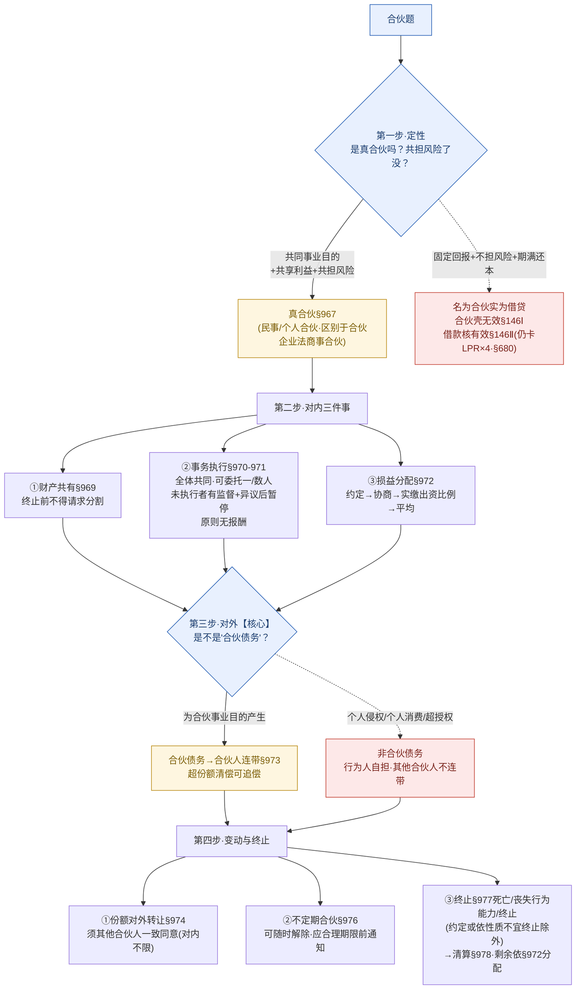

# 📐 合伙合同 · 答题模型（定性真假合伙 → 对内三件事 → 对外连带边界 → 变动与终止）

> 凡"合伙协议 / 合伙人 / 散伙 / 合伙债务"的题，按这四步走。灵魂只有一句：**合伙的灵魂是"共担风险"；命题核心永远两条线——①真假合伙（§967 共担风险）②对外连带责任只认"合伙债务"（§973）。**
> **姊妹 / 概念** → [[合伙合同]]（概念 + 老王小李故事）· [[借款合同]]（"名为合伙实为借贷"剥壳后的内核）· [[民法-合同-无效撤销返还模型]]（§146 通谋虚伪表示：外壳无效、隐藏行为另定）。
> **任意解除/随时终止全家族** → [[民法-合同-解除模型]]（任意解除总纲）· [[民法-合同-租赁模型]]（§730 不定期租赁随时解除）· [[民法-合同-委托行纪中介模型]]（§933 委托任意解除 + §928 有偿/无偿 对照本章 §971 无报酬）。
> **适用真题**：[[典型合同-多选-41|C2多选-41·名为合伙实为借贷(共担风险/§146)]] · [[典型合同-多选-42|C2多选-42·执行事务中个人侵权≠合伙债务·不连带(§973)]]。
>
> 🔎 **法条已联网核实（2026-06-15，权威主源 + 5 路二级交叉，全 CONFIRMED·HIGH）**：合伙合同章 **§967–§978** 逐字命中 [最高检官网·民法典合同编全文](https://www.spp.gov.cn/spp/ssmfdyflvdtpgz/202008/t20200831_478413.shtml)（全章十二条逐字提取）；§972/§973/§974/§975/§976 口径再经 [网易·第967条评注](https://c.m.163.com/news/a/IR3V0NET05455BAL.html) / [知乎·合伙合同导读](https://zhuanlan.zhihu.com/p/345479929) / [厚德汇法网·第973条释义](http://www.ahdhf.com/law/msf/8986.html) / [许昌市司法局·合伙合同规定](https://xcszjj.xuchang.gov.cn/gzdt/20230919/9121270a-4c36-4fcb-9e2e-9be23dc209bb.html) / [上海市商务委·合同编104要点](https://sww.sh.gov.cn/mfdxcy/20240529/c06459c33e034dada541a632d0e0cba3.html) 五源一致。
> ⚠️ **两个最易记错的点**：①**不定期合伙随时解除是 §976**（"参照 §510 仍不能确定→视为不定期"），**不是承揽章的 §786**——本库 2026-06-14 曾踩此坑。②**§971 是"不得因执行合伙事务请求报酬"（原则无报酬，约定除外）**，别记成"执行事务当然有报酬"（那是商事合伙/委托的逻辑）。
> ⭐ **考频**：**★★★~★★★★**——2021 民法典**新设典型合同章**（立法级强信号）+ 法大法考 **11 类必考清单**（买卖/赠与/借款/保证/租赁/融资租赁/保理/建工/委托/物业/**合伙**）点名；但**合伙客观题官方真题样本极少、实测频率偏中**，教培多以"金题"覆盖。命题核心＝真假合伙（§967）＋连带边界（§973）。

## 🗺️ 一页流程图（先白纸默画"定性→对内→对外→变动"主干，再对照查漏）

## 一、核心考情

- **频率**：★★★~★★★★。2021 民法典**新设典型合同章**（把"个人合伙/民事合伙"升为有名合同，类型级强信号）；法大法考 **11 类必考清单**点名。但**合伙客观题在历届官方真题中样本极少、实测频率偏中**——本模型所附两题均为教培**金题/构造题（V1）**，非国家司法考试官方真题，演练时心里有数即可。
- **命题核心**：**两条线**——①**定性**（真合伙 vs 名为合伙实为借贷，看有没有"共担风险"）；②**对外连带责任的边界**（只认"合伙债务"，个人侵权自担）。其余（损益分配三级瀑布、事务执行、份额对外转让、不定期解除、死亡终止）是行级配套规则。
- **三大必考点**：①**共担风险是合伙灵魂**（§967）——固定回报+不担风险=借贷，合伙壳无效/借款核有效（§146）。②**连带责任只认"合伙债务"**（§973）——个人侵权≠合伙债务，其他合伙人不连带。③**损益分配三级瀑布**（§972）——约定→协商→**实缴**出资比例→平均（"实缴"非认缴是坑）。

## 二、万能四步模型

### 第一步：定性——是真合伙吗？共担风险了没？（§967 / §146Ⅱ）

**铁则**：合伙合同 = 两个以上合伙人为了**共同的事业目的**，订立的**共享利益、共担风险**的协议（§967）。**"共担风险"是合伙的核心标志，没有风险共担就不是真合伙。**
- 出现**固定回报 + 不承担任何经营风险 + 期满返还本金**三特征 → 本质是**借款**，"合伙"只是外壳 → **名为合伙实为借贷**（§146Ⅱ 通谋虚伪表示）：
  - 虚伪表示（合伙协议外壳）→ **无效**（§146Ⅰ）；
  - 隐藏的真实行为（借款）→ **依借款合同规则处理**（§146Ⅱ），借款本身无违法理由则**有效**，但**利率仍受 §680 LPR×4 约束**。
- **区分对象**：民法典合伙＝**民事合伙/个人合伙**（§967-§978，**不以登记为要件**）；区别于《合伙企业法》的**商事合伙**（须登记、普通/有限之分）。法考客观题里"四人签合伙合同**未登记**"通常仍按民法典合伙处理，而非合伙企业。

> 🌰 老王小李（**老王、小李、老张 = 三个合伙人，合伙开餐厅；老赵 = 合伙以外的人**）：
> 老赵想给餐厅投 100 万，但要求签"合伙协议"、约定"不担任何经营风险、每年固定拿 10 万、第三年底连本带息收 130 万"。这不是合伙——老赵不担风险、拿固定回报、期满还本 → **名为合伙实为借贷**：合伙协议作为合伙**无效**，真实性质是**借款**且**有效**（利率 10% < LPR×4，无高利贷）。

### 第二步：对内三件事——财产 / 执行 / 分配（§969 / §970-§971 / §972）

**铁则**（按"财产共有 → 谁来干 → 怎么分"记）：

- **① 合伙财产共有（§969）**：合伙人的出资、因合伙事务依法取得的收益和其他财产，**属于合伙财产**；**合伙合同终止前，合伙人不得请求分割合伙财产**。（散伙前想抽身分钱→不行。）
- **② 事务执行（§970）**：
  - 合伙事务**由全体合伙人共同执行**为原则；
  - 按合伙合同约定或全体合伙人决定，**可以委托一个或者数个合伙人执行**；其他合伙人不再执行，**但有权监督执行情况**；
  - 合伙人分别执行时，执行事务合伙人**可对其他合伙人执行的事务提出异议**；**提出异议后，其他合伙人应当暂停该项事务的执行**；
  - 合伙事务作出决定，除合伙合同另有约定外，**应当经全体合伙人一致同意**。
- **③ 执行无报酬（§971）**：合伙人**不得因执行合伙事务而请求支付报酬**，但合伙合同另有约定的除外。（与委托 §928"有偿/无偿看约定或交易习惯"不同——合伙以**无报酬为原则**。）
- **④ 损益分配三级瀑布（§972）**：**约定 → 协商 → 按实缴出资比例分配/分担 → 平均分配/分担**。
  - ⚠️ 是"**实缴**"出资比例，承诺未实缴的不算；
  - ⚠️ 别跳级——"协商不成"才到比例，"无法确定比例"才到平均，**四级递进不可漏"协商"**。

> 🌰 老王、小李、老张合伙开餐厅，合同没写怎么分利润：先**协商**；谈不拢 → 按**实缴**出资比例（老王实缴 50 万、小李 30 万、老张 20 万 = 5:3:2）；连出资比例都查不清 → **平均**三分。中途老张想把自己那份合伙财产先分出来变现 → **不行**（§969 终止前不得请求分割）。

### 第三步【核心】：对外连带——是不是"合伙债务"？（§973 / §975）

**铁则**：合伙人对**合伙债务**承担**连带责任**；清偿合伙债务**超过自己应当承担份额**的合伙人，有权向其他合伙人**追偿**（§973）。**连带责任的前提是"合伙债务"——只有为合伙事业目的产生的债务才连带。**

| 场景 | 是不是"合伙债务" | 其他合伙人连带？ |
| --- | --- | --- |
| 合伙经营欠供应商货款、欠房东租金 | ✅ 是合伙债务 | ✅ 连带（§973） |
| 执行合伙事务时**过失**损害第三人财产 | ✅ 是合伙债务 | ✅ 连带 |
| 合伙人**个人**打架伤人 / 个人消费 / 超授权的个人行为 | ❌ 非合伙债务 | ❌ 不连带（行为人自担） |

- **§975 债权人代位限制**：合伙人**自己的债权人**，不得代位行使该合伙人依本章和合伙合同享有的权利（如表决权、监督权），**但合伙人的"利益分配请求权"除外**（这部分利益对合伙事业影响小，可被代位）。
- 🎯 **一句话定调**：**连带只认"合伙债务"，个人的事自己扛。** 看到"执行合伙事务过程中"别条件反射连带——先问"这笔债是不是为合伙业务产生的"。

> 🌰 老张（合伙人）出餐厅采购途中，和路人吵架把人打伤 → **个人侵权**，不是"合伙债务" → 老王、小李**不连带**，老张自担（§1165 过错责任）；若餐厅未登记，更谈不上"用人单位责任"（§1191 不适用）。反之，老张以餐厅名义赊欠的食材款 → **合伙债务** → 老王、小李**连带**，谁多还了可向另两人追偿。

### 第四步：变动与终止——转让 / 解除 / 终止 / 清算（§974 / §976 / §977 / §978）

**铁则**：

- **① 份额对外转让（§974）**：除合伙合同另有约定外，合伙人向**合伙人以外的人**转让其全部或部分财产份额的，**须经其他合伙人一致同意**。
  - ⚠️ 只管"对外"——**向其他合伙人（对内）转让不受此限**；且是"**一致**同意"不是"过半数"。
- **② 不定期合伙（§976）**：期限没约定或约定不明、**依 §510 仍不能确定 → 视为不定期合伙**；期限届满后继续执行事务、其他合伙人没异议 → 原合同继续有效但**转为不定期**。**合伙人可以随时解除不定期合伙合同，但应当在合理期限之前通知其他合伙人**。
  - 与 **§730 不定期租赁、§933 委托任意解除**同属"继续性合同任意解除全家族"——不需违约事由、不需对方同意，只需提前合理通知。
- **③ 终止事由（§977）**：合伙人**死亡、丧失民事行为能力或者终止**的，**合伙合同终止**；**但合伙合同另有约定、或根据合伙事务的性质不宜终止的除外**。（原则散伙 + 例外续存——别记死"死亡必散伙"。）
- **④ 终止清算（§978）**：合伙合同终止后，合伙财产在**支付因终止产生的费用 + 清偿合伙债务**后**有剩余的，依 §972 分配**（即仍走"约定→协商→实缴比例→平均"那套）。

> 🌰 老张想退出餐厅、把份额卖给外人老赵 → 须老王、小李**都同意**（§974，对外转让一致同意）；若卖给小李（对内）→ 不受 §974 限制。三人当初没约期限、又确定不了 → 不定期合伙，老王可**随时退伙**，只要**提前合理通知**老张、小李（§976）。某天小李去世 → 原则上合伙合同终止（§977），但若三人事先约定"一人退出others继续"或餐厅性质上宜续 → 不终止；真要散伙清算时，付清费用和外债后的剩余，按 §972 分（§978）。

## 三、命题人最爱的陷阱

1. 🔴 **名为合伙实为借贷（第一大坑）** —— 签了"合伙协议"≠就是合伙。**固定回报 + 不担风险 + 期满还本 = 借贷**：合伙壳**无效**（§146Ⅰ），借款核**有效**（§146Ⅱ），利率仍卡 **LPR×4**（§680）。（多选-41 正解 ACD）
2. 🔴 **连带责任无边界** —— 看到"执行合伙事务过程中"就以为一切后果都连带。**错**：§973 连带只认"**合伙债务**"，合伙人**个人侵权**（打人）、个人消费、超授权行为**不是合伙债务，其他合伙人不连带**，由行为人自担。（多选-42 正解 AB）
3. **损益分配按"认缴"出资** —— 错。§972 是"**实缴**出资比例"；且四级递进**约定→协商→实缴比例→平均**，常考漏掉"协商"或直接跳到"平均"。
4. **份额对外转让"过半数同意"** —— 错。§974 是"**一致**同意"，且仅针对"**向合伙人以外的人**"转让；对内转让不受限。
5. **"终止前可以分割合伙财产"** —— 错。§969 合伙合同**终止前不得请求分割**合伙财产（散伙前别想抽身分钱）。
6. **"执行合伙事务当然有报酬"** —— 错。§971 以**无报酬为原则**，约定才有（区别于商事合伙、区别于委托 §928）。
7. **"不定期合伙不能解除 / 需违约事由"** —— 错。§976 可**随时解除**，唯一要求是**合理期限之前通知**（任意解除全家族）。注意**条号是 §976，不是承揽章 §786**。
8. **"合伙人死亡=合伙必然终止"** —— 不一定。§977 设了"**另有约定 / 依事务性质不宜终止**"两个例外。
9. **债权人可代位合伙人全部权利** —— 错。§975 原则**不得代位**，**仅"利益分配请求权"除外**。
10. **把民事合伙当成"合伙企业"** —— 民法典合伙**不以登记为要件**（§967-§978）；"未登记"不影响合伙合同成立，但也意味着**没有"用人单位"主体资格**（§1191 不适用，见多选-42·C）。

## 四、真题演练

> 说明：以下两题为教培**金题/构造题（V1）**（金题来源 2020金题），用于演练四步模型；非国家司法考试官方真题。

### 范例①：[[典型合同-多选-41|多选-41]]（名为合伙实为借贷）→ **ACD**
- 题干：戴某给肖某餐厅 100 万、签"合伙协议"，约定戴某**不担任何经营风险**、每年**固定** 10 万、第三年底**连本带息 130 万**。问合伙协议的性质与效力。
- **第一步·定性**：戴某不担风险 + 固定回报 + 期满还本 → **三特征全中** → **名为合伙实为借贷**（§146Ⅱ）。
  - **A 合伙合同无效 → 对**：合伙外壳是虚伪表示（§146Ⅰ），作为合伙**无效**。
  - **D 性质为借款合同 → 对**：不担风险/固定回报/期满还本，本质是借款。
  - **C 借款合同有效 → 对**：隐藏的真实借款依 §146Ⅱ 处理，利率 10% < LPR×4，无违法→有效。
  - **B 性质为合伙合同 → 错**：与 D 互斥，选 D 排 B。
- 🎯 一句话：**合伙壳无效、借款核有效**——共担风险才是合伙灵魂。

### 范例②：[[典型合同-多选-42|多选-42]]（执行事务中个人侵权≠合伙债务）→ **AB**
- 题干：甲乙丙丁四人签合伙合同（**未登记**），推选丁执行合伙事务；丁执行事务过程中与戊**口角并将戊打伤**。戊欲追究各方责任。
- **第三步·对外**：丁打人＝**个人侵权**，不是"合伙债务" → §973 连带不及。
  - **A 甲乙丙不应与丁连带 → 对**：非合伙债务，其他合伙人不连带。
  - **B 应由丁自己承担 → 对**：个人侵权由行为人自担（§1165）。
  - **C 由合伙承担用人单位责任 → 错**：未登记合伙无"用人单位"资格，且打人超出合伙事务范围（§1191 不适用）。
  - **D 合伙与丁连带 → 错**：同 A，打人非合伙债务，不适用 §973。
- 🎯 一句话：**连带只认"合伙债务"**——"执行事务过程中"是烟雾弹，关键看债务性质。

## 📐 口诀

> **合伙灵魂"共担险"，固定回报是借贷（壳无效§146Ⅰ、核有效§146Ⅱ，利率仍卡 LPR×4）。**
> **对内三件事：财产共有不得中途分（§969）、执行共同可委托·未执行有监督异议·原则无报酬（§970-971）、分配约定→协商→实缴→平均（§972）。**
> **对外一条线：连带只认"合伙债务"，个人侵权自己扛、超份额清偿可追偿（§973）；债权人不得代位、利益分配除外（§975）。**
> **变动与终止：对外转让全体同意（§974）、不定期随时解约（提前合理通知·§976）、合伙人死亡原则散伙但有例外（§977）、清算剩余依§972分（§978）。**

## 相关页面

- 上层 / 概念：[[合伙合同]]（§967-§978 概念 + 老王小李故事）· [[合同编]] · [[典型合同]]
- 剥壳内核：[[借款合同]]（"名为合伙实为借贷"剥去合伙外壳后的内核 · §680 利率上限）· [[民法-合同-无效撤销返还模型]]（§146 通谋虚伪表示：外壳无效、隐藏行为另定）
- 任意解除/随时终止全家族：[[民法-合同-解除模型]]（任意解除总纲）· [[民法-合同-租赁模型]]（§730 不定期租赁随时解除）· [[民法-合同-委托行纪中介模型]]（§933 委托任意解除 + §928 有偿/无偿 对照 §971 无报酬）
- 连带责任对照：[[民法-侵权-侵权责任模型]]（§1165 过错责任 / §1191 用人单位责任——多选-42·B/C 落点）
- 适用真题：[[典型合同-多选-41|多选-41·名为合伙实为借贷]] · [[典型合同-多选-42|多选-42·个人侵权不连带]]
- 综合报告：[[典型合同考点-深度报告]] 十八·合伙合同
- 源记录：[[2026-06-15-借款赠与合伙建设工程真题]]
