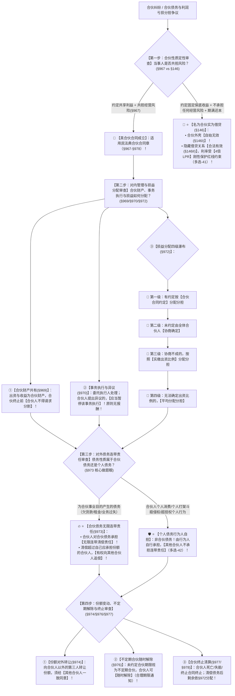

# 📐 合伙合同 · 全流程答题模型（真假合伙定性 · 损益分配四级阶梯 · 合伙债务对外连带清偿 · 异议暂停 · 不定期随时解除 · §967-§978）

> **教练开场白**
> 同学们好！我是你们的民法法考教练。在典型合同分编中，“合伙合同”是**民法典 2021 年新设独立章（将原《民法通则》个人合伙升华为典型有名合同）、在主客观题中高频考查“名为合伙实为借贷、损益分配顺序、合伙债务连带清偿”的四星级重点母题**！
> 很多同学做合伙合同题目时经常陷在以下几个“命题人最爱挖的暗坑”里：看到当事人签了“合伙协议”，却看不出“约定固定回报、不担经营风险、期满保证还本”本质上是借款合同；以为合伙没有约定利润怎么分，就直接按出资比例分（漏掉了“协商确定”这一必经法定阶梯）；把合伙人个人的违法侵权行为（如个人斗殴打伤人）当成合伙债务让全体合伙人连带赔偿；以为合伙期间合伙人可以随时要求把自己的出资和份额分割变现。
> 《民法典》合伙合同章（§967–§978）构建了**以“共担风险是合伙灵魂、名为合伙实为借贷剥壳穿透、对内事务原则共同且异议暂停、损益分配约定协商实缴平均四级瀑布、对外合伙债务无限连带、散伙前不得分家”为核心的裁判闭环**。
> 今天我们用**“四步连贯流水线”**，把合伙合同的全部真假定性、内部财产与损益分配、对外债务连带与散伙清算规则一次性彻底锁死：**第一步查定性关（真合伙共担风险 §967 vs 名为合伙实为借贷剥壳穿透 §146） → 第二步查对内管理关（合伙财产共有且终止前禁分割 §969 + 事务执行异议暂停 §970 + 损益分配四级瀑布 §972） → 第三步查对外责任关（为合伙事业目的产生的合伙债务合伙人承担无限连带责任 + 个人侵权不连带 §973） → 第四步查变动与终止关（份额对外转让须一致同意 §974 + 不定期合伙随时解除 §976 + 死亡终止清算 §977/§978）**！

---

## 适用场景与解决问题

本模型专门解决合伙合同与民间借贷定性穿透、合伙财产共有属性与分割限制、合伙事务执行与异议权效力、利润分配与亏损分担计算、合伙债务对外连带责任边界与内部追偿、合伙份额转让及退伙解约的全部主客观题考点（对应 [[典型合同考点-深度报告]] 十八·合伙合同 Row 1/2/3/4 · ★★★★ 重点高频）：重点破解：

1. **第一步 · 真假合伙定性关（《民法典》§967 + §146Ⅱ）**：
   - ⭐ **合伙本质特征（§967）**：两个以上合伙人为了**共同的事业目的**，订立的**共享利益、共担风险**的协议；**“共担风险”是合伙的灵魂！**
   - 🚨 **名为合伙实为借贷穿透（§146 核心做题眼）**：
     - 若合同约定**“固定回报 ＋ 不承担任何经营风险 ＋ 期满保证返还本金”**，其真实法律性质为**民间借贷合同**！
     - **裁判后果**：合伙协议外壳因通谋虚伪表示**无效（§146Ⅰ）**；隐藏的借款合同在无违法事由下**有效（§146Ⅱ）**，但利息受 **4 倍 LPR 司法保护上限约束**（多选-41）。
2. **第二步 · 对内财产共有与损益分配四级瀑布关（《民法典》§969/§970/§972）**：
   - ⭐ **合伙财产共同共有与分割限制（§969）**：出资及合伙收益属于合伙财产，由合伙人共同共有；**合伙合同终止前，合伙人不得请求分割合伙财产**；
   - ⭐ **事务执行与异议暂停权（§970）**：
     - 原则由全体合伙人共同执行；可委托一名或数名执行，非执行合伙人享有监督权；
     - ⭐ **提出异议暂停执行**：执行合伙人对其他合伙人执行事务提出异议的，**其他合伙人应当暂停该项事务的执行**！
     - **执行事务原则无报酬（§971）**：合伙人不得因执行事务请求报酬（另有约定除外）；
   - ⭐ **损益分配四级递进瀑布（§972 核心计算题做题眼）**：
     $$\mathbf{① 约定优先 \longrightarrow ② 未约定协商确定 \longrightarrow ③ 协商不成按【实缴出资比例】 \longrightarrow ④ 无法确定出资比例平均分配分担}$$
     - 🚨 陷阱警示：必须是**“实缴出资比例”**（非认缴）；不可跳过“协商”阶段。
3. **第三步 · 对外合伙债务连带清偿与内部追偿关（《民法典》§973）**：
   - ⭐ **合伙债务无限连带责任（§973）**：合伙人对**合伙债务**承担**连带责任**；债权人可向任何一个合伙人主张全额清偿；
   - ⭐ **超额内部追偿权**：清偿合伙债务超过自己应当承担份额的合伙人，**有权向其他合伙人追偿**；
   - 🚨 **个人债务与个人侵权严格排除（多选-42 做题眼）**：合伙人个人的非合伙事务消费借款、个人故意或与合伙无关的侵权打人行为，**属于个人债务，其他合伙人绝不承担连带责任**！
4. **第四步 · 变动、不定期随时解除与终止清算关（《民法典》§974/§976/§977/§978）**：
   - ⭐ **份额转让规则（§974）**：合伙人向**合伙人以外的第三人**转让财产份额，**须经其他合伙人一致同意**（合伙人之间内部转让除外）；
   - ⭐ **不定期合伙随时解除权（§976）**：未约定合伙期限视为不定期合伙，**合伙人可以随时解除合同**（但应在合理期限前通知）；
   - ⭐ **法定终止与清算（§977/§978）**：合伙人死亡、丧失民事行为能力或终止，合同终止（另有约定或依性质不宜终止除外）；清算支付费用、清偿合伙债务后，剩余财产按 §972 规定分配。

> **核心一句**：**合伙灵魂在共担风险，保底旱涝保收名为合伙实为借贷；散伙前财产共有不得分割，事务异议立马暂停；损益分配四级瀑布：约定＞协商＞实缴比例＞平均；对外合伙债务无限连带，超付可追偿，个人侵权自己扛；份额对外转让一致同意，不定期合伙随时能解！**
>
> 🔎 **核心法源（2026最新）**：《民法典》§146、§967、§968、§969、§970、§971、§972、§973、§974、§975、§976、§977、§978。

---

## 💡 【前置认知】合伙合同四大核心制度极速对照表

| 制度模块 | 核心法律条文 | 刚性法定规则与标准 | 考场一秒判定秘诀 |
| :--- | :--- | :--- | :--- |
| **① 真假合伙定性** | 《民法典》§967 / §146Ⅱ | 约定**固定回报 + 不担风险 + 保本** $\rightarrow$ 名为合伙实为借贷。 | 旱涝保收稳赚不赔 = **借款合同**（卡 4 倍 LPR 多选-41）！ |
| **② 损益分配四级瀑布** | 《民法典》**§972** | **约定 ＞ 协商 ＞ 实缴出资比例 ＞ 平均** | 记住“**约定协商实缴平均**”，选项跳过“协商”或写“认缴”必错！ |
| **③ 对外连带责任边界** | 《民法典》**§973** | 仅**合伙债务**承担无限连带；个人侵权由行为人自担。 | 合伙人打架伤人属于个人侵权，**其他合伙人不连带**（多选-42）！ |
| **④ 事务异议与解除** | 《民法典》§970 / §976 | • 提出异议 $\rightarrow$ **应当暂停执行**；<br>• 不定期合伙 $\rightarrow$ **随时解除（合理期限通知）**。 | 执行合伙人提出反对意见，该事项**必须立刻刹车暂停**！ |

---

## 一、 考点核心骨架与法理（四步连贯决策树）



```
【合伙合同全景】一句话开场：合伙灵魂在共担风险，保底旱涝保收名为合伙实为借贷；散伙前财产共有不得分割，事务异议立马暂停；损益分配四级瀑布：约定＞协商＞实缴比例＞平均；对外合伙债务无限连带，个人侵权自己扛；份额对外转让一致同意，不定期合伙随时能解！
│
▼ 第一步 · 查性质定性 ── 共担风险与假合伙穿透（§967/§146）
├─ 共享利益 ＋ 共担风险 ──────────────────────────────────────────→ 📜【真合伙合同成立】（§967）
└─ 固定回报 ＋ 不担风险 ＋ 期满返本 ──────────────────────────────→ 🚨【名为合伙实为借贷】（合伙壳无效，借款核有效受4倍LPR约束）
     │
     ▼ 第二步 · 查对内三件事 ── 财产/执行/分配（§969/§970/§972）
     ├─ ① 财产共同共有（§969）：──────────────────────────────────→ 终止前【不得请求分割合伙财产】
     ├─ ② 事务执行与异议（§970）：────────────────────────────────→ 执行合伙人提出异议，【应当暂停该项事务执行】（原则无报酬）
     └─ ③ 损益分配四级瀑布（§972）：──────────────────────────────→ ⭐【约定 ＞ 协商 ＞ 实缴出资比例 ＞ 平均】
          │
          ▼ 第三步 · 查对外连带边界 ── 合伙债务 vs 个人债务（§973）
          ├─ 合伙债务（为共同事业目的欠款、经营过失）：──────────────────→ 🔥【全体合伙人承担无限连带责任】（超额可向内部追偿）
          └─ 个人债务（个人消费、打架斗殴侵权）：────────────────────────→ 🛡️【行为人个人自担，其他合伙人不连带】（多选-42）
               │
               ▼ 第四步 · 查变动与终止 ── 转让、解除与散伙（§974/§976/§977）
               ├─ 份额对外转让（§974）：──────────────────────────────────→ 须经【其他合伙人一致同意】（对内转让自由）
               ├─ 不定期合伙解除（§976）：────────────────────────────────→ 合伙人可【随时解除合同】（提前合理期限通知）
               └─ 合伙终止（§977/§978）：─────────────────────────────────→ 死亡/失能/终止 ➔ 清偿合伙债务后剩余按 §972 分配

  ━━━ 四步全通 ━━━
```

---

## 二、 核心考情与 2026 民法典精要

- **频次研判**：合伙合同是民法典合同编分则**★★★★ 重点高频新设章**；将原《民法通则》中的民事合伙升格为有名合同，主客观题常与民间借贷、合伙企业、侵权责任交叉命题。
- **命题核心**：
  1. **名为合伙实为借贷穿透（§967 + §146）**：约定固定收益不承担经营风险的，按民间借贷规则处理（多选-41）。
  2. **损益分配四级递进瀑布（§972）**：约定 ＞ 协商 ＞ 实缴比例 ＞ 平均。
  3. **合伙债务无限连带 vs 个人侵权不连带（§973）**：合伙债务全体合伙人对外连带，超额内部追偿；合伙人个人打架侵权其他合伙人不担责（多选-42）。
  4. **合伙事务异议暂停效力（§970）**：合伙人提出异议的，应当暂停该事务执行。
  5. **份额对外转让一致同意（§974）**：对外转让须经其他合伙人一致同意。
  6. **不定期合伙随时解除权（§976）**：未约定合伙期限视为不定期合伙，合伙人可随时解除。

---

## 三、 三大核心法理与命题陷阱拆解

### 1. 合伙合同四大命题暗坑与裁判标准表

| 案件事实设定 | 争议焦点 | 裁判结论 | 命题陷阱与法理深剖 |
|---|---|---|---|
| 甲向乙丙开办的餐厅出资 50 万元，约定“甲不参与经营、不承担亏损，每年固定分红 10 万元，3 年期满返还 50 万元本金”。 | 该协议的真实法律性质是什么？各方权利如何认定？ | 🚨 **名为合伙实为借贷！** | 《民法典》§967及§146：甲不承担经营风险且保本保息，属于**通谋虚伪表示**；合伙外壳无效，隐藏的**民间借贷合同有效**，按年利率 20%（10万/50万）审查是否超过 4 倍 LPR（多选-41）。 |
| 甲乙丙合伙开餐馆，乙负责后厨。某日乙在餐馆因与顾客发生私人纠纷，将顾客打伤产生医疗费 5 万元。 | 乙打伤顾客的侵权赔偿，是否属于合伙债务？甲丙是否承担连带责任？ | 🛡️ **属于乙个人侵权债务！甲丙不承担连带责任！** | 《民法典》§973：连带责任仅限于**合伙债务**（为合伙事业目的产生的债务）；乙故意打人侵权属于个人行为，由乙个人承担赔偿责任，甲丙不连带（多选-42）。 |
| 甲乙丙合伙协议未约定利润分配比例。年终盈利 100 万元，甲主张按实缴出资比例（甲50%、乙30%、丙20%）直接分红。 | 合伙协议未约定利润分配，能否直接按出资比例分配？ | ❌ **不能！应当先协商确定！** | 《民法典》§972：损益分配为**四级瀑布（约定 ＞ 协商 ＞ 实缴比例 ＞ 平均）**；未约定时必须先由全体合伙人**协商**，协商不成才按实缴出资比例分配。 |
| 甲乙丙三人订立合伙合同，未约定合伙期限。经营 1 年后，甲通知乙丙解除合伙合同。 | 未约定合伙期限，甲能否随时单方解除合伙合同？ | ✅ **甲有权随时解除合伙合同！** | 《民法典》§976：合伙期限没有约定且不能确定的，**视为不定期合伙；合伙人可以随时解除合伙合同**，但应当在合理期限之前通知其他合伙人。 |

### 2. 民事合伙合同（《民法典》） vs 商事合伙企业（《合伙企业法》）极速辨析

| 对比维度 | 📜 民事合伙合同（《民法典》§967-§978） | 🏢 商事合伙企业（《合伙企业法》） |
|---|---|---|
| **主体形态** | **合同法律关系**（自然人/法人之间的契约，非独立商事主体） | **非法人组织**（依法在市场监管局登记注册领营业执照） |
| **成立要件** | 合同达成合意即成立生效，**无需登记** | **必须依法登记**方能成立（普通合伙企业 / 有限合伙企业） |
| **对外债务责任** | 全体合伙人承担**无限连带责任** | 普通合伙人连带责任；有限合伙人（LP）以认缴出资额为限承担有限责任 |
| **执行事务报酬** | ⭐ **原则无报酬**，约定除外（§971） | 可依合伙协议约定给付报酬 |

---

## 四、 万能解题四步

---

### 第一步：查性质定性关 —— 共担风险了吗？是真合伙还是借贷？（《民法典》§967/§146）

> **教练提示**：
> 1. 共同投资 ＋ 共享收益 ＋ **共担风险** $\rightarrow$ **真合伙合同（§967）**；
> 2. **固定收益 ＋ 不担风险 ＋ 保本还款** $\rightarrow$ **名为合伙实为借贷（§146）**，借贷核有效受 4 倍 LPR 规制（多选-41）。

---

### 第二步：查对内管理关 —— 财产分得了吗？异议暂停了吗？损益怎么分？（《民法典》§969-§972）

> **教练提示**：
> 1. 合伙财产共同共有，**散伙前任何人不得请求分割（§969）**；
> 2. 事务执行：有人提出反对异议，**必须立刻暂停该事务执行（§970）**；
> 3. ⭐ **损益分账四级瀑布（§972）**：**约定 ＞ 协商 ＞ 实缴比例 ＞ 平均**（严防跳过协商或错记为认缴）！

---

### 第三步：查对外责任关 —— 是公事欠债还是个人惹事？（《民法典》§973）

> **教练提示**：
> 1. **合伙债务（进货欠款、房租、经营过失）** $\rightarrow$ 全体合伙人承担**无限连带责任**，超付者向内部追偿；
> 2. **个人债务（个人消费、打架斗殴侵权）** $\rightarrow$ **由行为人个人自担，其他合伙人不连带（多选-42）**！

---

### 第四步：查变动与终止关 —— 外人进得来吗？能随时散伙吗？（《民法典》§974/§976/§977）

> **教练提示**：
> 1. 合伙份额**对外转让给外人** $\rightarrow$ 必须经**全体其他合伙人一致同意（§974）**；
> 2. **未约定合伙期限（不定期）** $\rightarrow$ 任何合伙人均可**随时解除合同（提前合理期限通知 §976）**；
> 3. 合伙人死亡/失能 $\rightarrow$ 合伙合同法定终止，清算财产。

#### 💰 完整数字案例：合伙合同定性、损益分配与对外债务攻防实战

> **【案情（[[典型合同-多选-41]] 与 [[典型合同-多选-42]] 综合演练）】**
> 甲、乙、丙三人共同出资开办“三味快餐店”，三人订立书面合伙协议：甲出资 **50 万元**，乙出资 **30 万元**，丙出资 **20 万元**（出资已全部实缴到位）。由乙负责快餐店的日常经营管理，协议未约定合伙期限，亦未约定利润分配与亏损分担比例。
> 丁向该快餐店提供资金 **20 万元**，与甲乙丙签订补充协议，约定：“丁每年固定获取 4 万元利润，不承担餐馆的任何经营亏损，3 年期满由餐馆一次性返还丁本金 20 万元”。
> 快餐店经营期间发生以下纠纷：
> - **实战分支 A（真假合伙定性穿透 · 多选-41）**：
>   快餐店当年亏损，甲乙丙以合伙亏损为由拒付丁 4 万元固定回报。
>   - 裁判涵摄：丁与甲乙丙的补充协议约定了固定回报且不承担经营风险，属于**通谋虚伪表示**；依据《民法典》§146，**合伙协议外壳无效，隐藏的民间借贷关系有效**；丁年化利率为 20%（4万/20万），在 4 倍 LPR 司法保护上限范围内，法院判令甲乙丙向丁支付借款本息（多选-41 考点）！
> - **实战分支 B（损益分配与合伙债务连带清偿 · 多选-42）**：
>   快餐店对外拖欠供应商戊食材货款 **60 万元**。同时，合伙人乙在厨房因个人口角将顾客己打伤，产生医药费 **10 万元**。供应商戊起诉甲要求清偿 60 万元货款；顾客己起诉甲要求赔偿 10 万元医药费。
>   - 裁判涵摄：
>     1. 依据《民法典》§973，拖欠戊的 60 万元货款属于**合伙债务**，甲对该 60 万元合伙债务承担**无限连带清偿责任**；甲清偿 60 万元后，因三人未约定损益分配比例且协商不成，依 §972 按照**实缴出资比例（5:3:2）**，甲自身应分担 30 万元，甲有权向乙追偿 18 万元、向丙追偿 12 万元！
>     2. 依据《民法典》§973，乙打伤顾客己属于**合伙人个人故意侵权行为，不属于合伙债务**；顾客己只能向侵权人乙主张赔偿 10 万元，**甲对该 10 万元不承担连带责任**（多选-42 考点）！

#### 一句话闭环记忆
> 🎯 **一眼判**：**合伙灵魂在共担风险，保底旱涝保收名为合伙实为借贷；散伙前财产共有不得分割，事务异议立马暂停；损益分配四级瀑布：约定＞协商＞实缴比例＞平均；对外合伙债务无限连带，超付可追偿，个人侵权自己扛；份额对外转让一致同意，不定期合伙随时能解！**

---

## 五、 案例演练

### 1. 名为合伙实为借贷定性穿透（[[典型合同-多选-41]] 经典考题）
- **案情**：当事人签订合伙协议，但约定不参与经营、不担风险、固定年化分红且期满返本。
- **模型分析**：第一步——依据《民法典》§967及§146，不具有共担风险特征，属于名为合伙实为借贷；合伙外壳无效，隐藏的借贷关系合法有效受 4 倍 LPR 约束（选 BC）。

### 2. 合伙债务连带清偿与个人侵权责任排除（[[典型合同-多选-42]] 经典考题）
- **案情**：合伙人执行合伙事务期间因私人纠纷打伤第三人，第三人要求全体合伙人承担连带赔偿责任。
- **模型分析**：第三步——依据《民法典》§973，连带责任仅限于合伙债务；个人故意侵权不属于合伙债务，由行为人个人自担，其他合伙人不承担连带责任（选 D）。

---

## 关联真题

- [[典型合同-多选-41]] · 名为合伙实为借贷定性穿透与虚伪表示效力
- [[典型合同-多选-42]] · 执行合伙事务中个人侵权与合伙债务连带边界区分

## 相关页面

- 概念实体页：[[合伙合同]] · [[借款合同]] · [[买卖合同]]
- 姊妹模型：[[民法-合同-借款合同与民间借贷模型]] · [[民法-合同-无效撤销返还模型]] · [[民法-合同-保证模型]]
- 综合报告：[[典型合同考点-深度报告]]（十八、合伙合同 · Row 1/2/3/4 · ★★★★ 重点高频）
