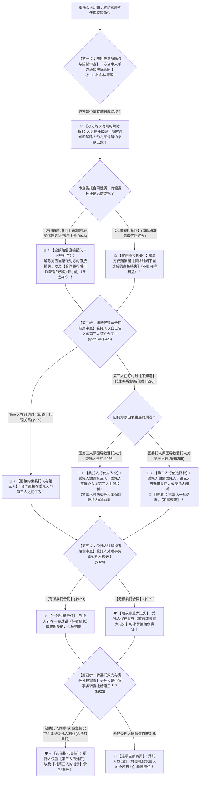

# 📐 委托合同 · 全流程答题模型（随时任意解除权 · 有偿赔可得利益vs无偿赔直接 · 间接代理介入选择权 · 过错责任双轨 · 转委托选任指示 · §919-§936）

> **教练开场白**
> 同学们好！我是你们的民法法考教练。在典型合同分编中，“委托合同”是**每年客观题必出独立大题、主观题中常作为代理与商事纠纷核心载体的五星级核心母题**！
> 很多同学做委托合同题目时经常陷在以下几个“核心命题死穴”里：以为合同约定了“违约金、不得单方解约”，当事人就丧失随时任意解除权；以为律师事务所单方解约只需要赔偿车费、复印费等直接损失，不用赔偿当事人预期胜诉利益；以为隐名代理中第三人选了委托人后，委托人没钱又能回头告受托人；以为无偿帮朋友办事不小心弄坏东西就必须全额赔偿。
> 《民法典》委托合同章（§919–§936），构建了**以“信任破裂随时撤、有偿赔偿可得利、无偿仅赔时间差、知情直接束双方、不知情介入与不可逆选择、有偿轻过错无偿重大过失、转委托选任指示”为核心的裁判闭环**。
> 今天我们用**“四步连贯流水线”**，把委托合同的全部解约赔偿、隐名代理与责任分配陷阱一次性彻底锁死：**第一步查随时任意解除权与赔偿范围关（双方均可随时解约 + 有偿赔直接损失加可得利益 vs 无偿仅赔时间不当直接损失 §933） → 第二步查间接代理与介入选择权关（知情直接约束 §925 + 不知情委托人介入 vs 第三人选择且一旦选定不可变更 §926） → 第三步查受托人过错责任归责关（有偿一般过错即担责 vs 无偿故意重大过失才担责 §929） → 第四步查转委托效力与责任分担关（合法转委托仅负选任指示责任 vs 擅自转委托全部负责 §923）**！

---

## 适用场景与解决问题

本模型专门解决委托合同单方任意解除效力认定、解除损害赔偿范围计算、间接代理（显名/隐名）合同相对性突破与权利归属、委托人介入权与第三人选择权行使、受托人履职过错损害赔偿、转委托责任认定的全部主客观题考点（对应 [[典型合同考点-深度报告]] 十一·委托合同 Row 1/2/3/4 · ★★★★ 重点高频）：重点破解：

1. **第一步 · 随时任意解除权与赔偿范围双轨关（《民法典》§933）**：
   - ⭐ **随时任意解除权（§933）**：委托人或者受托人**可以随时解除委托合同**（基于高度人身信任关系，信任破裂无需任何违约理由，解除通知到达对方即生效）；
   - 🚫 **约定排除无效**：合同中即便约定“本合同不可单方解除/提前解除应付巨额违约金”，**也不能剥夺当事人的法定任意解除权**！
   - ⭐ **解除赔偿范围双轨制（《民法典》重大立法亮点）**：
     - **有偿委托合同**：解除方应当赔偿对方的**直接损失 ＋ 合同履行后可以获得的利益（可得利益纯利润）**！（多选-47 律所解约案）；
     - **无偿委托合同**：解除方仅赔偿因**解除时间不当造成的直接损失**（无预期利润赔偿）。
2. **第二步 · 间接代理（隐名代理）制度关（《民法典》§925/§926 突破相对性王牌）**：
   - ⭐ **显名 / 知情代理（§925）**：受托人以自己的名义与第三人订立合同，**第三人在订约时知道代理关系的，该合同直接约束委托人和第三人**（委托人与第三人之间直接成立合同法律关系）；
   - ⭐ **隐名代理（第三人订约时不知道代理关系 §926）**：
     - **因第三人的原因导致受托人对委托人违约** $\rightarrow$ 受托人向委托人披露第三人，⭐ **委托人行使介入权**（委托人直接向第三人主张权利，第三人可向委托人主张对受托人的抗辩）；
     - **因委托人的原因导致受托人对第三人违约** $\rightarrow$ 受托人向第三人披露委托人，⭐ **第三人行使选择权**（第三人可以选择委托人或者受托人作为相对人主张权利，⭐ **第三人一旦选定，不得变更！** 不能因委托人无财产再回头告受托人）。
     - **委托人**原因致受托人对第三人不履行 → 受托人向第三人**披露委托人** → 第三人可**选择**受托人或委托人主张、且**不得变更**。
1. **第三步 · 受托人履职过错责任双轨关（《民法典》§929）**：
   - ⭐ **有偿委托合同**：受托人存在**一般过错（包括轻微过失）**造成委托人损失的，委托人即可请求赔偿；
   - ⭐ **无偿委托合同**：受托人只有在存在**故意或者重大过失**造成委托人损失时，才承担赔偿责任（轻过失免除赔偿）。
4. **第四步 · 转委托规则与责任配置关（《民法典》§923）**：
   - **亲自处理原则**：受托人应当亲自处理委托事务；
   - ⭐ **合法转委托（经委托人同意 OR 紧急情况下为维护委托人利益）**：受托人仅就**第三人的选任以及对第三人的指示承担责任**；
   - ⭐ **擅自转委托（未经同意）**：受托人应当对**转委托的第三人的全部行为承担连带赔偿责任**。

> **核心一句**：**委托合同随时撤，有偿赔偿可得利，无偿仅赔时间不当直接损；受托人订约看知情：知情直接束双方；不知情，第三人赖账委托人介入，委托人赖账第三人选择（选定不可变）；有偿过错就要赔，无偿重大过失才担责；同意转委托只管选任指示！**
>
> 🔎 **核心法源（2026最新）**：《民法典》§162、§919、§921、§922、§923、§925、§926、§927、§928、§929、§933、§934。

---

## 💡 【前置认知】委托合同四大核心制度极速对照表

| 制度模块 | 核心法律条文 | 适用条件与法定标准 | 考场一秒判定秘诀 |
| :--- | :--- | :--- | :--- |
| **① 任意解除赔偿双轨** | 《民法典》§933 | 双方均可**随时解除**。<br>• **有偿委托**：直接损失 ＋ **可得利益（预期纯利）**；<br>• **无偿委托**：仅赔**解除时间不当直接损失**。 | 委托合同**随时能撤**！有偿解除必须**赔足对方预期利润**（多选-47）！ |
| **② 显名代理（知情）** | 《民法典》§925 | 第三人订约时**知道**受托人与委托人代理关系。 | 合同**直接约束委托人与第三人**，无需任何介入选择程序！ |
| **③ 隐名代理（不知情）** | 《民法典》§926 | 第三人订约时**不知道**代理关系。<br>• 第三人违约 $\rightarrow$ 委托人行使**介入权**；<br>• 委托人违约 $\rightarrow$ 第三人行使**选择权**。 | 第三人选了委托人后，**绝对不能反悔再告受托人**（选定不得变更）！ |
| **④ 受托人过错责任** | 《民法典》§929 | • **有偿委托**：一般过失即担责；<br>• **无偿委托**：**故意或者重大过失**才担责。 | 帮朋友免费办事，**只有重大过失才赔**；收费办事**轻微疏忽就要赔**！ |
| **⑤ 转委托责任配置** | 《民法典》§923 | • **经同意/紧急转委托**：仅就**选任与指示**担责；<br>• **未经同意擅自转委托**：对第三人行为**全额负责**。 | 同意转委托只看有没有选错人、指令给没给对！ |

---

## 一、 考点核心骨架与法理（四步连贯决策树）



```
【委托合同全景】一句话开场：委托合同随时撤，有偿赔直接加利润，无偿仅赔时间差；知情直接束双方；不知情，第三人赖账委托人介入，委托人赖账第三人选择（不可变）；有偿过错就要赔，无偿重大过失才担责；同意转委托只管选任指示！
│
▼ 第一步 · 查随时任意解除权与赔偿 ── 信任破裂与赔偿双轨（§933）
├─ 任意解除权：委托人与受托人【均可随时解除委托合同】（约定排除无效）
└─ 赔偿范围双轨制：
     ├─ ①【有偿委托】：─────────────────────────────────────────────→ 🔥 赔偿直接损失 ＋【可得利益（预期纯利润）】（多选-47）
     └─ ②【无偿委托】：─────────────────────────────────────────────→ ⚖️ 仅赔偿因【解除时间不当造成的直接损失】
          │
          ▼ 第二步 · 查间接代理（隐名代理） ── 突破相对性（§925/§926）
          ├─ 第三人订约时【知道】代理关系（§925）：────────────────────────→ 🏢【直接约束委托人与第三人】
          └─ 第三人订约时【不知道】代理关系（§926）：
               ├─ 因第三人原因违约：受托人披露第三人 ────────────────────────→ 🚪【委托人行使介入权】（向第三人主张）
               └─ 因委托人原因违约：受托人披露委托人 ────────────────────────→ 🎯【第三人行使选择权】（选委托人 OR 受托人）
                    └─ 🚨 核心铁律：【一旦选定，不得变更】！
                         │
                         ▼ 第三步 · 查受托人过错赔偿 ── 归责双轨（§929）
                         ├─ 有偿委托：────────────────────────────────────────→ 🔥【一般过错即担责】（轻微疏忽就要赔）
                         └─ 无偿委托：────────────────────────────────────────→ 🛡️【故意或者重大过失才担责】（轻过失免责）
                              │
                              ▼ 第四步 · 查转委托规则 ── 选任与指示（§923）
                              ├─ 合法转委托（经同意 / 紧急维护利益）：───────────────→ 🛡️ 仅对【第三人的选任和指示】担责
                              └─ 擅自转委托（未经同意）：───────────────────────────→ 🚨 对【第三人的全部行为全额承担责任】

  ━━━ 四步全通 ━━━
```

---

## 二、 核心考情与 2026 民法典精要

- **频次研判**：委托合同是民法典合同编分则**★★★★ 重点高频考点**；每年在单选题、多选题中必出 1–2 题，主观题常与代理权、表见代理、委托理财连环命题。
- **命题核心**：
  1. **随时任意解除权与赔偿范围（§933）**：双方均可随时解约；有偿委托解除方必须赔偿对方**直接损失 ＋ 可得利益（预期纯利润）**（多选-47）。
  2. **间接代理之显名直接约束（§925）**：第三人订约时知情，合同直接约束委托人与第三人。
  3. **间接代理之隐名介入与选择（§926）**：第三人违约委托人介入；委托人违约第三人选择；**第三人一旦选定相对人不得变更**。
  4. **受托人过错责任双轨制（§929）**：有偿一般过错即赔；无偿故意重大过失才赔。
  5. **转委托责任边界（§923）**：经同意转委托受托人仅负选任指示责任。

---

## 三、 三大核心法理与命题陷阱拆解

### 1. 委托合同四大命题暗坑与裁判标准表

| 案件事实设定 | 争议焦点 | 裁判结论 | 命题陷阱与法理深剖 |
|---|---|---|---|
| 甲委托乙律师事务所代理诉讼，约定律师费 10 万元，合同约定“任何一方不得提前解约，否则支付违约金 20 万元”。一审前甲单方解约。 | 合同约定了不得解约及高额违约金，甲能否随时解约？ | ✅ **甲有权随时解除合同！但应当赔偿乙所可得利益！** | 《民法典》§933：任意解除权系法定权利，**约定排除无效**；因系有偿委托，甲解除应当向乙所赔偿**直接损失及合同履行后可得利益**（多选-47）。 |
| 甲委托乙购买红木家具，乙以自己名义与不知情的丙签订买卖合同。后甲无故拒付货款致乙无法付款。乙向丙披露了委托人甲。 | 丙起诉甲索要货款后，发现甲无力支付，能否改向乙起诉？ | 🚨 **丙不得再改向乙起诉！** | 《民法典》§926Ⅱ：第三人行使选择权选择委托人甲为主张对象后，**一经选定不得变更**；丙不得因甲无财产再回头告受托人乙（单选-27）。 |
| 甲无偿帮朋友乙照看宠物狗 3 天。甲带狗散步时因轻微疏忽未拉紧狗绳，狗受惊吓跑丢。 | 无偿委托下，受托人甲存在轻微过失是否赔偿乙？ | 🛡️ **甲不承担赔偿责任！** | 《民法典》§929Ⅰ：无偿委托合同，受托人仅在存在**故意或者重大过失**时才担责；甲系轻微过失（一般过失），免除赔偿责任（单选-26）。 |
| 甲委托乙出差采购，乙突发急性阑尾炎住院手术，紧急情况下为防止货物涨价，乙转委托丙代为采购并详细交代了规格型号。 | 乙在紧急情况下转委托丙，乙对丙的采购行为如何担责？ | 🛡️ **乙仅就选任和指示承担责任！** | 《民法典》§923：紧急情况下为维护委托人利益转委托属于**合法转委托**；受托人乙仅就第三人丙的选任及指示承担责任。 |

### 2. 隐名代理中“委托人介入权” vs “第三人选择权”极速对比

| 权利类型 | 触发前提事由 | 权利行使主体 | 相对人的法定抗辩保护 |
|---|---|---|---|
| **委托人介入权（§926Ⅰ）** | 因**第三人的原因**对委托人不履行义务 | **委托人**行使（主动介入向第三人主张权利） | 第三人可以向委托人主张**其对受托人的抗辩**。 |
| **第三人选择权（§926Ⅱ）** | 因**委托人的原因**对第三人不履行义务 | **第三人**行使（选委托人 OR 选受托人） | 第三人选委托人的，委托人可向第三人主张**其对受托人的抗辩以及受托人对第三人的抗辩**。⭐ **选定不得变更！** |

---

## 四、 万能解题四步

---

### 第一步：查任意解除权与赔偿关 —— 解约有效吗？赔多少？（《民法典》§933）

> **教练提示**：
> 1. 解除效力：委托人、受托人**均享有随时任意解除权**，随时通知即解除（约定不能解除无效）；
> 2. 赔偿算账：
>    - **有偿委托** $\rightarrow$ 解除方赔偿对方**直接损失 ＋ 可得利益（合同履行后的预期纯利润）**！（多选-47）；
>    - **无偿委托** $\rightarrow$ 解除方仅赔偿因**解除时间不当造成的直接损失**。

---

### 第二步：查间接代理与归属关 —— 知情吗？谁违约了？（《民法典》§925/§926）

> **教练提示**：受托人以自己名义订约：
> 1. 第三人订约时**知道**代理关系 $\rightarrow$ 合同**直接约束委托人与第三人（§925）**；
> 2. 第三人订约时**不知道**代理关系（§926）：
>    - **第三人赖账** $\rightarrow$ 委托人行使**介入权**直接向第三人要钱；
>    - **委托人赖账** $\rightarrow$ 第三人行使**选择权**（选委托人或受托人），**一旦选定绝对不可更改（选定不得变更）**！

---

### 第三步：查受托人过错归责关 —— 收钱了吗？是什么过失？（《民法典》§929）

> **教练提示**：受托人办事出差错造成损失：
> 1. **有偿委托（收费代办）** $\rightarrow$ **一般过错（轻微疏忽）就要全额赔**；
> 2. **无偿委托（免费帮忙）** $\rightarrow$ **故意或者重大过失才赔（轻微过失免责）**！

---

### 第四步：查转委托效力与责任关 —— 同意了吗？紧急吗？（《民法典》§923）

> **教练提示**：受托人找别人代办：
> 1. **经同意 / 紧急为维护委托人利益** $\rightarrow$ **合法转委托**，受托人仅对**选任和指示**担责；
> 2. **未经同意擅自转委托** $\rightarrow$ 受托人对第三人的全部行为**承担连带赔偿责任**！

#### 💰 完整数字案例：委托合同任意解除与隐名代理攻防实战

> **【案情（[[典型合同-多选-47]] 与 [[典型合同-单选-27]] 综合演练）】**
> 甲公司与乙律师事务所签订《法律服务委托合同》，约定：“乙所指派张律师为甲公司代理重大商事诉讼，委托代理报酬为 **20 万元**（其中办案成本支出预计 5 万元，乙所预期净利润 **15 万元**）；合同约定任何一方不得提前解约”。
> 同时，甲公司委托自然人丙以丙自己的名义向不知情的丁购买一批特种设备，总价款 **50 万元**。
> - **实战分支 A（有偿委托任意解除与可得利益全额赔偿 · 多选-47）**：
>   诉讼进行至开庭前夕，甲公司无故通知乙所解除《法律服务委托合同》，此时张律师已实际支出差旅交通等办案费用 2 万元。甲公司声称合同可以随时解除，仅同意补偿 2 万元直接费用。
>   - 裁判涵摄：
>     1. 解除效力：依据《民法典》§933，委托人甲公司享有**法定随时任意解除权**，解除合法有效；
>     2. 赔偿范围：因本案属于有偿委托合同，依据《民法典》§933，甲公司应当赔偿乙所的**直接损失（已支出办案费 2 万元） ＋ 合同履行后可以获得的利益（预期净利润 15 万元）**，合计应当赔偿乙所 **17 万元**！甲公司仅赔 2 万元的抗辩不成立（多选-47 考点）！
> - **实战分支 B（隐名代理第三人选择权一旦选定不可变更 · 单选-27）**：
>   丙以自己名义与不知情的丁订立设备买卖合同后，因甲公司资金断裂未向丙提供货款，导致丙无法向丁支付 50 万元货款。丙向丁披露了真实委托人甲公司。
>   丁向法院起诉委托人甲公司要求支付 50 万元货款。在法院审理执行过程中，丁发现甲公司账户已被冻结无清偿能力。丁遂向法院申请撤回对甲公司的起诉，转而起诉受托人丙要求付款。
>   - 裁判涵摄：依据《民法典》§926Ⅱ，因委托人的原因导致受托人对第三人不履行义务，受托人披露委托人后，第三人丁享有选择权；**第三人丁一旦选择向委托人甲公司主张权利，该选择权即告确定且不可变更**！丁不得因甲公司无财产再行变更起诉受托人丙，法院对丁要求丙付款的请求不予支持（单选-27 考点）！

#### 一句话闭环记忆
> 🎯 **一眼判**：**委托合同随时撤，有偿赔偿可得利，无偿仅赔时间不当直接损；受托人订约看知情：知情直接束双方；不知情，第三人赖账委托人介入，委托人赖账第三人选择（选定不可变）；有偿过错就要赔，无偿重大过失才担责；同意转委托只管选任指示！**

---

## 五、 案例演练

### 1. 律师事务所任意解除委托合同有偿责任（[[典型合同-多选-47]] 经典真题）
- **案情**：委托人与律师事务所签订有偿委托代理合同后，在开庭前单方通知解除合同。问律所有权主张何种赔偿？
- **模型分析**：第一步——依据《民法典》§933，有偿委托合同解除的，解除方应当赔偿直接损失及合同履行后可以获得的利益（可得利益纯利润）（选 ABC）。

### 2. 隐名代理中第三人选择权行使与不可变更（[[典型合同-单选-27]] 经典真题）
- **案情**：受托人披露委托人后，第三人选择起诉委托人，后发现委托人破产无财产，第三人能否再回头起诉受托人？
- **模型分析**：第二步——依据《民法典》§926Ⅱ，第三人选择委托人或者受托人主张权利后，该选择权一经行使不得变更，第三人无权再向受托人索赔（选 B）。

### 3. 无偿委托受托人过错责任标准（[[典型合同-单选-26]] · [[典型合同-多选-13]]）
- **案情**：无偿受托人处理委托事务，因一般轻微过失造成委托人财产损失。问受托人是否承担赔偿责任？
- **模型分析**：第三步——依据《民法典》§929Ⅰ，无偿委托合同中受托人仅在存在故意或者重大过失时才承担赔偿责任，一般过失免责。

---

## 关联真题

- [[典型合同-单选-13]] · 委托合同任意解除权与通知即解除
- [[典型合同-多选-13]] · 委托合同随时任意解除权与有偿无偿过错责任双轨
- [[典型合同-多选-47 · 律师事务所任意解除委托合同有偿责任案]] · 律师事务所任意解除委托合同有偿责任与可得利益赔偿
- [[典型合同-多选-25]] · 间接代理制度与委托人直接介入权
- [[典型合同-单选-26]] · 无偿委托受托人过错责任重大过失归责
- [[典型合同-单选-27]] · 隐名代理第三人选择权行使与选定不可变更规则

## 相关页面

- 概念实体页：[[委托合同]] · [[代理]] · [[行纪合同]]
- 姊妹模型：[[民法-合同-行纪与中介合同模型]] · [[民法-合同-买卖风险负担模型]] · [[民法-合同-违约责任模型]]
- 综合报告：[[典型合同考点-深度报告]]（十一、委托合同 · Row 1/2/3/4 · ★★★★ 重点高频）
