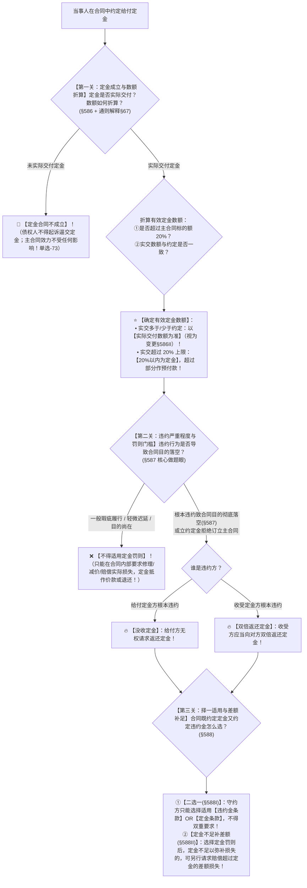

# 📐 定金合同及其规则 · 全流程答题模型（实践合同要物性 · 20% 上限与实交变更 · 定金罚则门槛 · 违约金择一与差额索赔 · 五大定金类型）

> **教练开场白**
> 同学们好！我是你们的民法法考教练。在担保与违约救济交叉板块中，“定金”是**民商法客观题高频必考、最具迷惑性的经典考点**！
> 很多同学做定金题目时，经常在以下四个核心点上“踩雷掉坑”：合同签了定金没交，能不能起诉要求对方补交定金？交定金作为主合同生效条件但没交，主合同是不是就无效了？约定了 30% 定金，违约时能不能按 30% 双倍返还？对方只是稍微晚交了半天货，能不能直接没收定金？
> 《民法典》第 586–588 条与 2023 年《合同编通则司法解释》第 67–68 条及《担保制度解释》第 67–68 条，构建了**以“实践合同交付成立、从合同独立性、20% 刚性上限、实交为准变更、根本违约触发罚则、定金违约金择一且差额补足”为核心的定金大一统裁判规则**。今天我们用**“三关连贯流水线”**，把定金合同的成立要件、有效数额折算、罚则触发与二选一选择权一次性彻底锁死：**第一关成立与数额审查（交付成立 + 20%上限 + 实交为准） → 第二关违约与罚则门槛（目的落空才罚：给付方违约没收，收受方违约双倍返还） → 第三关择一与差额索赔（定金违约金二选一 + 定金不足补差额）**。

---

## 适用场景与解决问题

本模型专门解决定金合同效力认定、定金数额折算、定金罚则适用、定金与违约金选择权及五大功能定金的全部主客观题考点（对应 [[合同总则考点-深度报告]] 七·违约责任 row 5 · ★★★★ 重点考点）：重点破解：

1. **定金合同成立与有效数额折算关**：
   - **实践合同要物性（《民法典》§586Ⅰ）**：定金合同自**实际交付定金时成立**；未实际交付定金的，定金合同**不成立**，债权人**不得起诉请求法院强制补交定金**；
   - **主从分离与主合同效力独立（《通则解释》§67）**：定金未交付仅导致定金合同不成立，**绝不影响主合同的效力**（单选-73）；
   - **20% 法定上限超额无效（§586Ⅱ）**：定金数额不得超过主合同标的额的 **20%**，超过部分不产生定金效力，仅作为**预付款**；
   - **实交多付少付视为变更（§586Ⅱ/解释§67）**：实际交付的定金数额多于或少于约定的，**视为变更约定的定金数额**（单选-74）。
2. **定金罚则适用与门槛关（《民法典》§587）**：
   - ⭐ **定金罚则触发门槛**：必须是违约行为**“致使不能实现合同目的（根本违约）”**方可适用定金罚则！轻微违约或一般瑕疵履行不得适用定金罚则；
   - **双向罚则机制**：给付定金方根本违约 $\rightarrow$ **无权请求返还定金（没收）**；收受定金方根本违约 $\rightarrow$ **双倍返还定金**；
   - **不可抗力与双方违约排除**：因不可抗力导致目的落空的，不适用定金罚则（返还原定金）；双方均违约的，不适用定金罚则。
3. **择一适用与差额补足关（《民法典》§588）**：
   - **违约金与定金二选一（§588Ⅰ）**：合同既约定违约金又约定定金的，守约方**只能选择适用违约金或者定金条款**，不得重复双收；
   - **差额补足规则（§588Ⅱ）**：选择定金罚则后，定金不足以弥补全部损失的，守约方**可以请求赔偿超过定金数额的损失**！

> **核心一句**：**定金实践交付成（不交定金不成立，主约不受丁点扰）；法定上限二成线（超额变作预付款）；实交多少算多少（多交少交算变更）；目的落空才开罚（给付没收收受双）；定金违约二选一，定金不够差额补！**
>
> 🔎 **核心法源（2026最新）**：《民法典》§586、§587、§588；**《最高人民法院关于适用〈中华人民共和国民法典〉合同编通则若干问题的解释》（法释〔2023〕13号）第67条、第68条；《最高人民法院关于适用〈中华人民共和国民法典〉有关担保制度的解释》（法释〔2020〕28号）第67条、第68条**。

---

## 💡 【前置认知】五大定金功能类型辨析表与定金 vs 订金/违约金极速对照表

### 1. 五大定金功能类型极速辨析表

| 定金类型 | 核心法律功能 | 触发条件与法律后果 | 考场实战做题眼 |
| :--- | :--- | :--- | :--- |
| **① 违约定金（典型定金）** | 担保主合同**全面正确履行**（《民法典》§587） | 一方根本违约致目的落空，适用**没收或双倍返还** | 民法典法定的标准定金形态 |
| **② 立约定金（订约定金）** | 担保**将来订立主合同**（《担保解释》§67） | 交付定金后**拒绝订立主合同**的一方，适用定金罚则 | 预约合同中最常见定金 |
| **③ 成约定金** | 作为**主合同成立的生效要件**（《担保解释》§68） | 交付定金主合同才成立；**未交付则主合同不成立** | 必须有明确特别约定 |
| **④ 证约定金** | 作为**主合同已成立的证据** | 交付定金证明双方已达成合意 | 起证明作用，兼具预付款属性 |
| **⑤ 解约定金** | 赋予当事人**单方任意解除权** | 当事人可以**放弃定金或双倍返还定金为代价，单方解除合同** | “花钱买后悔药”，不构成违约 |

---

### 2. 定金 vs 订金 / 预付款 / 违约金极速对照表

| 概念名称 | 性质与成立要件 | 违约时能否适用“双倍返还 / 没收”？ | 考场秒杀口诀 |
| :--- | :--- | :--- | :--- |
| **定金（§586）** | 担保物权/债权担保；**实践合同（交付成立）** | ✅ **适用定金罚则（没收 / 双倍返还）** | “定”字带宝盖，双倍罚得快 |
| **订金 / 预付款 / 诚意金** | 属于金钱主给付的**先行预付**；诺成性 | ❌ **不适用定金罚则**（扣除实际损失后多退少补） | “订”字言字旁，违约只退款 |
| **违约金（§585）** | 事先约定的**独立违约赔偿金**；诺成性 | ❌ **不发生双倍返还**（补偿为主，按损失调高调低） | 违约金看损失，与定金二选一 |

---

## 一、 考点核心骨架与法理（三关连贯决策树）



```
【定金纠纷全景】一句话开场：钱交没交？超没超二成？够不够根本违约？定金违约金怎么二选一？
│
▼ 第一关 · 成立与数额折算 ── 交付成立与 20% 上限（§586 + 解释§67）
├─ 没交定金 ────────────────────────────────────────────────────────→ 🚨【定金合同不成立】（不得逼交，主合同照样有效 单选-73）
└─ 实际交付定金（成立）：
     ├─ 实交多于或少于约定金额 ──────────────────────────────────────→ ⭐【以实交为准】（变更为实交金额 单选-74）
     └─ 计算 20% 刚性法定上限（主合同标的额 × 20%）：
          ├─ 实交金额 ≤ 20% ────────────────────────────────────────→ ✅ 全额按定金处理
          └─ 实交金额 > 20% ────────────────────────────────────────→ ✂️ 20% 以内属于定金，超出部分作【预付款】（不定项-01）
               │
               ▼ 第二关 · 违约程度与罚则门槛 ── 根本违约致目的落空（§587）
               ├─ 一般违约 / 瑕疵履行（目的未落空） ─────────────────────────→ ❌【不适用定金罚则】（修补赔偿，定金抵价款）
               └─ 根本违约致使合同目的落空（天言拖死法）：
                    ├─ 给付方违约 ─────────────────────────────────────────→ 🔥【没收定金】（给付方无权要求返还）
                    └─ 收受方违约 ─────────────────────────────────────────→ 🔥【双倍返还定金】（原定金退回 + 再罚一倍）
                         │
                         ▼ 第三关 · 择一适用与差额索赔 ── 违约金二选一（§588）
                         ├─ 既有定金又有违约金 ─────────────────────────────→ ⚖️【二选一】（选定金 OR 选违约金，不可叠加）
                         └─ 定金罚则不足弥补实际损失（§588Ⅱ） ──────────────→ ➕ 可另行索赔【超过定金数额的差额损失】

  ━━━ 三关全通 ━━━
```

---

## 二、 核心考情与 2026 司法解释精要

- **频次研判**：定金合同与定金罚则是民法典合同编与担保编交叉的**★★★★ 重点考点**；每年必在单选或多选、不定项中考查 1 题。
- **命题核心**：
  1. **实践合同属性（要物性）**：定金合同自**实际交付时成立**（《民法典》§586Ⅰ）；未交付的，定金合同不成立，不能请求继续交付定金。
  2. **主从分离独立性（《通则解释》§67）**：定金未交付**绝不影响主合同效力**。
  3. **20% 上限与实交变更（§586Ⅱ）**：超过 20% 部分不发生定金效力；少交定金对方接受的，**定金数额变更为实交数额**。
  4. **根本违约方可罚（§587）**：只有致使合同目的落空才能适用定金罚则。
  5. **择一适用与差额索赔（§588）**：违约金与定金二选一；定金罚则不足弥补损失可另主张差额。

---

## 三、 三大核心法理与命题陷阱拆解

### 1. 20% 法定上限与超过部分的定性计算（《民法典》§586Ⅱ）

| 案件事实设定 | 20% 上限计算 | 定金效力拆分 | 违约时的返还/罚则数额 |
|---|---|---|---|
| 房屋总价 100 万元，约定定金 30 万元，买方实付 30 万元 | 上限：$100\text{万} \times 20\% = 20\text{万元}$ | • **定金**：20 万元<br>• **预付款**：10 万元（超额部分） | **卖方根本违约**：<br>双倍返还定金 40 万 ＋ 退还预付款 10 万 ＝ **共退 50 万元**！ |
| 机器总价 50 万元，约定定金 15 万元，买方实付 15 万元 | 上限：$50\text{万} \times 20\% = 10\text{万元}$ | • **定金**：10 万元<br>• **预付款**：5 万元 | **买方根本违约**：<br>没收定金 10 万，卖方**退还预付款 5 万元**！ |

### 2. 少交定金的效力与变更规则（《民法典》§586Ⅱ + 《通则解释》§67）

| 案情设定 | 法律认定与行为性质 | 裁判结果 | 命题陷阱 |
|---|---|---|---|
| 约定定金 10 万元，买方实际仅交付 6 万元，卖方接受未提异议 | 属于**实际交付少于约定数额**（§586Ⅱ） | ⭐ **定金合同成立，定金数额变更为 6 万元**（单选-74） | ❌ 误以为定金合同因少交而“未成立”或“卖方可起诉追讨剩余 4 万元”。 |
| 约定定金 10 万元，买方一分钱未付，卖方要求其补交 10 万元 | 定金合同系**实践合同**，未交付则**定金合同不成立** | 🚨 **驳回补交定金请求**；卖方只能主张主合同违约责任 | ❌ 误以为定金合同签字即生效、可申请法院强制执行定金。 |

### 3. 定金与违约金择一适用及差额索赔（《民法典》§588）

| 诉讼请求组合 | 法律定性与裁判标准 | 考场核心秒杀眼 |
|---|---|---|
| 原告同时请求：“支付违约金 10 万元 ＋ 双倍返还定金 10 万元” | ❌ **法律禁止双重获利！** 法院释明原告**二选一**。 | 选项出现“违约金与定金并用”一律判定错误！ |
| 约定定金 5 万元（收受方违约应罚 5 万），守约方实际损失 15 万元 | ✅ **选择定金罚则 ＋ 索赔差额损失 10 万元（§588Ⅱ）** | 定金不足以弥补损失的，可另行索赔超出定金的损失差额！ |

---

## 四、 万能解题三步

---

### 第一步：成立与数额关 —— 定金成立了吗？有效定金是多少？（《民法典》§586 + 解释§67）

> **教练提示**：
> 1. 先看定金交了没有：**没交钱 $\rightarrow$ 定金合同不成立**，债权人无权要求补交定金，但**主合同依然完全有效**（单选-73）；
> 2. 实际交付了定金：
>    - 实交金额多于/少于约定：**以实交金额为准（变更为实交额）**；
>    - 核算 **20% 刚性法定上限**：超过主合同标的额 20% 的部分，一律切下来作**预付款**！

- **先懂几个词**：
  - **实践合同（要物合同）**＝光签协议不管用，钱必须真正转账到对方账上那一刻，定金合同才算出生（成立）；
  - **20% 上限超额无效**＝买 100 万的房，最多只能有 20 万算定金（享有双倍罚则），多交的 10 万只是先垫付的房款（预付款）。

---

### 第二步：违约与罚则关 —— 达到定金罚则门槛了吗？（《民法典》§587）

> **教练提示**：审查违约行为的严重程度：
> 1. 如果只是一般违约/轻微瑕疵/迟延履行（合同目的还能实现），**绝对不能开罚定金**！定金抵作价款或返还，只能要求修补或赔偿实际损失；
> 2. 只有构成**根本违约致合同目的不能实现**时，方可执行定金罚则：
>    - **给付方违约 $\rightarrow$ 没收定金**（预付款退还）；
>    - **收受方违约 $\rightarrow$ 双倍返还定金**（双倍返还有效定金 ＋ 原额退还预付款）。

---

### 第三步：择一与补足关 —— 定金违约金怎么选？（《民法典》§588）

> **教练提示**：
> 1. 合同既有定金又有违约金，守约方**二选一**；
> 2. 算账技巧：比较**“双倍定金收益（罚一倍）”**与**“违约金金额”**，哪种赔得多就选哪种；
> 3. 如果选了定金罚则但损失依然没填平，依据 §588Ⅱ 坚决主张**“赔偿超出定金数额的差额损失”**！

#### 💰 完整数字案例：定金上限、实交变更与二选一攻防实战

> **【案情（C1-不定项-01 与 C1-单选-74 规范化数字演练）】**
> 甲向乙订购价值 **100 万元**的特种设备，合同约定：“甲向乙支付定金 **25 万元**；任何一方违约应向对方支付违约金 **15 万元**”。
> - **实战分支 1（少付定金视为变更 · 单选-74）**：
>   合同签订后，甲实际仅向乙转账支付了 **18 万元**定金，乙收受后未提出异议。
>   - 裁判涵摄：依《民法典》§586Ⅱ，实际交付少于约定数额，**定金数额变更为 18 万元**（未超 100 万的 20% 上限，18 万元全部具有定金效力）。
> - **实战分支 2（超额上限与双倍返还 · 不定项-01）**：
>   若甲实际向乙全额转账支付了 **25 万元**。后乙恶意将该设备转卖给丙（根本违约），导致甲遭受实际损失 **22 万元**。甲起诉主张救济。
>   - 裁判涵摄：
>     1. **有效定金拆分**：主合同标的额 100 万的 20% 上限为 **20 万元**。因此，25 万元中 **20 万元为法定定金，5 万元为预付款**；
>     2. **定金罚则计算**：乙作为收受方根本违约，应向甲双倍返还定金 40 万元，并原额退还预付款 5 万元，**共计支付 45 万元（甲净赚 20 万元）**；
>     3. **违约金对比二选一**：若甲选违约金，乙退还全部 25 万元 + 支付 15 万元违约金 ＝ 共计 40 万元（甲净赚 15 万元）；甲显然**选择定金罚则收益最大（45 万元）**！

#### 一句话闭环记忆
> 🎯 **一眼判**：**定金实践交付成（不交不成立，主约不受扰）；法定上限二成线（超额变作预付款）；实交多少算多少（多交少交算变更）；目的落空才开罚（给付没收收受双）；定金违约二选一，定金不够差额补！**

---

## 五、 案例演练

### 1. 定金未付不影响主合同效力（[[C1-单选-73]] 经典真题）
- **案情**：买卖合同约定买方交付 5 万元定金后主合同生效。买方未付定金，但卖方已按约发货，买方受领并投入使用。后买方以未付定金主合同未生效为由拒付货款。
- **模型分析**：第一步——定金合同系实践合同，未付定金仅定金合同不成立；但买卖主合同已实际履行，依据《通则解释》第 67 条，**定金未交付绝不影响主合同效力**，买方必须按主合同支付货款（选 A）。

### 2. 定金少付视为变更（[[C1-单选-74]] 经典真题）
- **案情**：房屋买卖总价 100 万元，约定定金 20 万元。买受人实际交付 10 万元定金，出卖人出具 10 万元定金收据未提异议。后出卖人违约。问应双倍返还多少定金？
- **模型分析**：第一步与第二步——依据《民法典》§586Ⅱ，实际交付少于约定数额，**视为变更为 10 万元**；出卖人违约应双倍返还变更后的定金，即返还 $10 \times 2 = 20\text{万元}$（而非 40 万元，选 B）。

### 3. 定金 20% 上限与违约金二选一（[[C1-不定项-01]] 经典真题）
- **案情**：标的额 100 万元，约定定金 30 万元，违约金 25 万元。买方实付定金 30 万元，卖方违约致目的落空。
- **模型分析**：第一步至第三步——20% 上限为 20 万元，超额 10 万元为预付款；选择定金罚则可得双倍返还 40 万 + 预付款 10 万 = 50 万元（净得 20 万）；选择违约金可得违约金 25 万 + 退款 30 万 = 55 万元（净得 25 万）；守约方择一选择违约金方案最有利。

---

## 关联真题

- [[C1-单选-73]] · 定金未交付定金合同不成立且不影响主合同效力
- [[C1-单选-74]] · 实际交付定金少于约定数额视为变更为实交数额
- [[C1-不定项-01]] · 定金 20% 法定上限超额无效与违约金择一适用
- [[合同通则-多选-16]] · 违约责任承担与定金罚则适用

## 相关页面

- 概念实体页：[[定金]] · [[违约责任]] · [[解除]]
- 姊妹模型：[[民法-合同-违约金模型]]（违约金调整模型） · [[民法-合同-违约责任模型]]（违约救济总调度） · [[民法-合同-请求权竞合模型]]（定金违约金择一）
- 综合报告：[[合同总则考点-深度报告]]（七、违约责任 · 第 5 考点 / 顶级必考第 18 项 · ★★★★ 重点考点）
