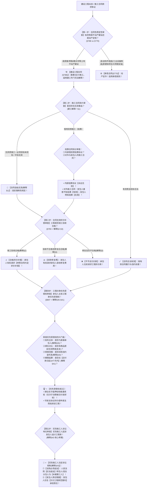

# 📐 建设工程合同 · 全流程答题模型（定性 · 资质挂靠无效 · 合格折价补偿 · 优先受偿权18个月 · 实际施工人应当追加第三人 · §788-§808）

> **教练开场白**
> 同学们好！我是你们的民法法考教练。在典型合同分编中，“建设工程合同”是**每年必考、主客观题极高频命题、且集合了合同效力、物权优先顺位与民事诉讼第三人追加的五星级王牌母题**！
> 很多同学做建工题目时经常在以下几个“新旧法反转与数字陷阱”里丢分：造个 20 米高的大型冶炼炉当成建设工程合同；挂靠借资质以为整个对外合同都无效；工程合同无效但验收合格不知道怎么结钱；优先受偿权起算时间还在记旧法“竣工之日起 6 个月”；实际施工人起诉发包人以为法院“可以”追加转包人为当事人；把买房自住的消费者权利排在工程款后面。
> 《民法典》建设工程合同章（§788–§808）与最高人民法院《关于审理建设工程施工合同纠纷案件适用法律若干问题的解释（一）》（法释〔2020〕25号）及《关于商品房消费者权利保护问题的批复》（法释〔2023〕1号），构建了**以“动产不动产定性、挂靠无效合格折价、优先受偿权 18 个月应付款日起算、实际施工人应当追加第三人、消费者超级优先”为核心的裁判闭环**。
> 今天我们用**“五步连贯流水线”**，把建工合同的全部陷阱一次性彻底锁死：**第一步定性审查（不动产建造为建工 vs 动产定制为承揽 §788/§770） → 第二步效力审查（无资质/挂靠/未招标一律无效 解释§1） → 第三步清算结算（合格折价补偿，不合格修复赔偿 §793/解释§2-§3） → 第四步优先受偿权顺位与期限（应付款日起 18 个月 + 优于抵押权 + 排除消费者超级优先 批复/解释§35-§41） → 第五步实际施工人诉讼地位（突破相对性 + 法院应当追加转包人为第三人 解释§43）**！

---

## 适用场景与解决问题

本模型专门解决建设工程合同与承揽合同定性区分、施工合同效力判定、无效合同价款折价补偿、黑白合同结算、工程价款优先受偿权顺位与 18 个月期限计算、实际施工人代位与诉讼追索的全部主客观题考点（对应 [[典型合同考点-深度报告]] 九·建设工程合同 Row 1/2/3/4 · ★★★★★ 顶级必考）：重点破解：

1. **第一步 · 承揽 vs 建设工程合同定性关（《民法典》§788/§770/§808）**：
   - ⭐ **定性唯一标准**：看标的物是否为**钉在土地上的不动产建筑物/构筑物**（房屋、道路、桥梁、大坝、管道等） $\rightarrow$ **建设工程合同（§788）**；
   - 动产制造定制（大型工业冶炼炉、锅炉、盾构机、船舶） $\rightarrow$ **承揽合同（§770）**；附随安装调试不改变承揽性质（单选-28）。
2. **第二步 · 施工合同效力与挂靠借资质关（建工解释一§1 + 《民法典》§153）**：
   - ⭐ **合同无效三大法定情形（解释§1）**：①承包人未取得建筑业企业资质或者超越资质等级；②**没有资质的实际施工人借用有资质的建筑施工企业名义（挂靠）**；③建设工程必须进行招标而未招标或者中标无效；
   - ⭐ **挂靠拆分两份合同看（单选-29 核心做题眼）**：
     - **内部挂靠协议**：无资质方与被挂靠方签订的借名/管理费协议 $\rightarrow$ **永远自始无效（解释§1）**；
     - **对外施工合同**：被挂靠方与发包人签订的施工合同 $\rightarrow$ **看发包人是否善意**（不知挂靠为有效；明知挂靠为无效）。
3. **第三步 · 合同无效结算：“合格折价补偿，不合格修复赔偿”关（《民法典》§793 + 解释§2-§3）**：
   - ⭐ **验收合格（解释§2）**：建设工程施工合同虽无效，但建设工程**经竣工验收合格**的，承包人请求**参照合同关于工程价款的约定折价补偿**的，人民法院予以支持；
   - **验收不合格（解释§3）**：
     - 修复后验收合格：发包人请求承包人承担修复费用的，予以支持；
     - 修复后仍不合格：承包人请求折价补偿的，**不予支持**！
   - ⭐ **黑白合同结算（解释§22）**：必须招标工程，阴阳合同内容不一致的，**以中标备案的中标合同（白合同）作为结算依据**！
4. **第四步 · 工程价款优先受偿权顺位与 18 个月期限关（《民法典》§807 + 解释§35-§41 + 批复）**：
   - ⭐ **受偿顺位四级阶梯（法释〔2023〕1号 + 解释§36）**：
     $$\text{商品房消费者超级优先权} > \text{建设工程价款优先受偿权} > \text{抵押权} > \text{普通金钱债权}$$
   - ⭐ **行使期限与起算点（解释§41 权威必考点）**：
     - 最长期限为 **18 个月**（废止旧法 6 个月）；
     - 起算点为**“自发包人应当给付建设工程价款之日起算”**（废止旧法竣工之日）；
   - **优先受偿权范围（解释§40）**：限于工作人员报酬、材料款等实际支出；**不包括违约金、利息和损失赔偿**！
   - **主体限制（解释§35）**：限于与发包人订立合同的**直接承包人**（实际施工人原则上不直接享有优先受偿权）。
5. **第五步 · 实际施工人突破相对性与诉讼地位关（建工解释一§43）**：
   - ⭐ **诉讼当事人追加铁律（解释§43 权威做题眼）**：实际施工人以发包人为被告主张权利的，人民法院**“应当追加转包人或者违法分包人为本案第三人”**（废止旧法“可以”追加）；
   - **责任限额**：发包人仅在**“欠付发包工程款范围内”**对实际施工人承担责任。

> **核心一句**：**不动产建工动产承揽，体积再大也是定作；无资质挂靠合同一律废，合格折价不合格自费修；黑白合同咬死中标白合同；优先受偿权优于抵押权，十八个月应付款日起算，房屋消费者霸气排第一；实际施工人起诉发包人，法院【应当追加】转包人为第三人，欠多少赔多少！**
>
> 🔎 **核心法源（2026最新）**：《民法典》§770、§788、§789、§793、§807、§808；《最高人民法院关于审理建设工程施工合同纠纷案件适用法律若干问题的解释（一）》（法释〔2020〕25号）第1条至第3条、第22条、第35条至第43条；《最高人民法院关于商品房消费者权利保护问题的批复》（法释〔2023〕1号）第1条至第3条。

---

## 💡 【前置认知】建设工程五大核心数字与顺位红线极速对照表

| 制度模块 | 核心法律依据 | 刚性法定规则与顺位要求 | 考场一秒判定秘诀 |
| :--- | :--- | :--- | :--- |
| **① 定性区分** | 《民法典》§788 / §770 | 不动产工程为建工合同；**大型设备/动产制造为承揽合同**。 | 冶炼炉、盾构机、特种机床**一律是承揽**（单选-28）！ |
| **② 无效清算** | 《民法典》§793 / 解释§2-§3 | 经竣工**验收合格** $\rightarrow$ **参照合同约定折价补偿**。 | 合格照样给钱（折价补偿），不合格修好扣修复费！ |
| **③ 优先受偿权顺位** | 法释〔2023〕1号 / 解释§36 | **消费者交付/退款 ＞ 工程价款优先权 ＞ 抵押权 ＞ 普通债权** | 居住买房消费者排第 1，工程款排第 2 赢抵押权！ |
| **④ 优先受偿权期限** | 建工解释一**第41条** | **最长 18 个月**，自**发包人应当给付价款之日**起算 | 记住“**18 个月 + 应付款日**”（选项写“6个月/竣工日”必错）！ |
| **⑤ 实际施工人诉讼** | 建工解释一**第43条** | 人民法院**【应当追加】**转包人/分包人为**【第三人】** | 记住“**应当 + 第三人**”（选项写“可以/共同被告”必错）！ |

---

## 一、 考点核心骨架与法理（五步连贯决策树）



```
【建设工程全景】一句话开场：不动产建工动产承揽；无资质挂靠合同废，合格折价不合格自费修；优先受偿权优于抵押权，十八个月应付款日起算；实际施工人告业主，法院应当追加第三人！
│
▼ 第一步 · 查性质定性 ── 建工 vs 承揽（§788/§770）
├─ 不动产建造（房屋、道路、大桥、大坝）：───────────────────────────────→ 🏗️【建设工程合同】
└─ 动产制造（大型冶炼炉、机床、盾构机、船舶）：───────────────────────→ ⚙️【承揽合同】（体积再大也是承揽）
     │
     ▼ 第二步 · 查合同效力 ── 无效三情形与挂靠拆分（解释§1）
     ├─ 无资质 / 未招标 / 中标无效：───────────────────────────────────→ 🚨【合同自始无效】
     └─ 挂靠（借用资质）：
          ├─ 内部挂靠协议 ─────────────────────────────────────────────→ 🚨【永远自始无效】
          └─ 对外施工合同 ─────────────────────────────────────────────→ 善意不知情【有效】；明知挂靠【无效】
               │
               ▼ 第三步 · 查无效清算 ── 合格折价不合格修复（§793/解释§2-§3）
               ├─ 验收合格（解释§2）：────────────────────────────────────────→ 🔥【参照合同约定折价补偿】（照单结钱）
               ├─ 修复后合格（解释§3）：──────────────────────────────────────→ ⚖️ 扣除修复费用后支付
               └─ 修复后仍不合格：────────────────────────────────────────────→ ❌【不予支付任何价款】
                    │
                    ▼ 第四步 · 查工程价款优先受偿权 ── 顺位与 18 个月（§807/解释§35-§41）
                    ├─ 顺位排座次：⭐【消费者交付请求权 ＞ 工程价款优先受偿权 ＞ 抵押权 ＞ 普通债】
                    ├─ 期限与起算点：⭐【最长 18 个月，自发包人应当给付价款之日起算】（解释§41）
                    └─ 受偿范围（解释§40）：限于人工费、材料费等实际成本，【不含违约金与利息】！
                         │
                         ▼ 第五步 · 查实际施工人突破相对性 ── 应当追加第三人（解释§43）
                         ├─ 诉讼程序：实际施工人告发包人，法院⭐【应当追加转包人为本案第三人】！
                         └─ 实体责任：发包人仅在⭐【欠付工程款范围内】向实际施工人承担责任！

  ━━━ 五步全通 ━━━
```

---

## 二、 核心考情与 2026 民法典精要

- **频次研判**：建设工程合同是民法典合同编分则**★★★★★ 顶级必考母题**；客观题每年必考 1–2 题，主观题常作为商事纠纷、物权清偿大题的综合载体。
- **命题核心**：
  1. **承揽 vs 建工定性（§788/§770）**：冶炼炉、变压器等可移动动产设备定作，一律定性为承揽合同（单选-28）。
  2. **挂靠借资质的效力拆分（解释§1）**：内部挂靠协议必无效；对外施工合同发包人善意时有效（单选-29）。
  3. **无效清算折价补偿（§793 + 解释§2）**：合同无效但工程验收合格，**参照合同约定折价补偿**。
  4. **优先受偿权 18 个月与应付款日起算（解释§41）**：优于抵押权，最长 18 个月，自发包人应当给付价款之日起算（单选-31）。
  5. **实际施工人追加规则（解释§43）**：法院**应当追加转包人/违法分包人为第三人**，发包人在欠付范围内担责（单选-30）。

---

## 三、 三大核心法理与命题陷阱拆解

### 1. 建设工程五大命题暗坑与裁判标准表

| 案件事实设定 | 争议焦点 | 裁判结论 | 命题陷阱与法理深剖 |
|---|---|---|---|
| 钢厂甲定制高 20 米的特种工业冶炼炉，乙负责设计制造并在甲厂区安装调试 | 冶炼炉体积巨大且安装在厂区，是建工合同还是承揽合同？ | ⚙️ **定性为承揽合同！** | 标的物属于工业设备（动产定制），体积虽大仍属于承揽合同（定作 §770）；安装调试为附随义务（单选-28）。 |
| 无资质施工队挂靠有资质的建工集团，以集团名义与不知情的发包人订立施工合同 | 内部挂靠协议与对外施工合同各自效力如何？ | • **挂靠协议无效！**<br>• **对外施工合同有效！** | 内部借资质协议因违法强制性规定自始无效（解释§1）；发包人善意不知情，对外合同有效，建工集团为承包人（单选-29）。 |
| 施工合同因借用资质无效，但工程完工后经发包人竣工验收合格。承包人请求付款。 | 合同无效，承包人能否要求按约定价格支付工程款？ | ✅ **支持参照合同约定折价补偿！** | 《民法典》§793及解释§2：**验收合格参照合同约定折价补偿**；干得好质量过关照样拿钱（多选-28）。 |
| 承包人于 2024年1月1日 应当获得工程尾款。至 2025年5月1日（16个月）起诉主张工程款优先受偿权。 | 优先受偿权期限是 6 个月还是 18 个月？从何时起算？ | 🏆 **优先受偿权成立并支持！** | 建工解释一§41：优先受偿权期限为**最长 18 个月**（非 6 个月），**自应当给付价款之日起算**（非竣工日）（单选-31）。 |
| 实际施工人丙以发包人甲为被告起诉索要欠付工程款，未列转包人乙为当事人。 | 法院在诉讼程序上应当如何处理？ | 🚨 **法院应当追加乙为第三人！** | 建工解释一§43：实际施工人起诉发包人的，法院**应当追加转包人或者违法分包人为本案第三人**（单选-30）。 |

### 2. 工程款优先受偿权顺位与消费者超级优先权对抗

| 债权主体与请求权类型 | 清偿受偿顺位 | 法律依据与做题眼 |
|---|---|---|
| **商品房消费者（购房自住 + 全款）** 房屋交付请求权与退款请求权 | 🥇 **第一顺位（超级优先权）** | 《商品房消费者批复》§2：优先于工程价款优先受偿权和抵押权。 |
| **建设工程承包人** 建设工程价款优先受偿权 | 🥈 **第二顺位（法定优先权）** | 《民法典》§807 + 解释§36：**优于抵押权和普通债权**。 |
| **银行等金融机构** 不动产抵押权 | 🥉 **第三顺位（担保物权）** | 《民法典》§394：劣后于工程款优先权，优于普通债权。 |
| **发包人的其他普通债权人** 普通金钱债权 | 🏅 **第四顺位（普通债权）** | 债权平等原则，最后参与分配。 |

---

## 四、 万能解题五步

---

### 第一步：查性质定性关 —— 是承揽还是建工？（《民法典》§788/§770）

> **教练提示**：
> 1. 看标的物形态：
>    - 房屋、厂房、桥梁、公路、地下管道 $\rightarrow$ **建设工程合同（§788）**；
>    - 工业冶炼炉、盾构机、特种机床、船舶 $\rightarrow$ **承揽合同（§770）**；
> 2. 记住：体积再大也是承揽，安装调试不改变承揽性质（单选-28）！

---

### 第二步：查合同效力关 —— 无资质/挂靠/未招标了吗？（建工解释一§1）

> **教练提示**：
> 1. 无资质、超越资质、未招标、中标无效 $\rightarrow$ **合同自始无效**；
> 2. 挂靠拆两份：
>    - 内部借名协议 $\rightarrow$ **一律自始无效**；
>    - 对外施工合同 $\rightarrow$ 发包人善意不知情为**有效**，发包人明知为**无效**（单选-29）！

---

### 第三步：查无效清算关 —— 验收合格了吗？（《民法典》§793/解释§2-§3）

> **教练提示**：合同无效后看质量：
> 1. **竣工验收合格** $\rightarrow$ **参照合同约定折价补偿（解释§2）**；
> 2. **验收不合格** $\rightarrow$ 修复后合格扣修复费，修复仍不合格一分不给（解释§3）；
> 3. **阴阳合同** $\rightarrow$ 必须以**中标备案的白合同**结算（解释§22）。

---

### 第四步：查优先受偿权关 —— 顺位第几？过了 18 个月没？（解释§35-§41 + 批复）

> **教练提示**：
> 1. 顺位排座次：**消费者超级优先 ＞ 工程款优先受偿权 ＞ 抵押权 ＞ 普通债**；
> 2. ⭐ **算时间：最长 18 个月，自发包人应当给付价款之日起算（解释§41）**；
> 3. 算范围：人工费、材料费等实际成本，**违约金、利息、损失赔偿一秒排除（解释§40）**！

---

### 第五步：查实际施工人关 —— 追加第三人了吗？（建工解释一§43）

> **教练提示**：实际施工人（包工头）起诉发包人（业主）：
> 1. 诉讼程序：法院**“应当追加转包人/分包人为第三人”**（选项写“可以追加”或“列为共同被告”必错！）；
> 2. 责任边界：发包人仅在**“欠付工程款范围内”**担责，发包人不倒贴！

#### 💰 完整数字案例：建设工程优先受偿权与实际施工人攻防实战

> **【案情（[[典型合同-单选-30]] 与 [[典型合同-单选-31]] 综合演练）】**
> 发包人甲公司与承包人乙建筑公司订立《办公楼施工合同》，合同总价款 **1000 万元**。约定竣工验收后 30 日内付清全款。2023年6月1日 办公楼竣工验收合格（应当付款日为 **2023年7月1日**）。甲公司仅支付了 600 万元，尚欠工程款 **400 万元**及逾期违约金 **50 万元**。
> 同时，甲公司此前已将该在建工程抵押给丙银行，担保债权 **800 万元**并办理了抵押登记。
> 乙公司将其中附属工程违法分包给实际施工人丁（包工头），乙公司拖欠丁人工劳务费 **100 万元**。
> - **实战分支 A（工程款优先受偿权顺位与范围 · 单选-31）**：
>   2024年9月1日（自应付款日 2023年7月1日 起第 14 个月），乙公司起诉主张工程价款优先受偿权，要求就办公楼拍卖款优先于丙银行抵押权受偿欠款 400 万元及违约金 50 万元。
>   - 裁判涵摄：
>     1. 期限审查：自应当付款日 2023年7月1日 至起诉日为 14 个月，未超过法定 **18 个月最长期间（解释§41）**；
>     2. 范围审查：优先受偿权范围限于工程款本金 400 万元，**逾期违约金 50 万元不属于优先受偿范围（解释§40）**；
>     3. 顺位裁决：乙公司的 400 万元工程款优先受偿权**优先于丙银行的 800 万元抵押权受偿**！
> - **实战分支 B（实际施工人诉讼地位 · 单选-30）**：
>   实际施工人丁直接以发包人甲公司为被告提起诉讼，要求甲公司向其支付拖欠的 100 万元劳务款。丁未将转包人乙公司列为当事人。
>   - 裁判涵摄：
>     1. 程序处理：依据《建工解释一》第 43 条，人民法院**应当追加转包人乙公司为本案第三人**；
>     2. 实体责任：甲公司尚欠乙公司工程款 400 万元（大于 100 万元），甲公司在**欠付工程款 400 万元范围内向实际施工人丁承担给付 100 万元工程款的责任**！

#### 一句话闭环记忆
> 🎯 **一眼判**：**不动产建工动产承揽，体积再大也是定作；无资质挂靠合同一律废，合格折价不合格自费修；黑白合同咬死中标白合同；优先受偿权优于抵押权，十八个月应付款日起算，房屋消费者霸气排第一；实际施工人起诉发包人，法院【应当追加】转包人为第三人，欠多少赔多少！**

---

## 五、 案例演练

### 1. 建设工程合同与承揽合同定性区分（[[典型合同-单选-28]] 经典真题）
- **案情**：钢厂定制高度达 20 米的重型工业冶炼炉，由制造方设计制造并负责安装调试。
- **模型分析**：第一步——标的物为工业专用设备（动产定制），定性为承揽合同（§770）；安装调试属于附随义务，不因体积庞大而认定为建设工程合同（选 A）。

### 2. 挂靠施工合同效力与责任承担（[[典型合同-单选-29]] · [[典型合同-多选-28]]）
- **案情**：无资质施工队挂靠有资质企业名义，与不知情发包人订立施工合同。工程完工验收合格。
- **模型分析**：第二步与第三步——内部挂靠协议自始无效；发包人善意，对外施工合同有效；工程竣工验收合格，参照合同约定折价补偿（多选-28 选 ABD）。

### 3. 实际施工人突破相对性起诉程序（[[典型合同-单选-30]] 经典真题）
- **案情**：实际施工人以发包人为被告主张权利，法院在诉讼程序中如何追加当事人？
- **模型分析**：第五步——依据《建工解释一》第 43 条，人民法院**应当追加转包人或者违法分包人为本案第三人**，发包人在欠付工程款范围内承担责任（选 C）。

### 4. 建设工程价款优先受偿权全景规则（[[典型合同-单选-31]] 经典真题）
- **案情**：承包人主张优先受偿权，涉及优于抵押权、不含违约金利息、自应当给付建设工程价款之日起算 18 个月等规则。
- **模型分析**：第四步——依据《建工解释一》§36、§40、§41，优先受偿权顺位优于抵押权，范围不含违约金，期限为 18 个月且自应当给付价款之日起算。

---

## 关联真题

- [[典型合同-单选-28]] · 建设工程合同与承揽合同定性区分
- [[典型合同-单选-29]] · 挂靠借用资质合同效力与折价补偿主体
- [[典型合同-多选-28]] · 建设工程合同无效竣工验收合格折价补偿
- [[典型合同-单选-30]] · 实际施工人诉讼程序与法院应当追加第三人
- [[典型合同-单选-31]] · 建设工程价款优先受偿权顺位、范围与 18 个月期限

## 相关页面

- 概念实体页：[[建设工程合同]] · [[承揽合同]] · [[优先受偿权]]
- 姊妹模型：[[民法-合同-买卖风险负担模型]] · [[民法-合同-违约责任模型]] · [[民法-合同-无效撤销返还模型]]
- 综合报告：[[典型合同考点-深度报告]]（九、建设工程合同 · Row 1/2/3/4 · ★★★★★ 顶级必考）
