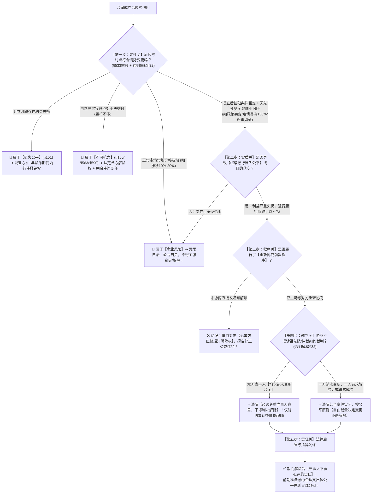

# 📐 情势变更 · 全流程答题模型（构成四要件 · 商业风险界分 · 协商前置 · 司法变更解除 · 解释§32）

> 🔗 **所属报告**：[[合同总则考点-深度报告]]（三、履行 · 第 6 考点 / 顶级必考第 8 项 · ★★★★★ 顶级必考）  
> 🎯 **适用真金题矩阵**：  
> - [[合同通则-单选-49 · 地震致成本暴涨协商被拒情势变更案|单选-49 · 地震致成本暴涨与显失公平/不可抗力辨析案]]  
> - [[合同通则-单选-62 · 新冠疫情下原材料暴涨与情势变更及商业风险界分案|单选-62 · 疫情致原料暴涨150%情势变更与商业风险界分案]]  
> - [[合同通则-多选-26 · 突发禁渔致无法按期交付情势变更全要件案|多选-26 · 突发禁渔政策致目的落空情势变更全要件案]]  
> ⚖️ **核心法源（2026最新）**：《中华人民共和国民法典》第6条（公平原则）、第533条（情势变更规则）、第563条、第590条；**《最高人民法院关于适用〈中华人民共和国民法典〉合同编通则若干问题的解释》（法释〔2023〕13号）第32条（情势变更的司法认定与裁决规则）**。

---

## 一、 【核心认知】情势变更“五步动态闭环决策树”



---

## 二、 【情势变更核心法理与 2026 司法解释精解】

---

### 1. 情势变更的构成四要件（《民法典》§533）

1. **时点要件（成立后至履行完毕前）**：基础条件的重大变化必须发生在**合同成立之后、履行完毕之前**；
2. **不可预见要件**：该重大变化是当事人在订立合同时**无法合理预见**的（以一般商事主体的通常注意义务为标准）；
3. **非商业风险要件**：该变化**不属于正常的商业风险**（非市场规律允许范围内的常规价格波动）；
4. **实质要件（继续履行显失公平）**：若继续维持原合同效力，将导致当事人一方**利益严重失衡（显失公平）**，或导致合同目的根本无法实现。

---

### 2. ⭐⭐⭐⭐⭐ 四大易混制度高精辨析（法考绝杀矩阵）

| 比较维度     | **情势变更**（§533）          | **商业风险**（自担） | **不可抗力**（§180/§563） | **显失公平**（§151）      |
| :------- | :---------------------- | :----------- | :------------------ | :------------------ |
| **发生时点** | **合同成立后**               | 合同成立后        | 合同成立后               | **合同订立时**           |
| **变化性质** | 异常客观突变（政策/灾害/暴涨）        | 常规市场供求与价格浮动  | 无法预见、避免、克服的客观情况     | 利用对方处于危困状态/缺乏判断     |
| **履行状态** | **履行极度艰难、显失公平**（能履行但不公） | 正常经营盈亏（能履行）  | **绝对履行不能**（物理或法律不能） | 合同自始存在对价畸轻畸重        |
| **救济途径** | **先协商 ➔ 诉请法院变更或解除**     | 必须按约继续履行     | **单方直接通知解除**（法定解除权） | **诉请法院撤销合同**（1年除斥期） |
| **违约责任** | **无需承担违约责任**，损失公平分担     | 违约方承担违约赔偿    | 依法**免除违约责任**        | 合同自始无效，有过错方承担返还赔偿   |

---

### 3. ⭐⭐⭐⭐⭐ 2026 司法解释裁判新规（《合同编通则解释》§32）

1. **商业风险与情势变更的界分细化**：
   - 正常的通货膨胀、原材料价格常规上涨（如 10%~30%），属于当事人订立合同时应当自担的商业风险；
   - 因**突发重大疫情、国家产业政策紧急调整、国际地缘政治剧变**导致的原材料**暴涨数倍（如暴涨150%）**，超出合理预见范围，属于情势变更。
2. **协商前置义务**：
   - 受不利影响的当事人应当及时与对方重新协商；未积极协商直接停工或发函解除的，对方可主张违约救济。
3. **⭐ 司法裁判权的行使边界（高频做题眼）**：
   - **形成诉权属性**：情势变更**不产生单方直接通知解除权**，当事人必须向**人民法院或者仲裁机构**提起变更或者解除请求；
   - **“双方求变不得解除”铁则**：如果双方当事人**均仅向法院请求变更合同**，法院应当尊重当事人意思自治，**不得擅自裁决解除合同**（见多选-26）！

---

## 三、 【三大全景贯穿案例群演练】

---

### 场景 A：疫情导致固定单价建筑材料暴涨 150%（情势变更 vs 商业风险）

> **【案情】**：乙建筑公司与甲置业公司签订工程承包合同，约定固定总价。开工后突发新冠疫情，钢材水泥等原材料价格暴涨 150%，若按原价履行乙公司将直接亏损数千万元导致破产。乙公司找甲公司协商调价被拒，遂诉至法院。甲公司抗辩称双方约定了固定单价，价格变动属于商业风险。

```
【流水线推演】：
▼ 第一步定性：疫情导致原材料暴涨150% ──→ 远超正常市场波动幅度，属于订立时无法预见、非商业风险的重大变化。
▼ 第二步实质：强行按原固定单价履行将致乙公司破产 ──→ 属于继续履行显失公平。
▼ 第三步程序：乙公司已找甲公司协商调价被拒 ──→ 满足协商前置程序。
▼ 第四步裁判：符合《民法典》§533 情势变更 ──→ 法院结合案件实际，依公平原则判决上调工程价款或解除合同。
```

---

### 场景 B：政府突发禁渔令导致海鲜美食节交付落空（程序与裁判权边界）

> **【案情】**：乙公司向甲公司订购一批鲜活海鲜，特意约定在4月份乙公司举办“海鲜美食节”前交付。4月捕捞区政府突发禁渔令一个月，导致甲公司无法在节前捕捞交付。甲公司找乙公司协商，双方均请求法院变更交付日期与规格。

```
【流水线推演】：
▼ 第一步定性：政府突发行政禁令导致节前无法交付 ──→ 属于情势变更（§533）。
▼ 第二步程序：甲公司主动与乙公司重新协商 ──→ 协商前置程序合法。
▼ 第三步裁判边界：双方当事人在诉讼中均仅请求法院变更合同 ──→ 法院受当事人诉请约束，【不得直接判决解除合同】！
```

---

### 场景 C：地震导致运输成本翻倍（情势变更 vs 不可抗力 vs 显失公平）

> **【案情】**：甲乙签订长期供货合同。后因途经地区发生地震道路损毁，必须绕道运输导致运费暴涨，甲供货将面临重大亏损。甲与乙协商调价被拒。

```
【流水线推演】：
▼ 概念排查：
  - 非重大误解：订立时双方意思表示清晰，无认识错误；
  - 非不可抗力撤销：地震虽属不可抗力，但不可抗力是免责/解除事由，绝对不能作为“撤销”事由；
  - 非显失公平：利益失衡发生在合同成立后，非订立时利用危困；
▼ 结论：成立后基础条件巨变 + 显失公平 ──→ 构成情势变更，甲有权请求法院变更合同（单选-49）。
```

---

## 四、 【终极背诵通杀口诀 / 答题判断链】（考试怎么答题）

> ⭐ **【考场通杀背诵公式】**：
> 
> 🔹 **【情势变更判定口诀】**：  
> **“签时就亏显失公平（撤销），签后天变情势变更（改或解）；”**  
> **“正常涨跌商风险（自担），暴涨数倍情势变（法官调）；”**  
> **“天灾不能履行是不可抗力（免责），极难极亏是情变；”**  
> **“情势变更先商量，不成才能找法官；”**  
> **“双方都只求变更，『法官千万莫解除』(解释§32)！”**

---

## 五、 【命题人最爱挖的 5 大暗坑】（避坑防错补丁）

在法考客观题选项中，出现以下特征表述直接判定为错误：

1. ❌ **暗坑 1（情势变更发生后，受不利影响方享有单方通知解除权）**：
   - 选项表述为“因钢材价格暴涨构成情势变更，卖方有权直接向买方发出解除合同通知，通知到达即解除” $\rightarrow$ **错误！**（情势变更属于**裁判变更/解除**，无单方通知形成权，必须先协商、协商不成请求法院/仲裁解除）。
2. ❌ **暗坑 2（将合同成立后的价格暴涨定性为“显失公平可撤销”）**：
   - 选项表述为“合同成立后因原材料暴涨导致卖方巨亏，卖方有权以显失公平为由主张撤销合同” $\rightarrow$ **错误！**（显失公平仅适用于**订立合同时**的初始利益失衡；履行中的失衡只能走情势变更）。
3. ❌ **暗坑 3（认为不可抗力是合同的可撤销事由）**：
   - 选项表述为“因发生地震属于不可抗力，当事人有权请求法院撤销合同” $\rightarrow$ **错误！**（不可抗力的法定后果是**解除合同或免除违约责任**，不可抗力绝非可撤销事由）。
4. ❌ **暗坑 4（当事人双方均请求法院变更合同时，法院可以直接判决解除合同）**：
   - 选项表述为“甲乙双方均请求法院调整合同价款，法院经审理认为继续履行不妥，直接判决解除合同” $\rightarrow$ **错误！**（依《通则解释》§32，双方均仅请求变更的，法院**不得解除合同**）。
5. ❌ **暗坑 5（因情势变更解除合同后，违约方仍须承担全额预期利润赔偿）**：
   - 选项表述为“因情势变更法院判决解除合同，受不利影响方应当赔偿对方合同正常履行的可得利润” $\rightarrow$ **错误！**（情势变更解除**不产生违约责任**，仅依公平原则合理分担已发生的必要损失）。

---

## 六、 【真题矩阵实战演练与 100% 支撑验证】

| 真题卡片 | 核心考向 | 答题模型流水线支撑与秒杀定位 |
|---|---|---|
| **[[合同通则-单选-49 · 地震致成本暴涨协商被拒情势变更案\|单选-49]]** | 地震致成本暴涨与四大制度辨析 | **概念矩阵秒杀**：成立后失衡走情势变更，排除重大误解A、不可抗力撤销B、显失公平C（秒杀 D）。 |
| **[[合同通则-单选-62 · 新冠疫情下原材料暴涨与情势变更及商业风险界分案\|单选-62]]** | 疫情致原料暴涨150%与商业风险界限 | **第一步定性**：暴涨150%远超正常商业风险幅度，适用情势变更由法院调价（秒杀 C）。 |
| **[[合同通则-多选-26 · 突发禁渔致无法按期交付情势变更全要件案\|多选-26]]** | 突发禁渔政策致目的落空全要件 | **第四步裁判规则**：认定情势变更 + 协商前置 + 双方求变更法院不得解除（秒杀 ABCD）。 |

---

## 七、 相关页面

- 概念实体页：[[情势变更]] · [[解除]] · [[合同效力分级]]
- 关联答题模型：[[民法-合同-合同可撤销模型]] · [[民法-合同-履行抗辩权模型]] · [[民法-合同-涉他合同与代为履行模型]]
- 综合报告：[[合同总则考点-深度报告]]（三、履行 · 第 6 考点 / 顶级必考第 8 项）
