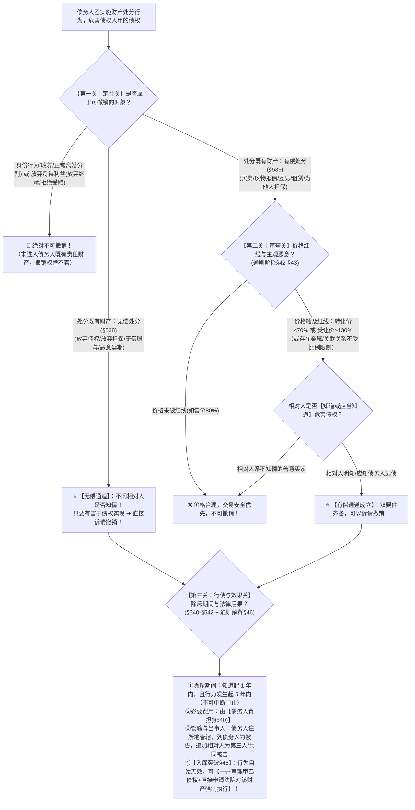

# 📐 债权人撤销权 · 全流程答题模型（入库突破 · 70%低价/130%高价双标准 · 行为类型扩展 · 解释§42-§46）

> **教练开场白**
> 同学们好！我是你们的民法法考教练。在民法保全制度中，如果说“代位权”打的是债务人的**消极懒惰（躺平不催债）**，那么“撤销权”打的就是债务人的**积极使坏（恶意转移、挥霍、掏空财产）**！
> 很多同学做撤销权的题目经常掉坑：低价卖房到底打几折算违法？白送东西要不要看买家知不知情？拿房子抵债或者假装长租 20 年能不能撤？撤销之后房子是不是就直接归债权人所有了？
> 《民法典》第 538–542 条以及 2023 年《合同编通则司法解释》第 42–46 条，确立了**“70%/130%量化双标准、行为类型四扩张、入库突破一并执行”**的现代化裁判体系。今天我们用**“三关连贯流水线”**，把撤销权的对象、要件、红线与执行一次性彻底打通：**第一关对象排除与行为定性 → 第二关主观恶意与70%/130%量化红线 → 第三关除斥期间与一并直接执行**。

---

## 适用场景与解决问题

本模型专门解决债权人保全制度中“撤销权”的全部主客观题考点（对应 [[合同总则考点-深度报告]] 四·保全 row 2 · ★★★★★ 顶级必考）：重点破解：

1. **对象排除与定性关**：撤销权仅针对**处分既有财产的行为**，严格排除**身份行为（收养/正常离婚分割）**与**放弃将得利益（放弃继承/拒绝受赠）**；区分**§538 无偿处分（绝对不问相对人是否知情）** vs **§539 有偿处分（必须满足相对人知情恶意）**。
2. **量化红线与行为扩张关**：**《通则解释》§42 明确 70% 低价 / 130% 高价量化双标准**（关联关系除外）；**《通则解释》§43 行为类型四扩张（互易/以物抵债/租赁/知识产权许可）**。
3. **除斥期间与执行关**：**§541 严格除斥期间（1年知道起 / 5年行为起，不可中断中止）**；**《通则解释》§46 入库突破（一并审理债权债务 + 法院直接对相对人财产强制执行）**；撤销后债权人**不能直接取得标的物所有权**（仍属金钱债权受偿）。

> **核心一句**：**撤销权打掏空财产，身份行为、放弃继承管不着；无偿白送不问知情（直接撤），有偿买卖必查知情（且卡70%/130%红线）；抵债租赁互易全算处分；一年五年除斥期不暂停；撤销自始失效，一并审理直接执行！**
>
> 🔎 **核心法源（2026最新）**：《民法典》§538、§539、§540、§541、§542、§154；**《最高人民法院关于适用〈中华人民共和国民法典〉合同编通则若干问题的解释》（法释〔2023〕13号）第42条（70%/130%双标准）、第43条（行为类型扩张）、第44条（管辖与当事人）、第45条（转得人善意取得）、第46条（一并审理与直接执行）**。

---

## 💡 【前置认知】债权人撤销权的靶向目标与四大“撤销”家族极速辨析

### 1. 债权人撤销权（本模型）的靶向目标：管得着 vs 管不着

```
                【债务人实施了一项财产处分/身份行为】
                                  │
  ┌───────────────────────────────┴───────────────────────────────┐
  ▼                                                               ▼
【管不着：绝对不可撤销】                                          【管得着：依法可以撤销】
① 身份行为（收养/结婚/正常离婚夫妻共同财产均等分割）             ① 无偿处分（放弃到期债权/放弃担保/无偿赠与/恶意延期）
② 放弃将得利益（放弃继承权/拒绝接受他人赠与）                      ➔ 绝对不问相对人知不知情，直接撤销！
   （理由：这些财产从未实际进入债务人的责任财产）                ② 有偿处分（买卖/以物抵债/互易/假长租/为他人债务提供担保）
                                                                   ➔ 必须同时满足：价格触犯 70%/130% 红线 + 相对人知情恶意！
```
- 债权人撤销权 [[债权人撤销权：管不着（不可撤销）与管得着（可撤销）两类情形]]


### 2. ⭐⭐⭐⭐⭐ 法考四大“撤销”家族极速辨析表（考场绝不串味） @!

| “撤销”类型            | **原告是谁**           | **撤的是什么行为**                              | **核心目的**                   | 对应模型                        |
| :---------------- | :----------------- | :--------------------------------------- | :------------------------- | :-------------------------- |
| **① 债权人撤销权（本模型）** | **债权人**            | 债务人**逃债、掏空自己钱包**的财产处分行为（§538/§539）       | **合同保全**：把被转移的财产追回债务人账户还债  | **[[民法-合同-撤销权模型]]**         |
| **② 意思表示撤销权**     | **受害当事人自己**（买方/卖方） | 自己在**被欺诈、被胁迫、重大误解、显失公平**下签的合同（§147-§151） | **合同效力**：拯救自己不真实的意思表示      | **[[民法-合同-合同可撤销模型]]**       |
| **③ 赠与人撤销权**      | **赠与人自己**          | 自己把东西送给别人的赠与合同（§658任意撤销 / §663法定撤销）      | **典型合同**：送东西之前反悔，或对方不孝恩将仇报 | **[[民法-合同-赠与合同模型]]**        |
| **④ 破产撤销权**       | **破产管理人**          | 破产前 1年/6个月内 债务人偏颇清偿或无偿转移财产（破产法§31/§32）   | **破产保全**：保护全体破产债权人公平受偿     | **[[商法-破产-破产撤销权与待履行合同模型]]** |
|                   |                    |                                          |                            |                             |

---

## 一、 考点核心骨架与法理（三关连贯决策树）



@! 核心逻辑
```
【债权人撤销权纠纷】一句话开场：债务人搞小动作掏空财产，什么能撤？打几折能撤？撤了东西归谁？
│
▼ 第一关 · 定性关 ── 对象排除与无偿/有偿二分
├─ 身份行为（收养/常规离婚分割）/ 放弃将得利益（放弃继承/拒绝受赠）──→ 🚨 绝对不可撤销！
├─ 无偿处分（§538：放弃债权/放弃担保/赠与/恶意延期）─────────────────→ ⭐ 不问相对人知不知情，直接可撤销！
└─ 有偿处分（§539：买卖/以物抵债/互易/租赁/为他人担保）────────────────→ 进入第二关双重审查
     │
     ▼ 第二关 · 审查关 ── 量化红线与主观恶意（通则解释§42-§43）
     ├─ 价格红线判定：
     │    ├─ 转让财产/抵债/互易：转让价未达市场价【70%】──→ 明显不合理低价
     │    ├─ 受让财产/承租：受让价高于市场价【130%】────────→ 明显不合理高价
     │    └─ 关联关系/亲属关系：不受 70%/130% 比例限制，综合认定
     └─ 主观恶意要件：必须证明【相对人知道或者应当知道】该危害债权情形（双要件缺一不可）
          │
          ▼ 第三关 · 行使与效果关 ── 除斥期间与一并直接执行（§540-§542 + 解释§46）
          ├─ 除斥期间：自知道之日起【1 年内】，且自行为发生之日起【5 年内】（不能中断中止）
          ├─ 范围与费用：以债权人的债权为限；必要诉讼费用由【债务人负担（§540）】
          ├─ 管辖与诉讼：由【被告债务人住所地法院管辖】，追加相对人为第三人/共同被告
          └─ 入库突破与直接执行（通则解释§46）：
               ├─ 行为自始没有法律约束力（自始无效）
               ├─ 债权人不能直接取得标的物所有权（仍是普通金钱债权）
               └─ 【重大突破】：债权人可请求一并审理主债权，法院可直接对该财产采取强制执行措施！

  ━━━ 三关全过 ━━━
```

---

## 二、 核心考情

- **频次研判**：撤销权与代位权并称**民法保全“双子星”**，是深度报告中命中**全部 6 类权威源族（最高法案例+司法解释+王利明/朱虎论文+法院培训PDF+法大清单+机构高频）的顶级必考考点**。
- **命题核心**：
  1. **对象排除（财产行为 vs 身份/将得利益）**：放弃继承、拒绝受赠不可撤销；婚前个人财产恶意全部无偿给配偶可撤销。
  2. **无偿不问知情 vs 有偿双要件**：无偿处分（放弃债权/放弃担保/赠与/恶意延期）相对人善意也可撤销；有偿处分缺相对人知情绝对不能撤销。
  3. **70% / 130% 精确量化计算**：未达 70% 算明显低价，高于 130% 算明显高价（80% 不算明显低价）。
  4. **行为类型四扩张（解释§43）**：以物抵债、互易、租赁、知产许可偏离市场价均可撤销。
  5. **撤销权与无效并存（§154）**：恶意串通无效与撤销权是两条并行不悖的救济路径。

---

## 三、 三大核心法理与命题陷阱拆解

### 1. 撤销权对象限制与无偿/有偿二分（《民法典》§538/§539） @!

| 审查维度           | 法律规则与司法审查标准                     | 考场一眼判                         |
| -------------- | ------------------------------- | ----------------------------- |
| **排除：身份行为**    | 收养、监护、结婚、正常离婚财产分割等身份绑定行为。       | 涉及人身婚姻的，撤销权**管不着**！           |
| **排除：放弃将得利益**  | 放弃继承权、拒绝接受赠与。利益**尚未进入既有责任财产**。  | 还没进兜里的钱不要了，**不能撤**！           |
| **无偿处分（§538）** | 放弃到期债权、放弃担保、无偿赠与财产、恶意延长到期债权履行期。 | 白送/放弃的，**绝对不问受让人知不知情**，直接撤！   |
| **有偿处分（§539）** | 低价转让、高价受让、为他人债务提供担保。            | 花钱买的，**必须同时满足“价格离谱 + 买家知情”**！ |

### 2. 70%/130% 量化双标准与行为类型四扩张（《通则解释》§42/§43）

| 规则维度        | 司法解释最新标准（法释〔2023〕13号）                                      | 做题陷阱                               |
| ----------- | ---------------------------------------------------------- | ---------------------------------- |
| **明显不合理低价** | 转让价、抵债价、互易价**未达交易地市场指导价或交易价 70%**。                         | ❌ 误以为“打八折（80%）”就算低价（80%>70%，不能撤！）。 |
| **明显不合理高价** | 受让价、承租价**高于交易地市场指导价或交易价 130%**。                            | ❌ 误以为高于 100% 就算高价（须超出 30% 以上才触线）。  |
| **关联关系例外**  | 债务人与相对人存在**关联企业、近亲属关系**等，不受 70%/130% 比例限制。                 | 亲戚朋友之间打折转移财产，不受百分比死板限制！            |
| **行为类型四扩张** | 目的性扩张至：①**互易财产** ②**以物抵债** ③**出租/承租财产（搞假长租）** ④**知识产权许可**。 | 换了马甲（以物抵债/长租20年）依然要按撤销权审查！         |

### 3. 除斥期间与“入库规则”的重大突破（《民法典》§541/§542 + 《通则解释》§46）

| 规则维度 | 法律真实（依据与法理） | 核心命题眼 |
|---|---|---|
| **除斥期间（§541）** | 自知道或应当知道之日起 **1 年**；自行为发生之日起 **5 年**。 | ❌ 误当作诉讼时效（除斥期间**不可中断、不可中止**）。 |
| **撤销自始无效（§542）** | 该处分行为自始没有法律约束力，财产归还债务人责任财产。 | 撤销只恢复责任财产，**债权人不能直接取得标的物所有权**！ |
| **⭐ 入库突破与直接执行（解释§46）** | 债权人可在撤销权诉讼中**请求一并审理主债权**；法院判决撤销后，**可直接对该返还财产采取强制执行措施**！ | 无需“先撤销、再另案起诉主债权、再申请执行”！一揽子就地解决。 |
| **与恶意串通无效并存（§154）** | 恶意串通损害第三人利益无效与债权人撤销权是**两条平行的救济路径**。 | 多选题中两个选项可以**同时选**！ |

---

## 四、 万能解题三步

---

### 第一步：定性关 —— 是可撤销财产吗？是无偿还是有偿？

> **教练提示**：先看债务人处置的是什么——如果是“放弃继承权”或“拒绝受赠”，一秒排除（非既有财产）；如果处置的是婚前个人房产，属于财产行为。接着看是“白送”还是“买卖”：白送走 §538，买卖走 §539。

- **先懂几个词**：
  - **既有财产**＝已经装进债务人口袋里的房子、车子、存款、债权；
  - **将得利益**＝别人想送我我不要、长辈去世我放弃继承（还没到口袋，不能强迫别人要）；
  - **无偿处分**＝一分钱没收（赠与、免除别人债务、放弃抵押权、恶意把还钱期限延长十年）。

#### 🔍 对号入座表：处分行为性质与审查标准

| 债务人实施的具体行为 | 行为定性 | 审查标准与法条依据 |
|---|---|---|
| 放弃对老父亲遗产的继承权 / 拒绝接受富商赠与的一套别墅 | **放弃将得利益** | ❌ **绝对不可撤销**（非既有财产） |
| 与他人收养儿童 / 离婚协议中常规分割夫妻共同财产 | **身份行为** | ❌ **绝对不可撤销**（身份绑定） |
| 债务人将婚前个人所有的房产**无偿赠与他人** / 放弃对第三人的到期借款 | **无偿处分** | ✅ **直接撤销**（《民法典》§538，不问相对人知情） |
| 债务人将市价 100 万的汽车以 50 万**出卖给知情人** | **有偿处分** | ⚠️ **须过双重考验**（《民法典》§539，卡70%红线+知情） |

---

### 第二步：审查关 —— 价格破红线了吗？买家知情吗？（有偿处分）

> **教练提示**：如果是有偿买卖、以物抵债、互易，立刻拿计算器算比例：**成交价 $\div$ 市场价**。低于 70% 为低价，高于 130% 为高价。算完比例还要看题干有没有交代“买家知情”。两个条件缺一个，撤销权就不成立！

- **先懂几个词**：
  - **70% 低价线**＝100 万的东西卖不到 70 万（卖 69 万算低价，卖 80 万算合法打折）；
  - **130% 高价线**＝100 万的东西花超过 130 万去买（挥霍自身还债资金）；
  - **相对人知情**＝买家明知债务人欠了一屁股债还在甩卖资产（没安好心）。

#### 💰 完整数字案例：70% 价格红线与知情双要件攻防

> **案情**：老李（债务人）欠老王（债权人）100 万元无力清偿。老李名下有一套市价 120 万元的商铺。
> - **情形 1**：老李以 **90 万元**卖给知情的老张。
>   - 算比例：$90 \div 120 = 75\% > 70\%$ ──→ **未跌破 70% 红线**，属于正常商事折扣，即便老张知情，**老王也无权撤销**！
> - **情形 2**：老李以 **60 万元**卖给毫不知情的外地买家小赵（小赵按中介挂牌正常购买）。
>   - 算比例：$60 \div 120 = 50\% < 70\%$（触犯低价线），但小赵系**不知情的善意买家** ──→ 缺知情要件，**老王无权撤销**！
> - **情形 3**：老李以 **60 万元**卖给**明知老李在恶意逃债的老张**。
>   - 算比例：$50\% < 70\%$（触线） + 老张明知逃债（恶意） ──→ 双要件齐备，**老王有权起诉撤销该买卖合同**！

---

### 第三步：行使与效果关 —— 期限过了吗？撤销后如何一并执行？

> **教练提示**：撤销权必须在**“知道起1年、行为起5年”**内行使（除斥期间不暂停）。打赢官司后，行为自始无效；依据《通则解释》§46，债权人可以要求**一并审理主债权并直接申请执行该财产**，但债权人**绝不能直接把房子登记到自己名下占为己有**！

- 撤销只是把财产返还给债务人，财产先回到债务人名下。**债权人不能直接把房子过户到自己名下拿来抵债**；要靠法院执行该财产拿钱清偿你的债权。

- **先懂几个词**：
  - **除斥期间**＝权利的法定保质期，过期直接作废，不发生诉讼时效的中断或中止；
  - **入库突破（一并直接执行）**＝不用先打撤销官司、再打还钱官司、再申请执行；法院判决撤销时一并确认欠款，直接对该财产查封拍卖还钱；
  - **费用债务人担**＝律师费、诉讼费找债务人报销（《民法典》§540）。

#### 🔍 对号入座表：撤销后的法律效果与责任闭环

| 法律后果维度 | 正确法律规则 | 常见易错命题表述 |
|---|---|---|
| **合同效力** | 自始没有法律约束力（自始无效） | ❌ 误以为自判决生效之日起向后失效。 |
| **财产归属** | 财产返还给债务人恢复责任财产 | ❌ 误以为债权人直接取得该财产所有权。 |
| **执行路径** | 依据《通则解释》§46，**一并审理主债权并直接强制执行变价受偿** | ❌ 误以为必须重新另诉执行。 |
| **费用承担** | 行使撤销权的必要费用由**债务人负担**（§540） | ❌ 误以为由买受人或债权人自担。 |

#### 一句话闭环记忆
> 🎯 **一眼判**：**无偿处分直接撤；有偿必破70%/130%且买家知情；抵债租赁算处分；一年五年除斥期；撤销自始无效，一并审理直接执行！**

---

## 五、 案例演练

### 1. 撤销权对象限制之身份行为与将得利益排除（[[合同通则-单选-19]]）
- **案情**：乙欠甲巨款，乙收养残障儿童、拒绝他人赠与、放弃继承老父遗产、在离婚协议中放弃家庭共有财产。
- **模型分析**：第一步——收养为身份行为、拒绝受赠与放弃继承为放弃将得利益（非既有财产），均不可撤销；在离婚协议中放弃家庭共有财产属于处分既有财产，**可以撤销（选 C）**。

### 2. 无偿不问知情 vs 有偿双要件与 70% 红线（[[合同通则-单选-20]]）
- **案情**：车某欠款无力清偿，将名表无偿赠与不知情马某；以 8 万元（80%）卖给知情马某；以 6 万元（60%）卖给不知情马某。
- **模型分析**：第二步——无偿赠与不问知情，**可撤销（A 对）**；8 万元未跌破 70% 红线，不可撤（B 错）；6 万元买家不知情，缺恶意要件不可撤（C 错）。

### 3. 以物抵债协议触发撤销权与行为扩张（[[合同通则-单选-53]]）
- **案情**：甲对丙享有 120 万元到期债权，甲以市价 30 万元货车抵偿该 120 万元债务，丙知情。乙（甲的债权人）起诉。
- **模型分析**：第一步与第二步——以物抵债属于《通则解释》§43 扩张行为；$30 \div 120 = 25\% < 70\%$，丙知情；乙有权**请求法院撤销该以物抵债协议**（选 C）。

### 4. 恶意串通无效与撤销权可并存（[[合同通则-多选-29]]）
- **案情**：甲将全部责任财产偏向性抵押给乙，损害其他债权人丙的利益。
- **模型分析**：第三步——丙既可主张甲乙恶意串通抵押合同无效（§154），也可主张**撤销该诈害债权的抵押行为**（§538/§539），两条路径并存（选 BCD）。

### 5. 70% 价格红线精确计算与不能直接取得所有权（[[合同通则-多选-31]]）
- **案情**：债务人将市价 120 万元房屋以 90 万元卖给知情人。
- **模型分析**：第二步与第三步——$90 \div 120 = 75\% > 70\%$，未破红线不能撤销（A 表述错误）；撤销后债权人只是普通债权人，**不能直接取得房屋所有权**（D 表述错误，选 ABD）。

---

## 关联真题

- [[合同通则-单选-19]] · 撤销权对象限制之身份行为与将得利益排除
- [[合同通则-单选-20]] · 无偿不问知情 vs 有偿双要件与 70% 红线
- [[合同通则-单选-53]] · 以物抵债协议触发撤销权与行为扩张
- [[合同通则-单选-54]] · 资不抵债时点与赠与撤销权界分
- [[合同通则-多选-29]] · 恶意串通无效与撤销权并存及区分原则
- [[合同通则-多选-30]] · 必要费用负担与追加相对人及损害债权实质
- [[合同通则-多选-31]] · 70% 红线精确计算与不能直接取得所有权

## 相关页面

- 概念实体页：[[撤销权]] · [[保全]] · [[无偿处分]] · [[明显不合理低价]]
- 姊妹模型：[[民法-合同-代位权模型]]（保全双子星之一） · [[民法-合同-合同无效模型]]（§154 恶意串通无效） · [[民法-合同-以物抵债模型]]
- 综合报告：[[合同总则考点-深度报告]]（四、保全 · 第 2 考点 / 顶级必考第 11 项 · ★★★★★ 顶级必考）
