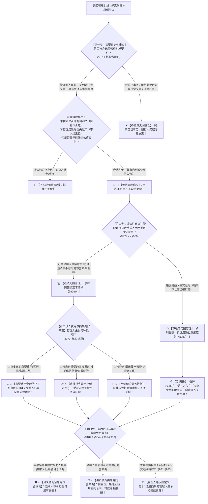

# 📐 无因管理 · 全流程答题模型（三要件定性 · 适法必要费用加利息 · 不适法受益限度 · 紧急救助致害免责 · 事后追认转委托 · §979-§984）

> **教练开场白**
> 同学们好！我是你们的民法法考教练。在准合同分编中，“无因管理”是**民法典单列独立章、客观题年年必出 1 题、主观题中常作为债法四大法定请求权基础之一（合同、侵权、无因管理、不当得利）的四星级重点核心母题**！
> 很多同学做无因管理题目时经常掉进以下几个“命题人最爱挖的易混陷阱”里：以为做好事救火兼顾保护自家财产就不算无因管理；以为房子加固失败最终还是倒塌了就不能要加固费；以为做完好事可以理直气壮要求对方支付“劳务报酬”；以为紧急见义勇为救人导致受助人骨折要承担侵权赔偿；把不符合意愿的不适法管理当成全额不赔。
> 《民法典》无因管理章（§979–§984）与总则编《民法典》§184（见义勇为紧急救助免责），构建了**以“三要件定性、自利不否定、不以结果论、适法要本息损失补偿但绝无报酬、不适法仅在得利范围内给钱、紧急救助致害全免责、事后追认转委托”为核心的裁判闭环**。
> 今天我们用**“四步连贯流水线”**，把无因管理的全部定性要件、适法性审查、费用损失算账与善后免责规则一次性彻底锁死：**第一步查三要件定性关（管理他人事务 ＋ 无义务 ＋ 为他人意思，自利不否定、不以结果论 §979Ⅰ） → 第二步查适法性审查关（符合本人真实意思为适法 §979Ⅰ vs 违背真实意思为不适法 §980） → 第三步查费用损失算账关（适法：必要费用加利息 ＋ 直接损失适当补偿，严禁索要劳务报酬 §979Ⅰ；不适法：仅限受益限度内偿还 §980） → 第四步查善后与免责关（紧急救助致害免责 §184 ＋ 事后追认溯及转委托 §984 ＋ 报告转交财产 §983）**！

---

## 适用场景与解决问题

本模型专门解决无因管理法律关系成立认定、初衷兼有自利的定性、适法与不适法无因管理界定、管理人必要费用及利息求偿权计算、直接损失适当补偿与劳务报酬排除、紧急见义勇为救助致害免责、无因管理事后追认转为委托的全部主客观题考点（对应 [[准合同考点-深度报告]] 二·无因管理 Row 1/2/3/4/5/6/7/8 · ★★★★ 重点高频）：重点破解：

1. **第一步 · 三要件定性与排除关（《民法典》§979Ⅰ）**：
   - ⭐ **三要件齐备才成立（§979Ⅰ）**：
     - ① **管理他人事务**（标的必须属于他人的事务；误将自己事务当他人事务管理的误信管理不构成）；
     - ② **没有法定义务或者约定义务**（监护人、保管人、受托人依约履职属于有义务，不构成无因管理）；
     - ③ **具有为他人谋利益的管理意思**（主观上具有利他意思）；
   - 🛡️ **两大反陷阱铁律（单选-02 / 单选-03 做题眼）**：
     - **自利不否定**：管理人初衷兼有自利动机（如扑灭邻居大火以防波及自家、抢修邻家漏水以防泡坏自家地板），**只要同时具有为他人利益的意思，依然构成无因管理**！法律不苛求纯洁利他；
     - **不以结果论**：无因管理属于行为性质，**只要着手实施了有利于他人的管理行为，即使最终结果失败（如加固房屋后房屋仍被台风吹塌、抢救落水者但落水者最终溺亡），依然构成无因管理**！
   - 🚫 **四类法定排除**：
     - 违法违公德行为（如替他人垫付赌债、代为销赃）不成立无因管理；
     - 纯为自己利益 / 误信管理不成立；
     - 履行法定义务（父母照顾子女）不成立；
     - 道德施惠行为（如替朋友去寺庙还愿）不成立。
2. **第二步 · 适法性审查关（《民法典》§979 vs §980）**：
   - ⭐ **适法无因管理（§979Ⅰ）**：管理事务符合受益人明示或者可推知的真实意思（或客观上有利于受益人）；
   - ⭐ **不适法无因管理（§980）**：管理事务**违反受益人明示或者可推知的真实意思**（如邻居已声明旧危房要爆破拆除，管理人强行雇人维修加固）；
   - 🚨 **公益公序除外**：受益人的真实意思若**违反法律或者违背公序良俗**（如本人意图自杀、吸毒），管理人逆其意思强行施救，**依然属于适法无因管理（§979Ⅱ但书）**！
3. **第三步 · 算账：两条独立求偿权与报酬排除关（《民法典》§979Ⅰ vs §980）**：
   - ⭐ **适法管理算账（§979Ⅰ）**：
     - 💰 **必要费用偿还请求权 ＋ 利息**：管理人在管理过程中实际支出的合理必要费用（如喂猫买猫粮、叫救护车车费、雇工费），受益人**应当全额偿还并加算利息**！
     - 🩹 **直接损失适当补偿请求权**：管理人自身因管理事务遭受的直接损失（如救火被烧伤衣服、被猫抓伤医药费），受益人**应当给予适当补偿（衡平补偿，非全额兜底）**；
     - 🚫 **严禁请求劳务报酬**：无因管理系无偿利他行为，**管理人绝对无权请求支付劳务报酬**！
   - ⭐ **不适法管理算账（§980）**：违反意愿的不适法管理，受益人在**“享有管理利益的限度内（受益限度内）”**向管理人承担偿还责任；未得利的无需偿还。
4. **第四步 · 善后义务、紧急救助免责与追认转委托关（《民法典》§184/§981-§984）**：
   - 🛡️ **见义勇为紧急救助致害免责（《民法典》§184 核心王牌条文）**：因自愿实施紧急救助行为造成受助人损害的，**救助人不承担民事责任**（如心肺复苏压断受助人肋骨，救助人全额免责，一般过失亦不担责）；
   - ⭐ **事后追认转委托（§984）**：管理人管理事务经受益人事后追认的，**从管理事务开始时起，溯及适用委托合同的规定**（可依约定请求报酬）；
   - **管理人的后合同注意义务（§981-§983）**：应当采取有利于受益人的方法，无正当理由不得中断；及时通知并等待指示；管理结束后及时报告情况并转交取得的财产。

> **核心一句**：**无因管理三要件：无义务、为他人、管他事；自利不否定，失败照样成；适法要本息与损失补偿，绝对无报酬；不适法仅在得利范围内给钱；见义勇为紧急救助致害全免责，事后追认溯及转委托！**
>
> 🔎 **核心法源（2026最新）**：《民法典》§118、§184、§979、§980、§981、§982、§983、§984。

---

## 💡 【前置认知】无因管理核心权利义务与免责极速对照表

| 场景分类 | 核心法律条文 | 法定规则与标准 | 考场一秒判定秘诀 |
| :--- | :--- | :--- | :--- |
| **① 三要件定性** | 《民法典》**§979Ⅰ** | 他人事务 ＋ 无义务 ＋ 为他人利益管理 | 初衷顺带保护自家（**自利不否定**）照样成立！ |
| **② 适法管理算账** | 《民法典》**§979Ⅰ** | • **必要费用 ＋ 利息**（全额必赔）；<br>• **直接损失适当补偿**；<br>• ❌ **无权要劳务报酬**。 | 能要**本息**，能要**医药费补偿**，**绝对不能要劳务费**！ |
| **③ 不适法管理算账** | 《民法典》**§980** | 违反本人真实意愿，**仅在受益限度内偿还**。 | 强行修违章危房，**本人实际占了多少便宜就赔多少**！ |
| **④ 见义勇为紧急免责** | 《民法典》**§184** | 因自愿实施紧急救助行为致受助人损害，**救助人不担责**。 | 紧急心肺复苏压断肋骨，**救助人一分钱都不用赔**！ |
| **⑤ 事后追认效力** | 《民法典》**§984** | 经受益人事后追认，**自始溯及适用委托合同**。 | 本人事后点赞认可，**立即升级为委托合同**！ |

---

## 一、 考点核心骨架与法理（四步连贯决策树）



```
【无因管理全景】一句话开场：无因管理三要件：无义务、为他人、管他事；自利不否定，失败照样成；适法要本息与损失补偿，绝对无报酬；不适法仅在得利范围内给钱；见义勇为紧急救助致害全免责，事后追认转委托！
│
▼ 第一步 · 查三要件定性 ── 他人事务与利他意思（§979Ⅰ）
├─ 三大要件：①他人事务 ＋ ②无约定法定义务 ＋ ③为他人利益管理
└─ 两大反陷阱：
     ├─ 兼有自利动机（防殃及自家帮灭火/防渗水修隔壁）：─────────→ 🛡️【自利不否定，依然成立】
     └─ 管理结果失败（房子修了仍塌、落水者送医仍亡）：─────────→ 🛡️【不以结果论，依然成立】
          │
          ▼ 第二步 · 查适法性 ── 符合意愿与否（§979 vs §980）
          ├─ 符合本人真实意愿 / 阻却违法自杀（§979）：────────────────→ 🏆【适法无因管理】（享全权）
          └─ 违背本人真实意愿（§980）：───────────────────────────────→ ⚖️【不适法无因管理】（仅限受益限度内给钱）
               │
               ▼ 第三步 · 查算账 ── 费用、损失与报酬排除（§979Ⅰ）
               ├─ 实际支出必要费用：───────────────────────────────────→ 💵【应当全额偿还 ＋ 加算利息】
               ├─ 管理人自身受损：─────────────────────────────────────→ 🩹【应当给予适当补偿】（衡平补偿）
               └─ 索要辛苦劳务报酬：───────────────────────────────────→ 🚫【绝对无权请求支付报酬】
                    │
                    ▼ 第四步 · 查善后与免责 ── 见义勇为与追认（§184/§984）
                    ├─ 紧急救助致受助人损害（§184）：────────────────────────→ 🛡️【见义勇为全额免责】（一般过失不担责）
                    └─ 受益人事后追认（§984）：──────────────────────────────→ 📜【自始溯及适用委托合同】（可依约收报酬）

  ━━━ 四步全通 ━━━
```

---

## 二、 核心考情与 2026 民法典精要

- **频次研判**：无因管理是民法典准合同分编**★★★★ 重点高频考点**；客观题单选题必考 1 题，主观题常作为债法四大独立请求权基础（合同、侵权、无因管理、不当得利）的必答分析入口。
- **命题核心**：
  1. **三要件定性与自利不否定（§979Ⅰ）**：初衷兼有自利动机的，不否定无因管理成立（单选-02 / 单选-03）。
  2. **不以结果论（§979Ⅰ）**：只要着手实施善意管理行为，不以管理最终成败作为成立要件。
  3. **必要费用加利息 vs 劳务报酬排除（§979Ⅰ）**：有权要必要费用本金与利息，有权要直接损失补偿，**绝无权索要劳务报酬**。
  4. **适法 vs 不适法（§979 vs §980）**：不适法管理仅在受益限度内偿还。
  5. **见义勇为紧急救助致害免责（§184）**：自愿紧急救助致害救助人全额免责。
  6. **事后追认转委托（§984）**：事后追认溯及适用委托合同。

---

## 三、 三大核心法理与命题陷阱拆解

### 1. 无因管理四大命题暗坑与裁判标准表

| 案件事实设定 | 争议焦点 | 裁判结论 | 命题陷阱与法理深剖 |
|---|---|---|---|
| 邻居乙家突发大火，甲为了防止大火蔓延烧毁自家房屋，奋力使用灭火器帮乙扑灭大火，消耗灭火器药剂 500 元。 | 甲救火初衷兼有保护自家财产的自利动机，是否构成无因管理？ | ✅ **成立无因管理！乙应支付 500 元本息！** | 《民法典》§979Ⅰ：**自利不否定无因管理成立**；法律不要求纯粹利他，只要客观利他且兼有为他人管理意思，无因管理合法成立（单选-02）。 |
| 邻居乙出差，暴雨将至，甲发现乙家危房有倒塌危险，自费雇工 1000 元加固。暴雨中房屋仍被冲垮。 | 管理行为最终未能保住房屋（结果失败），甲能否要回 1000 元雇工费？ | ✅ **成立无因管理！乙必须偿还 1000 元及利息！** | 《民法典》§979Ⅰ：无因管理**不以结果论成败**；只要甲实施了必要管理行为，即便房屋最终倒塌，乙依然必须偿还必要费用及利息（单选-03）。 |
| 甲帮出差的邻居乙照看宠物狗一周，购买狗粮支出 300 元，甲被狗轻微抓伤产生医疗费 200 元。甲要求乙支付 500 元并额外支付 300 元“照看辛苦费”。 | 甲是否有权索要 300 元劳务报酬（辛苦费）？ | 🚫 **无权索要劳务费！仅支持 300 元狗粮及 200 元损失补偿！** | 《民法典》§979Ⅰ：无因管理管理人享有必要费用偿还权（300元+利息）及损失适当补偿权（200元），但**法律未设报酬请求权，严禁索要劳务费**。 |
| 甲在路上见乙突发心脏骤停倒地，甲立即对乙实施心肺复苏紧急按压，成功救活乙，但按压导致乙两根肋骨骨折。 | 乙能否起诉甲要求赔偿肋骨骨折医药费 5000 元？ | 🛡️ **甲不承担任何赔偿责任！** | 《民法典》§184（见义勇为紧急救助免责）：因自愿实施紧急救助行为造成受助人损害的，**救助人不承担民事责任（一般过失免责）**。 |

---

## 四、 万能解题四步

---

### 第一步：查三要件定性关 —— 他人事务吗？有义务吗？为他人吗？（《民法典》§979Ⅰ）

> **教练提示**：
> 1. 三要件：**他人事务 ＋ 无约定法定义务 ＋ 为他人利益意思**；
> 2. 牢记两大反陷阱：**初衷顺便自利不影响成立**，**结果没救成不影响成立**！

---

### 第二步：查适法性审查关 —— 符合意愿吗？还是救自杀？（《民法典》§979/§980）

> **教练提示**：
> 1. 符合本人真实意愿（适法） $\rightarrow$ 享有**完整请求权（§979Ⅰ）**；
> 2. 违背本人意愿（不适法） $\rightarrow$ 仅在**“受益限度内”**给钱（§980）；
> 3. 救阻自杀、救阻违法 $\rightarrow$ 属于**适法无因管理（§979Ⅱ但书）**！

---

### 第三步：查费用损失算账关 —— 要的是本息、损失还是劳务费？（《民法典》§979Ⅰ）

> **教练提示**：
> 1. 实际垫付的必要费用 $\rightarrow$ **全额必还 ＋ 加算利息**；
> 2. 管理人自己受伤受损 $\rightarrow$ **给予适当补偿（直接损失）**；
> 3. 索要辛苦费劳务费 $\rightarrow$ **一秒排除，绝对不给（无报酬）**！

---

### 第四步：查善后与免责关 —— 救人致伤了吗？事后追认了吗？（《民法典》§184/§984）

> **教练提示**：
> 1. **见义勇为紧急救助致受助人骨折等损害** $\rightarrow$ **救助人全额免责（§184）**；
> 2. **受益人事后追认点赞** $\rightarrow$ **自始溯及适用委托合同，可依约索要报酬（§984）**！

#### 💰 完整数字案例：无因管理全景攻防实战

> **【案情（[[准合同-单选-02]] 与 [[准合同-单选-03]] 综合演练）】**
> 邻居乙出国度假期间，乙家自来水管老化爆裂发生严重漏水，积水已经漫至楼道并开始渗入对门甲家地板。
> 甲见状，为防止自家地板泡烂，同时为防止乙家贵重家具泡毁，甲立即采取以下行动：
> 1. 甲雇请专业水暖工紧急关闭阀门并抢修水管，垫付维修工人工资及材料费 **600 元**；
> 2. 抢修过程中，甲在搬运乙家积水浸泡的实木衣柜时，不慎被柜角砸伤脚趾，产生医疗医药费 **300 元**；
> 3. 甲在乙家连续清理积水排涝 **2 天**。
> 乙回国后，甲要求乙支付：① 垫付的维修费 600 元及银行同期利息；② 脚趾砸伤医疗费 300 元；③ 连续 2 天清理积水的辛苦劳务费 **400 元**。乙以“甲主要是为了保护甲自家的地板，且未征得乙同意”为由拒绝支付全部款项。
>
> - **裁判涵摄**：
>   1. **定性判断**：依据《民法典》§979Ⅰ，甲管理的是乙家的漏水水管及家具（他人事务），甲对乙无约定义务或法定义务；甲初衷虽然兼有防止自家地板被泡的自利动机，但**自利不否定无因管理成立**，甲为乙排涝抢险成立**适法无因管理**！
>   2. **算账裁判**：
>      - 垫付的维修费 600 元属于**必要管理费用**，依据《民法典》§979Ⅰ，乙**应当全额偿还 600 元并支付利息**；
>      - 脚趾砸伤医药费 300 元属于管理人因管理遭受的**直接损失**，依据《民法典》§979Ⅰ，乙**应当给予适当补偿（全额或合理分担补偿）**；
>      - 辛苦劳务费 400 元：无因管理属于无偿利他制度，**法律未设定报酬请求权，甲无权向乙索要 400 元劳务费**（除非乙事后追认转为有偿委托 §984）！

#### 一句话闭环记忆
> 🎯 **一眼判**：**无因管理三要件：无义务、为他人、管他事；自利不否定，失败照样成；适法要本息与损失补偿，绝对无报酬；不适法仅在得利范围内给钱；见义勇为紧急救助致害全免责，事后追认溯及转委托！**

---

## 五、 案例演练

### 1. 无因管理三要件与自利不否定（[[准合同-单选-02]] 经典真题）
- **案情**：邻居家失火，当事人为了防止大火蔓延至自家而奋力灭火并垫付灭火费用。
- **模型分析**：第一步——依据《民法典》§979Ⅰ，自利动机不否定无因管理的成立，成立适法无因管理（选 D）。

### 2. 必要费用利息偿还与不以结果论（[[准合同-单选-03]] 经典真题）
- **案情**：当事人自费加固邻居危房，暴风雨后危房最终仍倒塌。当事人向邻居主张加固费及利息。
- **模型分析**：第一步至第三步——无因管理不以结果论成败，房屋倒塌不影响无因管理成立，受益人必须偿还必要费用及利息（选 C）。

---

## 关联真题

- [[准合同-单选-02]] · 无因管理三要件定性与自利不否定
- [[准合同-单选-03]] · 必要费用利息偿还请求权与不以结果论
- [[合同通则-多选-25]] · 母公司代偿子公司债务定性无因管理
- [[合同通则-单选-57]] · 利益关联人履职非无因管理反面辨析

## 相关页面

- 概念实体页：[[无因管理]] · [[不当得利]] · [[委托合同]]
- 姊妹模型：[[民法-合同-不当得利模型]] · [[民法-合同-委托合同模型]]
- 综合报告：[[准合同考点-深度报告]]（二、无因管理 · Row 1/2/3/4/5/6/7/8 · ★★★★ 重点高频）
