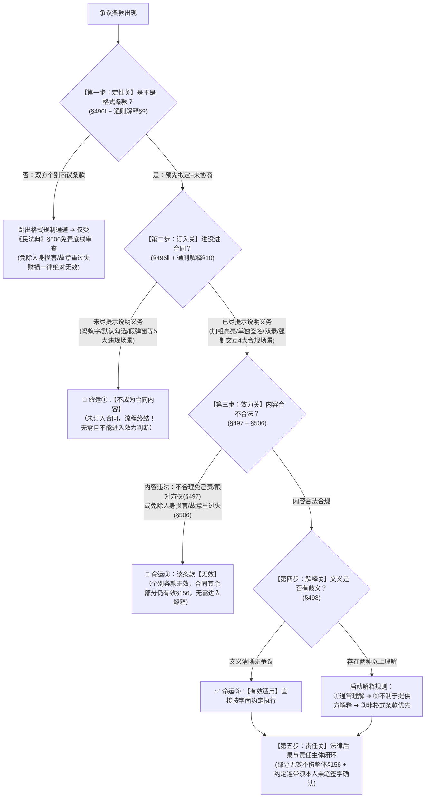

# 📐 格式条款 · 全流程联动答题模型（定性关 → 订入关 → 效力关 → 解释关 → 责任关）

> 🔗 **所属报告**：[[合同总则考点-深度报告]]（二、效力 · 第 9 考点 / 顶级必考第 5 项 · ★★★★★ 顶级必考）  
> 🎯 **适用真金题矩阵**：  
> - [[合同通则-单选-13 · 格式条款未提示说明不成为合同内容案|单选-13 · 未提示重大利害条款不成为合同内容案]]  
> - [[合同通则-单选-28 · 格式条款加粗免除人身损害双重无效案|单选-28 · 加粗提示但免人身损害双重无效案]]  
> - [[合同通则-多选-18 · 格式条款醒目张贴但限制赔偿额无效案|多选-18 · 醒目张贴但限制赔偿额无效案]]  
> - [[合同通则-单选-29 · 非格式条款免除人身损害绝对无效案|单选-29 · 逐条协商但免除人身损害绝对无效案]]  
> - [[合同通则-单选-40 · 格式条款部分无效不影响合同整体案|单选-40 · 格式条款个别无效不影响整体效力案]]  
> - [[合同通则-单选-41 · 格式条款连带责任与签字主体判定案|单选-41 · 格式条款有效但连带责任须本人签字案]]  
> - [[合同通则-单选-63 · 格式条款不利解释规则与法定代表人变更连带责任案|单选-63 · 文义歧义时的不利解释规则案]]  
> ⚖️ **核心法源（2026最新）**：《中华人民共和国民法典》第496条、第497条、第498条、第506条、第156条；**《最高人民法院关于适用〈中华人民共和国民法典〉合同编通则若干问题的解释》（法释〔2023〕13号）第9条（格式条款认定与反向排除）、第10条（提示说明义务全景标准）**。

---

## 一、 【核心认知】格式条款“五步动态联动流水线”（全景决策树）

格式条款的法律审查是一套**环环相扣、层层分流的动态判断链**，绝非孤立的单点判断：



---

## 二、 【全景五步联动实战详解】（逻辑链路 + 场景贯通）

---

### 第一步：定性关（范围与排除）—— 是不是格式条款？（§496Ⅰ + 通则解释§9）

#### 1. 核心判断标准（双必备要件）
- **客观要件**：为了**重复使用**而**预先拟定**；
- **主观要件**：在订立合同时**未与对方协商**（对方只能选择“接受”或“离开”，即“Take it or leave it”）。

#### 2. ⭐ 司法解释两大反向排除铁则（《通则解释》§9 · 堵死提供方的抵赖借口）
- ❌ **借口 1（“我这是照抄官方示范文本制作的”）** $\rightarrow$ **不得以此否认格式条款属性**！
- ❌ **借口 2（“我店刚开张，这份合同才用过一次，没重复使用”）** $\rightarrow$ 从事经营活动的一方**不得以未实际重复使用为由否认其格式条款属性**（除非提供方有确凿证据证明该合同系专门为特定人个别定制）。

#### 3. 联动分支与流向
- **若判定为“非格式条款”（双方个别协商逐条谈定）**： 
  - 👉 **直接跳出格式条款审查通道**，不适用§496（订入控制）、§497（格式无效）、§498（不利解释）；
  - ⚠️ **但绝非不受法律管辖**：仍须接受《民法典》§506的**底线审查**（免除人身损害责任、因故意/重大过失致财产损失免责条款，**不论是否格式条款一律绝对无效！** 见单选-29）。
- **若判定为“格式条款”** $\rightarrow$ 进入**第二步：订入关**。

---

### 第二步：订入关（形式与提示）—— 进没进合同？（§496Ⅱ + 通则解释§10）

#### 1. 前置范围：哪些条款必须提示说明？（重大利害关系条款）
- **免除/减轻提供方责任条款**（如免除瑕疵担保、免除违约金、极低赔偿上限）；
- **排除/限制相对人主要权利条款**（如禁退费、缩短质保异议期、限制解除权、约定管辖）；
- **加重相对人责任条款**（如畸高逾期违约金、加速到期、法定代表人个人连带）；
- *反向对比*：常规的付款方式、正常发货周期等普通交易条款无需特别高亮。

#### 2. 【合规场景】“已尽提示说明义务”的 4 大实战形态（订入成功 $\rightarrow$ 拿到通往第三步的入场券）
1. **场景 ①（物理介质明显标识）**：采用**加粗、加大字号、红字高亮、黑框圈出、下划线**等足以引起普通人注意的明显标识（《通则解释》§10Ⅰ）；
2. **场景 ②（单独签名/逐项确认）**：在免责条款旁**单独设置签字确认栏**，由相对人亲笔签名（如“本人已阅读并同意免责条款”）；
3. **场景 ③（实质口头说明与双录存证）**：相对人询问时以通俗语言解释，或在大额金融、保险交易中**音视频双录**记录宣读与解释过程（《通则解释》§10Ⅱ）；
4. **场景 ④（电子网络端实质交互）**：APP强制**倒计时阅读（如10秒后方可点击）**、核心异常条款**全屏独立弹窗展示并要求手动输入验证码或逐项滑动确认**。

#### 3. 【违规场景】“未尽提示说明义务”的 5 大典型违规陷阱（订入失败 $\rightarrow$ 触发命运①）
1. **场景 1（蚂蚁字与隐蔽角落）**：6号微小字体、浅灰色字体，或藏在纸张背面、折叠缝隙处无任何标记；
2. **场景 2（默认勾选与一键同意大礼包）**：电子端**系统预先默认打勾**，或一个弹窗包含几十份协议一键全选（《通则解释》§10Ⅲ明确规定：**不足以证明已尽提示说明义务！**）；
3. **场景 3（借口示范文本/行业惯例不提示）**：借口“同行都这么写”不予提示（《通则解释》§9明确否定）；
4. **场景 4（有提示拒不说明）**：字号加粗了，但相对人询问专业术语时以“系统自动算/我也搞不懂”敷衍推脱；
5. **场景 5（事后偷梁换柱）**：订约时未出示，付款后在发票背面、提货单、提货短信中单方擅自附加免责声明。

#### 4. 联动分支与流向
- **🚨 订入失败（未尽提示说明） $\rightarrow$ 触发【命运①：不成为合同内容】**：
  - **法律效果**：相对人主张该条款不成为合同内容，法院应予支持（视为合同中从来没有这句话！）；
  - **流程终结**：**直接出局！不需要、也不应该再进入第三步审查其内容是否有效，更不需要进入第四步解释！**
  - **举证责任**：举证责任**完全由提供方承担**（提供方举证不能即认定未订入）。
- **✅ 订入成功（已尽提示说明）** $\rightarrow$ 进入**第三步：效力关**（⚠️ 提示到位仅等于“拿到了入场券”，绝不等于“内容合法有效”！）。

---

### 第三步：效力关（实质与底线）—— 进了合同，合不合法？（§497 + §506）

条款虽然成功订入了合同，但必须接受实质法律效力的双重严苛审查：

#### 1. 第一把刀：§497 格式条款相对无效审查（专砍格式霸王条款）
满足下列情形之一，**该格式条款无效**：
1. 具有《民法典》一般民事法律行为无效情形（§144无行为能力、§146虚假表示、§153违法违俗、§154恶意串通）；
2. 提供方**不合理地免除或者减轻其责任**；
3. 提供方**加重对方责任、限制或者排除对方主要权利**（如“单方放弃服务，余额一律不退”）。

#### 2. 第二把刀：§506 免责条款绝对无效审查（更硬的底线 · 不论格式与否）
下列两类免责条款，**一律绝对无效**（不论是否格式条款、不论提示多醒目、不论对方是否签字同意）：
1. 免除造成对方**人身损害**的责任；
2. 因**故意或者重大过失**造成对方**财产损失**的免责条款。

#### 3. 联动分支与流向
- **🚨 内容违法（落入§497或§506） $\rightarrow$ 触发【命运②：该条款无效】**：
  - **法律效果**：该格式条款自始无效；但依据《民法典》§156，**仅该条款无效，合同其余部分照常有效**！
  - **流程终结**：条款既已宣告无效，**无须进入第四步解释规则**，直接转入第五步清算与违约赔偿。
- **✅ 内容合法合规** $\rightarrow$ 进入**第四步：解释关**。

---

### 第四步：解释关（歧义与商议）—— 文义存在歧义时怎么解？（§498）

#### 1. 适用前提
条款已经过前三步检验（是格式条款 + 订入成功 + 内容合法有效），仅在**条款文义本身可以作出两种以上合理理解**时，才启动本步解释规则。

#### 2. 解释规则的三层递进法则
1. **第一顺位：通常理解解释** $\rightarrow$ 按照普通正常人的理性认知予以解释；
2. **第二顺位：不利于提供方解释** $\rightarrow$ 仍有两种以上解释的，作出**不利于提供格式条款一方的解释**（提供方自担语意模糊的风险）；
3. **第三顺位：非格式条款优先** $\rightarrow$ 格式条款与非格式条款（手写补充、微信个别确认）冲突的，**采用非格式条款**（个别商议优先于预拟条款）。

#### 3. 联动分支与流向
- 经解释确定条款含义后 $\rightarrow$ 触发**【命运③：有效适用】**，进入**第五步：责任关**。

---

### 第五步：责任关（后果与主体）—— 最终法律责任与主体范围如何闭环？

#### 1. 整体合同效力（《民法典》§156 部分无效规则）
- 某一格式条款被认定为“未订入”（命运①）或“无效”（命运②）的，**绝不导致整份合同无效**；
- 合同其余部分继续有效，守约方有权要求违约方依合同其余条款及法律规定承担违约赔偿或法定责任。

#### 2. 责任承受主体的精准判定（意思表示独立要件）
- **商事格式条款中的连带责任（如“法定代表人承担连带保证”）**：
  - 该条款内容本身并不属于§497无效情形（加重的是签字人自身责任）；
  - 但该连带责任要约束具体自然人，**必须以该自然人本人的签字为要件**；
  - **前任已签字** $\rightarrow$ 前任承担连带责任；
  - **继任后任从未签字** $\rightarrow$ 依§498不利解释规则，该条款仅约束签字人，未签字的继任者**不受约束、不承担连带责任**（见单选-41、单选-63）。

---

## 三、 【三大全景贯穿场景演练】（实战推演流水线）

---

### 场景 A：网络电商平台（APP注册与下单）

> **【案情】**：张某在某电商平台APP购买生鲜食品，注册时系统**默认打勾**《用户注册协议》，协议第88条用浅灰小字记载：“生鲜食品运输途中腐烂变质致人食物中毒的，平台与商家概不负责。”张某食用后严重中毒就医，起诉索赔。平台辩称张某已勾选同意协议。

```
【流水线推演】：
▼ 第一步定性：平台预先拟定且未与张某协商 ──→ 属于格式条款。
▼ 第二步订入：APP系统预先默认打勾 + 浅灰小字（违规场景1+2） ──→ 未尽提示说明义务（通则解释§10Ⅲ）
              ──→ 触发命运①：第88条【不成为合同内容】！
▼ 深度复核（即使假定平台加粗提示了）：
  第三步效力：该条款免除产品缺陷造成消费者人身伤害责任 ──→ 依§506第(一)项铁定【绝对无效】（命运②）！
▼ 第五步责任：该免责声明不成立且无效，平台与商家必须依法赔偿张某人身伤害全部损失。
```

---

### 场景 B：线下商超消费（存包与美容服务）

> **【案情】**：李某在商场存包，存包处窗口醒目张贴并加粗提示《存包须知》：“贵重物品请随身携带，箱内物品丢失每件最高酌情补偿10元。”李某价值5000元的手提包被盗，商场主张按告示只赔10元。

```
【流水线推演】：
▼ 第一步定性：商场预先拟定重复张贴 ──→ 属于格式条款。
▼ 第二步订入：窗口醒目张贴 + 加粗提示（合规场景①） ──→ 已尽提示义务，成功订入合同！
▼ 第三步效力：审查内容 ──→ 保管人商场将赔偿限额封顶在10元，属于“不合理减轻自身责任、排除对方主要权利”
              ──→ 触犯§497第二项，该条款【无效】（命运②）！
▼ 第五步责任：依据§156，仅10元限赔条款无效，其余保管合同关系有效；商场依普通保管合同承担全额损害赔偿责任。
```

---

### 场景 C：商事货代借款（法定代表人连带责任）

> **【案情】**：甲货代公司与乙公司签订格式《货代合同》，第10条约定：“乙公司法定代表人对货代费承担连带清偿责任。”订约时乙公司法代为赵某并在合同尾部签字。后乙公司更换法代为钱某，钱某从未在合同上签字。甲公司起诉要求钱某承担连带责任。

```
【流水线推演】：
▼ 第一步定性：甲公司预先印制 ──→ 属于格式条款。
▼ 第二步订入：双方签约明示 ──→ 已订入合同。
▼ 第三步效力：该条款加重的是签字人自身责任，内容合法，不属于§497无效情形 ──→ 内容有效！
▼ 第四步解释：条款中“法定代表人”指签约时的赵某，还是涵盖后续所有继任者？存在两种理解
              ──→ 依§498启动不利解释规则，作出不利于提供方甲公司的解释，即仅指当时签字的赵某。
▼ 第五步责任：钱某从未签字作出承担连带责任的意思表示，钱某不承担连带责任；赵某承担连带责任。
```

---

## 四、 【终极背诵通杀口诀 / 答题判断链】（考试怎么答题）

> ⭐ **【考场通杀背诵公式】**：
> 
> 🔹 **【五步流水线通杀口诀】**：  
> **“一判格式定性准（预拟未协商，示范文本也算它）；”**  
> **“二判订入看提示（未尽提示『不成为内容』，直接出局莫看效力）；”**  
> **“三判效力定生死（霸道免己责限权无效§497，免除人身伤害『不论格式铁定死』§506）；”**  
> **“四判解释解歧义（字句有两解，『不利于提供方解释』；格式非格式起冲突，『非格式优先』）；”**  
> **“五定责任看闭环（个别条款死不伤整体§156，法代连带须本人亲笔签）！”**

---

## 五、 【命题人最爱挖的 5 大暗坑】（避坑防错补丁）

在法考客观题选项中，出现以下特征表述直接判定为错误：

1. ❌ **暗坑 1（将“未尽提示说明义务”的后果直接判定为“该条款无效”）**：
   - 选项表述为“因提供方未加粗提示免责条款，该免责条款依法无效” $\rightarrow$ **错误！**（法律后果为**该条款不成为合同的内容**，属于订入阻断，非内容无效）。
2. ❌ **暗坑 2（将“已尽提示义务（加粗醒目）”直接等同于“该条款合法有效”）**：
   - 选项表述为“商家已在协议中加粗提示人身损害概不负责，已尽提示义务，该免责条款有效” $\rightarrow$ **错误！**（提示到位只解决订入，内容因触犯 §506 依然绝对无效）。
3. ❌ **暗坑 3（某一格式条款被宣告无效导致整份合同全部无效）**：
   - 选项表述为“《会员协议》中退费免责条款无效，导致整份会员服务合同自始无效” $\rightarrow$ **错误！**（依 §156 部分无效规则，仅该条款无效，合同其余部分继续有效）。
4. ❌ **暗坑 4（认为双方逐条协商谈定的非格式条款可以免除人身伤害责任）**：
   - 选项表述为“劳务招工协议经双方逐条协商订立，工伤概不负责条款属于非格式条款，依法有效” $\rightarrow$ **错误！**（§506 规制所有免责条款，免除人身伤害责任一律绝对无效）。
5. ❌ **暗坑 5（格式条款文义有歧义时直接按字面从严解释）**：
   - 选项表述为“格式条款约定法定代表人承担连带责任，应理解为涵盖离任与现任所有法定代表人” $\rightarrow$ **错误！**（存在两种以上解释的，必须依 §498 作**不利于提供格式条款一方的解释**）。

---

## 六、 【真题矩阵实战演练与 100% 支撑验证】

| 真题卡片 | 核心考向 | 答题模型流水线支撑与秒杀定位 |
|---|---|---|
| **[[合同通则-单选-13 · 格式条款未提示说明不成为合同内容案\|单选-13]]** | 未提示重大利害条款的后果 | **第二步订入关**：未尽提示说明 $\rightarrow$ 触发【命运①：不成为合同内容】（秒杀排除 A无效、C自担后果）。 |
| **[[合同通则-单选-28 · 格式条款加粗免除人身损害双重无效案\|单选-28]]** | 加粗提示但免除人身伤害责任 | **第二步订入 ➔ 第三步效力关**：加粗已订入，但内容触犯 §497 + §506 双重无效（秒杀排除有效选项）。 |
| **[[合同通则-多选-18 · 格式条款醒目张贴但限制赔偿额无效案\|多选-18]]** | 醒目张贴但限制赔偿额 | **第二步订入 ➔ 第三步效力关**：张贴已订入，但内容不合理限制保管人责任触犯 §497 无效（秒杀 AC）。 |
| **[[合同通则-单选-29 · 非格式条款免除人身损害绝对无效案\|单选-29]]** | 逐条协商但免除人身损害 | **第一步定性 ➔ 分支A（§506底线）**：非格式条款免人身损害照样绝对无效（秒杀 D）。 |
| **[[合同通则-单选-40 · 格式条款部分无效不影响合同整体案\|单选-40]]** | 美容协议余款不退条款无效 | **第三步效力 ➔ 第五步责任关**：不合理限权条款无效，但依据 §156 美容合同其余部分仍有效（秒杀 B）。 |
| **[[合同通则-单选-41 · 格式条款连带责任与签字主体判定案\|单选-41]]** | 格式条款有效但连带责任须本人签字 | **第三步有效 ➔ 第五步主体判定**：条款有效，但连带责任须本人签字，后任未签不担责（秒杀 D）。 |
| **[[合同通则-单选-63 · 格式条款不利解释规则与法定代表人变更连带责任案\|单选-63]]** | 格式条款有效 + 文义歧义解释 | **第三步有效 ➔ 第四步解释关**：文义有两种理解，依 §498 作不利于提供方解释，后任不担责（秒杀 D）。 |

---

## 七、 相关页面

- 概念实体页：[[格式条款]] · [[免责条款]] · [[合同效力分级]]
- 关联答题模型：[[民法-合同-合同无效模型]] · [[民法-合同-成立与生效模型]] · [[民法-合同-无效撤销返还模型]]
- 综合报告：[[合同总则考点-深度报告]]（二、效力 · 第 9 考点 / 顶级必考第 5 项）
