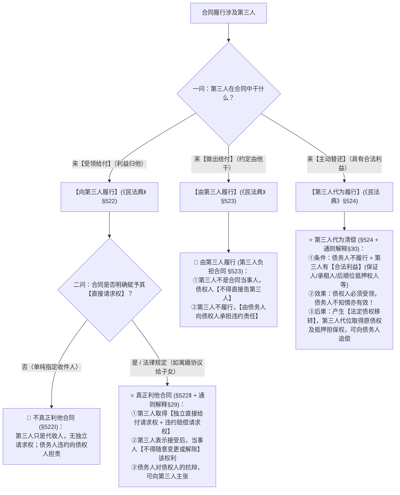

# 📐 涉他合同与第三人履行 · 全流程答题模型（真正利他§522 · 由第三人履行§523 · 第三人代偿§524 · 解释§29/§30）

> 🔗 **所属报告**：[[合同总则考点-深度报告]]（三、履行 · 第 5 考点 / 顶级必考第 7 项 · ★★★★★ 顶级必考）  
> 🎯 **适用真金题矩阵**：  
> - [[合同通则-单选-02 · 由第三人履行之违约责任主体归属案|单选-02 · 由第三人履行违约责任由债务人承担案]]  
> - [[合同通则-单选-45 · 不真正向第三人履行之第三人无独立请求权案|单选-45 · 单纯指定收货人第三人无独立请求权案]]  
> - [[合同通则-单选-46 · 离婚协议赠与子女之真正利他合同直接请求权案|单选-46 · 离婚协议真正利他合同子女直接请求权案]]  
> - [[合同通则-单选-47 · 真正利他合同第三人独立违约请求权案|单选-47 · 真正利他合同第三人直接主张违约责任案]]  
> - [[合同通则-单选-58 · 第三人代为履行债务人不知情清偿有效案|单选-58 · 第三人代为履行清偿有效与追偿权案]]  
> - [[合同通则-多选-23 · 涉他合同四种结构综合辨析案|多选-23 · 涉他合同与债务承担四结构综合辨析案]]  
> ⚖️ **核心法源（2026最新）**：《中华人民共和国民法典》第522条、第523条、第524条、第546条、第547条；**《最高人民法院关于适用〈中华人民共和国民法典〉合同编通则若干问题的解释》（法释〔2023〕13号）第29条（利益第三人合同权利变动限制与抗辩）、第30条（第三人代为履行合法利益认定与法定债权移转）**。

---

## 一、 【核心认知】涉他合同三大结构全景决策树（三问分流）

在合同履行中涉及第三人时，通过“三问”精准定性并锁定权利责任通道：



---

## 二、 【三大涉他结构深度法理与 2026 司法解释精解】

---

### 1. 向第三人履行（《民法典》§522 + 《通则解释》§29 · 双轨界分）

#### A. 不真正向第三人履行（§522Ⅰ · 经由交付）
- **特征**：当事人仅约定债务人向第三人履行债务（如网购送货给朋友、指令将货款汇至某指定账户）；
- **权利主体**：第三人**没有独立的合同给付请求权**，亦**无权提起违约之诉**；
- **违约责任**：债务人未向第三人履行或履行不符合约定的，**债务人应当向债权人承担违约责任**。

#### B. ⭐⭐⭐⭐⭐ 真正利益第三人合同（§522Ⅱ + 《通则解释》§29 · 2026顶级必考）
- **核心要件**：法律规定或者当事人约定第三人**可以直接请求债务人向其履行债务**，第三人未在合理期限内明确拒绝；
- **核心权能（突破合同相对性）**：
  1. **直接履行请求权**：第三人可以直接起诉请求债务人履行债务；
  2. **直接违约救济权**：债务人未向第三人履行债务或者履行债务不符合约定的，**第三人可以直接请求债务人承担违约责任**；
  3. **债权人监督权**：第三人未向债务人请求履行的，债权人也可以请求债务人向第三人履行债务。
- **⭐ 2026 司法解释新规（《通则解释》§29）**：
  1. **当事人变更/解除权的限制**：第三人按照规定**表示接受利益后**，当事人未经第三人同意，**不得随意变更或者解除第三人的权利**；
  2. **抗辩权贯通**：债务人对债权人的抗辩（如合同无效、可撤销、同时履行抗辩权、先履行抗辩权），**可以向第三人主张**。

- 真正利益第三人合同 和 向三人履行的区别
	- 向第三人履行 只约定：债务人向第三人交付东西, 除了交付，而 “真正利益第三人合同” 还约定 / 法律规定：第三人可以直接起诉、请求履行


---

### 2. 由第三人履行 / 第三人负担合同（《民法典》§523） -> 

- **特征**：当事人双方约定由第三人向债权人履行债务（如甲欠乙钱，甲乙约定由丙替甲还款）；
- **主体定性**：第三人**并非合同当事人**，该约定对第三人不产生强制给付约束力；
- **⭐ 核心归责原则（命题第一杀器）**：
  - 第三人不履行债务或者履行债务不符合约定的，**债务人应当向债权人承担违约责任**；
  - **绝不能判定由第三人承担违约责任**！债权人亦无权直接起诉第三人要求承担违约责任。

---

### 3. ⭐⭐⭐⭐⭐ 第三人代为履行 / 第三人清偿（《民法典》§524 + 《通则解释》§30）

#### A. 适用前提与“合法利益”的司法认定（《通则解释》§30）
债务人不履行债务时，第三人对履行该债务**具有合法利益**的，有权向债权人代为履行（债权人不得拒绝受领）。具有合法利益的第三人典型清单：
1. **保证人、提供担保的第三人（物上保证人）**；
2. **担保财产的受让人、后顺位的担保物权人**（为防止前顺位行使担保权受损）；
3. **拍卖财产的承租人、抵押房屋的承租人**（为保住租赁权）；
4. **合伙人、股东（在特定清算/执行保护中）**；
5. *除外情形*：根据债务性质（人身专属性）、当事人约定或者法律规定只能由债务人亲自履行的除外。

#### B. 代为履行的法律效力（法定债权移转与追偿）
- **清偿效力**：债权人受领后，原债权人的债权获得清偿而退出；**即便债务人不知情或反对，代为履行依然完全有效**（见单选-58）；
- **⭐ 法定债权移转（代位追偿权）**：
  - 债权人接受第三人履行后，**原债权人的债权及其从权利（担保物权、利息债权、违约金债权等）法定移转给代偿第三人**（无需另行办理债权转让协议！）；
  - 第三人取得对债务人的全额代位追偿权；
  - 债务人对原债权人的抗辩（如已部分清偿、时效届满等），可以向代偿第三人主张。

---

## 三、 【四大涉他与债务介入结构全景对照表】

| 结构类型          | 核心法条          | 第三人在干嘛     | 债务人是否变更   | 违约 / 责任归属      | 核心法律后果                            |
| ------------- | ------------- | ---------- | --------- | -------------- | --------------------------------- |
| **不真正向第三人履行** | §522Ⅰ         | 仅代收给付      | 债务人不变     | 债务人向债权人违约      | 第三人无诉权，债权人可起诉                     |
| **真正利他合同**    | §522Ⅱ + 解释§29 | 享有直接利益     | 债务人不变     | 债务人向第三人违约      | **第三人享有直接诉权与违约请求权**；接受后当事人不得任意变更  |
| **由第三人履行**    | §523          | 替债务人做/还    | 债务人不变     | **由债务人承担违约责任** | 第三人不担违约责任，债权人不得告第三人               |
| **第三人代为履行**   | §524 + 解释§30  | 有合法利益主动代偿  | 债务人不变     | 债权人必须受领        | **法定债权移转**，第三人代位取得债权及担保物权并追偿      |
| **免责债务承担**    | §551          | **取代**原债务人 | **更换债务人** | 新债务人承担违约责任     | 须**债权人同意**，原债务人彻底脱身               |
| **债务加入（并存）**  | §552 + 解释§51  | **加入**共同担责 | 原债务人+新加入人 | **承担连带责任**     | 仅须**通知**债权人（或共同签字）；加入人清偿后单向追偿原债务人 |

---

## 四、 【三大全景贯穿案例群演练】

---

### 场景 A：离婚协议赠与子女（真正利他合同 §522Ⅱ）

> **【案情】**：甲乙协议离婚，协议约定登记在甲名下的房产过户给20岁的儿子丙，并特别注明“丙有权直接请求甲办理过户登记”。离婚后，甲拒绝配合过户。甲主张房屋未过户前自己享有任意撤销权，且丙不是协议当事人无权起诉。

```
【流水线推演】：
▼ 第一步定性：甲乙协议为第三人丙设立利益，且明确约定“丙有权直接请求” ──→ 属于真正利益第三人合同（§522Ⅱ）。
▼ 第二步权利变动：丙成年且未拒绝，已表示接受利益 ──→ 甲乙未经丙同意不得变更或解除该权利（通则解释§29）。
▼ 第三步救济权：丙取得独立的实体给付请求权与违约救济权 ──→ 丙有权直接起诉甲请求办理过户登记并赔偿损失。
```

---

### 场景 B：指定朋友还款（由第三人履行 §523）

> **【案情】**：张某欠李某10万元借款，张某与李某约定：“由张某的朋友王某于10月1日向李某清偿该10万元。”到了10月1日，王某拒绝向李某付款。李某遂起诉王某要求其承担违约责任。

```
【流水线推演】：
▼ 第一步定性：张某与李某约定由王某还款 ──→ 属于由第三人履行（第三人负担合同，§523）。
▼ 第二步主体审查：王某并非合同当事人，未作出自愿承担债务的意思表示 ──→ 王某对李某不负合同义务。
▼ 第三步归责：王某不履行，由原债务人张某向债权人李某承担违约责任 ──→ 李某起诉王某错误，应起诉张某。
```

---

### 场景 C：房屋承租人代偿抵押贷款（第三人代为履行 §524）

> **【案情】**：房东赵某将房屋抵押给银行借款100万元，后赵某将该房出租给钱某开餐厅，租期5年并投入大额装修。赵某逾期未还贷款，银行拟申请法院查封拍卖该房屋。钱某为保住租赁经营，主动向银行全额代偿100万元本息。赵某主张自己从未同意钱某代还，钱某无权找自己要钱。

```
【流水线推演】：
▼ 第一步定性：钱某为承租人，抵押拍卖将导致其租赁权受损 ──→ 钱某对债务清偿具有【合法利益】（通则解释§30）。
▼ 第二步清偿效力：钱某代为清偿，银行受领 ──→ 产生合法清偿效力，不以债务人赵某知情或同意为要件（§524）。
▼ 第三步法定移转：银行对赵某的100万元债权及房屋抵押权法定移转给钱某 ──→ 钱某取得对赵某的代位追偿权及优先受偿权！
```

---

## 五、 【终极背诵通杀口诀 / 答题判断链】（考试怎么答题）

> ⭐ **【考场通杀背诵公式】**：
> 
> 🔹 **【涉他合同判定通杀口诀】**：  
> **“真正利他有两权（直接请求+违约），一旦接受不可撤(解释§29)；”**  
> **“不真正利他空欢喜，只是收货没诉权；”**  
> **“由他履行他撂挑，『债务人自己顶违约』(§523)；”**  
> **“合法利益第三人，主动代偿债权移(§524+解释§30)，回头追偿带担保！”**

---

## 六、 【命题人最爱挖的 5 大暗坑】（避坑防错补丁）

在法考客观题选项中，出现以下特征表述直接判定为错误：

1. ❌ **暗坑 1（由第三人履行中，第三人不履行，债权人可起诉第三人承担违约责任）**：
   - 选项表述为“因第三人拒绝履行，债权人有权要求该第三人支付违约金” $\rightarrow$ **错误！**（第三人非当事人，依 §523 只能由**债务人承担违约责任**）。
2. ❌ **暗坑 2（单纯指定收货人的不真正向第三人履行，第三人享有违约起诉权）**：
   - 选项表述为“买方指令卖方将货物送交丙，卖方迟延交货，丙有权起诉卖方要求其支付违约金” $\rightarrow$ **错误！**（单纯收货人无独立请求权，只能由买方债权人起诉）。
3. ❌ **暗坑 3（真正利他合同确立后，当事人可以随时协商撤销对第三人的利益赋予）**：
   - 选项表述为“离婚协议约定房产归儿子后，夫妻双方又达成补充协议取消该条款，该变更合法有效” $\rightarrow$ **错误！**（依《通则解释》§29，第三人表示接受利益后，当事人未经第三人同意不得随意变更或撤销）。
4. ❌ **暗坑 4（第三人代为履行必须以债务人知情且同意为生效要件）**：
   - 选项表述为“因债务人对此代还不知情，第三人代为履行的行为不产生清偿效力，第三人亦无权追偿” $\rightarrow$ **错误！**（只要具备合法利益且债权人受领，债务人知情与否不影响代偿效力与法定债权移转）。
5. ❌ **暗坑 5（第三人代偿后仅享有普通的无因管理或不当得利返还请求权，丧失原抵押担保）**：
   - 选项表述为“保证人或承租人代为清偿后，原债权设立的抵押权归于消灭，代偿人只能主张普通借款返还” $\rightarrow$ **错误！**（依 §524 与《通则解释》§30，原债权及其**担保物权等从权利一并法定移转给代偿第三人**）。

---

## 七、 【真题矩阵实战演练与 100% 支撑验证】

| 真题卡片 | 核心考向 | 答题模型流水线支撑与秒杀定位 |
|---|---|---|
| **[[合同通则-单选-02 · 由第三人履行之违约责任主体归属案\|单选-02]]** | 由第三人履行之违约责任归属 | **§523 铁则**：第三人不履行，由债务人承担违约责任，排除第三人担责（秒杀 A）。 |
| **[[合同通则-单选-45 · 不真正向第三人履行之第三人无独立请求权案\|单选-45]]** | 不真正利他合同诉权限制 | **§522Ⅰ 铁则**：单纯指定收货人无独立诉权与违约请求权（秒杀 A）。 |
| **[[合同通则-单选-46 · 离婚协议赠与子女之真正利他合同直接请求权案\|单选-46]]** | 真正利他合同直接请求权 | **§522Ⅱ 铁则**：明确赋予直接请求权，子女有权直接请求过户且单方不得撤销（秒杀 C）。 |
| **[[合同通则-单选-47 · 真正利他合同第三人独立违约请求权案\|单选-47]]** | 真正利他合同违约请求权 | **§522Ⅱ + 解释§29**：第三人享有独立给付请求权及违约赔偿请求权（秒杀 C）。 |
| **[[合同通则-单选-58 · 第三人代为履行债务人不知情清偿有效案\|单选-58]]** | 第三人代为履行效力与追偿 | **§524 铁则**：代为履行受领即有效，不以债务人知情为要件，清偿后享有追偿权（秒杀 A）。 |
| **[[合同通则-多选-23 · 涉他合同四种结构综合辨析案\|多选-23]]** | 涉他合同四结构综合辨析 | **全景对比矩阵**：秒杀区分向第三人(§522)、由第三人(§523)、代为清偿(§524)与债务承担(§551)。 |

---

## 八、 相关页面

- 概念实体页：[[向第三人履行]] · [[第三人代为履行]] · [[合同相对性]] · [[债务承担]]
- 关联对比页：[[第三人介入债务的四种结构-对比]]
- 综合报告：[[合同总则考点-深度报告]]（三、履行 · 第 5 考点 / 顶级必考第 7 项）
