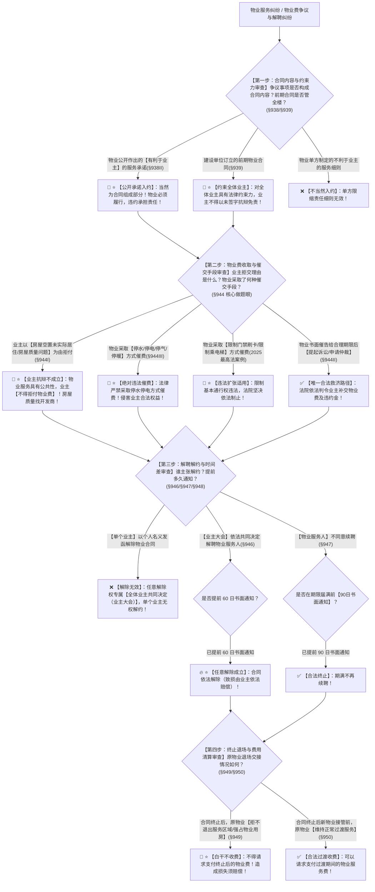

# 📐 物业服务合同 · 全流程答题模型（公开承诺入约 · 欠费禁停水电 · 未住不得拒交 · 业主大会任意解除提前60日 · 拒不退场不收费 · §937-§950）

> **教练开场白**
> 同学们好！我是你们的民法法考教练。在典型合同分编中，“物业服务合同”是**民法典 2021 年新设独立章、最高人民法院 2025 年集中发布典型指导案例、在客观题多选中常年整题打包考核的五星级王牌母题**！
> 很多同学做物业合同题目时经常陷在以下几个“生活常识与法条反差”的陷阱里：以为售楼处贴的宣传承诺只是要约邀请不能当真；以为业主自己买了房没去住、没享受保洁保安就能理直气壮拒交物业费；以为业主欠物业费，物业公司就可以名正言顺地断水断电、锁死门禁刷卡卡死业主；以为单个业主自己看物业不顺眼就能单方发函解除物业合同；把业主解聘的“60 日”和物业不续约的“90 日”记反。
> 《民法典》物业服务合同章（§937–§950）与最高人民法院 2025 年发布的物业服务纠纷典型案例，构建了**以“公开承诺当然入约、业主未住不得赖账、物业催费严禁拉闸、解聘提前六十日、物业不续提前九十日、赖着不走白干不收费”为核心的裁判闭环**。
> 今天我们用**“四步连贯流水线”**，把物业合同的全部权利义务、收费规制与解约退场规则一次性彻底锁死：**第一步查合同订立与内容（公开承诺当然入约 + 前期合同管全楼 §938/§939） → 第二步查物业费收取与催费禁令（业主未住不得拒交 §944Ⅰ vs 物业严禁停水停电限门禁 §944Ⅲ） → 第三步查解聘解约与时间差（业主大会共同决定任意解聘提前 60 日 vs 物业不续约提前 90 日 §946/§947） → 第四步查终止交接与退场责任（合法过渡期可收费 §950 vs 赖着不走白干不收钱 §949）**！

---

## 适用场景与解决问题

本模型专门解决物业服务合同成立与约束力判定、宣传承诺入约认定、物业费交纳与抗辩、违法催费行为规制、业主大会解聘与任意解除权行使、合同终止退场交接责任的全部主客观题考点（对应 [[典型合同考点-深度报告]] 十六·物业服务合同 Row 1/2/3/4 · ★★★★★ 顶级必考）：重点破解：

1. **第一步 · 合同订立与内容确定关（《民法典》§938/§939/§940）**：
   - ⭐ **公开承诺当然入约（§938Ⅱ 核心做题眼）**：物业服务人公开作出的**【有利于业主】的服务承诺**，**为物业服务合同的组成部分**（如承诺 24 小时管家服务、每周消杀两次）；
   - ⭐ **前期物业合同约束全体业主（§939）**：建设单位依法与物业服务人订立的前期物业服务合同，对全体业主具有法律约束力；业主不得以“未单独签字”为由抗辩免责；新合同生效前期合同终止（§940）。
2. **第二步 · 物业费交纳抗辩与违法催费红线关（《民法典》§944 + 2025最高法案例）**：
   - ⭐ **业主不得以未实际居住为由拒付（§944Ⅰ 核心做题眼）**：物业服务人已按约定提供服务的，业主**不得以未接受或者无需接受相关物业服务（如房屋空置、未装修入住、常年出国）为由拒绝支付物业费**！房屋质量设计问题属于开发商责任，不得以此拒付物业费；
   - ⭐ **催交物业费唯一合法路径（§944Ⅱ）**：业主逾期不交的，物业服务人可以**催告其在合理期限内支付**；合理期限届满仍不支付的，可以**提起诉讼或者申请仲裁**；
   - 🚨 **物业违法催费刚性红线（§944Ⅲ + 2025最高法案例 核心必考点）**：
     - **禁止停水停电**：物业服务人**不得采取停止供电、供水、供热、供气等方式催交物业费**！
     - **禁止限制门禁与电梯**：依据最高人民法院 2025 年指导案例，物业服务人以**限制门禁卡权限、限制乘坐电梯、扣留车位识别**等方式催交物业费，均属于违法侵害业主合法权益行为，法院坚决依法制止！
3. **第三步 · 解约续聘与“六十解、九十续”时间差关（《民法典》§946/§947/§948）**：
   - ⭐ **业主大会任意解除权（§946 核心做题眼）**：
     - 业主依照法定程序（§278 专有面积与人数双过半）**共同决定解聘物业服务人的，可以随时解除物业服务合同**（无需证明物业公司违约）；
     - ⭐ **提前 60 日书面通知**；解除造成物业损失的，除不可归责于业主的事由外，应当赔偿损失；
     - 🚨 **主体限制**：任意解除权专属**全体业主共同决定（业主大会/业委会）**，**单个业主无权单方任意解除**；物业公司亦无任意解除权！
   - ⭐ **不定期物业合同随时解除（§948）**：服务期限届满后未续签但继续服务的，转为不定期物业服务合同，**双方均可随时解除，提前 60 日书面通知**；
   - ⭐ **物业公司不续聘通知期限（§947）**：物业服务人不同意续聘的，应当在合同期限届满前 **90 日**书面通知业主或业委会；
   - **极速口诀**：**“解聘 60 日、不定期解除 60 日、物业不续约 90 日 ➔ 六十解、九十续！”**
4. **第四步 · 终止交接与退场责任关（《民法典》§949/§950/§941）**：
   - ⭐ **拒不退场不得收费（§949 核心考眼）**：物业合同终止后，原物业拒不退出服务区域、强占物业用房的，**不得请求支付合同终止后的物业费**，造成损失还须赔偿；
   - **合法过渡期可收费（§950）**：合同终止后新物业接管前，原物业继续维持正常服务的，**可以请求该期间的物业费**；
   - **转委托规则（§941）**：**“部分专项可委托（如电梯维保、保洁），全部整体禁转包”**（不得整体转委托或支解转委托）。

> **核心一句**：**公开承诺当然入约，前期合同管住全楼；业主未住不能赖账，物业催费严禁拉闸断水电限门禁；业主大会任意解聘提前六十日（单个业主不能解），物业不干提前九十日；转委托部分可整体禁；合法过渡能收钱，赖着不走白干不收费！**
>
> 🔎 **核心法源（2026最新）**：《民法典》§278、§937、§938、§939、§940、§941、§942、§943、§944、§945、§946、§947、§948、§949、§950；最高人民法院 2025 年 12 月发布的物业服务合同纠纷典型案例（第 1 号至第 5 号）。

---

## 💡 【前置认知】物业服务合同四大金句与核心数字极速对照表

| 制度模块 | 核心法律条文 | 刚性法定规则与标准 | 考场一秒判定秘诀 |
| :--- | :--- | :--- | :--- |
| **① 公开承诺入约** | 《民法典》**§938Ⅱ** | 物业公开作出的**【有利于业主的】服务承诺**入约 | 售楼宣传栏承诺 24h 安保，**当然是合同内容，不算吹牛**！ |
| **② 空置房交费** | 《民法典》**§944Ⅰ** | 业主**不得以未接受或无需接受服务为由拒交** | “常年在外地没住/没装修”抗辩一律不成立，**照单全交**！ |
| **③ 催费禁令** | 《民法典》**§944Ⅲ** + 2025最高法案例 | **严禁停水、停电、停气、限门禁、限乘电梯** | 催费唯一合法路径是**催告 + 起诉/仲裁**，拉闸断水必违法！ |
| **④ 六十解、九十续** | 《民法典》§946 / §947 / §948 | • 业主大会任意解聘：**提前 60 日**<br>• 不定期随时解聘：**提前 60 日**<br>• 物业公司不续聘：**提前 90 日** | 记住“**六十解、九十续**”！选项写单个业主解约或 30 日必错！ |

---

## 一、 考点核心骨架与法理（四步连贯决策树）



```
【物业服务全景】一句话开场：公开承诺入约，前期合同管全楼；未住不能拒交，欠费严禁停水电限门禁；业主大会解聘提早六十日，物业不续提早九十日；赖着不走白干不收费！
│
▼ 第一步 · 查内容与约束力 ── 公开承诺与前期合同（§938/§939）
├─ 物业公开作出的【有利于业主的服务承诺】（§938Ⅱ）：───────────────→ 📜【当然为合同组成部分】（不能赖账）
├─ 前期物业服务合同（§939）：───────────────────────────────────→ 🏢【对全体业主均有约束力】（没签字也要交费）
└─ 新选聘物业合同生效（§940）：─────────────────────────────────→ 前期物业服务合同自动终止
     │
     ▼ 第二步 · 查交费抗辩与催费禁令 ── 严格两端（§944 + 2025最高法案例）
     ├─ 业主抗辩拒交：
     │    ├─ 以【未实际居住/房屋空置/常年在外】为由拒交（§944Ⅰ） ────────→ 🚨【抗辩不成立，必须全额交费】
     │    └─ 以【房屋漏水/开发商设计缺陷】为由拒交 ─────────────────────→ 🚨【抗辩不成立】（找开发商，别赖物业）
     └─ 物业催交手段：
          ├─ 采取【停水、停电、停热、停气】（§944Ⅲ） ────────────────────→ 🚫【绝对违法】（侵权行为）
          ├─ 采取【限制门禁通行、限制乘坐电梯】（2025最高法案例） ───────→ 🚫【绝对违法】（侵犯通行权）
          └─ 合法路径：【催告合理期限 ➔ 提起诉讼/仲裁】（§944Ⅱ） ────────→ ✅【唯一合法通道】
               │
               ▼ 第三步 · 查解聘解约与时间差 ── 六十解、九十续（§946/§947/§948）
               ├─ 业主大会解聘物业（§946）：──────────────────────────────────→ 🔥【任意解除权】（提前 60 日书面通知；致损赔偿）
               │    └─ 🚨 单个业主无权单独解除！物业公司无任意解除权！
               ├─ 合同转为不定期租赁后解聘（§948）：─────────────────────────→ 🚪 任何一方可随时解除，【提前 60 日通知】
               └─ 物业公司不同意续聘（§947）：────────────────────────────────→ ⏰ 应当在合同期满前【90 日书面通知】
                    │
                    ▼ 第四步 · 查退场交接与收费清算 ── 赖着不走不给钱（§949/§950）
                    ├─ 原物业拒不退场、强占物业用房（§949）：─────────────────────→ 🚨【白干不收费】（不得请求终止后物业费）
                    ├─ 新物业接管前合法过渡服务（§950）：────────────────────────→ ✅【可以请求支付过渡期物业费】
                    └─ 转委托规则（§941）：──────────────────────────────────────→ 🧩【部分专项可委托，全部整体禁转包】

  ━━━ 四步全通 ━━━
```

---

## 二、 核心考情与 2026 民法典精要

- **频次研判**：物业服务合同是民法典合同编分则**★★★★★ 顶级必考新设独立章**；客观题多选题常作为大题打包考核，最高人民法院 2025 年公布的 5 件物业纠纷典型案例是 2026 考期最前沿的命题风向标。
- **命题核心**：
  1. **公开服务承诺入约（§938Ⅱ）**：物业公司公开作出的有利于业主的服务承诺，属于合同组成部分。
  2. **业主未实际居住不得拒缴（§944Ⅰ）**：物业服务具有公共性与整体性，业主不得以空置未住为由拒交物业费。
  3. **禁止以停水停电、限门禁电梯催费（§944Ⅲ + 2025案例）**：民法典明文禁止停水停电催费；最高法典型案例禁止限制门禁卡和电梯。
  4. **业主大会任意解除权（§946）**：业主依照法定程序共同决定随时解除，**提前 60 日通知**；单个业主无权解约。
  5. **六十解、九十续的时间陷阱（§946 vs §947）**：解聘 60 日，物业不续聘 90 日。
  6. **拒不退场白干不收费（§949）**：原物业被解聘后赖着不交接，不得收取终止后的物业费。

---

## 三、 三大核心法理与命题陷阱拆解

### 1. 物业服务合同四大命题暗坑与裁判标准表

| 案件事实设定 | 争议焦点 | 裁判结论 | 命题陷阱与法理深剖 |
|---|---|---|---|
| 物业公司在小区宣传栏公开承诺“小区 24 小时巡逻、每周两次公共区域消杀”。后物业未消杀，声称宣传不是正式合同内容。 | 公开有利于业主的服务承诺是否属于合同内容？ | 📜 **属于合同组成部分！物业构成违约！** | 《民法典》§938Ⅱ：物业服务人公开作出的**有利于业主的服务承诺，为物业服务合同的组成部分**，不能事后赖账（多选-14）。 |
| 业主甲购买商品房后常年在外经商，房屋一直毛坯空置。甲以“从未入住、未享受保洁安保”为由拒付 2 年物业费。 | 房屋空置未实际居住，业主能否拒交物业费？ | 🚨 **不得拒交！必须全额支付！** | 《民法典》§944Ⅰ：物业服务具有公共对价属性，业主**不得以未接受或者无需接受服务为由拒绝支付物业费**（多选-14）。 |
| 业主乙拖欠半年物业费，物业公司将乙的门禁卡权限关闭，并切断乙房屋的供电和自来水。 | 物业公司能否通过停水停电、限制门禁催费？ | 🚫 **绝对违法！法院依法制止并判令恢复！** | 《民法典》§944Ⅲ及 2025 最高法案例：**严禁采取停水停电、限制门禁电梯等方式催费**，物业公司构成侵权（多选-14）。 |
| 业主丙对物业保洁不满，以个人名义向物业发函声明“即日起单方解除物业服务合同”。 | 单个业主能否行使任意解除权解除物业合同？ | ❌ **单方解除无效！** | 《民法典》§946：任意解除权专属**业主大会依照法定程序共同决定**，单个业主不享有单方解除权（多选-27）。 |

### 2. 供用电/水合同欠费“中止供应” vs 物业合同欠费“严禁停水电”精准辨析

| 纠纷法律关系 | 债权人主体 | 欠费后的合法处置手段 | 法律依据与做题眼 |
|---|---|---|---|
| **公用事业供电/供水/供热合同**（§654/§656） | 自来水公司、供电局、供热公司 | 经催告在合理期限内仍不支付，**可以按照国家规定程序中止供应（拉闸断水）**。 | 《民法典》§654：公用事业单位享有法定**中止供应权**（多选-24）。 |
| **物业服务合同**（§944Ⅲ） | 小区物业管理公司 | ⭐ **绝对不得采取停水、停电、停气、停热方式催费！** 只能催告后**起诉或仲裁**！ | 《民法典》§944Ⅲ：物业公司**连中止供应权都没有**！ |

---

## 四、 万能解题四步

---

### 第一步：查内容与约束力关 —— 承诺入约了吗？前期合同管全楼吗？（《民法典》§938/§939）

> **教练提示**：
> 1. 物业公司公开作出的**有利于业主的服务承诺** $\rightarrow$ **直接视为合同内容（§938Ⅱ）**；
> 2. 建设单位签订的**前期物业合同** $\rightarrow$ **对全体业主均有约束力（§939）**，没签字也要交费。

---

### 第二步：查交费与催费禁令关 —— 业主赖账还是物业违法拉闸？（《民法典》§944）

> **教练提示**：
> 1. 业主以**“没入住、没享受服务、房屋质量差”**为由拒交 $\rightarrow$ **抗辩一律不成立，必须全额交费（§944Ⅰ）**；
> 2. 物业采取**“停水、停电、停气、锁门禁、限电梯”**催费 $\rightarrow$ **绝对违法（§944Ⅲ + 2025案例）**；
> 3. 物业合法催费路径：**催告给合理期限 ➔ 逾期不起诉或仲裁（§944Ⅱ）**。

---

### 第三步：查解聘与时间差关 —— 谁来解？提前多少天？（《民法典》§946/§947）

> **教练提示**：
> 1. **解聘主体**：必须是**业主大会依照法定程序共同决定（§946）**，单个业主发函解约无效；
> 2. ⭐ **算天数（六十解、九十续）**：
>    - 业主大会解聘物业 $\rightarrow$ **提前 60 日书面通知**（造成物业损失要赔偿）；
>    - 不定期物业合同解聘 $\rightarrow$ **提前 60 日书面通知（§948）**；
>    - 物业公司不续聘 $\rightarrow$ **合同期满前 90 日书面通知（§947）**！

---

### 第四步：查退场与转委托关 —— 赖着不走给钱吗？整体转包行不行？（《民法典》§949/§941）

> **教练提示**：
> 1. 合同终止后，原物业**赖着不交接强占物业用房** $\rightarrow$ **不得收取终止后的物业费（白干不收钱 §949）**；
> 2. 新物业接管前的**合法过渡期正常服务** $\rightarrow$ **可以收取过渡期物业费（§950）**；
> 3. 转委托：**电梯保洁等专项服务可以委托，但绝不能全部整体转包（§941）**！

#### 💰 完整数字案例：物业服务全景攻防实战

> **【案情（[[典型合同-多选-14]] 权威经典真题全景还原）】**
> 甲物业服务公司为某住宅小区提供物业服务。甲公司在小区显著位置设立公示栏，公开作出服务承诺：“提供 24 小时管家热线响应，公共区域监控无死角，绿化每周修剪一次”。
> 业主乙购买了该小区一套商品房，因常年在外地工作，房屋一直处于毛坯空置状态，乙已连续 **2 年**未缴纳物业费，累计欠费 **12000 元**。
> 2024年5月1日，甲物业公司为催交物业费，通知门卫保安关闭乙的门禁识别权限，并切断了乙房屋的水电供应。
> 2024年6月1日，小区召开业主大会，经全体业主合法表决共同决定解聘甲物业公司，并于当日向甲公司发出书面解聘通知，要求甲公司于 **2024年7月1日（30日后）** 正式退出小区。
>
> 1. **第一步（公开承诺效力审查）**：甲公司公开作出的管家响应与绿化承诺属于**有利于业主的服务承诺**，依据《民法典》§938Ⅱ，**当然属于物业服务合同的组成部分**，甲公司必须依约履行；
> 2. **第二步（交费抗辩与催费禁令审查）**：
>    - 业主乙以“房屋空置从未居住”为由拒付 12000 元物业费：依据《民法典》§944Ⅰ，**抗辩不成立，乙必须补交 12000 元物业费**；
>    - 甲公司采取切断水电、关闭门禁方式催交物业费：依据《民法典》§944Ⅲ及 2025 最高法典型案例，**属于严重违法催费行为，甲公司必须立即恢复供水供电及门禁通行权限**；
> 3. **第三步（解聘程序与通知期限审查）**：
>    - 依据《民法典》§946，业主大会享有**法定任意解除权**；但解聘应当**提前 60 日书面通知**物业服务人；
>    - 业主大会仅提前 30 日通知，通知期限不符合法律规定，应以通知到达后届满 60 日（即 2024年7月31日）作为合同正式解除时点；造成甲公司损失的，业主应承担相应补偿责任（多选-14 考点）！

#### 一句话闭环记忆
> 🎯 **一眼判**：**公开承诺当然入约，前期合同管住全楼；业主未住不能赖账，物业催费严禁拉闸断水电限门禁；业主大会任意解聘提前六十日（单个业主不能解），物业不干提前九十日；转委托部分可整体禁；合法过渡能收钱，赖着不走白干不收费！**

---

## 五、 案例演练

### 1. 物业服务合同四大核心金句（[[典型合同-多选-14]] 经典真题）
- **案情**：题目综合考查公开承诺入约、业主未实际居住不得拒交物业费、禁止停水停电催交物业费、业主大会解聘提前 60 日通知等规则。
- **模型分析**：第一步至第三步——依据《民法典》§938Ⅱ、§944Ⅰ、§944Ⅲ、§946，四项金句全部命中，直接全选（选 ABCD）。

### 2. 供热公用事业合同与物业催费手段对比（[[典型合同-多选-24]] 经典真题）
- **案情**：供热公司对欠费用户中止供热 vs 物业公司催费能否采取断水断热手段。
- **模型分析**：第二步——公用事业供热合同依据 §654/§656 享有法定中止供应权；而物业服务人依据 §944Ⅲ 绝对严禁采取断水断热手段催费。

---

## 关联真题

- [[典型合同-多选-14]] · 物业公开承诺入约、空置房交费、禁止停水电催费与业主大会解聘
- [[典型合同-多选-24]] · 供用热力合同中止供应权与物业催费禁令对比
- [[典型合同-多选-27]] · 业主大会任意解除权与单个业主解约限制

## 相关页面

- 概念实体页：[[物业服务合同]] · [[委托合同]] · [[买卖合同]]
- 姊妹模型：[[民法-合同-委托合同模型]] · [[民法-合同-解除模型]]
- 综合报告：[[典型合同考点-深度报告]]（十六、物业服务合同 · Row 1/2/3/4 · ★★★★★ 顶级必考）
