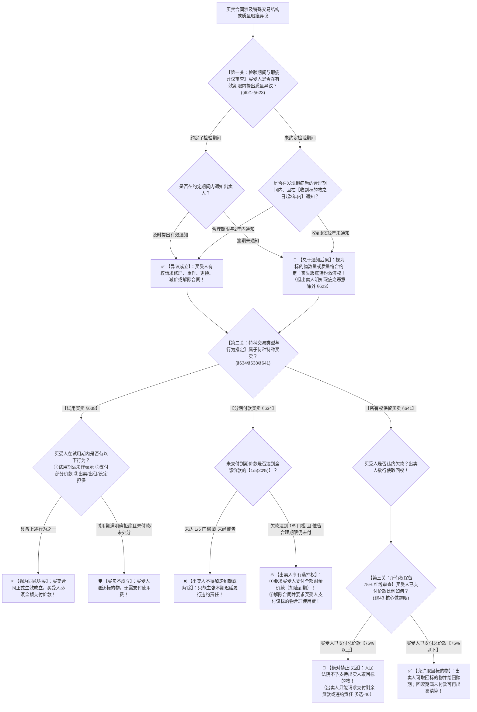

# 📐 特种买卖与检验期 · 全流程答题模型（检验期2年极限 · 试用买卖视为购买 · 分期付款1/5门槛 · 所有权保留75%排除取回红线 · §621-§643）

> **教练开场白**
> 同学们好！我是你们的民法法考教练。在买卖合同分编中，“特种买卖与检验期间”是**客观题命题人最爱挖数字陷阱、将买卖分则与物权担保编深度交叉的命题重镇**！
> 很多同学做特种买卖题目时经常在以下几个“刚性数字与程序红线”上丢分：标的物有瑕疵买方最多几年内能提异议？拿回家试用的东西转手租给别人算不算买下了？分期付款欠了多少钱卖方才能解除合同？卖方约定了所有权保留，买方欠了最后一期款，卖方能不能直接上门把货强行拉走？
> 《民法典》第 621–643 条与《最高人民法院关于适用〈民法典〉有关担保制度的解释》第 64 条，构建了**以“检验期 2 年封顶、试用处分视为购买、分期付款 1/5 欠款门槛、所有权保留登记对抗与 75% 排除取回红线”为核心的大一统裁判规则**。今天我们用**“三关连贯流水线”**，把特种买卖的交易结构、数字门槛与权利限制一次性彻底锁死：**第一关检验期间与瑕疵通知（约定优先 $\rightarrow$ 合理期 $\rightarrow$ 2 年极限 $\rightarrow$ 怠于通知视为合格） → 第二关特种交易形态判定（试用买卖行为推定 vs 分期付款 1/5 催告解除） → 第三关所有权保留与 75% 取回权限制（登记对抗 + 欠款取回 + 已付超 75% 绝对禁止取回）**。

---

## 适用场景与解决问题

本模型专门解决买卖标的物检验期间确定、试用买卖效力认定、分期付款买卖解除救济、所有权保留买卖取回权限制的全部主客观题考点（对应 [[典型合同考点-深度报告]] 一·买卖合同 Row 1/3/4/5/7 · ★★★★★ 顶级必考）：重点破解：

1. **标的物质量检验期间与通知关（《民法典》§621-§623）**：
   - **约定检验期间**：买受人应当在约定检验期间内将不符合约定的情形通知出卖人；
   - **未约定检验期间**：买受人在发现或者应当发现瑕疵之日起的**合理期间内**通知出卖人；
   - ⭐ **2 年法定最长异议期（§621Ⅱ）**：买受人在收到标的物之日起 **2 年内未通知出卖人的，视为标的物的数量或者质量符合约定**；但有质量保证期的，适用质量保证期；
   - **出卖人恶意抗辩限制（§623）**：出卖人**知道或者应当知道**提供的标的物不符合约定的，买受人不受上述通知时间的限制！
2. **试用买卖与推定购买关（《民法典》§638-§640）**：
   - **试用买卖的认可权**：试用买卖的买受人在试用期内可以购买，也可以拒绝购买；
   - ⭐ **视为同意购买的三大法定情形（§638）**：
     - ① 试用期限届满，买受人**对是否购买未作表示的，视为购买**；
     - ② 买受人在试用期内**已经支付部分或者全部价款的，视为同意购买**；
     - ③ 买受人在试用期内**进行了出卖、出租、设立担保物权等非试用行为的，视为同意购买**！
3. **分期付款买卖解除与取回门槛（《民法典》§634）**：
   - ⭐ **1/5 欠款门槛**：分期付款的买受人未支付到期价款的数额达到**全部价款的五分之一（20%）**；
   - **催告前置程序**：经出卖人**催告后在合理期限内仍未支付**到期价款；
   - **出卖人选择权**：出卖人可以要求买受人**支付全部价款（加速到期）**，或者**解除合同并要求支付标的物使用费**！
4. **所有权保留买卖与 75% 取回权红线（《民法典》§641-§643 + 担保解释§64）**：
   - **非典型担保属性**：出卖人保留所有权，**未经登记，不得对抗善意第三人（§641Ⅱ）**；
   - **出卖人取回权的三大情形（§642）**：①未按约定支付价款经催告仍不付；②未完成特定条件；③将标的物不当处分；
   - ⭐ **75% 刚性禁止取回红线（《民法典》§643 + 买卖解释）**：**买受人已经支付标的物总价款的百分之七十五（75%）以上，出卖人主张取回标的物的，人民法院不予支持！**（多选-46）。

> **核心一句**：**检验期间有约从约，没约合理最长两年，怠于通知视为合格，出卖人使坏不受限；试用期满不吱声、付了钱、转手卖租设抵押，通通算买下；分期欠款超两成，催告不给可要全款或退货扣使用费；所有权保留未登记不破善意三，买受人掏钱超七成五，出卖人绝对拉不走！**
>
> 🔎 **核心法源（2026最新）**：《民法典》§595、§511、§621、§622、§623、§634、§638、§639、§640、§641、§642、§643；《最高人民法院关于适用〈民法典〉有关担保制度的解释》（法释〔2020〕28号）第64条；《最高人民法院关于审理买卖合同纠纷案件适用法律若干问题的解释》（法释〔2020〕17号修正）第15条至第18条。

---

## 💡 【前置认知】特种买卖与检验期四大核心数字红线极速对照表

| 制度模块 | 核心法律条文 | 刚性法定数字红线与门槛 | 考场一秒判定秘诀 |
| :--- | :--- | :--- | :--- |
| **① 检验期间与瑕疵异议** | 《民法典》§621 | **约定期间 ＞ 合理期间 ＞ 2 年最长异议期**（有质保期从质保期） | 收到货超 2 年未吱声，**视为完全合格**，丧失瑕疵抗辩权！ |
| **② 试用买卖认可推定** | 《民法典》§638 | 试用期届满**沉默** / **支付部分价款** / **出租出卖设立担保** | 只要做了“只有所有人才配做的事”，**一律视为买下**！ |
| **③ 分期付款买卖救济** | 《民法典》§634 | 未付到期款 $\ge$ **全部价款的 1/5（20%）** ＋ 经催告合理期限 | 欠款超 20% 且催告不理，卖方才可**要求全款 OR 解除退货扣使用费**！ |
| **④ 所有权保留取回限制** | 《民法典》§643 | 买受人已支付总价款 $\ge$ **75%** | 已付超过 75%，**法律绝对禁止出卖人取回标的物**（多选-46）！ |

---

## 一、 考点核心骨架与法理（三关连贯决策树）



```
【特种买卖与检验期全景】一句话开场：多久必须验货？试用期怎么算买下？分期欠多少能退货？付了七成五还能不能抢走货物？
│
▼ 第一关 · 检验期间与瑕疵通知 ── 2 年法定极限（§621-§623）
├─ 有约定检验期间 ───────────────────────────────────────────────────→ 在约定期间内通知；逾期未通知视为合格
└─ 未约定检验期间：
     ├─ 必须在发现瑕疵的【合理期间内】通知
     └─ ⭐ 刚性上限：自收到标的物之日起【2 年内】必须通知（有质保期的从质保期）
          ├─ 超过 2 年未通知 ─────────────────────────────────────────→ 🚨 视为数量/质量符合约定，丧失瑕疵索赔权！
          └─ 出卖人【明知或应知有瑕疵】（恶意出卖人 §623） ──────────→ 🛡️ 买受人不受 2 年限制，随时可主张救济！
               │
               ▼ 第二关 · 特种买卖行为推定与救济门槛 ── 试用与分期（§634/§638）
               ├─ 【试用买卖（§638）】：
               │    ├─ 视为同意购买三大情形：①试用期满沉默未作表示 ②支付部分/全款 ③出卖/出租/设定担保
               │    └─ 视为购买的法律效果：买卖成立生效，买受人必须支付全部货款！
               │
               └─ 【分期付款买卖（§634）】：
                    ├─ 审查欠款数额：未付到期款 $\ge$ 【全部价款的 1/5（20%）】
                    └─ 审查前置程序：经出卖人【催告后在合理期限内仍未支付】
                         ├─ 满足 1/5 + 催告程序 ──────────────────────────────→ 🔥 出卖人可择一：【要求一次性全款】OR【解除合同索赔使用费】！
                         └─ 未达 1/5 门槛 ────────────────────────────────────→ ❌ 不得解除合同，只能追讨到期欠款
                              │
                              ▼ 第三关 · 所有权保留与 75% 取回权红线 ── 担保与权利限制（§641-§643）
                              ├─ 对抗效力（§641Ⅱ）：未在动产融资统一登记系统登记的，【不得对抗善意第三人】
                              └─ ⭐ 取回权 75% 刚性红线（§643）：
                                   ├─ 买受人已付总价款 $\ge$ 【75% 以上】 ───────────→ 🚨【法院绝对不予支持取回】！（多选-46）
                                   └─ 买受人已付总价款 $<$ 【75%】 ───────────────────→ ✅ 允许出卖人取回标的物清算

  ━━━ 三关全通 ━━━
```

---

## 二、 核心考情与 2026 民法典精要

- **频次研判**：特种买卖与检验期间是民法典合同编分则**★★★★★ 顶级必考高频点**；每年在客观题单选、多选及不定项中必出 2–3 道题。
- **命题核心**：
  1. **检验期间 2 年法定异议期（§621Ⅱ）**：无论隐蔽瑕疵多深，自收到货物起 2 年未通知视为合格（除有质保期或卖方恶意 §623 外）。
  2. **试用买卖行为推定（§638）**：试用期内买方付了部分钱、或者转手把试用物租给第三人，**法律直接推定为同意购买**。
  3. **分期付款买卖的 1/5 门槛（§634）**：未付到期款达到总价 20% 且催告后不付，卖方享有**“加速到期要求全款”或“解除合同退货并要使用费”**的选择权。
  4. **所有权保留的 75% 限制取回红线（§643）**：买方只要付了 75% 以上款项，卖方**绝对丧失取回权**，只能走债权追偿！

---

## 三、 三大核心法理与命题陷阱拆解

### 1. 特种买卖与检验期四大命题暗坑表

| 案件事实设定 | 争议焦点 | 裁判结论 | 命题陷阱与法理深剖 |
|---|---|---|---|
| 买受人收到设备 2 年零 1 个月后发现核心零件尺寸偏小，起诉要求退货减价 | 超过了 2 年异议期，但设备确实存在瑕疵，能否支持？ | ❌ **不予支持！** | 依据《民法典》§621Ⅱ，收到货物之日起 2 年内未通知，**法律拟制为质量符合约定**，买方丧失瑕疵救济权（单选-01）。 |
| 甲将电脑拿给乙试用 7 天。第 3 天乙将电脑以每月 200 元出租给丙。第 7 天乙通知甲“我不买了”。 | 乙在试用期内出租了标的物，买卖合同成立了吗？ | ✅ **买卖合同成立！乙必须付全款！** | 依据《民法典》§638，在试用期内**出租、出卖或设立担保**等非试用行为，**视为同意购买**，乙无权反悔（单选-02）。 |
| 机器总价 10 万元分 5 期付。买方未付第 1 期（2 万元），卖方催告 7 天后直接起诉要求解除合同并收回机器。 | 欠款 2 万元达到总价的 20%，卖方能否解除？ | ✅ **支持解除并索赔使用费！** | 依据《民法典》§634，欠款达到全部价款的 **1/5（20%）** 经催告仍不付，卖方有权**解除合同并索赔使用费**（多选-01）。 |
| 电脑总价 12000 元分 6 期，约定付清前保留所有权。买方已付 10000 元，仅欠最后一期 2000 元。卖方要求取回电脑。 | 买方已付 10000 元（占 83%），卖方能否取回电脑？ | 🚨 **法院绝对不支持取回！** | 依据《民法典》§643，买受人已支付标的物总价款 **75% 以上**的，**出卖人不得主张取回标的物**（多选-46）。 |

---

## 四、 万能解题三步

---

### 第一步：查检验期间关 —— 过了 2 年极限没有？（《民法典》§621-§623）

> **教练提示**：
> 1. 先看合同有无约定检验期：有约定在约定内提出；
> 2. 没约定的看发现后的合理期间，且最长**自收到货物之日起不得超过 2 年**（有质保期从质保期）；
> 3. 超过 2 年没提异议的，**视为质量合格，不得再主张违约救济**；
> 4. ⚠️ **例外**：如果卖方订约时就知道有瑕疵还故意隐瞒（恶意卖方 §623），不受 2 年限制！

---

### 第二步：查特种交易行为关 —— 试用认定了没？分期过 1/5 没？（《民法典》§634/§638）

> **教练提示**：
> 1. **试用买卖（§638）**：
>    - 试用期满不作表示（沉默） $\rightarrow$ 视为购买；
>    - 试用期内付了部分款 / 拿去出租、出卖、抵押 $\rightarrow$ 视为同意购买！
> 2. **分期付款买卖（§634）**：
>    - 算欠款比例：未付到期款 $\div$ 全部价款 $\ge \mathbf{20\%}$；
>    - 催告程序：经催告给合理期限后仍不支付；
>    - 卖方选择权：要求**一次性付清全部余款（加速到期）**，或者**解除合同退货并要合理使用费**。

---

### 第三步：查所有权保留取回关 —— 买方已付款超 75% 没？（《民法典》§641-§643）

> **教练提示**：出卖人约定了所有权保留，买方欠款时卖方要取回货物：
> 1. 先看**登记没有（§641Ⅱ）**：没在动产系统登记的，不能对抗买方转卖的善意第三人；
> 2. ⭐ **算 75% 刚性红线（§643）**：
>    - 买方已付金额 $\div$ 总价款 $\mathbf{\ge 75\%}$ $\rightarrow$ **法院绝对不支持取回！卖方只能追讨欠款（多选-46）**；
>    - 买方已付金额 $\div$ 总价款 $\mathbf{< 75\%}$ $\rightarrow$ 允许卖方取回货物清算。

#### 💰 完整数字案例：分期付款与所有权保留 75% 红线攻防实战

> **【案情（[[典型合同-多选-46]] 权威真题全景还原）】**
> 甲向乙购买一台高档笔记本电脑，总价款 **12000 元**。双方签订《分期付款所有权保留买卖合同》，约定：“甲分 6 期支付价款，每期支付 2000 元；在甲付清全部价款之前，**乙保留该电脑的所有权**”。乙依约向甲交付了电脑。
> - **实战场景 A（欠款达 1/5 门槛）**：
>   若甲支付了前两期共 4000 元后，第三期、第四期连续逾期未付（累计未付到期款达到 3000 元）。乙发出书面催告，要求甲在 7 日内支付，甲逾期仍未支付。
>   - 裁判涵摄：甲未付到期款 3000 元相对于总价款 12000 元而言占比为 $3000 \div 12000 = 25\% > 20\%$（达到全部价款 1/5 门槛）；经催告后仍未支付，出卖人乙享有法定选择权：**既可以要求甲一次性支付全部剩余 8000 元价款，也可以解除合同并要求甲支付电脑使用费（多选-46 C、D 选项正确）**！
> - **实战场景 B（已付超 75% 排除取回红线）**：
>   若甲正常支付了前 5 期共 **10000 元**，仅剩最后一期 **2000 元**逾期未付。出卖人乙以保留所有权为由，要求强行取回该电脑。
>   - 裁判涵摄：甲已支付 10000 元，占总价款的比例为 $10000 \div 12000 = 83.3\% > 75\%$；依据《民法典》§643，**买受人已支付总价款 75% 以上的，出卖人不得主张取回标的物！乙主张取回电脑的请求法院不予支持（多选-46 B 选项错误）**！

#### 一句话闭环记忆
> 🎯 **一眼判**：**检验期合理最长两年，怠于通知视为合格，出卖人使坏不受限；试用期满不吱声、付了钱、转手卖租设抵押，通通算买下；分期欠款超两成，催告不给可要全款或退货扣使用费；所有权保留未登记不破善意三，买受人掏钱超七成五，出卖人绝对拉不走！**

---

## 五、 案例演练

### 1. 标的物检验期间与 2 年法定异议期（[[典型合同-单选-01]] 经典真题）
- **案情**：买受人收货后超过 2 年才通知出卖人标的物内部存在隐蔽瑕疵，要求出卖人赔偿损失。
- **模型分析**：第一步——未约定检验期的，最长通知期间为收到标的物之日起 2 年（§621Ⅱ）；买受人收到标的物超过 2 年未通知，法律拟制为质量符合约定，买受人丧失瑕疵违约救济权。

### 2. 试用买卖出租设定担保视为同意购买（[[典型合同-单选-02]] · [[典型合同-多选-02]]）
- **案情**：买受人将试用标的物在试用期内出租给第三人收取租金，试用期满后声称不满意拒绝购买。
- **模型分析**：第二步——买受人在试用期内出租标的物属于超出试用目的的处分行为；依据《民法典》§638，**视为同意购买**，买卖合同成立，买受人必须全额支付价款。

### 3. 所有权保留买卖 75% 限制取回权（[[典型合同-多选-46]]）
- **案情**：买受人已支付全部货款的 83%（超过 75%），出卖人因买受人拖欠最后一期尾款主张取回标的物。
- **模型分析**：第三步——依据《民法典》§643，买受人支付价款达到 75% 以上，出卖人丧失取回权，法院对取回请求不予支持。

---

## 关联真题

- [[典型合同-单选-01]] · 标的物检验期间与 2 年法定异议期限制
- [[典型合同-单选-02]] · 试用买卖试用期内非试用行为视为购买
- [[典型合同-多选-01]] · 分期付款买卖 1/5 欠款门槛与解除使用费
- [[典型合同-多选-46 · 所有权保留买卖与分期付款解除取回权限制案]] · 所有权保留 75% 排除取回刚性红线
- [[典型合同-多选-21]] · 所有权保留登记对抗善意第三人

## 相关页面

- 概念实体页：[[买卖合同]] · [[所有权保留]]
- 姊妹模型：[[民法-合同-买卖风险负担模型]]（风险负担与孳息） · [[民法-合同-一物多卖模型]]（多重买卖履行顺序） · [[民法-合同-违约责任模型]]（违约救济总调度）
- 综合报告：[[典型合同考点-深度报告]]（一、买卖合同 · Row 1/3/4/5/7 · ★★★★★ 顶级必考）
