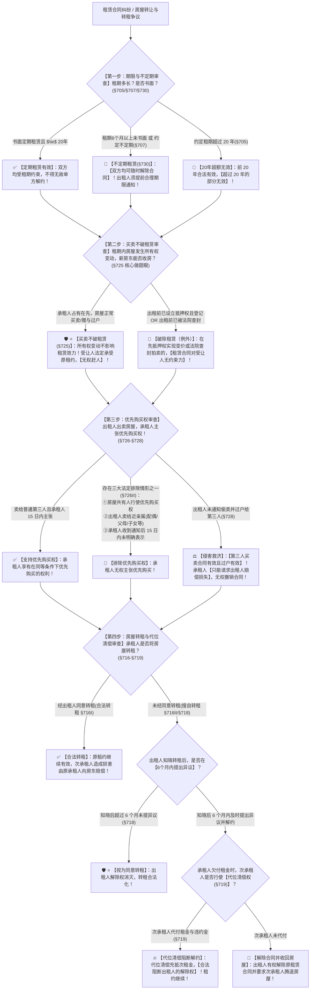

# 📐 租赁合同 · 全流程答题模型（不定期随时解除 · 买卖不破租赁 · 优先购买权三大排除 · 擅自转租6个月异议期 · 次承租人代位清偿 · §703-§734）

> **教练开场白**
> 同学们好！我是你们的民法法考教练。在典型合同分编中，“租赁合同”是**仅次于买卖合同的第二大核心命题大户，是客观题与主观题案例分析中考查“债权物权化与特权保护”的五星级王牌母题**！
> 很多同学做租赁合同题目时经常陷在以下几个“经典认知泥潭”里：签了 10 年租约但没写书面字据，以为合同直接无效；房东把房子卖给亲弟弟，租客起诉要主张优先购买权并撤销过户；房东知道租客当二房东转租后过了 8 个月才起诉解约；房东没通知租客就把房子卖给善意买家并过户，租客要求确认房屋买卖合同无效把房抢回来。
> 《民法典》租赁合同章（§703–§734）与最高人民法院《关于审理城镇房屋租赁合同纠纷案件具体应用法律若干问题的解释》（法释〔2020〕17号修正），构建了**以“20年封顶、不定期随时撤、买卖不破在先租、优先购买排除共有亲戚、转租 6 个月沉默即默认、代位清偿保租约”为核心的坚固裁判闭环**。
> 今天我们用**“四步连贯流水线”**，把租赁合同的全部时间节点、特权边界与连环抗辩一次性彻底锁死：**第一步查期限与不定期解除关（20年超额无效 + 6个月无书随时能撤 §705/§707/§730） → 第二步查买卖不破租赁关（占有在先不影响效力 vs 在先抵押查封例外 §725） → 第三步查优先购买/承租权关（提前15日通知 + 共有/亲戚/逾期排除 + 侵害只赔不撤 §726-§728/§734Ⅱ） → 第四步查房屋转租与代位清偿关（擅自转租 6 个月未异议视为同意 + 次承租人代付租金阻断解约 §716-§719）**！

---

## 适用场景与解决问题

本模型专门解决租赁合同效力与期限认定、不定期租赁单方任意解除、买卖不破租赁适用边界、承租人优先购买权与优先承租权救济、擅自转租合同效力与 6 个月异议期认定、次承租人代位清偿权利行使的全部主客观题考点（对应 [[典型合同考点-深度报告]] 六·租赁合同 Row 1/2/3/4/5 · ★★★★★ 顶级必考）：重点破解：@!

1. **第一步 · 期限限制与不定期租赁解除关（《民法典》§705/§707/§730/§734）**：
   - **20 年法定上限（§705）**：租赁期限不得超过 20 年；超过 20 年的，**超过部分无效**（非整个合同无效）；
   - ⭐ **不定期租赁三大法定形态**：①约定不定期；②租赁期限 6 个月以上**未采用书面形式**且无法确定期限（§707）；③租赁期满承租人继续使用，出租人未提异议（§734Ⅰ）；
   - ⭐ **双方随时解除权（§730）**：不定期租赁合同，**当事人双方均可以随时解除合同**（出租人解除应当在合理期限之前通知承租人）。
2. **第二步 · 买卖不破租赁与物权变动承继关（《民法典》§725 + 担保解释§54）**：
   - ⭐ **买卖不破租赁原则（§725）**：租赁物在承租人按照租赁合同**占有期限内**发生所有权变动的，**不影响租赁合同的效力**（受让人法定承受出租人地位，无权强行驱赶承租人）；
   - 🚨 **两大法定例外（破除租赁）**：
     - ① **抵押权设立在先**并登记，后出租，抵押权人实现抵押权变价的（担保解释§54）；
     - ② **房屋在出租前已被人民法院依法查封**的。
3. **第三步 · 承租人优先购买权与优先承租权关（《民法典》§726-§728 / §734Ⅱ）**：
   - **程序通知要件**：出租人出卖租赁房屋的，应当在出卖之前的**合理期限内（通常提前 15 日）通知承租人**；承租人享有在**同等条件下优先购买**的权利；
   - ⭐ **三大法定排除情形（§726Ⅱ 核心做题眼）**：
     - ① **房屋共有人行使优先购买权**（物权共有优先于债权租赁）；
     - ② **出租人将房屋出卖给近亲属**（配偶、父母、子女、兄弟姐妹、祖父母、外祖父母、孙子女、外孙子女）；
     - ③ 出租人履行通知义务后，承租人在 **15 日内未明确表示购买的（视为放弃）**；
   - ⭐ **侵害后果（§728）**：出租人未通知直接卖给第三人并过户的，**买卖合同有效**；承租人**不得主张买卖合同无效或撤销过户，只能请求出租人赔偿损失**！
   - **优先承租权（§734Ⅱ）**：房屋租赁期限届满，承租人在同等条件下享有优先承租权。
4. **第四步 · 房屋转租与 6 个月除斥异议期关（《民法典》§716-§719）**：
   - **合法转租（经同意 §716Ⅰ）**：原租赁合同继续有效；第三人造成租赁物毁损的，由承租人向出租人赔偿损失；
   - ⭐ **擅自转租与 6 个月异议期（§716Ⅱ / §718 权威做题眼）**：
     - 承租人未经出租人同意转租的，出租人可以**解除合同**；
     - ⭐ **6 个月除斥异议期**：出租人知道或者应当知道承租人转租，**但在 6 个月内未提出异议的，视为出租人同意转租，解除权消灭**！
   - ⭐ **次承租人代位清偿代位权（§719）**：承租人拖欠租金的，次承租人可以**代承租人支付欠付的租金和违约金**（充抵次承租人应付租金），以此**阻断出租人的合同解除权**！

> **核心一句**：**租期最长不过二十年，六月无书随时能撤（不定期任意解除）；占有在先买卖不破租赁（在先抵押查封除外）；优先购买等十五天（共有、亲戚、逾期不要全排除，侵害买卖仍有效只赔钱）；擅自转租六月不吭声算默认，次承租人掏钱代位阻断解约！**
>
> 🔎 **核心法源（2026最新）**：《民法典》§703、§705、§707、§716、§717、§718、§719、§725、§726、§727、§728、§730、§734；《最高人民法院关于审理城镇房屋租赁合同纠纷案件具体应用法律若干问题的解释》（法释〔2020〕17号修正）第10条至第15条；《最高人民法院关于适用〈民法典〉有关担保制度的解释》第54条。

---

## 💡 【前置认知】租赁合同四大核心制度极速对照表

| 制度模块 | 核心法律条文 | 适用条件与法定要求 | 考场一秒判定秘诀 |
| :--- | :--- | :--- | :--- |
| **① 租期与不定期租赁** | 《民法典》§705 / §707 / §730 | • 期限不得超 **20 年**（超期部分无效）；<br>• 6个月以上**未采用书面形式**视为不定期租赁。 | 不定期租赁**双方均享有随时解除权**（出租人须合理期限前通知）！ |
| **② 买卖不破租赁** | 《民法典》§725 | 承租人**先行占有租赁物**，后发生所有权变动。 | 新买家直接继受租约，**无权赶走承租人**；**在先抵押/在先查封除外**！ |
| **③ 承租人优先购买权** | 《民法典》§726-§728 | 出租人卖房提前 **15 日**通知承租人。 | **共有、近亲属、15日未明确表示三大排除**；侵害只赔损失，**买卖合同仍有效**！ |
| **④ 擅自转租与代位清偿** | 《民法典》§716-§719 | 未经同意转租；知晓后 **6 个月内未提异议**；承租人欠租。 | 房东知晓后 **6 个月不吭声视为同意转租**；次承租人**代付租金可阻断房东解约**！ |

---

## 一、 考点核心骨架与法理（四步连贯决策树）



```
【租赁合同全景】一句话开场：租期超二十年超额废，六月无书随时撤；占有在先买卖不破租赁；优先购买排除共有亲戚只赔不撤；擅自转租六月不吭声算默认！
│
▼ 第一步 · 查期限与不定期解除 ── 20 年与随时撤（§705/§707/§730）
├─ 约定租期超过 20 年（§705）：───────────────────────────────────────→ 🚨【前20年有效，超过20年部分无效】
├─ 租期 6 个月以上未采用书面形式（§707）：────────────────────────────→ 🚪【拟制为不定期租赁】
│    └─ 法律后果：⭐【双方均享有随时解除权】（合理期限前通知 §730）
└─ 书面定期租赁 $\le$ 20 年：──────────────────────────────────────────→ ✅ 双方按期履行，不得擅自解除
     │
     ▼ 第二步 · 查买卖不破租赁 ── 债权物权化（§725）
     ├─ 承租人占有在先，房屋发生所有权变动（买卖/赠与/继承）：──────→ 🛡️【买卖不破租赁】（新房东承受租约无权赶人）
     └─ 🚨 法定例外（破除租赁）：
          ├─ ① 抵押权设立并登记在先，后出租（担保解释§54） ──────────→ 抵押权实现变价可破除租赁
          └─ ② 房屋出租前已被法院依法查封 ──────────────────────────→ 拍卖变价可破除租赁
               │
               ▼ 第三关 · 查优先购买/承租权 ── 特权与排除（§726-§728 / §734Ⅱ）
               ├─ 程序：出租人出卖房屋应当【提前 15 日通知】承租人
               ├─ ⭐ 三大刚性排除（§726Ⅱ）：
               │    ├─ ① 房屋共有人行使优先购买权 ────────────────────────────→ 🚫 承租人不得主张（物权共有优先）
               │    ├─ ② 出租人出卖给【近亲属】（配偶/父母/子女等） ─────────→ 🚫 承租人不得主张（人伦亲情优先）
               │    └─ ③ 承租人收到通知后【15 日内未明确表示】 ───────────────→ 🚫 视为放弃优先购买权
               ├─ 侵害后果（§728）：未通知直接卖给第三人并过户 ──────────────→ ⚖️【买卖有效过户有效，承租人仅得索赔】！
               └─ 优先承租权（§734Ⅱ）：期满同等条件下享有优先承租权
                    │
                    ▼ 第四关 · 查房屋转租与代位清偿 ── 6 个月异议期（§716-§719）
                    ├─ 合法转租（经同意 §716Ⅰ）：原合同有效，次承租人致损原承租人担责
                    └─ 擅自转租（未经同意 §716Ⅱ）：
                         ├─ 出租人知晓后【6 个月内未提异议】（§718） ─────────────→ 🛡️【视为同意转租，解除权消灭】！
                         └─ 出租人 6 个月内提出解除：
                              ├─ 次承租人行使【代位清偿权】代付欠租（§719） ────────→ 🔥【合法阻断解除权】，合同存续！
                              └─ 次承租人未代付 ──────────────────────────────→ 🚨 出租人解除合同收回房屋

  ━━━ 四步全通 ━━━
```

---

## 二、 核心考情与 2026 民法典精要

- **频次研判**：租赁合同是民法典合同编分则**★★★★★ 顶级必考母题**；每年在单选题、多选题中必出 2 题，主观题案例分析中常与物权担保、房屋买卖连环命题。
- **命题核心**：
  1. **不定期租赁的任意解除权（§730）**：6 个月以上未订书面合同，直接视为不定期租赁，**双方均可随时解除**。
  2. **买卖不破租赁的适用前提与例外（§725）**：必须以**“承租人先行合法占有”**为要件；在先抵押登记与在先司法查封排除适用。
  3. **承租人优先购买权的三大排除（§726Ⅱ）**：**房屋共有、近亲属出卖、15日未明确表示**；侵害优先购买权买卖合同依然有效，承租人仅能索赔。
  4. **擅自转租的 6 个月除斥异议期（§718）**：出租人知情后 6 个月不吭声，**拟制为同意转租，丧失解除权**。
  5. **次承租人代位清偿权（§719）**：次承租人替原承租人垫付租金违约金，**产生强制阻断房东解除权的法力**。

---

## 三、 三大核心法理与命题陷阱拆解

### 1. 租赁合同四大命题暗坑与裁判标准表

| 案件事实设定 | 争议焦点 | 裁判结论 | 命题陷阱与法理深剖 |
|---|---|---|---|
| 甲乙口头约定租房 3 年，未签订书面合同。1 年后甲（房东）通知乙下月搬走解除合同。乙主张租期未到不得解约。 | 口头租房 3 年，房东能否随时解除合同？ | ✅ **房东有权随时解除！** | 《民法典》§707/§730：6个月以上未采用书面形式的，**视为不定期租赁**；不定期租赁双方均可**随时解除**（多选-05）。 |
| 甲将房屋出租给乙（租期 5 年已入住）。第 2 年甲将房屋卖给丙并办理过户。丙以自己是新房东为由要求乙搬离。 | 房屋所有权变更，新房东能否要求在先租客搬走？ | ❌ **丙无权要求乙搬离！** | 《民法典》§725：**买卖不破租赁**；租赁物在占有期限内发生所有权变动的，不影响租赁合同效力，丙法定承受原租约（多选-05）。 |
| 甲欲将出租给乙的房屋出卖给自己的亲生儿子丙，未提前 15 日通知租客乙。乙起诉要求以同等价格优先购买。 | 出租人卖房给亲儿子，租客是否享有优先购买权？ | 🚫 **乙不享有优先购买权！** | 《民法典》§726Ⅱ：出租人将房屋**出卖给近亲属的，承租人优先购买权被法定排除**；乙无权主张优先购买（多选-05）。 |
| 承租人乙未经房东甲同意，擅自将房屋转租给丙。甲在得知转租事实 8 个月后，向法院起诉要求解除与乙的租赁合同。 | 房东知晓擅自转租过了 8 个月，还能否解除合同？ | 🚨 **解除权已消灭，不得解除！** | 《民法典》§718：出租人知道转租事实**在 6 个月内未提出异议的，视为同意转租**，解除权消灭（单选-09）。 |

### 2. 侵害承租人优先购买权的救济边界（《民法典》§728 核心红线）

| 救济请求类型 | 法院是否支持？ | 法律依据与做题眼 |
|---|---|---|
| 承租人请求法院**确认出租人与第三人的房屋买卖合同无效** | ❌ **绝对不予支持！** | 《民法典》§728：债权特权不得破坏善意交易，买卖合同有效。 |
| 承租人请求法院**撤销房屋过户登记并判令过户给自己** | ❌ **绝对不予支持！** | 不动产物权已转移给第三人，承租人无物权追及效力。 |
| 承租人请求出租人**承担损害赔偿责任（赔偿差价损失）** | ✅ **依法予以支持！** | 《民法典》§728 明文救济方式：**出租人应当承担赔偿责任**。 |

---

## 四、 万能解题四步

---

### 第一步：查期限与不定期关 —— 租期多长？书面了没？（《民法典》§705/§707/§730）

> **教练提示**：
> 1. 租期超过 20 年 $\rightarrow$ **前 20 年有效，超出的部分无效（§705）**；
> 2. 租期 6 个月以上没签书面合同 $\rightarrow$ **直接定性为不定期租赁（§707）**；
> 3. 不定期租赁的法力：**双方当事人均可以随时解除合同（§730）**！

---

### 第二步：查买卖不破租赁关 —— 占有在先还是抵押查封在先？（《民法典》§725）

> **教练提示**：
> 1. 承租人**已经实际占有（入住/使用）**，后房屋发生买卖、赠与、继承 $\rightarrow$ **买卖不破租赁，新房东直接当原房东，无权赶人**；
> 2. 🚨 **排除买卖不破租赁的两大暗坑**：
>    - 房屋出租前**已经抵押并登记**（担保解释§54）；
>    - 房屋出租前**已被法院司法查封**。

---

### 第三步：查优先购买权关 —— 共有亲戚排除了没？卖了怎么赔？（《民法典》§726-§728）

> **教练提示**：出租人卖房，租客主张优先购买权：
> 1. 先查**三大排除情形（§726Ⅱ）**：
>    - 卖给**共有人** $\rightarrow$ 排除；
>    - 卖给**近亲属（配偶/父母/子女/兄弟姐妹等）** $\rightarrow$ 排除；
>    - 通知后租客 **15 日内未明确表示购买** $\rightarrow$ 视为放弃排除；
> 2. 房东没通知直接卖给外人并过户：**买卖合同有效、过户有效，租客只能找房东要赔偿（§728）**！

---

### 第四步：查房屋转租与代位关 —— 过了 6 个月没？次承租人掏钱没？（《民法典》§716-§719）

> **教练提示**：擅自转租（二房东）：
> 1. 算异议期：房东知道后 **6 个月内没提异议 $\rightarrow$ 视为同意转租，房东不能再解除合同（§718）**；
> 2. 房东在 6 个月内要解约（因原租客欠租）：
>    - 次承租人行使**代位清偿权（§719）**替原租客把欠款和违约金交了 $\rightarrow$ **合法阻断房东的解除权，房东不得解约**！

#### 💰 完整数字案例：租赁合同连环攻防实战

> **【案情（[[典型合同-多选-05]] 与 [[典型合同-单选-09]] 综合演练）】**
> 甲（房东）与乙于 2023年1月1日 口头约定将一套三居室房屋出租给乙，约定租期 **3 年**，月租金 **5000 元**（双方未签订书面合同）。乙入住后一直正常交租。
> - **实战分支 A（不定期租赁与随时解除权 · 多选-05）**：
>   2023年6月1日，甲通知乙：“因双方未签订书面租房合同，该租赁合同为不定期租赁，我决定解除合同，给你 1 个月时间搬离”。
>   - 裁判涵摄：租赁期限 6 个月以上未采用书面形式，依据《民法典》§707 视为**不定期租赁**；依据《民法典》§730，甲作为出租人享有**随时解除权**，提前 1 个月通知符合合理期限要求，解除合法有效！
> - **实战分支 B（买卖不破租赁与优先购买权排除 · 多选-05）**：
>   若甲未解约，而是在 2024年1月 欲将该房屋以 **200 万元**出卖给自己的**亲弟弟丙**。乙得知后主张：①自己作为承租人享有优先购买权，要求以 200 万元优先购买；②若卖给丙，丙过户后也无权要求自己搬出。
>   - 裁判涵摄：①依据《民法典》§726Ⅱ，出租人出卖给近亲属（弟弟丙）的，**承租人优先购买权被法定排除**，乙无权主张优先购买；②依据《民法典》§725，**买卖不破租赁**，丙取得所有权后不影响原租赁合同效力，丙无权驱赶乙！
> - **实战分支 C（擅自转租与 6 个月除斥异议期 · 单选-09）**：
>   2024年3月1日，乙未经甲同意将其中一间房屋转租给丁。甲于 2024年4月1日 发现丁入住并知悉转租事实。但甲一直未提出异议，直至 **2024年11月1日（知情后第 7 个月）**，甲向法院起诉要求解除与乙的租赁合同并赶走丁。
>   - 裁判涵摄：依据《民法典》§718，出租人知道承租人转租，在 **6 个月内未提出异议的，视为同意转租**；甲自 4月1日 知情至 11月1日 提起诉讼已达 7 个月，超过 6 个月除斥异议期，**视为甲同意转租，甲享有的合同解除权已消灭，法院驳回甲的诉讼请求（单选-09 考点）**！

#### 一句话闭环记忆
> 🎯 **一眼判**：**租期最长不过二十年，六月无书随时能撤（不定期任意解除）；占有在先买卖不破租赁（在先抵押查封除外）；优先购买等十五天（共有、亲戚、逾期不要全排除，侵害买卖仍有效只赔钱）；擅自转租六月不吭声算默认，次承租人掏钱代位阻断解约！**

---

## 五、 案例演练

### 1. 不定期租赁与买卖不破租赁全景考核（[[典型合同-多选-05]] 经典真题）
- **案情**：房屋口头租赁 2 年未签书面字据，期间房东将房屋卖给他人并过户，新买家要求租客搬离。
- **模型分析**：第一步与第二步——口头租期超 6 个月视为不定期租赁，双方有权随时解除；但在解除前，占有期间发生所有权变动适用买卖不破租赁，新买家直接承受原租赁关系。

### 2. 擅自转租 6 个月除斥异议期认定（[[典型合同-单选-09]] 经典真题）
- **案情**：承租人擅自将房屋转租给次承租人，房东知情后超过 6 个月未提异议，后房东起诉主张解除合同。
- **模型分析**：第四步——依据《民法典》§718，出租人知情后 6 个月内未提异议视为同意转租，出租人解除权消灭，起诉解除不予支持（选 D）。

### 3. 承租人优先承租权与同等条件（[[典型合同-多选-26]]）
- **案情**：租赁期届满，出租人欲继续出租房屋，原承租人主张在同等条件下享有优先承租权。
- **模型分析**：第三步——依据《民法典》§734Ⅱ，房屋租赁期限届满，承租人享有在同等条件下优先承租的权利。

---

## 关联真题

- [[典型合同-多选-05]] · 不定期租赁认定、买卖不破租赁与优先购买权近亲属排除
- [[典型合同-单选-09]] · 擅自转租与出租人 6 个月除斥异议期消灭解除权
- [[典型合同-多选-26]] · 租赁期届满承租人优先承租权与续租规则

## 相关页面

- 概念实体页：[[租赁合同]] · [[买卖不破租赁]] · [[优先购买权]]
- 姊妹模型：[[民法-合同-买卖风险负担模型]] · [[民法-合同-一物多卖模型]] · [[民法-合同-解除模型]]
- 综合报告：[[典型合同考点-深度报告]]（六、租赁合同 · Row 1/2/3/4/5 · ★★★★★ 顶级必考）
