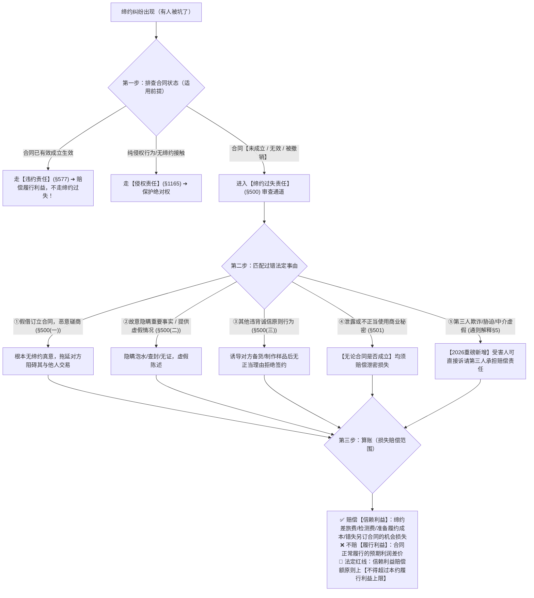

# 📐 缔约过失责任 · 完整答题模型（§500法定事由 · §501保密义务 · 通则解释§5第三人缔约责任 · 信赖利益赔偿）

> 🔗 **所属报告**：[[合同总则考点-深度报告]]（二、效力 · 第 10 考点 / 顶级必考第 6 项 · ★★★★★ 顶级必考）  
> 🎯 **适用真金题矩阵**：  
> - [[合同通则-单选-11 · 缔约过失责任之诚实信用原则理论基础案|单选-11 · 缔约过失理论基础与诚实信用原则案]]  
> - [[合同通则-单选-12 · 约定合同书未签未成立与恶意磋商缔约过失案|单选-12 · 约定合同书未签合同未成立与缔约过失案]]  
> - [[合同通则-单选-32 · 诱导制作样品后无故终止谈判缔约过失案|单选-32 · 诱导提供样品后无故放鸽子缔约过失案]]  
> - [[合同通则-单选-38 · 恶意磋商借机窃取并泄露商业秘密双重责任案|单选-38 · 假借磋商窃取泄露商业秘密双重责任案]]  
> - [[合同通则-多选-19 · 假借合作名义恶意磋商损害赔偿案|多选-19 · 假借合作恶意拖延导致错失商机赔偿案]]  
> ⚖️ **核心法源（2026最新）**：《中华人民共和国民法典》第7条、第157条、第500条、第501条、第149条、第150条；**《最高人民法院关于适用〈中华人民共和国民法典〉合同编通则若干问题的解释》（法释〔2023〕13号）第5条（第三人缔约过失责任与中介机构责任）**。

---

## 一、 【考点核心骨架与法理】（这个考点是什么）

缔约过失责任是《民法典》诚实信用原则在合同订立阶段的法定具象化制度，重点考核**“适用前提（四种状态）”**、**“法定事由（§500+§501）”**、**“第三人缔约责任新规（《通则解释》§5）”**以及**“信赖利益赔偿边界”**四大支柱：@!

---

### 1. 适用前提：合同状态与责任分流（三责任严格互斥） @!
- **违约责任（§577）**：前提必须是**合同已经有效成立并生效**，保护的是合同正常履行的**“履行利益（可得利益）”**；
- **缔约过失责任（§500）**：前提发生在**合同成立前磋商阶段**，或者导致**合同未成立、无效、被撤销**的状态，保护的是**“信赖利益”**；
- **侵权责任（§1165）**：保护民事主体的物权、人身权等绝对权利，无需缔约先合同义务。

- 三种责任概述

	- **违约责任** ✅前提：**存在生效有效的合同** 保护：**履行利益**（合同正常履行你本该拿到的好处） 例：买货对方不交货，你要货款、违约金。
	- **缔约过失责任** ✅前提：磋商阶段、**合同不成立 / 无效 / 被撤销**（合同死了，没有有效合同可用） 保护：**信赖利益**（你相信交易能做成，为此花出去的钱、遭受损失） 例：恶意骗你谈判，又恶意终止磋商；合同被撤销后，主张谈判产生的损失。
	- **侵权责任** ✅前提：**不需要合同关系**，侵害人身权、物权等固有权利 保护：固有利益（你的人身、财产本来就该拥有的权益） 例：交易过程把你打伤、毁坏你的财物

- 民法两大块：
	- **人身关系**：人格权、婚姻家庭、继承（跟钱、合同没关系
	- 财产关系
		- 物权、知识产权：你的东西归谁，属于**固有权利**，不是债权。
		- **债权**：主要四个来源：**合同、侵权、无因管理、不当得利**。

- 固有权利（固有利益）：你本来就自带就有的权利，不靠签合同才产生。合同只是用来帮你拿新好处（履行利益）；固有权利是你本来就拥有的人身、财产家底。
	1. **人格权（人身）**：生命、身体、健康、肖像、名誉、隐私等信丰县人民...
	2. **身份权**：配偶权、亲属权（婚姻家庭身份）人民论坛网
	3. **物权（财产）**：所有权、抵押权、质押权、居住权等信丰县人民...
	4. **知识产权**：著作权、专利权、商标权
	5. **股权、继承权**等

- 民法中的理论基础是
	- A **平等原则**：交易双方地位人格平等，跟磋商阶段赔损失没关系。 
	- B **公平原则**：利益风险大体均衡，不是缔约过失的来源。 
	- C **诚信原则（✅正确答案）**：谈判也要讲良心，产生先合同义务；恶意磋商、隐瞒事实，就要赔信赖利益，《民法典 500》直接依据这个原则抖音百科。 
	- D **自愿原则**：要不要签合同自己说了算，允许正常终止谈判，不是缔约过失基础。

---

### 2. 法定过失事由（《民法典》§500 + §501）
1. **假借订立合同，恶意磋商（§500(一)）**：根本没有缔约真实意图，假借谈判恶意拖延对方，以达到使对方错失商机、窃取商业秘密或扶持第三人的恶意目的；
2. **故意隐瞒重要事实或者提供虚假情况（§500(二)）**：在谈判中隐瞒标的物重大瑕疵（如房屋为凶宅/查封房、车辆为泡水车/事故车）或提供虚假资质证明；
3. **其他违背诚信原则的行为（§500(三)）**：诱导对方大额投资、租赁场地、打样制作样品后，无正当理由悍然中断谈判放鸽子；
4. **缔约保密义务（§501 · 考场独立考点）**：
   - 无论合同最终是否成立，对知悉的对方商业秘密或其他应保密信息，不得泄露或不正当使用；
   - 泄露或不正当使用造成损失的，依法承担损害赔偿责任。

---

### 3. ⭐⭐⭐⭐⭐ 2026 顶级新规：第三人缔约过失责任（《合同编通则解释》§5）
在现代商事交易与居间中，第三人（中介、评估机构、欺诈人）介入缔约引发损失，《通则解释》第5条确立了**重磅独立请求权机制**：
- **第三人直接赔偿责任**：第三人实施欺诈、胁迫行为，或者专业中介机构违背诚信提供虚假信息，导致合同不成立、无效或者被撤销，**受害人有权直接请求该第三人承担损害赔偿责任**；
- **按份与连带责任分担**：合同当事人与第三人均有过错的（如代理人与相对人串通吃回扣、出卖人明知中介欺诈而配合隐瞒），**根据各自过错大小承担相应的按份责任或者连带责任（§164Ⅱ）**；
- **⭐ 双轨救济区分（考场杀手锏）**：
  - 《民法典》第149条/第150条解决的是受害人**“能不能撤销与相对人的合同”**（相对人知情可撤销，相对人不知情不可撤销）；
  - 《通则解释》第5条解决的是受害人**“向第三人主张损害赔偿”**（不论合同撤不撤销，第三人均须为欺诈过错承担缔约赔偿！）。

---

### 4. 损失赔偿范围：信赖利益计算与红线限制
- **可赔偿范围（信赖利益）**：
  1. 缔约支出的必要费用（往返差旅费、通讯费、勘验费、招投标费用）；
  2. 为准备履行合同支出的合理费用（租用仓库、购买原材料、打样费）；
  3. **⭐ 丧失与第三人另行订立合同的“机会损失”**（因信赖该合同成立而拒绝了其他同类交易的合理利润损失）；
  4. 资金占用利息。
- **不可赔偿范围（履行利益）**：
  - ❌ **不赔偿合同正常履行后所能获得的预期利润/转售差价**（合同未有效成立，不存在履行利益请求权基础）。
- **⭐ 法定赔偿限额红线**：
  - 信赖利益的赔偿总额，**原则上不得超过合同有效成立时守约方可以获得的履行利益上限**（不能让受害人因合同未成立反而比正常履约赚得更多！）。

---

## 二、 【终极背诵通杀口诀 / 答题判断链】（考试怎么答题）

> ⭐ **【考场通杀背诵公式】**：
> 
> 🔹 **【缔约过失判定口诀】**：  
> **“合同有效走违约，合同没成走缔约；”**  
> **“恶意磋商装模作样、隐瞒虚假放鸽子，违背诚信要赔偿；”**  
> **“商业秘密白纸黑字，『成不成合同都得保密』(§501)；”**  
> **“第三人欺诈插一脚，受害人『直接找第三人赔』(解释§5)；”**  
> **“算账只赔信赖费（差旅机会加利息），绝不赔偿可得利润，上限不能超履行！”**

---

## 三、 【命题人最爱挖的 5 大暗坑】（避坑防错补丁）

在法考客观题选项中，出现以下特征表述直接判定为错误：

1. ❌ **暗坑 1（合同最终未成立，当事人彼此不承担任何法律责任）**：
   - 选项表述为“因合同书未经签字未成立，出卖人坐地起价拒签的行为不构成违约，亦无需承担任何赔偿责任” $\rightarrow$ **错误！**（合同未成立不影响依《民法典》§500 承担缔约过失赔偿责任）。
2. ❌ **暗坑 2（主张缔约过失赔偿转售差价等合同履行预期利润）**：
   - 选项表述为“买受人因对方恶意磋商导致合同未成，有权要求赔偿该批货物若正常买卖可获得的20万元转手利润” $\rightarrow$ **错误！**（缔约过失仅赔偿信赖利益与机会损失，不得赔偿本约履行利益）。
3. ❌ **暗坑 3（认为泄露商业秘密责任必须以主合同最终有效成立为前提）**：
   - 选项表述为“因双方合作谈判破裂合同未成立，甲公司泄露谈判中获悉的技术秘密不构成违约，无需担责” $\rightarrow$ **错误！**（《民法典》§501 明确规定“无论合同是否成立”，泄露商业秘密均承担赔偿责任）。
4. ❌ **暗坑 4（将第三人恶意磋商套用《通则解释》第5条）**：
   - 选项表述为“中介人假借订立合同与买方进行恶意磋商，构成第三人缔约责任” $\rightarrow$ **错误！**（恶意磋商的主体必须是**缔约当事人本人**；第三人仅对**欺诈、胁迫或违背诚信提供虚假信息**承担《通则解释》§5 的赔偿责任）。
5. ❌ **暗坑 5（因同一行为同时主张违约金与缔约过失赔偿）**：
   - 选项表述为“买方主张合同无效的同时，要求卖方依合同约定支付违约金并承担缔约过失赔偿” $\rightarrow$ **错误！**（违约金以合同有效为前提，合同无效只能依 §157/§500 走缔约过失与过错赔偿，二者互斥）。

---

## 四、 【真题矩阵实战演练与 100% 支撑验证】

| 真题卡片 | 核心考向 | 答题模型流水线支撑与秒杀定位 |
|---|---|---|
| **[[合同通则-单选-11 · 缔约过失责任之诚实信用原则理论基础案\|单选-11]]** | 缔约过失责任的理论基础与法源 | **核心骨架法理**：直接命中《民法典》§7 诚实信用原则先合同义务（秒杀 C）。 |
| **[[合同通则-单选-12 · 约定合同书未签未成立与恶意磋商缔约过失案\|单选-12]]** | 合同书未签未成立与坐地起价拒签 | **第一步适用前提 ➔ 第二步事由**：合同未成立不担违约责任，但坐地起价构成缔约过失（秒杀 D）。 |
| **[[合同通则-单选-32 · 诱导制作样品后无故终止谈判缔约过失案\|单选-32]]** | 诱导提供样品后无故放鸽子 | **第二步事由③ ➔ 第三步信赖利益**：违背诚信放鸽子，赔偿样品制作费等信赖利益（秒杀 B）。 |
| **[[合同通则-单选-38 · 恶意磋商借机窃取并泄露商业秘密双重责任案\|单选-38]]** | 假借合作窃取泄露商业秘密 | **第二步事由①+④**：假借磋商(§500) + 泄露商业秘密(§501)，不论合同成否均赔偿（秒杀 B）。 |
| **[[合同通则-多选-19 · 假借合作名义恶意磋商损害赔偿案\|多选-19]]** | 假借合作恶意拖延致错失商机 | **第二步事由① ➔ 第三步机会损失**：假借合作恶意磋商，赔偿因放弃其他签约的机会损失（秒杀 ACD）。 |

---

## 五、 相关页面

- 概念实体页：[[缔约过失责任]] · [[诚信原则]] · [[商业秘密]]
- 关联答题模型：[[民法-合同-成立与生效模型]] · [[民法-合同-合同无效模型]] · [[民法-合同-合同可撤销模型]] · [[民法-合同-预约合同模型]]
- 综合报告：[[合同总则考点-深度报告]]（二、效力 · 第 10 考点 / 顶级必考第 6 项）
