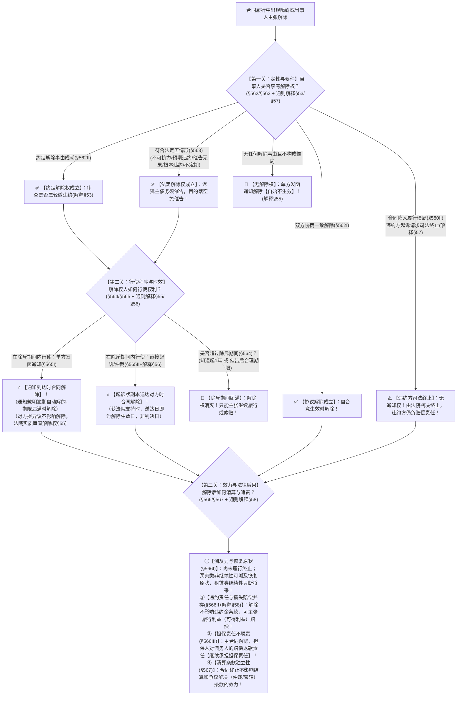

# 📐 合同解除 · 全流程答题模型（法定五情形 · 通知主义与诉讼时点 · 异议期废止 · 违约方司法终止 · 违约金并存 · 解释§53-§58）

> **教练开场白**
> 同学们好！我是你们的民法法考教练。在合同终止板块中，“合同解除”是**主客观题考查频率最高、最容易被命题人挖坑的超级核心大户**！
> 很多同学做解除的题目经常在以下五个关键点上“踩雷翻车”：对方稍微拖延了一两天能不能直接发函退货？发了解除通知对方三个月没吭声合同是不是就肯定解除了？直接起诉解除到底在立案那天、送达那天还是判决生效那天解除？违约的老赖能不能主动起诉要求解除合同？合同解除了还能不能要违约金？
> 《民法典》第 562–567 条与 2023 年《合同编通则司法解释》第 53–58 条，彻底重塑了解除制度，确立了**“实质解除权审查（废止3个月异议期）、通知到达/起诉状送达即解除、履行僵局司法终止、违约金与解除并存”**的现代化裁判规则。今天我们用**“三关连贯流水线”**，把解除权从哪来、怎么行使、何时生效与解除后怎么算账一次性彻底锁死：**第一关定性与要件（法定五情形 vs 违约方终止） → 第二关行使与程序（通知主义 vs 诉讼送达时点 vs 异议期废止） → 第三关效力与后果（溯及力区分 + 违约金并存 + 担保继续兜底）**。

---

## 适用场景与解决问题

本模型专门解决合同编总则终止板块中“合同解除与救济”的全部主客观题考点（对应 [[合同总则考点-深度报告]] 六·终止 row 1 · ★★★★★ 顶级必考）：重点破解：@!

1. **定性与解除权要件关**：
   - 严格区分**协议解除（§562Ⅰ 合意）**、**约定解除（§562Ⅱ 事由成就）**与**法定解除（§563 五大情形）**；
   - **《民法典》§563 顶级做题眼（口诀“天言拖死法”）**：区分 **③迟延主债务须催告** vs **④根本违约致目的落空免催告**；
   - **《通则解释》§57 违约方起诉解除合同（司法终止）**：合同陷入履行僵局（不能履行/费用过高），违约方起诉请求解除，法院判决终止但违约方仍须承担违约赔偿责任。
2. **行使程序与生效时点关**：
   - **《民法典》§565 通知生效主义**：解除通知到达对方时即发生解除效力（**无需先打官司！**）；
   - **《通则解释》§56 诉讼解除生效时点**：未通知直接起诉的，**自起诉状副本送达对方时生效（非判决生效日！）**；
   - **⭐《通则解释》§55 异议期废止与实质审查铁律**：彻底废止旧法 3 个月异议期！**没有解除权的一方即使发函、对方未提异议，合同亦绝对不发生解除效力！**
   - **《民法典》§564 除斥期间**：知道起 1 年或经催告后合理期限内行使，过期解除权消灭。
3. **效力与违约金赔偿关**：
   - **《民法典》§566 法律后果与溯及力**：尚未履行的终止履行，已履行的根据履行情况与合同性质（非继续性买卖有溯及力恢复原状，继续性租赁不溯及只断将来）；
   - **《通则解释》§58 解除与违约金并存**：合同解除后，**违约金条款依然有效**，守约方可主张履行利益赔偿（可得利益损失）；
   - **《民法典》§566Ⅲ 担保兜底**：主合同解除后，**担保人对债务人承担的民事责任仍须承担担保责任**；
	   - 合同解除，活不用干了；但该退该赔的钱跑不掉，担保人继续为这笔钱兜底。
   - **《民法典》§567 独立性**：结算和争议解决（仲裁/管辖）条款继续有效。
	   - 合同解除、到期终止之后：
		- 原本的核心义务（交货、干活、付款）废掉，不用再履行；
		- 但是两类条款不会跟着作废，**独立继续生效**：
			1. **结算清理条款**：怎么算账、怎么退钱、违约金怎么算、怎么清算收尾；
			2. **争议解决条款**：约定去哪起诉、去哪仲裁。
 		哪怕合同已经废掉，双方算账、打官司，依旧按原来合同写的这套规则来。

> **核心一句**：**天言拖死法五情形（拖要催告，死免催告）；通知到达即解除，直接起诉送达那天解；异议期废止看实质解除权（没权利发信不算数）；僵局违约方可求司法终止但仍要赔；解除溯及看性质，违约金与赔偿并存，担保接着兜底，仲裁条款继续管！**
>
> 🔎 **核心法源（2026最新）**：《民法典》§562、§563、§564、§565、§566、§567、§580；**《最高人民法院关于适用〈中华人民共和国民法典〉合同编通则若干问题的解释》（法释〔2023〕13号）第53条（约定事由审查）、第54条（法定解除催告）、第55条（异议期废止与实质审查）、第56条（诉讼解除生效时点）、第57条（违约方司法解除）、第58条（解除后违约金与损失赔偿）**。


- **合同没写，法律直接规定，出现这几类情况，守约方拿到解除权：**
	1. 不可抗力导致合同目的落空
	2. 预期违约（到期前明确不履行主要债务）
	3. 迟延主债务，催告后合理期限仍不履行
	4. 根本违约，合同目的直接落空
	5. 法律特别规定（分期付款、承揽、不安抗辩后的解除等）


---

## 💡 【前置认知】合同解除四大形态与废止旧法异议期总纲

### 1. 合同解除四大形态极速对照表

| 解除形态 | 触发要件与法律依据 | 行使方式与程序 | 法律效力与责任承担 |
| :--- | :--- | :--- | :--- |
| **① 协议解除** | 当事人协商一致，达成合意解除原合同（《民法典》§562Ⅰ） | 双方订立解除协议 | 自协议成立生效时解除，依协议结算 |
| **② 约定解除** | 合同约定的解除事由发生（《民法典》§562Ⅱ + 解释§53） | 解除权人发通知或起诉 | 通知到达或诉状副本送达时解除；轻微违约排除约定解除 |
| **③ 法定解除** | 出现《民法典》§563 五大法定情形（天言拖死法） | 解除权人发通知或起诉 | 通知到达或诉状副本送达时解除；守约方可并请赔偿损失与违约金 |
| **④ 违约方起诉解除<br>（司法终止）** | 合同陷入履行僵局（非金钱债务不能履行/履行费用过高，《民法典》§580Ⅱ + 解释§57） | **必须通过诉讼/仲裁由法院判决解除**（违约方无单方通知解除权！） | 自判决生效或指定时点终止；**违约方仍须承担全部违约责任与损害赔偿** |

---

### 2. ⭐⭐⭐⭐⭐ 2026 法考核心命题红线：废止旧法“3个月异议期”

```
【旧法旧规（已彻底废止❌）】
原《合同法解释二》第24条：一方发了解除通知，对方有异议必须在约定/法定3个月内起诉，逾期未起诉的，哪怕发信人没有解除权，合同也自动解除。
                                      ⬇️ 2023《通则解释》§55 彻底推翻！
【2026 现行新规（实质审查铁律✅）】
《合同编通则解释》第55条：一方不享有解除权而发出解除通知，即使相对人未在异议期限或合理期限内提出异议，该通知【亦不发生解除合同的法律效力】！法院必须实质审查当事人是否真正享有法定/约定解除权！
```

---

## 一、 考点核心骨架与法理（三关连贯决策树）



```
【合同解除纠纷】一句话开场：能不能解？怎么发信起诉？解了之后违约金还能不能要？
│
▼ 第一关 · 定性与要件 ── 解除权从哪来（§562/§563 + 解释§53/§57）
├─ 协议解除（§562Ⅰ）：双方商量好退场 ──────────────────────────────────→ ✅ 依合意生效即解除
├─ 约定解除（§562Ⅱ）：合同约定的解除事由发生（排除轻微违约）────────────→ ✅ 约定解除权成立
├─ 法定解除（§563 · 口诀“天言拖死法”）：
│    ├─ ①【天】不可抗力致合同目的不能实现 ────────────────────────────→ 免催告，直接解
│    ├─ ②【言】履行期届满前明示/行为表明不履行主要债务（预期违约）────────→ 免催告，直接解
│    ├─ ③【拖】迟延履行主要债务，【经催告后】合理期限内仍未履行 ──────────→ ⚠️ 必须先催告！
│    ├─ ④【死】迟延履行或其他违约行为【致合同目的不能实现】（根本违约）──→ 免催告，直接解
│    └─ ⑤【法】持续性履行的不定期合同（不定期租赁/供电等）────────────────→ 随时通知任意解除
└─ 违约方起诉解除（司法终止 · §580Ⅱ + 解释§57）：履行陷入僵局 ──────────→ ⚠️ 无通知权！由法院判决终止+负违约责任
     │
     ▼ 第二关 · 行使程序与时效 ── 通知主义、送达时点与异议期废止（§564/§565 + 解释§55/§56）
     ├─ 除斥期间（§564）：知道或应当知道起【1 年内】，或经催告后合理期限内（不可中断中止）
     ├─ 通知主义（§565Ⅰ）：发函通知对方，【通知到达对方时】合同即发生解除效力（无需先打官司！）
     ├─ 诉讼解除时点（解释§56）：未通知直接起诉并获支持的，【起诉状副本送达对方时】合同解除！
     └─ ⭐ 异议期废止（解释§55）：无解除权发函【自始无效】；对方未异议法院仍实质审查，无权利则不解除！
          │
          ▼ 第三关 · 效力与法律后果 ── 溯及力区分、违约金并存与担保继续（§566/§567 + 解释§58）
          ├─ 溯及力与恢复原状（§566Ⅰ）：买卖类有溯及力（退钱退货）；租赁类继续性无溯及力（只断将来）
          ├─ ⭐ 违约金与赔偿并存（§566Ⅱ + 解释§58）：主合同解除【不影响违约金条款】，可索赔可得利益！
          ├─ 担保责任继续兜底（§566Ⅲ）：主合同解除后，担保人对债务人的清算赔偿责任【继续承担担保责任】！
          └─ 结算与争议解决独立（§567）：合同终止【不影响仲裁与管辖条款效力】！

  ━━━ 三关全过 ━━━
```

---

## 二、 核心考情

- **频次研判**：合同解除命中**全部 6 类权威源族（最高法案例+司法解释+王利明论文+法院培训PDF+法大清单+机构高频）的顶级必考考点（★★★★★ 顶级必考）**；每年客观题必考 1–2 题，主观题第二问几乎必考“合同是否解除、何时解除、能否索赔违约金”。
- **命题核心**：
  1. **法定解除五情形（§563）**：迟延履行主要债务**必须先催告**（③）；根本违约导致目的落空**无需催告直接解**（④）。
  2. **通知到达即解除（§565）**：解除通知到达时生效，无需先经法院判决。
  3. **诉讼解除生效时点（解释§56）**：直接起诉解除的，**自起诉状副本送达时解除**，不是立案日也不是判决生效日！
  4. **异议期废止（解释§55）**：彻底废止旧法 3 个月规则，无解除权的发通知不生效。
  5. **解除与违约金并存（§566 + 解释§58）**：解除合同不影响违约金条款，主张解除的同时有权全额索赔违约金和履行利益损失。
  6. **担保人继续兜底（§566Ⅲ）**：主合同解除不免除担保人的担保责任。

---

## 三、 三大核心法理与命题陷阱拆解

### 1. 法定解除五大情形与“催告”规则界分（《民法典》§563）

| 解除情形（口诀：天言拖死法） | 法定构成要件 | 要不要先发催告函？ | 典型考场陷阱 |
|---|---|---|---|
| **①【天】不可抗力** | 因不可抗力致使**不能实现合同目的** | ❌ **免催告**（目的已死） | ❌ 误以为只要发生不可抗力就能解（须达到“目的落空”程度！）。 |
| **②【言】预期违约** | 履行期届满前，一方**明示或以行为表明**不履行主要债务 | ❌ **免催告**（明确拒绝） | ❌ 误以为必须等到履行期届满才能解（可立即通知解除！）。 |
| **③【拖】迟延主债务** | 一方迟延履行主要债务，**经催告后在合理期限内仍未履行** | ⚠️ **必须先催告！** | ❌ 误以为对方一迟延就能直接发函解除（必须先给宽限催告期！多选-13）。 |
| **④【死】根本违约** | 迟延履行债务或者有其他违约行为**致使不能实现合同目的** | ❌ **免催告**（目的已落空） | ❌ 误以为根本违约也必须催告（只要目的不能实现，直接解！多选-16）。 |
| **⑤【法】持续性不定期合同** | 不定期租赁、供电供水等持续履行的不定期合同 | ❌ **免催告**（享有任意解除权） | 提前合理期限通知对方即可解除。 |

### 2. 解除程序、生效时点与异议期废止（《民法典》§564/§565 + 《通则解释》§55/§56）

| 审查维度 | 法律规则与司法认定（2026最新） | 命题陷阱 |
|---|---|---|
| **通知生效主义（§565Ⅰ）** | 解除权人发出通知，**自通知到达对方时发生解除效力**。 | ❌ 误以为解除必须先打官司起诉经法院同意（多选-16）。 |
| **诉讼解除生效时点（解释§56）** | 未通知直接起诉请求解除的，法院判决支持时，**自起诉状副本送达对方时发生解除效力**！ | ❌ 误以为自起诉立案之日或判决生效之日起解除。 |
| **⭐ 异议期彻底废止（解释§55）** | **实质审查原则**：无解除权一方发出解除通知，即使相对人未在异议期内起诉提出异议，**该通知亦绝对不发生解除效力**！ | ❌ 误套旧法“3个月未异议合同自动解除”的废止规则。 |
| **除斥期间（§564）** | 知道起 **1 年**，或经对方催告后在合理期限内行使；逾期解除权消灭。 | ❌ 误以为是诉讼时效（除斥期间不可中断中止）。 |

### 3. 解除后的法律后果、违约金并存与担保责任（《民法典》§566/§567 + 《通则解释》§58）

| 规则维度 | 法律规则与深度法理（2026最新） | 做题核心眼 |
|---|---|---|
| **溯及力与恢复原状（§566Ⅰ）** | ① **非继续性合同（买卖/赠与）**：有溯及力，尚未履行的终止，已履行的**恢复原状（退钱退货）**；<br>② **继续性合同（租赁/雇佣/物业）**：无溯及力，**只向将来终止**（已享受的服务不退）。 | 租赁合同解除不退之前的租金，只终止以后的租期。 |
| **⭐ 违约金与赔偿并存（§566Ⅱ+解释§58）** | 因违约解除合同的，**解除权人可以请求违约方支付违约金或赔偿可得利益损失**！ | ❌ 误以为合同解除后违约金条款随之失效（违约金条款继续有效！）。 |
| **担保人继续兜底（§566Ⅲ）** | 主合同解除后，**担保人对债务人承担的民事责任（退款、赔偿）仍应当承担担保责任**（担保合同另有约定除外）。 | ❌ 误以为主合同解除担保人就脱责（担保正好兜底违约清算责任！）。 |
| **结算与仲裁条款独立（§567）** | 合同权利义务终止，**不影响合同中结算和清理条款、仲裁条款的效力**。 | 合同解除后照样可以依原合同仲裁条款申请仲裁。 |

---

## 四、 万能解题三步

---

### 第一步：定性与要件关 —— 能不能解？有无解除权？（《民法典》§562/§563 + 解释§53/§57）

> **教练提示**：先看题干中当事人主张解除的依据是什么：
> 1. 是双方商量退场（协议解除 §562Ⅰ）还是合同约定的条件触发（约定解除 §562Ⅱ，排除轻微违约）；
> 2. 如果是违约引起，立刻套用**法定五情形（天言拖死法）**：重点看是**“一般迟延（走③，必须有催告宽限期）”**还是**“根本违约（走④，目的落空无需催告直接解）”**；
> 3. 如果是违约方陷入履行僵局起诉，走《通则解释》§57 司法终止通道（违约方无通知权，法院判决终止且仍负赔偿）。

---

#### 1. 【核心法定体系】解除权来源与实质要件决策架构

```
                        【当事人主张解除合同】
                                    │
    ┌───────────────────────────────┼───────────────────────────────┐
    ▼                               ▼                               ▼
【协议解除（§562I）】           【约定解除（§562II）】          【法定解除（§563 天言拖死法）】
（双方达成解除合意）            （约定事由成就，排除轻微违约）  （法定事由成就）
        │                               │                               │
├─ 双方签字即解除               ├─ 发函通知或起诉解除           ├─ ①【天】不可抗力毁目的 ➔ 免催告
└─ 按协议约定清算               └─ 限制：轻微违约不可约定解除   ├─ ②【言】明示/行为预期违约 ➔ 免催告
                                                                ├─ ③【拖】迟延主债务 ➔ ⚠️ 必须催告合理期！
                                                                ├─ ④【死】根本违约致目的落空 ➔ 免催告直接解！
                                                                └─ ⑤【法】持续性不定期合同 ➔ 随时任意解除
```

---

#### 2. 先懂几个词
- **预期违约（§563②）**＝交货期还没到，对方就发朋友圈宣布“我不卖了/我已经把货卖给别人了”，守约方不用等到交货那天，现在就能立即发函解除；
- **迟延主债务经催告（§563③）**＝交货期过了对方没交货，守约方必须先发催告函“限你 15 天内必须送达”，15 天过了对方还没动静，此时才享有解除权；
- **根本违约致目的落空（§563④）**＝定做中秋节月饼，中秋节过了才送来；或者买的新车发动机自始报废，合同目的彻底完蛋，**根本无需催告，直接发函解除**；
- **违约方司法终止（解释§57）**＝租了 20 年商铺经营不下去了，合同陷入僵局，承租人（违约方）不能自己发函解除，但可以起诉请求法院判决终止合同，同时承担违约金和赔偿。

---

#### 3. 🔍 对号入座表：解除权定性与审查标准全景表

| 案情事实与违约特征 | 解除权定性 | 法定要件与程序路径 | 考场秒杀结论 |
| :--- | :--- | :--- | :--- |
| 台风暴雨摧毁露天婚礼场地，婚礼无法如期举行 | **法定解除（不可抗力）** | 《民法典》§563①<br>（**目的不能实现，免催告**） | ✅ 享有解除权，直接通知解除（多选-13） |
| 约好 9/1 交货，8/15 卖方明确发函告知“已转卖他人” | **法定解除（预期违约）** | 《民法典》§563②<br>（**明示不履行，免催告**） | ✅ 守约方享有即时解除权 |
| 承建方工程逾期，发包方催告给予 15 天宽限期仍未完工 | **法定解除（催告无果）** | 《民法典》§563③<br>（**迟延履行 + 催告程序齐备**） | ✅ 宽限期满享有解除权（多选-13） |
| 出卖人交付的机床存在毁灭性缺陷无法开机修复 | **法定解除（根本违约）** | 《民法典》§563④<br>（**目的落空，免催告**） | ✅ 无需催告，直接发函解除（多选-16） |
| 承租人仅迟延支付 1 天租金，出租人直接发函退租 | **无解除权（轻微违约）** | 《通则解释》§53/§54<br>（**未达严重程度且未经催告**） | 🚨 无解除权，发函通知自始不发生解除效力！ |

---

### 第二步：程序与时效关 —— 怎么解？过期没？（《民法典》§564/§565 + 解释§55/§56）

> **教练提示**：
> 1. **除斥期间（§564）**：解除权必须在**知道起 1 年内**或催告后合理期限内行使，过期解除权消灭（不可中断中止）；
> 2. **通知即解除（§565）**：有解除权的一方发函，**通知到达对方时合同当场解除**（无需先打官司！）；
> 3. **诉讼解除时点（解释§56）**：直接起诉解除的，**起诉状副本送达对方之日即为解除生效日**；
> 4. **异议期废止（解释§55）**：对方没提出异议，法院**依然要实质审查发函人到底有没有解除权**！没权利的发函一律无效！

---

#### 1. 🔍 对号入座表：解除程序与生效时点全景对照表

| 行使解除权的具体方式 | 合同解除生效的时间节点 | 法律依据（《民法典》+《通则解释》） | 命题陷阱 |
| :--- | :--- | :--- | :--- |
| **向相对人邮寄《解除合同通知书》** | **通知送达到达相对人之日** | 《民法典》§565Ⅰ | ❌ 误以为必须向法院起诉判决才解除（多选-16） |
| **通知载明“限10日内履行，逾期合同自动解除”** | **10日期限届满相对人未履行之日** | 《民法典》§565Ⅰ | 自动附期限解除条件成就 |
| **未发通知，直接向法院起诉请求解除合同** | **起诉状副本送达被告之日** | **《通则解释》第 56 条** | ❌ 误以为立案之日或判决生效之日解除 |
| **一方无解除权发出通知，对方超 3 个月未异议** | **【合同不发生解除效力】（自始有效）** | **《通则解释》第 55 条** | ❌ 误套旧法“逾期未异议自动解除”的废止规则 |

---

#### 2. 💰 完整数字案例：解除时点与异议期废止攻防实战

> **【案情（多选-16 变形精解）】**
> 甲公司向乙公司订购一台价值 200 万元的特种设备，合同约定 5月1日 交付。5月1日 乙交付的设备核心主板烧毁且无法维修，导致甲公司的生产线全线停滞（根本违约致目的落空）。
> - **路径 A（通知解除）**：甲公司于 5月5日 向乙公司寄出《解除合同通知书》，乙公司于 **5月8日** 签收。
>   - 裁判涵摄：甲享有 §563④ 根本违约法定解除权；依据《民法典》§565Ⅰ，合同于通知到达的 **5月8日当场解除**！乙公司即使不服提出异议，也不影响 5月8日 已发生的解除效力。
> - **路径 B（诉讼解除）**：甲公司未发通知，直接于 5月10日 向法院起诉解除合同，法院于 **5月15日** 将起诉状副本送达乙公司，法院于 7月1日 判决支持甲公司的解除请求。
>   - 裁判涵摄：依据《通则解释》第 56 条，合同解除生效的时间为 **5月15日（起诉状副本送达之日）**，而非 7月1日（判决生效日）！

---

### 第三步：效力与后果关 —— 解除之后怎么算？（《民法典》§566/§567 + 解释§58）

> **教练提示**：合同解除后的算账四铁律必须倒背如流：
> 1. **溯及力与恢复原状**：非继续性合同（买卖）退钱退货回到原点；继续性合同（租赁/物业）不退之前的钱，只断将来；
> 2. **违约金与赔偿并存（解释§58）**：解除合同**绝不影响违约金条款**，守约方可以同时要求解除合同并支付全额违约金/可得利益损失！
> 3. **担保人继续担保（§566Ⅲ）**：主合同解除，原担保人对老赖应承担的退款和赔偿责任**继续承担担保责任**！
> 4. **仲裁管辖条款独立（§567）**：合同终止后，原合同的仲裁条款依然完全有效。

---

#### 1. 🔍 对号入座表：解除后法律效果与清算责任全景表

| 法律后果维度 | 正确法律规则与司法标准 | 考场核心做题眼 |
| :--- | :--- | :--- |
| **尚未履行的债务** | **终止履行**（无需再继续履行主给付义务） | 双方向前停止履行 |
| **已经履行的给付** | 根据履行情况与性质，**请求恢复原状或采取补救措施** | 买卖类返还财产退款；租赁类结清租金 |
| **违约金与损失赔偿** | **合同解除与违约金/赔偿损失并存**（解释§58） | ❌ 误以为解除后不能主张违约金或可得利益 |
| **担保责任延续** | **主合同解除，担保人仍承担担保责任**（§566Ⅲ） | ❌ 误以为主合同解除担保人免责（担保接着兜底！） |
| **仲裁与管辖条款** | **不影响合同中结算、清理与争议解决条款效力**（§567） | 解除后依然按原合同仲裁条款仲裁解决纠纷 |

#### 一句话闭环记忆
> 🎯 **一眼判**：**天言拖死法（拖要催告，死免催告）；通知到达即解除，诉讼送达那天解；异议期废止看实质权利；解除溯及看性质，违约金与赔偿并存，担保人接着兜底，仲裁条款继续管！**

---

## 五、 案例演练

### 1. 法定解除五情形定性与催告要件（[[合同通则-多选-13]]）
- **案情**：问下列哪些情形甲方有权解除合同：A.大风暴雨摧毁婚礼场地 B.乙方明确表示不履行主要债务 C.乙方工程延期经催告后仍未完工 D.乙方承租商铺长期闲置。
- **模型分析**：第一步——A 属于不可抗力致目的落空（§563①）；B 属于明示预期违约（§563②）；C 属于迟延主债务经催告在合理期限内仍未履行（§563③），均享有法定解除权；D 仅闲置未致租赁物受损，不构成 §711 解除事由（选 ABC）。

### 2. 根本违约解除程序与通知主义（[[合同通则-多选-16]]）
- **案情**：乙方根本违约致合同目的落空，甲方主张解除合同。问相关程序表述。
- **模型分析**：第一步与第二步——根本违约甲方享有法定解除权（A对）；依据《民法典》§565 通知主义，通知到达即解除，无需先经诉讼（B错）；对方有异议可诉请确认解除效力（C对）；合同解除与损害赔偿并存（§566，D对，选 ACD）。

### 3. 公用事业合同能中止供热不能擅自解除（[[典型合同-多选-24]]）
- **案情**：用户拖欠供热费，供热公司直接发函解除供热合同。
- **模型分析**：第一步——供热、供电等公用事业合同关乎民生，具有强制缔约与持续履行属性；用户欠费经催告供热方可中止供热，但**一般不得径行解除合同**（考查中止履行 vs 解除合同边界）。

### 4. 诉讼解除生效时点判定（《通则解释》§56 实战演练）
- **案情**：甲买房，开发商延期交房致目的落空。甲于 6月1日 起诉解除，起诉状副本于 6月5日 送达开发商，法院于 8月1日 判决解除合同。问合同何时解除？
- **模型分析**：第二步——甲享有法定解除权，未通知直接起诉的，依据《通则解释》第 56 条，合同自**起诉状副本送达之日（6月5日）解除**（而非 8月1日 判决日）。

### 5. 异议期废止与实质审查（《通则解释》§55 实战演练）
- **案情**：出租人因承租人迟延交租 1 天（轻微违约），直接发函解除租约。承租人收到后 4 个月未予理睬亦未起诉。出租人主张超 3 个月未异议合同已解除。
- **模型分析**：第一步与第二步——出租人无约定或法定解除权；依据《通则解释》第 55 条实质审查铁律，旧法 3 个月规则彻底废止，出租人无解除权发出通知**自始不发生解除效力**，合同继续有效！

---

## 关联真题

- [[合同通则-多选-13]] · 法定解除权五大情形（天言拖死法）与催告要件
- [[合同通则-多选-16]] · 根本违约解除程序（通知到达即解 + 违约赔偿并存）
- [[合同通则-多选-27]] · 限购政策导致购房合同目的不能实现的不可抗力解除
- [[合同通则-单选-23]] · 迟延履行主要债务经催告后解除权成立判定
- [[合同通则-单选-56]] · 约定解除事由成就与通知生效时点
- [[典型合同-多选-16]] · 标的物质量严重不符买受人拒收与合同解除
- [[典型合同-多选-24]] · 公用事业供热合同欠费之中止履行与解除限制

## 相关页面

- 概念实体页：[[解除]] · [[合同权利义务终止]] · [[违约责任]] · [[除斥期间]]
- 上位调度模型：[[民法-合同-违约责任模型]]（违约救济总入口） · [[民法-合同-情势变更模型]]（司法变更/解除）
- 综合报告：[[合同总则考点-深度报告]]（六、终止 · 第 1 考点 / 顶级必考第 14 项 · ★★★★★ 顶级必考）
