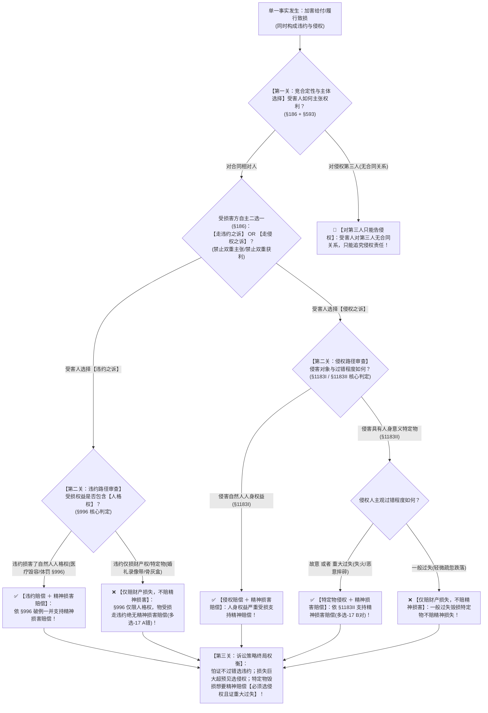

# 📐 违约与侵权责任竞合及精神损害赔偿 · 全流程答题模型（§186 择一适用 · §996 违约附带人格权精神赔偿 · §1183 侵权纪念物故意重大过失 · 择诉四把尺）

> **教练开场白**
> 同学们好！我是你们的民法法考教练。在民法跨编综合考查中，“违约与侵权责任竞合”是**横跨总则编（§186）、合同编（§577/§584）、人格权编（§996）与侵权责任编（§1165/§1183）的超级压轴大户**！
> 很多同学做责任竞合题目时，往往一知半解：以为违约了就绝对不能要精神抚慰金，或者以为任何东西烧毁了都能主张精神损害赔偿，再或者以为可以既要违约金又要侵权损害赔偿。
> 《民法典》全面确立了**以“单一事实生双权、权利人自主二选一（§186）、违约损害人格权破例准许精神损害赔偿（§996）、侵权特定纪念物故意或重大过失才赔精神损害（§1183Ⅱ）”为核心的大一统裁判规则**。今天我们用**“三关连贯流水线”**，把竞合定性、精神损害双轨分流与诉讼策略权衡一次性彻底锁死：**第一关定性与择一（单一行为生双权 + 受损方二选一禁双收） → 第二关精神损害双轨分流（走违约看 §996 人格权 vs 走侵权看 §1183 纪念物故意重过失） → 第三关诉讼利益终局权衡（举证难易 vs 可预见封顶 vs 管辖便利）**。

---

## 适用场景与解决问题

本模型专门解决加害给付、婚庆录像带毁损、医疗美容毁容、缺陷产品致损等违约与侵权竞合案件的责任定性、诉讼请求选择与精神损害赔偿适用范围全部主客观题考点（对应 [[合同总则考点-深度报告]] 七·违约责任 row 7 · ★★★★ 重点考点）：重点破解：

1. **责任竞合认定与择一选择关（《民法典》§186）**：
   - **竞合要件**：单一事实行为同时违反合同义务（违约）并侵害受害人的固有权益（人身/财产侵权）；
   - **受损害方择一行使**：由受损害方**自主选择主张违约责任或者侵权责任**，**严禁双重主张、禁止双重获利**；
   - **第三人责任区分（§593）**：因第三人原因导致违约的，守约方对合同相对人主张违约责任；对第三人只能主张**侵权责任**（无合同关系）。
2. **精神损害赔偿双轨破局关（《民法典》§996 vs §1183）**：
   - ⭐ **违约之诉附带精神损害赔偿（《民法典》§996 · 人格权编突破）**：因违约行为**损害对方人格权**并造成严重精神损害的，受损害方选择请求违约责任的，**不影响其请求精神损害赔偿**！（限自然人人格权，一般财产权受损不得走 §996）；
   - ⭐ **侵权之诉精神损害赔偿（《民法典》§1183）**：
     - ① **人身权益（§1183Ⅰ）**：侵害自然人人身权益（生命、身体、健康、姓名、肖像、名誉、隐私）造成严重精神损害；
     - ② **具有人身意义的特定物（§1183Ⅱ · 纪念物）**：因**故意或者重大过失**侵害自然人具有人身意义的特定物（遗物、结婚录像带、祖传唯一字画、骨灰盒）造成严重精神损害；⚠️ **一般过失不予赔偿精神损害**！
3. **违约 vs 侵权择诉权衡四把尺**：
   - **举证难度**：违约（严格责任 §577，不看过错）优于侵权（过错责任 §1165，须证过错）；
   - **赔偿范围**：侵权（赔偿全部实际固有损失）优于违约（受 §584 可预见规则封顶）；
   - **管辖便利**：违约（合同履行地/被告住所地） vs 侵权（侵权行为地/被告住所地）。

> **核心一句**：**一事生两权，原告二选一；违约想要精神赔，必须损害人格权（§996）；侵权想要精神赔，人身权益或故意重过失毁特定纪念物（§1183）；一般过失毁纪念物，两条路都要不到！**@!
>
> 🔎 **核心法源（2026最新）**：《民法典》§186（责任竞合）、§996（违约精神损害赔偿）、§1183（侵权精神损害赔偿）、§577（违约责任）、§584（损害赔偿与可预见）、§593（第三人原因）、§1165（侵权过错责任）。

---

## 💡 【前置认知】违约之诉 vs 侵权之诉全景决策对比表与精神损害双轨分流表

### 1. 违约之诉 vs 侵权之诉全景决策对比表

| 比较维度 | 🛡️ 违约之诉（走合同编路径） | ⚖️ 侵权之诉（走侵权责任编路径） | 考场做题选择秘诀 |
| :--- | :--- | :--- | :--- |
| **法条依据** | 《民法典》§577 起（合同编第八章） | 《民法典》§1165 起（侵权责任编） | §186 在总则编，负责总调度 |
| **归责原则** | **严格责任（无过错责任 §577）** | **过错责任为原则（§1165Ⅰ）** / 法定无过错 | 证不出对方过错 $\rightarrow$ 选违约 |
| **举证责任** | 原告只需证明**合同关系 + 违约事实 + 损失** | 原告原则上须证明**侵权行为 + 过错 + 因果 + 损失** | 举证压力违约极小 |
| **赔偿范围** | 赔偿履行利益，**受可预见规则限制（§584）** | 赔偿全部直接固有损失，**不受可预见限制** | 损失巨大超预期 $\rightarrow$ 选侵权 |
| **精神损害赔偿** | ⭐ **仅限损害“人格权”（§996）** | **人身权益（§1183Ⅰ）+ 特定物故意重过失（§1183Ⅱ）** | 毁损特定纪念物 $\rightarrow$ 选侵权 |
| **诉讼时效** | **3 年（§188）** | **3 年（§188）** | ⚠️ 时效完全相同，别臆造差异 |
| **管辖法院** | 合同履行地 / 被告住所地 | 侵权行为地 / 被告住所地 | 看哪个法院起诉更便利 |

---

### 2. ⭐⭐⭐⭐⭐ 精神损害赔偿请求权“双轨三大边界”极速判定表

```
                              【精神损害赔偿主张】
                                       │
            ┌──────────────────────────┴──────────────────────────┐
            ▼                                                     ▼
   【🛡️ 走违约之诉（§996）】                             【⚖️ 走侵权之诉（§1183）】
   （因违约造成严重精神损害）                               （因侵权造成严重精神损害）
            │                                                     │
    ┌───────┴───────┐                                     ┌───────┴───────┐
    ▼               ▼                                     ▼               ▼
【侵害人格权】   【侵害特定物/财产权】                  【侵害人身权益】   【侵害具有人身意义特定物】
（美容毁容/体罚） （录像带/骨灰盒/遗物）                （身体/名誉/隐私）  （结婚录像/祖传唯一字画/遗物）
    │               │                                     │               │
    ▼               ▼                                     ▼       ┌───────┴───────┐
  ✅ 支持！        ❌ 不支持！                            ✅ 支持！       ▼               ▼
(§996破例准许)  (纯财产物损不赔精神)                     (§1183I)  【故意/重大过失】 【一般过失】
                                                                      │               │
                                                                      ▼               ▼
                                                                   ✅ 支持！        ❌ 不赔！
                                                                  (§1183II)     (一般过失不赔精神)
```

| 请求路径 | 侵害对象 / 权益形态 | 主观过错要件要求 | 精神损害赔偿能否得到支持？ | 权威依据 |
| :--- | :--- | :--- | :--- | :--- |
| **违约之诉** | **自然人人格权**（身体、健康、名誉、肖像） | 不看过错程度 | ✅ **支持精神损害赔偿** | 《民法典》§996 |
| **违约之诉** | **财产权益 / 具有人身意义的特定物** | 任何过错均不赔 | ❌ **绝对不支持精神损害赔偿** | §996 限人格权（多选-17） |
| **侵权之诉** | **自然人人身权益** | 一般过错即可 | ✅ **支持精神损害赔偿** | 《民法典》§1183Ⅰ |
| **侵权之诉** | **具有人身意义的特定物**（结婚录像/骨灰盒） | **故意 或者 重大过失** | ✅ **支持精神损害赔偿** | 《民法典》§1183Ⅱ |
| **侵权之诉** | **具有人身意义的特定物**（结婚录像/骨灰盒） | **一般过失（轻微过失）** | ❌ **不予赔偿精神损害！** | 《民法典》§1183Ⅱ 但书 |
| **两诉皆无** | **普通财产权**（一般汽车/普通手机/电视） | 任何过错 | ❌ **一律不赔精神损害！** | 纯财产损害不赔精神 |

---

## 一、 考点核心骨架与法理（三关连贯决策树）



```
【责任竞合与精神损害全景】一句话开场：一个行为犯两法，原告二选一；违约想要精神赔只看人格权，特定物侵权看故意重过失！
│
▼ 第一关 · 竞合定性与主体选择 ── §186 择一不并用
├─ 对合同相对人（既违约又侵权）：────────────────────────────────→ ⚖️【受害人自主二选一】（选违约 OR 选侵权，严禁双收）
└─ 对致损第三人（无合同关系）：──────────────────────────────────→ 🚨【只能主张侵权责任】（无合同不能告违约 §593）
     │
     ▼ 第二关 · 精神损害双轨分流 ── §996 人格权 vs §1183 纪念物
     ├─ 选择了【违约之诉】：
     │    ├─ 损害自然人【人格权】（医疗毁容/伤害身体）：────────────→ ✅ 依《民法典》§996【破例支持精神损害赔偿】！
     │    └─ 损害【财产权益 / 具有人身意义特定物】（录像带/字画）：──→ ❌【绝不支持精神损害赔偿】（§996 限人格权 多选-17）
     │
     └─ 选择了【侵权之诉】：
          ├─ 侵害自然人【人身权益】（生命/健康/名誉/隐私 §1183Ⅰ）：─→ ✅【全额支持精神损害赔偿】
          └─ 侵害【具有人身意义的特定物】（结婚录像/骨灰盒/遗物 §1183Ⅱ）：
               ├─ 侵权人系【故意 或 重大过失】（抽烟失火/恶意损毁）：──→ ✅【支持精神损害赔偿】（多选-17 B对）
               └─ 侵权人系【一般过失】：─────────────────────────────→ ❌【不赔精神损害】（仅赔财产价值）
                    │
                    ▼ 第三关 · 诉讼策略终局抉择 ── 择诉四把尺
                    ├─ 尺 1（举证难易）：证不出对方过错 $\rightarrow$ 选【违约之诉】（严格责任不问过错 §577）
                    ├─ 尺 2（赔偿封顶）：损失巨大超出订约预见 $\rightarrow$ 选【侵权之诉】（不受 §584 可预见限制）
                    ├─ 尺 3（精神赔偿）：特定纪念物毁损 $\rightarrow$ 必须选【侵权之诉】并证明重大过失（违约要不到精神赔偿）
                    └─ 尺 4（诉讼时效）：均适用 3 年普通诉讼时效（§188）

  ━━━ 三关全通 ━━━
```

---

## 二、 核心考情与 2026 民法典精要

- **频次研判**：责任竞合与精神损害赔偿是民法跨编综合题的**★★★★ 重点考点**；法大法考与各大权威机构必考清单年年点名。
- **命题核心**：
  1. **§186 择一行使**：受害人享有自主选择权，二者互斥，不能同时主张违约金和侵权损害赔偿。
  2. **§996 违约精神损害赔偿的“唯一豁口”**：仅限于违约行为**损害人格权**；侵害特定物（无论多珍贵）在违约之诉中**一律不赔精神损害**！
  3. **§1183Ⅱ 特定纪念物精神赔偿的“过错门槛”**：必须是**故意或者重大过失**；一般过失侵害特定物不赔精神损害。
  4. **法人排除规则**：精神损害赔偿的享有主体**仅限自然人**，法人或非法人组织主张精神损害赔偿的，法院一律不予支持。

---

## 三、 三大核心法理与命题陷阱拆解

### 1. 精神损害赔偿“三大门槛”命题暗坑表

| 案情设定场景 | 诉讼选择路径 | 精神损害赔偿支持与否 | 深度法理剖析 |
|---|---|---|---|
| 影楼因员工抽烟失火烧毁唯一的**结婚录像带** | 客户主张**违约责任**并请求精神损害赔偿 | ❌ **不支持！** | 结婚录像带属于**物（财产权）**，不属于人格权；《民法典》§996 仅限损害人格权，违约之诉要不到精神赔偿（多选-17 A错）。 |
| 影楼因员工抽烟失火烧毁唯一的**结婚录像带** | 客户主张**侵权责任**并请求精神损害赔偿 | ✅ **支持！** | 录像带属于具有人身意义的特定物；员工抽烟失火构成**重大过失**，符合《民法典》§1183Ⅱ 要件（多选-17 B对）！ |
| 保管人轻微疏忽跌落摔碎祖传**唯一瓷器** | 客户主张侵权责任并请求精神损害赔偿 | ❌ **不支持！** | 保管人仅构成**一般过失**；依据《民法典》§1183Ⅱ，侵害特定物非故意或重大过失不赔精神损失。 |
| 美容院因违约导致顾客面部严重毁容 | 顾客主张**违约责任**并请求精神损害赔偿 | ✅ **支持！** | 毁容直接侵害了顾客的**身体权、健康权、身体外貌等人格权**；符合《民法典》§996 破例要件，违约之诉可一并主张精神赔偿！ |

### 2. 第三人原因致违约的主体责任配置（《民法典》§593）

| 当事人关系 | 可主张的责任性质 | 法律依据 | 命题陷阱 |
|---|---|---|---|
| **受害人 $\rightarrow$ 合同相对人** | ✅ **主张违约责任**（严格责任） | 《民法典》§593（第三人原因由债务人先担责，再内部追偿） | ❌ 相对人声称“是第三人干的，我免责”属于荒谬抗辩。 |
| **受害人 $\rightarrow$ 致损第三人** | 🚨 **只能主张侵权责任** | 侵权责任编（无合同关系，绝不能告违约） | ❌ 误以为受害人可依合同要求第三人支付违约金。 |

---

## 四、 万能解题三步

---

### 第一步：定性与择一关 —— 构成竞合吗？谁来选？（《民法典》§186 + §593）

> **教练提示**：
> 1. 审查是否属于“单一行为侵害固有权益”（加害给付/毁损财产）；
> 2. 审查选择权：**受损害方有权自主二选一（§186）**，但**绝对不能双重主张**（选了违约就不能再要侵权赔偿）；
> 3. 对第三人：受损害方与第三人无合同关系，**对第三人只能走侵权之诉**！

---

### 第二步：精神损害双轨关 —— 能不能附带精神赔偿？（《民法典》§996 vs §1183）

> **教练提示**：判定精神损害赔偿走哪条路：
> 1. **走违约之诉（§996）**：看受损的是不是**自然人人格权**（毁容、残疾、体罚可要；录像带、遗物、骨灰盒是“物”，违约绝不能要！）；
> 2. **走侵权之诉（§1183）**：
>    - 侵害**人身权益（§1183Ⅰ）** $\rightarrow$ 可要；
>    - 侵害**特定纪念物（§1183Ⅱ）** $\rightarrow$ 必须是**故意或者重大过失**才可要（一般过失不赔）；
>    - 普通财产损坏 $\rightarrow$ 绝不赔精神损害。

---

### 第三步：诉讼利益抉择关 —— 选违约还是选侵权？（择诉四把尺）

> **教练提示**：在多选或主观题中分析哪个方案对受害人最有利：
> 1. **证不出过错** $\rightarrow$ 果断选**违约之诉**（严格责任，不问过错好举证）；
> 2. **实际损失巨大超出订约预见** $\rightarrow$ 果断选**侵权之诉**（全部赔偿，打破 §584 可预见封顶）；
> 3. **特定纪念物被毁想要精神抚慰金** $\rightarrow$ **必须选侵权之诉**并证明对方存在重大过失！

#### 💰 完整数字案例：婚庆录像带失火毁损攻防实战

> **【案情（[[合同通则-多选-17]] 经典真题全景还原）】**
> 甲将婚礼录像带（具有人身意义特定物）交给乙婚庆公司制作纪念光盘，约定报酬 500 元。乙公司将录像带存放在工作室。
> 某日，乙公司客户丙在工作室抽烟，乱扔烟头引发火灾，将录像带彻底烧毁（重大过失分别侵权）。乙公司未尽防火管理职责。甲遭受巨大精神创伤，起诉维权。
>
> 1. **第一步（定性与主体选择）**：
>    - 乙公司对甲构成保管违约与未尽安全注意义务之侵权，甲对乙**有权在违约之诉与侵权之诉中择一（§186）**；
>    - 甲与丙无合同关系，甲对丙**只能主张侵权责任**。乙与丙无意思联络，构成分别侵权，按原因力承担按份责任（§1172）；
> 2. **第二步（违约之诉精神损害审查 · §996）**：
>    - 若甲对乙提起**违约之诉**：录像带属于财产权标的物，非人格权；依《民法典》§996，甲**无权在违约之诉中请求精神损害赔偿（A 选项错误）**！
> 3. **第三步（侵权之诉精神损害审查 · §1183Ⅱ）**：
>    - 若甲对丙（或对乙）提起**侵权之诉**：录像带属于具有人身意义的特定物，丙抽烟失火构成**重大过失**；依据《民法典》§1183Ⅱ，甲**有权在侵权之诉中请求精神损害赔偿（B 选项正确，官方答案定为 B）**！

#### 一句话闭环记忆
> 🎯 **一眼判**：**一事生两权，原告二选一；违约想要精神赔，必须损害人格权（§996）；侵权想要精神赔，人身权益或故意重过失毁特定纪念物（§1183）；一般过失毁纪念物，两条路都要不到！**

---

## 五、 案例演练

### 1. 婚庆录像带毁损责任竞合与精神损害（[[合同通则-多选-17]] 经典真题）
- **案情**：婚庆录像带被第三人抽烟失火烧毁。客户分别对婚庆公司和第三人主张权利。
- **模型分析**：第一步至第三步——对婚庆公司既违约又侵权，可择一行使；走违约之诉因录像带非人格权不能依 §996 要精神赔偿（A 错）；走侵权之诉因构成重大过失可依 §1183Ⅱ 要精神赔偿（B 对）；选择权开放（C"只能"错）；乙丙无意思联络按份担责（D 对）。

### 2. 缺陷热水器自燃并烧毁浴室侵权违约选择与精神损害（[[侵权责任-多选-42]]）
- **案情**：购买的缺陷热水器自燃引发火灾，烧毁浴室并导致消费者吸入浓烟重度肺部灼伤。
- **模型分析**：第一步与第二步——属于典型的加害给付产品责任竞合；消费者受损包括财产（浴室）与人身（肺部灼伤）；若选违约之诉，因侵害了人身健康权，**可依据 §996 附带请求精神损害赔偿**；若选侵权之诉，可直接依据 §1183Ⅰ 请求精神损害赔偿。

### 3. 洗衣机爆裂产品责任侵权违约竞合（[[侵权责任-多选-14]]）
- **案情**：洗衣机电机爆炸，不仅洗衣机自损，且炸伤买受人家属并炸毁地板。
- **模型分析**：第一步——买受人对销售者享有违约请求权，对生产者和销售者享有产品侵权请求权（§1203）；家属非买卖合同当事人，对生产者和销售者只能主张产品侵权损害赔偿。

---

## 关联真题

- [[合同通则-多选-17]] · 婚庆录像带被第三人失火毁损之责任竞合、精神损害边界与分别侵权案
- [[侵权责任-多选-14]] · 产品责任-洗衣机爆裂侵权违约竞合
- [[侵权责任-多选-42]] · 产品责任-缺陷热水器自燃并烧毁浴室之侵权违约选择与精神损害案

## 相关页面

- 概念实体页：[[违约与侵权竞合]] · [[精神损害赔偿]] · [[违约责任]]
- 姊妹模型：[[民法-合同-违约责任模型]]（违约救济与四道阀门） · [[民法-侵权-精神损害赔偿模型]]（侵权精神损害全景判定） · [[民法-合同-缔约过失责任模型]]（缔约过失边界）
- 上位枢纽：[[民法-合同-请求权竞合模型]]（跨编竞合五大家族总调度）
- 综合报告：[[合同总则考点-深度报告]]（七、违约责任 · 第 7 考点 / ★★★★ 重点考点）
