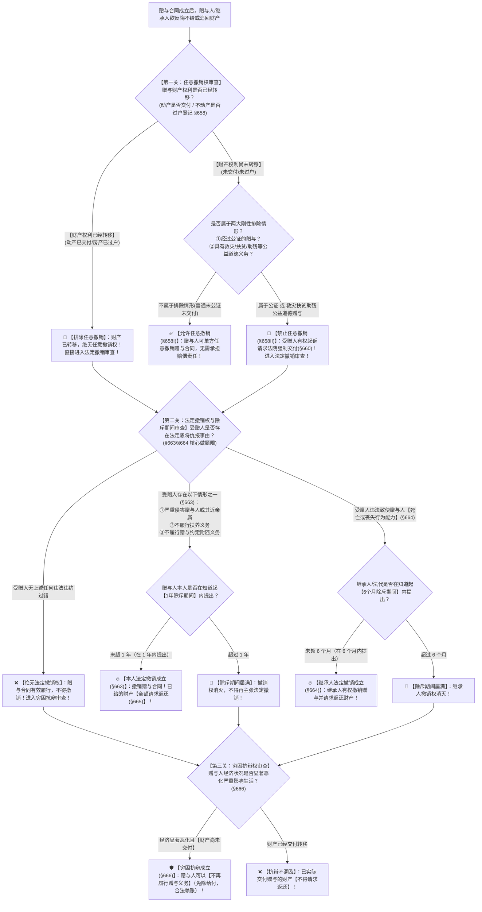

# 📐 赠与合同撤销与抗辩 · 全流程答题模型（任意撤销与公证公益除外 · 本人法定撤销1年除斥 · 继承人法定撤销6个月除斥 · 穷困抗辩 · §657-§666）

> **教练开场白**
> 同学们好！我是你们的民法法考教练。在典型合同分编中，“赠与合同的撤销权与穷困抗辩”是**客观题命题人最爱考除斥期间时间差、在主观题案例中频繁作为抗辩事由考核的高频母题**！
> 很多同学做赠与合同题目时经常把“任意撤销”和“法定撤销”搅成一锅粥：以为公证过的赠与合同就“无论发生什么都一辈子不能撤销了”；或者把赠与人本人的“1 年除斥期间”和继承人的“6 个月除斥期间”张冠李戴；再或者以为赠与人破产了就能把已经送出去的房子要回来。
> 请大家死死记住民法典赠与合同的**【三道连环防御大门】——“先看能不能任意撤，再看法定能不能撤，最后看日子能不能过得下去（穷困抗辩）”**！
> - **① 第一道防线（任意撤销 §658）**：东西还没给出去，想反悔就反悔；但如果**公证了**或者为了**救灾、扶贫、助残等公益道德**，**绝对禁止任意反悔**！
> - **② 第二道防线（法定撤销 §663/§664）**：哪怕公证了、公益了、甚至东西都给受赠人了，只要受赠人**“恩将仇报（打人、不赡养、不履行业务）”**，赠与人**依然享有法定撤销权**！本人 **1 年**内撤，继承人 **6 个月**内撤！
> - **③ 第三道防线（穷困抗辩 §666）**：赠与人自己都要吃不上饭了，**可以赖账不再给（免除未交付的给付义务），但已经送出去的不能强行要回**！

---

## 适用场景与解决问题

本模型专门解决赠与合同效力认定、赠与人单方反悔撤销、继承人追夺撤销、受赠人请求强制交付、赠与人免除履行的全部主客观题考点（对应 [[典型合同考点-深度报告]] 三·赠与合同 Row 1/2/3/4/5 · ★★★★ 重点高频）：重点破解：

1. **第一道防线 · 任意撤销权与两大排除关（《民法典》§658/§660）**：
   - **任意撤销权原则（§658Ⅰ）**：赠与人在赠与财产的**权利转移之前（动产交付前、不动产过户登记前）**，可以任意撤销赠与；
   - ⭐ **两大刚性排除（§658Ⅱ）**：
     - ① **经过公证的赠与合同**；
     - ② **依法不得撤销的具有救灾、扶贫、助残等公益、道德义务性质的赠与合同**；
     - 排除后果：赠与人不得任意撤销；赠与人不交付的，受赠人**有权起诉请求交付（强制履行 §660Ⅰ）**；因赠与人故意或重大过失致财产毁损灭失的，承担赔偿责任（§660Ⅱ）。
2. **第二道防线 · 法定撤销权与除斥期间时间锁关（《民法典》§663/§664/§665）**：
   - ⭐ **赠与人本人法定撤销权（§663）**：
     - 三大法定事由：①**严重侵害赠与人或者赠与人近亲属的合法权益**；②**对赠与人有扶养义务而不履行**；③**不履行赠与合同约定的义务（附义务赠与）**；
     - ⭐ **1 年除斥期间（§663Ⅱ）**：赠与人的撤销权，自知道或者应当知道撤销事由之日起 **1 年内**行使（不可中断、不可中止）；
   - ⭐ **继承人/法定代理人法定撤销权（§664）**：
     - 法定事由：因受赠人的违法行为致使赠与人**死亡或者丧失民事行为能力**；
     - ⭐ **6 个月除斥期间（§664Ⅱ）**：继承人或者法定代理人的撤销权，自知道或者应当知道撤销事由之日起 **6 个月内**行使；
   - **撤销后果（§665）**：撤销权人撤销赠与的，可以向受赠人**请求返还赠与的财产（恢复原状）**。
3. **第三道防线 · 穷困抗辩权与附义务赠与关（《民法典》§666/§661）**：
   - ⭐ **穷困抗辩权（§666）**：赠与人的经济状况显著恶化，严重影响其生产经营或者家庭生活的，**可以不再履行赠与义务**；
   - 规则边界：穷困抗辩仅产生**“免除尚未履行的给付义务”**的抗辩效力，对于**已经交付移转财产所有权的部分，不得请求返还**！

> **核心一句**：**权利转移前任意撤，救灾扶贫公证除外（受赠人可逼交付）；受赠人使坏法定撤（本人一年，继承人半年，财产要得回）；日子过不下去穷困抗辩，未给的不给了，已给的别想要！**
>
> 🔎 **核心法源（2026最新）**：《民法典》§657、§658、§659、§660、§661、§662、§663、§664、§665、§666。

---

## 💡 【前置认知】任意撤销 vs 本人法定撤销 vs 继承人法定撤销 vs 穷困抗辩极速对照表

| 制度维度 | 🛡️ 任意撤销权（§658） | ⚖️ 赠与人本人法定撤销权（§663） | 👨‍👦 继承人/法代法定撤销权（§664） | 📉 穷困抗辩权（§666） |
| :--- | :--- | :--- | :--- | :--- |
| **行使前提条件** | 财产权利**尚未转移**（未交付/未过户） | **任何阶段皆可**（权利转移前或转移后、公证或公益） | **任何阶段皆可**（权利转移前或转移后） | 财产权利**尚未转移**（尚未履行给付） |
| **实质法定事由** | **无需任何事由**（单方任性反悔） | ① 严重侵害本人或近亲属<br>② 不履行法定扶养义务<br>③ 不履行约定赠与义务 | 因受赠人违法行为致赠与人**死亡或丧失民事行为能力** | 经济状况显著恶化，**严重影响生产经营或家庭生活** |
| **法定刚性排除** | **公证赠与** OR **救灾扶贫助残等公益道德赠与** | **无排除！**（哪怕公证公益，恩将仇报照样法定撤销） | **无排除！**（违法致死致残照样撤销） | 已经实际履行的部分不得主张返还 |
| **除斥期间限制** | 权利转移前随时行使 | ⭐ 自知道起 **1 年**（§663Ⅱ） | ⭐ 自知道起 **6 个月**（§664Ⅱ） | 尚未履行期间内随时行使抗辩 |
| **终局法律后果** | 合同效力消灭，免除赠与义务 | 撤销赠与，**可请求返还财产** | 撤销赠与，**继承人请求返还财产** | **不再履行给付**（抗辩权，不溯及） |

---

## 一、 考点核心骨架与法理（三关连贯决策树）



```
【赠与合同全景】一句话开场：送出去的东西能反悔吗？没给想撤就撤（公证公益除外）；受赠人使坏法定撤（本人一年继承人半年）；吃不上饭穷困抗辩不给未交的！
│
▼ 第一关 · 任意撤销权与两大排除 ── 权利转移前（§658/§660）
├─ 财产权利【尚未转移】（动产未交付 / 不动产未登记）：
│    ├─ ① 经过公证的赠与合同 ────────────────────────────────────────→ 🚫【不得任意撤销】（受赠人可请求强制交付 §660）
│    ├─ ② 具有救灾、扶贫、助残等公益、道德义务性质 ──────────────────→ 🚫【不得任意撤销】（受赠人可请求强制交付 §660）
│    └─ ③ 普通赠与 ───────────────────────────────────────────────────→ ✅【允许任意撤销】（赠与人单方通知即解约）
└─ 财产权利【已经转移】 ───────────────────────────────────────────────→ 🚨【丧失任意撤销权】（直接进第二关）
     │
     ▼ 第二关 · 法定撤销权与除斥期间 ── 恩将仇报全额退（§663/§664/§665）
     ├─ 赠与人本人法定撤销（§663）：
     │    ├─ 审查事由：①严重侵害本人/近亲属 ②不履行扶养义务 ③不履行约定赠与义务
     │    └─ 审查时间锁：⭐ 自知道或者应当知道之日起【1 年内行使】（§663Ⅱ）
     │         ├─ 1 年内提出 ──────────────────────────────────────────→ 🔥【法定撤销成功】（全额请求返还已赠财产 §665）
     │         └─ 超过 1 年 ───────────────────────────────────────────→ 🚨 撤销权消灭！
     │
     └─ 继承人/法定代理人法定撤销（§664）：
          ├─ 审查事由：因受赠人违法行为致赠与人【死亡或者丧失民事行为能力】
          └─ 审查时间锁：⭐ 自知道或者应当知道之日起【6 个月内行使】（§664Ⅱ）
               ├─ 6 个月内提出 ────────────────────────────────────────→ 🔥【继承人法定撤销成功】（追回遗产财产）
               └─ 超过 6 个月 ─────────────────────────────────────────→ 🚨 继承人撤销权消灭！
                    │
                    ▼ 第三关 · 穷困抗辩权与履行免除 ── 过不下去不给了（§666）
                    ├─ 适用前提：赠与人经济状况显著恶化，严重影响生产经营或家庭生活
                    └─ 法律后果：
                         ├─ 尚未交付履行的部分 ──────────────────────────────→ 🛡️【合法免除给付】（不再履行赠与义务）
                         └─ 已经交付移转的部分 ──────────────────────────────→ ❌【不得请求返还】（不具有溯及力）

  ━━━ 三关全通 ━━━
```

---

## 二、 核心考情与 2026 民法典精要

- **频次研判**：赠与合同撤销权是民法典合同编分则**★★★★ 重点高频考点**；每年在单选题、多选题中必出 1 题，法大法考与各大机构将其列为分则黄金考点。
- **命题核心**：
  1. **任意撤销权的“两大例外”（§658Ⅱ）**：**经过公证**与**救灾扶贫助残等公益道德性质**的赠与，不得任意撤销；受赠人有权起诉请求交付（§660）。
  2. **法定撤销权的“时间锁”（§663Ⅱ vs §664Ⅱ）**：
     - 赠与人本人撤销：**1 年除斥期间**；
     - 继承人/法代撤销：**6 个月除斥期间**。
  3. **法定撤销不受公证/公益限制**：哪怕公证过或者具有公益性质，只要受赠人严重侵害赠与人，**依然可以法定撤销**！
  4. **穷困抗辩权（§666）**：经济严重恶化只能“不再履行”，**绝对不能追回已经给付的财产**。

---

## 三、 三大核心法理与命题陷阱拆解

### 1. 赠与撤销四大命题暗坑与裁判标准表

| 案件事实设定 | 争议焦点 | 裁判结论 | 命题陷阱与法理深剖 |
|---|---|---|---|
| 甲承诺赠与乙 10 万元用于扶贫助残并订立书面合同。后甲反悔，声称钱还没给可以任意撤销。 | 钱尚未交付，甲能否行使任意撤销权？ | ❌ **不得任意撤销！**<br>乙有权请求甲交付 10 万元！ | 《民法典》§658Ⅱ：具有救灾、扶贫、助残等公益道德性质的赠与，**排除任意撤销权**；依据 §660，受赠人有权请求交付（多选-39）。 |
| 甲将房屋公证赠与给乙，但尚未办理过户登记。期间乙将甲打成重伤住院。甲在事发 8 个月后主张撤销赠与。 | 经过公证的赠与，且已过半年，甲还能不能撤销？ | ✅ **甲有权法定撤销！** | 任意撤销虽被公证阻断，但乙故意伤害触发《民法典》§663Ⅰ **法定撤销权**；甲在知道起 **1 年内**提出（8 个月），撤销成立（单选-06）。 |
| 乙受赠甲的别墅并办理了过户。后乙下毒将甲杀害。甲的儿子丙在事发 8 个月后起诉要求撤销赠与并追回别墅。 | 赠与人已死，且事发过了 8 个月，继承人丙能否撤销？ | 🚨 **撤销权已消灭，不得撤销！** | 依据《民法典》§664Ⅱ，继承人的撤销权除斥期间为 **6 个月**（非 1 年）；丙在 8 个月后起诉已过除斥期间，丧失撤销权（多选-04）。 |
| 甲承诺赠与乙一辆奔驰车并已交付。次月甲公司破产负债累累，甲以生活困难为由要求乙返还奔驰车。 | 甲经济显著恶化，能否依穷困抗辩要回已送出的车？ | ❌ **无权要回奔驰车！** | 依据《民法典》§666，穷困抗辩权仅能**“不再履行尚未履行的赠与义务”**，对已交付财产**不具有溯及返还效力**！ |

### 2. 赠与人过错责任的“轻度豁免”（《民法典》§660Ⅱ / §662）

| 损害发生情形 | 赠与人是否承担赔偿责任？ | 法律依据 | 考场一秒判定 |
|---|---|---|---|
| 不可任意撤销的赠与（公证/公益），标的物因**一般过失（轻微疏忽）**毁损 | ❌ **不承担赔偿责任！** | 《民法典》§660Ⅱ：仅在赠与人存在**故意或者重大过失**时才担责。 | 无偿合同减轻责任原则。 |
| 赠与的财产存在质量瑕疵（如送的手机电池故障冒烟） | ❌ **原则上不承担瑕疵担保责任！**<br>⭐ 例外：赠与人**故意隐瞒瑕疵**或者**保证无瑕疵**造成受赠人损失的，应当赔偿（§662）。 | 《民法典》§662 | 送东西不保修，故意害人除外。 |

---

## 四、 万能解题三步

---

### 第一步：查任意撤销权关 —— 财产给了没？公证/公益了没？（《民法典》§658/§660）

> **教练提示**：
> 1. 先看标的物有没有交付/过户：**已经交付/过户 $\rightarrow$ 绝对无任意撤销权**，直接进第二步；
> 2. 尚未交付/过户：
>    - 只要是**普通赠与** $\rightarrow$ **想撤就撤（§658Ⅰ）**；
>    - 如果是**公证赠与** OR **救灾、扶贫、助残等公益道德赠与** $\rightarrow$ **绝对不得任意撤销！受赠人可请求强制交付（§660）**！

---

### 第二步：查法定撤销权关 —— 受赠人使坏没？过了时间锁没？（《民法典》§663/§664）

> **教练提示**：如果任意撤销被堵死（已经交付或公证公益），看受赠人有没有恩将仇报：
> 1. **赠与人本人行使（§663）**：
>    - 审查事由：侵害本人或近亲属、不赡养、不履行约定；
>    - ⭐ **时间锁：自知道之日起 1 年内（§663Ⅱ）**，没超 1 年撤销成功，已给的财产要得回；
> 2. **继承人/法定代理人行使（§664）**：
>    - 审查事由：受赠人违法行为致赠与人死亡或丧失行为能力；
>    - ⭐ **时间锁：自知道之日起 6 个月内（§664Ⅱ）**，超 6 个月权利彻底消灭！

---

### 第三步：查穷困抗辩与返还关 —— 赠与人破产了能不能赖账？（《民法典》§666/§665）

> **教练提示**：
> 1. 赠与人经济状况显著恶化严重影响生活：
>    - **还没给的** $\rightarrow$ **穷困抗辩成立，可以不给了（§666）**；
>    - **已经给出去的** $\rightarrow$ **绝不能以此为由要回来**；
> 2. 只有在**第二步法定撤销成功（§665）**的情形下，赠与人才有权请求受赠人返还已赠财产！

#### 💰 完整数字案例：赠与撤销权连环攻防实战

> **【案情（[[典型合同-单选-06]] 与 [[典型合同-多选-04]] 综合演练）】**
> 甲（知名画家）与乙慈善基金会签订《赠与合同》，约定甲向乙捐赠名画一幅用于**贫困失学儿童助学（扶贫公益性质）**，该合同办理了**公证手续**。同时，甲承诺赠与好友丙名人字画一幅（普通赠与，未公证）。
> - **实战分支 A（扶贫公证不得任意撤销 · 多选-39）**：
>   画作交付前，甲反悔声称画作还在自己手中，主张行使任意撤销权拒绝交付给乙基金会。
>   - 裁判涵摄：该赠与既具有扶贫公益性质又经过公证，依据《民法典》§658Ⅱ，**甲不享有任意撤销权**；依据《民法典》§660，乙基金会有权起诉请求法院判令甲交付名画！
> - **实战分支 B（受赠人违法犯罪触发法定撤销与时间锁 · 单选-06/多选-04）**：
>   乙基金会负责人丁因琐事雇凶将甲打成重伤（严重侵害赠与人）。甲在重伤住院知悉真相后第 **8 个月**，向法院起诉主张撤销对乙基金会的赠与合同。
>   - 裁判涵摄：虽然属于公证公益赠与，但受赠人实施严重侵害行为触发了《民法典》§663Ⅰ **法定撤销权**；甲本人在知道撤销事由之日起 **1 年除斥期间内（第 8 个月）** 行使，**法定撤销成立，甲无需再向乙交付画作（单选-06 考点）**！
> - **实战分支 C（继承人 6 个月除斥期间起算 · 多选-04）**：
>   若甲因重伤不治身亡。甲的唯一继承人戊于甲死亡之日知悉受赠人丁的犯罪事实，但戊拖延至第 **7 个月** 才起诉主张撤销该赠与。
>   - 裁判涵摄：依据《民法典》§664Ⅱ，继承人戊的法定撤销权除斥期间为 **6 个月**；戊在第 7 个月提出已超过除斥期间，**继承人撤销权消灭，法院不予支持（多选-04 考点）**！

#### 一句话闭环记忆
> 🎯 **一眼判**：**权利转移前任意撤，救灾扶贫公证除外（受赠人可逼交付）；受赠人使坏法定撤（本人一年，继承人半年，财产要得回）；日子过不下去穷困抗辩，未给的不给了，已给的别想要！**

---

## 五、 案例演练

### 1. 公证公益赠与排除任意撤销与强制交付（[[典型合同-多选-39]] 经典真题）
- **案情**：企业承诺向灾区捐款 100 万元用于抗震救灾并公开举行捐赠仪式。后企业因经营策略调整声明撤销捐款。
- **模型分析**：第一步——救灾扶贫等公益性质赠与，依据《民法典》§658Ⅱ 排除任意撤销权；依据 §660，受赠单位有权请求该企业交付 100 万元捐款。

### 2. 赠与人本人法定撤销权 1 年除斥期间（[[典型合同-单选-06]] 经典真题）
- **案情**：受赠人受赠房产并过户后，拒绝履行约定的赡养照顾义务。赠与人在知道该情况第 10 个月起诉主张撤销赠与并要回房产。
- **模型分析**：第二步——受赠人不履行合同约定义务触发法定撤销权（§663Ⅰ③）；赠与人本人在 1 年除斥期间内行使，撤销有效，受赠人必须返还房产（§665）。

### 3. 继承人法定撤销权 6 个月除斥期间限制（[[典型合同-多选-04]] 经典真题）
- **案情**：受赠人违法犯罪致赠与人死亡，赠与人的继承人知情后超过 6 个月才主张撤销赠与。
- **模型分析**：第二步——依据《民法典》§664Ⅱ，继承人撤销权自知道起 6 个月内行使；超过 6 个月除斥期间届满，继承人丧失撤销权。

---

## 关联真题

- [[典型合同-单选-06]] · 赠与合同法定撤销权与 1 年除斥期间
- [[典型合同-多选-04]] · 赠与人继承人法定撤销权与 6 个月除斥期间
- [[典型合同-多选-39]] · 救灾扶贫公益性质赠与排除任意撤销与交付请求权
- [[典型合同-单选-43 · 附义务赠与合同与限制民事行为能力人效力待定案]] · 附义务赠与合同效力
- [[典型合同-单选-47 · 捐款余额目的不达转用同类公益案]] · 赠与目的不达与穷困抗辩

## 相关页面

- 概念实体页：[[赠与合同]] · [[买卖合同]]
- 姊妹模型：[[民法-合同-买卖风险负担模型]] · [[民法-合同-特种买卖与检验期模型]] · [[民法-合同-解除模型]]
- 综合报告：[[典型合同考点-深度报告]]（三、赠与合同 · Row 1/2/3/4/5 · ★★★★ 重点高频）
