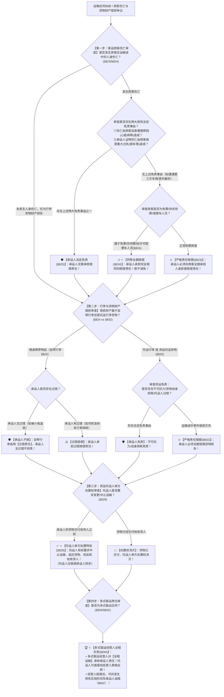

# 📐 运输合同 · 全流程答题模型（客运伤亡严格责任 · 免票同等保护 · 自带行李过错vs托运严格 · 托运人单方处置权 · 多式联运全程负责 · §809-§842）

> **教练开场白**
> 同学们好！我是你们的民法法考教练。在典型合同分编中，“运输合同”是**客观题命题人最爱考承运人归责原则双轨制、旅客伤亡免责边界与托运人单方特权的经典常考考点**！
> 很多同学做运输合同题目时经常踩中以下几个“易混陷阱”：以为大巴车在路上被追尾发生车祸，大巴车司机没有过错就不用赔偿受伤旅客；以为司机好心让邻居免费搭便车，半路翻车受伤了就能因为“免费”而免责；以为乘客随身带在身上的手机被偷了也能找公交公司严格索赔；以为货运合同一旦起运托运人就不能中途改送别人。
> 《民法典》运输合同章（§809–§842），构建了**以“客运人身严格赔、免票打折同等保、自带行李看过错、托运行李严格赔、托运人中途有权改、多式联运全程扛”为核心的裁判闭环**。
> 今天我们用**“四步连贯流水线”**，把运输合同的全部归责原则、免责边界与特权救济一次性彻底锁死：**第一步查客运人身伤亡关（严格责任 + 自身疾病/故意重大过失两大免责 + 免票同等保护 §823/§824） → 第二步查行李与货物财产损毁关（自带行李过错责任 vs 托运行李货运严格责任 §824/§832） → 第三步查货运托运人单方处置关（交货前随时中止/返还/改送第三人 §829） → 第四步查多式联运全程责任关（对外统一负责 + 内部区段追偿 §834/§842）**！

---

## 适用场景与解决问题

本模型专门解决旅客运输人身伤亡赔偿、免票与优待票旅客保护、随身携带行李与托运行李毁损赔偿、货运合同托运人中途变更与解除、多式联运经营人全程责任的全部主客观题考点（对应 [[典型合同考点-深度报告]] 十·运输合同 Row 1/2/3/4 · ★★★ 中频必考）：重点破解：

1. **第一步 · 客运人身伤亡严格责任与两大免责关（《民法典》§823/§824）**：
   - ⭐ **严格责任（无过错责任 §823）**：承运人应当对运输过程中旅客的伤亡承担赔偿责任；哪怕承运人对交通事故没有任何过错（如被第三方大货车追尾），承运人对本车受伤旅客**依然负有全部违约赔偿责任**；
   - 🚨 **两大刚性免责事由（§823 核心做题眼）**：
     - ① **伤亡是旅客自身健康原因（如突发心脏病、脑溢血等自身疾病）造成的**；
     - ② **承运人证明伤亡是旅客故意、重大过失（如跳车、自杀、故意把头伸出车窗外）造成的**；
   - ⭐ **免票与优待票同等保护（§824 权威做题眼）**：按照规定免票（免票儿童）、持优待票（老年人优待票、残疾人票）或者**经承运人许可搭乘的无票旅客（好心搭便车）**，**承运人承担完全相同的严格赔偿责任，绝不能减免责任**！
2. **第二步 · 自带行李 vs 托运行李财产毁损双轨归责关（《民法典》§824/§832）**：
   - ⭐ **随身携带行李物品（自带行李 §824）**：承运人承担 **过错责任**（旅客自行保管，只有证明承运人存在过错时承运人才赔）；
   - ⭐ **托运行李 / 货运货物（§824/§832）**：承运人承担 **严格责任（无过错责任）**；货物在运输途中毁损灭失的，承运人必须赔偿，除非承运人证明系不可抗力、货物自身自然属性/合理损耗、托运人/收货人过错。
3. **第三步 · 货运合同托运人单方处置权关（《民法典》§829）**：
   - ⭐ **单方处置特权（§829）**：在承运人将货物交付收货人之前，托运人有权要求承运人**中止运输、返还货物、变更到达地或者将货物交给其他收货人**；
   - 托运人应当赔偿承运人因此受到的损失。
4. **第四步 · 多式联运经营人全程负责关（《民法典》§834/§842）**：
   - **对外整体连带责任**：多式联运经营人负责履行或者组织履行多式联运合同，**对全程运输享有承运人的权利，承担承运人的义务**；
   - **内部追偿**：损失发生在哪一区段，多式联运经营人向托运人赔偿后，有权向该区段的实际承运人追偿。

> **核心一句**：**旅客伤亡严格赔，自身疾病故意重大过失才免责，免票打折同等保；自带行李看有过错，托运行李严格赔；交货之前托运人最大（随时变更中止要赔钱）；多式联运对外全程背大锅！**
>
> 🔎 **核心法源（2026最新）**：《民法典》§809、§814、§815、§822、§823、§824、§829、§832、§834、§835、§842。

---

## 💡 【前置认知】运输合同核心归责原则与特权极速对照表

| 场景分类 | 归责原则（责任标准） | 法定免责事由 | 考场一秒判定秘诀 | 核心法条 |
| :--- | :--- | :--- | :--- | :--- |
| **① 客运旅客伤亡** | **严格责任（无过错责任）** | ① 旅客自身健康原因（自身疾病）<br>② 旅客自身故意、重大过失 | 路上被第三方撞伤，**公交车/大巴车照样全额赔旅客**！ | 《民法典》§823 |
| **② 免票/搭便车旅客** | **严格责任（同等保护）** | 仅上述两大免责事由 | 免票儿童、优待老人、搭便车者**受同等保护，不减责**！ | 《民法典》§824 |
| **③ 随身携带自带行李** | **过错责任** | 承运人无过错即不赔 | 乘客包包在车上被小偷偷走，**公交公司无过错不赔**！ | 《民法典》§824 |
| **④ 托运行李 / 货运货物** | **严格责任（无过错责任）** | 不可抗力、货物自身属性/损耗、托运人过错 | 托运箱子摔烂了，**承运人原则上一律全额赔偿**！ | 《民法典》§832 |
| **⑤ 托运人单方处置权** | **法定单方变更/解除权** | 必须在“**交付收货人之前**”行使 | 货还没交到买家手上，**托运人有权随时改送别人**！ | 《民法典》§829 |

---

## 一、 考点核心骨架与法理（四步连贯决策树）



```
【运输合同全景】一句话开场：旅客伤亡严格赔，自身疾病故意重大过失才免责，免票打折同等保；自带行李看过错，托运行李严格赔；交货之前托运人最大，多式联运全程扛！
│
▼ 第一步 · 查客运人身伤亡 ── 严格责任与两大免责（§823/§824）
├─ 审查法定免责：
│    ├─ ① 伤亡由旅客自身健康原因（突发疾病）造成 ──────────────────→ 🛡️【承运人免责】
│    └─ ② 承运人证明伤亡由旅客自身故意、重大过失（跳车等）造成 ─────→ 🛡️【承运人免责】
└─ 无上述免责（如第三方车祸、翻车意外）：
     ├─ 正常购票旅客 ─────────────────────────────────────────────────→ 🔥【严格责任，全额赔偿】
     └─ 免票儿童 / 持优待票老人 / 经许可搭便车人员（§824） ──────────→ 🔥【同等保护，绝不减免】！
          │
          ▼ 第二步 · 查行李与货物损毁 ── 双轨归责（§824 vs §832）
          ├─ 随身携带自带行李（§824）：──────────────────────────────────────→ ⚖️【过错责任】（承运人无过错不赔）
          └─ 托运行李 / 货运货物（§832）：───────────────────────────────────→ 🔥【严格责任】（除不可抗力/自身损耗外一律赔）
               │
               ▼ 第三步 · 查托运人单方处置权 ── 交付收货人前（§829）
               ├─ 货物交付收货人之前：────────────────────────────────────────→ ✅【托运人有权随时中止、返还、改送他人】！
               └─ 货物已经交付收货人：────────────────────────────────────────→ 🚨 处置权消灭
                    │
                    ▼ 第四步 · 查多式联运全程责任 ── 统一负责（§834/§842）
                    ├─ 对外责任：⭐【多式联运经营人对全程运输承担全部责任】
                    └─ 内部追偿：经营人赔偿后，有权向区段实际承运人追偿（§842）

  ━━━ 四步全通 ━━━
```

---

## 二、 核心考情与 2026 民法典精要

- **频次研判**：运输合同是民法典合同编分则**★★★ 中频必考点**；每年在单选、多选题中必出 1 题，法大法考将其列为客运与货运重要基础考点。
- **命题核心**：
  1. **客运承运人的严格责任（§823）**：只要不是“自身疾病”或“自身故意重大过失”，哪怕是第三方全责车祸，**客运承运人依然对本车旅客承担违约赔偿责任**（单选-12）。
  2. **免票与好心搭便车同等保护（§824）**：承运人许可搭便车人员发生意外伤亡，**承运人照样全额赔，不得以无偿为由抗辩减免**。
  3. **行李责任双轨制（§824）**：自带行李过错责任 vs 托运行李严格责任。
  4. **托运人中途变更权（§829）**：交货前托运人享有法定单方变更权。
  5. **多式联运全程负责（§834）**：多式联运经营人对全程运输承担承运人责任。

---

## 三、 三大核心法理与命题陷阱拆解

### 1. 运输合同四大命题暗坑与裁判标准表

| 案件事实设定 | 争议焦点 | 裁判结论 | 命题陷阱与法理深剖 |
|---|---|---|---|
| 客车正常行驶，被后方违规超车的大货车追尾致客车旅客甲重伤骨折（交警认定大货车全责） | 客车司机没有任何过错，客运公司是否赔偿甲？ | 🔥 **客运公司必须全额赔偿甲！** | 《民法典》§823：客运人身伤亡为**严格责任**；第三方过错不属于法定免责事由，客运公司承担违约责任后可向大货车追偿（单选-12）。 |
| 大巴车司机好心让邻居乙免费搭便车回老家。半路大巴车爆胎侧翻导致乙受伤骨折。 | 乙是免费搭便车人员，客运公司能否主张免责或减责？ | 🔥 **不得免责或减责！全额赔偿！** | 《民法典》§824：**免票、持优待票或者经许可搭乘的无票旅客，承运人承担同等赔偿责任**，绝不能减免（多选-12）。 |
| 旅客甲随身携带背包乘坐地铁，在早高峰拥挤期间被小偷划破背包偷走手机。 | 地铁公司是否应当赔偿甲手机被盗损失？ | 🛡️ **地铁公司不承担赔偿责任！** | 《民法典》§824：随身携带自带行李适用**过错责任**；地铁公司无过错，手机被盗损失由旅客自担。 |
| 甲托运一批钢材发往乙处。在火车运输途中，甲通知铁路公司：“中途停运，将该批钢材改送丙处”。 | 货物已经在运输途中，托运人甲能否中途改送他人？ | ✅ **甲有权单方改送丙！** | 《民法典》§829：货物交付收货人之前，**托运人享有法定单方处置权**，有权变更到达地或收货人（但应赔偿承运人损失）。 |

### 2. 客运合同人身伤亡归责与第三方侵权竞合

| 诉讼路径选择 | 被告主体 | 归责原则与举证责任 | 法律依据 |
|---|---|---|---|
| **路径一：追究承运人违约责任** | 运输客运公司 | **严格责任（无过错责任）**；旅客仅需证明伤亡发生在运输途中。 | 《民法典》§823 |
| **路径二：追究第三方侵权责任** | 违规撞车的第三方大货车司机及公司 | **过错侵权责任**；需证明第三方存在过错及交通事故责任认定。 | 《民法典》§1165 |

---

## 四、 万能解题四步

---

### 第一步：查客运伤亡关 —— 是自带疾病/跳车自杀吗？免票了吗？（《民法典》§823/§824）

> **教练提示**：旅客在客车、火车、飞机上受伤：
> 1. 查两大免责：**自身疾病（突发心脏病）** 或 **故意重大过失（跳车自杀）** $\rightarrow$ 承运人免责；
> 2. 只要不属于这两大免责（第三方撞车、意外爆胎）：**承运人一律严格赔偿**！
> 3. 查票证：免票儿童、老人优待票、经许可搭便车 $\rightarrow$ **同等严格保护，绝不减责（§824）**！

---

### 第二步：查行李货物关 —— 是自带的还是托运的？（《民法典》§824/§832）

> **教练提示**：
> 1. **随身携带行李（背包、手机）** $\rightarrow$ **过错责任**，承运人无过错不赔；
> 2. **托运行李 / 货运货物** $\rightarrow$ **严格责任**，途中毁损承运人必须赔（除不可抗力、自身损耗外）。

---

### 第三步：查托运人处置关 —— 货物交到收货人手里没？（《民法典》§829）

> **教练提示**：
> 1. 货物**尚未交付给收货人** $\rightarrow$ **托运人享有单方处置特权**，随时可以要求停运、退回、改送别人；
> 2. 货物**已经交付给收货人** $\rightarrow$ 托运人单方处置权消灭。

---

### 第四步：查多式联运关 —— 找谁要全款？（《民法典》§834）

> **教练提示**：公铁水多式联运：
> 1. 托运人可直接找**多式联运经营人**主张全程损失全额赔偿；
> 2. 多式联运经营人赔偿后，找具体肇事区段承运人内部追偿（§842）。

#### 💰 完整数字案例：客运人身伤亡与行李货物攻防实战

> **【案情（[[典型合同-单选-12]] 与 [[典型合同-多选-12]] 综合演练）】**
> 甲客运公司的大巴车在高速公路上正常行驶。车上载有正常购票旅客乙、持老年优待半价票旅客丙、以及司机同意免费搭乘的邻居丁。旅客乙随身携带价值 **1 万元**的笔记本电脑上车放在膝盖上；同时乙将行李箱（内有价值 **5000 元**高档衣物）交由大巴车放入行李舱**办理了行李托运**。
> 行驶途中，一辆后方非法违规超速的大货车追尾撞上大巴车，造成大巴车侧翻事故（交警认定大货车全责，大巴车司机无过错）。事故导致：
> - 旅客乙重伤，产生医疗费 **10 万元**；乙随身笔记本电脑在车厢内被踩碎（毁损损失 **1 万元**）；乙托运的行李箱被挤压粉碎（毁损损失 **5000 元**）；
> - 免费搭车的邻居丁重伤，产生医疗费 **8 万元**。
>
> 1. **第一步（客运人身伤亡严格责任）**：
>    - 依据《民法典》§823，承运人对旅客伤亡承担**严格责任**；第三方大货车全责不属于客运承运人的免责事由，甲客运公司必须向旅客乙全额赔偿医疗费 10 万元；
>    - 依据《民法典》§824，经许可免费搭乘的旅客丁享受**同等保护**，甲客运公司必须向丁全额赔偿医疗费 8 万元（不得以无偿搭便车为由减免）！
> 2. **第二步（行李财产损失双轨归责）**：
>    - 随身携带笔记本电脑（自带行李）：依据《民法典》§824，自带行李适用**过错责任**；甲公司司机无过错，甲公司无需向乙赔偿笔记本电脑 1 万元损失（乙应向大货车索赔侵权）；
>    - 托运行李箱（托运行李）：依据《民法典》§824/§832，托运行李适用货运**严格责任**；甲客运公司必须向乙赔偿行李箱损失 5000 元！
> 3. **终局裁判结论**：
>    - 甲客运公司应向乙赔偿医疗费 **10 万元** ＋ 托运行李损失 **5000 元**（共 10.5 万元）；
>    - 甲客运公司应向丁赔偿医疗费 **8 万元**；
>    - 甲客运公司无需赔偿乙随身笔记本电脑损失 1 万元；甲公司赔偿后有权向肇事大货车全额追偿！

#### 一句话闭环记忆
> 🎯 **一眼判**：**旅客伤亡严格赔，自身疾病故意重大过失才免责，免票打折同等保；自带行李看有过错，托运行李严格赔；交货之前托运人最大（随时变更中止要赔钱）；多式联运对外全程背大锅！**

---

## 五、 案例演练

### 1. 客运承运人对旅客伤亡严格责任（[[典型合同-单选-12]] 经典真题）
- **案情**：客运车辆正常行驶途中遭第三方违章车辆碰撞发生车祸，导致乘客受伤。客运公司以自身无过错为由拒绝赔偿。
- **模型分析**：第一步——依据《民法典》§823，客运承运人对旅客伤亡承担严格责任；第三方过错不属于法定免责事由，客运公司必须承担违约赔偿责任（选 A）。

### 2. 免票搭乘旅客同等保护原则（[[典型合同-多选-12]] 经典真题）
- **案情**：司机允许朋友免费搭乘长途客车，途中发生交通事故导致该朋友受伤。问客运公司责任如何？
- **模型分析**：第一步——依据《民法典》§824，经承运人许可搭乘的无票旅客，承运人承担同等赔偿责任，不得减免责任（选 BC）。

---

## 关联真题

- [[典型合同-单选-12]] · 客运承运人对旅客伤亡严格责任与第三方过错追索
- [[典型合同-多选-12]] · 经承运人许可搭乘无票旅客同等保护与免责事由排除

## 相关页面

- 概念实体页：[[运输合同]] · [[保管合同]]
- 姊妹模型：[[民法-合同-买卖风险负担模型]] · [[民法-合同-责任竞合模型]]
- 综合报告：[[典型合同考点-深度报告]]（十、运输合同 · Row 1/2/3/4 · ★★★ 中频必考）
