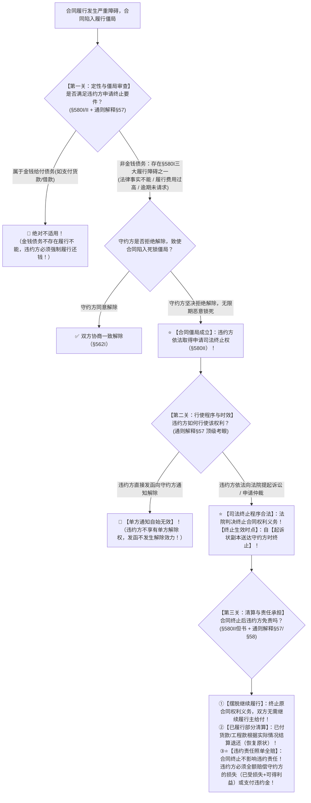

# 📐 违约方起诉终止合同 · 答题模型（合同僵局 · 非金钱履行障碍§580Ⅰ · 司法终止程序 · 送达时点 · 违约责任不免除）

> **教练开场白**
> 同学们好！我是你们的民法法考教练。在传统民法中，有一条根深蒂固的铁律——“只有守约方才能解除合同，违约方绝无解除权”。但是，如果遇到了极其极端的**“合同死锁 / 履行僵局”**怎么办？
> 比如在最高人民法院著名的公报案例《新宇公司诉冯玉梅案》中：开发商要把整座大厦整体改造成大型现代商业中心，其他 400 多户业主都退房了，唯独冯玉梅买了其中的 2 平米商铺，坚决拒绝退房，坚持要求开发商必须把大厦分割保留这 2 平米交给她。如果死板坚持“继续履行”，整栋几亿元的大厦将全部报废烂尾，陷入巨大的社会财富浪费与死锁！
> 《民法典》第 580 条第 2 款与 2023 年《合同编通则司法解释》第 57 条，作出了**中国民法典最具突破性的制度创新 —— 确立“合同僵局的违约方司法终止制度”**！今天我们用**“三关连贯流水线”**，把合同僵局的认定要件、违约方的行使路径、生效时点与清算责任一次性彻底锁死：**第一关定性与僵局要件（非金钱债务 + 三大履行障碍 + 陷入死锁） → 第二关行使与程序（无通知权 + 必须走诉讼仲裁 + 起诉状副本送达时终止） → 第三关清算与赔偿（合同虽解但违约金与可得利益一分不能少）**。

---

## 适用场景与解决问题

本模型专门解决合同陷入履行僵局时“违约方请求司法终止”的全部主客观题考点（对应 [[合同总则考点-深度报告]] 六·终止 row 3 · ★★★★★ 顶级必考新增）：重点破解：

1. **定性与僵局审查关**：
   - 必须属于**非金钱债务**（金钱债务永远不存在履行不能，绝对不适用 §580Ⅱ！）；
   - 触发《民法典》§580Ⅰ 的**三大法定履行障碍**之一：①法律上或事实上不能履行；②标的不适于强制履行或**履行费用过高（经济不能）**；③债权人在合理期限内未请求履行；
   - 守约方**拒绝解除合同**，致使合同陷入客观僵局，继续维持合同将造成重大资源浪费或显失公平。
2. **程序与生效时点关**：
   - ⭐ **违约方【绝对没有单方通知解除权】**！违约方单方发出解除通知的，依法**自始不发生解除效力**；
   - 违约方**必须向人民法院或仲裁机构提起诉讼或仲裁**，由司法裁判终止（司法终止 / 形成之诉）；
   - **终止生效时点（《通则解释》§57）**：法院判决终止合同权利义务关系的，**自起诉状副本送达对方时终止**（或依判决确定的时点终止）。
3. **清算与违约赔偿关**：
   - **《民法典》§580Ⅱ 铁律**：“终止合同权利义务关系，**但是不影响违约责任的承担**”；
   - 违约方通过司法终止摆脱了“继续履行”的枷锁，但**绝不等于免责**！违约方仍须向守约方支付**违约金、赔偿履行利益损失（含可得利益损失，但扣除守约方节省的成本）**。

> **核心一句**：**金钱债务不适用，非金钱履行费用高；合同死锁动不得，违约方无权发通知；起诉法院判终止，送达副本那天断；僵局打破摆脱履行，违约金与损失一分不能少！**
>
> 🔎 **核心法源（2026最新）**：《民法典》§580、§563、§566、§577、§584；**《最高人民法院关于适用〈中华人民共和国民法典〉合同编通则若干问题的解释》（法释〔2023〕13号）第57条（违约方起诉解除与送达终止时点）、第58条（解除后损失赔偿范围）；最高人民法院公报案例《南京新宇房产开发有限公司诉冯玉梅商铺买卖合同纠纷案》（指导性案例）**。

---

## 💡 【前置认知】违约方起诉终止 vs 守约方法定解除 vs 情势变更极速辨析表

| 制度名称 | **原告/主张主体** | **核心触发事实** | **行使方式与程序** | **违约责任承担** | 对应模型 |
| :--- | :--- | :--- | :--- | :--- | :--- |
| **① 违约方起诉终止（本模型）** | **违约方** | 非金钱债务履行障碍（§580Ⅰ），守约方拒绝协商导致**合同陷入死锁僵局** | **【无单方通知权】**！<br>必须**向法院/仲裁起诉请求司法终止** | **违约方仍须承担全部违约责任与损害赔偿**（绝不免责！） | **[[民法-合同-违约方申请终止模型]]** |
| **② 守约方法定解除权** | **守约方** | 对方根本违约（§563 天言拖死法），导致合同目的落空 | **享有单方通知解除权**！<br>通知到达对方时当场解除 | 守约方有权向违约方主张违约金与损害赔偿 | [[民法-合同-解除模型]] |
| **③ 情势变更制度** | **受不利影响方**（非违约方） | 基础条件发生**无法预见的重大变化**（政策/天灾），继续履行显失公平（§533） | 先重新协商；协商不成**请求法院变更或解除** | 属于不可抗力/客观情势，**双方均不承担违约责任** | [[民法-合同-情势变更模型]] |

---

## 一、 考点核心骨架与法理（三关连贯决策树）



```
【合同僵局司法终止纠纷】一句话开场：合同卡死办不下去了，违约方能发信解除吗？法院判了从哪天算？违约金还要不要赔？
│
▼ 第一关 · 定性与僵局审查 ── 非金钱债务与三大履行障碍（§580Ⅰ/Ⅱ）
├─ 金钱给付债务（欠款/还租）────────────────────────────────────────→ 🚨 绝对不适用！（金钱之债永无履行不能，必须还钱）
└─ 非金钱给付债务（建房/交货/提供特种服务）：
     ├─ 出现《民法典》§580Ⅰ 三大障碍之一：
     │    ├─ ① 法律上或事实上不能履行（核心团队离境/标的物灭失）
     │    ├─ ② 标的不适于强制履行 或【履行费用过高】（经济上毁灭性不合理，如新宇案改造商厦）
     │    └─ ③ 债权人在合理期限内未请求履行
     └─ 守约方拒绝解除合同，使合同陷入【履行死锁僵局】 ────────→ ⭐ 违约方申请司法终止权成立！
          │
          ▼ 第二关 · 行使程序与生效时点 ── 排除通知与送达终止（通则解释§57）
          ├─ 违约方单方发函通知解除 ────────────────────────────────→ 🚨【自始不发生效力】！（违约方无单方形成权）
          ├─ 必须以诉讼或仲裁方式向法院提出请求 ────────────────────→ ✅ 司法终止路径正确
          └─ 合同终止生效时点（通则解释§57）：
               └─ ⭐ 经法院判决终止的，合同自【起诉状副本送达对方时终止】！（非判决生效日）
                    │
                    ▼ 第三关 · 清算与违约责任承担 ── 终止履行但赔偿不免（§580Ⅱ但书 + 解释§57/§58）
                    ├─ 终止法律后果：尚未履行的终止履行，已履行的进行财产清算（恢复原状/多退少补）
                    └─ ⭐ 违约责任铁律（§580Ⅱ但书）：
                         ├─ 司法终止仅是打破履行僵局、免除“实际履行责任”；
                         └─ 违约方【绝不免除违约赔偿责任】！仍须承担违约金及履行利益损失（可得利益）赔偿！

  ━━━ 三关全过 ━━━
```

---

## 二、 核心考情

- **频次研判**：合同僵局与违约方申请终止是《民法典》合同编最受瞩目的**标志性新增制度（★★★★★ 顶级必考新增）**；《合同编通则司法解释》第 57 条对其诉讼程序与送达时点进行了权威定调，是近年来主客观大题极其偏爱的命题热点。
- **命题核心**：
  1. **适用标的限制**：仅适用于**非金钱债务**；金钱债务不适用不能履行。
  2. **程序红线（无通知权）**：违约方**绝无单方通知解除权**，私自发函解除通知无效；必须**起诉请求法院裁判终止**。
  3. **终止生效时间节点（解释§57）**：法院判决终止的，合同自**起诉状副本送达对方时终止**。
  4. **违约责任不免除（§580Ⅱ但书）**：司法终止合同不等于免除责任，违约方仍须承担违约金和全部可得利益损害赔偿。
  5. **与不可抗力/情势变更界分**：合同僵局起因于履行障碍，违约方仍须承担过错违约责任；情势变更双方无过错互不担责。

---

## 三、 三大核心法理与命题陷阱拆解

### 1. 为什么允许违约方申请终止合同？（深层法理与效率违约规制）

| 法理维度 | 传统合同法困境 vs 《民法典》§580Ⅱ 现代化破局 | 考场一眼判 |
|---|---|---|
| **传统法理困境** | 只有守约方有解除权。当履行费用极高（如履行需花费 1000 万，但标的物仅值 10 万），守约方故意拒绝解除、恶意锁死合同逼迫违约方，导致社会资源重大浪费。 | 守约方不得滥用权利无限期锁死合同！ |
| **《民法典》破局设计** | 赋予违约方**请求司法终止权**，打破履行僵局，释放被占用的社会资源；同时通过**违约方承担全部可得利益损害赔偿**，使守约方的经济利益得到完全补偿，实现帕累托最优。 | **打破僵局解脱履行，赔偿到位保护守约！** |

### 2. 违约方行使路径与生效时点（《民法典》§580Ⅱ + 《通则解释》§57）

| 规则维度 | 正确法律规则（2026最新） | 命题致命陷阱 |
|---|---|---|
| **行使方式** | **必须向法院起诉或申请仲裁**，请求裁判终止（形成之诉）。 | ❌ 误以为违约方享有单方发函通知解除权（发函自始无效！）。 |
| **生效时点** | 法院判决支持终止合同的，合同自**起诉状副本送达相对人之日终止**。 | ❌ 误以为立案之日、判决作出之日或判决生效之日终止。 |
| **前置程序** | 依法直接起诉请求司法终止，**无需以主张情势变更或给予宽限期为前置条件**。 | ❌ 误以为违约方起诉前必须先发催告函或走情势变更程序（单选-76 C项陷阱）。 |

### 3. 合同终止后的责任承担（《民法典》§580Ⅱ 但书 + 《通则解释》§58）

| 责任维度 | 具体规则与司法审查标准 | 做题秒杀眼 |
|---|---|---|
| **实际履行责任** | **免除**（双方无需继续进行实质性交付或建造）。 | 不用再勉强履行不能实现之债。 |
| **⭐ 违约损害赔偿责任** | **绝对不免除！** 违约方应当向守约方支付约定的违约金，或赔偿守约方的**履行利益损失（含合同履行后可以获得的可得利益，但扣除守约方节省的成本）**。 | ❌ 误以为违约方起诉终止后就“全部免责”拍屁股走人！ |

---

## 四、 万能解题三步

---

### 第一步：定性与僵局关 —— 是非金钱债务吗？构成履行僵局吗？（《民法典》§580Ⅰ/Ⅱ）

> **教练提示**：拿到题目先看请求终止的是什么债务：
> 1. 如果是欠钱不还（金钱债务），一票否决绝对不适用 §580Ⅱ，必须强制还钱；
> 2. 如果是建房、交特定物、提供技术服务等**非金钱债务**，核查是否发生《民法典》§580Ⅰ 的**三大履行障碍**（法律事实不能 / 不适于强制履行 / 履行费用过高）；
> 3. 确认守约方是否拒绝解除导致合同陷入死锁。

- **先懂几个词**：
  - **非金钱债务**＝除了付钱之外的所有义务（交货、盖楼、演出、技术开发）；
  - **履行费用过高（经济不能）**＝把房子造好本来能赚 10 万，现在因为突发地质塌陷需要投入 5000 万才能加固，强行履行在经济上极其荒谬；
  - **合同僵局**＝违约方想退退不掉（履行不能），守约方故意拖着不解除（滥用权利），合同卡在半空谁都动弹不得。

#### 🔍 对号入座表：非金钱履行障碍与司法终止适用判定

| 案件情景与债务类型 | 是否构成履行障碍 | 能否适用 §580Ⅱ 请求司法终止 |
|---|---|---|
| 买方欠付 100 万元设备货款，因资金断裂主张无力支付 | 属于**金钱债务** | ❌ **绝对不适用**（金钱之债永无履行不能，必须还钱） |
| 定制极具个性化专属建筑，施工团队因管制离境且无替代方 | **事实不能履行** | ✅ **构成僵局，违约方可起诉请求司法终止**（单选-76） |
| 商场整体规划改造，仅剩 2 平米商铺买受人坚持不退房要求单独特立 | **履行费用过高<br>（经济不能）** | ✅ **构成僵局，开发商可起诉请求司法终止**（新宇公司案） |
| 承租人承租商铺 20 年经营不善亏损严重，要求退租 | **履行费用过高** | ✅ **构成僵局，承租人可起诉请求司法终止**（仍负违约赔偿） |

---

### 第二步：程序与时点关 —— 违约方如何起诉？何时生效终止？（《通则解释》§57）

> **教练提示**：违约方绝对没有单方发信解除的权利！如果违约方发函通知解除，一秒判定“发函无效”；违约方必须**去法院起诉**由法官判决终止。法官判决支持的，**合同自起诉状副本送达被告那天生效终止**（单选-76）！

- **先懂几个词**：
  - **无单方通知权**＝你是违约方，你不能耀武扬威发信说“我把合同解除了”，你的信在法律上等于废纸；
  - **司法终止（形成之诉）**＝违约方只能当原告向法官求助“请法官判决终止合同”，法官查明确有僵局才下判决；
  - **送达副本时终止**＝不是等二审判决生效那一天，而是起诉状送到对方手里的那一天合同就切断了。

#### 💰 完整数字案例：商铺改造僵局与送达时点攻防（新宇公司案数字还原）

> **【案情（最高法公报《新宇公司诉冯玉梅案》规范化数字演练）】**
> 新宇开发商将时代广场商厦负一层拆分为数百个小商铺出售。冯玉梅购买了其中一个建筑面积仅为 **2.2 平方米**的商铺，总价款 **6 万元**，已全额付款并办理了过户。
> 后时代广场经营惨淡全线停业，新宇公司决定将负一层整体重新规划改造成现代化大型超市。其他数百名业主均同意退房并领取了补偿款，唯独冯玉梅坚决不同意退房，强硬要求新宇公司必须单独拆出这 2.2 平方米商铺交给她独立经营。新宇公司多次协商补偿均被拒绝，负一层整体改造工程全面停滞长达 3 年，整座大厦面临整体废弃（陷入极端履行僵局）。
> 新宇公司遂向法院提起诉讼，请求法院终止双方的商铺买卖合同。法院于 **6月1日** 受理，于 **6月5日** 将起诉状副本送达冯玉梅。法院审理后支持了新宇公司的终止请求，判决合同终止，并判决新宇公司向冯玉梅退还购房款 6 万元、赔偿商铺增值损失 **20 万元**、赔偿过渡租金损失 **5 万元**。
>
> 1. **僵局审查**：冯玉梅的商铺仅 2.2 平米，处于时代广场整体经营核心区域，单独分割交付在客观上及经济上属于《民法典》§580Ⅰ“履行费用过高”，新宇公司享有 §580Ⅱ 申请司法终止权；
> 2. **程序与时点涵摄**：新宇公司无权单方发函解除，其提起诉讼合法；依据《合同编通则解释》第 57 条，该商铺买卖合同自 **6月5日（起诉状副本送达冯玉梅之日）正式终止**！
> 3. **责任承担涵摄**：合同虽然终止，但新宇公司**绝非免责**！新宇公司必须全额退还 6 万元购房款，并向冯玉梅全额赔偿商铺增值可得利益损失 20 万元与租金损失 5 万元！冯玉梅的合法权益得到了充分补偿。

---

### 第三步：清算与赔偿关 —— 违约方免责吗？违约金怎么赔？（《民法典》§580Ⅱ但书 + 解释§58）

> **教练提示**：司法终止只解决“不用再硬着头皮继续履行”，但**绝不免除违约责任**！违约方必须老老实实把守约方应该赚到的利润（可得利益损失）或合同约定的违约金一分不少赔给守约方！

- **先懂几个词**：
  - **不影响违约责任承担（§580Ⅱ但书）**＝法官帮你解除了合同，不是因为你做得对，而是为了避免更大的社会浪费；你该赔的违约金和利润一分钱都不能少；
  - **履行利益损失（可得利益）**＝守约方如果正常履约本来能赚到的纯利润。

#### 🔍 对号入座表：司法终止后的清算责任全景表

| 清算责任维度 | 正确法律规则 | 常见易错命题陷阱 |
|---|---|---|
| **主债务履行** | 终止履行（无需继续交付或施工） | 双方权利义务向前切断 |
| **已给付财产** | 互相返还（购房款/预付款返还） | 恢复原状，结算工程量 |
| **违约赔偿责任** | **全额赔偿守约方损失（含可得利益）或支付违约金** | ❌ 误以为司法终止属于免责事由（单选-76 D项陷阱） |
| **守约方减损义务** | 赔偿金应扣除守约方因合同终止而节省的成本 | 合理确定最终赔偿数额 |

#### 一句话闭环记忆
> 🎯 **一眼判**：**非金钱债务遇死锁（金钱债务不能用）；违约方无权发通知，起诉法院判终止；起诉副本送达那天解；僵局打破免履行，违约金与利润全额赔！**

---

## 五、 案例演练

### 1. 合同僵局与违约方起诉司法终止（[[C1-单选-76]] 经典真题）
- **案情**：个性化定制专属建筑过半，施工团队离境客观无法继续履行，无替代方。甲坚决拒绝解除要求继续履行，乙无法履行希望终止，合同陷入僵局。问正确选项。
- **模型分析**：
  - 第一步——定制建筑属于非金钱债务，客观履行不能且无替代方（§580Ⅰ①），甲拒绝解除致合同陷入僵局；
  - 第二步——依据《民法典》§580Ⅱ，乙作为违约方**有权向人民法院起诉请求法院终止合同**（**B 选项正确**）；
  - 排除干扰：A 项错误（守约方不得无限期锁死合同）；C 项错误（无需先主张情势变更或宽限期）；D 项错误（不可抗力亦非直接全部免责，不能混同）。

### 2. 违约方单方发函通知解除无效判定（法考经典变型演练）
- **案情**：承租人承租大型商铺，因经营恶化陷入僵局无法继续履约，承租人向出租人寄出《解除合同通知书》声称自通知送达之日起合同解除。出租人未予理睬。
- **模型分析**：
  - 第二步——违约方**绝无单方通知解除权**，依据《通则解释》第 57 条，承租人单方发出解除通知**自始不发生解除效力**；承租人必须向法院起诉请求裁判终止。

---

## 关联真题

- [[合同通则-多选-43]] · 合同僵局与违约方司法终止判定案（法大法考/瑞达金题 · §580Ⅱ + 解释§57）
- [[合同通则-单选-71]] · 新宇商铺改造履行僵局与违约方司法终止案（最高法公报案例改编）
- [[C1-单选-76]] · 建筑施工客观履行不能与违约方起诉司法终止（§580Ⅱ）
- [[合同通则-多选-13]] · 法定解除权与不可抗力履行障碍界分
- [[合同通则-多选-16]] · 守约方通知解除 vs 违约方司法终止程序对比

## 相关页面

- 概念实体页：[[解除]] · [[合同权利义务终止]] · [[违约责任]] · [[履行不能]]
- 姊妹模型：[[民法-合同-解除模型]]（守约方法定与约定解除总模型） · [[民法-合同-情势变更模型]]（无过错客观情势司法变更解除）
- 综合报告：[[合同总则考点-深度报告]]（六、终止 · 第 3 考点 / 顶级必考第 15 项 · ★★★★★ 顶级必考新增）
